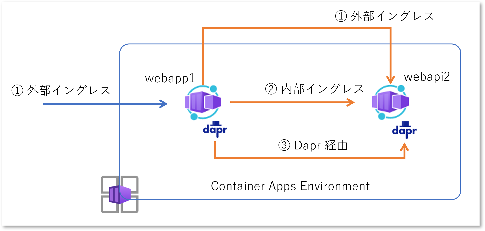
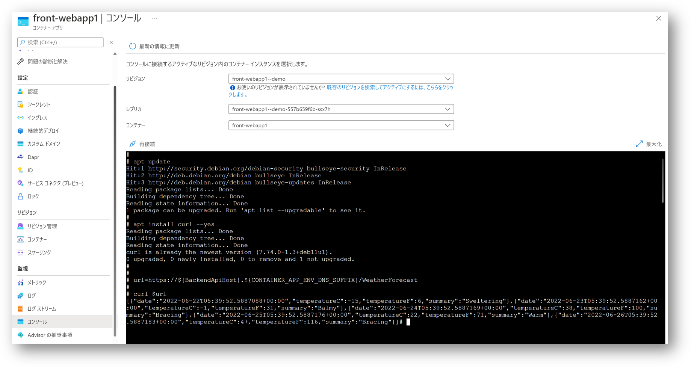
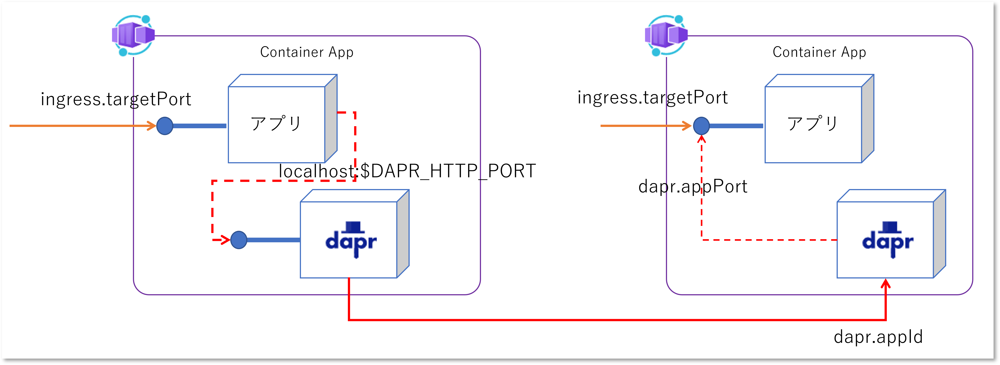

## はじめに

Azure Container Apps を利用して複数のアプリをデプロイしていくと、アプリ間の呼び出しが発生します。
フロントエンドの Web アプリが、バックエンドの Web API を呼び出すようなシナリオです。
もちろんこんなことは出来て当然のことではありますが、実際にやってみた内容を少し整理しておきます。
公式ドキュメントでは下記のあたりが該当します。

- [Azure Container Apps での HTTPS イングレスの設定](https://docs.microsoft.com/ja-jp/azure/container-apps/ingress?tabs=bash)
- [Azure Container Apps でアプリケーションを接続する](https://docs.microsoft.com/ja-jp/azure/container-apps/connect-apps?tabs=bash)



## ① 外部イングレス経由

Container App の外部イングレスを有効にすると、パブリックインターネットから呼び出しだけでなく、もちろん同一環境内にいる別の Container App からも呼び出すことが出来ます。
ARM テンプレートでは `properties.configuration.ingress` を使用して構成します。
テンプレートの詳細は[こちら](https://docs.microsoft.com/en-us/azure/templates/microsoft.app/containerapps?tabs=bicep)。

```json
{
   "type": "Microsoft.App/containerApps",
   "name": "webapi2",
   "properties": {
      "managedEnvironmentId": "[parameters('containerAppEnvId')]",
      "configuration": {
         "ingress": {
            "external": true,
            "targetPort": "5100",
            "allowInsecure": false,
            "traffic": [
               {
                  "latestRevision": true,
                  "weight": 100
               }
            ]
         },
      }
   }
}
```

この場合 `webapi2` という Container App は以下のような URL でアクセスすることが可能です。


```bash
# 具体例
https://webapi2.happyhill-70162bb9.canadacentral.azurecontainerapps.io
# フォーマット
https://$APP_NAME.$UNIQUE_IDENTIFIER.$REGION_NAME.azurecontainerapps.io
```

が、呼び出し元となる `webapp1` の立場になって考えてみると、URL に含まれる変数部分は事前に決定することが難しことが分かります。

- `$APP_NAME` は Container App としてデプロイする際の Azure リソース名なので、その時に名前が `webapi2` になるとは限らない（開発上の管理名と Azure リソース名がずれる）
- `$UNIQUE_IDENTIFIER` は Container Apps Environment の一意な識別名を表すが、上記の例のように自動生成される値であり Azure リソース名ですらないため、自分がデプロイされるまで分からない
- `$REGION_NAME` はその名の通り Container Apps Environment がデプロイされる Azure リージョンなので、やっぱり自分がデプロイされるまでわからない

さてどうしましょう。

### Container Apps Environment の一意識別子と Azure リージョン

アプリケーションは最初はコンテナレジストリにコンテナイメージとして管理されています。
Azure 上に Container App リソースが作成され、そこでコンテナイメージが指定されて初めて `docker pull` されて `docker run` されて起動するわけです。
その時に初めて自分が動作する Container Apps Environment が分かるわけですから、$UNIQUE_IDENTIFIER と $REGION_NAME は実行時に動的に取得するのが良いでしょう。

適当な Container App を作成して `env` コマンドなどを実行してみるとわかりますが、Container App には自身が設定したモノ以外にも特有の環境変数が設定されます。
以下は `webapp1` というコンテナイメージを `front-webapp1` という名前の Container App としてデプロイして、環境変数を取得した例です。
基本的には自分自身に関する情報しか取れませんが、`CONTAINER_APP_ENV_DNS_SUFFIX` 環境変数がちょうど Container Apps とリージョンの情報が入っていますので、これを使えば良さそうですね。

|Key|Value|
|---|---|
|CONTAINER_APP_ENV_DNS_SUFFIX|jollysmoke-6a87d5ad.japaneast.azurecontainerapps.io|
|CONTAINER_APP_HOSTNAME|front-webapp1--20220621-025045.jollysmoke-6a87d5ad.japaneast.azurecontainerapps.io|
|CONTAINER_APP_NAME|front-webapp1|
|CONTAINER_APP_PORT|5000|
|CONTAINER_APP_REVISION|front-webapp1--20220621-025045|


Kubernetes の場合にはサービスを作成すると、各 Pod 環境変数や DNS に自動的に値が登録されるので、そちらを利用して依存関係となる API を呼び出すことも出来るのですが Container Apps の場合にはその手は使えません。

### バックエンド API のホスト名

さてこちらはバックエンド API を Container App としてデプロイするときに決まるわけですが、フロントのアプリと一緒にデプロイされるのか、別々にデプロイされるのか、別々だとしてもどっちが先かも分かりません。
このためフロント側の Web アプリは環境変数から読み取るように作っておいて、実行環境でも書き換え可能にしておくようにすると良いでしょう。

フロントとバックエンドの二つのアプリを同時にデプロイするときは、下記のように ARM テンプレート内で名前を合わせてしまえばよいわけですね。
同時ではない場合は、下記のテンプレートからバックエンド API のリソースの記述を削除しつつ、やはりテンプレートパラメタとして バックエンド API の名前を渡す作りにしておけば良いでしょう。

```json
{
   "parameters" : {
      "frontAppName" : { "type": "string", "defaultValue": "front-webapp1" },
      "backendAppName" : { "type": "string", "defaultValue": "backend-webappi2" }
   },
   "resources" : [
      {
         "type": "Microsoft.App/containerApps",
         "name": "[parameters('frontAppName')]",
         "properties" : {
            "managedEnvironmentId": "[parameters('containerAppEnvId')]",
            "configuration" : {
               "ingress": {
                  "external": true, "targetPort": "5000", "allowInsecure": false
               }
            },
            "template": {
               "containers" : [
                  {
                     "image": "registry.server.io/webapp1:v1",
                     "env" : [
                        { "name":"BACKEND_API_HOST", "value":"[parameters('backendAppName')]"}
                     ]
                  }
               ]
            }
         }
      },
      {
         "type": "Microsoft.App/containerApps",
         "name": "[parameters('backendAppName')]",
         "properties" : {
            "managedEnvironmentId": "[parameters('containerAppEnvId')]",
            "configuration" : {
               "ingress": {
                  "external": true, "targetPort": "5100", "allowInsecure": false
               }
            },
            "template": {
               "containers" : [
                  {
                     "image": "registry.server.io/webapi2:v2",
                     "env" : [ ]
                  }
               ]
            }
         }
      }
   ]
}
```

### URL を作成して呼び出してみる

以上がそろえば後はアプリ内で文字列を結合してやれば良いですね。
C# だと下記のような感じでしょうか。(WeatherForcast API を呼び出しています)

```c#
var webapiHost = Environment.GetEnvironmentVariable("BACKEND_API_HOST");
var dnssuffix = Environment.GetEnvironmentVariable("CONTAINER_APP_ENV_DNS_SUFFIX	");
var url = $"https://{webapiHost}.{dnssuffix}/WeatherForecast"

// 任意の HTTP ライブラリで呼び出し
var result = await _httpClient.GetAsync(url);
```

Shell の場合は下記の様な組み立てになります。

```bash
$ url=https://${BACEND_API_HOST}.${CONTAINER_APP_ENV_DNS_SUFFIX}/WeatherForecast
$ curl $url
```

試しにコンテナのコンソールに接続して実行してみましょう。




## ② 内部イングレス経由

API が単体で外部公開するようなモノでないならば、Container App 環境外部から呼び出すことなく、環境内部での使用になると思います。
その場合のイングレスの構成は下記のようになります。
`properties.configuration.ingress.external = false` に設定しています。

```json
{
   "type": "Microsoft.App/containerApps",
   "name": "[parameters('backendAppName')]",
   "properties": {
      "configuration": {
         "ingress": {
            "external": false,
            "targetPort": "5000",
            "allowInsecure": false,
            "traffic": [
               {
                  "latestRevision": true,
                  "weight": 100
               }
            ]
         },
      }
   }
}
```

内部イングレスの場合はドメイン名に `internal` が含まれるようになります。

```bash
# 具体例
https://webapi2.internal.happyhill-70162bb9.canadacentral.azurecontainerapps.io
# フォーマット
https://$APP_NAME.internal.$UNIQUE_IDENTIFIER.$REGION_NAME.azurecontainerapps.io
```

このため方針は特に変わりませんが、環境変数でバックエンド API のホスト名を渡すときに `internal` をつけてしまうのが手っ取り早いでしょうか。

```json
{
   "parameters" : {
      "frontAppName" : { "type": "string", "defaultValue": "front-webapp1" },
      "backendAppName" : { "type": "string", "defaultValue": "backend-webappi2" }
   },
   "resources" : [
      {
         "type": "Microsoft.App/containerApps",
         "name": "[parameters('frontAppName')]",
         "properties" : {
            "configuration" : {
               "ingress": {
                  "external": true, "targetPort": "5000", "allowInsecure": false
               }
            },
            "template": {
               "containers" : [
                  {
                     "image": "registry.server.io/webapp1:v1",
                     "env" : [
                        { "name":"BACKEND_API_HOST", "value":"[concat(parameters('backendAppName'), '.internal')]"}
                     ]
                  }
               ]
            }
         }
      }
   ]
}
```

以降は外部イングレスの場合と変わりありません。
なお、外部イングレスが無効（`ingress.external = false`）の場合は内部イングレスの URL のみが有効ですが、
外部イングレスが有効（`ingress.external = true`）の場合は外部と内部の両方のイングレスの URL が有効です。


## ③ Dapr 経由

Container App で Dapr を有効にすると自動的にサイドカーコンテナが実行され、
[Service Invocation](https://docs.dapr.io/developing-applications/building-blocks/service-invocation/service-invocation-overview/) が利用可能になります。
各アプリケーションは localhost で動作する Dapr コンテナに対して呼び出しを行うと、Dapr がプロキシとして動作して、別のアプリを呼び出してくれるわけです。
この場合はイングレスは不要なので、イングレスを構成していない Container App でも呼び出すことが可能です。



### Dapr の有効化

Dapr を有効にするにはフロントとバックエンド両方の Container App の `properties.configuration.dapr` セクションを追加します。

```json
{
   "parameters" : {
      "frontAppName" : { "type": "string", "defaultValue": "front-webapp1" },
      "backendAppName" : { "type": "string", "defaultValue": "backend-webappi2" }
   },
   "resources" : [
      {
         "type": "Microsoft.App/containerApps",
         "name": "[parameters('frontAppName')]",
         "properties" : {
            "managedEnvironmentId": "[parameters('containerAppEnvId')]",
            "configuration" : {
               "ingress": {
                  "external": true, "targetPort": "5000", "allowInsecure": false
               },
               "dapr" : {
                  "enabled": true,
                  "appId" : "[parameters('frontAppName')]",
                  "appPort" : "5000",
                  "appProtocol" : "http"
               }
            },
            "template": {
               "containers" : [
                  {
                     "image": "registry.server.io/webapp1:v1",
                     "env" : [
                        { "name":"BACKEND_API_HOST", "value":"[parameters('backendAppName')]"}
                     ]
                  }
               ]
            }
         }
      },
      {
         "type": "Microsoft.App/containerApps",
         "name": "[parameters('backendAppName')]",
         "properties" : {
            "managedEnvironmentId": "[parameters('containerAppEnvId')]",
            "configuration" : {
               "ingress": {
                  "external": true, "targetPort": "5100", "allowInsecure": false
               },
               "dapr" : {
                  "enabled": true,
                  "appId" : "[parameters('backendAppName')]",
                  "appPort" : "5100",
                  "appProtocol" : "http"
               }

            },
            "template": {
               "containers" : [
                  {
                     "image": "registry.server.io/webapi2:v2",
                     "env" : [ ]
                  }
               ]
            }
         }
      }
   ]
}
```

各 Container App から Dapr を使用して別の Container App を呼び出すための名前を `dapr.appid` で登録します。
ここでは Container App と同じ名前にしていますが、必ずしも揃える必要はありませんので、管理しやすい名前をつけると良いでしょう。

また `dapr.appPort` は Dapr が代理で呼び出す際にアクセスする、アプリケーションが待ち受けているポートを指定します。
つまり通常は `ingress.targetPort` を使用する場合と同じ値になることが多いのではないでしょうか。

### 通常の HTTP で呼び出す

さてイングレスの場合と同様に、フロント側のアプリからバックエンド側の API を呼び出すにはその URL が必要ですが、
Dapr を使用する場合は Dapr の Invoke API を呼び出すことになります。
Dapr はサイドカーとして動作しているので `localhost` でアクセスできます。
待ち受けポートは既定では 3500 ですが、Dapr を有効化 `dapr.enabled = true` している場合には環境変数 `DAPR_HTTP_PORT` として取得できます。（gRPC で呼び出す場合 `DAPR_GRPC_PORT`）

C# の場合には以下のように URL を組み立てることになります。

```c#
var daprPort = Environment.GetEnvironmentVariable("DAPR_HTTP_PORT");
var backendApiHost = Environment.GetEnvironmentVariable("BACKEND_API_HOST");
var url = $"http://localhost:{daprPort}/v1.0/invoke/{backendApiHost}/method/your-path-of-api"

// 任意の HTTP ライブラリで呼び出し
var result = await _httpClient.GetAsync(url);
```

もちろんコンテナコンソールから curl で呼び出してみることも可能です。

```bash
$ url=http://localhost:${DAPR_HTTP_PORT}/v1.0/invoke/${BACKEND_API_HOST}/method/your-path-of-api
```

### Dapr SDK を使用する

ここまで紹介した方法はどれも通常の HTTP(S) 呼び出しなので、Container App や Dapr の特定のライブラリを使用していません。
通常外部サービスの API を呼び出すための URL 等の情報は設定ファイルや環境変数などに切り出してあるのが普通ですから、
そこを Container App のイングレスな URL にすり替えることもできますし、Dapr API の localhost な URL にすり替えることは容易に可能です。
つまりアプリケーションとしては Container App や Dapr を意識する必要はありません。

ただ前述の通り Dapr API の仕様は若干わかりにくいので、特に問題なければ Dapr の SDK を使用してしまった方が実装は楽になります。
Dapr SDK を使用した C# コードは以下のようになります。

```c#
// リクエスト情報の組み立てだけ SDK を使用する場合
var req = _daprClient.CreateInvokeMethodRequest(HttpMethod.Get, backendApiHost, "WeatherForecast");
var response = await _httpClient.SendAsync(req);

// SDK を使用しない場合と同じように url を取得、通常の HttpClient 等のライブラリを使用したい場合
var url = req.RequestUri.ToString()
var response = await _httpClient.GetAsync(url);

// 呼び出しとデシリアライズ Dapr SDK で実行する場合
var result = await _daprClient.InvokeMethodAsync<IEnumerable<WeatherForecast>>(HttpMethod.Get, backendApiHost, "WeatherForecast");
```

アプリケーションとしてのポータビリティを重視するか、あるいは Container App や Dapr といったようなプラットフォームに依存してしまって開発生産性を重視するかは悩ましいところです。


