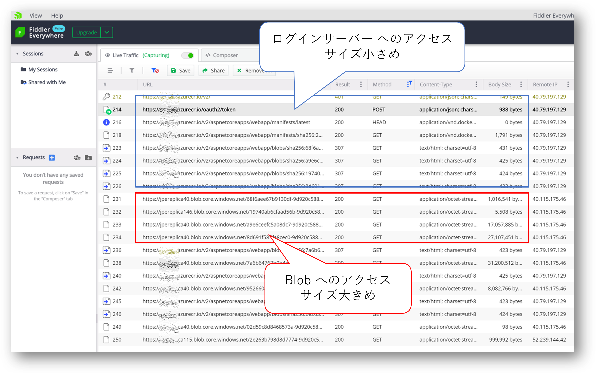
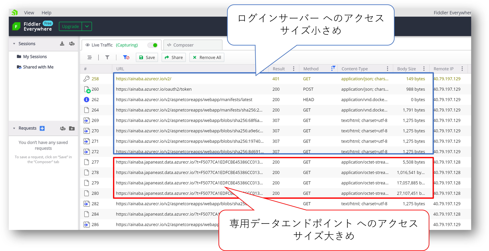
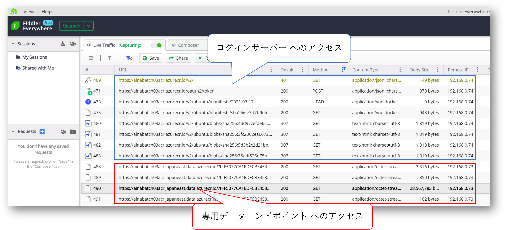

## はじめに

ACR : Azure Container Registry への通信周りでいろいろトラブルがあったので、
[Fiddle を使ってネットワークキャプチャを取得](../capture-docker-daemon-traffic-with-fiddler)
する機会があり、この記事はその副産物です。
すでにもう 1 年くらい前になるのですが、
[ACR の専用データエンドポイント](https://azure.microsoft.com/ja-jp/blog/azure-container-registry-mitigating-data-exfiltration-with-dedicated-data-endpoints/)
が提供されたことで、ネットワーク通信制御がやりやすくなっています。
ということで、データエンドポイントの設定を変えたときの通信ログが取れたので、その際の記録になります。

## まずは既定の挙動

下図はデータエンドポイント関連には特に何も設定していない ACR に対して `docker pull` をした状況です。
まず序盤でログインサーバー ***acrName*.azurecr.io** への通信が走ります。
最初に **HTTP 401 Unauthorized** エラーが出た後で、
アクセストークンを取得、
それを使っておそらくメタデータなどを取りに行っているところでしょうか。
その後でデータエンドポイントにアクセスして、実際にレイヤーイメージを取得していきます。



ここではデータエンドポイントの URL が **hogefuga.blob.core.windows.net** になっているのが分かります。
実施のレイヤーイメージであるバイナリ(**ContentType: application/octet-stream**)は Azure Blob Storage からダウンロードしているわけです。
この Blob 自体は ACR が内部的に管理しているストレージアカウントにですので、
ユーザー視点で見れば全く知らないエンドポイントへ通信していることになり、
これがネットワークセキュリティに厳しい環境だと問題になりがちです。
ストレージアカウントの FQDN 名も IP アドレスも事前にわからないわけですから、Firewall のルールを構成するとなると **Azure Storage Account への送信を全部許可** というとっても開けっ広げなルールになってしまいます。

## 専用データエンドポイントを有効にした場合

では、専用データエンドポイントを構成するとどうなるでしょうか。
Azure Portal の設定画面を見ればわかるのですが、
データエンドポイントの FQDN が ***acrName.regionName*.data.azurecr.io** となります。
下記が実際の通信ログになります。
序盤は有効にする前と同じですが、途中から Blob ではなく専用データエンドポイントへの通信が走っていることが分かります。



このデータエンドポイントの FQDN 名を `nslookup` で調べると以下のような結果になります。
名前と IP アドレスが確認できますので、これであれば Firewall ルールを構成することも可能でしょう。

```powershell
❯ nslookup acrName.japaneast.data.azurecr.io

サーバー:  UnKnown
Address:  2001:c90:8226:4241:6ab:18ff:fe45:7a63

権限のない回答:
名前:    d0223jpe.japaneast.cloudapp.azure.com
Address:  40.79.197.128
Aliases:  acrName.japaneast.data.azurecr.io
          jpe-0.data.azcr.io
          jpe-acr-dp.trafficmanager.net
```

なおここで得られたIPアドレスは、ACR のサービスタグに含まれることが分かります。
つまり（構成した覚えのない） Blob に対してではなく、
あくまでも意図した ACR への通信ということになりますので、納得感もあるのではないでしょうか。

```powershell
> .\find-azure-service-tag.exe --ip 40.79.197.128

40.79.197.128 is in 40.79.192.0/21 (AzureCloud)
40.79.197.128 is in 40.79.192.0/21 (AzureCloud.japaneast)
40.79.197.128 is in 40.79.197.128/25 (AzureContainerRegistry)
40.79.197.128 is in 40.79.197.128/25 (AzureContainerRegistry.JapanEast)
```

## プライベートエンドポイントを有効にした場合

上記の例はあくまでもパブリック IP アドレス空間での通信になりますが、
ACR は[プライベートエンドポイント経由でアクセスする](https://docs.microsoft.com/ja-jp/azure/container-registry/container-registry-private-link)ことも可能です。
これを構成するとログインサーバー（***acrName*.azurecr.io**）とデータエンドポイント（***acrName.regionName*.data.azurecr.io**）の両方に対して仮想ネットワーク内のプライベート IP アドレスを用いて接続することが可能になります。
つまりアクセス元が仮想ネットワークであるか、仮想ネットワークと VPN や ExpressRoute 等で接続されたオンプレミスネットワーク環境のみに限定できるのであれば、パブリックアクセスそのものが不要になりますので、専用データエンドポイントの構成も不要でしょう。

下記が実際の通信ログになります。
アクセスパターンは専用データエンドポイントと同様ですが、`Remote IP` がプライベート IP アドレスになっているのがわかります。



さてプライベートエンドポイントが利用できる Azure 仮想マシンからこのデータエンドポイントを調べると以下のようになります。

```powershell
> nslookup acrName.japaneast.data.azurecr.io

Server:  UnKnown
Address:  168.63.129.16

Non-authoritative answer:
Name:    acrName.japaneast.data.privatelink.azurecr.io
Address:  192.168.0.73
Aliases:  acrName.japaneast.data.azurecr.io
```

仮想ネットワークの[既定の DNS サーバー](https://docs.microsoft.com/ja-jp/azure/virtual-network/what-is-ip-address-168-63-129-16) 、
より正確にはそこに接続された Azure DNS プライベートゾーンが
privatelink の DNS 名とプライベート IP アドレスに解決してくれています。

## 両方構成したらどうなるのか

専用データエンドポイントとプライベートエンドポイント、どちらを構成した場合もデータエンドポイント名は同じ ***acrName.regionName*.data.azurecr.io** になります。
これ両方とも有効にした場合はどうなるんでしょうか。

結論から言えばプライベートエンドポイントへの名前解決をしてくれる DNS がいない限りは、パブリック IP アドレスに解決されました。

以下は Azure 外のクライアントからの名前解決になります。
専用データエンドポイントのみを構成した場合とは ACR の PrivateLink 名がエイリアスに含まれる点が異なりますが、それはパブリック IP アドレスに解決されますので挙動事態は変りません。

```powershell
> nslookup acrName.japaneast.data.azurecr.io

サーバー:  UnKnown
Address:  2001:c90:8226:4241:6ab:18ff:fe45:7a63

権限のない回答:
名前:    d0223jpe.japaneast.cloudapp.azure.com
Address:  40.79.197.128
Aliases:  acrName.japaneast.data.azurecr.io
          acrName.japaneast.data.privatelink.azurecr.io
          jpe-0.data.azcr.io
          jpe-acr-dp.trafficmanager.net
```

以下はプライベートエンドポイントが有効な仮想ネットワークに配置された仮想マシンからの名前解決です。
こちらも PrivateLink の FQDN の名前がプライベート IP アドレスに解決されるので挙動は変りません。

```powershell
> nslookup ainabatch03acr.japaneast.data.azurecr.io

Server:  UnKnown
Address:  168.63.129.16

Non-authoritative answer:
Name:    ainabatch03acr.japaneast.data.privatelink.azurecr.io
Address:  192.168.0.73
Aliases:  ainabatch03acr.japaneast.data.azurecr.io
```

そりゃそうか、という結果でした。

