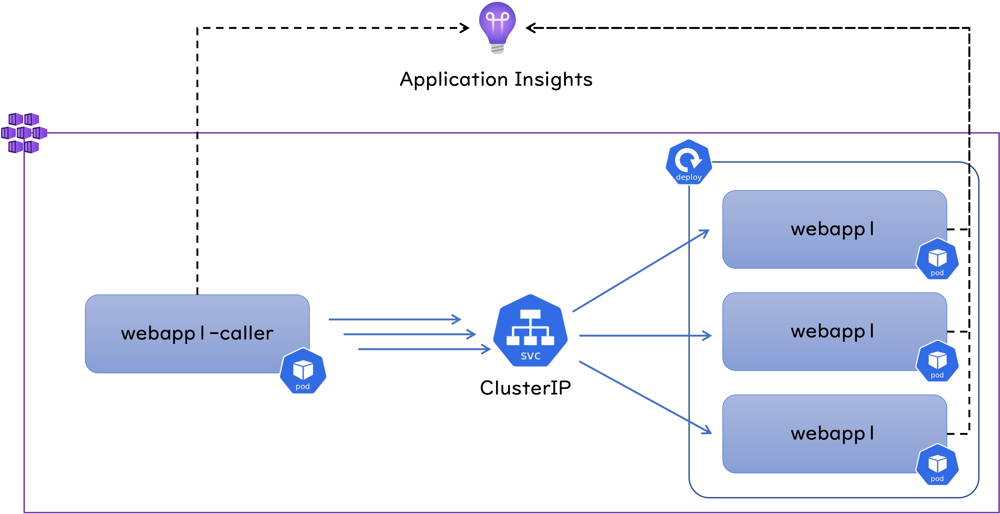

## はじめに

AKS : Azure Kubernetes Service 上で動作する Web アプリを Cluster IP で負荷分散させたところ、特定の Pod に負荷が偏るというお話を聞いたので検証してみました。
結論からいうと Cluster IP は L4 レベルでの負荷分散を行いますので、呼び出し元となる Pod 内部のアプリケーションが TCP コネクションを再利用する作りになっていると、全ての HTTP リクエストが同じ Pod に飛んでいくことになります。
なのでおそらく Azure は関係なく、どこの Kubernetes 環境でも再現する事象だと考えられます。
また細かい挙動は実装する言語や HTTP 呼び出しに利用するライブラリに依存すると思いますが、私は .NET 6 で試してみました。
以下は検証に利用した環境です。



`webapp1` というアプリケーションは `dotnet new webapp` で作成したほぼテンプレートのままの状態の ASP .NET Core な Web アプリなのですが、
リクエストの処理状況を把握したかったので [Application Insights による監視](https://docs.microsoft.com/ja-jp/azure/azure-monitor/app/asp-net-core)を組み込んでいます。
`webapp1-caller` というアプリケーションは `webapp1` を呼び出すための、コンソールアプリケーションで、
こちらも [Application Insights による監視](https://docs.microsoft.com/ja-jp/azure/azure-monitor/app/worker-service)を組み込んでいます。
後述のようにこちらのコードの記述内容によって負荷分散の挙動が変わってきます。

## Web アプリのデプロイ

まずは `webapp1` と ClusterIP をデプロイしておきます。
上の図では Pod を３つだけ記載していますが、ここでは Replicas = 5 で Deploymet を作成しています。

```bash
$ kubectl get all -o wide
NAME                                  READY   STATUS    RESTARTS   AGE     IP            NODE                                NOMINATED NODE   READINESS GATES
pod/webapp1-deploy-6d87457dbc-2w55b   1/1     Running   0          2m10s   10.244.13.3   aks-nodepool1-20608327-vmss00000g   <none>           <none>
pod/webapp1-deploy-6d87457dbc-448cv   1/1     Running   0          2m10s   10.244.12.3   aks-nodepool1-20608327-vmss00000j   <none>           <none>
pod/webapp1-deploy-6d87457dbc-44j8c   1/1     Running   0          2m10s   10.244.10.3   aks-nodepool1-20608327-vmss00000c   <none>           <none>
pod/webapp1-deploy-6d87457dbc-4qq9n   1/1     Running   0          2m10s   10.244.14.3   aks-nodepool1-20608327-vmss00000f   <none>           <none>
pod/webapp1-deploy-6d87457dbc-7vbq6   1/1     Running   0          2m10s   10.244.18.3   aks-nodepool1-20608327-vmss00000k   <none>           <none>

NAME                        TYPE        CLUSTER-IP   EXTERNAL-IP   PORT(S)   AGE     SELECTOR
service/kubernetes          ClusterIP   10.0.0.1     <none>        443/TCP   45h     <none>
service/webapp1-clusterip   ClusterIP   10.0.121.0   <none>        80/TCP    2m10s   app=webapp1

NAME                             READY   UP-TO-DATE   AVAILABLE   AGE     CONTAINERS          IMAGES                              SELECTOR
deployment.apps/webapp1-deploy   5/5     5            5           2m10s   webapp1-container   acrname.azurecr.io/webapp1:0420a   app=webapp1

NAME                                        DESIRED   CURRENT   READY   AGE     CONTAINERS          IMAGES                              SELECTOR
replicaset.apps/webapp1-deploy-6d87457dbc   5         5         5       2m10s   webapp1-container   acrname.azurecr.io/webapp1:0420a   app=webapp1,pod-template-hash=6d87457dbc
```

出来上がった ClusterIP を試しに curl で叩いてみます。

```bash
$ kubectl run ubuntu -it --rm --image ubuntu /bin/bash

$ apt update
$ apt install curl --yes

$ curl http://webapp1-clusterip.default.svc.cluster.local
<!DOCTYPE html>
<html lang="en">
<head>
    <meta charset="utf-8" />
    <meta name="viewport" content="width=device-width, initial-scale=1.0" />
    <title>Home page - webapp1</title>
    # 以下略
```

無事に動いていそうなので、このまま Ubuntu コンテナから負荷をかけてみましょう。

```bash
$ while true; do curl --silent http://webapp1-clusterip.default.svc.cluster.local > /dev/null ; done
```

`webapp1` には Application Insights が仕込まれているので、ライブメトリックで負荷の状況を表示することが可能です。
全体では 74 RPS 程度出ていますが、5 つの `webapp1` に対して概ね均等に負荷が分散されていることが確認できます。
いい感じですね。 


## HttpClient　を再利用してシングルスレッドで負荷をかける

さてここからが本題ですが、まず初めに最もシンプルな以下のようなコードパターンのクライアントアプリでアクセスをかけてみましょう。
シングルスレッドで HTTP リクエストを発生させていますが、
[HttpClient](https://docs.microsoft.com/ja-jp/dotnet/api/system.net.http.httpclient?view=net-6.0) 
のインスタンスは各呼び出しで新規に生成せずに再利用します。

```c#
var hc = new HttpClient();
while(true)
{
    hc.GetAsync("http://webapp1-clusterip.default.svc.cluster.local");
}
```

実行中の Application Insights メトリックでは以下のように確認できました。
今度は呼び出し元の `webapp1-caller` も Application Insights を仕込んでいますので、HttpClient による `webapp1` の呼び出し頻度も `依存関係`　として監視できています。 
その全リクエストが特定の 1 つの Pod に集中してしまっていることがわかります。


[HttpClient](https://docs.microsoft.com/ja-jp/dotnet/api/system.net.http.httpclient?view=net-6.0) は内部的に接続プールを持っているので、
シングルスレッドで逐次実行すればプール内の同一の接続を使い回すことになるでしょうから、まあこんなものでしょう。

## HttpClient　をスレッドレベルで再利用してマルチスレッドで負荷をかける

それでは先ほどのコードをマルチスレッドで実行してみましょう。
HttpClient は各スレッドごとに１インスタンスずつ使うことになります。
コードとしては以下のようになります。

```c#
//以下を複数回実行
Task.Run(() => {
    var hc = new HttpClient();
    while(true)
    {
        hc.GetAsync("http://webapp1-clusterip.default.svc.cluster.local");
    }
})
```

スレッド数 5 で実行した結果はこちら。
複数のPodにリクエストは分散するようにはなりましたが、全くリクエストを受けていない Pod がいることがわかります。
内部的な内訳を確認するためのログを仕込まなかったので確証はないですが、各スレッドの HttpClient 単位で接続プールを持っていることになりますから、
いくつかのスレッドがたまたま同じ Pod に繋がってそのまま走っている状況だと考えられます。


## HttpClient の生成と破棄を繰り返してシングルスレッドで負荷をかける

さて HttpClient 間違った使い方と言われる「生成と破棄を繰り返すパターン」でやってみましょう。
コードをシングスレッドに戻して、ループの中で HttpClient を使い捨てにします。

```c#
var hc = new HttpClient();
while(true)
{
    using(var hc = new HttpClient())
    {
        hc.GetAsync("http://webapp1-clusterip.default.svc.cluster.local");
    }
}
```

実行した結果はこちら。
いい感じに負荷が分散されていますね。
これが期待した挙動なのかもしれませんが、スループットが 1749[rps] から 66[rps] にガクッと下がっており、CPU 使用率も 69% に 12% ガクッと下がっています。
これはおそらくリクエストの度に新しい TCP 接続を確立する必要があるため、スループット上がらないし CPU も仕事が出来ない状態になっているものと考えられます。
数値的にも実装的にも先ほど curl を無限ループさせた状況に近いですね。


なぜ HttpClient の使い捨てが問題なのかは「[HttpClientをusingで囲わないでください](https://qiita.com/superriver/items/91781bca04a76aec7dc0?msclkid=17edd6c1c1ee11ec9b9f31793850059f)」に詳しく記載がありますので、是非ご一読ください。
こちらの記事では WebApp 内で利用した時に SNAT ポートを使い果たしてしまう原因になることが記載されていますが、そのベースとなるソケットの再利用についても言及があります。


## HttpClient をグローバルに共有してマルチスレッドで負荷をかける

それでは最後に 1 つの HttpClient を複数のスレッドで共有する、つまり単一のコネクションプールを利用する方式でやってみましょう。
ちょっと不安になるコードですが、呼び出している `GetAsync` メソッドはスレッドセーフなので問題ありません。

```c#
var hc = new HttpClient();

//以下を複数回実行
Task.Run(() => {
    while(true)
    {
        hc.GetAsync("http://webapp1-clusterip.default.svc.cluster.local");
    }
})
```

下記は 5 スレッドで実行した結果です。
全スレッドで単一の HttpClient を共有していますが、複数の Pod に負荷が分散されていることがわかります。
ただこれ、まだリクエストを割り振られてない Pod がありますね。接続数が 3 つくらいで足りてしまっているのでしょうか、


スレッド数を２０まで上げてみた結果が下記になります。
まだ均一というほどではないですが、全Podにリクエストが行き渡るようになりました。


## 考察

さて、「負荷が偏る」というと何か問題があるような表現になりますが、これは接続プールが正しく働いた結果であり、実際にその方がスループットも良いことがわかりました。
実際問題としてこれ、どっちがいいんでしょうか。
あまり負荷が偏ってしまうと仕事をしない Pod が Kubernetes クラスターのリソースを確保するだけになってしまうので勿体無いですが、
だからと言って負荷を分散させるために接続プールを使わないように実装して性能を落とすのもナンセンスでしょう。

今回の検証では HttpClient の使い方による挙動の差異を明確にするために、１つの Pod 内のスレッド毎に HttpClient を割り当てたりして挙動を比較してきましたが、
フロント側も Web アプリのようなマルチスレッドで動作するアプリケーションであれば、最後の検証結果のように偏りつつもある程度は分散することが期待できます。
またフロント側も Deployment 等を利用した複数 Pod の構成になるでしょうから、各 Pod 単位で見れば偏っていても、大まかには負荷は分散するのではないかと思います。


それでは最後に各 Pod 内のスレッド数は３まで落とす代わりに、Pod を 7　つデプロイして合計 21 スレッドから負荷をかけた結果です。 
`webapp1` が非常に軽い作りになっているのでトータルで 20000 RPS くらい出ることがわかりました。
最初の方は全然負荷がかけられてなかったことがわかりますね。


## まとめ

今回の結果はまとめるのが難しい内容ではあるのですが、少なくとも L4 の負荷分散である ClusterIP は「割と偏りがち」と言えると思います。
その傾向は実装言語やライブラリにも依存しますし、何より低負荷状態や Pod 数が少ない状況では顕著になると思います。
ただその**偏り**が改善を必要とすべき**問題**なのか否かは個々に判断していく必要がありそうです。

以上、本記事が皆様の参考になれば幸いです。