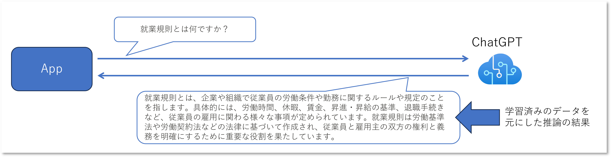

# はじめに

Azure OpenAI Service のご利用を検討いただくお客様で、まず初めに企業内向け Chat や社内文書検索から取り組まれるケースが非常に多いです。
一般的には RAG : Retrieval-Augumented Generation （検索拡張生成）などと呼ばれるような仕組みに該当します。
インターネット上のサンプルも多数提供されるようになっており、情報としてはかなり出そろってきたかなという印象を受けます。

例えば日本マイクロソフトの社員有志が作成・メンテナンスしている下記などが代表的でしょうか。

- https://github.com/ayuina/jp-azureopenai-samples/tree/main/5.internal-document-search

初期のころはこちらも良く紹介していました。

- https://github.com/Azure-Samples/azure-search-openai-demo

これらのサンプルはセットアップを容易にして簡単にデプロイ出来るようになっているため、そのアーキテクチャの中で何が行われているかが若干分かりにくくなっている気がします。
最終的にはサンプルコードを読み込んで理解し、ご自身のアプリケーションの設計や実装の参考としていただくしかないのですが、まずは大まかな仕組みや概念を理解しておいた方が良いかなと思います。

# アーキテクチャ解説

## 素の Azure OpenAI を使用する(検索で拡張しない)場合

まず初めに Azure OpenAI Service だけで回答する例を考えてみます。
Azure OpenAI Service をデプロイした際に利用できる Azure OpenAI Studio アプリケーションで Chat playground でチャットしたものと思ってください。

この例では問い合わせている内容が `「就業規則とは何ですか？」` という割と一般的な内容ですので、それらしい回答が返ってきます。

##

# 良くある質問

ここまでの内容で基本的な仕組みについては解説しましたが、よくお問い合わせをいただく質問をまとめておきます。

## Azure OpenAI Service が社内データを学習しているということですか？

いいえ、学習していません。

検索エンジン等のデータベースから得られた情報を元にプロンプトが生成され、Azure OpenAI Service はそのプロンプトに対する回答を生成しています。
言語モデル自体は既成のものをそのまま使用していますので、[Fine Tuning](https://learn.microsoft.com/ja-jp/azure/ai-services/openai/how-to/fine-tuning?tabs=turbo&pivots=programming-language-studio) とは異なります。

## Azure 外部に格納されたデータを利用できますか？

はい、利用できます。

上記の通り、参考情報となる文字列自体をプロンプトの一部に組み込んで Azure OpenAI Service に送信しているだけですので、その参考情報を取得できる API があれば良いことになります。
この要件が満たせるのならば、もちろん Azure 外部のサービスやデータベースでも構いません。

Azure OpenAI Service の関連ドキュメントや Blog 等では、この参考情報を得るためのデータベースとして以下のサービスが良く紹介されていますが、
これらはキーワード検索、セマンティック検索、ベクトル検索などの機能を提供しており、これらの機能を通じて参考情報を取得可能です。

- [Azure Cognitive Search](https://azure.microsoft.com/ja-jp/products/ai-services/cognitive-search)
- [Azure CosmosDB](https://azure.microsoft.com/ja-jp/products/cosmos-db)
- [Azure Cache for Redis](https://azure.microsoft.com/ja-jp/products/cache)

## Azure Blob Storage に保存されているファイルは利用できますか？

いいえ、直接的には利用できません。

Azure Blob Service は REST API を通じてファイルを取得することができますが、これはファイルの URL を利用してダウンロードできるだけです。
アプリケーションから入力された文言やキーワードを利用して、 **ファイル内の内容を検索することが出来ません** ので、そもそも必要なファイルの URL を特定することが出来ません。
つまり上記の **要件** を満たすことが出来ません。

また、仮に何らかの形で URL を特定できたとしても、Azure OpenAI Service のプロンプトに対してトークン制限がかかることに注意が必要です。
この [トークン制限はモデルによって異なりますが](https://learn.microsoft.com/ja-jp/azure/ai-services/openai/quotas-limits)、
現状では `gpt-4-32k` を使用しても 32,768 トークンまでしか受け付けてくれません。

一方ブロック Blob は最大で約 2TB までの任意のサイズのファイルを保存可能なオブジェクトストレージです。
ダウンロードした Blob のサイズが大きいと、そのコンテンツだけでトークン制限に引っかかってしまうことになります。
このため前述のアーキテクチャでは一定サイズに分割した **チャンク** データを生成し、これを Cognitive Search のインデックスに個別に登録しておくことで、検索結果として取得できるデータのサイズを制御しています。

