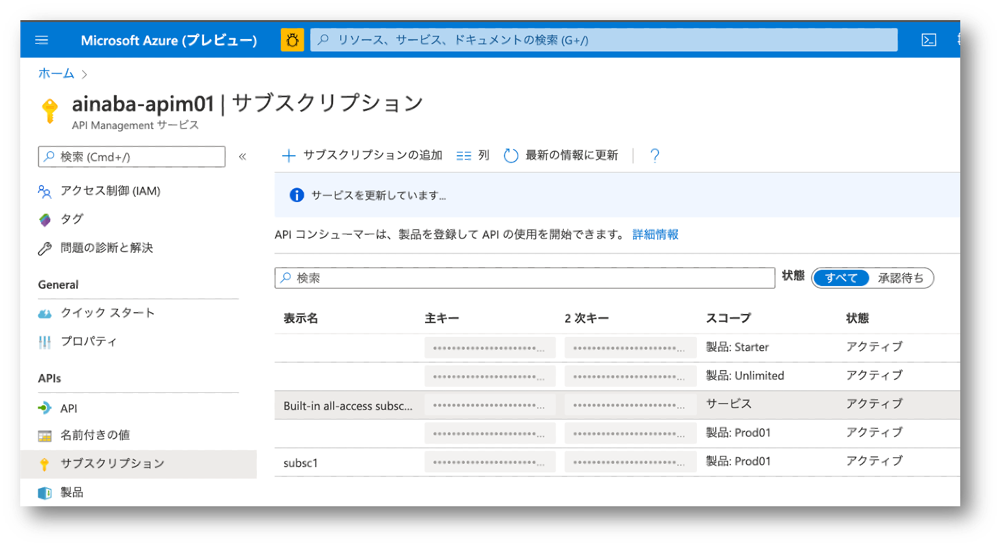

## はじめに

API Management の 
[Self-Hosted Gateway](https://docs.microsoft.com/ja-jp/azure/api-management/self-hosted-gateway-overview)
が出たので試してみました、という記事です。
本番環境で運用するのであれば可用性の考慮は必須なので Kubernetes 上でホストすべきなのですが、
ゲートウェイ自体は Linux ベースの Docker Container として提供されているので、Azure である必要はなく、Linux でも Windows でも、もちろん Mac でも動作します。
現在の私の作業マシンが Mac なので Mac 上で動作させてみましたが、Docker 環境さえ整っていればどの OS を使っても変わらないと思います。
良い時代になったものですね。

## 環境構築

環境の構築自体は極めて簡単で、
[こちら](https://docs.microsoft.com/ja-jp/azure/api-management/api-management-howto-provision-self-hosted-gateway)
と
[こちら](https://docs.microsoft.com/ja-jp/azure/api-management/how-to-deploy-self-hosted-gateway-docker)
の手順に従っていけば特に迷うことは無いとおもいます。


おおまかには以下のような感じですね。

- 適当な名前をつけてゲートウェイを登録する
- そのゲートウェイのインスタンスを実行するための情報を取得する
- 既に API 定義があるならば、このゲートウェイで動作するように追加しておく（これは後ほど）

今回は Docker コンテナとして動作させるので、環境情報が記載されたファイル `env.conf` をダウンロードして、指定された docker コマンドを実行するだけです。

```bash
docker run -d -p 80:8080 -p 443:8081 --name myshgw --env-file env.conf mcr.microsoft.com/azure-api-management/gateway:latest
```

このコマンドからは、ゲートウェイのインスタンスは HTTP を 8080 ポートで、HTTPS を 8081 ポートで Listen しており、コンテナホストのそれぞれ 80 と 443 にマッピングさせようとしていることが読み取れます。
このまま実行してしまってもよいのですが、Backend API が無いとつまらないので先にそちらを用意していきます。（ゲートウェイの動作検証だけなら Echo でもいいのですが）

## Backend API の準備

API は何で作ってもいいのですが、せっかくマルチプラットフォームな Gateway を動かすので、やはりマルチプラットフォームな ASP.NET Core で作りたいと思います。
まあ最終的にはこれも Docker コンテナに入れてしまうのであまり意味はないのですが。
（他の実装方法に詳しくないだけ）

```bash
mkdir sample-api
cd sample-api
dotnet new webapi
```

このままでも動作しますが HTTPS の自己署名証明書が面倒なので、`Startup.cs` に含まれる HTTPS に強制リダイレクトする処理を除去します。

```csharp
    //app.UseHttpsRedirection();
```

それでは動作確認です。
コードを1行も書いてないのですが、作成時のテンプレートに WeatherForecast という API が既に実装されてますのでとりあえずコレで。


```bash
dotnet run
# ビルドが正常終了して実行開始すると、 port 5000 で待機しているよ、というようなメッセージが表示されたら別のターミナルから
curl http://localhost:5000/WeatherForecast
```

JSON 的なレスポンスが帰ってくれば OK です。

## ゲートウェイ実行環境の構成

（まだ実行してませんが）セルフホストゲートウェイのコンテナへのリクエストを、先ほど作った Web API に対してルーティングしてやればいいのですが、
せっかくコンテナホスト（作業マシン）から分離されたゲートウェイから発信されるリクエストを、コンテナホスト上で動作する Web API にルーティングするのは好ましく無い気がします。
というわけで Web API もコンテナ化してしまい、既定のブリッジネットワークでは無く、この検証専用のユーザー定義ネットワークを作成していきます。


まず Web API をコンテナ化していきます。

```dockerfile
## Web API のビルドと発行
FROM mcr.microsoft.com/dotnet/core/sdk:3.1 AS builder
WORKDIR /src
COPY . .
RUN dotnet publish -o publish

## Web API の実行コンテナ
FROM mcr.microsoft.com/dotnet/core/aspnet:3.1 AS runtime
WORKDIR /app
COPY --from=builder /src/publish .
ENTRYPOINT ["dotnet", "sample-api.dll"]
```

コンテナイメージとユーザー定義ネットワークを作成します。

```bash
docker build -t sample-api .
docker network create apinet
```

準備が整ったので各コンテナをユーザー定義ネットワーク上で実行していきます。
ついでにユーザー定義ネットワーク内で動作検証するためのクライアントも実行しておきます。

```bash
docker run -d --name sample-api --network apinet sample-api
docker run -d --name myshgw -p 80:8080 -p 443:8081 --network apinet --env-file env.conf mcr.microsoft.com/azure-api-management/gateway:latest
docker run -it --network apinet ubuntu bash
```

## API Management に API を定義する

では早速 Curl で、と行きたいところですが、API Management は Backend の API である `sample-api` のことを知りませんので、このままではゲートウェイが中継してくれません。
Azure Portal で API を定義します。


- Backend API のホスト名にはコンテナ名で指定する（ゲートウェイも API もユーザ定義ネットワーク内なのでコンテナ名で名前解決できる）
- API Management 上の　URL Suffix を設定する（ゲートウェイには https://api-host-address/suffix でアクセスすることになる）
- Gateway として Self-Hosted Gateway を追加する（登録時の名前が選択できるはず）
- API のオペレーションを追加する（今回利用する `WeatherForecast` であればルートパス `/` に `GET` するだけ）

ここで定義した内容は作業マシン上のコンテナとして動作している Self-Hosted Gateway インスタンスにも自動的に反映されます。

またこのタイミングで API を呼び出すためのサブスクリプションキーも控えておきましょう。



## 動作検証

最後に実行した動作検証用コンテナにはターミナルが接続しますので、まずは内側から動作検証をします。
ユーザー定義ネットワークで実行しているので、各コンテナ間は名前解決ができるはずです。

```bash
# 動作検証用コンテナから WebAPI を直接呼び出し（今回は Dockerfile で指定したコンテナイメージの設定を引き継いで 80 で待機しているはず）
curl http://sample-api/WeatherForecast

# 動作検証用コンテナから Self-Hosted Gateway を呼び出し（-k オプションで証明書エラーを無視）
curl -k -H "Ocp-Apim-Subscription-Key: your-subscription-key" https://myshgw:8081/wf
```

ちゃんと動いていそうなら動作検証用コンテナから抜けて、作業 PC 上のターミナルから最終確認です。

```bash
# 作業マシンのマッピングされたポートをめがけて（-k オプションで証明書エラーを無視）
curl -k -H "Ocp-Apim-Subscription-Key: your-subscription-key" https://localhost/wf
```

最初の開発時と同じような JSON が帰ってくれば成功です。

## まとめ

まさに「試してみた」レベルではあるのですが、API Management 上のポリシーを試行錯誤しつつ、API の実装も調整していく、といったような作業はとても楽になりそうです。
作業マシン上で完結して動作させることができるため、外部からアクセスされるリスクは低いでしょうから、一時的に認証や権限制御などを無効にして作業してしまっても不安がありません。
作業効率を考えるとセキュリティを忘れたくなることがたまによくあるのですが、 Public IP に露出している構成で試行錯誤するにはちょっと勇気が必要ですし、かといってわざわざ VNET 内部に配置するのも面倒ですし。

また Self-Hosted Gateway を本番でも使うなら Kubernetes 上で動作させるわけで、とすれば Web API も Kubernetes 上で動作させるケースが多いのでは無いでしょうか。
（というか Self-Hosted Gateway のためだけに Kubernetes を使うのはちょっとオーバースペックな気がします）
であれば Web API をコンテナ化する作業も無駄にはなりませんね。

以上、参考になれば幸いです。

## 反省

振り返ってみれば Docker Compose でやるのが正しい気もしますが、気力が尽きたのでこのまま記事にしました。

## 蛇足

先の API 定義を作成した図では `Managed` という Gateway にも API の設定がなされています。
また Base URL として `https://apim-name.azure-api.net/wf` という公開された URL からアクセスできるようにも見えます。
インターネットから API Management の既定のゲートウェイ経由で、私の作業マシン上で動作する API がビシバシ呼び出せそうな期待と不安でいっぱいです。
私だけでしょうか。
この記事を書くための検証をやろうと思った動機の8割くらいは実はこの期待と不安だったりします。

なぜかと言えば、オンプレミスからの SSL Outboud 接続をトンネルにすることで、ファイアウォールに穴を開けることなくパブリックインターネットからプライベートネットワークへのルーティングを実現する、という仕組みが Azure にはすごく多いんです。
例えば代表的なものとして以下があげられます。

- Logic Apps や Power BI などで使用される [On-Premises Data Gateway](https://docs.microsoft.com/ja-jp/azure/logic-apps/logic-apps-gateway-install)
- Azure Pipeline の [Self-hosted Agent](https://docs.microsoft.com/en-us/azure/devops/pipelines/agents/agents?view=azure-devops&tabs=browser#install)
- [Azure Relay](https://docs.microsoft.com/ja-jp/azure/azure-relay/relay-what-is-it)
- Azure Active Directory の [Application Proxy Connector](https://docs.microsoft.com/ja-jp/azure/active-directory/manage-apps/application-proxy)
- Windows Virtual Desktop の Session Host 上で動作する Agent

また Azure ではないのですが、 Azure Functions をローカル開発の時によく利用する [ngrok](https://ngrok.com/) のような役割もさせられのかしら、という期待もありました。
と、さんざんリストアップしておいてアレですが、
[Self-Hosted Gateway のドキュメント](https://docs.microsoft.com/ja-jp/azure/api-management/self-hosted-gateway-overview)
には以下のようにあります。

> 1 分ごとのハートビート メッセージ送信による状態の報告
> 構成の更新の、定期的チェック (10 秒ごと) と、入手可能な場合は常に実行する適用
> 要求ログとメトリックの Azure Monitor への送信 (これを行うよう構成されている場合)
> Application Insights へのイベントの送信 (これを行うよう設定されている場合)

管理・監視系以外の用途には使ってないということで一安心。
（最初にドキュメントをちゃんと読めということですね orz）

実際に Azure Portal のテスト画面から API を実行してみるとエラーになります。
まあ API Management の（Self-Hosted でない） Gateway インスタンスから作業マシンに直接ルーティング出来ることは通常ありえないでしょうし、
そもそもコンテナ名のホスト名で名前解決できるわけもありませんね。

