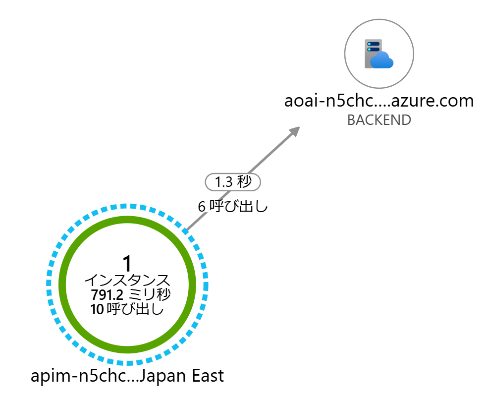
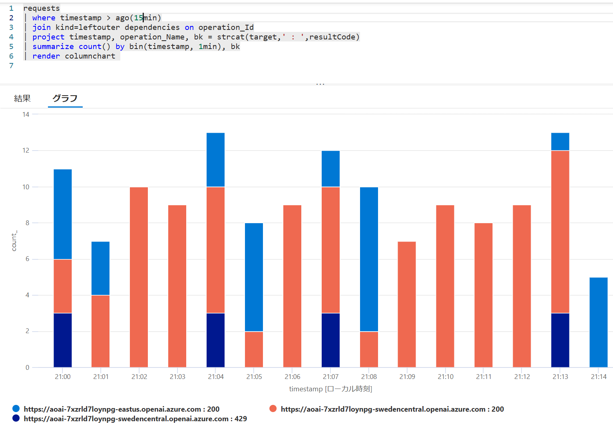

# 概要

以前に [Azure OpenAI Service を API Management 経由で呼び出す構成を自動化する](../landing-pages/apim-aoai-sample/) という記事を書いたのですが、
Microsoft Build 2024 およびその前後の機能アップデートで API Management も大分機能強化が行われました。
現在でも OpenAI を呼び出す際に前段に API Management を挟みたいユースケースというのは変わらずあるのですが、
出来ることが増え、同じことを実現するにも大分楽になってきた印象ですので、ここで新しい記事として書き起こすことにしました。

# APIM が AOAI を呼び出すだけのシンプルなパターン

この先でいくつかのパターンを紹介していくのですが、その際には以下のアーキテクチャを拡張していく形をとります。
API Management の Managed ID を有効にして、Azure OpenAI へはキーを使用せずにアクセスできるようにしつつ、動作確認のためのログ設定をしたものになります。


まずは Log Analytics, Application Insights, API Management を作成してログ周りを設定しておきます。
API Management のログ設定まわりは下記をご参照ください。

- [Azure API Management の監視](https://learn.microsoft.com/ja-jp/azure/api-management/observability)
- [Azure API Management のログや監視にまつわるアレコレ](../monitoring-api-management/)

Managed ID + RBAC の設定周りは下記を参考にしてください。

- [Azure API Management でマネージド ID を使用する](https://learn.microsoft.com/ja-jp/azure/api-management/api-management-howto-use-managed-service-identity)
- [Azure OpenAI Service のロールベースのアクセス制御](https://learn.microsoft.com/ja-jp/azure/ai-services/openai/how-to/role-based-access-control)
- [API Management ID を使用してバックエンドに対する認証を行う](https://learn.microsoft.com/ja-jp/azure/api-management/authentication-managed-identity-policy)


## API Management を Azure OpenAI 互換の API に仕立て上げる

API Management の API 定義は OpenAPI 仕様が利用できますので、
従来は [Azure OpenAI Rest API 仕様](https://learn.microsoft.com/ja-jp/azure/ai-services/openai/reference) をダウンロードして若干のカスタマイズを行って登録していたのですが、
現在は [Azure Portal から簡単に登録することができる](https://learn.microsoft.com/ja-jp/azure/api-management/azure-openai-api-from-specification)
ようになりました。
適当な Azure OpenAI サービスアカウントとモデルをデプロイして、Azure Portal からインポートしていきます。


|インポート画面|インポート結果|
|---|---|
||
|

ドキュメントにも説明がありますが、上図の通りデプロイ済みの Azure OpenAI サービスを指定してインポートする場合には下記の設定が行われます。

- 各 Azure OpenAI REST API エンドポイントの操作が登録される
- Azure OpenAI リソースにアクセスするために必要なアクセス許可が与えられたシステム割り当て ID が設定される
- API 要求を Azure OpenAI Service エンドポイントに送信するバックエンド リソースと set-backend-service ポリシーが設定される
- インスタンスのシステム割り当て ID を使用して Azure OpenAI リソースに対して認証できる authentication-managed-identity ポリシーが設定される


なのですが、ここでいきなりいくつか問題が見えてきます。
問題というか、どこまで気にする必要があるか？というレベルではあるのですが・・・

### 選択できる api-version が非常に限定的

本記事執筆段階では `2022-12-01`, `2023-05-15`, `2024-0201`, `2024-02-01`, `2024-03-01-preview` の 4つしか選択できませんでした。
これ以外のバージョンを登録したい場合は上記の REST API リファレンスから OpenAI 定義をダウンロードしてきて登録してください。
前述のドキュメントにも詳細な手順の説明が記載されています。

> 既定の設定では API Management は api-version やペイロードとなる JSON のフォーマットをチェックしているわけではありません。
> このため単に呼び出すだけならクライアントから別バージョンを呼び出してしまっても動作します。
> ちょっと気持ち悪いですけど・・・

### 全てのオペレーションがインポートされてしまう

インポートされた API 定義を見ていくと、指定した OpenAI および モデルのデプロイメントなどは全く考慮せずに、全ての Operation が定義されていることがわかります。
例えば Azure OpenAI に `gpt-4` モデルの `turbo-2024-04-09` バージョンのみをデプロイしていたとしても、
対応している `Chat Completion` のみならず、 `Completion` や `Embedding` なども API Management に登録されてしまうということです。
当然ながら API Management に対してこれらの操作を呼び出したとしても、転送されたバックエンド側モデルはそんな操作に対応していないのでエラーになります。

このためクライアントに提供する予定のない Operation は削除してしまうか、
以下のように [return-response ポリシー](https://learn.microsoft.com/ja-jp/azure/api-management/return-response-policy)
を使用することで、バックエンドに転送することなく API Management の段階で折り返してしまうとよいでしょう。

まず `All operations` レベルの `inbound` ポリシーでエラー応答を返すように設定し、これを既定の挙動とします。

```xml
<!-- Import 直後の状態 -->
<inbound>
    <set-backend-service id="apim-generated-policy" backend-id="openai-wrapper-openai-endpoint" />
    <authentication-managed-identity resource="https://cognitiveservices.azure.com/" />
    <base />
</inbound>
<!-- 既定ではエラーで折り返す -->
<inbound>
    <inbound>
        <return-response>
            <set-status code="400" reason="Bad Request" />
            <set-body>{
            "error": {
                "code": "OperationNotSupported",
                "message": "Your request operation is not supported"
            }
        }</set-body>
        </return-response>
    </inbound>
</inbound>
```

次にバックエンドに転送してよい Operation、例えば GPT 3.5 Turbo モデルがデプロイされているようであれば Chat Completion Operation のみの `inbound` ポリシーで以下のように設定します。

```xml
<!-- Import 直後の状態 -->
<inbound>
    <base />
</inbound>
<!-- この Operation のみを転送する -->
<inbound>
    <set-backend-service id="apim-generated-policy" backend-id="openai-wrapper-openai-endpoint" />
    <authentication-managed-identity resource="https://cognitiveservices.azure.com/" />
</inbound>
```

## API Management ログの確認

さて Application Insights のログを設定して動作確認をしてみましょう。
All operations レベルの設定で Applicaiton Insights ロガーを設定しておくと、全ての Opearation に対するリクエストおよびバックエンドの転送を監視できます

前述のような設定（デフォルトはエラーで、Chat Completion のみ転送）をしておくと、Application Insights のアプリケーション マップ（あるいは dependency テーブルのログ）ではエラーが確認できませんが、requests テーブルを参照するとどの Operation リクエストが成功（失敗）したのかがわかります。
Chat Completion 以外はバックエンドに転送されておらず、API Management でエラーとして折り返すように設定できていそうです。

|アプリケーション マップ|request テーブル|
|---|---|
|||


# 様々なリージョンにデプロイされたモデル呼び出しのエンドポイントを集約する

バックエンドの Open AI が 1 つだけでは寂しいので、複数の OpenAI をデプロイしつつ API Management に集約したいのですが、これにはいくつかのパターンが考えられます。

- [様々なリージョンにデプロイされたモデルを呼び分ける（ファサード）](#様々なリージョンにデプロイされたモデルを呼び分けるファサード)
- [複数のリージョンのクォータを束ねてスロットリングを回避する（負荷分散）](#複数のリージョンのクォータを束ねてスロットリングを回避する負荷分散)
- [メインのデプロイでクォータが不足したら別のリージョンも使う（バースト）](#メインのデプロイでクォータが不足したら別のリージョンも使うバースト)

## 様々なリージョンにデプロイされたモデルを呼び分ける（ファサード）

[Azure OpenAI Service モデル](https://learn.microsoft.com/ja-jp/azure/ai-services/openai/concepts/models)
は提供されているリージョンによってバラツキが多く、
利用したい機能（API Operation）に応じて様々なリージョンに Azure OpenAI アカウントとモデルをデプロイしていく必要があります。
アカウントごとにエンドポイントと API キーが異なりますので、大変なのはそれを管理するクライアントアプリとセキュリティの管理者です。
Azure OpenAI の API キーに関しては前述のとおり Managed ID を使用することでキー管理の問題を回避することが可能です。
ただエンドポイント URL だけはどうしようもありませんので、ここを API Management に集約できないでしょうか。


これは API Management に登録された各々の Operation ごとにバックエンドとなる Azure OpenAI のエンドポイントを切り替えてあげればよいわけです。
一番初めに All Opeartion レベルの `inbound` ポリシーでエラーを返すように設定し、Chat Completion Operation のみ `set-backend` ポリシーと `authentication-managed-identity` で認証設定を行いましたので、同じように構成していきます。

- Completion
    - Instruct モデルが利用可能な Azure OpenAI サービスアカウントを作成、モデルをデプロイする
    - API Management の Managed ID に対して Azure Cognitive Service OpenAI Contributor 等の必要なロールを割り当てる
    - そのエンドポイント URL (https://_accountName_.openai.azure.com/openai) を API Management のバックエンドに登録する
    - Completion Operation の inbound ポリシーで set-backend ポリシーで切り替える
- Image Generation
    - DALL-E モデルが利用可能な Azure OpenAI サービスアカウントを作成、モデルをデプロイする
    - API Management の Managed ID に対して Azure Cognitive Service OpenAI Contributor 等の必要なロールを割り当てる
    - そのエンドポイント URL (https://_accountName_.openai.azure.com/openai) を API Management のバックエンドに登録する
    - Image Generation の Operation の inbound ポリシーで set-backend ポリシーで切り替える

API Management の System Assingned Managed ID に対して各 OpenAI アカウントに対してロールを割り当てると以下のようになります。


API Management では以下のように各 Azure OpenAI サービス アカウントの URL を登録してきます。


各 Operation の inbound ポリシーの例は以下のようになります。
利用するバックエンドが異なるだけで、`authentication-managed-identity` ポリシーの設定値は変わりません。

```xml
<!-- Image Generation Operation の場合 -->
<inbound>
    <set-backend-service id="imggen-backend-policy" backend-id="imggen-backend" />
    <authentication-managed-identity resource="https://cognitiveservices.azure.com/" />
</inbound>
<!-- Completion Operation の場合 -->
<inbound>
    <set-backend-service id="completion-backend-policy" backend-id="completion-backend" />
    <authentication-managed-identity resource="https://cognitiveservices.azure.com/" />
</inbound>

```

ログを確認すると API Management に登録された Operation 毎にバックエンドの Azure OpenAI エンドポイントが切り替わっていますので、ちゃんとファサードの役割を果たせていそうです。

|Application Map|request - dependency|
|---|---|
|||


## 複数のリージョンのクォータを束ねてスロットリングを回避する（負荷分散）

[Azure OpenAI Service モデル](https://learn.microsoft.com/ja-jp/azure/ai-services/openai/concepts/models)
には各々
[既定のクォータ制限](https://learn.microsoft.com/ja-jp/azure/ai-services/openai/quotas-limits)
が設定されており、実運用レベルの要求スループットに対して不足する場合があります。
このクォータを引き上げること自体は可能なのですが、需要が殺到している現在、必ずしも引き上げ要求が承認されるとは限りません。
このクォータはサブスクリプション、リージョン、モデル単位に設定されていますので、逆に言えばあるリージョンでスループットが足りなければ、別のリージョンないしは OpenAI をデプロイして利用すれば、まだ使用していないクォータを活用することが出来るわけです。

OpenAI を呼び出すアプリケーションが複数のエンドポイントを管理して、ラウンドロビン等の適当なアルゴリズムで呼び分けてしまってもよいのですが、この処理はアプリケーションとして本来注力したい機能ではないでしょう。
API Management にやらせてしまうことで、アプリケーション側は通常の OpenAI 呼び出し方法のまま、エンドポイントを API Management に向けてあげれば良いことになります。


まず前述のファサードとは異なり、複数のリージョンに対して同じモデル（上図の例では GPT4 Turbo with Visioin の Preview 版）をデプロイしていくわけですが、この時「モデルのデプロイメント名」をそろえることが重要です。

> もしどうしてもここが揃えられない場合はポリシー設定で 
> [URL の書き換え](https://learn.microsoft.com/ja-jp/azure/api-management/rewrite-uri-policy) が必要になるので、
> 実装は若干面倒になると思います。

これらの Azure OpenAI サービスのエンドポイントに対して負荷を分散させたいわけですが、これには API Management バックエンドの 
[負荷分散 プール](https://learn.microsoft.com/ja-jp/azure/api-management/backends?tabs=bicep)
という機能を利用することが可能です。

- 個々の Azure OpenAI サービスを表すバックエンド（type=='Single'）を登録
- これらのバックエンドを束ねるバックエンド（type=='Pool'）を登録
- Operation の Policy の中で `set-backend-service` を使用してバックエンドプールを指定する

上の図のように３つのバックエンドを束ねるのであれば、Single が 3 つ、Pool が 1 つの計 4 つのバックエンドを作成することになります。
なお本記事の執筆時点では type == Pool のバックエンドは Azure Resource Manager （REST API ないしは ARM/Bicep テンプレート）を使用して作成する必要があります。

```bicep
// 実際の Azure OpenAI の URL を指定する backend を作る
resource backend1 'Microsoft.ApiManagement/service/backends@2023-05-01-preview' = {
  parent: apimanagements
  name: 'backend-aoai-1-for-lb'
  properties: {
    title: 'backend-aoai-1-for-lb'
    type: 'Single'
    protocol: 'http'
    url: 'https://your-account-name.openai.azure.com/openai'
  }
}
// 上記を束ねるプールを作る（３つのバックエンドをラウンドロビン）
resource apimBackendPool 'Microsoft.ApiManagement/service/backends@2023-05-01-preview' =  {
  parent: apiman
  name: 'backend-pool-for-lb'
  properties: {
    title: 'backend-pool-for-lb'
    type: 'Pool'
    pool: {
        services: [
            { id: backend1.id }
            { id: backend2.id }
            { id: backend3.id }
        ]
    }
  }
}
```

下図のように Azure Portal では作成状況だけは確認できますが、URLにはダミー（？）の値が表示されており、編集しようとするとエラーが表示される状態になりますので、編集などはしない方がよいでしょう。


あとはポリシーでバックエンドプールを指定するだけです。
上記の例では GPT-4 Turbo with Vision を想定しているので、Operation としては Chat Completion が該当します。
最初のパターン「API Management を Azure OpenAI 互換の API に仕立て上げる」で、Chat Completion にはインポート時に生成されたバックエンドが指定されていますが、これをバックエンド プールに切り替えます。

```xml
<inbound>
    <set-backend-service id="load-balancing-policy" backend-id="backend-pool-for-lb" />
    <authentication-managed-identity resource="https://cognitiveservices.azure.com/" />
</inbound>
```

設定が終わったら API Management のエンドポイントに向けて何回か Chat Completion を呼び出してみて応答を取得します。
この際の HTTP レスポンス ヘッダーを確認すると `x-ms-region` というヘッダーにリージョンが記載されています。
これはバックエンド側で実際に呼び出された Azure OpenAI が返してきているリージョンですので、
API Management を呼び出すたびに値が変わることが確認できます。

```bash
HTTP/1.1 200 OK
Content-Length: 1245
Content-Type: application/json; charset=utf-8
request-id: d662111d-3169-40aa-b44e-05c2b2f141fc
x-ms-region: Japan East
x-ratelimit-remaining-requests: 9
x-ratelimit-remaining-tokens: 9000
Date: Fri, 28 Jun 2024 12:14:54 GMT
Connection: close
```

Application Insights のアプリケーション マップで確認するとファサードなのか負荷分散なのかわかりにくいのですが、
Kusto クエリを使用してログを確認することで、単一の API Management 上の URL パスに対して、
異なるリージョンの Azure OpenAI が呼び出されていることが確認できます。


### （参考）従来の負荷分散方法について

この バックエンド 負荷分散 プールの機能が追加されるまでは、クォータを束ねる方法としては以下のようなものが採用されてきました。

- L7 負荷分散を利用する（Azure の場合は Application Gateway や FrontDoor が該当）
- DNS 型の負荷分散を利用する（Azure Traffic Manager）
- API Management のポリシーで頑張る（以前の記事を参照）

これらの手法は現在でも利用は可能ですが、特に要件が無ければ API Management の負荷分散プールを利用するのが簡単ではないでしょうか。

### （参考）グローバル スタンダード デプロイメント

本記事執筆辞典ではプレビュー中ではありますが、GPT4 Omni の登場とともに「[グローバル スタンダード](https://learn.microsoft.com/ja-jp/azure/ai-services/openai/how-to/deployment-types#global-standard-preview)」と呼ばれるデプロイの種類が追加されました。
従来からあるスタンダード（いわゆる従量課金）やプロビジョニング スループット（固定金額）のように特定のリージョンのキャパシティのみを使用するのではなく、グローバル スタンダードではトラフィックが内部的に複数のリージョンにルーティングされます。
現状 GPT-4 Omni でしか利用できないのが残念ですが、こちらを使用する場合は前述のように負荷分散の仕組みを構成する必要自体がありません。


## メインのデプロイでクォータが不足したら別のリージョンも使う（バースト）

複数のリージョンを使い分ける理由として、基本的にはメインリージョンを利用するが、クォータが不足したときだけ別のリージョンを利用するというパターンも考えられます。
これが必要になるのはおそらく以下のようなケースが該当するでしょう。

- [プロビジョニングされたスループット（PTU）](https://learn.microsoft.com/ja-jp/azure/ai-services/openai/concepts/provisioned-throughput)を使用しているので、なるべくそちらを利用したい（性能のばらつきが少なく、なるべく使い切らないともったいない）
- Azure OpenAI とクライアントアプリが同じリージョンに存在しており、外部のリージョンを利用することによるレイテンシの悪化が気になる（なるべくリージョン内で閉じたい）

多くの Web API と同様に Azure OpenAI サービスは想定以上の利用があった場合には HTTP 429 Too Many Request というエラーを返します。
これはスタンダードモデルでもプロビジョニング済みスループットモデルでも同じです。
つまりクライアントとしてはメイン Azure OpenAI から 429 エラーを受け取った場合だけ、他のリージョンを呼び出すようにすればよいわけです。


これを実現したい場合は前述の API Management 負荷分散プールに加えて、バックエンドの
[サーキット ブレーカー](https://learn.microsoft.com/ja-jp/azure/api-management/backends?tabs=bicep)を組み合わせることが可能です。
メインとなるバックエンドでは 429 エラーが発生したときにサーキットブレーカーが発動するようにしておき、メインとサブのバックエンドと束ねる負荷分散プールを構成します。
負荷分散のアルゴリズムとしてはラウンドロビンでは意味がないので、メインとサブで優先度を変えてあげます。

```bicep
// サーキットブレーカーを指定したバックエンド（５分間に３回以上 429 が発生したら発動、１分間は使用しない）
resource mainBackend 'Microsoft.ApiManagement/service/backends@2023-05-01-preview' = {
  parent: apimanagements
  name: 'main-backend'
  properties: {
    title: 'main-backend'
    type: 'Single'
    protocol: 'http'
    url: 'https://your-account-name.openai.azure.com/openai'
    circuitBreaker: {
      rules: [
        { 
          name: 'openAiBreakerRule'
          failureCondition: {
            count: 3
            interval: 'PT5M'
            statusCodeRanges: [
              { min:429, max:429 }
            ]
          }
          tripDuration: 'PT1M'
        }
      ]
    }
  }
}
// メインとサブで優先度をずらしたプールを作って束ねる
resource apimBackendPool 'Microsoft.ApiManagement/service/backends@2023-05-01-preview' =  {
  parent: apiman
  name: 'backend-pool-for-burst'
  properties: {
    title: 'backend-pool-for-burst'
    type: 'Pool'
    pool: {
        services: [
            { 
                id: mainBackend.id 
                priority: 1
            }
            { 
                id: subBackend.id 
                priority: 2
            }
        ]
    }
  }
}
```

負荷分散の場合と同様にオペレーションレベルのポリシーでバックエンドプールを指定してあげればよいことになります。
この状態で実際に API Management 経由で繰り返し呼び出してやれば OK です。
消費するトークン量などを調整してうまくメイン側が 429 エラーが出るようにしてやると、３回失敗したのちにサブリージョンに切り替わります。

```bash
264 : 200 from Sweden Central                                                                                           
265 : 200 from Sweden Central                                                                                           
266 : 200 from Sweden Central                                                                                           
267 : 200 from Sweden Central                                                                                           
268 : 200 from Sweden Central                                                                                           
269 : 200 from Sweden Central                                                                                           
270 : 200 from Sweden Central                                                                                           
271 : 200 from Sweden Central                                                                                           
272 : 200 from Sweden Central                                                                                           
error                                                                                                                   
error                                                                                                                   
error                                                                                                                   
276 : 200 from East US                                                                                                  
277 : 200 from East US                                                                                                  
278 : 200 from East US        
```

Application Insights でログを取っているのでそちらも見てみましょう。
ちょっと読み取りにくいのですが、
- （図中オレンジ）通常は swedencentral リージョンから正常に（200）レスポンスが得られています。１分間に１０回くらいです
- （図中の紺色）ただタイミングによっては 429 エラーが３回程度観測されています
- （図中の青色）その後は eastus リージョンを使用していますが、１分程度たつとまた swedencentral を使い始めます



割とあっさり実現できているのですが、難点としては上記の設定のように「一定回数のエラーが発生してから」切り替わるということです。
一般的なベストプラクティスに従ってクライアントがリトライ実装を行っていれば問題ないとは思いますが、
そのリトライも API Management で完結させたい場合は後述の `retry` ポリシーと組み合わせるとよいでしょう。

## （別解）メインのデプロイでクォータが不足したら別のリージョンも使う（バースト）

こちらは以前から利用できていた方式になりますが、
API Management がエラー時のリトライを行う場合には、`backend` policy で 
[retry](https://learn.microsoft.com/ja-jp/azure/api-management/retry-policy)
ポリシーを利用します。
`retry` ポリシーは最初に子要素を実行するため、１回目は `inbound` ポリシーで指定したメインのバックエンドに、
２回目は サブのバックエンドになるように `set-backend-service` を設定します。
ここでは簡単のため、１度だけサブのバックエンドにフォールバックするようにして、そちらがエラーになったら諦めるスタイルにしています。


```xml
<!--最初にメインのバックエンドを指定-->
<inbound>
    <set-backend-service id="instruct-backend-policy" backend-id="main-backend" />
    <authentication-managed-identity resource="https://cognitiveservices.azure.com/" />
</inbound>
<backend>
    <!-- 429 エラーになったら 1 回だけリトライする -->
    <retry condition="@(context.Response.StatusCode == 429)" count="1" interval="0">
        <choose>
            <!-- １回目が失敗した場合には何らかの Body が存在するので、その場合はサブのバックエンドに切り替え -->
            <when condition="@(context.Response.Body != null)">
                <set-backend-service id="sub-instruct-backend-policy" backend-id="sub-backend" />
            </when>
        </choose>
        <!-- All API レベルの backend ポリシーを retry で上書きしてしまうため、明示的に転送ポリシーを指定 -->
        <forward-request buffer-request-body="true" />
    </retry>
</backend>
```

こちらで実施した結果も可視化してみると以下のようになります。
棒グラフのオレンジの方がメインリージョン（swedencentral）で、おおむね 1 分間に 9 件程度は捌けるのですが、それ以上のリクエストはサブリージョン（eastus）の方にリクエストが転送されていることがわかります。

|アプリケーション マップ|ログから生成したグラフ|
|---|---|
|||

この方法の難点はサーキットブレーカーが存在しないため、クオータを消費しきってしまい 429 エラーが発生している最中でも必ず１回はメインリージョンにリクエストが発生し、１度エラーになってからサブリージョン呼び出しにフォールバックすることです。
切り替えの実装自体は前述のサーキットブレーカー方式の方が簡単ですので、そのバックエンドプールに対して 429 時にリトライする方式を組み合わせるのが良さそうです。

### （参考）Powershell で AOAI を呼び出すスクリプト

負荷分散やバーストなど API Management のエンドポイントに何度もリクエストを出さときに、手動でボタンをぽちぽちするのは辛いので、簡単な Powershell スクリプトを組んでみました。

```powershell
$url = "https://${apimName}.azure-api.net/openai/deployments/instruct/completions?api-version=2024-02-01"
$header = @{ 'api-key' = $key; 'Content-Type' = 'application/json' }   
$prompt = '{ "prompt":"むかしむかしあるところに","max_tokens":1000}'
for ($i = 0; $i -lt 2000; $i++) 
{
    $ret = Invoke-WebRequest -Uri $url -Method Post -Headers $header -Body $prompt
    write-host ("{0} : {1} from {2}" -f $i, $ret.StatusCode, $ret.Headers.'x-ms-region'[0]) 
}

# 実行結果(抜粋)
6 : 200 from Sweden Central                                                                                             
7 : 200 from Sweden Central                                                                                             
8 : 200 from Sweden Central                                                                                             
9 : 200 from East US                                                                                                    
10 : 200 from Sweden Central                                                                                            
11 : 200 from Sweden Central                                                                                            
12 : 200 from Sweden Central                                                                                            
13 : 200 from Sweden Central 
```

# 複数のアプリやユーザーが Azure OpenAI を共有する

ここまではバックエンド側を単一の API Management に束ねて１つに見せるアプローチでしたが、
ここからは Azure OpenAI 互換に仕立てた API Management のフロント側で、
様々アプリケーションやユーザーが共有するパターンについて紹介していきます。

（執筆中）


