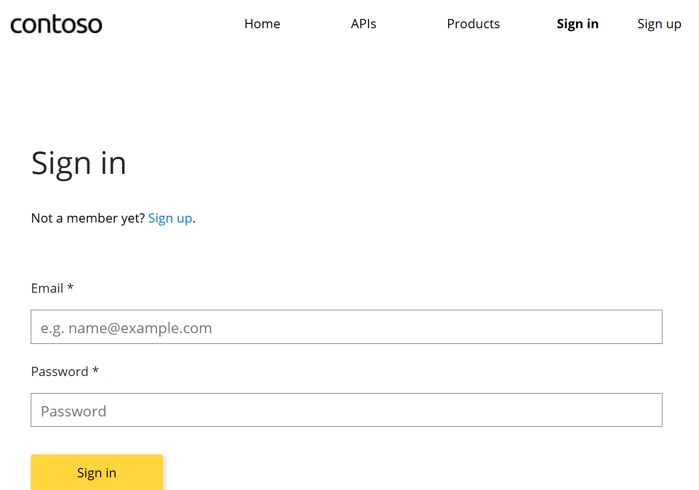

# はじめに

Azure API Management に登録された API を利用するためには、クライアント アプリケーションは通常 [サブスクリプション](https://learn.microsoft.com/ja-jp/azure/api-management/api-management-subscriptions) キーを知っている必要があります。
既定では `Ocp-Apim-Subscription-Key` ヘッダーや `subscription-key` クエリ パラメータとして指定するため、クライアント アプリケーションは API 呼び出し時にこの値をセットしてやる必要があります。
つまり API を活用するクライアント アプリの開発者はこのキーの値を知っていないと開発もテストもままならないわけですが、さてこのサブスクリプションはどうやって発行して管理していくか、という課題があります。
例によってドキュメントに載ってる話ではあるのですが、いくつかオプションがあってわかりにくいので整理してみようと思った次第です。

## アプリや開発者毎にサブスクリプション キー を分ける意味

技術的には全アプリ・全開発者がサブスクリプションを共有し、同一のキーを用いて API を利用することも可能です。
ただしこの場合は以下の問題が発生しますので基本的にはお勧めしません。

- キーが漏洩した際には全クライアントアプリが利用しているキーを速やかに刷新する必要があるが、その通知・設定変更のタイムラグが大きくなる
- API Management 側ではアクセスしてるクライアントの判別が付かないため、利用統計が取れず、アプリ単位でのスロットリングがかけられない

このため複数のアプリや開発者から利用される API の場合には、アプリや開発者単位でサブスクリプションを分けることは必須と考えます。
例えば組織で用意した Azure OpenAI サービスを様々なアプリで共有したいケースでしょうか。
この辺りの背景は [以前の記事](../apim-aoai-pattern/) でも解説しておりますのでご参考まで。
というより本記事はその続きなのですが、OpenAI 固有の話でもないので別にしています。

## 共有キー以外のアクセス制御について

本記事ではサブスクリプション キーを利用した共有キー型のアクセス制御のみをスコープとして記載しております。
セキュリティの観点から言えば OAuth 2.0 などを使用した高度な認証・認可の仕組みを検討すべきとは言えますが技術的にも敷居が高いため、まずは多くの API で採用されている共有キーを用いたアクセス制御に絞って整理していきます。
API Management が対応する OAuth 2.0 を使用した認証・認可の仕組み関しては [こちらのドキュメント](https://learn.microsoft.com/ja-jp/azure/api-management/authentication-authorization-overview) などを参考にしてください。

# API Management の管理者が集中的にサブスクリプションを払い出し管理する

まずは API Management 作成直後から特に追加の構成や設定などなく利用できる方式です。
API Management の管理者であれば登録された個々の API 、すべての API 、あるいは特定の製品に紐付けられた API の呼び出しに利用するサブスクリプションを作成することができます。
作成したサブスクリプションのキーを表示して、クライアント アプリの開発者に何らかの連絡方法で教えてあげればよいわけです。

Azure Portal を使用する場合は以下の画面から操作を行います。

- API Management の `Subscriptions` メニューから
- 登録した `Product` の  `Subscriptions` メニューから


この操作は API Management の管理権限が必要ですので、管理者は当該 API Management リソースに対して、[Owner、Contributor、API Management Service Contributor といった RBAC ロール](https://learn.microsoft.com/ja-jp/azure/api-management/api-management-role-based-access-control) の割り当てが必要になります。

当然このキーの運用（無効化やキーの再生成など）についても管理者が行うことになります。
アプリや開発者が少数の場合、B2B など特定少数向けに API 連携を実現するケースでは問題になりにくいですが、
数が多ければ運用負荷が高まることになりますので、サブスクリプション管理の仕組みを別途作りこむか、後述のセルフサービス型の運用方針を検討するとよいでしょう。

## API Managment 従量課金レベルについて

このあと紹介する「開発者ポータル」は従量課金レベルでは **サポートされていません。**
つまり従量課金を利用したいケースにおいては、このセクションで紹介した管理者による集中管理型のキー管理しか選択肢がないことに注意してください。
API Management のレベルごとにサポートされる機能の比較は[こちらのドキュメント](https://learn.microsoft.com/ja-jp/azure/api-management/api-management-features) を参照してください。

# 開発者ポータルを利用してサブスクリプション管理を開発者セルフサービスにする

[API Managmeent 開発者ポータル](https://learn.microsoft.com/ja-jp/azure/api-management/developer-portal-overview) の機能を有効化することで、上記のキー運用のかなりの部分を開発者側に委任することができます。
この開発者ポータルは Azure Portal とは独立した Web アプリケーションなので、開発者に対して Azure RBAC ロールを割り当てる必要などはありません。
開発者は開発者ポータルを利用することで自分が必要な時に以下の操作を行うことが可能です。
キー管理の仕組みが付いた Swagger UI のようなものと考えるとよいのではないでしょうか。

- API 仕様の確認
- サブスクリプションの作成（キーの表示）
- API の簡易的なテスト実行
- OpenAPI 仕様書のダウンロード

さてセルフサービス化することで発生する課題は「誰が API を利用してよいのか」というアクセス制御になります。
API や製品の可視性、キーの発行といったアクセス制御の根幹になるのがグループと製品です。
開発者（下図では User）は自身が参加するグループが割り当てられた製品に対してサブスクリプションを作成することができますので、要件に応じてこの設定を行うことがアクセス制御になります。
またこの開発者を正しく特定する必要があるわけですから、開発者ポータルにアクセスする際の認証も重要になってくるわけです。


さて以下ではいくつかのシナリオに応じて整理していきたいと思います。

## 未認証ユーザーに対して API の仕様を公開する

開発者ポータルにおいて未認証ユーザーは `Guests` グループに自動的に参加します。
つまり `Guests` グループが割り当てられた製品および製品に割り当てられた API は誰でも存在やその仕様を確認できるということです。
ただしサブスクリプションの作成は認証（Sign-in）が必須ですので、`Guests` ユーザーはキーの発行やテスト呼び出しなどは実施できません。


例えば API Management 作成時には `Echo API` が自動的に登録されており、この APIは `Starter` 製品 および `Unlimited` 製品に登録されており、これらの製品は `Guests` に対してアクセスが許可されています。
このため開発者ポータル有効化直後から上記のように未認証状態で API が確認できる、ということになります。


> 比較的最近の製品レベル（従量課金、BasicV2、StandardV2）では `Echo API, Starter, Unlimited` が登録されていないようです。

### 自分の作成した API も仕様くらいは公開したい

こういったケースでは以下の手順を踏めばよいことになります。
前述の `Starter` や `Unlimited` と同じ状態にしてやればいいわけですね。

- 公開用の「製品」を登録する
- 自分が作成した API をその製品に登録する
- `Guests` グループにその製品へのアクセスを許可する

### 勝手に API や製品見られても困るんだけど・・・

全ての製品から `Guests` グループに対するアクセス許可を除去するか、`Guests` グループのアクセス許可がある製品を削除してしまいましょう。
これは前述の `Starter` や `Unlimited` 製品が該当します。

> 個人的には Echo API や Starter/Unlimited 製品など既定で登録されているモノは運用上は不要です。
> API Management 初学者向けサンプルという位置づけですし、内容が確認出来たらさっさと削除してしまって良いかと思います。

## 認証ユーザーのセルフサービスでサブスクリプションを作成できるようにしたい

開発者ポータルにおいて認証されたユーザーは `Developers` グループに自動的に参加します。
つまり `Developers` グループが割り当てられた製品および製品に割り当てられた API は、**認証されていれば誰でも**その存在や仕様を確認しサブスクリプションを作成できるので呼び出すことができるということです。

### 設定変更しても開発者ポータルが変わらないんだが・・・

以降ではシナリオに合わせて様々な設定を紹介していきますが、開発者ポータルに関連する設定変更は「公開」をしないと反映されないものがあります。
このため何らかの設定変更を行った場合は、動作確認をする前にとにかく公開することを忘れないようにしましょう。


また反映のタイムラグや認証キャッシュなどが悪さをする場合もありますので、ブラウザーを閉じる、InPrivate モードを使用する、ちょっと時間を空ける、なども重要だったりします。

### 認証されてるからって全員使えるのはちょっと困るんだけど・・・

`Developers` や `Guests` といった既定で用意されているグループは **システムグループ** と呼ばれ、そのメンバーを管理することができません。
このため特定のユーザーに製品へのアクセスを絞りたい場合は[カスタム グループを作成](https://learn.microsoft.com/ja-jp/azure/api-management/api-management-howto-create-groups)してその[メンバーを管理](https://learn.microsoft.com/ja-jp/azure/api-management/api-management-howto-create-groups)する必要があります。

このグループメンバーの管理は認証プロバイダーによって若干異なりますので、詳細は後述します。
可視性や利用はグループで管理する、という点については共通です。

### そもそも未認証ユーザーには開発者ポータルすら見せたくないんだけど・・・

前述のとおり未認証ユーザーは自動的に `Guests` グループとして扱われますが、`Guests` グループにアクセス許可された製品が無ければ具体的な情報は何も見えません。
とはいえ開発者ポータル自体はアクセスできてしまうわけです。
こういうケースでは認証済みのユーザー以外は開発者ポータルすら触られたくはないでしょうし、そういった未認証ユーザーのアクセスログとか記録されたところでノイズになるわけです。

こういう場合は `ユーザー` メニューの設定で、`匿名ユーザーをサインイン ページにリダイレクト` オプションを有効にすることで、開発者ポータルへのアクセスを認証必須にすることが可能です。


> ちなみにこの画面キャプチャからもわかりますが、開発者ポータルを日本語表示にしておくと `ユーザー` というメニュー項目が２つ出てきます。
> これは英語表示にすると`Users` と `Identities` という項目でして、前者は実際の開発者ユーザーを管理する画面、後者は開発者ユーザー認証する方式（IdP）の設定をする画面になります。
> いい加減これどうにかならんものでしょうか・・・

## ID Provider : ユーザー名とパスワード （基本認証）を使用する

さてここまで開発者ポータルにおけるユーザーの認証方式について後回しにして来ました。
既定では `ユーザー名とパスワード` という、API Management が内包する ID Provider が有効になっています。
まずはこちらについて確認していきましょう。

- [開発者ポータルのユーザーをユーザー名とパスワードを使用して認証するように構成する](https://learn.microsoft.com/ja-jp/azure/api-management/developer-portal-basic-authentication)

### 開発者によるセルフサービスでユーザー登録してもらう（サインアップ）

`ユーザー名とパスワード` プロバイダーはサインアップ機能、すなわち開発者が自分でユーザー名とパスワードを入力してユーザー登録を行う機能が付いています。
よって、管理者側の作業としてはユーザー登録作業は必須ではありません。
開発者ポータルのアドレスを伝えて、「API 使うならサインアップしてね」と伝えればよいことになります。

開発者ポータルの既定のデザインでは画面右上、あるいは認証画面などに `Sign-up` というリンクがあるので、こちらを押せばユーザー登録画面に進みます。
このユーザー名はメールアドレスである必要があり、必要情報を入力するとそのメールアドレス宛に存在確認のメールが飛ぶので、そちらで確認用のリンクを押してもらえばユーザーアカウントが有効になります。



### 管理者から明示的に開発者を追加・招待したい

利用が想定される開発者を管理者側で把握できるのであれば、セルフサービスによるサインアップでなくともユーザー登録は可能です。
Azure Portal で `ユーザー` メニューを開くと `追加` や `招待` といった機能がありますので、こちらからユーザー登録を行います。
前者はパスワードも含むすべての必要項目を管理者側で登録しますが、後者は入力されたメールアドレスに対してサインアップ画面の URL を通知することになるので、前述のサインアップへの誘導に使うためのモノになります。


### 開発者が参照できる製品を管理したい

サインアップなり管理者による登録なりで有効になったユーザーアカウントで開発者ポータルにサインイン（認証）すると、既定では `Developers` グループに割り当てられた製品が確認できるようになります。
管理者側で各開発者が参照できる製品を制御したい場合はカスタムグループを作成し、そのグループのメンバーにユーザーを追加してあげればよいことになります。


この時グループのメンバーに追加できるのは既に有効になっているユーザーアカウントです。
このため一度サインアップしてもらってからメンバー追加してもらってもいいですが、新規の開発者で参照を許可したい製品が明確にわかっているのであれば管理者側でのユーザー登録とセットで行うとよいでしょう。

### 製品を参照できるのは構わないが実際の利用は承認制にしたい

ユーザーを認証し、グループで製品の可視性も制御しているが、加えて「実際の利用（＝サブスクリプション キーの発行）」は管理者側で管理したいというケースもあるでしょう。
各製品の設定で `承認が必要` オプションを有効にしておくと、開発者が開発者ポータルで製品を `Subscribe` してもキーがすぐには発行されずに `送信済み` というステータスになり、管理者側での承認待ちになります。


管理者は Azure Portal にてサブスクリプション一覧画面から `サブスクリプションのアクティブ化` を選択することでキーが生成、開発者は開発ポータルでキーを確認できるようになります。

### そもそも勝手にサインアップされても困るんだけど・・・

開発者が勝手にサインアップ出来るのは困るという場合も多いでしょう。
誰がサインアップするかの制御は出来ないですし、サインアップ自体はメールアドレスがあれば可能ですので。
勝手にサインアップさせたくないのであれば `ユーザー名とパスワード` 認証プロバイダーを削除し、必要に応じて開発者ポータルからサインアップ系の画面やリンクを除去しましょう。
詳細な手順は[こちら](https://learn.microsoft.com/ja-jp/azure/api-management/developer-portal-faq#how-do-i-disable-sign-up-in-the-developer-portal) に記載されています。

### サインアップは困るけどユーザー名とパスワードで利用させたいんだけど・・・

上記の `ユーザー名とパスワード` 認証プロバイダーを削除するということは、管理者によるユーザーの追加や招待も出来なくなります。
つまり開発者の認証として外部の ID Provider を使う必要が出てきますが、これを用意するのが現実的ではないケースもあるでしょう。

API Management に付属する `ユーザー名とパスワード` 認証プロバイダーは使いたい場合には、サインアップされてしまうこと自体は諦める必要があります。
（画面から除去するにしてもサインアップする機能自体は生きているので）
ただ前述の通り、`Developers` グループに割り当てられた製品が無く、カスタム グループのメンバーに追加されていなければ、製品や API を見られてしまうことは防げます。
また製品の設定で `承認が必要` になっていれば、管理者側が承認しない限りサブスクリプション キーが作成されることは防げます。
これらの設定も併せて使うことで、「勝手に API を利用される」自体は避けられるのではないでしょうか。


## ID Provider : Microsoft Entra ID 認証を使用する

さて次は外部 IdP として Microsoft Entra ID を使用するケースです。
エンタープライズ用途で、特に社内の開発者やパートナー向けに API Management を使用して API を提供する場合にはこの方式が多いと思います。
基本認証の場合と考え方はおおむね一緒ですが、API Management にとって外部の IdP を信頼する構成ですので、若干出来ること出来ないことの差異が発生します。

- [Azure API Management で Microsoft Entra ID を使用して開発者アカウントを承認する](https://learn.microsoft.com/ja-jp/azure/api-management/api-management-howto-aad)

### Azure Active Directory ???

ここで紹介する ID Provider としては `Microsoft Entra ID` が現在の正しい名称なのですが、API Managmenet のメニューやドキュメントには旧名称である `Azure Active Directory` や `Azure AD` という表記が残っています。
なんだか残念な気持ちにはなりますが、名前は違えど基本的に同じものを指していますので適宜読み替えていただければと思います。

### Microsoft Entra ID 認証を有効にする（簡易）

API Management は必ず 1 つの Azure サブスクリプション（API キーの文脈ではなく）に所属しており、その Azure サブスクリプションは必ず 1 つの Microsoft Entra ID テナントを信頼しています。
開発者ポータルの認証をこのテナントで行う場合、すなわち当該テナントに

- 開発者ユーザーが[ローカルユーザーないしはゲストユーザーとして登録されている](https://learn.microsoft.com/ja-jp/entra/fundamentals/how-to-create-delete-users?toc=%2Fentra%2Fidentity%2Fusers%2Ftoc.json&bc=%2Fentra%2Fidentity%2Fusers%2Fbreadcrumb%2Ftoc.json)
- 開発者ポータルのユーザー認証を行うための [アプリを登録する](https://learn.microsoft.com/ja-jp/entra/identity-platform/scenario-web-app-sign-user-app-registration?tabs=aspnetcore) 

というケースでは[自動的に有効にする](https://learn.microsoft.com/ja-jp/azure/api-management/api-management-howto-aad#automatically-enable-microsoft-entra-application-and-identity-provider)のが手っ取り早いでしょう。
`ポータルの概要` メニューの中に `Azure AD を有効にする` というボタンがありますので、そちらを押せば終わりです。

なおこのケースでも API Management の管理者が Entra ID へのアプリ登録の権限を持っていない場合は自動的に有効にすることができません。
この場合は Entra ID の管理者にお願いしてアプリ登録を行ってもらい、その情報を持って下記の手動で有効にする方法を行うことになります。

### Microsoft Entra ID 認証を有効にする（詳細）

Azure サブスクリプションが信頼するテナントと、API を利用するクライアントアプリの開発者がサインイン出来るテナントが異なるケースもあるでしょう。
その場合は後者のテナントに対してアプリを登録し、その設定を開発者ポータルに関連付けて、[手動で有効にする](https://learn.microsoft.com/ja-jp/azure/api-management/api-management-howto-aad#manually-enable-microsoft-entra-application-and-identity-provider)
方法も可能です。

### 開発者も管理者もユーザー登録は出来ない（ことが多い）

こちらのケースではユーザーはそもそも Entra ID で管理されており、その多くの場合は組織の IT 部門などで管理されていることでしょう。
つまり開発者セルフサービスどころか API Management 管理者であってもユーザー登録自体は出来ないことがほとんどでしょう。
Entra ID に限らず外部 IdP を使用するということは、そこで管理されている既存のユーザーアカウントを使用することになります。
当該テナントに開発者のユーザーアカウントが存在しないならば、ローカルユーザーとして登録するなりゲストユーザーとして招待するなりが必要ですので、その場合は管理者に問い合わせるなど組織内の正規の手続きに従ってください。

### Entra ID アカウントを使用したサインアップ

Entra ID 認証の場合でも開発者ポータルの利用登録という意味では「サインアップ」という行為自体はあります。
これは `ユーザー名とパスワード` のような新規のユーザーアカウントの作成行為ではなく、Entra ID に登録済みのユーザーアカウントでサインインした情報を API Management 側に登録する行為に該当します。

Azure Active Direcotry 認証プロバイダーが有効になっていると、開発者ポータルの Sign-in 画面で `Azure Active Directory` というボタンが現れます。
このボタンを押して Entra ID でサインインするとメールアドレスと名前を入力する画面が表示されますので、そちらを送信してサインアップは完了です。


サインアップが完了するとユーザーの一覧画面に `認証の種類が Azure AD` のユーザーとして表示され、前述のとおり既定で `Developers` グループに所属していることが確認できます。


API Management としては `ユーザー名とパスワード` 認証プロバイダーでサインインしたユーザーと同等ですので、同様に以下のアクセス制御が可能です。

- カスタム グループのメンバーに追加することで特定の製品のみを開発者が参照できるようにする
- 参照できる製品であっても利用（サブスクリプションキーの作成）は承認制にする

### 勝手にサインアップされても困るんだけど・・・

Entra ID を認証プロバイダーとして利用してるということは不特定多数のユーザーの認証が通るわけではありません。
勝手にサインアップされたとしても当該 Entra ID に所属する組織内のユーザーなので実害や不正アクセスのリスクは低いとも言えます。
ただ組織内であったとしても利用を想定していないユーザーが開発者ポータルにサインアップ出来るのは避けたいケースのあるでしょう。
昨今は組織外のユーザーがゲストとして招待されているケースも多いですし。

Entra ID の場合はサインアップの前にサインインがあるわけですので、開発者ポータルにサインインできないようにすればサインアップも出来ないわけです。
前述のように開発者ポータルは Entra ID にアプリ登録されてますので、通常の Entra ID 認証される Web アプリケーションと同様に[ユーザー割り当てによるサインインの制御](https://learn.microsoft.com/ja-jp/entra/identity/enterprise-apps/assign-user-or-group-access-portal?pivots=portal)が可能です。

`ユーザー` メニューで Azure Active Directory 認証プロバイダーを選択すると、登録したアプリの `Client Id` が確認できます。
Azure Portal や Entra ID の管理ポータルでこの GUID 値を検索し、表示された `エンタープライズ アプリケーション` を選択します。
このプロパティ画面から `割り当てが必要` に設定すると、`ユーザーとグループ` メニューにおいて **明示的に追加したユーザーないしはグループに所属するユーザー** のみが開発者ポータルでサインインできるようになります。


### カスタム グループへのユーザー割り当てが面倒なんだけど・・・

開発者がサインアップしてくれれば開発者側でカスタムグループに追加することが可能になります、が、割とこれ面倒ですよね。
利用を許可したい開発者が特定のチームや部署に所属するなどで、既に Entra ID のセキュリティグループとして管理されている場合には、それをそのまま API Management におけるカスタム グループとして利用することも可能です。
あとはこのグループ対して製品のアクセス許可に追加すればよいわけです。


開発者への連絡や情報共有のコミュニケーションパスとして Teams や Sharepoint を利用している場合には、チームやサイトに対して適切なアクセス許可を持ったセキュリティグループが存在する可能性があります。
適切なメンバー管理されたグループがあればかなり手間は省けますので、まずは探してみるとよいでしょう。

### （余談）Entra ID のユーザー登録やセキュリティグループのメンバー管理が面倒なんだけど・・・

これは完全に API Management の範疇ではないのですが、Entra ID の [Entitlement 管理](https://learn.microsoft.com/ja-jp/entra/id-governance/entitlement-management-overview) という機能を使うと便利なケースもあると思います。
是非一度ご検討いただければと思います。

- ユーザー主導によるグループへの参加
- ゲストユーザーのサインアップ
- アプリケーションへのユーザー割り当て
- 有効期限切れアカウントの除去
- アクセスレビューによる確認

## ID Provider : Azure AD B2C 認証を使用する

開発者ポータルで Azure AD B2C 認証を有効にし、各 IDP と AAD B2C でふぇでれーションを構成することで、3rd Party の IdP を使用した認証も可能です。
詳細は割愛しますが、下記をご参照ください。

- [https://learn.microsoft.com/ja-jp/azure/api-management/api-management-howto-aad-b2c](https://learn.microsoft.com/ja-jp/azure/api-management/api-management-howto-aad-b2c)


# まとめ

Azure API Management に登録された API は基本的にサブスクリプション キーがあれば呼び出すことが可能です。
管理者が集中管理せずに開発者のセルフサービス化を進める場合には、**サブスクリプション キーを払い出すプロセス**における開発者の認証と認可が重要です。
開発者への API の提供形態はさまざまですので、要件に合わせて以下の項目をご検討ください。

- 開発者に提供する API 、製品、グループの適切な構成
- 開発者ポータルを利用する開発者ユーザーの認証を行う IdP の選択
- グループメンバーに追加する開発者ユーザーアカウントの管理
- セルフサービスによるサインアップを許可するのか
- サブスクリプションキーの作成に承認は必要か

## 補足：サブスクリプション キー 以外の API 保護

本記事記載の内容はあくまでも「開発者ポータル」を利用する際の認証・認可と、そこで作成されるサブスクリプション キーの管理についてのみ記載しています。
実際にクライアントアプリが API を呼び出す、すなわち API Gateway を経由して通信が行われる場合の保護機構には、サブスクリプション キー以外にも様々なアプローチが存在します。

- クライアント IP アドレスの制御
- Azure VNET 内部モードや Private Endpoint 利用した閉域アクセス
- クライアント証明書を使用したアクセス制限
- OAuth 2.0 をしようした API の保護
- レート制限（スロットリング）
- etc...

実際に API Management を利用して API をほぼする場合には、これらその他の方式と組み合わせることも合わせてご検討ください。

## 補足：IaC を使用したサブスクリプション作成

API の呼び出し元が Azure App Service 等の Azure リソース上で動作するようなケースでは、サブスクリプション キーの発行先はアプリの開発者よりも、各環境の構成情報や Key Vault 等の構成管理サービスなどに直接出力してしまった方が安全です。
サブスクリプション キーのような共有キーは何よりも漏洩リスクの危険が危ないので、そもそも知ってる人が少ないに越したことはありません。
まあそういう場合には Managed ID を使うべきではあるのですが、こういうやり方もありますよということで。

Azure の IaC : Infrastructure as Code の技術である ARM テンプレートないしは Bicep が使用できるのであれば、リソースのデプロイとともに製品、グループ、サブスクリプションなどを作成することが可能です。
実はこの製品、グループ、サブスクリプションは [API Management の子や孫にあたるリソース](https://learn.microsoft.com/ja-jp/azure/templates/microsoft.apimanagement/service?pivots=deployment-language-bicep)なので、リファレンスにも記載されています。

以下は Bicep のサンプルです。

```bicep
// API Management （参照）
resource apiman 'Microsoft.ApiManagement/service@2023-09-01-preview' existing = {
  name: 'yourApiManagementName'
}

// API Management に登録された API （参照）
resource api1 'Microsoft.ApiManagement/service/apis@2023-09-01-preview' existing = {
  parent: apiman
  name: 'yourApiName'
}

// グループの作成
resource group 'Microsoft.ApiManagement/service/groups@2023-09-01-preview' = {
  parent: apiman
  name: 'aidevelopers'
  properties:{
    displayName: 'AI Developers'
    description: 'Developers who are interested in AI'
    type: 'custom'
  }
}

// 製品の作成
resource product 'Microsoft.ApiManagement/service/products@2023-09-01-preview' = {
  parent: apiman
  name: 'ai-apis-product'
  properties:{
    displayName: 'Azure AI APIs Product'
    description: 'This product contains Azure OpenAI etc...'
    approvalRequired: true
    subscriptionRequired: true
    state: 'published'
  }
}

// 製品に API を束ねる
resource productApiLink 'Microsoft.ApiManagement/service/products/apiLinks@2023-09-01-preview' = {
  parent: product
  name: 'api-link'
  properties:{
    apiId: api1.id
  }
}

// 製品へのアクセスを許可するグループ
resource productGroupLink 'Microsoft.ApiManagement/service/products/groupLinks@2023-09-01-preview' = {
  parent: product
  name: 'aidevelopers-link'
  properties:{
    groupId: group.id
  }
}

// 製品を対象としたサブスクリプションの作成
resource subscription1 'Microsoft.ApiManagement/service/subscriptions@2023-09-01-preview' = {
  parent: apiman
  name: 'subscriptionName'
  properties:{
    displayName: 'Subscription Displayname'
    scope: product.id
  }
}

// Azure App Service （参照）
resource appsvc 'Microsoft.Web/sites@2022-03-01' existing = {
  name: 'appsvcName'
}

// サブスクリプションキーの取得と App Service の設定
resource appsettings 'Microsoft.Web/sites/config@2022-03-01' = {
  parent: appsvc
  name: 'appsettings'
  properties: {
    API_MANAGEMENT_SUBSCRIPTION_KEY: subscription1.listSecrets().primaryKey
  }
}
```