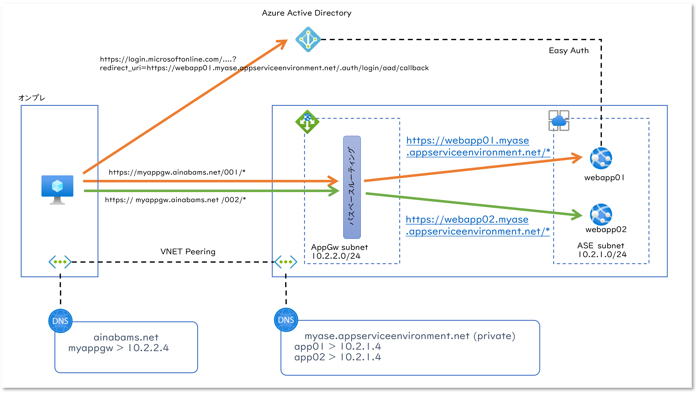
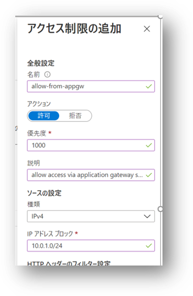
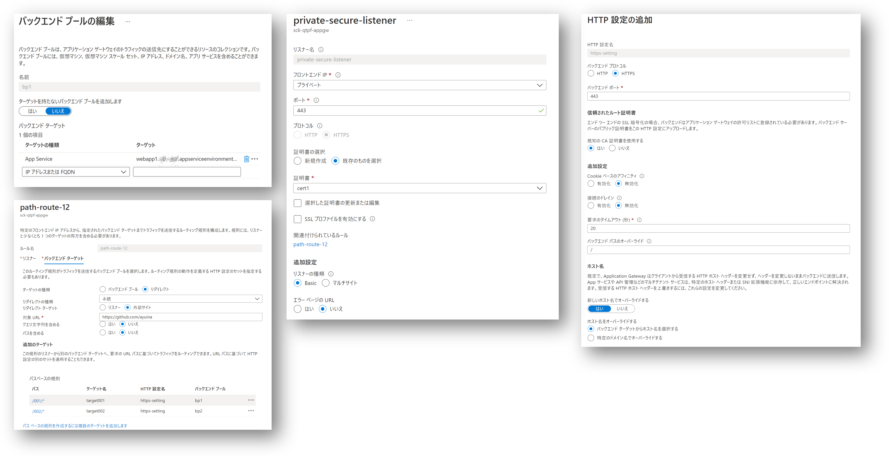
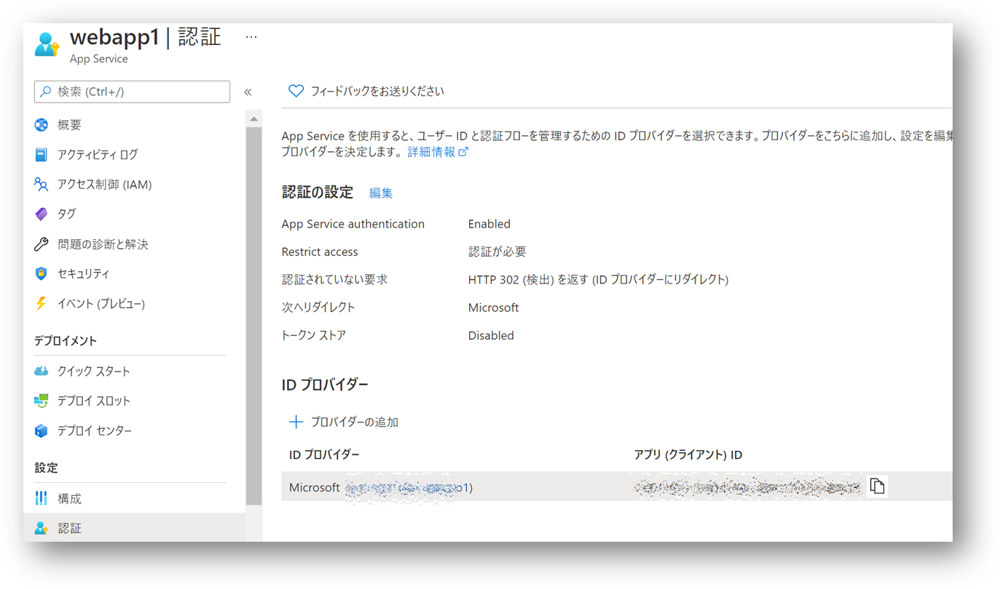
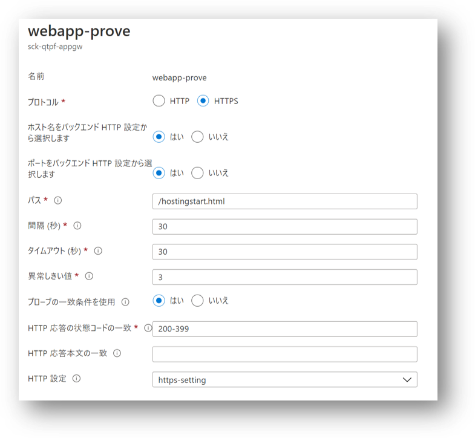
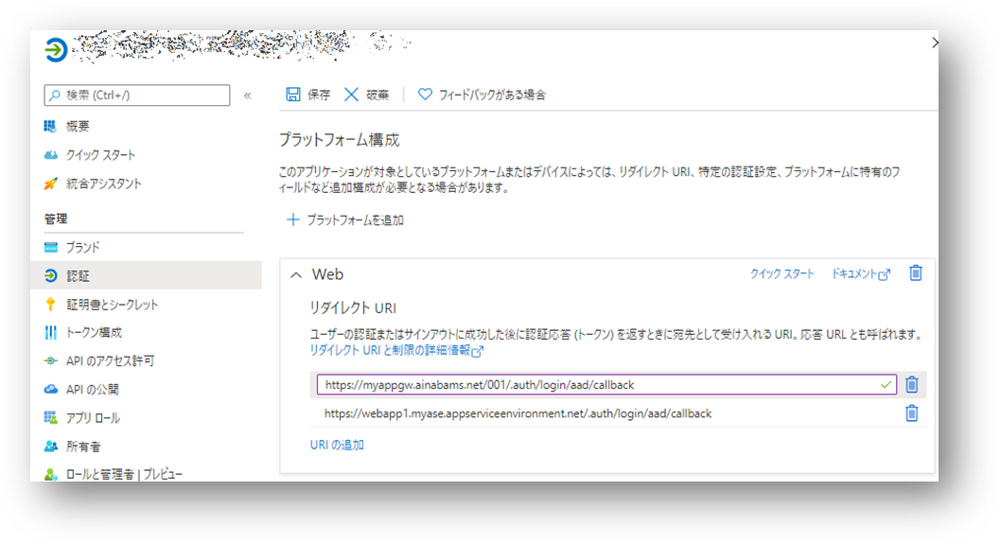
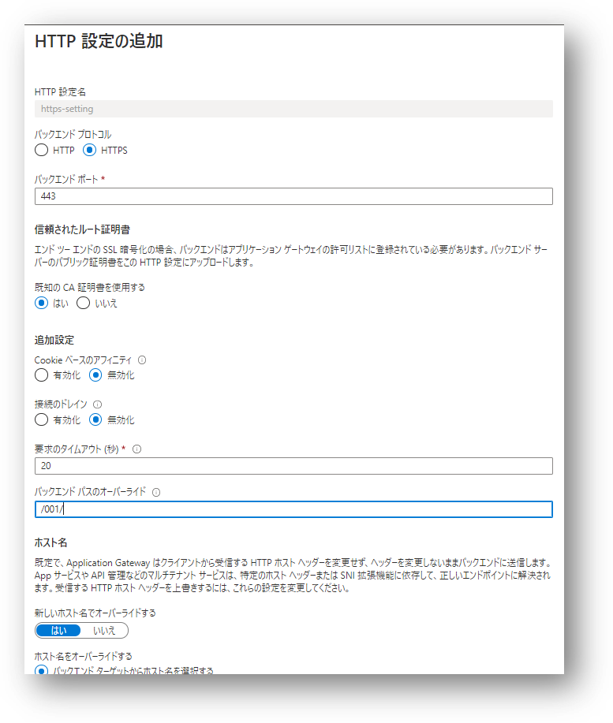
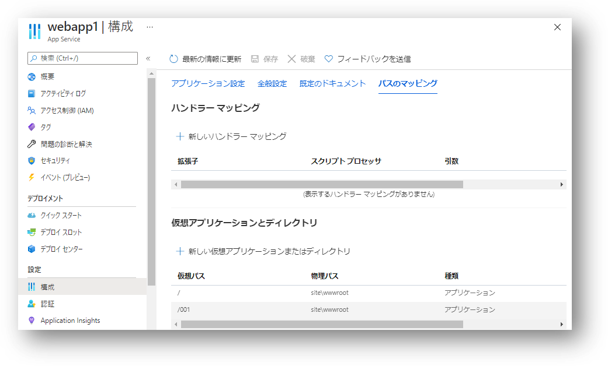
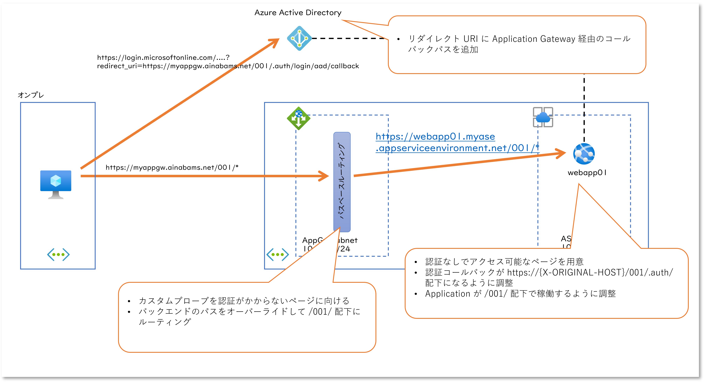

## はじめに

社内からのアクセスに限定された Web Applicaiton で PaaS を使う場合にはどうやって閉域化するか（VNET に閉じ込めるか）というのが話題になりがちですが、そのひとつとして VNET 内に WebApp そのものを構築するための ILB ASE : Internal Load Balancer App Service Environment という方法があります。
さらにそのフロントに Application Gateway を設置して URL パスベースルーティングを構成することで、単一ドメインに対して複数のアプリが動作するように見せることが可能です。
以前の Windows 系のアプリ開発者の方であれば「IIS の仮想ディレクトリを複数作成してアプリをおいていく方式」と考えれば分かりやすいでしょうか。
この構成自体はそれほど難しくもないのですが、ここに Azure Active Directory 認証をかけるといろいろハマります、というお話です。

## 環境の準備

まず下の図のような環境を用意していきます。



図中右側の仮想ネットワークには ILB [ASE v3](https://docs.microsoft.com/ja-jp/azure/app-service/environment/overview) と 
[Application Gateway](https://docs.microsoft.com/ja-jp/azure/application-gateway/overview) v2 を設置しています。

- App Service Environment の構成
    - ASE に 2 つの Web App を設置します。
    - 各 Web App は Application Gateway 以外からのリクエストを受け付けてしまわないように [IP アドレス制限](https://docs.microsoft.com/ja-jp/azure/app-service/app-service-ip-restrictions) を設定します。



- Application Gateway の構成
    - 作成した各 Web App のそれぞれを Application Gateway のバックエンドプールとして設定します。
    - パスとバックエンドプールをマッピングする [URL パスベースルーティング](https://docs.microsoft.com/ja-jp/azure/application-gateway/url-route-overview)を設定してリクエストを振り分けます。
    - 各 Web App は ASE に割り当てられた単一の Private IP アドレスでホストされる構成になっているため、[各ルートの HTTP 設定でホスト名のオーバーライドを行います](https://docs.microsoft.com/ja-jp/azure/application-gateway/application-gateway-web-app-overview)。
    - この後で Web App の認証設定を行うためクライアントとの Application Gateway 間の通信を [TLS で暗号化します](https://docs.microsoft.com/ja-jp/azure/application-gateway/ssl-overview)
        - TLS 構成のためのカスタムドメインとサーバー証明書は別途用意が必要です。
        - [App Service ドメイン](https://docs.microsoft.com/ja-jp/azure/app-service/manage-custom-dns-buy-domain) および [App Service 証明書](https://docs.microsoft.com/ja-jp/azure/app-service/configure-ssl-certificate#import-an-app-service-certificate)を Application Gateway に割り当てて利用することも可能です。



前述のアーキテクチャ図の左側はオンプレミス環境をエミューレーションするための VNET です。

- オンプレ用の VNET を作成してクライアント PC 代わりの VM を作成
- 右側の VNET とピアリングを構成して Application Gateway にネットワーク接続を可能にする
- 先ほど TLS を構成したドメイン名が Application Gateway の Private IP アドレスに解決できるように DNS を構成

各 Web App には異なる HTML ファイルでも配置して起き、ブラウザ等から Application Gateway にアクセスすると URL のパス部分（上記では /001 と /002）で 2 つの Web アプリを切り替えられることを確認します。
なおここでは記載していないですが、右側の VNET にも保守端末代わりの VM を一台作っておくとアプリの配置などが試しやすいので便利です。  

## Web App で Azure Active Directory 認証を構成する

さてあとは Web App で認証を構成するだけですね。



するといろいろと動かなくなるので、いくつか調整が必要になってきます。

### 正常性プローブ

まずバックエンドプールの[正常性プローブ](https://docs.microsoft.com/ja-jp/azure/application-gateway/application-gateway-probe-overview)です。
既定の正常性プローブではバックエンドに発行した HTTP(S) リクエストの結果が 200 ~ 399 であるか否かで正常性を判定します。
ところが現在 Web App は Azure AD による認証設定を行っているため、Application Gateway による未認証のリクエストは全てログインページへのリダイレクトになっているはずです。
これでは正常性プローブの結果が正常と判断したとしても実態を表しているとは言えませんので、Application Gateway のカスタムプローブを構成し、そのプローブ対象のページを認証対象から除外します。



残念ながら現在の Azure Portal では認証除外設定が画面からできませんので、後述の設定とまとめて行います。

### 認証コールバック URL のドメイン部分を調整

Azure AD で認証が行われるとアクセストークンが発行され、ブラウザから Web App のコールバック API に対して送信してやる必要があります。
Web App は未認証のリクエストが来た段階で Azure AD に対してリダイレクトを行うのですが、この際に下記のように ```redirect_uri``` パラメタでコールバック先を指定しています（読みにくいので URL エンコードは省略）。

```
https://login.microsoftonline.com/guid-of-azure-ad-tenant-id/oauth2/v2.0/authorize?redirect_uri=https://webapp1.myase.appserviceenvironment.net/.auth/login/aad/callback&...
```

Web App は自分の前に Application Gateway が存在することで、ドメインが変わってしまっていることを知りませんので、_webappname.asename.appserviceenvironment.net_ を返してしまっています。
これはクライアント PC は名前解決もできませんし、名前解決ができたとしてもクライアント PC からの直接のアクセスは想定していません。
せっかく認証が通ったのにコールバックする先がないわけですね。
つまりここを Application Gateway のドメインに切り替えてやる必要があるわけです。

Applicaiton Gateway はそもそものクライアントリクエストに含まれていた Host ヘッダーの値を、バックエンドにある Web サーバーに対しては `X-Original-Host` というヘッダー格納して送信しています。
これをコールバック URI に指定してやればよいわけですね。
この設定を詳細に解説すると極めて長くなってしまうので割愛しますが、詳細は下記をご参照ください。

- [Deploying a secure, resilient site with a custom domain](https://azure.github.io/AppService/2021/03/26/Secure-resilient-site-with-custom-domain.html)
- [Azure App Service 認証でのファイルベースの構成](https://docs.microsoft.com/ja-jp/azure/app-service/configure-authentication-file-based)

具体的な設定方法は後述。

### 認証コールバック URL のパスの調整

コールバック URL の FQDN を調整できれば、クライアント PC は認証完了後に Application Gateway 向けにコールバックを行ってはくれます。
ところが URL にはそもそも認証要求を出した Web App に向かうためのパス部分が含まれていませんので、Application Gateway にはこのコールバックを転送する先のバックエンドプールが特定できません。
このパス部分も書き換えるということは Web App の認証 API のパス `/.auth/*` のプレフィックス部分を書き換える必要があります。

この設定もポータルからは出来ませんので、前述のファイルベースの構成か ARM テンプレートを使用して構成する必要があります。

### 認証コールバック URL の調整と正常性プローブの構成

さて ARM テンプレートでここまでの３つの設定をまとめて行います。

|設定内容|設定箇所|備考|
|---|---|---|
|認証を必要としないパスの設定|globalValidation.excludedPaths| Application Gateway のカスタムプローブに設定するファイルパス|
|コールバック URL の FQDN を書き換え|httpSettings.forwardProxy| Application Gateway のホスト名が設定される X-Original-Host を指定|
|コールバック URL の パス部分を書き換え|httpSettings.routes.apiPrefix| Applicaiton Gateway のパスベースルーティングで指定されるパス|

具体的には以下のような ARM テンプレートをデプロイすることになりますが、いろいろな設定内容を試行錯誤するのであれば [Azure Resource Explorer](https://resources.azure.com) が便利でしょう。

```json
{
  "$schema": "https://schema.management.azure.com/schemas/2019-04-01/deploymentTemplate.json#",
  "contentVersion": "1.0.0.0",
  "parameters": {
    "webAppName": {
      "type": "string"
    },
    "location": {
      "type": "string"
    }
  },
  "resources": [
    {
      "name": "[concat(parameters('webAppName'),'/authsettingsV2')]",
      "type": "Microsoft.Web/sites/config",
      "apiVersion": "2020-12-01",
      "location": "[parameters('location')]",
      "properties": {
        "platform": {
          "enabled": "true",
          "runtimeVersion": "~1"
        },
        "globalValidation": {
          "requireAuthentication": "true",
          "unauthenticatedClientAction": "RedirectToLoginPage",
          "redirectToProvider": "azureActiveDirectory",
          "excludedPaths": [
            "/hostingstart.html"
          ]
        },
        "login": {
          "preserveUrlFragmentsForLogins": "true"
        },
        "httpSettings": {
          "requireHttps": "true",
          "forwardProxy": {
            "convention": "Custom",
            "customHostHeaderName": "X-ORIGINAL-HOST"
          },
          "routes": {
              "apiPrefix": "/001/.auth"
          }
        },
        "identityProviders": {
          "azureActiveDirectory": {
            "enabled": "true",
            "registration": {
              "openIdIssuer": "https://sts.windows.net/tenant-id-of-your-azure-active-directory/v2.0",
              "clientId": "client-id-of-your-application-registered",
              "clientSecretSettingName": "MICROSOFT_PROVIDER_AUTHENTICATION_SECRET"
            },
            "validation": {
              "allowedAudiences": [
                "api://audience-id-of-your-application-registered"
              ]
            },
            "login": {
              "loginParameters": [
              ]
            }
          }
        }
      }
    }
  ]
}
```

### Azure AD の認証コールバック URL を追加

Web App 側でコールバック URL を切り替えてしまったので、Azure Active Directory 側ではその URL に対してトークンを発行してくれるように設定する必要があります。



### Application Gateway の HTTP 設定によるバックエンドパスの調整

そもそも前述のような Application Gateway のパスベースルーティングでは、指定されたパスでアプリケーションを切り替えるわけです。
ところが前述のように Web App の認証設定でコールバック URL を調整することで、バックエンドプールは正しく選択できるようになったのですが、バックエンドのパスは相変わらずサイトルートのままです。
Application Gateway がバックエンドにリクエストを出す際にもこの書き換えたパスを維持する必要があります。

|#|AppGw へのリクエスト|バックエンドへのリクエスト|結果|
|---|---|---|---|
|初期のルーティング構成|https://myappgw.ainabams.net/001/* |https://webapp01.myase.appserviceenvironment.net/* ||
|調整前の認証コールバック|https://webapp01.myase.appserviceenvironment.net/.auth/login/aad/callback|-|Application Gateway にリクエストが届かない|
|ドメインとパスを調整した認証コールバック|https://myappgw.ainabams.net/001/.auth/login/aad/callback|https://webapp01.myase.appserviceenvironment.net/.auth/login/aad/callback|認証 API のパスがずれている|
|バックエンドパスもオーバーライド|https://myappgw.ainabams.net/001/.auth/login/aad/callback|https://webapp01.myase.appserviceenvironment.net/001/.auth/login/aad/callback|この状態が必要|

このバックエンドパスのオーバーライドには HTTP 設定を使用します。
これを構成するためには各 Web App ごとに異なる HTTP 設定が必要になることに注意下さい。
上記の例で言えば /002 向けのルートにはこの HTTP 設定を共有することができません。




### Web アプリケーションのパスの調整

さて困ったことにアプリケーションはサイトルートでホストしたままです。
ところが Application Gateway 前述のパスのオーバーライドによってサブディレクトリにリクエストを送信するようになってしまいました。
これを調整するために Web App の仮想アプリケーションのパスと、コンテンツが実際に配置されている物理ディレクトリのマッピングを変えてやります。



## まとめ

一通り構成した個所は以下のようになります。
極めて美しくない状態なのですが、さしあたりこれで動作はするようになりました・・・。

