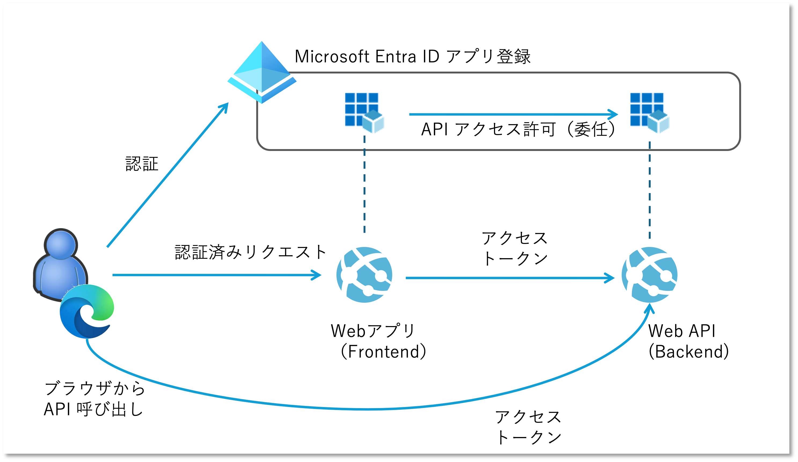
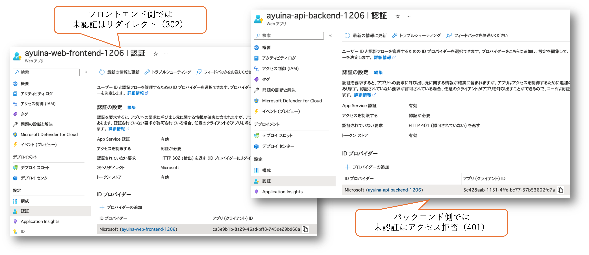
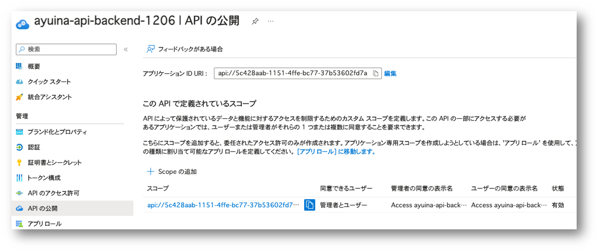
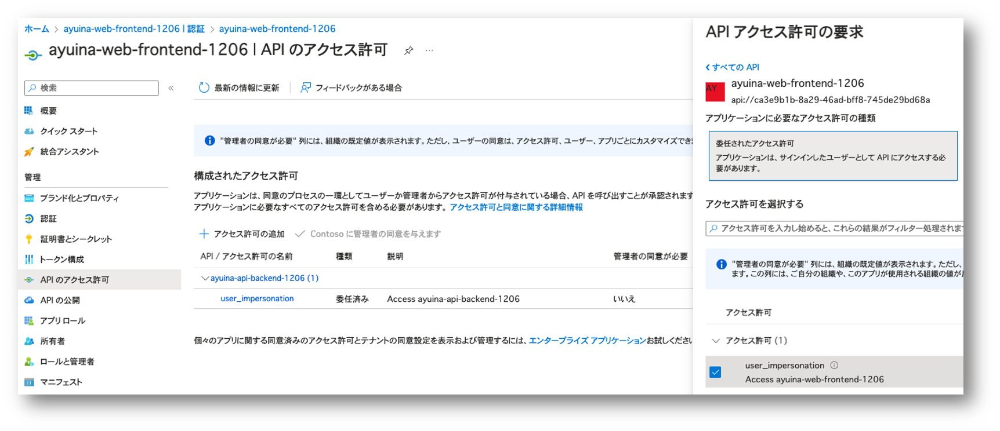
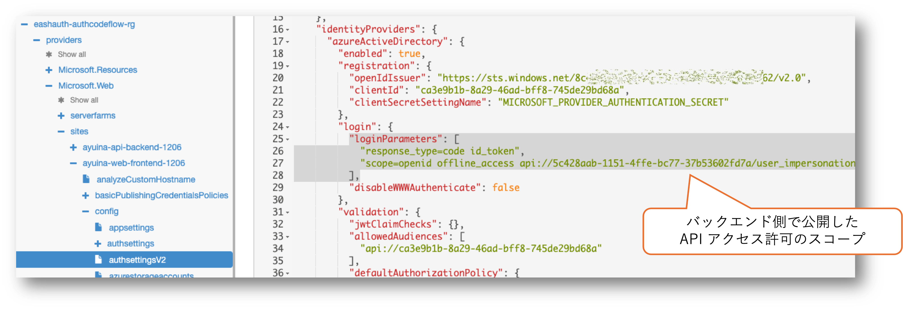
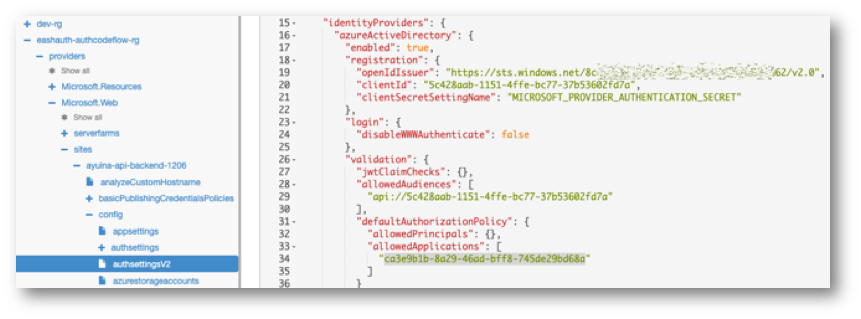
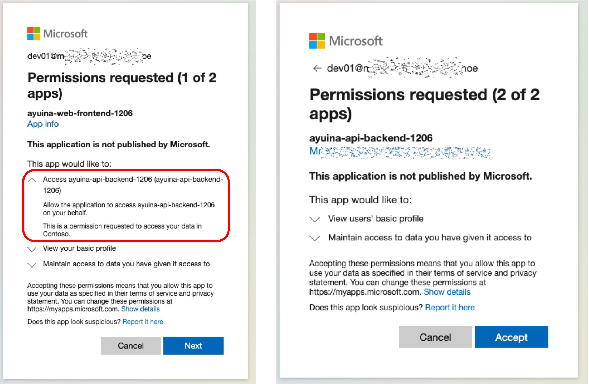
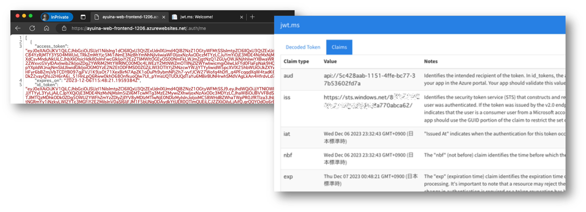

# はじめに

[以前の記事](../appsvc-easyauth-z/)で Easy Auth 認証が有効になった App Service（Web アプリ）で、ユーザーの認可を行う方法を紹介しましたが、
その Web アプリから、別の App Service（Web API）を呼び出す場合、どのように認証を行うのかを紹介します。
内容的には下記のチュートリアルと全く同じ内容なのですが、わかりにくいポイントや、そのままでは動かない箇所があり、ちょっと別のやり方も試してみたかったので、備忘録がてら解説します。

- [チュートリアル:Azure App Service でユーザーをエンド ツー エンドで認証および承認する](https://learn.microsoft.com/ja-jp/azure/app-service/tutorial-auth-aad?pivots=platform-windows)

細かい手順はこのチュートリアルも合わせてご確認ください。

# 全体像

まず全体像です。
App Service にデプロイされているのが Web アプリだろうが Web API だろうが、どちらも App Service ということで、両方とも Easy Auth によって保護することが可能です。
ただ Web アプリの場合は未認証リクエストが自動的に Entra ID にリダイレクトされ、認証すると必要なトークンが取得可能なので良いのですが、API アクセスはそうはいきません。
Web アプリは API アクセスの前にアクセストークンを取得し、API 呼び出しの際に付与する実装をしてあげる必要があります。
今回は Web アプリがユーザーの代理で API にアクセスする [Authorization Code flow](https://learn.microsoft.com/ja-jp/entra/identity-platform/authentication-flows-app-scenarios#web-app-that-signs-in-a-user-and-calls-a-web-api-on-behalf-of-the-user)
というやつです。



問題はこのトークンの取得方法や各種の設定方法です。
構成としては Entra ID のドキュメントで紹介されている [API を呼び出す Web アプリ](https://learn.microsoft.com/ja-jp/entra/identity-platform/scenario-web-app-call-api-overview) に該当します。
するのですが、こちらを読んでも App Service 関連の設定がよくわかりません。
最初にあげたチュートリアルがまさにこの手続きを紹介しているのですが、これの補足をする内容になります。

# セットアップ

まずは 2 つの App Service 作成し、それぞれに対して Easy Auth を使用して Entra ID で認証を行うように構成します。
この際 App Service に対して 2 つのアプリが登録されます。



ここで作成された 4 つのオブジェクトに対して、それぞれ必要な設定を行っていきます。

||Web アプリ（Frontend）|Web API（Backend）|
|---|---|---|
|Entra ID アプリ|② API アクセスの委任　|① API の公開|
|Azure App Service|③ API アクセスのためのトークンの取得|④ アクセス許可|

## ① Entra ID に登録された Backend アプリで API を公開する

まずは Web API に対して、Entra ID に登録されたアプリで API を公開します。
が、EasyAuth の有効化と同時にアプリ登録した段階で `api://${CLIENT_ID_OF_BACKEND_API}/user_impersonation` というスコープが自動的に作成されています。
今回はこれを使うことにしますので、確認だけしておきます。



## ② Entra ID に登録された Frontend アプリで API アクセスの委任を構成する

次に Frontend 側の App Service と紐ついている Entra ID に登録されたアプリで API アクセスの委任を構成します。
このアプリはユーザー認証を行なうと同時にユーザープロファイルの確認等の権限はもっていますが、「ユーザーのフリをする」ことまでは許可されていません。
うっかり怪しいアプリで認証してしまって、そのアプリがユーザーのフリをして勝手に様々な API にアクセスされたら怖いですよね。
その権限を与えるには、ユーザーの（あるいは管理者の）明確な同意、すなわち __委任__ が必要です。

ここで行っているのは実際の委任の許可ではなく、「このアプリは API アクセスの際にユーザーのフリをする必要がありますよ」という宣言をしています。
こうすることで実際に認証が行われる際にユーザーの同意を求めるようになるわけです。
ややこしい。



最初の認証だけの場合はフロントエンドの Web アプリの認証が行われる際の初回は Web アプリがユーザーのプロファイル情報にアクセスすることを同意する画面が表示されます。
この設定をしておくと同時にバックエンドの Web API に対する委任もまとめて同意を求めることができるようになるので、ユーザーから見れば同意の操作が一回で済みます。

## ③ Frontend 側の App Service　で Web API　を操作するためのアクセストークンを取得する

さて Azure Portal の画面を眺めていてもわからないのですが、Easy Auth の設定をカスタマイズすることで、ユーザー認証のために Entra ID にリダイレクトする際にまとめて Backend API 用のアクセストークンを要求することができます。
チュートリアルではコマンドでごにょごにょしてますが、[Azure Resource Explorer](https://resources.azure.com/) で設定を変更するのがわかりやすいでしょう。

Resource Explorer で Frontend 側の App Service を開き、`config/authsettingsV2` 設定の `properties.identityProviders.azureActiveDirectory.login.loginParameters` に下記のように設定を書き換えます。
おそらく最初は scope が `openid profile email` などとなっていると思いますが、これを `openid` とともにバックエンド側 Web API のスコープを追加しておきます。



これいいかげん Azure Portal で設定できるようになるか Azure CLI の普通の（JSON じゃない）コマンドで設定できるようにならないもんでしょうか・・・。

## ④　Backend 側の App Service で Frontend 側のアクセス許可を設定する

こちらの手順は先ほどのチュートリアルにはありません。
が、これがないと認可は通る（401 Unauthorized は解消される）のにも関わらず、アクセスが拒否される(403 Forbidden が発生する)というエラーが出てしまいかなり悩みました。
以前の記事で紹介した「App Service の設定で認可を行う」ための[組み込み認可ポリシー](https://learn.microsoft.com/ja-jp/azure/app-service/configure-authentication-provider-aad?tabs=workforce-tenant#use-a-built-in-authorization-policy) という機能なのですが、これを使用して Backend 側の App Service で Frontend 側のアプリを許可してあげる必要があります。
たしかにドキュメントには以下のような記載がありました。

> これらの組み込みチェックに失敗した要求には、HTTP 403 Forbidden 応答が渡されます。

というわけで、今度は Backend 側の App Service を Resource Explorer で開いて `config/authsettingsV2` 設定の `properties.identityProviders.azureActiveDirectory.validation.defaultAuthorizationPolicy.allowedApplications` の配列に、Frongend 側のアプリの Client ID を追加します。



この設定もそろそろ Azure Portal で設定できるようにしてほしいんですが・・・。

# 動作確認

セットアップが終わったので動作確認です。
真面目にやるなら 2 つの App Service にアプリケーションをデプロイするのですが、~~実装がだるいので~~ まずは設定が正しいか簡易的に確認できた方が良いでしょう。

## ユーザー認証とアクセストークンの取得

まず Frontend 側の App Service に In-Private ブラウザでアクセスしてみます。
この時は未認証の状態なので Entra ID にリダイレクトされます。
ここですぐに認証を通さずに、落ち着いて URL 欄を眺めてみると、API のスコープを要求していることがわかります。

```
https://login.microsoftonline.com/guid-of-tenant-id/oauth2/v2.0/authorize?response_type=code+id_token&redirect_uri=https%3A%2F%2Fayuina-web-frontend-1206.azurewebsites.net%2F.auth%2Flogin%2Faad%2Fcallback&client_id=ca3e9b1b-8a29-46ad-bff8-745de29bd68a&scope=email+profile+openid+api%3A%2F%2F5c428aab-1151-4ffe-bc77-37b53602fd7a%2Fuser_impersonation&response_mode=form_post&nonce=1414d086d6c84cd2985edbe3ab07ef7f_20231206045722&state=redir%3D%252F
```

ごちゃごちゃしてわかりにくいですが、`scope=email+profile+openid+api%3A%2F%2F5c428aab-1151-4ffe-bc77-37b53602fd7a%2Fuser_impersonation` の部分です。

さて認証を通すと以下のような同意が求められます。
１つめの赤枠の部分が Frontend 側のアプリに、Backend 側のアクセスを委任して（ユーザーのフリをして）も良いか？と同意を求められている部分です。
２つめは Backend 側も初回アクセスなので EasyAuth だけを設定した時と同じ同意画面が出ています。



認証が終わったら App Service の既定のページが表示されていると思いますが、おもむろに URL の後ろに `/.auth/me` を追加してみてください。
App Service の [トークンストア](https://learn.microsoft.com/ja-jp/azure/app-service/configure-authentication-oauth-tokens) というやつですね。

```
https://${frontend-webapp-name}.azurewebsites.net/.auth/me
```
JSON が帰ってくるので、そこで `access_token` を https://jwt.ms でデコードしてやると中身が確認出来ます。



代表的なものをピックアップすると以下のようになっています。

|確認項目|claim 名|値|
|---|---|---|
|認可されている内容|aud, scp|Backend 側 Web API の user_impersonation|
|クライアントアプリ|appid|Frontend 側 Web アプリの client id（Backend 側の組み込み認可ポリシーで許可したもの）|
|ユーザー情報|upn, oid, name, etc...|Frontend 側 Web アプリで認証したユーザーの情報|

> ちなみにチュートリアルでは App Service 上で動いているサーバーサイドのコードから `x-ms-token-aad-access-token` リクエストヘッダーにアクセスすることでこのトークンを取得して、サーバーサイドからバックエンドの API を呼び出しています。
> ~~この実装の手間を省くため~~ ブラウザー側から直接 API を呼び出したいケースもあるでしょうから、ここでは `/.auth/me` エンドポイントから取得したトークンを使って API を呼び出してみます。

## アクセストークンを利用した API の委任呼び出し

バックエンド側の API を呼び出すためのトークンが取得できたので、これを使って Web API を呼び出してみます。
ただ Web API を呼び出す際には `Authorization` ヘッダに `Bearer` トークンを付与する必要があり、ブラウザーではやりにくいので Visual Studio Code の [REST Client](https://marketplace.visualstudio.com/items?itemName=humao.rest-client) 等のツールを使うと良いでしょう。
もちろん `curl` でも `Invoke-WebRequest` でも Postman でもなんでも良いです。 

まず未認証の状態で呼び出してみます。

```rest
GET https://${backend-api-name}.azurewebsites.net/ HTTP/1.1
Accept: */*
```

結果は以下のように未認証で弾かれます。
リダイレクトせずに 401 Unauthorized が返ってきているのも最初の Easy Auth の設定どおりですね。

```
HTTP/1.1 401 Unauthorized
Content-Length: 58
Connection: close
Content-Type: text/html
Date: Thu, 07 Dec 2023 01:13:51 GMT
WWW-Authenticate: Bearer realm="ayuina-api-backend-1206.azurewebsites.net"
Strict-Transport-Security: max-age=31536000; includeSubDomains
X-Powered-By: ASP.NET

You do not have permission to view this directory or page.
```

ではアクセストークンを付与してみます。

```rest
GET https://${backend-api-name}.azurewebsites.net/ HTTP/1.1
Accept: */*
Authorization: Bearer ${access_token}
```

結果は以下のように 200 OK で成功します。
真面目に API を実装していないので、既定のページの HTML が返ってきていますが、成功です。

```
HTTP/1.1 200 OK
Content-Length: 1643
Connection: close
Content-Type: text/html
Date: Thu, 07 Dec 2023 01:27:54 GMT
Server: Microsoft-IIS/10.0
Accept-Ranges: bytes
Content-Encoding: gzip
ETag: "c6520fafb27da1:0"
Last-Modified: Wed, 06 Dec 2023 04:23:34 GMT
Vary: Accept-Encoding
Strict-Transport-Security: max-age=31536000; includeSubDomains
X-Powered-By: ASP.NET

<!DOCTYPE html><html lang="en"><head> 
... 以降は省略 ...
```

# まとめ

単なるチュートリアルの内容の補足でした。
Easy Auth は組み合わせると割と Easy ではないのですが、やり方さえ分かってしまえばアプリで Authorization Code flow を実装するよりはるかに Easy なので是非ご活用いただければと思います。
