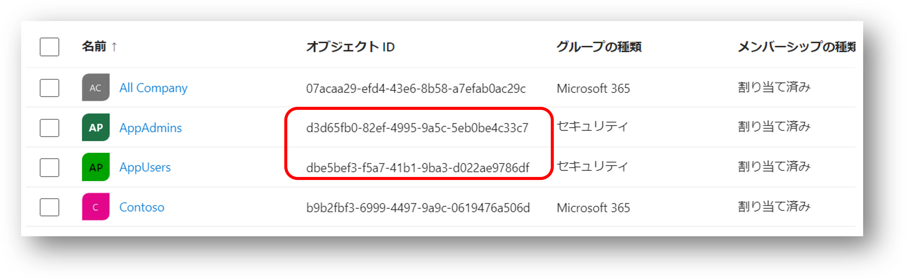

# はじめに

Azure App Service は既定では匿名アクセスを許可する公開 Web サイトとしてデプロイされますが、
[認証](https://learn.microsoft.com/ja-jp/azure/app-service/scenario-secure-app-authentication-app-service)機能を有効にすることで簡単に認証付きの Web サイトに変更することができます。
EasyAuth と呼ばれたりもします。
特に簡単なのが認証基盤として Azure サブスクリプションが信頼する Microsoft Entra ID テナントを ID プロバイダーとして構成する方法です。
これは Microsoft 365 や Windows と同じユーザー情報などを使用して認証できるため、エンタープライズ用途で使用する時には最も多く構成されるパターンでもあると思います。

ただあまりに簡単なので割と見過ごされがちなのが、これはあくまでも **認証** です。
英語で言うと Authentication です。 
Authorization ではありません。
日本語では承認、認可、アクセス制御等で訳がブレブレになりがちで困ったものです。
要は「アクセスしてきてるのは誰か」は特定できますが、「そのユーザーやアプリが何をして良いか」を判定しているわけではないということです。
[こちら](https://learn.microsoft.com/ja-jp/azure/app-service/overview-authentication-authorization)のドキュメントにも記載がありますね。

> 既定では、この機能では認証のみが提供され、認可は提供されません。 ここで構成するチェックに加えて、アプリケーションで認可の決定を行う必要がある場合があります。

というわけで、この記事では EasyAuth 設定後に Authorization を実現する方法について整理しておきたいと思います。
まあ[こちら](https://learn.microsoft.com/ja-jp/azure/app-service/configure-authentication-user-identities) に記載されている内容とほぼ同じなのですが、ちょっとタイトルが分かりにくいのと具体性にかけるかなと思いますので。

## 前提事項

本記事では以下の前提で話を進めることにします。

- Authorization に関しては「アクセス制御」で統一することにします。
    - EasyAuth が認証時に使用している OpenID Connect や OAuth2 が「認可」と呼ぶことが多いので区別したいため
    - 「にんしょう」と「しょうにん」は音が近くて喋るときにややこしいため
- 認証の対象はユーザーに限定します。
    - ユーザーがブラウザで利用する Web アプリだと思ってください。
    - アプリであってもそれほど大きくは変わらないのですが。

# EasyAuth を使用して認証だけされた状態

まず初めに App Service で Entra ID を使用して認証を有効にしただけの初期状態を確認しておきます。
Azure Portal ではこんな感じの設定になります。


この状態の App Service にデプロイされたアプリケーション（下図の Your Web App）は、認証済みのユーザーのみのリクエストだけを受け付けることになります。


その際にトークンストアが有効になっていると、サーバーサイドでは以下の HTTP ヘッダーを受け取れるようになっています。

|Header|説明|
|---|---|
|X-MS-CLIENT-PRINCIPAL|使用可能な要求の Base64 エンコード JSON 表現。 詳細については、「クライアント プリンシパル ヘッダーのデコード」を参照してください。|
|X-MS-CLIENT-PRINCIPAL-ID|ID プロバイダーによって設定された呼び出し元の識別子。|
|X-MS-CLIENT-PRINCIPAL-NAME|ID プロバイダーによって設定された呼び出し元の人間が判読できる名前 (メール アドレス、ユーザー プリンシパル名など)。|
|X-MS-CLIENT-PRINCIPAL-IDP|App Service 認証で使用される ID プロバイダーの名前。|

# アクセス制御の実現方針

上記の情報などをごにょごにょしていくことでアクセス制御を実現していくわけですが、ここでいくつかパターンが考えられます。
どれか一択というよりは１と２のどちらかでざっくりと利用可能なユーザーを絞った上で、必要に応じて３で細かい制御を行うことになるんじゃないでしょうか。

1. Microsoft Entra ID 側で認可対象ユーザーを制限する
1. Azure App Service 側でユーザーをフィルタリングする
1. アプリケーションコード内でユーザーの属性情報を元に判定ロジックを実装する


なお３の方式を 2 か所に書いているのは、クライアント側（ブラウザ上で動作する JavaScript）で実現する方法と
サーバー側（App Service 上で動作するアプリ）で実現する方法があるからですが、考え方としては一緒なのでまとめています。

## Microsoft Entra ID 側で認可対象ユーザーを制限する

EasyAuth で認証を有効にした場合、Entra ID にアプリケーションが登録されます。
Azure Portal で認証を有効にした場合に `ID プロバイダー` の一覧に App Service の名前でリンクが表示されていますが、こちらをクリックすると Entra ID に登録されたアプリケーションの情報が確認できます。
同時にサービスプリンシパル（エンタープライズアプリケーション）も作成されるのですが、このサービスプリンシパルの既定の設定が「テナント内の任意のユーザーの認証が成功すれば当該アプリへのアクセスを認可する」設定になっています。
このため、少なくともテナント内に登録されているユーザーであることは保証されますが、そのユーザー全員がアクセス可能な状態になっているわけです。


企業であれば多くの場合 Entra ID には全部署全職種の全社員がユーザーとして登録されており、場合によってはパートナーも外部ユーザーとして登録されていたりすると思います。
ただ多くのアプリは「組織の全員が使える」わけではなく、一部のユーザーに限定したいケースがほとんどでしょう。
つまり、サービスプリンシパルが特定のユーザーのみ認可するように設定すればよいわけです。
こうすることで利用を許可されていないユーザーは App Service の EasyAuth を通過するためのトークンが入手できなくなりますので、アクセス制御が実現できるということですね。

詳細な手順などは [こちら](https://learn.microsoft.com/ja-jp/entra/identity/enterprise-apps/assign-user-or-group-access-portal?pivots=portal) をご参照ください。
大まかには以下の２ステップです。

- `プロパティ` 画面で `割り当てが必要ですか？` を `はい` に設定する
    - 既定値は `いいえ` なので、割り当てられていないユーザーもアプリへのアクセスが認可されていた
- `ユーザーとグループ` の画面で、利用を許可したい `ユーザーまたはグループの追加` を行う
    - これが上記で言うところの **割り当て** という行為に該当

ポイントは App Service 側での設定ではなく、Entra ID 側のサービスプリンシパルに対して設定を行うことになります。
この方式は組織の構造とアプリのアクセス制御方針がマッチしている場合には非常に便利で
部署やチーム単位のセキュリティグループが既にある場合は、割り当てを１つ行うだけなので楽ちんです。

ただ Azure と Entra ID では管理者も異なればポリシーも異なることが多く、上記の手順は App Service 側の管理者や担当者では実施できないかもしれません。
また既存のグループを再利用できない場合は、グループの作成、参加メンバーのメンテナンスなども必要になってきます。
その場合は Entra ID 側の管理者と相談して保守・運用を考える必要があるでしょう。

## Azure App Service 側でユーザーをフィルタリングする

Entra ID 側に設定するのは社内調整とか保守・運用が面倒という場合は、App Service 側でユーザーをフィルタリングすることもできます。
前述のとおり EasyAuth はユーザーリクエストに含まれるアクセストークンを解析して認証をしているわけですので、そこで許可するユーザーを判定してくれればいいわけですね。

設定方法は[こちら](https://learn.microsoft.com/ja-jp/azure/app-service/configure-authentication-provider-aad?tabs=workforce-tenant#use-a-built-in-authorization-policy)に書いてある通り、App Service の REST API 呼び出しか、ARM テンプレートないしは Bicep テンプレートによって行います。
Azure Portal では設定できないですし、Azure CLI/PowerShell にもコマンドがありません。

不便です。

というか個人的には、利用可能なユーザーを管理するホワイトリストの保守はアプリレベルの運用だと思うのですが、それがインフラである App Service の設定変更という行為になるのは、ちょっと釈然としません。
ただホワイトリストは少数のグループで管理出来る前提であり、インフラとアプリの担当が分離していない（あるいは距離が近い）ケースには有効な手段だと思います。

なお ARM による設定変更ではなく[ファイルベースの設定](https://learn.microsoft.com/ja-jp/azure/app-service/configure-authentication-file-based) も可能なのですが、このファイルはアプリのコンテンツと一緒に `%HOME%\site\wwwroot` に配置する必要があります。
つまりソースコード管理や CI/CD に含める必要が出てきますし、なによりスロット単位で設定を変えることが出来なくなるので、個人的にはあまりお勧めしません。

## アプリケーションコード内でユーザーの属性情報を元に判定ロジックを実装する（サーバー側）

個人的にはこの方式が本命だと思っています。
上記の２つの方法は「このアプリは誰が使って OK/NG」という割とざっくりしたアクセス制御です。
また「アプリの利用は許可されてるんだけど、人によって使ってよい機能や画面が異なる」といったケースも多いでしょう。
この場合はどうしてもアプリで実装されている機能に合わせたアクセス制御が必要ですので、これはアプリのロジックに含めるべきでしょう。

ただ前述のとおり `X-MS-CLIENT-PRINCIPAL-ID` リクエストヘッダーが取得できるとはいえ、まさかユーザー名をキーにした分岐ロジックをハードコードするわけにはいきません。
よって、分岐のキーとなる属性情報などをアプリ外部に持たせる必要が出てきます。
候補としては以下の２つです。

- カスタム DB にユーザー情報や権限を管理するテーブルなどを作成する
- Microsoft Entra ID のグループやアプリロールとして管理する

### カスタム DB 方式

こちらは昔ながらのやり方ではありますが、アプリの仕様に合わせたデータ構造でユーザーの属性情報が管理できますので、未だに現実解だと思います。
特にアプリがオンプレからの移行であれば（ユーザー認証部分が変わってしまっていますが）既存のデータベースが流用できるのもメリットです。
~~Entra ID の難解な仕様に振り回されたり、セキュリティ部門との調整などが発生しないというのもメリットかもしれません。~~

具体的な実装は基本的に EasyAuth 経由で取得したユーザー ID をキーとして SQL クエリなどを投げて処理を分岐させるだけなので、ここでは説明を割愛します。

### Entra ID 方式（既定の状態の確認）

さて前述の `X-MS-CLIENT-PRINCIPAL` の説明を見てみましょう。

> 使用可能な要求の Base64 エンコード JSON 表現。 詳細については、「クライアント プリンシパル ヘッダーのデコード」を参照してください。

何が便利なのか全然わかりませんが、このヘッダー情報には Entra ID で認証されたユーザーのクレーム情報が含まれています。
ここにグループやアプリロールの情報が含まれていれば、アプリ側でそれを取得してアクセス制御の判定に使用できるわけです。

まず EasyAuth を有効にしただけの時のヘッダー情報を Base64 デコードしたものが下記です（アクセス制御に使えそうな情報だけ抜粋）。
`claims` 要素には `typ` と `val` のキーバリューペアのリストが設定されていることが分かります。
ユーザー名、メールアドレス、ユーザーのオブジェクト ID などが含まれていますが、肝心なグループやロールが含まれていません。

```json
{
  "auth_typ": "aad",
  "claims": [
    { "typ": "http://schemas.xmlsoap.org/ws/2005/05/identity/claims/emailaddress",
      "val": "username@example.com" },
    { "typ": "name",
      "val": "Firstname Lastname" },
    { "typ": "http://schemas.microsoft.com/identity/claims/objectidentifier",
      "val": "d86adb3c-ade4-4078-a3cc-5ff99e66eef0" },
    { "typ": "preferred_username",
      "val": "username@example.com" },
  ],
  "name_typ": "http://schemas.xmlsoap.org/ws/2005/05/identity/claims/emailaddress",
  "role_typ": "http://schemas.microsoft.com/ws/2008/06/identity/claims/role"
}
```

ちなみにこのデコード処理を C# で実装するとこんな感じです。
[ASP.NET Minimal API](https://learn.microsoft.com/ja-jp/aspnet/core/fundamentals/minimal-apis?view=aspnetcore-7.0)として実装した確認用のコードです。

```csharp
app.MapGet("/principal", (HttpRequest request, HttpResponse response) => 
{
    string pkey = "X-MS-CLIENT-PRINCIPAL";
    string principal = request.Headers[pkey].FirstOrDefault() ?? "";

    if(string.IsNullOrEmpty(principal))
        return "can not found principal";

    response.Headers.ContentType = "application/json";
    return Encoding.UTF8.GetString(Convert.FromBase64String(principal));
});
```

### Entra ID 方式（グループ情報を使いたい場合）

グループ情報のクレームはオプションなので、上記の通り既定ではセットされません。
このためEntra ID に登録されたアプリケーションで「トークンにグループ情報を含めてくれ」という設定をします。


この状態で EasyAuth を通すと、`X-MS-CLIENT-PRINCIPAL` の `claims` 要素に `typ:groups` が追加されます。
複数のグループに所属している場合は、この `typ:groups` の要素が複数追加されます。

```json
{
    "typ": "groups",
    "val": "d3d65fb0-82ef-4995-9a5c-5eb0be4c33c7"
},
{
    "typ": "groups",
    "val": "dbe5bef3-f5a7-41b1-9ba3-d022ae9786df"
}
```

ここで設定されてくる `val` の値はグループのオブジェクト ID ですので、こちらの値も Entra ID 上で確認できます。
アプリがアクセス制御に使いたいグループの ID を知っていれば、アクセスしているユーザーのクレームをチェックすることで、その所属を判定できるということになります。



### Entra ID 方式（アプリロール情報を使いたい場合）

グループはアプリ固有ではなく Entra ID 全体で共有されるオブジェクトですので、特定のアプリのアクセス制御要件とは必ずしもマッチしません。
この場合はアプリロールの機能を使用することで、そのアプリケーションにおける固有の役割を定義、ユーザーを割り当てることが可能です。

- Entra ID に登録されたアプリ側の設定で アプリ ロール を定義する
- Service Principal でユーザーを割り当てる際に、アプリ ロールも割り当てる


この状態で EasyAuth を通すと、`X-MS-CLIENT-PRINCIPAL` の `claims` 要素に `typ:roles` が追加されます。
複数のグループに所属している場合は、この `typ:roles` の要素が複数追加されます。

```json
{
    "typ": "roles",
    "val": "writer-role"
},
{
    "typ": "roles",
    "val": "reader-role"
}
```

ここで設定されてくる `val` の値は GUID ではなくアプリロールの定義時に指定した値ですので、判定や管理も容易でしょう。

詳細は下記をご参照ください。

- [Add app roles to your application and receive them in the token](https://learn.microsoft.com/en-us/entra/identity-platform/howto-add-app-roles-in-apps)

### Entra ID 方式（その他のクレーム）

なおクレームはにはグループやアプリロール以外にも様々なものがありますので、ユーザー属性として使えそうな情報があるか見てみると良いでしょう。
詳細は下記をご参照ください。

- [ID token claims reference](https://learn.microsoft.com/ja-jp/entra/identity-platform/id-token-claims-reference)
- [Configure optional claims](https://learn.microsoft.com/en-us/entra/identity-platform/optional-claims)

## アプリケーションコード内でユーザーの属性情報を元に判定ロジックを実装する（クライアント側）

ここまでの内容は App Service や Entra ID といった「安全に管理可能なクラウドサービス側」での制御でした。
ただアクセス制御の実装方式としてはクライアント側での実装も必要になることが多いでしょう。
良くあるのは「ユーザーの属性情報に応じてメニューの表示項目を変える」というやつです。
クライアント側で実装する場合にはアクセス制御としてのセキュリティ強度は落ちますが、簡易的なハッキング対策にはなりますし、ユーザー利便性という意味での価値もあります。

カスタム DB 方式の場合には JavaScript からアクセスしてユーザー情報を取得る API の実装が必要になりますが、Entra ID 方式であればトークンストアが利用できます。
[上記でも紹介したドキュメント](https://learn.microsoft.com/ja-jp/azure/app-service/configure-authentication-oauth-tokens) にも記載がありますが、ブラウザ側から App Service の URL の `/.auth/me` エンドポイントにアクセスすると現在認証しているユーザーのアクセストークン等が取得できるのですが、同時にクレーム情報も取得可能です。

```json
[
  {
    "access_token": "eyJ0eXAiOiJKV1Q...",
    "expires_on": "2023-10-25T09:54:06.7404375Z",
    "id_token": "eyJ0eXAiOiJKV1QiLCJhbGciO...",
    "provider_name": "aad",
    "user_claims": [
      {
        "typ": "preferred_username",
        "val": "username@example.com"
      },
      {
        "typ": "name",
        "val": "Firstname Lastname"
      },
      {
        "typ": "groups",
        "val": "d3d65fb0-82ef-4995-9a5c-5eb0be4c33c7"
      }
      {
        "typ": "roles",
        "val": "writer-role"
      }
    ],
    "user_id": "username@example.com"
  }
]
```
この JSON をパースして `user_claims` を取り出し、クライアントサイドのアクセス制御の実装に活用するとよいでしょう。
ただし JavaScript での実装はデータや処理の改ざんが可能ですので、サーバーサイドでのアクセス制御は必ず実施するようにしてください。

# まとめ

- App Service の認証は Easy ですが、アクセス制御は ~~Easy ではない~~ 別途考慮する必要がある
- ユーザーに対してアプリ全体へのアクセスを許可／拒否できれば良いなら Entra ID か App Service で設定可能
- きめ細かなアクセス制御をしたい場合にはアプリ内でロジックを組む必要がある
- アクセス制御の元になるユーザー情報はカスタム DB ないしは Entra ID で管理することが出来る


