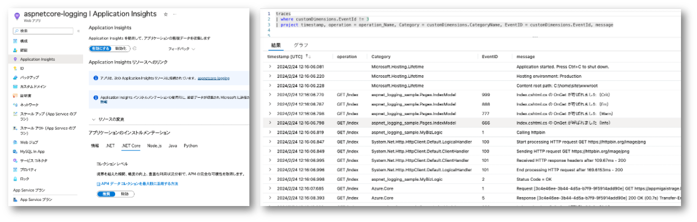
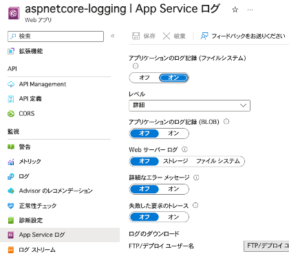
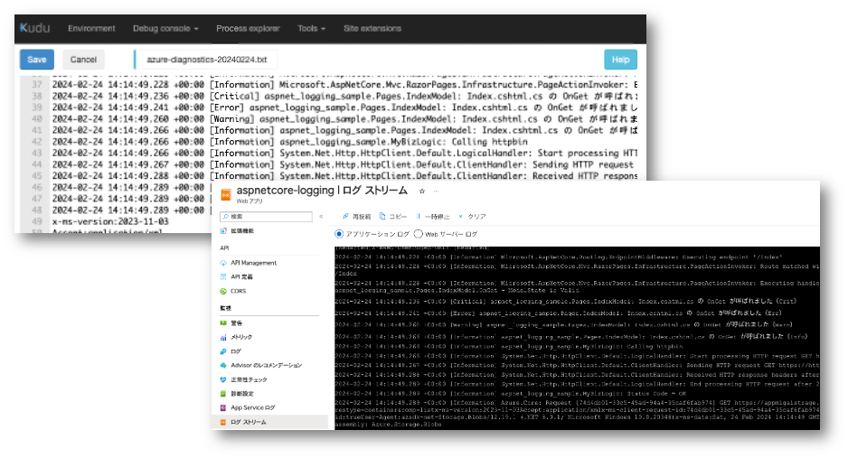
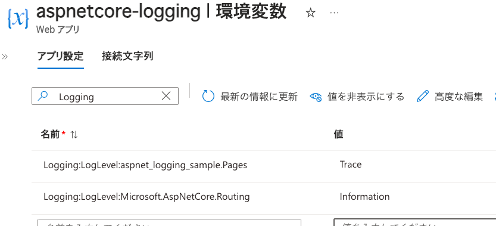

# はじめに

私の所属は営業部門なのですが技術者的なロールでもあるので、お客様と会話の中でトラブルシュートになることも多々あります。
多くの場合は PoC や検証段階で「うまく動かないんだけど助けて」ってやつなんですが、たまに本番環境でのご相談も舞い込んできます。
そんなトラシューで重要なのが「ログ」なんですが、このログの出し方がわからない、あるいは確認方法がわからないとなるとやれることが限られてきます。
まあログ出力は割と初歩的な話ではありますし、検索すれば公式ドキュメントがあっさり引っかかりますよね。
ただ昨今のアプリケーション フレームワークは割と高機能になってしまっているせいか、結局のところ自分のアプリケーションではどうすればログが出せるのかわかりにくかったりします。

この手の相談は結構な頻度でいただくのでちょっとまとめてみようかなと思ったんですが、実行環境やフレームワークによってお作法も様々ですので、網羅するのはちょっと辛い。
というわけで、ASP.NET Core で作ったアプリを Azure App Service にデプロイする前提でまとめてみようと思いました。

## 参考情報

参考にするドキュメントが多岐に渡るので、ここにまとめておきます。

- [.NET Core および ASP.NET Core でのログ記録](https://learn.microsoft.com/ja-jp/aspnet/core/fundamentals/logging/?view=aspnetcore-8.0)
- [ASP.NET Core での HTTP ログ](https://learn.microsoft.com/ja-jp/aspnet/core/fundamentals/http-logging/?view=aspnetcore-8.0)
- [ASP.NET Core の W3C ロガー](https://learn.microsoft.com/ja-jp/aspnet/core/fundamentals/w3c-logger/?view=aspnetcore-8.0)
- [ASP.NET Core での開発におけるアプリ シークレットの安全な保存](https://learn.microsoft.com/ja-jp/aspnet/core/security/app-secrets?view=aspnetcore-8.0&tabs=windows)
- [ASP.NET Core で IHttpClientFactory を使用して HTTP 要求を行う](https://learn.microsoft.com/ja-jp/aspnet/core/fundamentals/http-requests?view=aspnetcore-8.0)
- [Azure SDK for .NET を使用したログ記録](https://learn.microsoft.com/ja-jp/dotnet/azure/sdk/logging)
- [EF Core での Microsoft.Extensions.Logging の使用](https://learn.microsoft.com/ja-jp/ef/core/logging-events-diagnostics/extensions-logging?tabs=v3)
- [Azure App Service の監視の概要](https://learn.microsoft.com/ja-jp/azure/app-service/overview-monitoring)
- [Azure App Service に ASP.NET Core アプリを展開する](https://learn.microsoft.com/ja-jp/aspnet/core/host-and-deploy/azure-apps/?view=aspnetcore-8.0&tabs=visual-studio#application-configuration)

# まずはデフォルトで確認できるログについて

ここでは [ASP.NET Core Razor Pages](https://learn.microsoft.com/ja-jp/aspnet/core/razor-pages/?view=aspnetcore-8.0&tabs=visual-studio) を題材にしていきます。
Razor Pages 以外の ASP.NET Core 系のアプリケーション（MVC, API, Blazor, Minimal API, etc...）であれば概ね同じお作法になりますし、
[HostApplicationBuilder](https://learn.microsoft.com/ja-jp/dotnet/api/microsoft.extensions.hosting.hostapplicationbuilder?view=dotnet-plat-ext-8.0)
を使う各種アプリケーション（MAUI とか汎用ホストとか）であれば大体一緒になると思います。
要は Program.cs で `HogeHogeBuilder.Build()` とかやってて、その前後に DependencyInjection したり Midlleware を組み込んでリクエストパイプラインを構築してるアレです。

というわけで、Razor Pages な Web アプリを作ってみます。
もちろん Visual Studio のプロジェクトテンプレートを使っても OK です。
```bash
dotnet new webapp -o aspnet-logging-sample
```

出来上がったら何も書き換えずに徐に実行します。
コンソールで `dotnet run` するか VS や VSCode で F5（デバッグ実行）してください。
そうすると起動したコンソールやデバッガーの出力に以下のような表示が出ると思います。

```log
info: Microsoft.Hosting.Lifetime[14]
      Now listening on: https://localhost:7105
info: Microsoft.Hosting.Lifetime[14]
      Now listening on: http://localhost:5202
info: Microsoft.Hosting.Lifetime[0]
      Application started. Press Ctrl+C to shut down.
info: Microsoft.Hosting.Lifetime[0]
      Hosting environment: Development
info: Microsoft.Hosting.Lifetime[0]
      Content root path: /Users/username/source/aspnet-logging-sample
```

これがデフォルトで確認できる **ログ** ですね。
ブラウザーで URL を開いてやれば画面は表示されますが、その後もこのログが書き加わる事はありません。
（デバッガをアタッチしてる場合はちょろちょろと出てきますが、そっちは割愛）


出力内容としては以下の項目の繰り返しになっていることがわかります。
```log
loglevel: カテゴリー名[eventid] 
           ログ出力されたメッセージ（複数行の場合もある）
```
ここでカテゴリー名は「名前空間で修飾されたクラス名」になっており、どこのコードが出力してるログが欲しいか？という観点からとても重要なポイントになってきます。

>ここで出力されている表記は Console ログプロバイダーが決めてるフォーマットですので、違うログプロバイダーを使用すれば別のフォーマットになっている場合もあります。
>もちろんカスタムのログプロバイダーを実装して、好みの出力先やフォーマットにすることも可能です。

ではここから、このログ出力をリッチにしていきたいと思いますが、まずはコードをなるべく書き換えずにやれることを探ります。
本番系のトラブルだと「ログ出力コードを書き加えて調査しましょう」とかなかなか難しいものがあります。
デフォルトで取れるログってのは大事ですよね。
~~開発時にログのことをあまり考慮してなくて、後付けで必要になっちゃうこともあるわけです。~~

# ASP.NET　Core　フレームワークが出力しているログを充実させる

プレーンな Console アプリでもない限り、多くの .NET アプリはなんらかのフレームワークの上で動いています。
ここでは ASP.NET Core Razor Pages がそのフレームワークです。
つまり開発者が書いていないコードも沢山動いているわけですので、そこからログを吐いてることが期待できます。

さてログの設定ですが、プロジェクト作成（`dotnet new`）時に勝手に作成される構成ファイル、appsettings.json と appsettings.Development.json に記載があります。
ここでは開発環境ということで appsettings.Development.json を見てみましょう。
ログに関係するセクションだけ抜粋。

```json
"Logging": {
    "LogLevel": {
        "Default": "Information",
        "Microsoft.AspNetCore": "Warning"
    }
}
```

既定では「Information」ログレベルなんですが、Microsoft.AspNetCore だけは「Warning」以上のログレベルしか出力されません。
つまり ASP.NET Core フレームワークのログは警告が必要だなーという時しかログが出てこないわけですね。
先程の確認ではちゃんとページが表示されて正常稼働していたので、何も出てこないのが正しかったわけです。

このログレベルですが定義としては以下のようになっており、構成ファイルで指定したログレベル「以上」のものが出力されます。

|Trace|Debug|Information|Warning|Error|Critical|None|
|--:|--:|--:|--:|--:|--:|--:|
|0|1|2|3|4|5|6|

というわけで、appsettings.Development.json ファイルの `Logging:LogLevel:Microsoft.AspNetCore` の値を `Information` に書き換えます。
改めてアプリを起動してブラウザで表示してみてください。
（ちなみにここで欲張って Trace とか Debug を指定すると、心が折れるほど大量に出力されますのでご注意ください）

```log
info: Microsoft.AspNetCore.Hosting.Diagnostics[1]
      Request starting HTTP/1.1 GET http://localhost:5202/ - - -
warn: Microsoft.AspNetCore.HttpsPolicy.HttpsRedirectionMiddleware[3]
      Failed to determine the https port for redirect.
info: Microsoft.AspNetCore.Routing.EndpointMiddleware[0]
      Executing endpoint '/Index'
info: Microsoft.AspNetCore.Mvc.RazorPages.Infrastructure.PageActionInvoker[103]
      Route matched with {page = "/Index"}. Executing page /Index
info: Microsoft.AspNetCore.Mvc.RazorPages.Infrastructure.PageActionInvoker[105]
      Executing handler method aspnet_logging_sample.Pages.IndexModel.OnGet - ModelState is Valid
info: Microsoft.AspNetCore.Mvc.RazorPages.Infrastructure.PageActionInvoker[108]
      Executed handler method OnGet, returned result .
info: Microsoft.AspNetCore.Mvc.RazorPages.Infrastructure.PageActionInvoker[107]
      Executing an implicit handler method - ModelState is Valid
info: Microsoft.AspNetCore.Mvc.RazorPages.Infrastructure.PageActionInvoker[109]
      Executed an implicit handler method, returned result Microsoft.AspNetCore.Mvc.RazorPages.PageResult.
info: Microsoft.AspNetCore.Mvc.RazorPages.Infrastructure.PageActionInvoker[104]
      Executed page /Index in 260.5577ms
info: Microsoft.AspNetCore.Routing.EndpointMiddleware[1]
      Executed endpoint '/Index'
info: Microsoft.AspNetCore.Hosting.Diagnostics[1]
      Request starting HTTP/1.1 GET http://localhost:5202/aspnet_logging_sample.styles.css - - -
info: Microsoft.AspNetCore.Hosting.Diagnostics[2]
      Request finished HTTP/1.1 GET http://localhost:5202/ - 200 - text/html;+charset=utf-8 399.7447ms
info: Microsoft.AspNetCore.Hosting.Diagnostics[2]
      Request finished HTTP/1.1 GET http://localhost:5202/aspnet_logging_sample.styles.css - 404 0 - 3.1639ms
info: Microsoft.AspNetCore.Hosting.Diagnostics[16]
      Request reached the end of the middleware pipeline without being handled by application code. Request path: GET http://localhost:5202/aspnet_logging_sample.styles.css, Response status code: 404
info: Microsoft.AspNetCore.Hosting.Diagnostics[1]
      Request starting HTTP/1.1 GET http://localhost:5202/css/site.css?v=pAGv4ietcJNk_EwsQZ5BN9-K4MuNYS2a9wl4Jw-q9D0 - - -
info: Microsoft.AspNetCore.Hosting.Diagnostics[1]
      Request starting HTTP/1.1 GET http://localhost:5202/js/site.js?v=hRQyftXiu1lLX2P9Ly9xa4gHJgLeR1uGN5qegUobtGo - - -
info: Microsoft.AspNetCore.Hosting.Diagnostics[1]
      Request starting HTTP/1.1 GET http://localhost:5202/lib/bootstrap/dist/css/bootstrap.min.css - - -
info: Microsoft.AspNetCore.StaticFiles.StaticFileMiddleware[6]
      The file /css/site.css was not modified
info: Microsoft.AspNetCore.StaticFiles.StaticFileMiddleware[6]
      The file /js/site.js was not modified
info: Microsoft.AspNetCore.Hosting.Diagnostics[2]
      Request finished HTTP/1.1 GET http://localhost:5202/js/site.js?v=hRQyftXiu1lLX2P9Ly9xa4gHJgLeR1uGN5qegUobtGo - 304 - text/javascript 3.5195ms
info: Microsoft.AspNetCore.StaticFiles.StaticFileMiddleware[6]
      The file /lib/bootstrap/dist/css/bootstrap.min.css was not modified
info: Microsoft.AspNetCore.Hosting.Diagnostics[2]
      Request finished HTTP/1.1 GET http://localhost:5202/lib/bootstrap/dist/css/bootstrap.min.css - 304 - text/css 8.9015ms
info: Microsoft.AspNetCore.Hosting.Diagnostics[2]
      Request finished HTTP/1.1 GET http://localhost:5202/css/site.css?v=pAGv4ietcJNk_EwsQZ5BN9-K4MuNYS2a9wl4Jw-q9D0 - 304 - text/css 14.9807ms
info: Microsoft.AspNetCore.Hosting.Diagnostics[1]
      Request starting HTTP/1.1 GET http://localhost:5202/lib/bootstrap/dist/js/bootstrap.bundle.min.js - - -
info: Microsoft.AspNetCore.StaticFiles.StaticFileMiddleware[6]
      The file /lib/bootstrap/dist/js/bootstrap.bundle.min.js was not modified
info: Microsoft.AspNetCore.Hosting.Diagnostics[2]
      Request finished HTTP/1.1 GET http://localhost:5202/lib/bootstrap/dist/js/bootstrap.bundle.min.js - 304 - text/javascript 0.4539ms
info: Microsoft.AspNetCore.Hosting.Diagnostics[1]
      Request starting HTTP/1.1 GET http://localhost:5202/lib/jquery/dist/jquery.min.js - - -
info: Microsoft.AspNetCore.StaticFiles.StaticFileMiddleware[6]
      The file /lib/jquery/dist/jquery.min.js was not modified
info: Microsoft.AspNetCore.Hosting.Diagnostics[2]
      Request finished HTTP/1.1 GET http://localhost:5202/lib/jquery/dist/jquery.min.js - 304 - text/javascript 0.3545ms
```

とりあえず出力された中から差分になるものをべたっと貼りましたが、Information でもそれなりに辛いですね。
いくつかピックアップしてみると以下の情報が取れていることが分かります。

```log
info: Microsoft.AspNetCore.Routing.EndpointMiddleware[0]
      Executing endpoint '/Index'
```
上記からは `/Index` へのリクエストが到着して適切な Middleware にルーティングしようとしていることがわかります。

```log
info: Microsoft.AspNetCore.Mvc.RazorPages.Infrastructure.PageActionInvoker[105]
      Executing handler method aspnet_logging_sample.Pages.IndexModel.OnGet - ModelState is Valid
```
上記からは テンプレートで生成された `IndexModel（Index.cshtml + Index.cshtml.cs）` クラスの `OnGet` メソッドで処理しています。

```log
info: Microsoft.AspNetCore.StaticFiles.StaticFileMiddleware[6]
      The file /css/site.css was not modified
```
上記からは 静的ファイルであるスタイルシート `/css/site.css` は RazorPages ではなく `StaticFileMiddleware` が処理していることがわかります。
その他のスタイルシートや JavaScript も同様で大量に出てきてますね。

## 量が多くて辛いので欲しいところだけ抽出

さて３度の飯よりログが好きな人でなければこの分量は辛いと思いますので、もうちょっと必要な箇所に絞り込んでみましょう。
例えば開発したコードに問題があるならルーティングや実際に処理してるページ周りのログは欲しいと思います。
一方 CSS や JS 等の静的ファイルへのリクエストに対してはただコンテンツを返すだけですから、そこで問題になることは少ないでしょうし、
これらのコンテンツのデバッグはブラウザでやれますので、不要なケースも多いのではないでしょうか。

というわけで、`Microsoft.AspNetCore` 配下のカテゴリーは原則として `Warning` レベルに上げて（戻して）しまい、
詳細情報の欲しい `Microsoft.AspNetCore.Routing` と `Microsoft.AspNetCore.Mvc.RazorPages` を追記して `Information` レベルに下げます。

```json
"Logging": {
    "LogLevel": {
      "Default": "Information",
      "Microsoft.AspNetCore": "Warning",
      "Microsoft.AspNetCore.Routing": "Information",
      "Microsoft.AspNetCore.Mvc.RazorPages": "Information"
    }
}
```

何度もログを貼っても辛いので割愛しますが、前回よりもかなり絞り込まれた出力になっていると思います。
このカテゴリー名によるフィルターは前方一致し、より詳細な方で上書きできますので、うまく設定して必要な情報を取れるようにしましょう。

上記の通り内部的に出力されているログは大量にあるのですが、カテゴリー（＝クラス名）単位でフィルターがかかっていて出力されてない状態なのですが、どんなカテゴリー何が出てるかなんてわからないですよね。開発環境であればとりあえず最低の `Trace` で出してしまってじっくり読んでみるのもいいと思います。
ただ本番環境ではパフォーマンス的にもストレージ的にも辛いことになりますので、開発環境でなるべく必要なカテゴリを絞り込んでからピンポイントに設定しましょう。

## 構成設定の上書き

ここまでは分かり易さのために appsettings.Development.json でログ出力設定を切り替えましたが、このファイルは通常ソースコード管理システムに登録して共有されていることが多いでしょう。
一時的に手元で編集しただけのつもりで、うっかり `git add .` して `git commit` して `git push` して仲間に迷惑をかけてしまう事故を起こしたりしがちです（ですよね？）
つまりあまり個人の開発端末ででごちゃごちゃいじるのには向いていません。

ログ出力設定をを開発端末だけで試したい場合はシークレット マネージャーを使うと良いでしょう。
一般的には外部 API やサービスへ接続する際のパスワードの機微情報を管理するために使いますが、
開発端末固有の設定情報を持てるのでこういうケースでも便利です。

Visual Studio の場合はソリューション エクスプローラーでプロジェクトを右クリックして「ユーザーシークレットの管理」とかいうメニュー（うろ覚え）を選ぶだけで良いのですが、コマンドでやる場合は以下のようになります。
詳細はドキュメントを参照してください。

```bash
# まずはユーザーシークレットを初期化
$ dotnet user-secrets init
Set UserSecretsId to 'guid-of-user-secret-id' for MSBuild project '/Users/username/source/projdir/projectName.csproj'.

# 生成された GUID 形式の UserSecretsId をもとにディレクトリと secrets.json を作成
# {guid-of-user-secret-id} の部分は読み替えてください。
$ mkdir ~/.microsoft/usersecrets/guid-of-user-secret-id
$ touch  ~/.microsoft/usersecrets/guid-of-user-secret-id/secrets.json
```

作成した **secrets.json** を適当なエディタで編集して、appsettigs.json および appsettings.Develpment.json に対する差分の追記ないしは上書きします。
例えば RazorPages 系だけさらにログレベルを下げたい場合は以下のようになります。
(appsetting.Development.json は元に戻す想定)

```json
{
    "Logging": {
        "LogLevel": {
            "Microsoft.AspNetCore.Mvc.RazorPages": "Trace"
        }
    }
}
```

また動作確認して出力されてるログの情報を確認してみてください。
ここでは割愛します。

これは全ての開発者が見るべきだな、本番環境でも常に出力されるべきだな、
という項目は appsettings.Development.json や appsettings.json に転記すると良いのではないでしょうか。

> なお `dotnet user-secrets init` で生成したユーザーシークレット ID の GUID 値はプロジェクトファイル（.csproj）に記載されています。
> ターミナルが消えてしまってもそちらで値は確認できますのでご安心を。
> ```xml
> <Project Sdk="Microsoft.NET.Sdk.Web">
>   <PropertyGroup>
>     <UserSecretsId>guid-of-user-secret-id</UserSecretsId>
>   </PropertyGroup>
> </Project>
> ```

なお構成設定の上書きは環境変数で行うことも可能です。
ただこれは開発環境というよりは本番環境向けかなと思いますので後ほど。

# もっとログを増やしたい

ここまではもともとフレームワークが出力しているけれど表示されていなかったログを表示する方法でした。
また設定変更だけですのでソースコードに手を入れにくい（入れらなない）時でも使える方法です。
ここからは若干のコード変更も伴いますが、共通的に（最小限のカスタマイズで）追加のログが取れるようにする方法を紹介していきます。

## アプリに到達した HTTP(S)　通信ログ

ASP.NET のアプリケーションを作ってるわけですから、なんらかのクライアントから HTTP(S) のプロトコルで通信が行われていることでしょう。
通信プロトコルレベルでの処理はフレームワークがやってくれてますので通常はあまり意識することはないんですが、
トラブルシュートとなるとプロトコルレベルまで深掘りしたいこともあるでしょう。
というわけでHTTPのログを増やしたいと思います。

まずは Program.cs に記述されたスタートアップ コードをカスタマイズします。

```csharp
// Dependency Injection コンテナに HttpLogging サービスを組み込んでから
builder.Services.AddHttpLogging( c => { 
      /*ここで詳細なカスタマイズを行う*/ 
});

// アプリケーションをビルドして、
var app = builder.Build();

// ミドルウェアの先頭で HttpLogging モジュールを組み込む
app.UseHttpLogging();
```

これで内部的にはログを吐くようになりますので、上記と同様にフィルターを外してやります。
カテゴリとしては `Microsoft.AspNetCore.HttpLogging` 名前空間あたりのフィルターをざっくり `Information` まで下げてやります。
これも大量に出ますので前述の secrets.json で設定すると良いでしょう。

```json
"Logging": {
    "LogLevel": {
        "Microsoft.AspNetCore.HttpLogging": "Information"
    }
}
```

そうすると以下のように通信ログが混じってきます。
ログ出力の内容の詳細はスタートアップコードの中で、`AddHttpLogging` に渡しているラムダ式で指定できます。
具体的な方法はドキュメントを参照してください。

```log
info: Microsoft.Hosting.Lifetime[0]
      Content root path: /Users/ainaba/source/aspnet-logging-sample
info: Microsoft.AspNetCore.HttpLogging.HttpLoggingMiddleware[1]
      Request:
      Protocol: HTTP/1.1
      Method: GET
      Scheme: http
      PathBase: 
      Path: /
      Accept: text/html,application/xhtml+xml,application/xml;q=0.9,image/avif,image/webp,image/apng,*/*;q=0.8,application/signed-exchange;v=b3;q=0.7
      Connection: keep-alive
      Host: localhost:5202
      User-Agent: Mozilla/5.0 (Macintosh; Intel Mac OS X 10_15_7) AppleWebKit/537.36 (KHTML, like Gecko) Chrome/121.0.0.0 Safari/537.36 Edg/121.0.0.0
      Accept-Encoding: gzip, deflate, br
      Accept-Language: en-US,en;q=0.9
info: Microsoft.AspNetCore.Routing.EndpointMiddleware[0]
      Executing endpoint '/Index'

      ... 中略 ...

info: Microsoft.AspNetCore.HttpLogging.HttpLoggingMiddleware[1]
      Request:
      Protocol: HTTP/1.1
      Method: GET
      Scheme: http
      PathBase: 
      Path: /aspnet_logging_sample.styles.css
      Accept: text/css,*/*;q=0.1
      Connection: keep-alive
      Host: localhost:5202
      User-Agent: Mozilla/5.0 (Macintosh; Intel Mac OS X 10_15_7) AppleWebKit/537.36 (KHTML, like Gecko) Chrome/121.0.0.0 Safari/537.36 Edg/121.0.0.0
      Accept-Encoding: gzip, deflate, br
      Accept-Language: en-US,en;q=0.9
info: Microsoft.AspNetCore.Routing.EndpointMiddleware[1]
      Executed endpoint '/Index'
```

## W3C　形式の HTTP ログ

同じくHTTPレベルの通信ログなのですが、W3C 標準形式のログファイルが欲しい場合もあるでしょう。
その場合はリクエスト パイプラインを構成しているミドルウェアの先頭に `W3CLogger` ミドルウェアを追加します。

```csharp
// Dependency Injection コンテナに W3CLogger サービスを組み込んで
HttpLogging サービスを組み込んでから
builder.Services.AddW3CLogging( c => { 
      /*ここで詳細なカスタマイズを行う*/ 
});

// アプリケーションをビルドして、
var app = builder.Build();

// ミドルウェアの先頭で HttpLogging モジュールを組み込む
app.UseW3cLogging();
```

`AddW3CLogging` で何も構成しない場合は
[`W3CLoggerOption.LogDirectory`](https://learn.microsoft.com/ja-jp/dotnet/api/microsoft.aspnetcore.httplogging.w3cloggeroptions?view=aspnetcore-8.0)
の既定値である `./logs/` 配下、すなわちコンテンツルート下の logs ディレクトリにテキストファイルとして出力されます。

```log
#Version: 1.0
#Start-Date: 2024-02-24 08:37:32
#Fields: date time c-ip s-computername s-ip s-port cs-method cs-uri-stem cs-uri-query sc-status time-taken cs-version cs-host cs(User-Agent) cs(Referer)
2024-02-24 08:37:31 ::1 ainaba2401mbp ::1 5202 GET / - 200 234.9835 HTTP/1.1 localhost:5202 Mozilla/5.0+(Macintosh;+Intel+Mac+OS+X+10_15_7)+AppleWebKit/537.36+(KHTML,+like+Gecko)+Chrome/121.0.0.0+Safari/537.36+Edg/121.0.0.0 -
2024-02-24 08:37:31 ::1 ainaba2401mbp ::1 5202 GET /aspnet_logging_sample.styles.css - 404 2.3617 HTTP/1.1 localhost:5202 Mozilla/5.0+(Macintosh;+Intel+Mac+OS+X+10_15_7)+AppleWebKit/537.36+(KHTML,+like+Gecko)+Chrome/121.0.0.0+Safari/537.36+Edg/121.0.0.0 http://localhost:5202/
2024-02-24 08:37:31 ::1 ainaba2401mbp ::1 5202 GET /css/site.css ?v=pAGv4ietcJNk_EwsQZ5BN9-K4MuNYS2a9wl4Jw-q9D0 304 2.182 HTTP/1.1 localhost:5202 Mozilla/5.0+(Macintosh;+Intel+Mac+OS+X+10_15_7)+AppleWebKit/537.36+(KHTML,+like+Gecko)+Chrome/121.0.0.0+Safari/537.36+Edg/121.0.0.0 http://localhost:5202/
2024-02-24 08:37:31 ::1 ainaba2401mbp ::1 5202 GET /js/site.js ?v=hRQyftXiu1lLX2P9Ly9xa4gHJgLeR1uGN5qegUobtGo 304 0.9233 HTTP/1.1 localhost:5202 Mozilla/5.0+(Macintosh;+Intel+Mac+OS+X+10_15_7)+AppleWebKit/537.36+(KHTML,+like+Gecko)+Chrome/121.0.0.0+Safari/537.36+Edg/121.0.0.0 http://localhost:5202/

(以下省略)
```

この W3CLogger はこれまで暗黙的に使っていた `Microsoft.Extensions.Logging` の仕組みとは異なります。
つまり Console プロバイダーに出力されることもなく、カテゴリーによるフィルターをかける事も出来ず、複数のモジュールから出力されるログとマージされて出ることもありません。

## アプリから発信する HttpClient のログ

またまた HTTP ですが、今度はアプリケーションから外部の Web API を呼び出すアウトバウンド側の通信ログになります。
通常この手のケースでは [`System.Net.Http.HttpClient`](https://learn.microsoft.com/en-us/dotnet/api/system.net.http.httpclient?view=net-8.0) を使うと思います。
こういった「自分でコードを書いていないクラスライブラリ」も内部的にはログを吐いてる可能性がありますので、それをどうにかして収集したいものです。

さて名前空間から分かる通り `HttpClient` は ASP.NET Core フレームワークの一部ではありません。
が、一定のお作法に則って利用することで、同じ `Microsoft.Extensions.Logging` の仕組みに沿ってログを出力することが可能です。
そのお作法とは「Dependency Injection を使用してサービスとして注入してもらうこと」です。
もし既存コードがそうなってればラッキー、設定変更だけでログが出せるでしょう。

まず Program.cs でサービスを組み込みます。

```csharp
builder.Services.AddHttpClient();
```

実際に `HttpClient` を使用して外部 Web API を呼び出すコードは以下のようになります。

```csharp
private readonly ILogger<IndexModel> _logger;
private readonly IHttpClientFactory _httpClientFactory;

//DI でサービスとして IHttpClientFactory を注入してもらい、
public IndexModel(ILogger<IndexModel> logger, IHttpClientFactory factory) {
      _logger = logger;
      _httpClientFactory = factory;
}

//HttpClient が必要な箇所で CreateClient して利用します。
public async Task OnGet() {
      _logger.LogInformation(1, "Calling httpbin");
      // リクエスト用のデータを作っておいて
      var request = new HttpRequestMessage( HttpMethod.Get, "https://httpbin.org/image/png" ) {
      Headers = {
            { HeaderNames.Accept, "image/png" }
      }};
      // HttpClient のインスタンスを作ってもらい
      var client = _httpClientFactory.CreateClient();
      // API を呼び出す
      var response = await client.SendAsync(request);
      _logger.LogInformation(2, "Status Code = {status}", response.StatusCode);
}
```

そうすると以下のようなログが出力されます。
ここでは後述のユーザーコードのロギングとともに出力しています。
自分のコードでは明示的に書いていない Web API の URL やレスポンスタイムなんかが勝手に出力されてますね。

```log
info: aspnet_logging_sample.Pages.IndexModel[1]
      Calling httpbin
info: System.Net.Http.HttpClient.Default.LogicalHandler[100]
      Start processing HTTP request GET https://httpbin.org/image/png
info: System.Net.Http.HttpClient.Default.ClientHandler[100]
      Sending HTTP request GET https://httpbin.org/image/png
info: System.Net.Http.HttpClient.Default.ClientHandler[101]
      Received HTTP response headers after 783.0029ms - 200
info: System.Net.Http.HttpClient.Default.LogicalHandler[101]
      End processing HTTP request after 799.4202ms - 200
info: aspnet_logging_sample.Pages.IndexModel[2]
      Status Code = OK
```

既定の appsettings.{Development}.json では `Default` カテゴリのログレベルが `Information` になっているので、
特にフィルター定義をいじらなくても出力されるはずです。
もし出力されない場合は `System.Net.Http` 配下のカテゴリがフィルターで除去される設定になっていないか確認しましょう。

> ここでは最もシンプルなサンプルを載せていますので、カテゴリが `System.Net.Http.HttpClient.Default.xxx` になっています。
> 名前付きクライアントや型指定されたクライアントを利用する場合は、この Default の部分がその名前に変わりますので、ピンポイントにフィルターをかけられるでしょう。

ちなみにコンストラクターで `IHttpClientFactory` ではなく `HttpClient` を注入してもらう場合にもログは生成されます。
ただ `IHttpClientFactory` を使用した方が
[メリットが多い](https://learn.microsoft.com/ja-jp/dotnet/architecture/microservices/implement-resilient-applications/use-httpclientfactory-to-implement-resilient-http-requests#benefits-of-using-ihttpclientfactory)ので、
そちらを利用することをお勧めします。


なお `HttpClient` のコンストラクタを使って自力でインスタンスを生成している場合には、いくらフィルターを設定したところでログがでませんのでご注意ください。
その場合はコード修正が必要になります。

```csharp
      // これだと自動でログが出ない
      var client = new HttpClient();
      var response = await client.SendAsync(request);
```

## Azure クライアントのログ

さて外部のクラスライブラリの第２弾です。
前述のように Web API を呼び出す時に `HttpClient` のような汎用的なライブラリではなく、
Web API の提供元やサードパーティから提供されている SDK を使用できる場合はその方が便利です。
例えば Azure が提供している各種サービス、より具体的には Storage Blob、Storage Queue、Key Vault, Azure OpenAI Service、Computer Vision などです。
REST API の仕様を読み込んで直接呼び出すのは辛いですよね。
仕方なく `HttpClient` で頑張るケースの無くはないですが、基本的には
[Azure SDK for .NET](https://learn.microsoft.com/en-us/dotnet/azure/sdk/azure-sdk-for-dotnet)
を使うのではないでしょうか。

ただその場合には内部的に通信に使われている（かもしれない）`HttpClient` なりにアクセスすることが難しいわけです。
こういった SDK を使う場合のログ出力のお作法は SDK 次第になるのですが、
Azure SDK for .NET の場合は `HttpClient` の場合と同様に `Microsoft.Extensions.Logging` の仕組みに合わせることが可能です。
つまり Dependency Injection を使用しているかが勝負です。

例えば Storage Blob を使用したい場合で解説していきます。
まず追加のライブラリが必要なので、プロジェクトにパッケージを追加します。

```bash
# Blob を使いたいだけならコレだけでもいいのですが、
dotnet add package Azure.Storage.Blob
# Blob のクライアントをサービスに組み込むためにコレが必要
dotnet add Microsoft.Extensions.Azure
```

次に Program.cs でサービスを登録します。

```csharp
//AddAzureClients の中で各種サービスのクライアントを登録しておく
builder.Services.AddAzureClients( acbuilder => {
    // BlobServiceClient を名前付きで登録
    acbuilder
        .AddBlobServiceClient("connection-strings-goes-here")
        .WithName("myStorage"); 
});
```

実際に Blob を呼び出す場所ではインスタンスを挿入してもらって利用します
```csharp
    private readonly IAzureClientFactory<BlobServiceClient> _blobSvcClientFactory;

    // DI から BlobServiceClient を生成するための IAzureClientFactory を挿入してもらって
    public IndexModel(ILogger<IndexModel> logger, IAzureClientFactory<BlobServiceClient> bfactory) {
        _logger = logger;
        _blobSvcClientFactory = bfactory;
    }

    public async Task OnGet() {
        // 名前付きのクライアントとして登録してあるので、呼び出す時に名前指定で CreateClient して利用する
        var bsClient = _blobSvcClientFactory.CreateClient("myStorage");
        var container = bsClient.GetBlobContainerClient("containerName");
        await foreach (var blob in container.GetBlobsAsync())
        {
            _logger.LogInformation(3, "{name} is {size} bytes", blob.Name, blob.Properties.ContentLength);
        }
    }
```

出力されるログは以下のようになります。
`Azure.Core` カテゴリとして `Information` ログレベル以上の内容が出力されています。
利用している Blob サービス REST API の URL などが勝手に出力されてますね。

```log
info: Azure.Core[1]
      Request [eb856509-2d61-4fa9-a83d-e2899a066af4] GET https://storageName.blob.core.windows.net/containerName?restype=container&comp=list
      x-ms-version:2023-11-03
      Accept:application/xml
      x-ms-client-request-id:eb856509-2d61-4fa9-a83d-e2899a066af4
      x-ms-return-client-request-id:true
      User-Agent:azsdk-net-Storage.Blobs/12.19.1 (.NET 8.0.1; Darwin 23.3.0 Darwin Kernel Version 23.3.0: Wed Dec 20 21:28:58 PST 2023; root:xnu-10002.81.5~7/RELEASE_X86_64)
      x-ms-date:Sat, 24 Feb 2024 10:36:20 GMT
      Authorization:REDACTED
      client assembly: Azure.Storage.Blobs
info: Azure.Core[5]
      Response [eb856509-2d61-4fa9-a83d-e2899a066af4] 200 OK (01.6s)
      Transfer-Encoding:chunked
      Server:Windows-Azure-Blob/1.0 Microsoft-HTTPAPI/2.0
      x-ms-request-id:f4ebea53-401e-002b-5b0d-678cad000000
      x-ms-client-request-id:eb856509-2d61-4fa9-a83d-e2899a066af4
      x-ms-version:2023-11-03
      Date:Sat, 24 Feb 2024 10:36:20 GMT
      Content-Type:application/xml
      
info: aspnet_logging_sample.Pages.IndexModel[3]
      00f93a9c-003b-4700-bd8f-d28df16214ff is 43857 bytes
info: aspnet_logging_sample.Pages.IndexModel[3]
      041b142e-0a45-4b80-aabf-73833c1cf286 is 43857 bytes
info: aspnet_logging_sample.Pages.IndexModel[3]
      042712ce-ccd5-4cb4-8e35-855eb8dfaebc is 43857 bytes
以下省略
```

なお DI だけではログ出力できないパターンもあるようですが、そういった場合の対処方法もあるようですので、詳細はドキュメントを参照してください。

## データベースアクセスのログ（EntityFramework Core)

よく使われるクラスライブラリの第３弾は Entity Framework Core です。
データベース アクセスするアプリは多いですからね。

ここまで読んでいただいた方にはオチが見えてるでしょうが、
お作法としては Entity Framework で使用するクライアントである `DbContext` 派生クラスを 
[AddDbContext](https://learn.microsoft.com/ja-jp/dotnet/api/microsoft.extensions.dependencyinjection.entityframeworkservicecollectionextensions.adddbcontext?view=efcore-8.0)
で DI サービスに登録し、
自分で `new` せずに利用することです。

実際のサンプルコードやログ出力は割愛します。
~~面倒になったとも言う。~~

# 最終的に怪しいのは自分で開発したコード

さてフレームワークやらライブラリやらのログは（お作法にさえ則っていれば）出力できるので、
それで大まかな処理の流れはつかめると思います。
そして最終的に疑うべきは自分で書いたコードでしょう。

## ユーザーコードのログ出力

当然ながら明示的にログを出力するコードを記述しない限り勝手にログは吐いてくれません。
というわけでここからはログ出力するための方法ですが、前述のフレームワークと同じ仕組みに則ることをおすすめします。
あっちこっちに出てるログを突き合わせて解析するなんて茨の道を歩かないで済むに越したことはありません。

Razor Pages の場合は生成した `cshtml.cs` のコンストラクターで `ILogger<T>` インタフェースなオブジェクトが Injection されてることがわかりますので迷うことはありません。
あとはログを出したい場所で `ILogger` のメソッドを呼び出して、必要な情報を出力してください。
他のフレームワークやテンプレでは Injection されてないこともありますので、その場合は追加してあげてください。

```csharp
public class IndexModel : PageModel {
    // Dependency Injection によって自動挿入されるログモジュール
    private readonly ILogger<IndexModel> _logger;
    public IndexModel(ILogger<IndexModel> logger) {
        _logger = logger;
    }
    
    // Get /Index 時に呼び出されるロジック。各メソッドの第１引数はEventID、第２引数がメッセージ。
    public void OnGet() {
        _logger.LogCritical(999, "Index.cshtml.cs の OnGet が呼ばれました（Crit）");
        _logger.LogError(888,"Index.cshtml.cs の OnGet が呼ばれました（Err）");
        _logger.LogWarning(777, "Index.cshtml.cs の OnGet が呼ばれました（Warn）");
        _logger.LogInformation(666, "Index.cshtml.cs の OnGet が呼ばれました（Info）");
        _logger.LogDebug(555,"Index.cshtml.cs の OnGet が呼ばれました（Debug）");
        _logger.LogTrace(444,"Index.cshtml.cs の OnGet が呼ばれました（Trace）");
    }
}
```

そうすると ASP.NET Core が自動的に出してるログに混じって、以下のようにログが出力されると思います。

```log
crit: aspnet_logging_sample.Pages.IndexModel[999]
      Index.cshtml.cs の OnGet が呼ばれました（Crit）
fail: aspnet_logging_sample.Pages.IndexModel[888]
      Index.cshtml.cs の OnGet が呼ばれました（Err）
warn: aspnet_logging_sample.Pages.IndexModel[777]
      Index.cshtml.cs の OnGet が呼ばれました（Warn）
info: aspnet_logging_sample.Pages.IndexModel[666]
      Index.cshtml.cs の OnGet が呼ばれました（Info）
```

`Default` カテゴリのログレベルが `Information` になっているのでそれ以上のログレベルしか出力されていませんが、
これまで同様にフィルターの設定を変えてあげることで出力を増減することができます。
例えば各ページの既定のログレベルは `Warning` まで引き上げておき、挙動の怪しい `IndexModel` だけログレベルを `Trace` まで下げて出力を詳細化したい場合の設定は以下のようになります。
これで `Debug`　や `Trace` レベルまで表示されるようになるでしょう。

```json

"Logging": {
    "LogLevel": {
        "aspnet_logging_sample.Pages": "Warning",
        "aspnet_logging_sample.Pages.IndexModel": "Trace",
    }
}
```

## 自作ライブラリのログ出力

上記のユーザーコードでログ出力していた IndexModel は Razor Pages なので、そもそも Dependency Injection によって生成されたインスタンスでした。
これは Program.cs のテンプレートで最初から以下のコード（抜粋）が記述されていたから成り立っているわけです。

```csharp
// Razor Page をサービスとして組み込んで
builder.Services.AddRazorPages();
// アプリをビルドし
var app = builder.Build();
// URL で指定されるルートに対して各ページを割り当てて処理をする
app.MapRazorPages();
```

HTTP リクエストが ASP.NET Core フレームワークに到着すると、各ページのインスタンスが自動生成されて Dependency Injection されていたわけです。
DI によって生成されるクラスにも DI されるので、コンストラクタに `ILogger<T>` の引数を追加しておくだけでよかったんですね。
ここまで例に挙げてきた `HttpClient` や `BlobServiceClient` などと同様の仕組みなわけです。

と言うわけで、Razor Page じゃない自作クラスに関しても、DI の仕組みに乗っかってやれば `ILogger<T>` がもらえるので、`Microsoft.Extensions.Logging` の仕組みでログ出力できるわけですね。

例えば以下のような `MyBizLogic` クラスを作って、`IndexModel` に直接書いていたロジックを切り出します。

```csharp
public class MyBizLogic
{
    private readonly ILogger<MyBizLogic> _logger;
    private readonly IHttpClientFactory _httpClientFactory;
    private readonly IAzureClientFactory<BlobServiceClient> _blobSvcClientFactory;

    // コンストラクタで挿入して欲しいオブジェクトを引数に加えて、
    public MyBizLogic(ILogger<MyBizLogic> logger, 
        IHttpClientFactory hcfactory, 
        IAzureClientFactory<BlobServiceClient> bfactory)
    {
        _logger = logger;
        _httpClientFactory = hcfactory;
        _blobSvcClientFactory = bfactory;
    }

    public async Task DoSomething()
    {
        // Web API を呼び出したり
        _logger.LogInformation(1, "Calling httpbin");
        var request = new HttpRequestMessage( HttpMethod.Get, "https://httpbin.org/image/png" )
        {
            Headers = {
                { "Accept", "image/png" }
            }
        };
        var client = _httpClientFactory.CreateClient();
        var response = await client.SendAsync(request);
        _logger.LogInformation(2, "Status Code = {status}", response.StatusCode);

        // Blob Service の呼び出したり
        var bsClient = _blobSvcClientFactory.CreateClient("myStorage");
        var container = bsClient.GetBlobContainerClient("images");
        await foreach (var blob in container.GetBlobsAsync())
        {
            _logger.LogInformation(3, "{name} is {size} bytes", blob.Name, blob.Properties.ContentLength);
        }    }
}
```

これを Razor Pages から `new` したら元も子もないので、

```csharp
// Program.cs で自作クラスもサービスとして DI コンテナに登録しておいて
builder.Services.AddTransient<MyBizLogic>();
```

Razor Page ではインスタンスを注入してもらえば良いわけです。
```csharp
    private readonly MyBizLogic _bizLogic;
    // 自作クラスをコンストラクタ引数で受けて
    public IndexModel(ILogger<IndexModel> logger , MyBizLogic bizLogic)
    {
        _logger = logger;
        _bizLogic = bizLogic;
    }
    // new しないで呼び出します。
    public async Task OnGet()
    {
         _logger.LogInformation(666, "Index.cshtml.cs の OnGet が呼ばれました（Info）");
         await _bizLogic.DoSomething();    
    }
```

`ILogger` なインスタンスを上位層から引き渡してあげなくても、同じようにログが出るわけですね。

以下は一部だけに抜粋していますが、ASP.NET Core も 自作の Razor Page やビジネスロジッククラスも、
HttpClient による外部 API 呼び出しも、Azure SDK を使用した Blob サービスの呼び出しも、
一元的にログに出力できています。

```csharp
info: Microsoft.AspNetCore.Routing.EndpointMiddleware[0]
      Executing endpoint '/Index'
info: aspnet_logging_sample.Pages.IndexModel[666]
      Index.cshtml.cs の OnGet が呼ばれました（Info）
info: aspnet_logging_sample.MyBizLogic[1]
      Calling httpbin
info: System.Net.Http.HttpClient.Default.LogicalHandler[100]
      Start processing HTTP request GET https://httpbin.org/image/png
info: System.Net.Http.HttpClient.Default.LogicalHandler[101]
      End processing HTTP request after 1252.8823ms - 200
info: aspnet_logging_sample.MyBizLogic[2]
      Status Code = OK
info: Azure.Core[1]
      Request [64184627-a71c-4c41-8402-7ba007fc36f1] GET https://appmigaistrage.blob.core.windows.net/images?restype=container&comp=list
info: Azure.Core[5]
      Response [64184627-a71c-4c41-8402-7ba007fc36f1] 200 OK (01.6s)
```

## とにかくカテゴリとフィルターが重要

改めて重要なのはカテゴリー（＝名前空間とクラス名）と、それによるフィルターですね。
自作のコードの場合、カテゴリ名は DI フレームワークに挿入してもらう `ILogger<T>` の Generic 型引数 `T` で決まりますので、汎用の `ILogger` を使わないようにしましょう。
この型引数（ここでは `IndexModel`）があるからこそ、どのコードが出力したログかが分かるわけですし、それによって適切なフィルターもかけられるわけです。

つまり他のページのコードをコピペして「型引数を書き換え忘れる」とかもってのほかです。
カテゴリが変わってしまうので、どこから出てきたログなのかわからないでログとしての信頼性を失いますし、
フィルター変えても表示されなかったりするのでトラブルシュートの効率が極端に下がります。

皆さんもお気をつけください（反省）

# 実行環境でのログ収集

さて出すべきものは出したので、運用環境でどうやって取得するかです。
よく考えたらコレが本題です。

## Azure App Service でのログの確認

Azure App Service を作成して作成したアプリケーションをデプロイしてみます。
これまでは開発環境だったので `dotnet run` したコンソールや Visual Studio (Code) のデバッグウインドウでログを確認できていたのですが、
App Service ではどうしましょう？


### Application Insights

まずおすすめは Application Insights です。
App Service を作成時に一緒に作成しているケースも多いでしょうし、後から有効化するのも簡単です。
コンソールで確認してた時と同じログが出てますが、クエリで収集したり絞り込んだりできるのが良いですね。



### App Service アプリケーション ログ

App Service の設定で「アプリケーションのログ記録」を有効にすることでファイルベースでログを確認することも可能です。



と、思いきや、これを使用するには ASP.NET Core でも一定の構成が必要です。
まず必要なパッケージを組み込みます。
```bash
dotnet add package Microsoft.AspNetCore.AzureAppServices.HostingStartup
dotnet add package Microsoft.AspNetCore.AzureAppServicesIntegration  
dotnet add package Microsoft.Extensions.Logging.AzureAppServices  
```
サービスとして組み込みます。
```csharp
builder.Logging.AddAzureWebAppDiagnostics();
builder.Services.Configure<AzureFileLoggerOptions>(options =>
{
    options.FileName = "azure-diagnostics-";
    options.FileSizeLimit = 50 * 1024;
    options.RetainedFileCountLimit = 5;
});
builder.Services.Configure<AzureBlobLoggerOptions>(options =>
{
    options.BlobName = "log.txt";
});
```

こうすると App Service の `$Env:Home\LogFiles\Application` 、
あるいは指定した Blob コンテナにログファイルが出力されます。
また ファイルシステムのアプリケーションログを有効にした場合には、ログストリームの画面でも確認できるようになります。



ただログストリームは割と遅延というかタイムラグがあるのがちょっとストレスですね。

### 環境変数によるログ設定の変更

ログの確認方法としては上記の通りなのですが、App Service には本番環境としてデプロイされているので、
appsettings.Development.json や sercrets.json で設定したフィルター条件は失われ、
appsettings.json に記載した値のみが有効になっています。

ただ本番環境にデプロイ済みのファイルである appsettings.json を、しかも運用中に書き換えるのはよろしくないケースも多いでしょう。
こういう場合は設定値を環境変数で上書きすることが可能です。
環境変数は json ファイルのようなツリー構造を持ちませんが、下記のように `:` で区切ってパラメータを指定することでフィルターを調整できます。




# まとめ

渋いテーマの割には割と長大な文章になってしましました。
端的にいえば ASP.NET Core のお作法？に則って、つまり Dependency Injections と ILogger<T> を使用したプログラミングをしていれば、それほど苦労なくログを出力し確認することが出来るかと思います。
出力しているはずのログが確認できないのは不安でいっぱいです。
この記事が皆様のトラブルシューティングの一助になれば幸いです。


