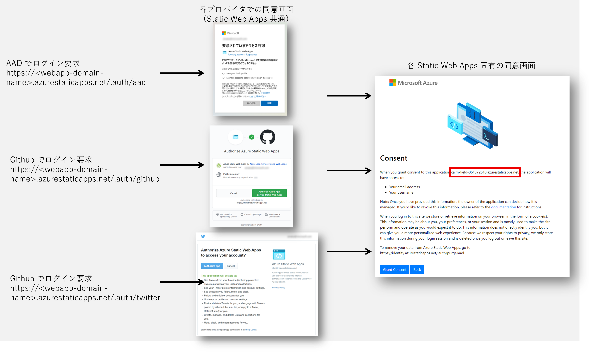

## はじめに

[Azure Static Web Apps](https://docs.microsoft.com/ja-jp/azure/static-web-apps/overview) が GA してしばらくたってしまいましたが、やっとお試しすることができました。
いつものようにまず気になったのは認証やアクセス制御周りなのですが、通常の App Service や Functions とはどうも使い勝手が違うので若干戸惑いました、という記事です。
まあ例によって[ドキュメントに書いてあったこと](https://docs.microsoft.com/ja-jp/azure/static-web-apps/authentication-authorization)ではあるんですが、
試してみないと分からないことも多かったわけです。

（以下では **衝撃** とか書いてますが、個人的にビックリしただけでネガティブな意味合いはありません）

## 何もしなくてもユーザーは認証できる

Azure Static Web Apps では作成時点で 3 つの認証プロバイダーが設定されているので、何も設定しなくてもこれらの ID をもつユーザー認証は可能です。

- Azure Active Directory
- Github
- Twitter

Static Web Apps を作ると ` https://<webapp-domain-name>.azurestaticapps.net `というようなドメインのサイトが稼働するわけですが、
ここで各プロバイダー固有のログインルート `/.auth/login/<provider>` へ誘導してやればユーザーをログインさせることが可能です。
Twitter ID でユーザーを認証したいのであれば Twitter 用の Login URL へリンクを設置しておくなり、リダイレクトするなりすれば良いわけですね。
各プロバイダーに対する**アプリケーションの登録すら必要ない**という 1 つめの衝撃でした。

|Provider Name|Login URL|
|---|---|
|Azure Active Directory|https://_webapp-domain-name_.azurestaticapps.net/.auth/login/aad|
|GitHub|https://_webapp-domain-name_.azurestaticapps.net/.auth/login/github|
|Twitter|https://_webapp-domain-name_.azurestaticapps.net/.auth/login/twitter|

なおこれは「Static Web Apps では匿名アクセスが出来ない」という意味ではありません。
何も設定してない状態ではもちろん匿名アクセスが可能なのですが、上記のログイン URL に誘導してやれば認証（Authentication）、すなわち「ユーザーが誰であるか？」を確認することができる、というだけの話です。
匿名ユーザー（Anonymous）を許可するとかしないとかという話は後述のアクセス制御（Authorization）の話になります。

## ユーザーの同意は隙を生じぬ二段構え

さてログイン URL に画面遷移すると例によってプロバイダー側の同意画面に飛ばされ、「Azure Static Web Apps がアプリがあなたの情報にアクセスしたがってるけど承諾するか？」と確認されることになります。
それに同意すると今度は元々アクセスしていた個々のアプリに対しての同意を求められることになります。



どうもこの Static Web Apps というのはそれ全体で１つのアプリケーションとしてプロバイダーに登録されているようで、Azure Active Directory の管理画面ではエンタープライズアプリケーションを確認できます。
つまり一度 Static Web Apps に対する１つめの同意をすると、別の Static Web Apps にアクセスしても同じプロバイダーを使っている場合には２つ目の同意だけが表示されることになります。いつも使ってるはずの Azure Active Directory なのに **同意画面や画面遷移がいつもと違うな？** という 2 つ目の衝撃でした。

なおこの Static Web Apps への同意後は各ユーザーの [マイアプリ](https://myapps.microsoft.com/) ポータルで確認することができます。
同意を取り消したい場合はこちらから `権限の取り消し` をしてやれば１つめの同意を取り消すことが出来ます。


## アクセストークンは貰えない（クライアントサイド）

さてユーザーが同意してくれればアプリケーションは認証済みのユーザー情報を取得することが出来ます。
クライアントサイドからは直接アクセスエンドポイント `/.auth/me` にアクセスすることで現在ログイン中のユーザ情報を取得できます。
実アプリケーションからの利用では下記のように Fetch API などを呼び出すことで取得可能です。
テスト目的であればブラウザのアドレスバーに直接 `/.auth/me` を入力して画面遷移しても良いでしょう。

```javascript
const ret = await fetch('/.auth/me');
const me = await ret.json();
```

得られる結果は以下のようになります。

```json
// Azure AD 認証をしていた場合の戻り
{
  "clientPrincipal": {
    "identityProvider": "aad",
    "userId": "xxxxxxxxxxxxxxxxxxxxxxxxxxxxxxxxx",
    "userDetails": "username@domainname.com",
    "userRoles": [
      "anonymous",
      "authenticated"
    ]
  }
}
```

ログインしてない状態であれば `clientPrincipal` フィールドが `null` になります。

```json
{
  "clientPrincipal": null
}
```

見ての通り、得られるものはあくまでもユーザー情報だけです。
本家（？） Azure App Service のトークンストアの場合は idトークンやらアクセストークンやらリフレッシュトークンやらが取得出来たのですが、Static Web Apps の場合だと用途が極めて限られそうかなという印象です。
画面初期表示時にまずログイン状態のチェックをするとか、ユーザーロールに応じて画面表示を調整するといった、**ユーザー補助くらいにしか使え無さそう**かな？というのが 3 つ目の衝撃でした。

呼び出しにアクセストークンが必要な API が外部にあるなら、そこは自力実装するしかないかなーというとこでしょうか。

## アクセストークンは貰えない（サーバーサイド）

Static Web Apps では Functions ベースの[サーバーサイド API もホストできる](https://docs.microsoft.com/ja-jp/azure/static-web-apps/add-api)わけですが、
ユーザーが認証済みであればサーバーサイドでもユーザー情報を取得することが出来ます。
ユーザー情報は `x-ms-client-principal` リクエストヘッダーにセットされてきますので、その値を Base64 でデコードしして ASCII で文字列に戻してやれば、クライアントサイドと全く同じ情報が手に入ります。

```c#
var xmscp = System.Text.UTF8Encoding.UTF8.GetString(Convert.FromBase64String(req.Headers["x-ms-client-principal"]));
dynamic cp = JObject.Parse(xmscp);
var message = $"Hello {cp.userDetails} !!!"
```

つまりクライアントサイドと同様に用途は限られそう、ということですかね。
なのでメトリックやイベントの情報収集時にユーザー情報を紐付けたトラッキング用途が主体になりそうかなあ、といったところでしょうか。
この情報だけだとユーザーのフリをして外部サービスを呼び出す Authorization Code Grant Flow 的なことはできなさそうなので、API 側でクレデンシャルを保持する Client Credential Flow にせざるを得ないかなというところです。

## 匿名アクセスはお断り

さて Static Web Apps は既定では匿名アクセスが可能ですので、作った直後は世界中の誰でも匿名で利用可能な状態です。
それがサイトの目的に適っていればいいのですが、ユーザートラッキングなどの目的からアクセスユーザーを特定したいということもあるでしょう。
つまり前述のユーザー認証を強制したい（身元が特定できてないユーザーにはコンテンツにアクセスさせたくない）わけです。

Static Web Apps では[ルート毎にアクセス可能なロールを設定する](https://docs.microsoft.com/ja-jp/azure/static-web-apps/configuration#securing-routes-with-roles)ことが出来るのですが、
このルールを `staticwebapp.config.json` というファイルに記載する必要があります。
また前述の通りユーザーは認証された段階で `authenticated` というロールが与えられています。
いろいろやり口はあると思いますが、サイト全体が保護対象なのであれば例えば下記のように設定することができます。

```json
//staticwebapp.config.json
{
  "$schema": "https://json.schemastore.org/staticwebapp.config.json",
  "routes": [
    {
      "route": "/", "allowedRoles" : ["anonymous"]
    }, 
    {
      "route": "/index.html", "allowedRoles" : ["anonymous"]
    },
    {
      "route": "/*", "allowedRoles" : ["authenticated"]
    }
  ]
}
```

ルート配下全て `/*` に対して匿名アクセス(anonymous)を拒否してしまうと、ログインページへのリンク `/.auth/login/provider` を配置したページにすらアクセスできず不親切極まりないので、そこだけ例外的に許可しています。
本家 Azure App Service のユーザー認証機能のように**自動的にログイン画面にリダイレクトしてくれない**のか・・・、というのが 4 つ目の衝撃でした。

## 一見さんはお断り

前述の方法ですとユーザー認証を強制することはできますが、逆に言えば Azure Active Directory、Twitter、GitHub の ID さえ持っていれば誰でもアクセスできるわけです。
そもそもどの ID も取得は無料かつ容易なので、これを持ってアクセス制御という事は出来ないでしょう。
身元さえ確認できれば(authenticated)誰でも使っていいよ、というサイトならともかく、 **特定のユーザーのみにアクセスを許可したい** ことも多いのではないでしょうか。

このようなアクセス制御を実現するためには個々のユーザーに対してカスタムロールを割り当て、そのロールにのみルートへのアクセスを許可する方法が考えられます。
例えばこのアプリケーションに `users` というロールがあるとすると、前述のルート定義は以下のように書くことができます。

```json
//staticwebapp.config.json
{
  "$schema": "https://json.schemastore.org/staticwebapp.config.json",
  "routes": [
    {
      "route": "/", "allowedRoles" : ["anonymous"]
    }, 
    {
      "route": "/index.html", "allowedRoles" : ["anonymous"]
    },
    {
      "route": "/*", "allowedRoles" : ["users"]
    }
  ]
}
```

せっかくログインしていても認証されている `authenticated` だけではロールが合わないので、`index.html` 以外のコンテンツへのアクセスはすべて `401 : Unauthorized` エラーで拒否されます。
ではどうすれば `users` ロールの仲間に入れてもらえるのでしょうか。
Static Web Apps には「ロール管理」というメニューがありますので、管理者にお願いしてここから `招待` してもらうことになります。


この招待操作を実施すると図のように `招待リンク` が生成されますので、このリンクをアクセス許可したいユーザーに何らかの手段で送付します。
招待されたユーザーはこのリンク先を開いてログインを行うと招待を受け入れた事になるので、ロール管理画面にユーザー情報が追加されます。
この招待されたユーザーがログインするとユーザー情報として招待時に割り当てられたロールを持っている状態になりますので、そのロールで許可されたルートに対してはアクセスが可能になるわけですね。
でも Azure AD B2B のように **招待メールとか送信してくれない**んだ・・・、 というのが5つ目の衝撃でした。

ちなみに画面で1つ1つ登録してはコピーして、という操作は招待するユーザー数が多くなってくると煩雑です。
ある程度の数があるならばスクリプトで実行したほうが楽でしょう。
メールやチャットでの送信まで自動化してしまうのも良いのではないでしょうか。

```bash
$  az staticwebapp users invite \
      -g resourceGroupName \
      -n staticWebAppsName \
      --domain  webapp-domain-name.azurestaticapps.net \
      --authentication-provider AAD \
      --invitation-expiration-in-hours 1 \
      --roles users \
      --user-details "targetuser@yourdomain.com"
```
```json
{
  "expiresOn": "2021-07-14T01:51:20.747501+00:00",
  "id": "/subscriptions/subscription-guid/resourceGroups/resourceGroupName/providers/Microsoft.Web/staticSites/staticWebAppsName/invitations/invitatioin-guid",
  "invitationUrl": "https://webapp-domain-name.azurestaticapps.net/.auth/invitations/accept?provider=AAD&userDetails=targetuser%40yourdomain.com&roles=users&se=2021-07-14T01%3A51%3A20Z&sig=...",
  "kind": null,
  "location": "Central US",
  "name": "guid-guid-guid",
  "resourceGroup": "my-first-static-web-app",
  "systemData": null,
  "type": "Microsoft.Web/staticSites/invitations"
}
```


## バックエンド API も守りたい

Staic Web Apps の API は[本家 Azure Functions に比べてかなり制約がある](https://docs.microsoft.com/ja-jp/azure/static-web-apps/apis)のですが、
個人的に最も意外だったのは Functions Key による制御がかからずに、**デフォルトでは API を呼び出し放題** だったというのが 6 つめの衝撃です。
たとえば以下のような C# Function を作っておいても、Static Web Apps のクライアントサイドからはキー無しであっさり呼び出せてしまうわけです。

```c#
// サーバーサイド API
[FunctionName("HelloAuthUser")]
public static async Task<IActionResult> Run(
    [HttpTrigger(AuthorizationLevel.Function, "get", "post", Route = "hello")] HttpRequest req, ILogger log)
{
    var cpstr = System.Text.UTF8Encoding.UTF8.GetString(Convert.FromBase64String(req.Headers["x-ms-client-principal"]));
    dynamic cp = JObject.Parse(cpstr);
    var ret = new
    {
        message = $"Hello {cp.userDetails} !!!" 
    };
    return new OkObjectResult(ret);
}
```
API キーで守っているつもりが・・・・

```javascript
// クライアントサイドからの呼び出し
let payload = await (await fetch('./api/hello')).json();
alert(payload.message);
```

なので、API の呼び出しもルート規則でアクセス制御しましょう。
Static Web App でホストされる API は全て `/api` ルート配下で動作することになっていますので、その配下となるルート `/api/*` ないしは特定の API を保護してやればいいわけですね。

前述の設定では `users` ロールに招待されたユーザーなら `/*` ルートにアクセス可能ですので、つまり `/api` 配下のルートにもアクセス可能、すなわち API 呼び出しが可能です。
つまりこのままでもさしあたり世界中から無尽蔵に API を呼び出される事故は防ぐことができています。
これを例えば `admin` ロールに招待された一部のユーザーのみに API 呼び出しを許可するのであれば、以下のような設定になるでしょうか。

```json
//staticwebapp.config.json
{
  "$schema": "https://json.schemastore.org/staticwebapp.config.json",
  "routes": [
    {
      "route": "/", "allowedRoles" : ["anonymous"]
    }, 
    {
      "route": "/index.html", "allowedRoles" : ["anonymous"]
    },
    {
      "route": "/api/*", "allowedRoles" : ["admin"]
    },
    {
      "route": "/*", "allowedRoles" : ["users"]
    }
  ]
}
```

## カスタムロール割り当て可能人数が少なすぎる

しかしここで問題があります。
実は Static Web Apps には下記の[クォータ制限](https://docs.microsoft.com/ja-jp/azure/static-web-apps/quotas) があるのです。

> カスタム ロールに属することができるエンドユーザーは最大 25 名

この制限があるため、先ほどの招待は25名までしか行えません。
より正確に言えば招待そのものはできるのですが、招待リンクをユーザーが受け取ってログインしてみると `403 : Forbidden` で拒否されるというとても悲しい事態に陥ります。
よって、このカスタムロールを用いたアクセス制御が実用になるのはおそらく以下のようなパターンになると思います。

- 利用者の人数が極めて限られる
- 基本は匿名アクセスだが、ごく一部の管理機能だけ

そもそも**招待可能人数が少なすぎるのでは？！**というのが 7 つ目の衝撃でした。

うーん、どうしよう。

## ユーザー認証から制御しよう

企業内の用途などで Static Web Apps へのアクセス制御を考えた場合、明示的なホワイトリスト制御が出来た方が使いやすいと考えます。
ところが、上述の通り Static Web Apps が提供しているカスタムロールは割り当て可能な人数が極めて限定的なため、ホワイトリスト用途で使うには向かないのが現状だと思います。

既定で有効になっている認証（Managed Authentication）は、`Azure Static Web Apps (Application ID == d414ee2d-73e5-4e5b-bb16-03ef55fea597)` というマルチテナントアプリケーションに対して認証を行う仕掛けになっています。
このためユーザーが所属する任意のテナントに対して認証を委託することが出来るようになっているわけです。


前述の画面キャプチャにある通り Azure Static Web Apps というアプリはユーザーが管理されている各ディレクトリ１つ１つにエンタープライズアプリケーション(Object ID はテナント固有)として登録されていますので、（一定の権限があるユーザーであれば）このアプリケーションに対してユーザーを割り当てることが可能です。
ただしこの方法では以下の問題が発生します。

- 全ての Azure Static Web App 全体に対する割り当てであるため、特定の Static Web Apps に対するホワイトリストにはならない
- 当該テナントに対しては明示的に割り当てられたユーザーのみに利用を制限することができるが、他のテナントのユーザー認証には効果がない

この解決策としては [Custom Authentication](https://docs.microsoft.com/ja-jp/azure/static-web-apps/authentication-custom?tabs=aad) を使用して独自の Azure AD アプリケーションとして認証する方式が考えられます。
各 Static Web Apps が認証に利用する Azure AD アプリケーションを既定の `Azure Static Web Apps` ではなく、独自のアプリケーションオブジェクトを使用するように、Azure AD 認証プロバイダーを上書き（Override）してやれば良いわけです。


アプリ登録時にシングルテナントとして構成してやれば、組織外テナントのユーザーの認証を排除することができます。
また個々の Static Web Apps 単位でエンタープライズアプリケーションが管理できるようになるので、
[ユーザー割り当て](https://docs.microsoft.com/ja-jp/azure/active-directory/manage-apps/assign-user-or-group-access-portal)
によるホワイトリスト制御も現実的になります。
また、こちらの方法であればユーザー単位ではなくグループに対する割り当ても可能です。

さて実装方法は以下のようになります。

- Azure AD 側の設定
  - 作成した Static Web Apps リソースを表す[アプリケーションを登録](https://docs.microsoft.com/ja-jp/azure/active-directory/develop/active-directory-how-applications-are-added)
  - サポートされているアカウントの種類としてシングルテナントを指定
  - リダイレクト URI は Static Web Apps の認証プロバイダーへのコールバック URL を指定
    - https://_webapp-domain-name_.azurestaticapps.net/.auth/login/aad/callback
  - 生成されたアプリケーション (クライアント) ID を控える
  - ディレクトリ（テナント）ID を控える
  - クライアントシークレットを生成して控える
- Static Web Apps 側の設定
  - `構成` 画面でアプリケーション設定に控えておいたクライアント ID とクライアントシークレットを登録
  - `staticwebapp.config.json` ファイルで Azure AD プロバイダの設定を上書きする
    - `openIdIssuer` のテナント ID 部分を控えておいたテナント ID に書き換える
    - `clientIdSettingName` および `clientSecretSettingName` は控えた値ではなく、アプリケーション設定の名前に書き換える


```json
//staticwebapp.config.json
{
  "$schema": "https://json.schemastore.org/staticwebapp.config.json",
  "auth": {
      "identityProviders": {
          "azureActiveDirectory": {
              "registration": {
                  "openIdIssuer": "https://login.microsoftonline.com/your-app-registered-tenantid",
                  "clientIdSettingName": "AAD_ClientID",
                  "clientSecretSettingName": "AAD_Client_Secret"
              }
          }
      }
  },
  "routes": [
    // 省略
  ]
}
```

ここまでの設定で、当該 Static Web Apps は指定した Azure AD テナントユーザーしか認証できなくなりますので、外部の Azure AD テナントや、Twitter や GitHub などの他のプロバイダーの認証も出来なくなります。（認証を聞かれることもなく 401 Unauthorized で弾かれる）
また初回アクセス時の同意対象も Azure Static Web Apps ではなく、登録したアプリケーションになります。


さらに、同一テナント内でも一部のユーザーのみにアクセスを制限したい（ホワイトリスト制御をしたい）場合には、エンタープライズアプリケーションが作成されているはずなので、そちらでユーザー割り当てを強制し、アクセスを許可するユーザーやグループを登録していきます。


## まとめ

これまで　Azure Web Apps や Azure Functions に慣れ親しんた方には違和感があるのではないでしょうか。
Static Web Apps というのはそういうものだ、と割り切ってしまえば別にどうということはないのですが、
その違和感に気が付かずに設計や実装をしてしまうと事故も起こりそうかなというところで記事にしてみました。
皆さんの参考になれば幸いです。
