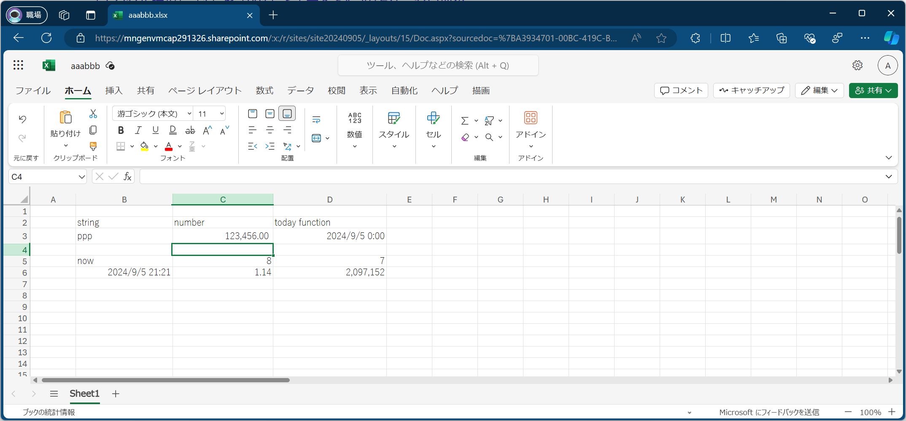
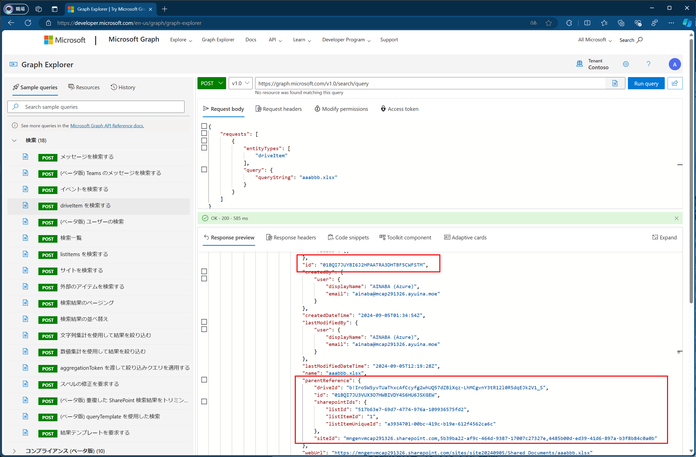
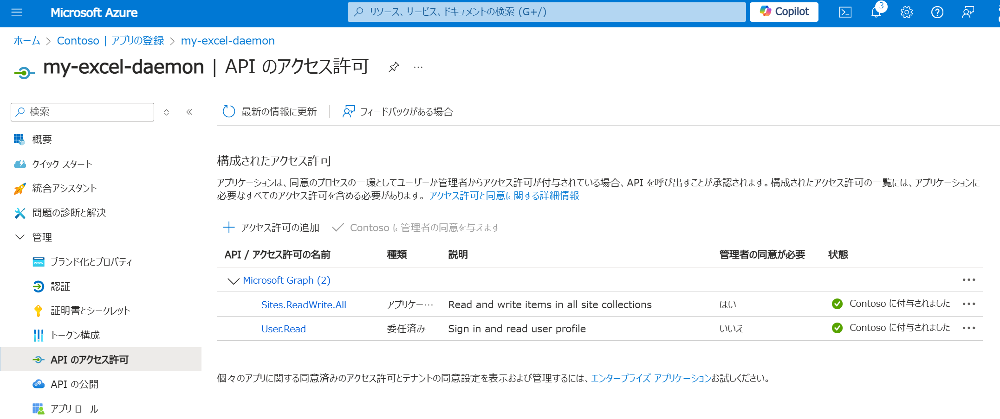
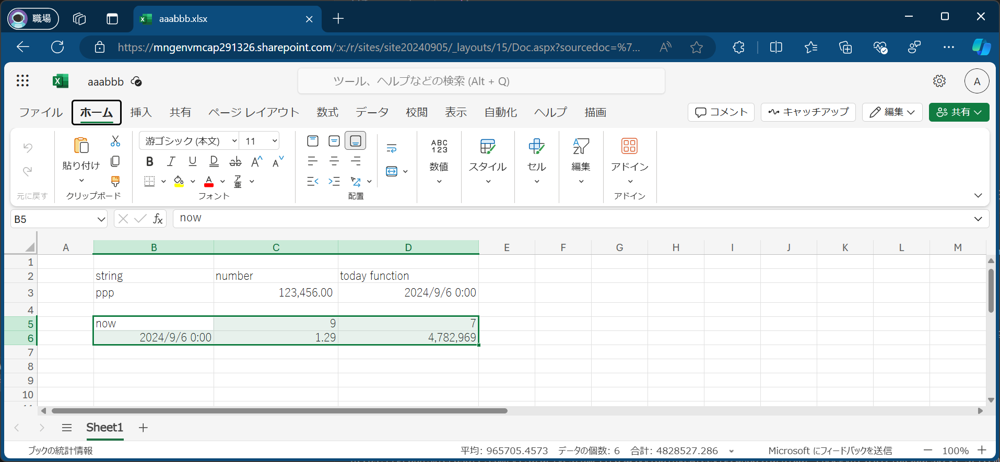

# はじめに

私が IT 業界で働き始めてから約 20 年、頻繁にとまではいきませんが定期的に話題になるのがアプリで Excel ファイルを操作したいというものです。
具体的に Excel で何がしたいかはアプリによって千差万別なのですが、以下のパターンが多いですね。
身に覚えのある方も多いんじゃないでしょうか。

- アプリで動的に Excel ファイルを作りたい （アプリで生成されたデータをもとに帳票を作りたいとか）
- Excel ファイルのデータを読み込んで処理したい（入力フォームとして Excel ファイルを使っているとか）

ところがコレ、割と皆さんチャレンジしがちなのですが、すっきりしたソリューションが無いのが現状だと思います。
とはいえ需要が多いことは間違いないので、完全ではないにしてもある程度の方式は整理しておきたいなと思った次第です。

## 昔からある方法と問題点

この時の定番の手法は Excel が提供している COM サーバーを外部のカスタムアプリケーションから処理するというものです。
PowerShell や VBScript のような COM 対応のランタイムなら VBA マクロと同様に操作すればよいですし、.NET から利用する場合は RCW : Runtime Callable Wrapper とか PIA : Primary Interop Assembly を使用すれば良いわけです。

ところがこの手の話で問題になるのは、Web アプリのような サーバーサイド アプリケーション で実行したいというようなケースです。
Excel はそもそもデスクトップのあるクライアント PC 上でユーザーが対話的に操作するように設計・開発・テストされているため、サーバーサイドで利用は想定されていないためです。
出来る出来ないで言えば技術的には可能なのですが、Microsoft 社もこういったアーキテクチャは非推奨かつサポートしないと明言しています。

- [Office のサーバーサイド オートメーションについて](https://support.microsoft.com/ja-jp/topic/office-%E3%81%AE%E3%82%B5%E3%83%BC%E3%83%90%E3%83%BC%E3%82%B5%E3%82%A4%E3%83%89-%E3%82%AA%E3%83%BC%E3%83%88%E3%83%A1%E3%83%BC%E3%82%B7%E3%83%A7%E3%83%B3%E3%81%AB%E3%81%A4%E3%81%84%E3%81%A6-48bcfe93-8a89-47f1-0bce-017433ad79e2)
- [無人 RPA 環境での Microsoft 365 での Office の無人自動化に関する考慮事項](https://learn.microsoft.com/ja-jp/office/client-developer/integration/considerations-unattended-automation-office-microsoft-365-for-unattended-rpa)

ちなみに昔々はライセンス的にもグレーな利用方法だったのですが、現在は無人実行用のライセンスが提供された模様です。
とはいえ非推奨かつ非サポートなのは変わらないので、サーバーサイドで COM サーバーを使用する方式は避けたいところです。
Windows サーバーに Excel をインストールするのもちょっとアレですし・・・。

## Graph API で出来るんじゃない？

そもそもサーバーに Excel をインストールして、ユーザー操作の代わりにアプリから COM を呼び出すのが問題なわけですから、アプリから Excel ファイルを（.xlsx）を直接操作できればいいわけです。
1st Party 提供のアプローチで言えば Office Open XML SDK というのが提供されているのでコレを利用すればいいのですが、個人的にはもう二度とやりたくありません。

3rd Party から提供されている Excel ファイル操作用のライブラリというものがいろいろ存在します。
機能的には優れてるものも多そうなので積極的に利用したいのですが、ちょっとした操作程度で新規にライセンスを購入してサポート契約を結んで製品評価と選定をして、というのも大変なので出来れば 1st Party 提供の既存の持ち物でやりたいところです。
（この辺りが COM Automation が根強い理由でもあると思います。）

ところで Office 365 ってクラウドサービスでして、Sharepoint に保存された Excel ファイルってブラウザから操作できるんですよね。
PC にインストールされた Excel アプリをメインに使う人も多いでしょうけど、そのファイルは OneDrive なり Sharepoint に置かれている方も多いでしょう。
ブラウザで開いてみれば以下のように表示も編集も出来るわけです。



ということは Web API がきっとあるはずで、Microsoft Graph API には
[Excel のブックとグラフの API](https://learn.microsoft.com/ja-jp/graph/excel-concept-overview)
が含まれています。
これを使って頑張ってみたいと思います。

> 先にお伝えしておくと、COM サーバーを使用する場合に比べると、Graph API で出来ることはかなり限定的です。
> アプリ開発の早い段階で要件が満たせそうか評価することをお勧めします。


# Graph API 利用するアプリ開発の準備

相変わらず前置きが長いですがここからが本題です。

## Sharepoint ドキュメントライブラリとファイルの取り扱い

まずは Sharepoint に保存したファイルの取得ですが、これは Files API を使用して `Drive item` オブジェクトを取得することになります。
API リファレンスの [Files > Drive Item > Get item](https://learn.microsoft.com/en-us/graph/api/driveitem-get?view=graph-rest-1.0&tabs=http) を参照します。

Permission としてはクライアントアプリが `Files.ReadWrite.All` あたりのスコープにアクセスできれば良さそうです。

> 本記事では Web アプリのバックエンドとか夜間バッチとかで動かしたいケースを想定してますので Client Credential Flow で実装する前提で記載しています。

REST API なので URL のパスで xlsx ファイルを表すパスがわかれば良さそうですが、HTTP Request のパスを見てみると `{drive-id}` とか `{site-id}` とか `{item-id}` とか書いてあります。
これは困ったことに Sharepoint のブラウザインタフェースからは取得できません。
いきなりここで躓いたのですが、これらの ID を特定するために素敵な記事を見つけました（感謝！）

- [【SharePoint】Graph APIでサイトID, ドライブID, アイテムIDを調べる方法](https://qiita.com/kyohets/items/d8d90ed5e398469fffd5)

この記事ではいろいろな方法が紹介されていますが、個人的には Sharepoint に適当な Excel ファイルを保存して検索してみる方法がオススメです。
[Graph Explorer](https://developer.microsoft.com/en-us/graph/graph-explorer) を開くといろいろな API をお試しいただけるのですが、
左の一覧から `driveItem を検索する` を開いて保存済みの xlsx ファイルを探してみます。



検索が成功すると Drive item の `id` や、その親に該当する `driveId` や `siteId` 確認できますので、これを控えておきます。
アプリから処理したいときはドキュメントライブラリや Sharepoint サイトは固定でしょうから、これらの値は設定ファイルに書いておけば良いかと思います。
ファイルは動的に生成されるケースもあるかと思いますが、その場合はアプリから作成するようにすれば `item-id` もそのタイミングで取れますから問題ないと思われます。

## クライアントアプリを Entra ID に登録して Graph API へのアクセスを許可する

Graph API は [Entra ID による認証・認可が必要な API](https://learn.microsoft.com/en-us/graph/auth-v2-service?view=graph-rest-1.0&tabs=http) ですので、
それを呼び出すクライアントアプリの登録も必要になります。

- まず [アプリを登録](https://learn.microsoft.com/ja-jp/graph/auth-register-app-v2?view=graph-rest-1.0) して テナント ID、クライアント ID、シークレットの 3 つを控えておきます
- [ユーザーなしでアクセスを取得](https://learn.microsoft.com/ja-jp/graph/auth-v2-service?view=graph-rest-1.0&tabs=http) にある通り、（ユーザーの委任ではなく）アプリケーションのアクセス許可として `Site.ReadWrite.All` を構成します
- このアクセス許可はユーザーでは同意できないので、管理者の同意を与えておきます。



この辺りの操作は Entra ID の管理者とご相談して進めていただければと思います。

## 必要な SDK をインストールする

先ほどのドキュメントを見ると REST API のスペックとともに、各種言語向けの SDK のサンプルコードも載っています。
ひたすら頑張って REST API を叩くのではなく、素直に SDK を使用しましょう。
ここでは .NET SDK を使用するものとします。

```powershell
# コンソールアプリを作成
dotnet new console
# Microsoft Graph SDK をインストール
dotnet add package Microsoft.Graph
# サービスプリンシパルで認証するので Azure.Identity もインストール
dotnet add package Azure.Identity
```

本記事執筆時は以下を利用しました。

- .NET SDK 8.0.400
- Microsoft.Graph 5.56.1
- Azure Identity 1.12.0


# Graph SDK を使用した Sharepoint ドキュメントライブラリ上のファイル操作

ここからは楽しくプログラミングしていきます。
まずは分かりやすいところから、既にドキュメントライブラリに保存済みのファイルを操作していきます。
この章では Excel ファイル依存の部分は無いですが、後で使用しますので新規の xlsx ファイルを作成しておき、いくつかのセルに値を入れておいてください。

## クライアントアプリの認証情報

まず先ほど取得したサービスプリンシパルの情報を環境変数に設定しておきます。

```powershell
$Env:AZURE_TENANT_ID = '先ほど控えた値'
$Env:AZURE_CLIENT_ID = '先ほど控えた値'
$Env:AZURE_CLIENT_SECRET = '先ほど控えた値'
```

この値を使用してまずはトークンクレデンシャルを作成しておきます。
通常は DefaultAzureCredential を使うのですが、ここでは確実にサービスプリンシパルを確実に使うように別のモノを使っています。

```csharp
// 所定の環境変数から自動読み込み
var cred = new EnvironmentCredential();

// もしくは明示的に読み込んで以下のようにしても良い
var cred = new ClientSecretCredential(tenantid, clientid, secret);
```

## ファイル情報の取得

ここからは Files API の操作になります。

```csharp
// Graph Explorer で確認した drive-id や item-id 
var driveid = "ドキュメントライブライを表す drive-id";
var itemid = "ファイルを表す item-id";

// 認証情報を使用して Graph API のクライアントを作成
var client = new GraphServiceClient(cred);

// ファイル情報を取得して表示
var driveitem = client.Drives[driveid].Items[itemid];
var fileinfo = await driveitem.GetAsync();

Console.WriteLine("=== file information ===");
Console.WriteLine("Filename      \t{0}", fileinfo!.Name);
Console.WriteLine("MimeType      \t{0}", fileinfo!.File!.MimeType);
Console.WriteLine("Created       \t{0}", fileinfo!.LastModifiedDateTime);
Console.WriteLine("Last Modified \t{0}", fileinfo!.LastModifiedDateTime);
```

ここまで実行すると以下のような出力が得られると思います。
ちゃんと Excel ファイルっぽいですよね。

```powershell
> dotnet run

=== file information ===
Filename        aaabbb.xlsx
MimeType        application/vnd.openxmlformats-officedocument.spreadsheetml.sheet
Created         2024/09/05 12:09:17 +00:00
Last Modified   2024/09/05 12:09:17 +00:00
```

## ファイルのダウンロード

ドキュメント ライブラリに保存されているファイルなので、当然[コンテンツをダウンロード](https://learn.microsoft.com/ja-jp/graph/api/driveitem-get-content?view=graph-rest-1.0&tabs=http)することができますが、
実は [ファイル形式を変更してダウンロード](https://learn.microsoft.com/ja-jp/graph/api/driveitem-get-content-format?view=graph-rest-1.0&tabs=http)することが可能です。
Excel から PDF ファイルへの変換は割と需要があるんじゃないでしょうか。
本来はこの後で紹介する Excel ファイルへの値の書き込みの後にやりそうな処理なのですが、コード的には先に紹介したほうがわかりやすいかと思いました。

```csharp
//そのままダウンロード
var excelfile = string.Format("{0:yyyyMMdd}-{0:HHmmss}.xlsx", DateTime.Now);
var excelContent = await driveItem.Content.GetAsync();
await excelContent!.CopyToAsync( File.OpenWrite(excelfile) );

//PDF形式でダウンロード
var pdffile = string.Format("{0:yyyyMMdd}-{0:HHmmss}.pdf", DateTime.Now);
var pdfContent = await driveItem.Content.GetAsync( conf => {
    conf.QueryParameters.Format = "pdf";
} );
await pdfContent!.CopyToAsync( File.OpenWrite(pdffile) );
```

ちなみにこの PDF でダウンロードする方法はレイアウトなどが細かく指定できないのですが、どーもこれは印刷時の設定などを反映するようですので、見た目にこだわりたい方はブラウザ上で Excel ファイルの印刷を確認してみるとよいでしょう。

## 空の Excel ファイルの新規作成

作成・保存済みの Excel ファイルの中身の操作はこのあと紹介しますが、[Excel ファイルの新規作成](https://learn.microsoft.com/ja-jp/graph/api/driveitem-put-content?view=graph-rest-1.0&tabs=http#example-upload-a-new-file)ももちろん可能です。
ドキュメント上では C# SDK を使用したサンプルコードが提示されていませんが、先ほどのコンテンツのダウンロード `Content.GetAsync` ではなく、アップロード `Content.PusAsync` をすればよいようです。
このメソッドでは MimeType を指定する方法が無いのでどうやるのかと思ったら、拡張子が xlsx の空のファイルをアップロードすると Excel ファイルが出来上がるみたいです。いいのかこれで・・・。

```csharp
// 空の中身と新規作成するファイル名
using var buffer = new MemoryStream();
string path = "yourExcelFilename.xlsx";

// アップロード
var newContent = client.Drives[driveid].Root.ItemWithPath(path).Content;
var result = await newContent.PutAsync(buffer);

// Drive Item の ID が振られるので控えておく
var ret = new { 
    Name = result.Name, 
    Id = result.Id, 
    MimeType = result.File!.MimeType, 
    OdataType = result.OdataType, 
    WebUrl = result.WebUrl };
```

# Graph SDK を使用した Sharepoint ドキュメントライブラリ上の Excel ファイルのデータ操作

さて佳境に入ってきました。
ここまでの処理でファイル情報は取れてますので、ここからが Excel ファイル内の操作になります。

## Excel ファイルから値の読み込み

まずは [Workbook 内部の特定の Worksheet と Range を取得](https://learn.microsoft.com/ja-jp/graph/api/worksheet-range?view=graph-rest-1.0&tabs=http) します。

> 注：ドキュメントではアプリケーションへのアクセス許可が **「サポートされていません」** となっているのですが、動作するには動作したので引き続き紹介します。
> 本当はちゃんとサポートされる方式で紹介したかったのですが・・・

```csharp
//Sheet1 という名前のシートに含まれる B2:D3 のセル範囲（2行3列）を取得、前述の Excel Online の画像を参照して下さい
var workbook = client.Drives[driveid].Items[itemid].Workbook;
var worksheet = workbook.Worksheets["Sheet1"];
var range1 = await worksheet.RangeWithAddress("B2:D3").GetAsync();
```

Range オブジェクトに含まれる各セルの値をとればいいのですが、ここがちょっと曲者です。
Graph SDK は [Kiota](https://learn.microsoft.com/ja-jp/openapi/kiota/overview) と呼ばれるツールを使用して Open API 仕様から生成されています。
ところが Excel のセルは様々なデータ型が入る可能性があるので、事前に生成されたインタフェースでは決定することができません。
このためクラスライブラリとしては `UntypedNode` というデータ型になっているため、実行時に適切な型に変換しつつデータを取得する必要があります。

- [Serialization with Kiota API clients](https://learn.microsoft.com/en-us/openapi/kiota/serialization?tabs=csharp#untyped-node)
- [How to get cell data from Excel file using Microsoft Graph SDK](https://stackoverflow.com/questions/77826705/how-to-get-cell-data-from-excel-file-using-microsoft-graph-sdk)

さて先ほど取得した `B2:D3` というアドレスで取得した Range は 2 行 x 3 列の `2 次元配列` になっているはずです。
ちなみに `A4` といように指定して 1 行 x 1 列だとしても要素数が 1 つずつしかないですが `2 次元配列` であることには変わりがありません。
配列は `UntypedArray` というデータ型なので以下のようにループを回すことができます。

```csharp
// 第 1 次元（行のループ）
var rows = range1!.Values as UntypedArray;
foreach(var r in rows!.GetValue())
{
    // 第 2 次元（列のループ）
    var cols = r as UntypedArray;
    foreach(var c in cols!.GetValue())
    {
        // 各セルに入っているデータ型をチェックしつつ値を取得
        if(c is UntypedString us)
            Console.WriteLine(us.GetValue());
        else if (c is UntypedLong ul)
            Console.WriteLine(ul.GetValue());
        else if (c is UntypedInteger ui)
            Console.WriteLine(ui.GetValue());
        else if (c is UntypedDouble ud)
            Console.WriteLine(ud.GetValue());
        else if (c is UntypedBoolean ub)
            Console.WriteLine(ub.GetValue());
        else
            Console.WriteLine(c.GetType());
    }
}
```

これを実行すると以下のような結果が得られると思います。

```powershell
> dotnet run

string              # B2 の値（文字列）
number              # C2 の値（文字列）
today function      # D2 の値（文字列）
ppp                 # B3 の値（文字列）
123456              # C3 の値（整数が取れているが、文字列ではないのでカンマ区切りの書式は含まれていない）
45540               # D3 の値（このセルには `=Today()` という関数が入っており、日付の内部形式の整数値が取得されている）
```

数式がとりたい場合は `Range.Values` プロパティではなく、`Range.Formulas` プロパティを処理する必要があります。
`var rows = range1!.Formulas as UntypedArray;`
のように変更して同様にループを回すと、以下の結果が得られます。

```powershell
> dotnet run

string
number
today function
ppp
123456
=TODAY()            # 数式での表現が取得できている
```

書式がとりたい場合には `Range.NumberFormat` プロパティを処理する必要があります。
`var rows = range1!.NumberFormat as UntypedArray;`
のように変更して同様にループを回すと、以下の結果が得られます。

```powershell
> dotnet run

General
General
General
General
#,##0.00_);[Red](#,##0.00)
m/d/yyyy h:mm
```

あらためて Excel ファイルと見比べてみましょう。


## Excel ファイルへの値の書き込み

上記の「値の読み込み」で見た通り、各セルには「値 : Value」か「数式 : Formula」を入れつつ「書式 : NumberFormat」で見た目を整えれば良さそうなことがわかります。
というわけで今度は値を入力したいので [範囲を更新する](https://learn.microsoft.com/ja-jp/graph/api/range-update?view=graph-rest-1.0&tabs=http) を確認したところ、なんと SDK には更新用のメソッドが存在せず REST API の叩き方しか掲載されていません。
Visual Studio のインテリセンスやデバッガで見ても見当たらないので、これはドキュメントの記載漏れではなく本当に存在しないものと思われます。

それでは REST API を直接呼び出して Range に PATCH をあてていきましょう。
必要な情報は以下になります。

- 更新対象の範囲（Range）を指定するアドレスと、それを指し示す URL
- 認証を通すための Entra ID から発行されたアクセストークン
- 値、数式、書式を含んだ更新内容のデータ

これらの値は SDK から取得できますので、`System.Net.Http.HttpClient` あたりで送りつけてやれば良さそうです。

```csharp
// この範囲（2 行 3 列）を更新したい
var range2 = worksheet.RangeWithAddress("B5:D6");

// まずは Range を表す URL を取得する
var requestUri = range2.ToGetRequestInformation().URI;
Console.WriteLine(requestUri);

// 先ほど認証に使用したクレデンシャルを使用してアクセストークンを直接取得する
var token = await cred.GetTokenAsync(new TokenRequestContext(new string[] { "https://graph.microsoft.com/.default" }));
Console.WriteLine(token.Token);

// 送信するデータを用意する
var obj = new
{
    values = new object[]{
        new object?[] { "now", 9, 7 },
        new object?[] { null, null, null }
    },
    formulas = new object[]{
        new object?[] { null, null, null },
        new object?[] { "=Now()", "=C5/D5", "=POWER(C5,D5)" }
    },    
    numberFormat = new object[]{
        new object?[] { null, null, null },
        new object?[] { null, "#,##0.00", "#,##0" }
    },    
};
var json = JsonSerializer.Serialize(obj);
Console.WriteLine(json);

// REST API を呼び出す（よろしくない呼び出し方ではあるが、ここでは手抜き）
var httpClient = new HttpClient();
httpClient.DefaultRequestHeaders.Authorization = new AuthenticationHeaderValue("Bearer", token.Token);
var content = new StringContent(json, Encoding.UTF8, "application/json");
var res = await httpClient.PatchAsync(requestUri, content);

Console.WriteLine(res.StatusCode);
```

これを実行すると以下のような出力が得られます。
（見やすいように改行やコメントを入れてあります）

```powershell
# B5：D6 の Range を表す URL
https://graph.microsoft.com/v1.0/drives/{drive-id}/items/{item-id}/workbook/worksheets/Sheet1/range(address='B5%3AD6')

# 設定したい値、数式、書式（それぞれが Range のサイズと一致する 2 次元配列）
{
  "values": [ 
      ["now", 9, 7], 
      [null, null, null]],
  "formulas":[
      [null, null, null],
      ["=Now()", "=C5/D5", "=POWER(C5,D5)"]],
  "numberFormat":[
      [null, null, null],
      [null, "#,##0.00", "#,##0"]]
}

# 取得されたアクセストークン（DevToys や https://jwt.ms などでデコードして確認可能）
eyJ0eXAiOiJKV1QiLCJub25jZSI6Ik...

# 成功したら HTTP 200 OK が返ってくるはず
OK
```

Sharepoint 上の Excel ファイルにも反映されていることが確認できます。




# まとめと感想と補足

試してみたら一応できたものの、割と苦労しましたし、ちょっと癖のあるコーディングになってしまいました。
もっといろいろなパターンの操作が可能だとは思いますが、基本的な処理方法としてはこんなところだと思います。
しかも [VBA マクロや COM Automation で操作可能なオブジェクト](https://learn.microsoft.com/ja-jp/office/vba/api/overview/excel/object-model) に比べると圧倒的に種類が少ないのです。
ここまで紹介しておいてなんですが、冒頭に記載した通り Graph API で提供されている範囲でアプリの要件が満たせるかは最初に良く確認しておくべきだと思います。

ただ「ありものでちょろっと済ませたい」というようなケースでは COM Automation で頑張らなくていいので、Graph API も有力な選択肢になるかと思います。

## その他の方式

Excel ファイルを操作する 1st Party な方式としては [Office スクリプト](https://learn.microsoft.com/ja-jp/office/dev/scripts/overview/excel) という方式も考えられます。
ざっくり言えば「JavaScript で書いてクラウド上で動作させられる Excel マクロ」です。
データの引き渡しなどは工夫する必要がありそうですが、REST API 経由で無理して Excel を操作しなくてよいので、処理内容が多岐にわたる場合は適切かもしれません。
こちらも後日検証したいと思っています。

## アプリの実行場所と認可

今回は開発端末からサービスプリンシパルを使用して Graph API にアクセスしています。
この方式であればオンプレミス環境や非 Microsoft クラウドからも実行可能です。
しかしアプリを Azure 上で動作させるならば Managed ID が使ますので、[こちらの記事もご参照ください](../msgraph-client-on-azure/)。


