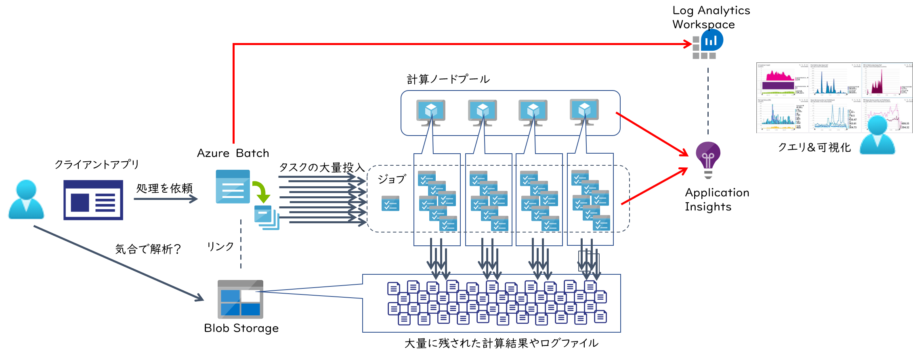

## はじめに

最近は Azure で分散並列処理をするためのサービスも様々提供されておりますが、その中でも老舗のサービスである 
[Azure Batch](https://docs.microsoft.com/ja-jp/azure/batch/batch-technical-overview)
もシンプルかつ強力なフレームワークを提供しており、非常に便利なお勧めの一品です。
サービスそのものの紹介や利用方法は公式ドキュメントをご参照いただければと思いますが、大雑把に言えば下記のような処理を実施するためのフレームワークを提供しています。

- Azure Batch の API 叩いて大量の計算ノード（仮想マシン）を配置する
- 各計算ノードで処理させるためのアプリやデータをばらまいて、コマンドラインを送り込んで実行させる
- コマンドラインの実行結果となるファイルやログを Azure Blob ストレージに吸い上げる

このコマンドラインや入出力に使われるファイルを `タスク` として管理し、複数のタスクを `ジョブ` という単位で取りまとめて管理してくれます。
利用が大規模になるとノードを数百持つプールが複数稼働し、それらのノード上で複数の数千数万といったタスクが並列に実行されたりするわけです。



そのような状況でトラブルシュートやチューニングを行おうとすると当然リアルタイム解析は現実的では無く、結果として残されたログファイルをもとに事後解析が必要になります。
しかしタスクが数千実行されれば、その数倍のログや結果ファイルが Blob に残されているわけで、これを効率的に分析するための仕組みが必要になってきます。
これは Azure Batch だけでは実現できないので、1つの手段としては 
[Application Insights](https://docs.microsoft.com/ja-jp/azure/azure-monitor/app/app-insights-overview)
が便利に使用できます。
というわけで、本記事では Azure Batch で動作するアプリケーションからインサイトを得るために Application Insithgs を利用する方法について紹介していきます。
公式ドキュメントでは
[こちら](https://docs.microsoft.com/ja-jp/azure/batch/monitor-application-insights)
で解説されている内容になりますが、これを補足するのがこの記事の目的になります（備忘録とも言う）

## Azure Batch と Application Insights

Azure Batch から Application Insights に流し込めるデータは以下の２種類です。

- [プラットフォーム] 計算プール内の各ノードのテレメトリ（CPU/Memory/Diskなどのパフォーマンスデータ）
- [アプリケーション] タスクとして実行されるアプリケーション固有のログ情報（トレース、イベント、メトリック、例外など）


前者は実行するジョブやタスクによらず、汎用的に構成できるもので Batch Insights とも呼ばれます。
プールにノードが配備される際に最初に実行される 
[開始タスク](https://docs.microsoft.com/ja-jp/azure/batch/jobs-and-tasks)
において、
[こちら](https://github.com/Azure/batch-insights)
で提供される監視用のアプリをバックグラウンドプロセスとして起動・常駐させることで、
ジョブやタスクの実行状況に関わらず継続的にテレメトリ情報を Application Insights に送信します。

後者はアプリケーション内部で記録したい情報を明示的に Application Insights に送信するコードを埋め込む（インストルメンテーション）必要があるので、
独自開発したアプリケーションか、オープンソースなどのカスタマイズ可能なアプリケーションである必要があります。
各種言語で記述されたコードから対応する SDK を利用して 
[Application Insights の API](https://docs.microsoft.com/ja-jp/azure/azure-monitor/app/api-custom-events-metrics)
を呼び出すことでデータを送信します。

これらの収集されたデータを [Azure Batch Explorer](https://azure.github.io/BatchExplorer/) で可視化する、
あるいは Azure Portal から [KQL : Kusto Query Language](https://docs.microsoft.com/ja-jp/azure/data-explorer/kusto/query/) を用いて柔軟な解析を行うことになります。

## Batch Insights の使い方

[Batch Insights の設定手順](https://github.com/Azure/batch-insights) にしたがって構成すると、
[Azure Batch Explorer](https://azure.github.io/BatchExplorer/) でプールやノードの情報を参照する際に、
CPU, Memory, Network, Disk IO などの各種グラフが表示されるようになります。
簡単で便利ですね。


しかし残念なことに Batch Explorer では直近の 10分、1時間、1日、1週間の各種グラフを表示してくれるのみです。
つまり、昨日の夜間バッチのデータだけグラフに表示したい、先々週のデータと比較したい、Excelに出力してグラフを綺麗にしたい、などの要件には対応できません。

このようなケースでは、Azure Portal から独自のクエリをかけていくといいでしょう。
Batch Insights が収集したデータは `customMetrics` テーブルに格納されていますので、こちらを対象にクエリを作成します。
例えば以下は `９時から１２時の間における各コアの使用量を5分間隔で集計して線グラフで表示する` 礼になります。

```kql
customMetrics
| where name == 'Cpu usage'
| where timestamp between(datetime("2020-10-30 09:00:00") .. datetime("2020-10-30 12:00:00"))
| extend core = strcat(cloud_RoleInstance, ' - CPU #', customDimensions['CPU #'])
| extend usage = valueSum / valueCount
| summarize avg(usage) by bin(timestamp, 5m), core
| render timechart 
```

これを実際に表示してみると以下のようになります。
この時は４コアx３ノードのプールで計算していたので、計 12 コア分のグラフが表示されました。


Application Insights にクエリを保存しておけばいつでもポータルから実行できますし、ダッシュボードにピンしておけば計算状況の監視にも使えます。
レポートを作成する上でグラフの見た目が気に食わなければ、クエリの結果を CSV でエクスポートしてみんな大好き Excel でグラフを作るのもいいと思います。

## カスタム トレースログの表示と可視化

ノードの性能情報を表示するのは簡単でしたが、各アプリケーションが動作した際の部分的な処理の実行時間や回数、エラー情報などはこのままでは表示できません。
残念なことにAzure Batch は
[自動インストルメンテーション](https://docs.microsoft.com/ja-jp/azure/azure-monitor/app/codeless-overview)
に対応していませんので、アプリに対して手動でインストルメンテーションしてやる必要があります。

要はログ出力コードの埋め込みになるわけですが、これは言語やランタイムによって異なってきますので、
詳細は[公式ドキュメント](https://docs.microsoft.com/ja-jp/azure/azure-monitor/app/api-custom-events-metrics)をご参照ください。
例えば以下は .NET で直接埋め込む例になります。

```cs
using (var ops = telemetryClient.StartOperation<RequestTelemetry>("実行時間を計測したい"))
{
    telemetryClient.TrackEvent("イベント開始");
    for(int i = 0; i < 20; i ++)
    {
        telemetryClient.TrackTrace($"{i}回目の実行", SeverityLevel.Verbose);
        try
        {
            //Do Work
        }
        catch (Exception ex)
        {
            telemetryClient.TrackException(ex);
            throw;
        }
    }
}
```
もしすでに[ロギングフレームワーク](https://docs.microsoft.com/ja-jp/azure/azure-monitor/app/asp-net-trace-logs)を使用したコードが埋め込まれているのであれば、
その出力先としてApplication Insights を追加するだけで済むと思います。

このようにロギングコードを埋め込むだけでもクエリはかけられるようになるのですが、これだけでは1つ1つのトレースがバラバラにデータベースに入るだけで、
どのジョブ、どのノード、どのタスクで実行された時の情報なのかがわからないと不便でしょう。
Azure Batch で処理が実行される際には
[ランタイム環境変数](https://docs.microsoft.com/ja-jp/azure/batch/batch-compute-node-environment-variables)
に様々な情報が設定されています。
これを全てのインストルメンテーションコードにメタデータとして付与してやれば、あとで様々な解析でしやすくなるはずです。
またまた C＃ の例になりますが、テレメトリクライアントの初期化時に下記のようなコードを一回だけ実行しておけば、複数のレコードを横断的に解析できるわけです。

```cs
Environment.GetEnvironmentVariables().Keys.OfType<string>().Where(k => k.StartsWith("AZ_BATCH_")).ToList().ForEach(k => 
{
    _telemetry.Context.GlobalProperties.Add(k, Environment.GetEnvironmentVariable(k));
});
```

