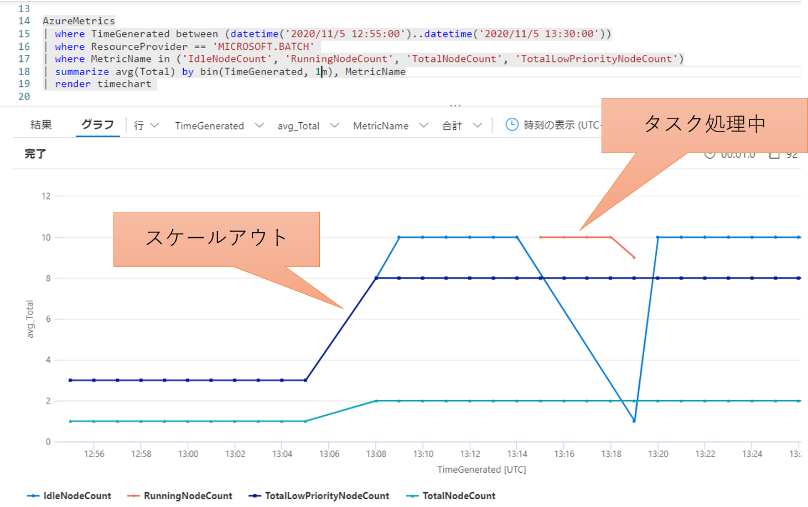

## はじめに

最近は Azure で分散並列処理をするためのサービスも様々提供されておりますが、その中でも老舗のサービスである 
[Azure Batch](https://docs.microsoft.com/ja-jp/azure/batch/batch-technical-overview)
もシンプルかつ強力なフレームワークを提供しており、非常に便利なお勧めの一品です。
サービスそのものの紹介や利用方法は公式ドキュメントをご参照いただければと思いますが、大雑把に言えば下記のような処理を実施するためのフレームワークを提供しています。

- Azure Batch の API 叩いて大量の計算ノード（仮想マシン）を配置する
- 各計算ノードで処理させるためのアプリやデータをばらまいて、コマンドラインを送り込んで実行させる
- コマンドラインの実行結果となるファイルやログを Azure Blob ストレージに吸い上げる

このコマンドラインの実行に必要な環境変数、入出力に使われるファイルなどの一式を `タスク` として管理し、
複数のタスクを `ジョブ` という単位で取りまとめて管理してくれます。
利用が大規模になるとノードを数百持つプールが複数稼働し、それらのノード上で複数の数千数万といったタスクが並列に実行されたりするわけです。


そのような状況でトラブルシュートやチューニングを行おうとすると当然リアルタイム解析は現実的では無く、結果として残されたログファイルをもとに事後解析が必要になります。
しかしタスクが数千実行されれば、その数倍のログや結果ファイルが Blob に残されているわけで、これを効率的に分析するための仕組みが必要になってきます。
これは Azure Batch だけでは実現できないので、1つの手段としては 
[Application Insights](https://docs.microsoft.com/ja-jp/azure/azure-monitor/app/app-insights-overview)
が便利に使用できます。
またこの Application Insights で収集したテレメトリを Log Analytics ワークスペースに送信出来るようになりました。
つまり Azure Batch そのものが出力する診断ログやメトリックもまとめて解析できるわけです。
というわけで、本記事では Azure Batch で動作するアプリケーションからインサイトを得るために Azure Monitor の活用方法について紹介していきます。

## Azure Batch と Application Insights

Azure Batch から Application Insights に流し込めるデータは以下の２種類です。

- [プラットフォーム] 計算プール内の各ノードのテレメトリ（CPU/Memory/Diskなどのパフォーマンスデータ）
- [アプリケーション] タスクとして実行されるアプリケーション固有のログ情報（トレース、イベント、メトリック、例外など）


前者は実行するジョブやタスクによらず、汎用的に構成できるもので Batch Insights とも呼ばれます。
プールにノードが配備される際に最初に実行される 
[開始タスク](https://docs.microsoft.com/ja-jp/azure/batch/jobs-and-tasks)
において、
[こちら](https://github.com/Azure/batch-insights)
で提供される監視用のアプリをバックグラウンドプロセスとして起動・常駐させることで、
ジョブやタスクの実行状況に関わらず継続的にテレメトリ情報を Application Insights に送信します。

後者はアプリケーション内部で記録したい情報を明示的に Application Insights に送信するコードを埋め込む（インストルメンテーション）必要があるので、
独自開発したアプリケーションか、オープンソースなどのカスタマイズ可能なアプリケーションである必要があります。
各種言語で記述されたコードから対応する SDK を利用して 
[Application Insights の API](https://docs.microsoft.com/ja-jp/azure/azure-monitor/app/api-custom-events-metrics)
を呼び出すことでデータを送信します。

これらの収集されたデータを [Azure Batch Explorer](https://azure.github.io/BatchExplorer/) で可視化する、
あるいは Azure Portal から [KQL : Kusto Query Language](https://docs.microsoft.com/ja-jp/azure/data-explorer/kusto/query/) を用いて柔軟な解析を行うことになります。
公式ドキュメントでは
[こちら](https://docs.microsoft.com/ja-jp/azure/batch/monitor-application-insights)
で解説されている内容になります。

## Batch Insights の使い方

[Batch Insights の設定手順](https://github.com/Azure/batch-insights) にしたがって構成すると、
[Azure Batch Explorer](https://azure.github.io/BatchExplorer/) でプールやノードの情報を参照する際に、
CPU, Memory, Network, Disk IO などの各種グラフが表示されるようになります。
簡単で便利ですね。


しかし残念なことに Batch Explorer では直近の 10分、1時間、1日、1週間の各種グラフを表示してくれるのみです。
つまり、昨日の夜間バッチのデータだけグラフに表示したい、先々週のデータと比較したい、Excelに出力してグラフを綺麗にしたい、などの要件には対応できません。

このようなケースでは、Azure Portal から独自のクエリをかけていくといいでしょう。
Batch Insights が収集したデータは `customMetrics` テーブルに格納されていますので、こちらを対象にクエリを作成します。
例えば以下は `９時から１２時の間における各コアの使用量を5分間隔で集計して線グラフで表示する` 例になります。

```kql
customMetrics
| where name == 'Cpu usage'
| where timestamp between(datetime("2020-10-30 09:00:00") .. datetime("2020-10-30 12:00:00"))
| extend core = strcat(cloud_RoleInstance, ' - CPU #', customDimensions['CPU #'])
| extend usage = valueSum / valueCount
| summarize avg(usage) by bin(timestamp, 5m), core
| render timechart 
```

これを実際に表示してみると以下のようになります。
この時は４コアx３ノードのプールで計算していたので、計 12 コア分のグラフが表示されました。


Application Insights にクエリを保存しておけばいつでもポータルから実行できますし、ダッシュボードにピンしておけば計算状況の監視にも使えます。
レポートを作成する上でグラフの見た目が気に食わなければ、クエリの結果を CSV でエクスポートしてみんな大好き Excel でグラフを作るのもいいと思います。

## カスタム トレースログの表示と可視化

Batch Insights でノードの性能情報を収集するのは簡単でしたが、ジョブやタスクの実行回数やエラーといった情報が送信出来ません。
また Batch Explorer は「プールとノード」や「ジョブとタスク」というフレームワークとして定義された階層構造での分析には便利なのですが、
「タスク間の依存関係」や「タスク内で実施される様々な処理」といったようなアプリケーションの仕様に基づいた分析が出来ません。
さらに残念なことにAzure Batch は
[自動インストルメンテーション](https://docs.microsoft.com/ja-jp/azure/azure-monitor/app/codeless-overview)
に対応していません。
というわけで、要件に基づいた柔軟な分析をしたい場合には、アプリに対して手動でインストルメンテーションを行うことで必要な情報を Application Insights に明示的に送信し、KQL を駆使してデータを加工する必要があります。

まずはインストルメンテーションですが、要はログ出力コードの埋め込みをします。
これは言語やランタイムによって異なってきますので、
詳細は[公式ドキュメント](https://docs.microsoft.com/ja-jp/azure/azure-monitor/app/api-custom-events-metrics)をご参照ください。
例えば以下は .NET で直接埋め込む例になります。

```cs
using (var ops = telemetryClient.StartOperation<RequestTelemetry>("hoge"))
{
    telemetryClient.TrackEvent("イベント開始");
    for(int i = 0; i < 20; i ++)
    {
        telemetryClient.TrackTrace($"{i}回目の実行", SeverityLevel.Verbose);
        try
        {
            //Do Work
        }
        catch (Exception ex)
        {
            telemetryClient.TrackException(ex);
            throw;
        }
    }
}
```
もしすでに[ロギングフレームワーク](https://docs.microsoft.com/ja-jp/azure/azure-monitor/app/asp-net-trace-logs)を使用したコードが埋め込まれているのであれば、
その出力先としてApplication Insights を追加するだけで済むと思います。

このようにロギングコードを埋め込むだけでもクエリはかけられるようになるのですが、これだけでは1つ1つのトレースがバラバラにデータベースに入るだけで、
どのジョブ、どのノード、どのタスクで実行された時の情報なのかがわからないと不便でしょう。
Azure Batch で処理が実行される際には
[ランタイム環境変数](https://docs.microsoft.com/ja-jp/azure/batch/batch-compute-node-environment-variables)
に様々な情報が設定されています。
これを全てのインストルメンテーションコードにメタデータとして付与してやれば、あとで様々な解析でしやすくなるはずです。
またまた C＃ の例になりますが、テレメトリクライアントの初期化時に下記のようなコードを一回だけ実行しておけば、複数のレコードを横断的に解析できるわけです。

```cs
Environment.GetEnvironmentVariables().Keys.OfType<string>().Where(k => k.StartsWith("AZ_BATCH_")).ToList().ForEach(k => 
{
    _telemetry.Context.GlobalProperties.Add(k, Environment.GetEnvironmentVariable(k));
});
```

さてそれではクエリを実行されてみましょう。
先ほどのようなコードで記述した場合、`StartOperation`で記録した部分は`requests` テーブルに対して `hoge` というオペレーション名で記録されているはずです。
このテーブルには `duration` として実行時間が記録されるので性能測定に便利です。
またプロパティとして付与した情報は `customDimensions` 列に格納されているので、この中から分析に必要なフィールドを展開してやれば良いわけです。
下記は `とあるジョブ ID 内で実行された hoge というオペレーションの実行時間を50ミリ秒刻みに分類し、その出現頻度をノード別に色分けして棒グラフに出力する` 例になっています。

```kql
requests
| extend jobid = customDimensions["AZ_BATCH_JOB_ID"]
| where jobid == 'job-app01-20201030-143021-210652'
| where operation_Name == 'hoge'
| extend node = customDimensions["AZ_BATCH_NODE_ID"]
| summarize count() by bin(duration, 50), tostring(node)
| order by duration asc  
| render columnchart 
```
実際の出力結果は以下のようになります。
この時は20ノードで処理をしているので大分カラフルになりましたが、最頻値の150ミリ秒前後ではほぼ均等にノードが現れていますので、ノードによって処理時間に差はあまり出ていないようです。
しかし回数は少ないですが、実行時間の長いものは1000秒を超えているものもあるようです。


Azure Batch が管理できるのはタスクの単位ですが、ここではオペレーションという独自の処理単位で集計ができています。
タスクの中で `hoge` という処理は複数回実行されているかもしれませんし、一度も行われていないかもしれませんが、タスクの粒度とは関係なく興味のある単位で実行時間の解析が出来たわけです。

さてもう一つの例を考えてみます。
通常１つのプールの中で複数台のノードが動作しているわけですが、このプールに対して何度もジョブが投入され、大量のタスクを分散して実行することになります。
実はアプリの起動直後に `TrackTrace` を使用して `使用された起動引数` を記録しておきました。
各ノードで記録されたこのトレースの回数を数えれば、各ノードが均等に仕事をしているかがわかります。
下記は `とあるプールの中で実行された、特定のトレースメッセージを含むものだけ抽出し、各ノードごとに出現回数を数えて棒グラフに表示する`クエリになっています。

```
traces
| where customDimensions["AZ_BATCH_POOL_ID"] == 'pool0-20201030-142818-029975'
| where message contains "app01-env.dll config"
| extend taskid = customDimensions["AZ_BATCH_TASK_ID"]
| extend node = customDimensions["AZ_BATCH_NODE_ID"]
| summarize count(taskid) by tostring(node)
| render barchart
```

実際の出力結果は以下のようになります。
ジョブやタスクは何度も実行しているのですが、プールのサイズを途中で変えていないのでノード数と一致するバーが表示されています、全てのノードに仕事が割り当てられているようです。
各ノードだいたい450回程度の実行が記録されているのですが、やたらと数が多い（900程度）ノードと、やたらと少ない（200程度）ノードがいるようです。
あまりうまく分散できていないようですね。


こちらの例では複数のジョブやタスクを横断して、ノード当たりの仕事量に着目した解析、ということになります。

## Azure Batch と Log Analytics

ここまでの内容で Batch Insithgs を利用することでノードレベルでのパフォーマンス情報が、
アプリケーションの詳細なテレメトリ情報を収集・解析ができるようになりましたが、
このままでは以下のような課題があります。

- インストルメンテーションが不可能な 3rd Party 製アプリケーションの実行状況は収集することできない
- Batch Insights やカスタムアプリの起動に失敗すると何も情報が取れない
- ノード内で実行されたアプリでは収集できないプールの生成やノードの起動などのイベント情報が取れない

このためプールやタスクを管理している Azure Batch 側からのデータもあわせて収集しておくと良いでしょう。
Azure Batch の[診断ログや各種メトリック](https://docs.microsoft.com/ja-jp/azure/batch/batch-diagnostics)は元々ストレージアカウントや Log Analytics ワークスペースに収集することが出来るのですが、
この収集先を前述の Application Insights と[統合された Log Analytics ワークスペース](https://docs.microsoft.com/ja-jp/azure/azure-monitor/app/create-workspace-resource)
にしてやることで各種情報を一元的に分析できるようになるわけです。


実際に Application Insights を Log Analytics ワークスペースと統合してやると、
診断ログが格納された `AzureDiagnostics` テーブルや各種メトリック値が格納された `AzureMetrics` テーブルと一緒に、
Application Insights から送信された AppXxxx テーブルが確認出来ます。

## Azure Batch 診断ログの解析

まずタスクの実行状況を診断ログから確認してみます。

```kusto
AzureDiagnostics
| where TimeGenerated between (datetime('2020/11/5 12:55:00')..datetime('2020/11/5 13:30:00'))
| where ResourceProvider == 'MICROSOFT.BATCH' and OperationName startswith "Task" 
| summarize count() by bin(TimeGenerated, 1m), OperationName
| render columnchart 
```
結果を見ると 1000 タスクの全てが開始するのに 5 分程度かかっていますが、同じく 5 分程度で 1000 タスクが終了しています。
投入したタスクに対しては 1 分あたり 200 タスクさばける程度の処理能力を持っているようですね。


## Azure Batch メトリックの解析

次にこの時間帯のノードの利用状況も見てみましょう。

```kusto
AzureMetrics
| where TimeGenerated between (datetime('2020/11/5 12:55:00')..datetime('2020/11/5 13:30:00'))
| where ResourceProvider == 'MICROSOFT.BATCH' 
| where MetricName in ('IdleNodeCount', 'RunningNodeCount', 'TotalNodeCount', 'TotalLowPriorityNodeCount')
| summarize avg(Total) by bin(TimeGenerated, 1m), MetricName
| render timechart 
```

タスクが投入される少し前にプールが４ノード（Standard VM 1 + Low Priority VM 3）から 10 ノード（Standard VM 2 + Low Priority VM 8）にスケールし、
タスクが実行されていた時間帯は全ノードが running 状態であったことが確認出来ます。




## まとめ

Azure Batch を利用する場合は診断ログとメトリックを Log Analytics ワークスペースに送信してやるだけで様々な実行状況の解析が可能になります。
加えて Batch Insights を利用することで各ノード内の詳細なパフォーマンスデータが取れるようになりますので、ボトルネックの分析やチューニングに役立てることが出来ます。
ここまでは任意のアプリケーションに大して設定だけで実装可能ですが、カスタムアプリケーションの場合はインストルメンテーションを行うことで、
よりアプリケーションの仕様に即した性能分析を行うことが出来るようになります。

## 留意事項

ここまで紹介してきた通り Application Insight をうまく使用していただくことで柔軟な解析が可能になるのですが、以下の点に留意していただければと思います。

- 送信したデータに大して[サンプリング](https://docs.microsoft.com/ja-jp/azure/azure-monitor/app/sampling) が行われるため、ログ全量に対してクエリが行えるわけではない
- 各 SDK は送信前にバッファリングを行うため、アプリ終了時には[データのフラッシュ](https://docs.microsoft.com/ja-jp/azure/azure-monitor/app/api-custom-events-metrics#flushing-data)を行う必要がある。

これは Application Insights 上で解析するとデータが欠けている場合があることを意味します。
このためアプリの実行証跡としての `ログ` は別途必ず出力し、ファイルとして Blob 等に保存しておくことをお勧めします。

また Log Analytics もデータが送信されてからクエリで表示できるようになるまでに短くとも数分程度の遅延があります。
開発時にはアプリに加えてクエリに関してもトライ＆エラーを行うことになりますが、実行後にすぐに結果が見えるわけではないことに留意して作業を進めていただければと思います。
