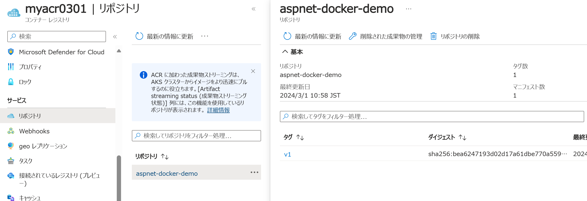
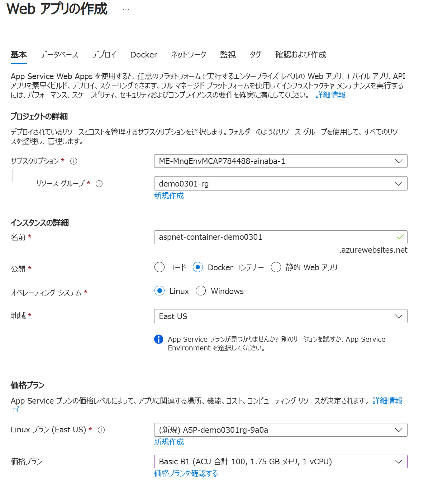
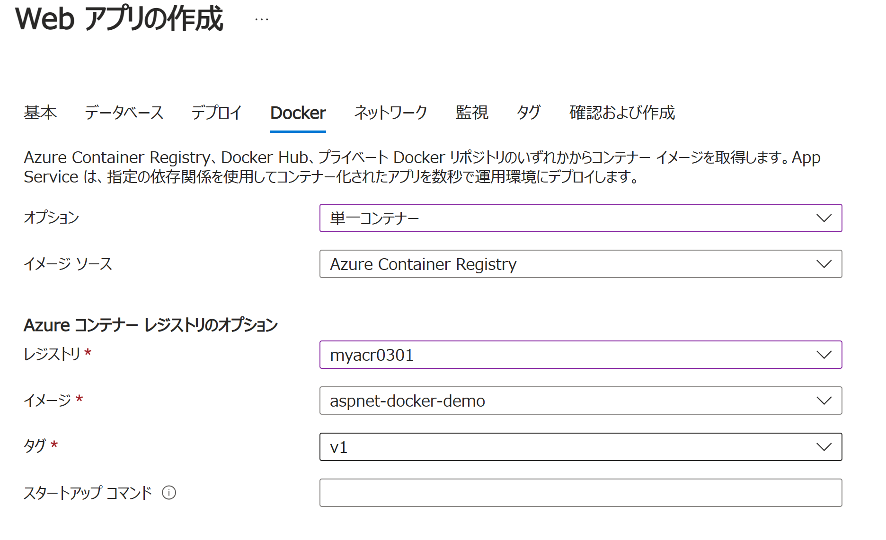
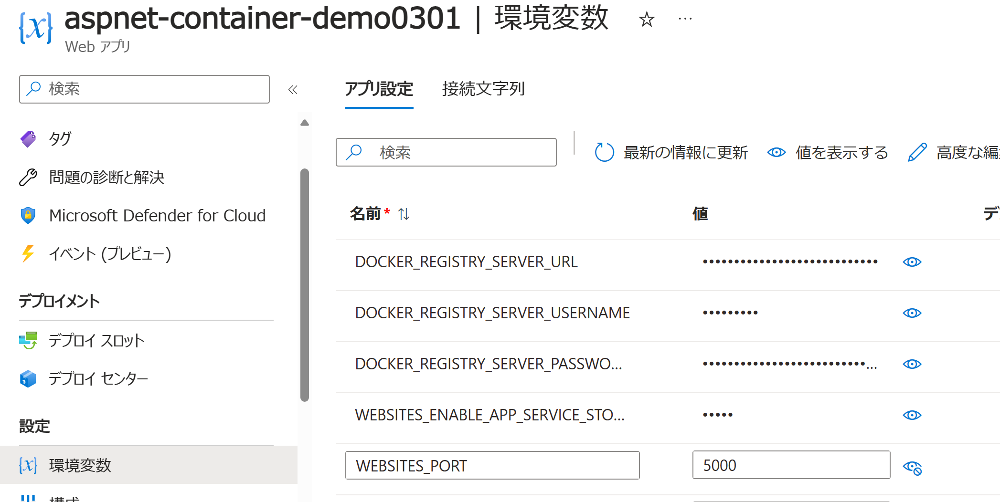
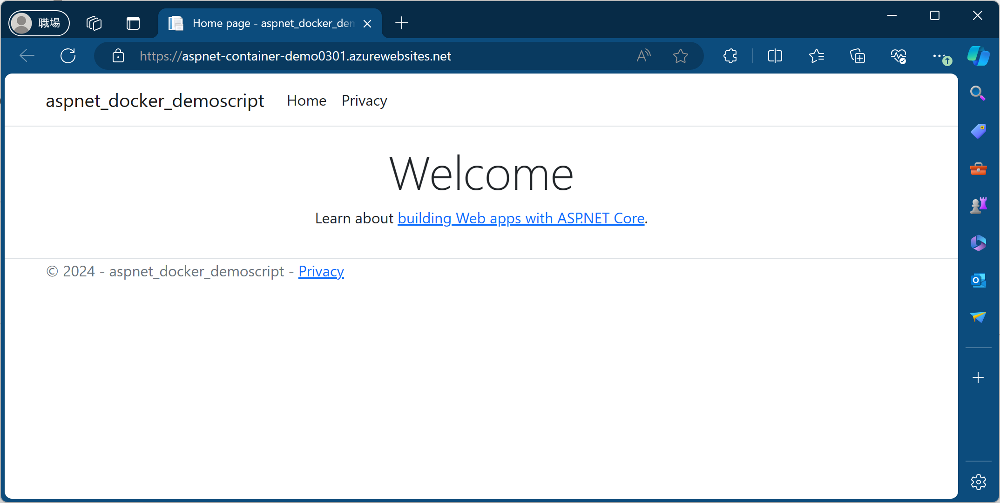

# はじめに

これからコンテナ技術を活用したアプリ開発に取り組む方々向けに、コンテナアプリ開発で必要な各種の基礎知識を身に着けていただくための勉強会を実施することになりました。
本記事はそのためのデモ スクリプトをまとめたものですが、ハンズオン資料的にも使えるように構成してみます。

# 前提事項や環境準備

コンテナアプリ開発と一言で言っても、必要とされる知識としてはコンテナランタイム、プログラミング言語、フレームワーク、実行環境などバリエーションが様々です。
ここでは以下を使って作業を進める前提で記載しています。
Azure サブスクリプション以外の各ソフトウェアを開発端末にインストールしてください。

|必要なもの|用途|説明|
|---|---|---|
|Windows 11|開発端末の OS として|Linux や MacOS でもほぼ同じだと思います。|
|.NET 8|ランタイム|各 OS 環境で動くランタイムとして選択。プログラミング言語は C# です|
|ASP.NET Core Razor Pages|フレームワーク|コンテナ化する Web アプリのフレームワークとして選択。|
|Docker Desktop|コンテナ開発環境|開発端末でコンテナを開発するための環境として採用。|
|Visual Studio Code|統合開発環境|コーディング作業に使用しますが、無くても大丈夫です。|
|Azure サブスクリプション|コンテナのデプロイ先|開発したコンテナをクラウドで動作させるために必要です。|


以降ではなるべく簡単な手順を記載しています。
コンテナ開発におけるお作法をいくつか無視している個所がありますので、その点はご容赦ください。

# コンテナの作業に慣れる

まずは `docker` コマンドを使った作業を一通り見ていきましょう。
このセクションの内容は Docker Desktop さえあれば確認可能です。

## コンテナイメージを取り寄せる : docker pull

ここでは公開されている既存のコンテナ イメージ（Ubuntu）を取り寄せてみます。
PowerShell のターミナルから以下のコマンドを実行してください。

```powershell
# 公開されている Ubuntu のイメージを取り寄せます
> docker pull ubuntu:latest

# 正常に動作するとこんな結果になります。
latest: Pulling from library/ubuntu
Digest: sha256:f9d633ff6640178c2d0525017174a688e2c1aef28f0a0130b26bd5554491f0da
Status: Image is up to date for ubuntu:latest
docker.io/library/ubuntu:latest
```

## ローカル環境にあるコンテナイメージを確認する : docker images

`docker pull` が終わったら、ローカル環境にあるイメージの一覧を確認します。

```powershell
# コンテナイメージの一覧を表示する
> docker images

# 正常に動作すると以下のような一覧が取得されます。
REPOSITORY                                       TAG              IMAGE ID       CREATED       SIZE
ubuntu                                           latest           3db8720ecbf5   2 weeks ago   77.9MB
```

## Ubuntu の bash を実行してみる : docker run

イメージが手に入ったので実行してみます。
ちなみに最初の `docker pull` をせずにいきなり `docker run` しても、イメージが存在しない場合は勝手に `pull` も行ってくれます。

```powershell
# ubuntu:latest イメージに含まれる bash を起動しています。 
# -it オプションは現在のターミナルにコンテナの標準入出力を接続する、くらいのイメージです
> docker run -it ubuntu:latest /bin/bash
```

成功すると `bash` のターミナルに切り替わります。
ここからは通常の Linux の操作と同じです。

```bash
# Linux ディストロを確認 
$ cat /etc/lsb-release 

DISTRIB_ID=Ubuntu
DISTRIB_RELEASE=22.04
DISTRIB_CODENAME=jammy
DISTRIB_DESCRIPTION="Ubuntu 22.04.3 LTS"
```

## Web サーバーをインストール

これだけだと素の OS の状態なので、Web サーバーにしてみましょう。

```bash
# パッケージマネージャを使用して NGINX などをインストール
$ apt-get update && apt-get install nginx curl -y

# インストールされた NGINX のバージョン
$ nginx -v

nginx version: nginx/1.18.0 (Ubuntu)

# nginx を起動して
$ nginx

# Web サーバーの動作確認
curl 127.0.0.1

<!DOCTYPE html>
<html>
<head>
<title>Welcome to nginx!</title>

(以下省略)
```

## コンテナから抜けて外部から確認する : docker ps

動作確認が終わったところで、コンテナの外から様子を眺めてみましょう。

```bash
# bash を終了させて PowerShell に戻ります
$ exit
```

ここからはコンテナ外部（開発端末）の PowerShell です。

```powershell
# 動作中のコンテナの一覧を確認します
> docker ps -a

# 以下のように終了（Exited）ステータスになっている Ubuntu が確認できます。
CONTAINER ID   IMAGE     COMMAND   CREATED         STATUS                          PORTS     NAMES
7621add423fe   ubuntu    "bash"    9 minutes ago   Exited (0) About a minute ago             thirsty_khorana
```

上記の通り `PORTS` 欄が空になっていますので、コンテナ内で NGINX が待機していた Port 80 に対してコンテナ外からアクセスすることはできません。
これを実現するにはローカルの（コンテナ外の）ポートと、コンテナ内のポートをマッピングしてやる必要があるのですが、ここでは割愛します。


> `docker run` で起動した bash のプロセスが、`exit` コマンドによって終了することで、コンテナとしても終了しています。
> このようにコンテナのライフサイクルは、起動時のプロセスのライフサイクルと一致します。
> 忘れがちですが割と重要なポイントだと思いますので覚えておきましょう。

## 要らなくなったコンテナを削除する : docker rm

動作確認が終わったらコンテナのお片づけをしておきましょう。

```powershell
# 削除したいコンテナの ID を指定します。前方一致するので先頭の数文字でもOK。
> docker rm 7621add423fe
```

## 要らなくなったコンテナ イメージ を削除する : docker rmi

コンテナの元となったイメージも不要になった場合はそちらも削除します。

```powershell
# まずはイメージの一覧を確認して
> docker images

REPOSITORY                                       TAG              IMAGE ID       CREATED       SIZE
ubuntu                                           latest           3db8720ecbf5   2 weeks ago   77.9MB

# 削除したいイメージの ID を指定します。ここでも前方一致するので先頭数文字でも OK です。
> docker rmi

Untagged: ubuntu:latest
Untagged: ubuntu@sha256:f9d633ff6640178c2d0525017174a688e2c1aef28f0a0130b26bd5554491f0da
Deleted: sha256:3db8720ecbf5f5927d409cc61f9b4f7ffe23283917caaa992f847c4d83338cc1
Deleted: sha256:d101c9453715a978a2a520f553588e77dfb4236762175eba61c5c264a449c75d
```

Linux イメージは比較的小さいとは言えそれなりにストレージ サイズを消費します。
とはいえイメージが一致しているとキャッシュが利くので、よく使うベースイメージは消さずに取っておくと良いでしょう。

## GUI を使ったコンテナイメージとコンテナの確認

コンテナの操作はターミナルからコマンドを使って行うことが多いですが、Docker Desktop のアプリケーションも利用できます。


# ASP.NET Web アプリのコンテナ化

上記の Ubuntu イメージを使った動作確認では、コンテナの挙動や `docker` コマンドの使い方に慣れることを主眼に置いていましたが、
アプリケーション開発の観点ではちょっと毛色が違ってきます。
ここでは　ASP.NET Core Razor Pages な Web アプリを作成し、コンテナ化するところまでを見ていきます。

このセクションの内容を確認するには .NET 8 のインストールが必要です。

## ASP.NET Core Razor Pages アプリの作成

まずは Web アプリを作りましょう。
ターミナルから `dotnet` コマンドを使用して作成します。

```powershell
> dotnet new webapp

# 現在のディレクトリにプロジェクトテンプレートが生成される
テンプレート "ASP.NET Core Web アプリ" が正常に作成されました。

(...中略...)

正常に復元されました。
```

## Web アプリの動作確認

では Web アプリの開発が終わったものとして動作確認をしてみましょう。

```powershell
> dotnet run

ビルドしています...
info: Microsoft.Hosting.Lifetime[14]
      Now listening on: http://localhost:5252
info: Microsoft.Hosting.Lifetime[0]
      Application started. Press Ctrl+C to shut down.
info: Microsoft.Hosting.Lifetime[0]
      Hosting environment: Development
info: Microsoft.Hosting.Lifetime[0]
      Content root path: C:\Users\ainaba\source\aspnet-docker-demoscript
```

エンドポイント URL が表示されますので、ブラウザで開いてみます。


動作確認が終わったらターミナルで `Ctrl + C` を押してアプリをシャットダウンしておきます。

## 配置用資源の生成

さて出来上がったアプリはまだソースコードのままですので、配置用の資源を作成します。

```powershell
# 配置用に発行します
> dotnet publish

# ビルドとともに発行が成功すると出力ディレクトリやアセンブリ名が表示されます。
MSBuild のバージョン 17.9.0-preview-23618-08+82d381eb2 (.NET)
  復元対象のプロジェクトを決定しています...
  復元対象のすべてのプロジェクトは最新です。
C:\Program Files\dotnet\sdk\8.0.200-preview.23624.5\Sdks\Microsoft.NET.Sdk\targets\Microsoft.NET.RuntimeIdentifierInference.targets(311,5): message NETSDK1057: プレビュー版の .NET
 を使用しています。https://aka.ms/dotnet-support-policy をご覧ください [C:\Users\ainaba\source\aspnet-docker-demoscript\aspnet-docker-demoscript.csproj]
  aspnet-docker-demoscript -> C:\Users\ainaba\source\aspnet-docker-demoscript\bin\Release\net8.0\aspnet-docker-demoscript.dll
  aspnet-docker-demoscript -> C:\Users\ainaba\source\aspnet-docker-demoscript\bin\Release\net8.0\publish\
```

発行した資源の実行方法と動作確認もしておきましょう。

```powershell
# 発行先ディレクトリの中身を確認
> dir ./bin/Release/net8.0/publish

Mode                 LastWriteTime         Length Name
----                 -------------         ------ ----
d----          2024/02/29    15:14                publish
-a---          2024/02/29    14:43            154 appsettings.Development.json
-a---          2024/02/29    14:43            151 appsettings.json
-a---          2024/02/29    15:14            464 aspnet-docker-demoscript.deps.json
-a---          2024/02/29    15:08          44032 aspnet-docker-demoscript.dll
-a---          2024/02/29    15:08         140800 aspnet-docker-demoscript.exe
-a---          2024/02/29    15:08          34044 aspnet-docker-demoscript.pdb
-a---          2024/02/29    15:14            488 aspnet-docker-demoscript.runtimeconfig.json
-a---          2024/02/29    15:04           9791 aspnet-docker-demoscript.staticwebassets.runtime.json

# アセンブリファイル dll を指定して実行
> dotnet ./bin/Release/net8.0/publish/aspnet-docker-demoscript.dll

info: Microsoft.Hosting.Lifetime[14]
      Now listening on: http://localhost:5000
info: Microsoft.Hosting.Lifetime[0]
      Application started. Press Ctrl+C to shut down.
info: Microsoft.Hosting.Lifetime[0]
      Hosting environment: Production
info: Microsoft.Hosting.Lifetime[0]
      Content root path: C:\Users\ainaba\source\aspnet-docker-demoscript
```

エンドポイントが表示されたらブラウザで開いて動作確認してください。

## Web アプリがインストールされたコンテナイメージを定義 : Dockerfile

さて出来上がったアプリがインストールされたコンテナイメージを作りたいのですが、
ここでは Dockerfile を使用してコンテナイメージを **定義** していきます。
`Dockerfile` という名前のテキストファイルを作成し、以下のように記述します。

```dockerfile
# ASP.NET Core ランタイムがインストール済みのベースイメージを指定
FROM mcr.microsoft.com/dotnet/aspnet:8.0

# コンテナ内の作業ディレクトリを指定
WORKDIR /app

# 開発端末の発行先ディレクトリから、作業ディレクトリにコピー
COPY ./bin/Release/net8.0/publish/ .

# ASP.NET がポート 5000 で待機するように環境変数を設定
ENV ASPNETCORE_URLS=http://+:5000

# ポート 5000 をコンテナ外部に公開
EXPOSE 5000

# コンテナ起動時に実行されるコマンドライン
# 発行時に生成したアセンブリがコピーされているはずなのでそれを指定
ENTRYPOINT ["dotnet", "aspnet-docker-demoscript.dll"]
```

## Dockerfile に基づいてコンテナイメージを生成 : docker build

コンテナ イメージの定義が出来たので、実際にコンテナ イメージを作成していきます。

```powershell
# -t オプションで「イメージ名」を指定、イメージ名は（リポジトリ:タグ）の形式
# 最後のピリオドはビルドコンテキスト（カレントディレクトリ）を指定している
> docker build -t aspnet-docker-demo:v1 .
```

ビルドが正常に終わったらコンテナイメージの一覧を確認し、指定した「イメージ名:タグ」のイメージが追加されていることを確認します。
イメージ名は REPOSITORY

```powershell
> docker images

# 先ほど使っていた ubuntu とは別のものが出来ている
REPOSITORY                                       TAG              IMAGE ID       CREATED             SIZE
aspnet-docker-demo                               v1               0fde8f7437a3   About an hour ago   226MB
ubuntu                                           latest           3db8720ecbf5   2 weeks ago         77.9MB
```

## 作成した Web アプリのコンテナイメージからコンテナを起動して動作確認

それではコンテナの動作確認です。

```powershell
# ビルド時に指定したコンテナイメージを指定します。
# -p オプションを使用して、ローカルポート 8080 をコンテナ内で ASP.NET が待機している（Dockerfile で EXPOSE した）5000 にマップします
# コンテナ起動時に実行するコマンドは既に Dockerfile の ENTRYPOINT で指定してあるので不要です。
> docker run -it -p 8080:5000 aspnet-docker-demo:v1

# Warning は出ていますがここでは無視します
warn: Microsoft.AspNetCore.DataProtection.Repositories.FileSystemXmlRepository[60]
      Storing keys in a directory '/root/.aspnet/DataProtection-Keys' that may not be persisted outside of the container. Protected data will be unavailable when container is destroyed. For more information go to https://aka.ms/aspnet/dataprotectionwarning
warn: Microsoft.AspNetCore.DataProtection.KeyManagement.XmlKeyManager[35]
      No XML encryptor configured. Key {0c2aa4b8-967c-4421-acd8-b1ace7738608} may be persisted to storage in unencrypted form.
warn: Microsoft.AspNetCore.Hosting.Diagnostics[15]
      Overriding HTTP_PORTS '8080' and HTTPS_PORTS ''. Binding to values defined by URLS instead 'http://+:55000'.
info: Microsoft.Hosting.Lifetime[14]
      Now listening on: http://[::]:5000
info: Microsoft.Hosting.Lifetime[0]
      Application started. Press Ctrl+C to shut down.
info: Microsoft.Hosting.Lifetime[0]
      Hosting environment: Production
info: Microsoft.Hosting.Lifetime[0]
      Content root path: /app
```

マッピングしたポート 8080 をブラウザで開いてみてください。


動作確認をしたら `Ctrl-C` で ASP.NET アプリを止めてあげてください。
それに伴いコンテナも終了します。

## 補足 : RUN 命令によるイメージの定義

上記の Dockerfile は既に Microsoft が構築・公開している ASP.NET ランタイムがインストール済みのイメージを使用しています。
このため発行したアプリケーション コンテンツをコンテナ内にコピーするだけで実行できています。

場合によっては通常のコマンド実行を使用した各種ソフトウェアのインストールや設定が必要になるケースもあります。
このような場合には Dockerfile 内で `RUN` 命令を使用することで、各種ソフトウェアのインストールなどを行うことも可能です。
例えば、先ほど手動で構築したような、「Ubutu に NGINX をインストール済みのコンテナイメージ」を作製する場合の Dockerfile は以下のようになります。

```dockerfile
# Ubuntu をベースとして、
FROM ubuntu:latest

# 必要なソフトウェアをインストールし、
RUN apt-get update
RUN apt-get install nginx curl -y

# NGINX が指定するポートを開放しておいて、
EXPOSE 80

# NGINX をフォアグラウンド プロセスで実行する(コンテナ起動後に即座に終了させないため)
ENTRYPOINT /usr/sbin/nginx -g 'daemon off;'
```

これをビルドして実行してみます。

```powershell
> docker build -t mynginx
> docker run -it -p 8888:80 mynginx
```

ローカルホストのポート 8888 がコンテナ内で NGINX が待機するポート 80 にマッピングされてるので、ブラウザでアクセスすることが出来ます。


動作確認が終わったら `Ctrl + C` で NGINX を止めてあげてください。
それに伴いコンテナも終了します。

Dockerfile の仕様について詳細を確認したい場合は
[Dockerfile リファレンス](https://docs.docker.jp/engine/reference/builder.html)
を参照してください。

## 補足 : バックグラウンドでのコンテナ起動

これまで `docker run` の際に `-it` オプションを指定することで、コンテナ内で動作しているアプリの標準入出力が操作中のターミナルに接続されていました。
ただ Web サーバーのようなバックグラウンドで動作するアプリケーションは、コンテナとしてもバックグラウンド プロセスとして動作させたいことでしょう。

この場合は `-d` オプションで起動することができます。

```powershell
> docker run -d -p 8080:5000 aspnet-docker-demo:v1 .
02f1a906864fdbafd4d425e5ef4741d7a83d3e42488267b86c386f94e31896cc

# docker run すると起動したコンテナの ID が表示され、プロンプトに復帰
> 
```

動作確認方法は同様ですが、ターミナルが接続されていないので `Ctrl + C` で止めることが出来ません。
前述の `docker ps` コマンドを使用してプロセスを確認して、`docker stop` で停止することが出来ます。

```powershell
# コンテナ一覧を確認
> docker ps

CONTAINER ID   IMAGE                     COMMAND                   CREATED             STATUS                         PORTS                    NAMES
02f1a906864f   aspnet-docker-demo:v1     "dotnet aspnet-docke…"   6 minutes ago       Up 6 minutes                   0.0.0.0:8080->4000/tcp   laughing_torvalds     

# コンテナ ID が起動時のものと一致しているコンテナが、ステータスも Up （実行中）になっているので、これを停止したい
> docker stop 02f1a906864f

# 終了済みのコンテナは -a オプションをつけて確認。過去に使用して削除（docker rm）してないものも表示される。
> docker ps -a

CONTAINER ID   IMAGE                     COMMAND                   CREATED             STATUS                         PORTS     NAMES
02f1a906864f   aspnet-docker-demo:v1     "dotnet aspnet-docke…"   9 minutes ago       Exited (0) 7 seconds ago                 laughing_torvalds
f4329130d8a4   mynginx                   "/bin/sh -c '/usr/sb…"   12 minutes ago      Exited (130) 11 minutes ago              pensive_swirles
480c53db98a8   5a3ab56068ef              "/bin/bash"               About an hour ago   Exited (0) About an hour ago             stoic_gould
```

docker コマンドの詳細を確認したい場合は
[Docker CLI コマンドライン リファレンス](https://docs.docker.jp/engine/reference/commandline/toc.html)
を参照してください。


# Azure Web App for Container への配置

せっかく Web アプリのコンテナイメージを作り上げましたので、クラウド上で動作させてみましょう。
ここでは Azure の Web App for Container を使用してみます。

このセクションの手順には Azure サブスクリプション、および Azure CLI が必要になります。

## コンテナレジストリの作成

開発したコンテナ イメージは開発端末にあるだけで、外部からアクセスできる状態ではありません。
クラウド環境で動作させるためには、クラウド環境からアクセスできる場所にコンテナ イメージが存在する必要があります。
このようにコンテナ イメージを配置しておく場所をコンテナ レジストリと呼ぶのですが、Azure では 
[Azure Container Registry](https://learn.microsoft.com/ja-jp/azure/container-registry/container-registry-intro)
というサービスが利用できます。

ここでは詳細な構築手順は割愛しますが、[Azure ポータルのマーケットプレイス](https://portal.azure.com/#create/Microsoft.ContainerRegistry) で以下のようなオプションで構築したものとします。


詳細な構築手順は
[チュートリアル](https://learn.microsoft.com/ja-jp/azure/container-registry/container-registry-get-started-portal?tabs=azure-cli)
などを参考にしてください。

## コンテナ イメージをレジストリにアップロード : docker push

こちらも概ね上記のチュートリアルに記載があるのですが、上記で作ったコンテナイメージに合わせて作業を紹介していきます。

### Azure Cotainer Registry にログイン

Azure Container Registry に接続するためには認証が必要です。

```powershell
# まずは Azure にログイン
> az login

# 使用するサブスクリプションを設定（サブスクリプションIDは自身のものに読み替えてください）
> az account set -s guid-of-your-azure-subscription

# Azure Container Registry にログイン（Azure Container Registryの名前は自身のものに読み替えてください）
> az acr login -n yourAcrName

Login Succeeded
```

これで認証情報が開発端末にキャッシュされ、この後の docker コマンドで暗黙的に利用できるようになります。

またこの後の作業で作成した Container Registry のドメイン名（LOGIN SERVER）も必要になるので確認しておきます。
形式としては `yourAcrName.azurecr.io` と決まっているので必須ではありません。

```powershell
> az acr show -n yourAcrName -o table

NAME       RESOURCE GROUP    LOCATION    SKU    LOGIN SERVER          CREATION DATE         ADMIN ENABLED
---------  ----------------  ----------  -----  --------------------  --------------------  ---------------
myacr0301  demo0301-rg       japaneast   Basic  myacr0301.azurecr.io  2024-03-01T01:39:07Z  False
```

### コンテナ イメージにタグをつける : docker tag

開発したイメージを Azure Container Registry にアップロード（プッシュするといいます）するには、
レジストリのログイン サーバー名で修飾したタグをつけてやる必要があります。
例えば先ほどの例だと以下のようになります。

```powershell
# ログインサーバー名とコンテナイメージの名前をスラッシュで区切ったものをつける
> docker tag aspnet-docker-demo:v1  yourAcrName.azurecr.io/aspnet-docker-demo:v1

# docker tag で指定した名前で、IMAGE ID が一致しているものが増えていれば成功
> docker images

REPOSITORY                                       TAG              IMAGE ID       CREATED        SIZE
mynginx                                          latest           e15a238cfb3e   19 hours ago   187MB
aspnet-docker-demo                               v1               0fde8f7437a3   20 hours ago   226MB
yourAcrName.azurecr.io/aspnet-docker-demo        v1               0fde8f7437a3   20 hours ago   226MB
```

### Azure Container Registry にプッシュ : docker push

準備が出来たらプッシュ（アップロード）します。

```powershell
# タグ付けしたものを docker push
> docker push yourAcrName.azurecr.io/aspnet-docker-demo:v1

# 進捗が表示されるので終わるのを待つ
The push refers to repository [yourAcrName.azurecr.io/aspnet-docker-demo]
414dcb33a532: Pushed
03696d84c454: Pushed 
72c8626861d0: Pushed
b5d6b57c452a: Pushed 
904b7c68bb35: Pushed
0e7835d3629d: Pushed
5fb1f9b6ab0b: Pushed
571ade696b26: Pushed
v1: digest: sha256:bea6247193d02d17a61dbe770a559ec5c1bbd8ceef808837636a411bfad0b348 size: 1997
```

Push したイメージは az コマンドや Azure ポータルで確認できます。

```powershell
# レジストリ内にあるリポジトリの確認
> az acr repository list -n yourRegistryName                      

[
  "aspnet-docker-demo"
]

# リポジトリ内のタグ一覧を表示
> az acr repository show-tags -n yourRegistryName --repository aspnet-docker-demo

[
  "v1"
]
```




## Web App for Containers で Web アプリを公開

さて今度は開発したコンテナイメージをクラウド上に配置して公開します。Azure には
[様々なコンテナ向けサービス](https://azure.microsoft.com/ja-jp/products/category/containers/)
があるのですが、Web アプリのコンテナーを作りましたので、ここでは Web App for Containers を採用します。
これは最も古くからある PaaS サービスである App Service のデプロイオプションの１つで、
アプリケーションのコンテンツそのものではなく、コンテナ形式でデプロイ出来るというものです。

### Web App for Containers を作成する

ここでも詳細な構築手順は割愛しますが、[Azure ポータルのマーケットプレイス](https://portal.azure.com/#create/Microsoft.AppSvcLinux) から以下のオプションで構築するものとします。

|基本タブ|Dockerタブ|
|---|---|
|||

ポイントは以下のようになります。

- 公開オプションとして `Docker コンテナ` を選択する
- オペレーティング システムは `Linux` を選択する（Linux コンテナを開発したので）
- イメージソースは Azure Container Registry を指定する
- オプションで先ほど Push したイメージを選択する

### 開発したアプリケーションがクラウドで動作していることを確認する

作成すると以下のような処理が行われます。

- Web App for Container リソースが作成され、
- Web App for Container 名がついた FQDN が作成され、
- 開発して Container Registry に Push したコンテナイメージが Pull され、
- コンテナが起動して（ASP.NET の Web アプリプロセスが起動して）、
- フロントのロードバランサーからリクエストの割り当てを受けられるようになる

のですが、上記のコンテナはポート 5000 を公開（EXPOSE）しているかを伝えていません。
`WEBSITES_PORT` 環境変数を使用して、コンテナの待機ポートを教えてあげてください。



これでブラウザーから Web アプリにアクセスすることが出来るようになります。
何度も同じような画面ばかりで面白味がないのですが、ブラウザの URL 欄を見ると Azure 上で動いていることが分かります。
なお、この際 Web App 側で TLS 終端処理も行われるようになるので、これまで開発環境では HTTP で通信していた Web アプリに対して、HTTPS で通信が出来ていることも確認できます。



# まとめ

Docker Desktop を使用したコンテナの基本操作から、コンテナ化したアプリの構築、クラウドへのデプロイまでの一連の作業を紹介してみました。
この記事ではアプリケーションとしては ASP.NET を、クラウドサービスとしては Azure Web App for Container を採用していますが、要点としては他の言語やフレームワークでも同様になると思います。

- コマンドで起動して待機状態に入る Web アプリを開発する
- 配置用資源をビルドして Dockerfile でイメージに固める
- 起動処理を ENTRYPOINT 命令で、待機ポートを EXPOSE 命令で指定しておく
- Public にアクセス可能なレジストリにイメージを Push しておく
- コンテナの実行環境となるサービスからイメージを Pull する

ツールやサービスによっては色々と差異はありますし、コンテナアプリの開発としてもこれ以外にも従うべきお作法のようなものはいくつかあるのですが、まずはコンテナ初めての方が知っておくべき基本動作としてはこんなものじゃないかなと思います。


