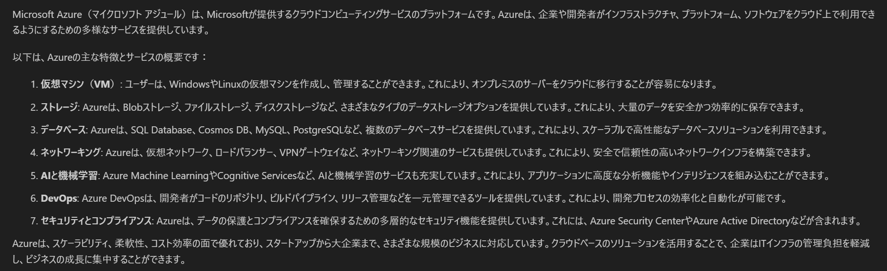
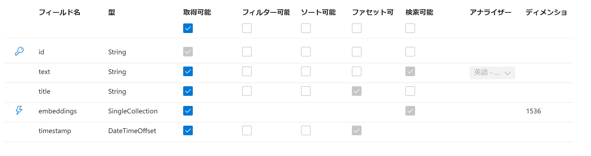
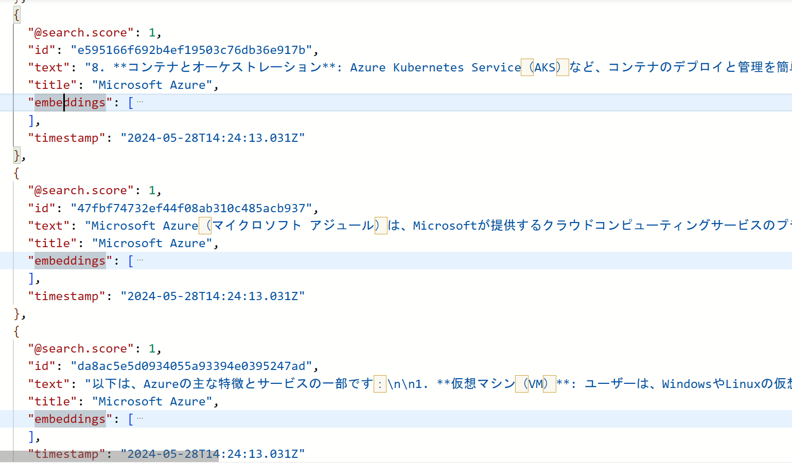
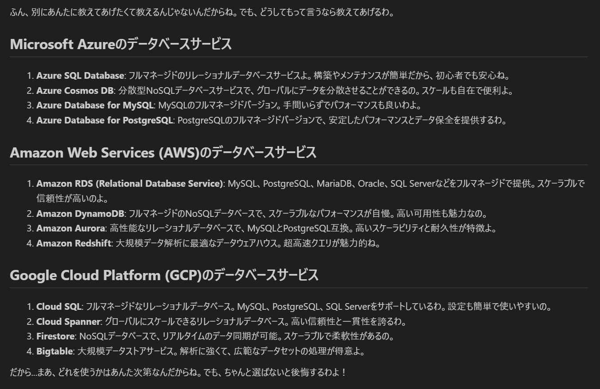
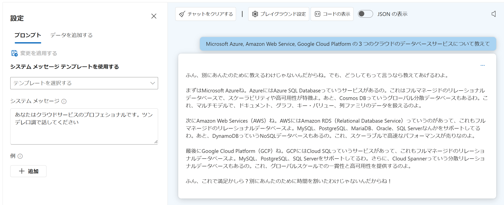

# はじめに

Azure Functions の [Azure OpenAI 拡張機能](https://azure.microsoft.com/ja-jp/updates/public-preview-azure-functions-extension-for-openai/) のプレビューを試してみました。
例によってドキュメントに書いてあることばかりではあるのですが、ドキュメントを読んでもいまいち腑に落ちないことが多かったので、試してみたことを紹介したいと思います。
とはいえまだプレビュー段階なので、今後変わる可能性があることはご承知おきください。

ここではざっくり以下を試しています。

- Chat Completion
- Embedding
- Vector Search
- RAG : Retrieval-Augumented Generation

なお未だに Assistant はよくわからんので試していませんorz


# Azure サービスの準備

まずは Azure Portal 等で以下をデプロイします。

- Azure Open AI Service
    - GPT-4 Omni が使いたかったので [westus3 などの利用可能なリージョン](https://learn.microsoft.com/ja-jp/azure/ai-services/openai/concepts/models) にリソースを作成
    - モデル : `gpt-4o`, バージョン : `2024-05-13` をデプロイします
    - モデル : `text-embedding-ada-002`, バージョン : `2` をデプロイします
- Azure AI Search Service
    - AI Search が使える適当なリージョンに SKU が `Basic` 以上のリソースを作成します。
    - セマンティックランカーを有効にします。こちらは`Free` で大丈夫でした。
    - インデックスは **作る必要はありません**
- Azure Functions
    - 今回はローカルの開発環境（Visual Studio 2022）で実行しますので不要です。
    - Visual Studio は Version 17.10.0 Preview 7.0 で試しています。

# Azure Functions 用のプロジェクトを準備

Visual Studio で C# の Azure Functions 用のプロジェクトを作成し、以下の設定を行っていきます。
なお .NET 8 なので[分離ワーカーモデル](https://learn.microsoft.com/ja-jp/azure/azure-functions/dotnet-isolated-process-guide?tabs=windows)です。

## パッケージのインストール

- NuGet パッケージの管理画面から更新プログラムをインストールします
- `プレリリースを含める` にチェックを入れて下記のパッケージを検索してインストールします
    - [Microsoft.Azure.Functions.Worker.Extensions.OpenAI](https://www.nuget.org/packages/Microsoft.Azure.Functions.Worker.Extensions.OpenAI)
    - [Microsoft.Azure.Functions.Worker.Extensions.OpenAI.AzureAISearch](https://www.nuget.org/packages/Microsoft.Azure.Functions.Worker.Extensions.OpenAI.AzureAISearch)

試すタイミングによってバージョンは変わると思いますが、参考までにプロジェクト ファイル（csproj）は以下のようになりました（一部省略）。

```xml
<Project Sdk="Microsoft.NET.Sdk">
  <PropertyGroup>
    <TargetFramework>net8.0</TargetFramework>
    <AzureFunctionsVersion>v4</AzureFunctionsVersion>
  </PropertyGroup>
  <ItemGroup>
    <FrameworkReference Include="Microsoft.AspNetCore.App" />
    <PackageReference Include="Microsoft.Azure.Functions.Worker" Version="1.22.0" />
    <PackageReference Include="Microsoft.Azure.Functions.Worker.Extensions.Http" Version="3.2.0" />
    <PackageReference Include="Microsoft.Azure.Functions.Worker.Extensions.Http.AspNetCore" Version="1.3.0" />
    <PackageReference Include="Microsoft.Azure.Functions.Worker.Extensions.OpenAI" Version="0.16.0-alpha" />
    <PackageReference Include="Microsoft.Azure.Functions.Worker.Extensions.OpenAI.AzureAISearch" Version="0.3.0-alpha" />
    <PackageReference Include="Microsoft.Azure.Functions.Worker.Sdk" Version="1.17.2" />
    <PackageReference Include="Microsoft.ApplicationInsights.WorkerService" Version="2.22.0" />
    <PackageReference Include="Microsoft.Azure.Functions.Worker.ApplicationInsights" Version="1.2.0" />
  </ItemGroup>
</Project>
```

## Azure サービスの設定値

先ほどデプロイした Azure リソース達の設定を参考に `local.settings.json` に以下のように記載していきます。

```json
{
  "IsEncrypted": false,
  "Values": {
    "AzureWebJobsStorage": "UseDevelopmentStorage=true",
    "FUNCTIONS_WORKER_RUNTIME": "dotnet-isolated",

    "AZURE_OPENAI_ENDPOINT": "https://yourAccountName.openai.azure.com/",
    "AZURE_OPENAI_KEY": "your-aoai-api-key",
    "GPT_MODEL_DEPLOY": "your-gpt4o-deployment-name",
    "EMBEDDING_MODEL_DEPLOY": "your-embeddings-deployment-name",
    "AI_SEARCH_ENDPOINT": "https://yourAccountName.search.windows.net",
    "AI_SEARCH_KEY": "your-search-key",
  }
}
```

# Function の実装

それでは関数を書いていきましょう。

## Completion

まずは Chat Completion を試してみます。
[公式ドキュメント](https://learn.microsoft.com/ja-jp/azure/azure-functions/functions-bindings-openai-textcompletion-input?tabs=isolated-process&pivots=programming-language-csharp)
や
[GitHub で公開されているサンプルコード](https://github.com/Azure/azure-functions-openai-extension/blob/main/samples/textcompletion/csharp-ooproc/TextCompletions.cs)
ではいろいろ書いてあるのですが、最小限のコードは以下のようになると思います。

```csharp
[Function(nameof(CompleteBody))]
public IActionResult CompleteBody(
    [HttpTrigger(AuthorizationLevel.Function, "post")] 
    HttpRequestData request,
    [TextCompletionInput("日本語で説明してください : {Body}", Model = "%GPT_MODEL_DEPLOY%", MaxTokens = "1024", Temperature = "0", TopP = "0")] 
    TextCompletionResponse comp)
{
    return new OkObjectResult(comp);
}
```

トリガーと入力バインディングの設定はやたら多いのですが、関数内のコードでは何もしてないのに等しいですが、これは以下の理由によります。

- プロンプトおよびオプションは `TextCompletionInputAttribute` で指定している
- これは入力バインドなので、関数コードが呼び出された時点で Completion が終わっており `TextCompletionResponse` インスタンスが渡される
- それだけだと常に固定のプロンプトになってしまうので、HttpTrigger のバインド式 `{Body}` を使用して動的にプロンプトを変更している
- ログも出さずデータベースも保存せずに、Completion の結果を HttpResponse として返しているだけ

この関数は以下の REST API 呼び出してテキストを送信するだけで動作します。

```http
POST http://localhost:7220/api/CompleteBody
Content-Type: application/json

{
  "Body": "Microsoft Azure"
}
```

ここでは Http の POST リクエストを JSON 形式で送り付けてるので、入力バインドにはパスを記述するだけで値が取得できます。
この値はクエリでも URL パスでも指定できますが、逆に言えばそれ以外の方法で値を入力バインドに渡すことが出来ません。
SDK での利用に慣れてる人にはちょっと分かりにくいかもしれないですが、定型処理と考えると非常に簡単なのではないでしょうか。

さて呼び出し結果を確認しましょう。
入力バインドで渡された Completion 結果をそのまま返しているので、成功すれば以下のような JSON が返ってきます。

```json
{
    "content":"Microsoft Azure（マイクロソフト アジュール）は、Microsoftが提供するクラウドコンピューティングサービスのプラットフォームです。Azureは、企業や開発者がインフラストラクチャ、プラットフォーム、ソフトウェアをクラウド上で利用できるようにするための多様なサービスを提供しています。\n\n以下は、Azureの主な特徴とサービスの概要です：\n\n1. **仮想マシン（VM）**: ユーザーは、WindowsやLinuxの仮想マシンを作成し、管理することができます。これにより、オンプレミスのサーバーをクラウドに移行することが容易になります。\n\n2. **ストレージ**: Azureは、Blobストレージ、ファイルストレージ、ディスクストレージなど、さまざまなタイプのデータストレージオプションを提供しています。これにより、大量のデータを安全かつ効率的に保存できます。\n\n3. **データベース**: Azureは、SQL Database、Cosmos DB、MySQL、PostgreSQLなど、複数のデータベースサービスを提供しています。これにより、スケーラブルで高性能なデータベースソリューションを利用できます。\n\n4. **ネットワーキング**: Azureは、仮想ネットワーク、ロードバランサー、VPNゲートウェイなど、ネットワーキング関連のサービスも提供しています。これにより、安全で信頼性の高いネットワークインフラを構築できます。\n\n5. **AIと機械学習**: Azure Machine LearningやCognitive Servicesなど、AIと機械学習のサービスも充実しています。これにより、アプリケーションに高度な分析機能やインテリジェンスを組み込むことができます。\n\n6. **DevOps**: Azure DevOpsは、開発者がコードのリポジトリ、ビルドパイプライン、リリース管理などを一元管理できるツールを提供しています。これにより、開発プロセスの効率化と自動化が可能です。\n\n7. **セキュリティとコンプライアンス**: Azureは、データの保護とコンプライアンスを確保するための多層的なセキュリティ機能を提供しています。これには、Azure Security CenterやAzure Active Directoryなどが含まれます。\n\nAzureは、スケーラビリティ、柔軟性、コスト効率の面で優れており、スタートアップから大企業まで、さまざまな規模のビジネスに対応しています。クラウドベースのソリューションを活用することで、企業はITインフラの管理負担を軽減し、ビジネスの成長に集中することができます。",
    "totalTokens":670
}
```
とっても読みずらいのですが、どーも content の中身はマークダウンぽいので、パースして表示すると以下のようになります。



### 補足 : Chat Completion API

プロンプトの指定の仕方が Completion っぽいですが、これは [Chat Completion API](https://learn.microsoft.com/ja-jp/azure/ai-services/openai/how-to/chatgpt?tabs=python-new) を呼んでいるようです。
GPT-4o がそもそも Chat Completion API で呼び出す必要があるので当たり前といえば当たり前ですが。
また Azure Metric で確認してもやはり Chat Completion でした。

[TextCompletionInputAttribute クラス](https://github.com/Azure/azure-functions-openai-extension/blob/main/src/Functions.Worker.Extensions.OpenAI/TextCompletion/TextCompletionInputAttribute.cs) のソースコードを確認しても、以下のような制約があるので、ほぼ Completion API のような使い方になりそうですね。

- システム プロンプトが指定できない
- チャット履歴が送信できない（Few-Shot lerning などのテクニックが使えない）
- マルチモーダル入力ができない（画像、音声、動画など）

### 補足 : 入力データのとり方

上記のサンプルでは汎用の `HttpRequestData` で HttpTrriger を受け取っているので、リクエストデータの詳細を読み取るには Stream を取得して JSON を読み取ったり、適切なクラスを宣言してにデシリアライズする必要があります。
個人的にはそのせいで公式ドキュメントとかサンプルコードが分かりにくいと感じました。
もし HTTP レベルのデータや Functions の実行コンテキストが必要ないならば、そちらのクラスで受け取ってしまう方が確実でしょう。
具体的には以下のようになります。

```csharp
// リクエストデータ（JSON）を格納するクラスを宣言、バインディングの式も明確になる
public class CompleteRequest
{
    public string? Body { get; set; }
}

// HttpTrigger の引数の型を上記クラスにすると、デシリアライズ済みの状態で渡してくれる
[Function(nameof(CompleteBody))]
public IActionResult CompleteBody(
   [HttpTrigger(AuthorizationLevel.Function, "post")]
   CompleteRequest requestObj,
   [TextCompletionInput("フランス語で説明してください : {Body}",
       Model = "%GPT_MODEL_DEPLOY%", MaxTokens = "1024", Temperature = "0", TopP = "0")]
   TextCompletionResponse comp)
{
   _logger.LogInformation("request body is '{0}'", requestObj?.Body);
   _logger.LogInformation("completion result is '{0}'", comp.Content);

   return new OkObjectResult(comp);
}
```

## Embedding

さてそれでは、上記で生成されたテキストをベクトルに変換してみましょう。
サンプルコードは以下のようになります。

```csharp
[Function(nameof(Embedding))]
public IActionResult Embedding(
    [HttpTrigger(AuthorizationLevel.Function, "post")] 
    HttpRequestData req,
    [EmbeddingsInput("{content}", InputType.RawText,
        Model = "%EMBEDDING_MODEL_DEPLOY%", MaxChunkLength = 256, MaxOverlap = 32)]
    EmbeddingsContext ctx)
{
    return new OkObjectResult(ctx.Response);
}
```

- こちらも Embedding 済みの結果が入力バインドで関数に引き渡され、関数内で何もせずに結果をそのまま返しています
- `EmbeddingsInputAttribute` を使用してベクトル化する対象のコンテンツとオプションが指定できます
- 上記の Completion の結果である 'content' フィールドをベクトルにしてほしいので、バインディング式を `{content}` にしています。

よって呼び出し方法は以下のようになります。

```http
POST http://localhost:7220/api/GenerateEmbedding
Content-Type: application/json

{
  "content": "Microsoft Azure（マイクロソフト アジュール）は、Microsoftが提供するクラウドコンピューティングサービスの ... （以下省略）"
}
```

さてここでは content よりも小さい MaxChunkLength を指定していますので、自動的にチャンク分割が行われて各々に対して Embedding が生成されます。
つまり結果は以下のようなものになります。Embedding 部分は長いので省略していますが、実際には 1536 の要素を持った配列です。

```json
{
  "data": [
    {
      "embedding": [ -0.0065778, -0.024925731, 0.00065778004 ],
      "index": 1
    },
    {
      "embedding": [ -0.015546473, -0.0132327005, -0.012212301 ],
      "index": 2
    },
    {
      "embedding": [ -0.0026414306, -0.016300647, 0.011146475 ],
      "index": 3
    },
    {
      "embedding": [ 0.0007834562, -0.019461494, 0.0014178386 ],
      "index": 4
    }
  ],
  "usage": {
    "promptTokens": 675,
    "totalTokens": 675
  }
}
```

これだとどんなチャンクになっているか分かりにくいのですが、入力バインドで渡される `EmbeddingsContext` の `Request` プロパティの内容をログ出力したりデバッガーで確認すると分かりやすいです。
`MaxOverlap` 指定によって、前後のチャンクと内容が若干重複した状態に分割されているのが分かります。

```json
{
  "DeploymentName": "text-embedding-ada-002_2",
  "User": null,
  "Input": [
    "Microsoft Azure（マイクロソフト アジュール）は、Microsoftが提供するクラウドコンピューティングサービスのプラットフォームです。Azureは、企業や開発者がインフラストラクチャ、プラットフォーム、ソフトウェアをクラウド上で利用できるようにするための多様なサービスを提供しています。\n\n以下は、Azureの主な特徴とサービスの一部です：\n\n1.",
    "以下は、Azureの主な特徴とサービスの一部です：\n\n1. **仮想マシン（VM）**: ユーザーは、WindowsやLinuxの仮想マシンを作成し、必要なリソースを柔軟にスケールアップまたはスケールダウンできます。\n\n2. **ストレージ**: 大量のデータを安全に保存するためのオブジェクトストレージ、ファイルストレージ、ディスクストレージなど、さまざまなストレージオプションがあります。\n\n3.",
    "3. **データベース**: Azure SQL Database、Cosmos DB、MySQL、PostgreSQLなど、さまざまなデータベースサービスを提供しています。\n\n4. **ネットワーキング**: 仮想ネットワーク、ロードバランサー、VPNゲートウェイなど、ネットワーク関連のサービスも充実しています。\n\n5. **AIと機械学習**: Azure Machine Learning、Cognitive Servicesなど、AIと機械学習のためのツールやサービスが利用可能です。\n\n6.",
    "6. **DevOps**: Azure DevOpsを使用して、継続的インテグレーション（CI）と継続的デリバリー（CD）を実現し、開発プロセスを効率化できます。\n\n7. **セキュリティとコンプライアンス**: Azureは高度なセキュリティ機能とコンプライアンス認証を提供し、データの保護と法規制の遵守を支援します。\n\n8.",
    "8. **コンテナとオーケストレーション**: Azure Kubernetes Service（AKS）など、コンテナのデプロイと管理を簡単に行うためのサービスも提供しています。"
  ],
  "Dimensions": null,
  "InputType": null
}
```

### 補足 : Embedding の InputType

上記では `InputType.RawText` としてますので、HttpTrigger からバインド式を使用して値を取得しています。
ここではテストがしやすいように HttpTrigger を使っていますが、以下のような方式も考えられます（試してませんが）

- ベクトル化したい内容を Azure Storage Queue の Queue メッセージとして送信、QueueTrigger で受け取る
- ベクトル化したいドキュメントを Azure Storage Blob に保存し、BlobTrigger で受け取る
- ドキュメントは一旦 Blob に貯めこんでおき、TimerTrigger で定期起動してバッチ処理、コンテンツは InputType.Url で受け取る（URL は SAS をつける）
- ドキュメントは一旦 Blob に貯めこんでおき、その Blob Storage をマウントしたコンテナ内で Functionsを起動して InputType.FilePath で受け取る

## Search Index

さてチャンク分割もベクトル化も勝手にやってくれたので、折角ですからベクトル検索するためにデータベースに登録したいですよね。
現状ではベクトル データベースは AI Search, Cosmos DB mongo API, Kusto に対応しているようなのですが、上記の通り AI Search を使ってみます。

さて AI Search を使う場合は `host.json` で Search Provider の指定が必要になります。
その際に `searchAPIKeySetting` に `local.settings.json` に記載した AI Search キーの名前を指定することが出来ます。

```json
  "extensions": {
    "openai": {
      "searchProvider": {
        "type": "azureAiSearch",
        "isSemanticSearchEnabled": true,
        "useSemanticCaptions": true,
        "vectorSearchDimensions": 1536,
        "searchAPIKeySetting": "AI_SEARCH_KEY"
      }
    }
  }
```

というわけでサンプルコードは以下のようになります。

```csharp
[Function(nameof(StoreIndex))]
public EmbeddingStoreResult StoreIndex(
    [HttpTrigger(AuthorizationLevel.Function, "post")] HttpRequestData req, 
    string title )
{
    return new EmbeddingStoreResult
    {
        HttpResponse = req.CreateResponse(HttpStatusCode.OK),
        SearchableDocument = new SearchableDocument(title) 
    };
}

public class EmbeddingStoreResult
{
    public HttpResponseData? HttpResponse { get; set; }

    [EmbeddingsStoreOutput("{content}", InputType.RawText, "AI_SEARCH_ENDPOINT", "func-index",
        Model = "%EMBEDDING_MODEL_DEPLOY%", MaxChunkLength = 256, MaxOverlap = 32)]
    public required SearchableDocument SearchableDocument { get; set; }
}
```

例によって関数内では何もしておらず、なんと出力バインドだけでチャンク分割、ベクトル生成、データベースへの保存が行われます。

- ベクトル データベースへの書き込みになるので、出力バインドを使用する
- HttpTrigger の戻り値と ベクトルデータベースへの出力バインドの２つを返すために `EmbeddingStoreResult` クラスを用意
- `EmbeddingsStoreOutputAttribute` で AI Search と Embedding API の両方のオプションを指定
- 出力バインドで使用する `SearchableDocument` ではセマンティック検索の Title を指定する必要がある
- このため HttpTrigger のバインド式 `{title}` を使用して `title` 引数で受け取っている

よって、この API の呼び出し方は以下のようになります。

- Completion 渡したパラメータを `title` として渡す
- Completion で生成された結果を `content` として渡す

```http
POST http://localhost:7220/api/StoreIndex
Content-Type: application/json

{
    "title": "Microsoft Azure",
    "content": "Microsoft Azure（マイクロソフト アジュール）は、Microsoftが提供する・・・（以下省略）"
}
```

しかも初回呼び出しで勝手にインデックスが生成されます。
これは現状カスタマイズが出来ないので、`EmbeddingsStoreOutputAttribute` 第４引数による名づけ以外は自動生成に任せましょう。
生成されたインデックス定義は以下のようになります。



同時に登録されたドキュメントを確認すると以下のようになります。



## RAG : Retrieval-Augumented Generation

セマンティック検索まで準備できてしまったので、最後に RAG をやってみましょう。
現段階では `Microsoft Azure` のデータしかないので、前述の `Completion` および `StoreIndex` を使用して、`Amazon Web Service` や `Google Cloud Platform` などのデータをインデックスに登録しておいてください。


```http
### AWS のデータを生成
POST http://localhost:7220/api/CompleteBody
Content-Type: application/json

{
    "Body": "Amazon Web Service"
}
```
```http
### 上記の結果を転記してベクトル化と登録
POST POST http://localhost:7220/api/StoreIndex
Content-Type: application/json

{
    "title": "Amazon Web Service",
    "content": "Amazon Web Services（AWS）は、Amazonが提供するクラウドコンピューティングサービスの総称です。AWSは、企業や個人がインターネットを通じてコンピューティングリソース（サーバー、ストレージ、データベース、ネットワーキング、ソフトウェアなど）を利用できるようにするプラットフォームです。\n\n以下は、AWSの主な特徴とサービスの一部です：\n\n1. **スケーラビリティ**：AWSは、需要に応じてリソースを簡単にスケールアップ（増加）またはスケールダウン（減少）することができます。これにより、企業は必要なときに必要なだけのリソースを利用でき、コスト効率が高まります。\n\n2. **コスト効率**：AWSは従量課金制を採用しており、使用した分だけ料金を支払うモデルです。初期投資が不要で、運用コストを抑えることができます。\n\n3. **グローバルなインフラストラクチャ**：AWSは世界中にデータセンターを持っており、ユーザーは地理的に最も近いデータセンターを選択して利用することができます。これにより、低遅延で高パフォーマンスなサービスを提供できます。\n\n4. **セキュリティ**：AWSは高度なセキュリティ機能を提供しており、データの暗号化、アクセス制御、監査ログなどを利用してデータを保護します。\n\n5. **多様なサービス**：AWSは非常に多くのサービスを提供しており、以下はその一部です：\n   - **Amazon EC2（Elastic Compute Cloud）**：仮想サーバーを提供するサービス。\n   - **Amazon S3（Simple Storage Service）**：オブジェクトストレージサービス。\n   - **Amazon RDS（Relational Database Service）**：リレーショナルデータベースの管理サービス。\n   - **Amazon Lambda**：サーバーレスコンピューティングサービス。\n   - **Amazon VPC（Virtual Private Cloud）**：仮想ネットワークを構築するサービス。\n\nAWSは、スタートアップから大企業まで、さまざまな規模のビジネスに対応できる柔軟性と拡張性を持っています。これにより、企業は自社のITインフラを効率的に管理し、ビジネスの成長をサポートすることができます。"
}
```

データが整ったらサンプルコードです。

```csharp
[Function(nameof(RetrievalAugumentedGeneration))]
public IActionResult RetrievalAugumentedGeneration(
    [HttpTrigger(AuthorizationLevel.Function, "post")]
    HttpRequestData req,
    [SemanticSearchInput("AI_SEARCH_ENDPOINT", "func-index",
        SystemPrompt = "あなたはクラウドサービスのプロフェショナルです。ツンデレ口調で話してください。", Query = "{Query}", 
        ChatModel = "%GPT_MODEL_DEPLOY%", EmbeddingsModel = "%EMBEDDING_MODEL_DEPLOY%",
        MaxKnowledgeCount = 3)]
    SemanticSearchContext ctx)
{
    return new OkObjectResult(ctx.Chat);
}
```

Azure OpenAI も AI Search も準備できているので、RAG 用の入力バインドを設定するだけです。

- 入力バインドのパラメータは `SemanticSearchInputAttribute` で指定
- HTTP トリガーで受け取ったクエリを `{Query}` として入力バインドに渡す
- システム プロンプトも指定することが出来る

呼び出し方は以下のようになります。

```http
POST http://localhost:7220/api/RetrievalAugumentedGeneration
Content-Type: application/json

{
  "Query" : "データベースサービスについて教えて"
}
```

出力結果は以下のようになりました。

```json
{
  "id": "chatcmpl-9TuPX7JL1JSLRG42LFWQ4X8lZ2rmm",
  "created": "2024-05-28T16:56:23+00:00",
  "choices": [
    {
      "message": {
        "role": {},
        "content": "ふん、別にあんたに教えてあげたくて教えるんじゃないんだからね。でも、どうしてもって言うなら教えてあげるわ。\n\n## **Microsoft Azureのデータベースサービス**\n1. **Azure SQL Database**: フルマネージドのリレーショナルデータベースサービスよ。構築やメンテナンスが簡単だから、初心者でも安心ね。\n2. **Azure Cosmos DB**: 分散型NoSQLデータベースサービスで、グローバルにデータを分散させることができるの。スケールも自在で便利よ。\n3. **Azure Database for MySQL**: MySQLのフルマネージドバージョン。手間いらずでパフォーマンスも良いわよ。\n4. **Azure Database for PostgreSQL**: PostgreSQLのフルマネージドバージョンで、安定したパフォーマンスとデータ保全を提供するわ。\n\n## **Amazon Web Services (AWS)のデータベースサービス**\n1. **Amazon RDS (Relational Database Service)**: MySQL、PostgreSQL、MariaDB、Oracle、SQL Serverなどをフルマネージドで提供。スケーラブルで信頼性が高いのよ。\n2. **Amazon DynamoDB**: フルマネージドのNoSQLデータベースで、スケーラブルなパフォーマンスが自慢。高い可用性も魅力なの。\n3. **Amazon Aurora**: 高性能なリレーショナルデータベースで、MySQLとPostgreSQL互換。高いスケーラビリティと耐久性が特徴よ。\n4. **Amazon Redshift**: 大規模データ解析に最適なデータウェアハウス。超高速クエリが魅力的ね。\n\n## **Google Cloud Platform (GCP)のデータベースサービス**\n1. **Cloud SQL**: フルマネージドなリレーショナルデータベース。MySQL、PostgreSQL、SQL Serverをサポートしているわ。設定も簡単で使いやすいの。\n2. **Cloud Spanner**: グローバルにスケールできるリレーショナルデータベース。高い信頼性と一貫性を誇るわ。\n3. **Firestore**: NoSQLデータベースで、リアルタイムのデータ同期が可能。スケーラブルで柔軟性があるの。\n4. **Bigtable**: 大規模データストアサービス。解析に強くて、広範なデータセットの処理が得意よ。\n\nだから...まあ、どれを使うかはあんた次第なんだからね。でも、ちゃんと選ばないと後悔するわよ！",
        "toolCalls": [],
        "functionCall": null,
        "azureExtensionsContext": null
      },
      "logProbabilityInfo": null,
      "index": 0,
      "finishReason": {},
      "finishDetails": null,
      "contentFilterResults": {
        省略
      },
      "enhancements": null
    }
  ],
  "promptFilterResults": [
    {
      "promptIndex": 0,
      "contentFilterResults": {
        省略
      }
    }
  ],
  "systemFingerprint": "fp_5f4bad809a",
  "usage": {
    "completionTokens": 644,
    "promptTokens": 400,
    "totalTokens": 1044
  }
}
```

読みづらいのでマークダウンをパースしてみます。




# まとめ

さて、いかがでしたでしょうか。
個人的にはバインディング設定がかなり分かりにくいですし、統一感がなく、設定できるパラメータも足りないので用途は限定的だと思います。
とはいえ、Search Index 生成、その前段階としてのチャンク分割、ベクトル生成、クエリからの検索処理、検索結果でグラウンディングした生成、といった一連の RAG を実際にコードで書いたことのある人ならば、かなり手間が省けてしまっていることがご理解いただけるのではないでしょうか。
うまくはまるパターンを見いだせれば、非常に有用な機能ではないかと考えます。

## 補足

今回は Azure Functions の OpenAI 拡張を試すのが主眼だったので、サンプルデータ自体も ChatGPT に生成させてしまったので、実はあまり RAG をやる意味がないサンプルになっています。
実際 Playgroud でグラウンドデータなしで同じようなことを聞いてもちゃんと回答してくれます。



現実的には Blob にオリジナル ドキュメントをアップロードして、BlobTrigger や QueueTrigger で起動して非同期バッチ処理的にインデックス生成をやるパターンになるのではないでしょうか。
うーん、ちゃんとデータ用意してやればよかった・・・