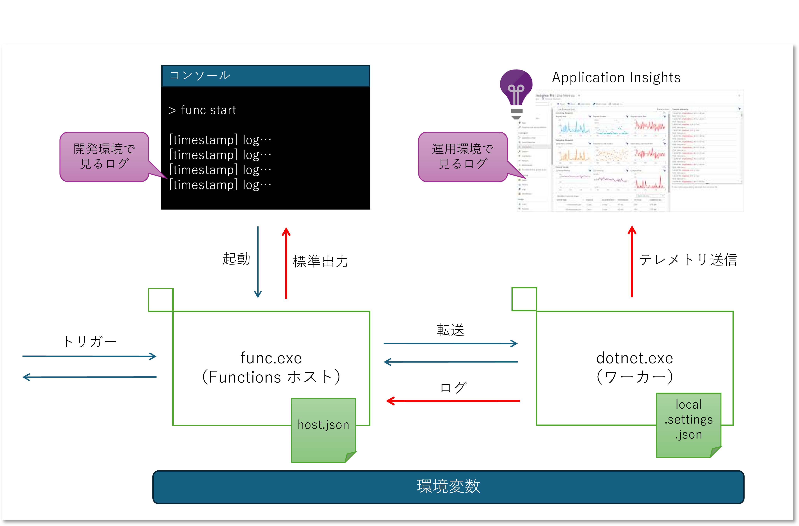

# はじめに

これまで Azure Functions のコードを書くときは C# のインプロセスモデルを使用していたのですが、最近になってようやく分離ワーカーモデルを触り始めました。
地味にいろいろな問題に出くわしつつ勉強しつつトラブルシュートをしていたのですが、その際に重要なログ周りがちょっと分かりにくかったので少し整理してみました。
例によって改めてドキュメント読んでみると書いてあったなあということばかりではあるのですが・・・

## 参考資料

- [分離ワーカー モデルで C# Azure Functions を実行するためのガイド](https://learn.microsoft.com/ja-jp/azure/azure-functions/dotnet-isolated-process-guide?tabs=windows)
- [分離されたワーカー モデルと Azure Functions 上の .NET のインプロセス モデルの違い](https://learn.microsoft.com/ja-jp/azure/azure-functions/dotnet-isolated-in-process-differences)

## 検証に使用したバージョン

- .NET SDKs 8.0.400
- Azure Functions Core Tools 4.0.6280

# 解説など



## まずはプロセスモデルの整理

**分離** という名の通り、分離ワーカーモデルでは Functions ホストと実際にユーザー関数の処理をする部分（ワーカー）が別プロセスになります。
[Functions Host](https://github.com/Azure/azure-functions-host) 自体は現在は .NET 8 で書かれています。
このホストプロセスと同じプロセスにユーザー関数を読み込む方式、すなわちインプロセス モデルの場合にはホストと同じバージョンおよびフレームワークの C# で開発する必要があります。
これは使用するライブラリのバージョンをホストプロセスに合わせるという **制約** が発生することを意味します。
また .NET Runtime 、Azure Functions、ワーカーのライフサイクルを一致させる必要があるので、これらが蜜結合することによる保守性の低下の問題も発生するでしょう。

ホストプロセスとワーカープロセスが分離することで、おおざっぱに言えば各種バインディングなどを処理するプロセスとユーザー関数をホストする部分が疎結合になることを意味します。
このあたりの構成は [カスタムハンドラー](https://learn.microsoft.com/ja-jp/azure/azure-functions/functions-custom-handlers) のドキュメントがわかりやすいと思います。
カスタムハンドラー自体は Functions でサポートされていない言語で開発したい場合に使用する手法ですが、
要はワーカーは Functions ホストをリバースプロキシとした一般的な Web サーバーとして実装すればよく、
バインディングなどの Functions フレームワーク特有の実装には非依存ということになりますね。

## 実際に Functions を作ってみる

さて .NET C# の分離ワーカーで Functions を作ってみましょう。
Visual Studio でやるといろいろ見えない部分も出てくるので [Azure Functions Core Tools](https://learn.microsoft.com/ja-jp/azure/azure-functions/functions-run-local?tabs=windows%2Cisolated-process%2Cnode-v4%2Cpython-v2%2Chttp-trigger%2Ccontainer-apps&pivots=programming-language-csharp) で作成します。

```powershell
# 現在のディレクトリに Functions プロジェクトを作成
func init --worker-runtime dotnet-isolated

# HTTP Trigger を作る
func new --template "Http Trigger" --name MyHttpTrigger1
```

既定の HTTP Trigger テンプレートで作成された関数は以下のようになっていると思います。

```csharp
[Function("MyHttpTrigger1")]
public IActionResult Run([HttpTrigger(AuthorizationLevel.Function, "get", "post")] HttpRequest req)
{
    _logger.LogInformation("C# HTTP trigger function processed a request.");
    return new OkObjectResult("Welcome to Azure Functions!");
}
```

## プロセスの親子関係を探る

このまま特に手を加えずに Functions を起動します。

```powershell
# 詳細情報付きで実行開始
func start --verbose
```

大量にログが出てくると思いますがここで着目したい部分は以下のあたりです

```log
[2024-09-11T06:13:27.633Z] Reading host configuration file 'Z:\myprojfolder\bin\output\host.json'
[2024-09-11T06:13:28.211Z] Fetching metadata for workerRuntime: dotnet-isolated
[2024-09-11T06:13:28.212Z] Reading functions metadata (Worker)
[2024-09-11T06:13:28.861Z] {
[2024-09-11T06:13:28.862Z]   "ProcessId": 33224,
[2024-09-11T06:13:28.862Z]   "RuntimeIdentifier": "win-x64",

[2024-09-11T06:13:29.233Z] Host initialized (82ms)
[2024-09-11T06:13:29.236Z] Host started (92ms)
[2024-09-11T06:13:29.236Z] Job host started

Functions:
        MyHttpTrigger1: [GET,POST] http://localhost:7071/api/MyHttpTrigger1
```

さらにFunctions ホストを起動したコンソールとは別の PowerShell コンソールを起動してプロセスを探っていきます。

```powershell
# 冒頭の方で Woker プロセスの PID が出ているのでそこからたどっていく
> $worker = Get-Process -PID 33224

# ワーカーの起動コマンド
> Write-Host $worker.CommandLine

"C:\Program Files\dotnet\dotnet.exe"  "Z:\myprojfolder\bin\output\myprojfolder.dll" --host 127.0.0.1 --port 57662 --workerId d60e718d-9eeb-46a5-baa8-e61216769959 --requestId 78523581-a802-4b12-911c-c07ca77b807c --grpcMaxMessageLength 2147483647 --functions-uri http://127.0.0.1:57662/ --functions-worker-id d60e718d-9eeb-46a5-baa8-e61216769959 --functions-request-id 78523581-a802-4b12-911c-c07ca77b807c --functions-grpc-max-message-length 2147483647

# 親プロセスを取得して起動コマンドを確認
> Write-Host $worker.Parent.CommandLine

"C:\Program Files\Microsoft\Azure Functions Core Tools\func.exe" start --verbose
```

Azure Functions Core Tools を起動(`func.exe start`)すると、子プロセスとしてカレントディレクトリにある .NET アプリが起動されている(`dotnet.exe projectname.dll`)ことがわかります。
分離ワーカーモデルっぽい構成になっていますね。

## エンドポイントを呼び出してログを確認

HTTP Triggerエンドポイントを呼び出すと以下のようなログがコンソールに出力されるわけです。

```log
[2024-09-11T06:06:24.272Z] Executing 'Functions.MyHttpTrigger1' (Reason='This function was programmatically called via the host APIs.', Id=a5365cea-ae8a-4503-837f-99cfda138897)
[2024-09-11T06:06:24.444Z] C# HTTP trigger function processed a request.
[2024-09-11T06:06:24.446Z] Executing OkObjectResult, writing value of type 'System.String'.
[2024-09-11T06:06:24.489Z] Executed 'Functions.MyHttpTrigger1' (Succeeded, Id=a5365cea-ae8a-4503-837f-99cfda138897, Duration=230ms)
```

最後から 3 行目が関数内で ILogger を使用して明示的に出力しているログで、それ以外は勝手に出ている部分ということになります。
ところでこれらのログは誰が出しているのでしょう？
起動処理のログを見ていると以下のようなログフィルターがかかっていることが確認できます。

```powershell
[2024-09-11T06:13:29.041Z] LoggerFilterOptions
[2024-09-11T06:13:29.041Z] {
[2024-09-11T06:13:29.041Z]   "MinLevel": "None",
[2024-09-11T06:13:29.042Z]   "Rules": [
[2024-09-11T06:13:29.043Z]     {
[2024-09-11T06:13:29.043Z]       "ProviderName": null,
[2024-09-11T06:13:29.044Z]       "CategoryName": null,
[2024-09-11T06:13:29.044Z]       "LogLevel": null,
[2024-09-11T06:13:29.045Z]       "Filter": "<AddFilter>b__0"
[2024-09-11T06:13:29.046Z]     },
[2024-09-11T06:13:29.046Z]     {
[2024-09-11T06:13:29.047Z]       "ProviderName": "Microsoft.Azure.WebJobs.Script.WebHost.Diagnostics.SystemLoggerProvider",
[2024-09-11T06:13:29.047Z]       "CategoryName": null,
[2024-09-11T06:13:29.048Z]       "LogLevel": "None",
[2024-09-11T06:13:29.049Z]       "Filter": null
[2024-09-11T06:13:29.050Z]     },
[2024-09-11T06:13:29.051Z]     {
[2024-09-11T06:13:29.052Z]       "ProviderName": "Microsoft.Azure.WebJobs.Script.WebHost.Diagnostics.SystemLoggerProvider",
[2024-09-11T06:13:29.053Z]       "CategoryName": null,
[2024-09-11T06:13:29.054Z]       "LogLevel": null,
[2024-09-11T06:13:29.054Z]       "Filter": "<AddFilter>b__0"
[2024-09-11T06:13:29.055Z]     },
[2024-09-11T06:13:29.056Z]     {
[2024-09-11T06:13:29.057Z]       "ProviderName": "Azure.Functions.Cli.Diagnostics.ColoredConsoleLoggerProvider",
[2024-09-11T06:13:29.058Z]       "CategoryName": null,
[2024-09-11T06:13:29.059Z]       "LogLevel": null,
[2024-09-11T06:13:29.059Z]       "Filter": "<AddFilter>b__0"
[2024-09-11T06:13:29.060Z]     }
[2024-09-11T06:13:29.061Z]   ]
[2024-09-11T06:13:29.062Z] 
```

どうも SystemLoggerProvider やら ColoredConsoleLoggerProvider が組み込まれているようですが、
Functions Core Tools (func.exe) の実行コンソールに色つきの文字が表示されていることから、
コンソールで見えているものに関してはおそらく後者が表示しているものと思われます。

## なんでワーカー側で動いているはずの関数内のログが出ている？

ちょっとワーカー側のログプロバイダーを確認してみましょう。
分離ワーカーモデルで作成したプロジェクトのスタートアップコードは以下のようになっており、[.NET 汎用ホスト](https://learn.microsoft.com/ja-jp/dotnet/core/extensions/generic-host?tabs=hostbuilder) で作られていることがわかります。

```csharp
//Program.cs
var host = new HostBuilder()
    .ConfigureFunctionsWebApplication()
    .ConfigureServices(services => {
        services.AddApplicationInsightsTelemetryWorkerService();
        services.ConfigureFunctionsApplicationInsights();
    })
    .Build();
host.Run();
```

上記のコードで `host.Run()` する手前に以下のコードを差し込むことで組み込まれているロガープロバイダーが確認できます。

```csharp
host.Services.GetServices<ILoggerProvider>().ToList().ForEach(
    lp => Console.WriteLine(lp.ToString()));
```

改めて `func start` すると以下のような出力が得られるでしょう。

```log
[2024-09-11T06:13:29.033Z] Microsoft.Azure.Functions.Worker.Logging.WorkerLoggerProvider
[2024-09-11T06:13:29.037Z] Microsoft.Extensions.Logging.ApplicationInsights.ApplicationInsightsLoggerProvider
```

ここで違和感を覚えます。

- 起動時に `LoggerFilterOptions` として表示されたログ プロバイダーと全く違うクラスが表示されている
- コード内では `Console.WriteLine` しているだけなのにタイムスタンプや色がついている
- そもそも func.exe ではなくワーカー側の標準出力に出しているだけなのに何故か表示されている

`ApplicationInsightsLoggerProvider` は自動生成されたスタートアップコード内で組み込まれていますが、そもそも Application Insights 作ってないですしコンソールだけなのでコレは違うでしょう。
とすると分離ワーカーモデルとして IHost 作る際に `ConfigureFunctionsWebApplication` で自動的に組み込まれていると思しき `WorkerLoggerProvider` あたりにカラクリがあるのでしょう。
おそらくこの `WokerLoggerProvider` が分離ワーカー内で ILogger を使用して出力したログを、Functions ホスト側のロガーに転送していて、標準出力も含めて `ColoredConsoleLoggerProvider` が色やタイムスタンプをつけて出力しているんじゃないでしょうか。

> ソースコードも軽く読んでみたものの挫折したので推測です

## ログを出さないようにしてみよう

ここでワーカー側のログプロバイダーを除去してみたいと思います。
`HostBuilder` をビルドする手前で以下のコードを挟むことで、すべてのロガーを除去します。

```csharp
    .ConfigureLogging(logging => {
        logging.ClearProviders();
    })
```

この状態で `func start` して HTTPTrigger を呼び出してみると、コンソールには以下が表示されます。

```log
[2024-09-11T07:08:20.459Z] Executing 'Functions.MyHttpTrigger1' (Reason='This function was programmatically called via the host APIs.', Id=ed91bbd7-61dd-4ba4-b3e8-3e2777ce525b)
[2024-09-11T07:08:20.658Z] Executed 'Functions.MyHttpTrigger1' (Succeeded, Id=ed91bbd7-61dd-4ba4-b3e8-3e2777ce525b, Duration=217ms)
```

ワーカー側のロガーがない状態なのにコンソールにログが出ているということは、やはり Functions ホスト側が出していたということですね。
逆に最初は出ていた以下の 2 行が消えていることから、これらはワーカー側で出力していたログを Functions ホスト側で表示していたということだと思います。

```log
[2024-09-11T06:06:24.444Z] C# HTTP trigger function processed a request.
[2024-09-11T06:06:24.446Z] Executing OkObjectResult, writing value of type 'System.String'.
```

## Application Insights にログを飛ばしてみよう

さてワーカーの自動生成されたスタートアップコードでは、明示的に [Application Insights が組み込まれて](https://learn.microsoft.com/ja-jp/azure/azure-functions/dotnet-isolated-process-guide?tabs=windows#application-insights)いました。

```csharp
var host = new HostBuilder()
    .ConfigureFunctionsWebApplication()
    .ConfigureServices(services => {
        services.AddApplicationInsightsTelemetryWorkerService();
        services.ConfigureFunctionsApplicationInsights();
    })
```

ドキュメントには以下のような記述がありますが、まさにこの部分ですね。

> 開発者は、分離プロセス アプリケーションがログを直接 Application Insights に出力するように構成できます。 この動作は、ホストを介してログをリレーするという既定の動作に代わるものであり、ログの出力方法を開発者が制御できるという理由で推奨されています。

おそらくこの「ホストを介してログをリレーする」という部分を担っているのが `WorkerLoggerProvider` なのでしょう。
そしてホスト側の設定ファイル `host.json` には既定で以下のように Application Insights のログ設定っぽいものが入っているのですが、これも混乱を招いている気もします。

```json
// 既定で生成されて host.json
{
    "version": "2.0",
    "logging": {
        "applicationInsights": {
            "samplingSettings": {
                "isEnabled": true,
                "excludedTypes": "Request"
            },
            "enableLiveMetricsFilters": true
        }
    }
}
```

ドキュメントにも以下の記載があります。

> Functions ホストと分離プロセス ワーカーには、ログ レベルなどの個別の構成があります。host.json の Application Insights 構成はワーカーからのログには影響しません。同様に、ワーカー コードで行われた構成は、ホストからのログ記録には影響しません。

つまり Application Insights へのログ出力は（Functions ホスト関係なく）ワーカー側が単独でやれということなので、その設定はワーカーのスタートアップコード内で実施するか、ワーカーが読み取る構成ファイル `local.settings.json` でやれということですね。

しかも `ConfigureFunctionsApplicationInsights()` によって組み込まれた `ApplicationInsightsLoggerProvider` にはフィルターがかかっており、警告 （Warning）以上のログレベルしか出力してくれません。
運用環境でエラーや警告のみ見張りたいときはいいのですが、開発やデバッグの時は Information 以下も出したいと思います。
よって、以下のようなコードが必要になるわけですね・・・

```csharp
// Applicaiton Insights Logger Provider に既定でかかっているフィルターを外す
.ConfigureLogging(logging =>
{
    logging.Services.Configure<LoggerFilterOptions>(options =>
    {
        LoggerFilterRule defaultRule = options.Rules.FirstOrDefault(rule => rule.ProviderName
            == "Microsoft.Extensions.Logging.ApplicationInsights.ApplicationInsightsLoggerProvider");
        if (defaultRule is not null)
        {
            options.Rules.Remove(defaultRule);
        }
    });
})
```

あとは Application Insights の接続文字列を以下の何れかで設定してやればよいわけです。

- `AddApplicationInsightsTelemetryWorkerService()` 拡張メソッドの引数で設定する
- 環境変数 : `APPLICATIONINSIGHTS_CONNECTION_STRING` に設定する
- 構成(Configuration) : `ApplicationInsights:ConnectionString` に設定する

ここで気を付けたいのは上記の設定スコープです。
拡張メソッドの場合は明示的にワーカーのスタートアップコードで指定するので問題ないですが、
環境変数や構成システムを使う場合は確実にワーカーに反映されるように注意しましょう。
具体的には以下のようになるでしょうか。

- 開発端末で動かす場合
    - `local.settings.json` の Values 配下に指定する
    - `func start` するコンソールの環境変数に設定する（プロセススコープの環境変数は子プロセスに引き継がれるため）
    - マシン環境変数やユーザー環境変数に設定する
- Azure Functions で動かす場合
    - Functions サービスの [環境変数や構成](https://learn.microsoft.com/ja-jp/azure/azure-functions/functions-how-to-use-azure-function-app-settings?tabs=azure-portal%2Cto-premium) で設定する


# まとめ


