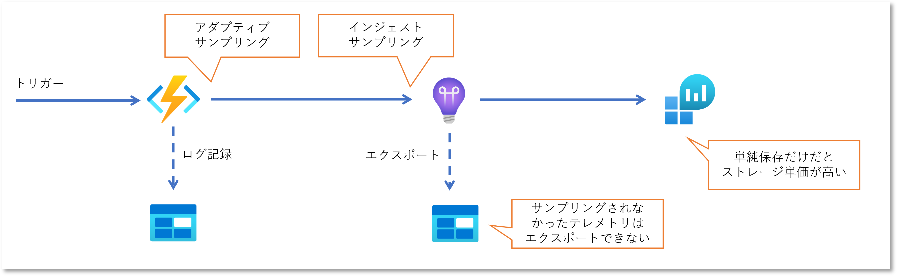
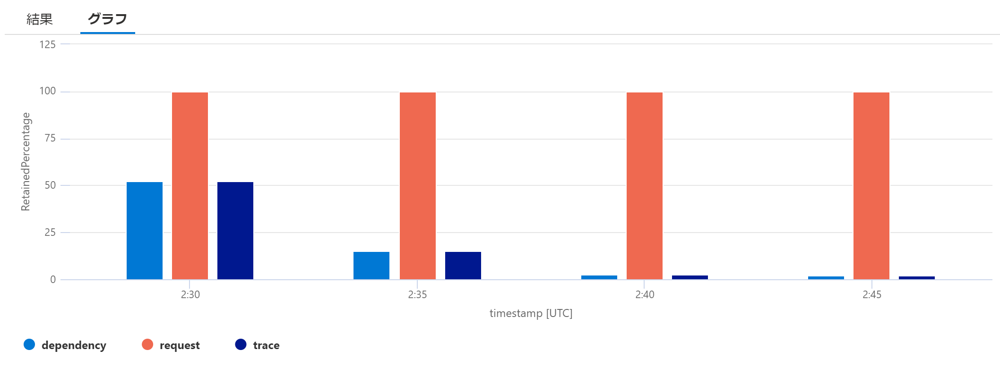
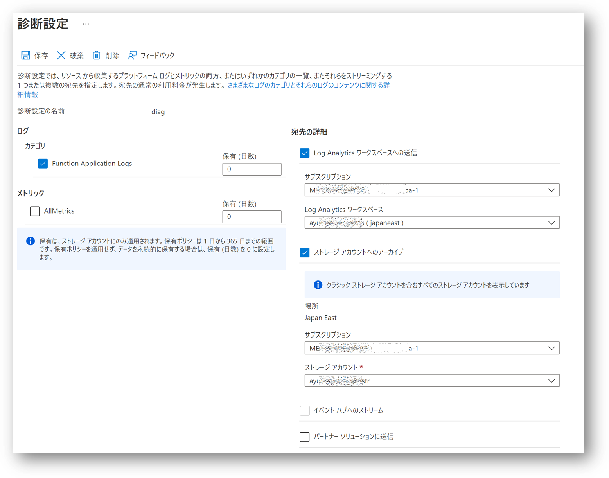

# はじめに

[Azure Functions のログ記録といえば Application Insights](https://learn.microsoft.com/ja-jp/azure/azure-functions/functions-monitoring) なわけですが、ドキュメントにも記載がある通り、既定ではサンプリングが行われます。
つまりこれを記録としての「ログ」ととらえていると、高負荷時にはログの欠落が発生し、いざというときに必要な情報が存在しない可能性があるということです。
また Application Insights の[データが保存される期間は既定で 90 日](https://learn.microsoft.com/ja-jp/azure/azure-monitor/app/data-retention-privacy)ですので、いつかは消えてなくなってしまいます。
この期間を延長することも可能ですが、そもそもベースとなる Log Analytics Workspace は[データを保存するだけのストレージとしては金額が高い](https://azure.microsoft.com/ja-jp/pricing/details/monitor/)ものになります。
安価に長期保存するためには [Blob にエクスポート](https://learn.microsoft.com/ja-jp/azure/azure-monitor/app/export-telemetry?source=recommendations)することもできますが、そもそもサンプリングの結果としてログが欠落していればエクスポートも出来ないわけです。

割と今更ながら、どうしようかなと思って調べた結果を記録します。

# 解決策の方向性

結局のところ Applicaiton Insights にテレメトリを送信する際に [Azure Functions に組み込まれた Application Insights のプロバイダーがアダプティブ サンプリング](https://learn.microsoft.com/ja-jp/azure/azure-functions/configure-monitoring?tabs=v2#configure-sampling)を行っていることに起因するわけですから、解決方針としては以下の 2 つです。

- サンプリングを無効にする
- Application Insights 以外にログを記録する

サンプリングを無効にするということはテレメトリの全量が記録されることになり、それはストレージとしてのコストの問題がやっぱり気になってしまいますし、これは予算に余裕があって解析する要件が強い方向けのソリューションだと思います。
このためここでは Application Insights 以外の確実で安価な永続的ストレージにログを吐く方向性を探ってみたいと思います。



# サンプリングの挙動を確認

いろいろ試す前にまずは Azure Functions + Application Insights を使用した場合の標準的なサンプリングの挙動を確認してみたいと思います。

## Functions のサンプルコード

検証のためにはさしあたり大量にログを出力すればいいので、Visual Studio で QueueTrigger を使用した下記のような関数を実装してみます。

- Queue に入ってきた内容を標準の `ILogger` 経由で記録
- カスタムログの簡易実装として明示的に Append Blob にも記録

関数の大半がカスタムログ出力のロジックが占める、しかも毎回 Blob の存在確認が動くという極めて雑な実装です。
このコードを Application Insights での監視を有効化した Azure Functions にデプロイすると、`ILogger.LogInformation` した内容も記録されるはずです。

```csharp
[FunctionName("QueueTriggerFunction1")]
public async Task Run(
    [QueueTrigger("%queue-trigger-function1%")]string myQueueItem, 
    Binder binder,
    ILogger log)
{
    var logid = Guid.NewGuid().ToString();
    log.LogInformation("C# Queue trigger function processed: {queue}: {logid}", myQueueItem, logid);

    var now = DateTime.UtcNow;
    var path = string.Format("%append-blob-logging%/{0:yyyyMMdd}-{0:HHmm}.log", now);
    var appendBlob = await binder.BindAsync<CloudAppendBlob>(new BlobAttribute(path, System.IO.FileAccess.ReadWrite));
    if(!await appendBlob.ExistsAsync())
        await appendBlob.CreateOrReplaceAsync();

    var message = string.Format("{0:yyyy-MM-dd HH:mm:ss.fff}: C# Queue trigger function processed: {1} :{2}", now, myQueueItem, logid) + Environment.NewLine;
    using (var str = new MemoryStream(Encoding.UTF8.GetBytes(message))) {
        await appendBlob.AppendBlockAsync(str);
    }
}
```

## サンプリングの設定値

サンプリングの挙動を確認したいわけなので Visual Studio が生成した `host.json` も確認しておきます。
[Azure Functions Core Tools](https://github.com/Azure/azure-functions-core-tools)で `func init` した場合でも同じ内容でした。
既定ではサンプリングが有効ですが、`Request` だけは除外されている（サンプリングされない）という内容ですね。

```json
{
  "version": "2.0",
  "logging": {
    "applicationInsights": {
      "samplingSettings": {
        "isEnabled": true,
        "excludedTypes": "Request"
      }
    }
  }
}
```

それ以外は既定値で動くはずなので、[リファレンス](https://learn.microsoft.com/ja-jp/azure/azure-functions/functions-host-json#applicationinsightssamplingsettings)を参照しておきましょう。
オプションが沢山ありますが、着目したいポイントとしては `logging.applicationInsights`セクション配下の以下の項目になります。

|項目|既定値|備考|
|---|---|---|
|maxTelemetryItemsPerSecond|20|サーバーホスト当たりで1秒間に記録される数。Functions がスケールアウトすると記録数は増える。|
|maxSamplingPercentage|100|最大では100%サンプルされる＝全部記録される|

スケールアウトすると挙動が分かりにくくなりそうなので、検証では Functions の最大スケールアウトを１インスタンスに設定、つまりスケールアウトしない状態でテストしています。

## クライアントのサンプルコード

というわけで、この Function に対して 10 万件程の Queue 入れてみます。
クライアントコードは以下のようになります。

```csharp
using Azure.Storage.Queues;

var client = new QueueClient(config["constr"], config["queue"]);
for (int i = 0; i < 100000; i++)
{
    var msg = $"Hello {i} / {max}";
    await client.SendMessageAsync(Convert.ToBase64String(System.Text.Encoding.UTF8.GetBytes(msg)));
}
```

## 結果の確認

期待値としては 10 万件のログが確認できれば良いわけです。
正常に実行されていれば Append Blob の行数が 10 万行になるはずです。
（上記のコードだと最初に Blob を生成させるところで競合する可能性があるので、数件の欠落が発生するケースがありましたが・・・）

### サンプリングが行われているのか？

Application Insights にテレメトリが届いた時点でサンプリングが行われておりログが欠落している可能性があるのですが、
[こちらの Kusto クエリ](https://learn.microsoft.com/ja-jp/azure/azure-functions/analyze-telemetry-data#sampling-percentage)
を実行すると、サンプリング レート自体は確認出来ます。

```kusto
union requests,dependencies,pageViews,browserTimings,exceptions,traces
| where timestamp between (datetime('2023-03-04T02:34:00Z') .. datetime('2023-03-04T02:50:00Z') ) 
| summarize RetainedPercentage = 100/avg(itemCount) by bin(timestamp, 5min), itemType
| render columnchart 
```
5分間隔のサンプリングレートを確認すると以下のようになりました。



`request` は Function の実行回数が記録されるわけですが、流石にこれが暗黙的に削られるのは不味いので `host.json` の `excludedTypes` で除外されているということでしょう。
実際に結果としてサンプリングレートが 100% 、つまり全てが記録されていることがわかります。
しかし `traces` テーブルに記録されるはずの `ILogger.LogInformation` で出力した「ログ」や、`dependencies` テーブルに記録されるはずの Append Blob への書き込みはサンプリングレートが 100% 未満、つまり一部のログは欠落してしまっていることがわかります。
それでも最初の 5 分は 50% 近く記録が残っているのですが、徐々に記録される件数が減っていきます。
このあたりが「アダプティブ」とついている所以ですね。

実際に `traces` や `dependencies` に記録された件数を数えてみます。

```kusto
union requests, traces, dependencies
| where timestamp between (datetime('2023-03-04T02:34:00Z') .. datetime('2023-03-04T02:50:00Z') ) 
| where operation_Name == 'QueueTriggerFunction1'
| where (itemType == 'request') 
    or (itemType == 'trace' and customDimensions.Category == 'Function.QueueTriggerFunction1.User') 
    or (itemType == 'dependency' and name == "PUT ayuina0304adatastr")
| summarize count() by itemType
```

実装コードからは `request` と `trace` と `dependency` が同じ件数になってほしいところなのですが、やはりサンプリングによってデータが欠落していることが確認できます。

|itemType|count|メモ|
|---|---|---|
|request|100,000| `operation_name` を `FunctionsAttribute` に指定した関数名でフィルタすると、全量の 10 万件のレコードが記録されている|
|trace|9,446| 各関数からの `ILogger.LogXXX` は `Function.{関数名}.User` というカテゴリに記録される|
|dependency|9,453|依存関係呼出しからストレージアカウントへの HTTP PUT 操作でフィルタすることで、Append Blob への追記を抽出|

ちなみに上記のフィルタを外すと `traces` には Functions のランタイムが記録している操作や、`dependencies` には Append Blob の存在確認(HTTP HEAD 操作)も記録されています。

# Azure Functions のログ記録

先ほどのサンプルコードのように Function のロジック内にカスタムログコードを記録しても良いのですが、流石にそれはちょっとダサいので、ILogger に書き込んだデータがそのまま全量出てほしいところです。
`host.json` の設定値を眺めていると `logging.fileLoggingMode` という設定項目があるのですが、どうもこれは [Azure Functions をローカル実行したときのオプション](https://github.com/MicrosoftDocs/azure-docs/issues/59008)だそうで、運用環境ではアテにならなさそうです。

というわけでカスタムログ プロバイダーを実装して組み込んでしまおうかなとも思ったのですが、標準機能で出来ないか探してみたところ、2023年3月現在ではプレビュー中ではありますが、`診断設定` で Functions のログ記録することが可能です。

- [Azure Monitor ログを使用した Azure Functions の監視](https://learn.microsoft.com/ja-jp/azure/azure-functions/functions-monitor-log-analytics?tabs=csharp)

こちらのドキュメントでは Log Analytics Workspace へ診断ログを送信する設定方法が記載されていますが、その他のサービスのリソースログの診断設定と同様に Storage Account の記録も可能です。
Log Analytics Workspace に送信するとやはり先ほどのコスト問題が気になりますし、Application Insights 経由でのログと重複する点も気になります。
コスト問題が気にならなければ Log Analytics Workspace の方が便利なのですが・・・

## Storage Account に出力された診断ログファイルの確認



さて Storage Account への送信を設定すると、`insights-logs-functionapplogs` というコンテナにログが Blob として出力されるようになります。
ログの各レコードは 1 行ずつ json 形式で記録されていいます。
こちらを手元にダウンロードして PowerShell で集計してみると以下のようになりました。

```powershell
# ファイルを読み込んで行数確認
> get-content .\PT1H.json | convertfrom-json | sv blobdata
> echo $blobdata.length

400000

# ランタイムのログも含んで件数が多く出ているため、実装した関数名のカテゴリを抽出
> $blobdata | where {$_.category -eq 'FunctionAppLogs' -and $_.properties.category -eq 'Function.QueueTriggerFunction1.User'} | sv logs
> echo $logs.length

100000

# 件数は一致しているが念のためログの中身も確認
> echo $logs[0..4] | foreach {$_.properties.message }

C# Queue trigger function processed: Hello 5558 / 100000: 011a59a4-bbd9-4cb7-85ca-4958a3a49137
C# Queue trigger function processed: Hello 5559 / 100000: ae0c061b-503b-41dc-a888-e949fc14ffc1
C# Queue trigger function processed: Hello 5560 / 100000: 7c48bf0a-babb-4996-b255-c67f6cc3c385
C# Queue trigger function processed: Hello 5561 / 100000: 05c1cf1e-89ea-4190-9301-ca4716414a0c
C# Queue trigger function processed: Hello 5562 / 100000: 142d0d01-cdbe-4b8a-8f9d-188515cc4606
```

## Log Analytics Workspace での確認

折角なので Log Analytics Workspace にも送信してクエリをかけてみましょう。
出力先テーブルは `FunctionsAppLogs` テーブルで、スキーマは[こちら](https://learn.microsoft.com/ja-jp/azure/azure-monitor/reference/tables/functionapplogs)になります。

```kusto
FunctionAppLogs
| where TimeGenerated between (datetime('2023-03-04T02:34:00Z') .. datetime('2023-03-04T02:50:00Z') ) 
| where Category == 'Function.QueueTriggerFunction1.User'
| summarize count()
```
Blob と同様に全量（この場合は 100,000）が確認出来るはずです。

