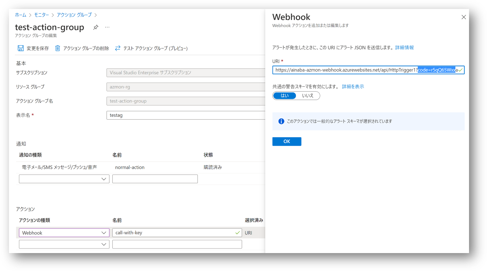
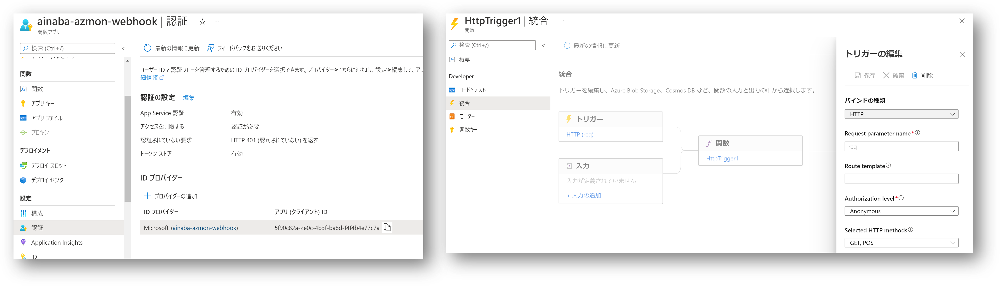
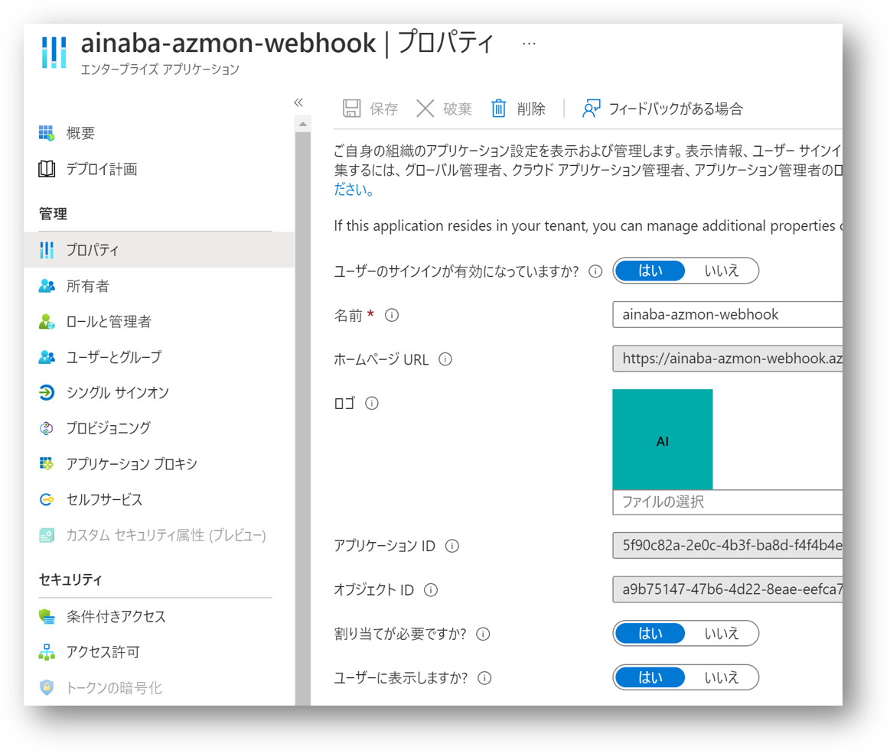
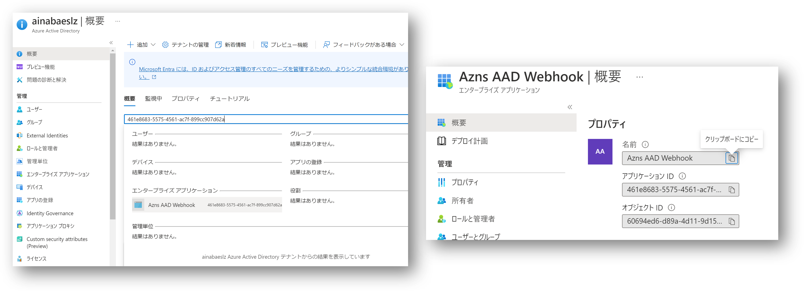
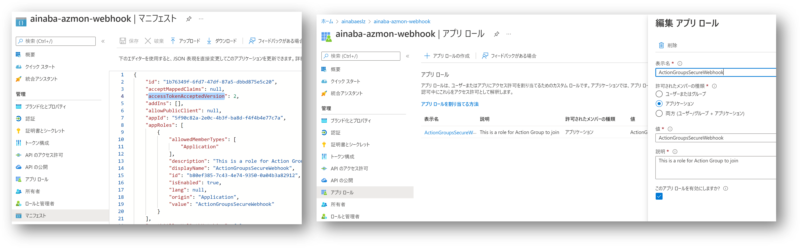
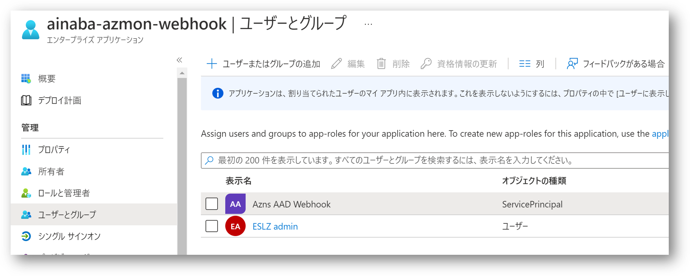
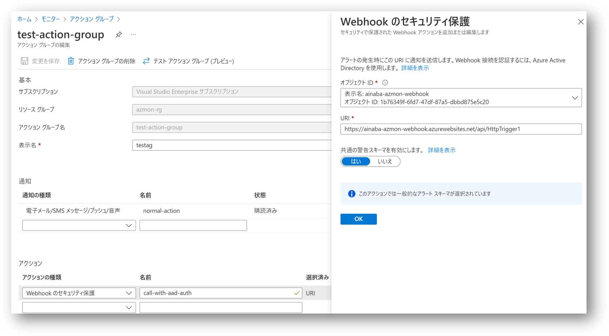
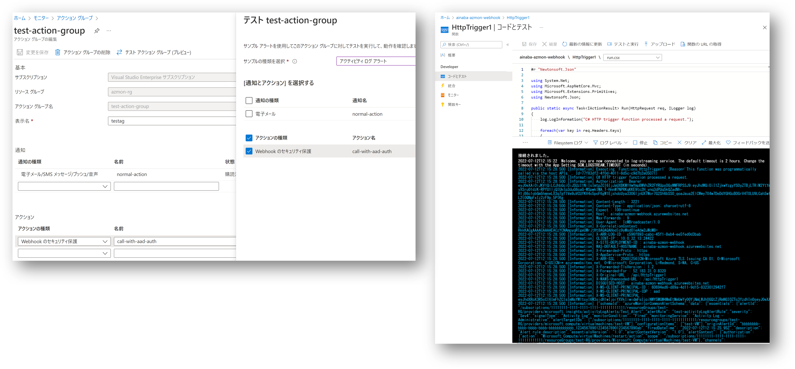

# はじめに

Azure Monitor の各種アラートルールが動作した場合の「通知先」はアクショングループで定義されます。
ここで通知先に WebHook を利用する場合には、下記のように指定可能なパラメータも少なく、その URL に API を保護するための「キー」を含むことが多くなります。
このためキーの漏洩やローテーション運用が課題になってくるわけです。



GUI で設定できないだけの可能性もあるので、
[Action Groups の ARM テンプレート仕様書](https://docs.microsoft.com/en-us/azure/templates/microsoft.insights/actiongroups?tabs=json)
を確認してみると、もう少しパラメータが指定できそうなことが分かります。
`useAadAuth` というパラメータがありますので、これは「Azure AD 認証で保護された WebHook を呼び出せそうだな？」ということが分かります。

```json
"webhookReceivers": [
    {
    "identifierUri": "string",
    "name": "string",
    "objectId": "string",
    "serviceUri": "string",
    "tenantId": "string",
    "useAadAuth": "bool",
    "useCommonAlertSchema": "bool"
    }
]
```

てっきり WebHook の呼び出しにサービスプリンシパルを使用できるのかと思ったのですが、Key や証明書を指定する項目がありません。
これらの管理はせずに楽をしたいのでありがたいですね。
また [Managed Identityをサポートするサービスの一覧](https://docs.microsoft.com/ja-jp/azure/active-directory/managed-identities-azure-resources/managed-identities-status)
にはアクショングループの記載が無いので、仕組みとしてはこちらとも違うもののようです。

これが
[セキュリティで保護された Webhook (Secure Webhook)](https://docs.microsoft.com/ja-jp/azure/azure-monitor/alerts/action-groups?WT.mc_id=Portal-Microsoft_Azure_Monitoring#secure-webhook)
と呼ばれる仕組みのようですので、
Azure AD 認証で保護された Azure Functions を作成して、アクショングループから呼び出せるか試してみました。


# Azure AD 認証する Azure Functions App を作成する

まずは WebHook を受けるための HttpTrigger で起動する Function を作成します。
ここは本題ではないので動作確認が出来る程度の下記の様なコードで作っておけば良いでしょう。

```c#
using System.Net;
using Microsoft.AspNetCore.Mvc;
using Microsoft.Extensions.Primitives;
using Newtonsoft.Json;

public static async Task<IActionResult> Run(HttpRequest req, ILogger log)
{
    log.LogInformation("C# HTTP trigger function processed a request.");

    foreach(var key in req.Headers.Keys)
    {
        log.LogInformation(string.Format("{0} : {1}", key, req.Headers[key]));
    }

    string requestBody = await new StreamReader(req.Body).ReadToEndAsync();
    log.LogInformation(requestBody);


    return new OkObjectResult(new object());
}
```

次に Azure AD 認証を有効にし、API キーを使用した認証は無効にしておきます。



このままでは同じ Azure AD テナントで認証できる任意のユーザーとアプリが呼び出し可能になってしまいますので、
認証を有効にした際に Azure AD に登録された「エンタープライズアプリケーション」の画面で「割り当てが必要」に設定します。




# アクショングループを表す Azure AD アプリケーション

実はアクショングループは既に Azure AD にアプリ登録がされている「ファースト パーティ アプリケーション」ですので、自分でアプリ登録をする必要がありません。
Application Id (Client Id) は `461e8683-5575-4561-ac7f-899cc907d62a` で固定になりますので、Azure AD の管理画面でこの ID を検索すると「エンタープライズアプリケーション」だけが見つかると思います。
このアプリケーションが、先ほど登録した 「Azure Functions で作った WebHook」を呼び出せる設定を組んでいきます。




# WebHook 側のアプリケーションを構成する

さてアクショングループはユーザー操作などが関与しない「非対話型のアプリケーション」です。
このため [Web API をデーモンアプリから呼び出す](https://docs.microsoft.com/ja-jp/azure/active-directory/develop/scenario-protected-web-api-app-registration#if-your-web-api-is-called-by-a-service-or-daemon-app)
ための Client Credentials フローを構成してやれば良いわけです。



まずアクショングループが動作する際に WebHook 側に送信されてくるアクセストークンのバージョンを V2 に指定します。
これは Azure AD 認証を有効にした際に生成されるアプリの「マニフェスト」画面で指定できます（上図左）。

次に「アプリロール」画面を開いて `ActionGroupsSecureWebhook` という名前および値をもつアプリロールを作成します（上図右）。

# アプリ ロールにアクショングループを割り当てる

作成したアプリロールに対してアクショングループを表すエンタープライズアプリケーションを割り当てたいのですが、
残念ながらこちらはスクリプトで実装する必要があります。

```powershell
# 各アプリが登録された Azure AD テナント (=Azure Monitor を使用するサブスクリプションが信頼するテナント）に接続します
Connect-AzureAD

# WebHook を表すアプリの ID （ AzureAD 認証を有効にしたときに自動生成される）から、当該テナントにおけるサービス プリンシパル（エンタープライズ アプリケーション）を取得します。
$myapiAppid = 'Guid-of-your-webhook-appid'
$myapiSp =  Get-AzureADServicePrincipal -Filter ("appId eq '$myapiAppid'")

# アクショングループを表すアプリの ID （固定）から、当該テナントにおけるサービス プリンシパル（エンタープライズ アプリケーション）を取得します。
$agAppid = '461e8683-5575-4561-ac7f-899cc907d62a'
$agSp = Get-AzureADServicePrincipal -Filter "appId eq '$agAppid'"

# WebHook を表すアプリに作成したロールに対して、アクショングループを表すアプリケーションを割り当てます。
New-AzureADServiceAppRoleAssignment `
	-ResourceId $myapiSp.ObjectId -Id $myapiSp.AppRoles[0].Id `
	-ObjectId $agSp.ObjectId -PrincipalId $agSp.ObjectId

```

この割り当ての結果は Azure Portal でも確認できます。




# アクショングループに Secure WebHook を登録してテストする

ここまでで準備完了ですので、アクショングループから「Webhook のセキュリティ保護」という名前のアクションの種類を登録します。
この際に Function の API を呼び出すための URL を指定するのですが、認証キーが不要になる代わりに、Azure AD に登録したエンタープライズアプリケーションを指定しています。
この WebHook を実行するために必要なアクセストークンの条件を指定している、といったところでしょうか。



設定が完了したら、まだプレビュー機能ですが「テスト アクション グループ」を使用して呼び出してみましょう。



ログに表示された JWT をデコードしてみると、
アクショングループを表すエンタープライズアプリケーション (sub) が、
WebHook を表すアプリケーション (aud) を呼び出すために、
V2 エンドポイントからアクセストークンを発行 (iss) してもらっており、
そのトークンには必要なロール (roles) が含まれていることが確認できます。

```json
{
  "typ": "JWT",
  "alg": "RS256",
  "kid": "2ZQpJ3UpbjAYXYGaXEJl8lV0TOI"
}.{
  "aud": "5f90c82a-2e0c-4b3f-ba8d-f4f4b4e77c7a",
  "iss": "https://login.microsoftonline.com/f52c30c4-5504-48e5-b3d8-f22bfd4ce170/v2.0",
  "iat": 1657627827,
  "nbf": 1657627827,
  "exp": 1657714527,
  "aio": "E2ZgYPBlF5kYudNNP+o7745He94KAgA=",
  "azp": "461e8683-5575-4561-ac7f-899cc907d62a",
  "azpacr": "2",
  "oid": "60694ed6-d89a-4d11-9d15-8323012942f7",
  "rh": "0.AXEAxDAs9QRV5Uiz2PIr_UzhcCrIkF8MLj9Luo309LTnfHpxAAA.",
  "roles": [
    "ActionGroupsSecureWebhook"
  ],
  "sub": "60694ed6-d89a-4d11-9d15-8323012942f7",
  "tid": "f52c30c4-5504-48e5-b3d8-f22bfd4ce170",
  "uti": "TVnpphMe_EmpiGPMIIwwAA",
  "ver": "2.0"
}.[Signature]
```