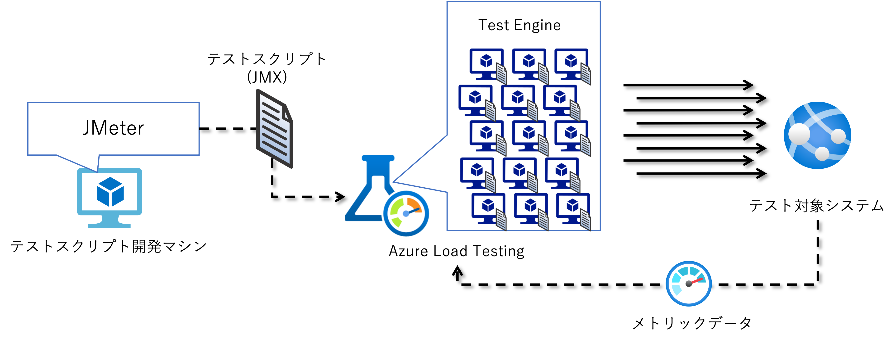

## はじめに

早いもので Azure DevOps の Cloud-based load testing サービスが終了して 2 年が経ち、いつか Azure Load Testing も試してみようと思いながらも後回しにしてきたのですが、
やっと挑戦してみる気になりました。
まだプレビューなのか・・・、と思いつつも試してみた、という記事です。以下は参考資料。

- [Cloud-based load testing service end of life](https://devblogs.microsoft.com/devops/cloud-based-load-testing-service-eol/)
- [Azure Load Testing](https://docs.microsoft.com/ja-jp/azure/load-testing/overview-what-is-azure-load-testing)

## サービスの概略

一般的には大規模の負荷テストをやろうとすれば、以下のような手間がかかります。
これはおそらくどんなテストフレームワークを使ったとしても変わらないのではないでしょうか。
ただこれ、「テストスクリプトの開発」と「収集したデータの分析」以外はテスト対象システムに依存しないルーチンワークになるのではないでしょうか。

1. 負荷をかけるためのクライアントマシンを大量に並べて
1. 各マシンにソフトウェアをセットアップして
1. 対象システムに負荷をかけるためのテストスクリプトを開発して
1. 各マシンでのスクリプト実行をスケジューリングして
1. 負荷がかかった時の各種データを収集して
1. データを分析して性能目標に対する品質判定やボトルネックを特定します。

Azure Load Testing は JMeter スクリプトを多数のマシンから並列実行させるサービスになっていて、上記の作業でルーチン化できる部分をサービスとして提供してくれるわけです。
特に負荷クライアントになるマシンをオンデマンドに利用できるのでクラウドのコストが、セットアップやデータ収集の手間がないのでエンジニアのコストが、そして何よりも時間が節約できる、というのが大きなメリットでしょう。

これによってエンジニアは本来のお仕事である「テストスクリプトの開発」及び「データの分析」に注力できるわけです。
もちろんこの世の全ての負荷テストが Azure Load Testing （以下ALT）で実現できるわけではないですが、どんな機能が使えるのかを知っておいて必要になった時の選択肢として持っておくと良さそうです。

## テスト環境について

さてそれでは性能テストを実施する環境を準備していきます。大きく分けて３つです。

- テストスクリプト開発マシン
  - JMeter をインストールしてテストスクリプト（JMX）を作成するマシンです
  - Azure VM のアイコンで表現していますが、これはお手元のパソコンでも大丈夫です
- Azure Load Testing
  - 今回の主役です。 Azure Portal から作成・管理します
  - 作成した JMX ファイルを実行する `Test Engine` はテストを実施する際に動的に用意され、テストが終われば削除されます。
- テスト対象システム
  - 負荷をかけたい対象システムです。
  - Azure Web Apps のアイコンで表現していますが、インターネット経由でアクセス可能な Web システムであればなんでも構いません。
  - が、Azure 上で稼働するリソースであれば Azure Monitor でメトリックを取ること



## テストスクリプト開発マシン

まずは作業マシンを用意していきます。

### テスト対象アプリの作成（Optional）

とりあえず動作検証するためにはローカルで動く Web　アプリがあった方がいいので、私の愛する ASP.NET Core な Web アプリを作成しておきます。
[こちら](https://dotnet.microsoft.com/en-us/download)から .NET SDK をダウンロードしてインストールし、下記のコマンドで Web アプリの出来上がりです。

```powershell
dotnet new webapp -o testapp01
cd tetapp01
dotnet run 

info: Microsoft.Hosting.Lifetime[14]
      Now listening on: https://localhost:7251
info: Microsoft.Hosting.Lifetime[14]
      Now listening on: http://localhost:5049
info: Microsoft.Hosting.Lifetime[0]
      Application started. Press Ctrl+C to shut down.
info: Microsoft.Hosting.Lifetime[0]
      Hosting environment: Development
info: Microsoft.Hosting.Lifetime[0]
      Content root path: C:\Users\ayumu\Desktop\testapp01\
```

表示された localhost な URL をブラウザで開いて動作確認します。

### Java　と JMeter　のインストール

### ローカルで負荷をかける

### URL　のパラメタライズ


### Azure Load Testing


### テスト対象システム
