## はじめに

早いもので Azure DevOps の Cloud-based load testing サービスが終了して 2 年が経ち、いつか Azure Load Testing も試してみようと思いながらも後回しにしてきたのですが、
やっと挑戦してみる気になりました。
まだプレビュー段階なのか・・・、と思いつつも試してみた、という記事です。以下は参考資料。

- [Cloud-based load testing service end of life](https://devblogs.microsoft.com/devops/cloud-based-load-testing-service-eol/)
- [Azure Load Testing](https://docs.microsoft.com/ja-jp/azure/load-testing/overview-what-is-azure-load-testing)

なお本記事の執筆時点ではまだプレビュー中のサービスであるため、今後変更になる可能性があります。

## サービスの概略

一般的には大規模な性能テストや負荷テストをやろうとすれば、以下のような手間がかかります。
これはおそらくどんなテストフレームワークを使ったとしても変わらないのではないでしょうか。
ただこれ、「テストスクリプトの開発」と「収集したデータの分析」以外はテスト対象システムに依存しないルーチンワークですよね。

1. 負荷をかけるためのクライアントマシンを大量に並べて
1. 各マシンにソフトウェアをセットアップして
1. 対象システムに負荷をかけるためのテストスクリプトを開発して
1. 各マシンでのスクリプト実行をスケジューリングして
1. 負荷がかかった時の各種データを収集して
1. データを分析して性能目標値に対する品質判定やボトルネックを特定する

Azure Load Testing は JMeter スクリプトを多数のマシンから並列実行させるサービスになっていて、上記の作業でルーチン化できる部分をサービスとして提供します。
負荷をかけるためのクライアントマシンを大量にセットアップしたり、データ収集する手間を削減できるので、従来と同じテストを行うにしてもエンジニアの工数が節約できます。
そうやって節約した時間とコストは、エンジニアが本来のお仕事である「テストスクリプトの開発」及び「データの分析」に注力することで、より高度なテストとシステム品質の改善に活用できるわけです。
またクラウドのキャパシティを活用することで、従来オンプレミス環境では現実的でなかった大規模な負荷を生成できるというのも大きいですね。

もちろんこの世の全ての負荷テストが Azure Load Testing （以下ALT）で実現できるわけではないですが、どんな機能が使えるのかを知っておいて、必要になった時の選択肢として持っておくと良いのではないでしょうか。

## テスト環境について

さてそれでは性能テストを実施する環境を準備していきます。大きく分けて３つです。

- テストスクリプト開発マシン
  - JMeter をインストールしてテストスクリプト（JMX）を作成するマシンです
  - Azure VM のアイコンで表現していますが、これはお手元のパソコンでも大丈夫です
- Azure Load Testing
  - 今回の主役です。通常の Azure サービスと同様に Azure Portal や CLI などから作成・管理します
  - 作成した JMX ファイルを実行する `Test Engine` はテストを実施する際に動的に用意され、テストが終われば削除されますので管理の手間はかかりません
- テスト対象システム
  - 性能を計測する、高負荷時の挙動を確認するといった、テスト対象のシステムです。
  - Azure Web Apps のアイコンで表現していますが、インターネット経由でアクセス可能な Web システムであればなんでも構いません。
  - が、Azure 上で稼働するリソースであれば Azure Monitor でメトリックを取ることが出来るのがポイントです


## テストスクリプト開発マシン

まずは作業マシンを用意していきます。

### テスト対象アプリの作成（Optional）

とりあえず動作検証するためにはローカルで動く Web　アプリがあった方がいいので、私の愛する ASP.NET Core な Web アプリを作成しておきます。
[こちら](https://dotnet.microsoft.com/en-us/download)から .NET SDK をダウンロードしてインストールし、下記のコマンドで Web アプリの出来上がりです。

```powershell
dotnet new webapp -o testapp01
cd tetapp01
dotnet run 

info: Microsoft.Hosting.Lifetime[14]
      Now listening on: https://localhost:7251
info: Microsoft.Hosting.Lifetime[14]
      Now listening on: http://localhost:5049
info: Microsoft.Hosting.Lifetime[0]
      Application started. Press Ctrl+C to shut down.
info: Microsoft.Hosting.Lifetime[0]
      Hosting environment: Development
info: Microsoft.Hosting.Lifetime[0]
      Content root path: C:\Users\ayumu\Desktop\testapp01\
```

表示された localhost な URL をブラウザで開いて動作確認します。

### Java　と JMeter　のインストール

JMeter の実行には Java が必要なのでインストールしていきます。
私は特にこだわりはないので [Microsoft Build of OpenJDK](https://www.microsoft.com/openjdk) からダウンロードしてインストールしました。

```powershell
> java.exe --version

openjdk 17.0.3 2022-04-19 LTS
OpenJDK Runtime Environment Microsoft-32931 (build 17.0.3+7-LTS)
OpenJDK 64-Bit Server VM Microsoft-32931 (build 17.0.3+7-LTS, mixed mode, sharing)
```

次に本題の JMeter を [Apache JMeter 本家のサイト](https://jmeter.apache.org/) から zip ファイルをダウンロードし、解凍したら中に入っている ```jmeter.bat``` を起動するとユーザーインタフェースが立ち上がってきます。

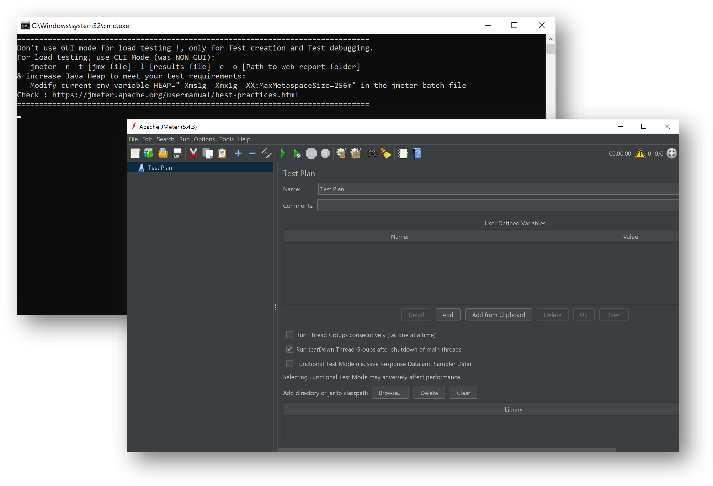

が、この後の手順で発生するのですが、インストール直後に設定されている ```Darklaf``` 系のテーマが設定されていると、以下の様な警告が出てしまってファイルが保存できません。

```java
2022-05-16 05:39:31,346 ERROR o.a.j.JMeter: Uncaught exception in thread Thread[AWT-EventQueue-0,6,main]
java.lang.IllegalAccessError: class com.github.weisj.darklaf.ui.filechooser.DarkFilePaneUIBridge$DetailsTableModel (in unnamed module @0x15761df8) cannot access class sun.awt.shell.ShellFolder (in module java.desktop) because module java.desktop does not export sun.awt.shell to unnamed module @0x15761df8
```

このエラーは ```Options > Look and Feel``` から Darkloaf のつかない別のテーマを選択することで回避できます。
テーマを切り替えたら JMeter を再起動してください。
下記は ```Metal``` テーマが適用されたユーザーインタフェースです。

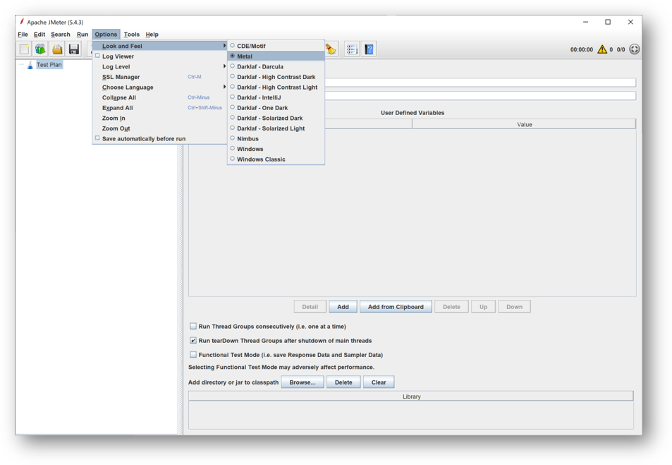


### ローカルで負荷をかける

それでは早速ローカルで動作している、先ほど開発した Web アプリ に負荷をかけてみましょう。
（筆者はこれが初めての JMeter なのでここはあまり深入りしていませんが、各種 Web の記事なり書籍なりをご参考にしてください）

- Test Plan に負荷のボリュームを指定する Thread Group を追加する
  - Number of Threads に仮想ユーザー数（スレッド数）を設定する
  - Ramp-up period に上記スレッドを準備するための時間を設定する
  - Loop Count に各スレッドでのテスト実行回数を指定する
- Thread Group に同じマシン上で動作している Web アプリを呼び出すための HTTP Request を追加する
  - Web Server セクションでは Protocol に ```http``` 、Server Name or IP は ```localhost ``` 、ポートは Web アプリ起動時に表示されていた値を設定する
  - HTTP Request セクションでは ```GET``` メソッドと Path ```/Index``` を設定する
- HTTP Request の実行結果を表示するための Litener を追加する
  - ここで性能を細かく見るわけではないので、Summary Report を選択

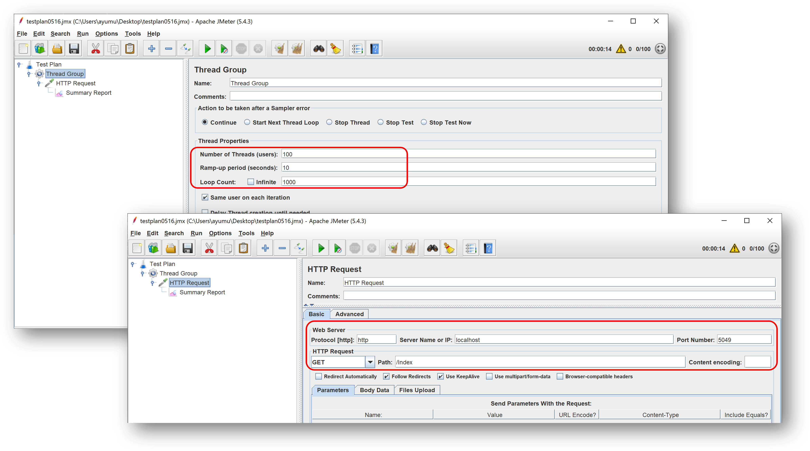

準備が出来たら Start ボタンを押すことでテストが開始され、完了すると Listener 画面で結果が表示されます。

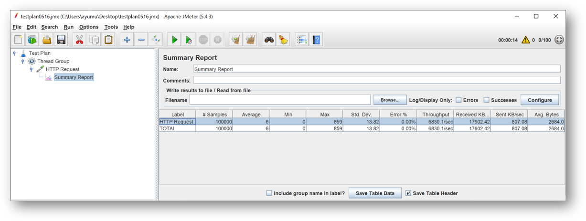

### URL　のパラメタライズ

負荷がかかることが確認できたらテストプランを JMeter スクリプト（JMX ファイル）として保存して Azure Load Testing にアップロードするのですが、
テスト対象の URL がローカルに作成した Web アプリ（http://localhost:5049）を指示しているので、このままでは正常にテストができません。
このため実行環境に合わせて書き換えられるように、スクリプトに含まれる一部の設定値をパラメータ化しておく必要があります。

Azure Load Testing では実行時に
[シークレットと環境変数](https://docs.microsoft.com/ja-jp/azure/load-testing/how-to-parameterize-load-tests)
を設定できますが、今回は機微情報を扱わないので環境変数を利用します。
各設定個所から直接環境変数を参照しても良いのですが、環境変数を読み取る構文が若干長いので、一度ユーザー定義変数に読み込んでおくとメンテがしやすくなります。

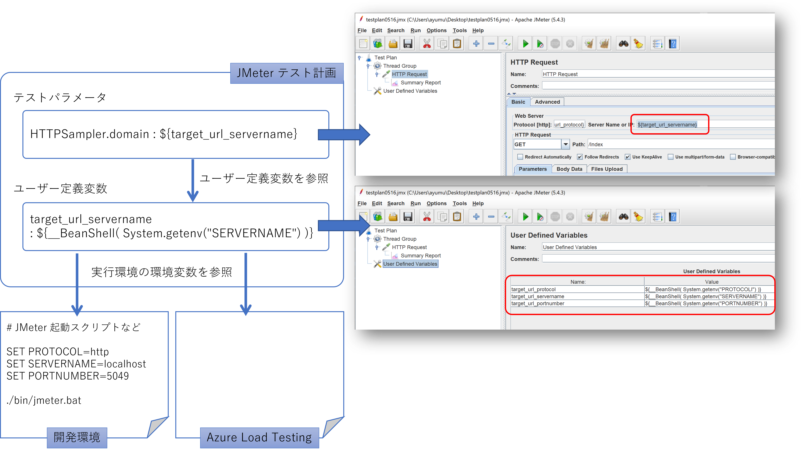

この状態でテストを実行してエラーが出ないことを確認しておき、JMeter スクリプト（JMX ファイル）として保存します。


## Azure Load Testing

さてやっと本題です。

### Azure Load Testing リソースの作成

Azure Load Testing を Azure Portal から作成しますが、最初はほぼ既定の設定で問題ないでしょう。
なお、まだ選択できるリージョンが少ないことにご注意ください。
テスト対象サービスが別リージョンの場合にはレスポンスタイムにオーバーヘッドが発生しますし、ネットワーク使用料も関わってきます。

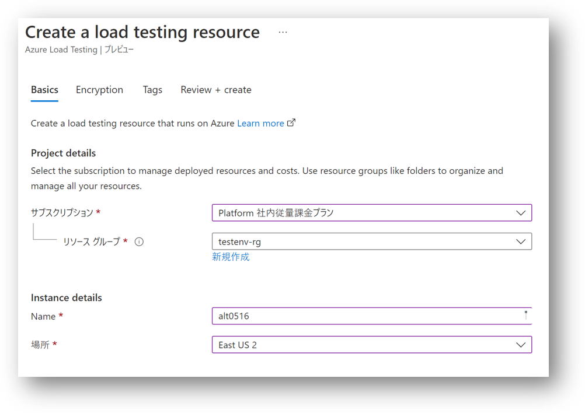

おおむね１分程度で作成が完了します。必要なときにサクッとテスト環境が準備できるのは素敵です。

### テストの作成

出来上がった Azure Laod Testing にテストを作成します。
まず ```Tesing``` メニューを選択して ```Create test``` を押すと、ウィザード形式でテストを作成できます。

- Basics タブ
  - テストの名前と説明を指定します
  - ここで ```Run test after creation``` のチェックを外しておかないと、作成直後にいきなりテストが走ります
- Test plan タブ
  - 先ほど JMeter を使用して作成した JMX ファイルをアップロードします
- Parameters タブ
  - 環境変数に切り出しておいた各種パラメータを指定します
  - 実際に Web サイトが動作している URL になるように調整してください
- Load タブ
  - JMeter エンジンを並べる数をスライドバーか数値で指定します
  - これだけで多数のテストクライアントを利用できるのが Azure Load testing のような PaaS を使用する醍醐味と言えましょう
- Test criteria タブ
  - ここではテストを **失敗と判定する条件** を指定します
  - 現在指定できる指標は ```Average Response time (msec)``` と ```Error (%)``` の 2 つで、条件も```grater than``` のみが指定できます
  - 平均の応答時間が長すぎる（＝性能が遅い）か、実行回数に占めるエラーの回数が多すぎる（＝障害が多い）場合に失格ということになります
- Monitoring タブ
  - こちらは後述しますのでここでは何も指定していません
- Review + create タブ
  - ここで各種チェックに合格したらテストが作成できます

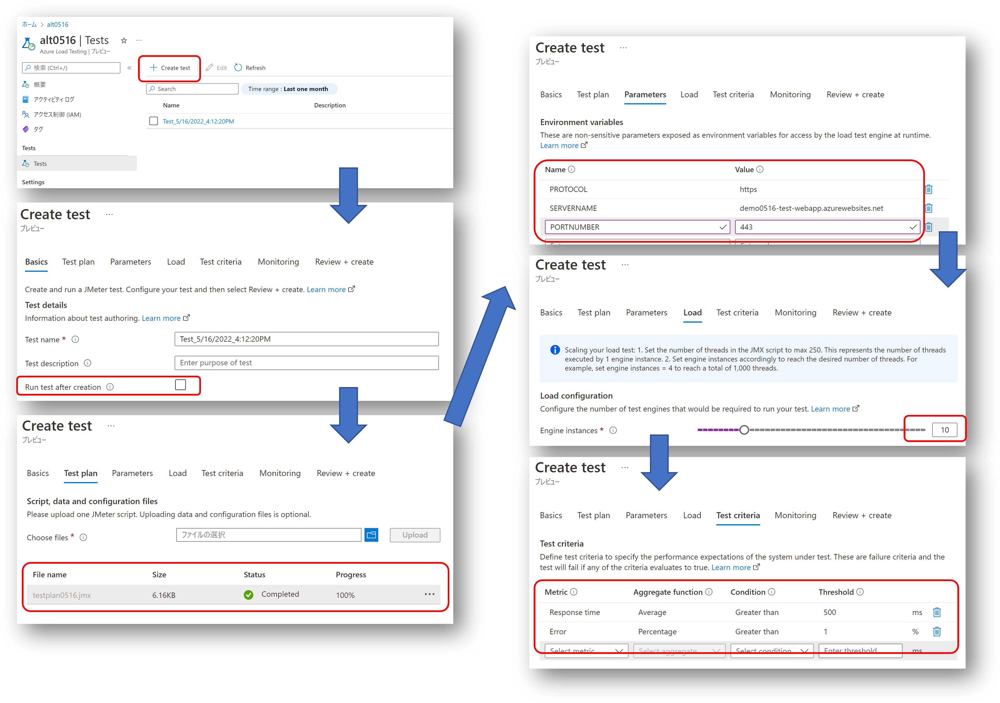

### テストの実行

テスト対象の Web アプリがインターネット越しにアクセスできることを確認しておき、
作成したテストを開いて ```Run``` ボタンを押すとテストが実行できます。

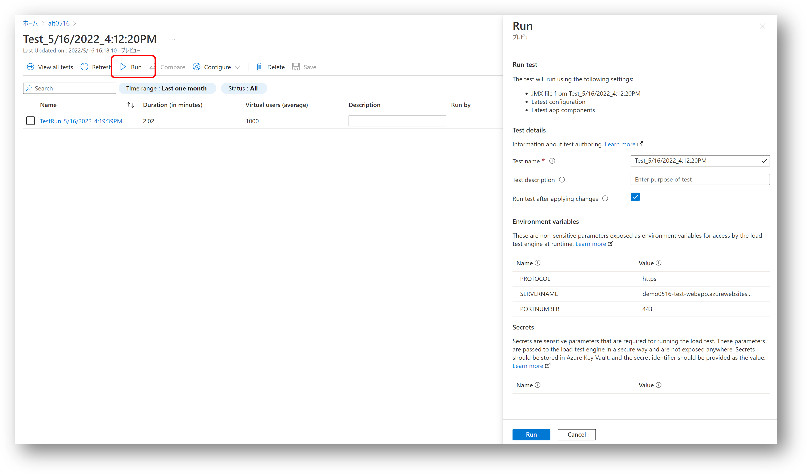

すると Status が ```Provisioning -> Executing -> Done``` と遷移してテスト結果が表示されます。
下記は JMX ファイル内のスレッドを 10 に、Engine Instance 数を 3 に設定した場合のテスト結果になります。

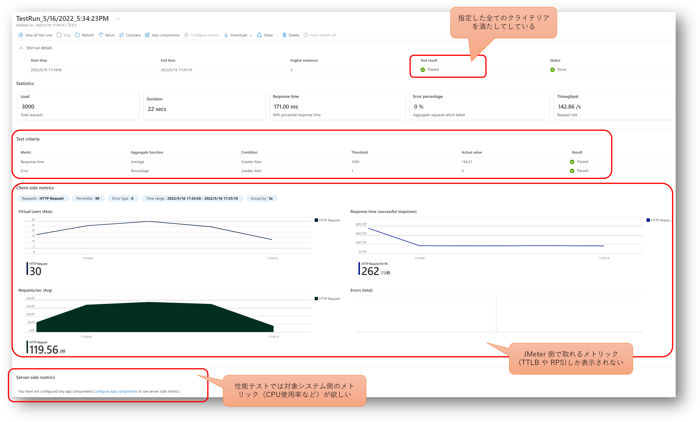

前述の Run ボタンを押せば同じ条件で何度でもテストを実行できます。
対象システムのスケールアウト（イン）や、スケールアップ（ダウン）で必要十分な性能になるようにチューニングしていきましょう。
気軽にリグレッションテストが出来るのはいいですね。

あるいは、テストの諸条件を変更したい場合には、テスト作成時の画面まで戻り Configure メニューから設定を変更するか、JMX ファイルを書き換えて再アップロードすることが出来ます。
~~私は JMX ファイルの定義で 100 スレッド設定にしていたせいか、テストエンジンが最小の 1 でも負荷がかかりすぎたので、負荷を下げる羽目になりました。~~

## テスト対象システム

ここまでの内容でAzure Load Testing を使って負荷をかけることが出来ましたが、ここで得られるのは負荷の条件（= Virtual Users）に対してテスト対象システムの外部から見たメトリックにとどまります。

- RPS : Requests Per Second （スループット）
- TTLB : Time to last bytes （平均応答時間）
- Errors : エラー発生回数

これらは代表的な性能指標値ではありますが、パフォーマンスチューニング、ボトルネックの特定、高負荷時の内部エラー情報の取得などを行うためには、テスト対象システムの内部から見たメトリックも必要になるでしょう。


### Web Apps + SQL Database システムの例

さて対象システムが Azure Load Testing の対応する Azure リソースで構成されていれば、Azure Load Testing は Azure Monitor と連携して対象システムのメトリックも取得することが出来ます。
テスト対象が Web App や SQL Database の場合は、テスト設定の Monitoring タブにて対象リソースを追加することが可能です。

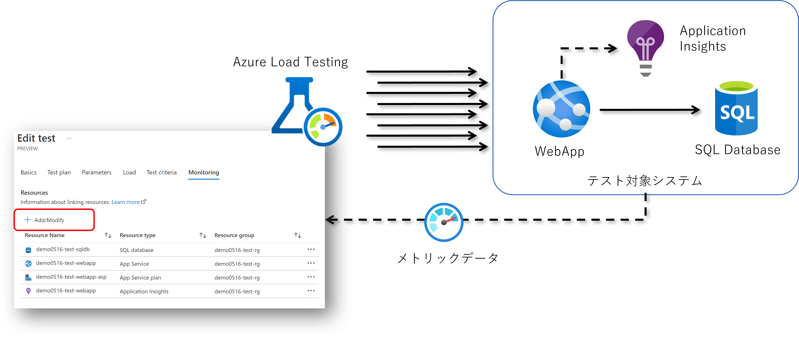

この状態でテストを実行するとクライアント側（Azure Load Testing 側）で計測されたメトリックと一緒にサーバー側（Azure で動作するテスト対象システム側）のメトリックを確認できます。

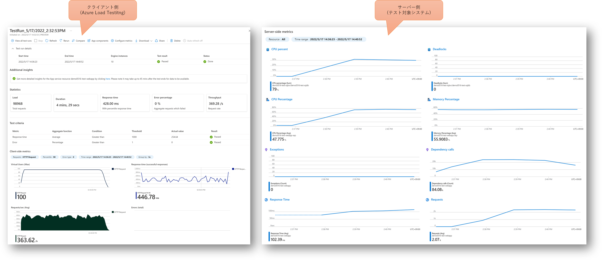

平均の応答時間とエラー率からこのテスト自体が成功、すなわち品質評価に合格だったことはわかりますが、サーバーサイドのメトリックからは以下の内容が確認できます。
参照したいメトリックは ```Configure metrics``` で調整できますので、必要な項目を設定してください。


- SQL Database
  - CPU percent : 利用率は最大でも 30 % なのでスケールを落としてコストを節約できるかもしれません
  - Dadlocks : デッドロックは発生していないようなので問題なさそうです
- App Service Plan
  - CPU percentage : この時は 5 インスタンスで構成していたのですが、平均 48% 程度ですのでインスタンスを減らしてコストを節約できそうです
  - Memory Percentage : メモリ使用率は 56% 程度なのでこちらも余裕がありますね、やはりインスタンスを減らせそうです
- Application Insights
  - Exceptions : アプリケーション内で例外は出ていないので問題なさそうです
  - Dependency calls : 依存関係（ここでは SQL Database）を呼び出している回数です
- Web Apps
  - Response Time : サーバー側では 100 msec くらいですが、クライアント側からは 428 msec なので、ネットワークオーバーヘッドが多そうですね
  - Requests : 平均すると1分あたり 2000 リクエストくらいなのですが、全体的に小さく出ているので計測や集計方法を間違えたかもしれません


## まとめ

私自身は JMeter をこれまで全く扱ってこなかったのですが、慣れている方であれば割と簡単に使いこなせるのではないでしょうか。
現状では VNET 内に配置されているシステムなど、インターネットからアクセス出来ないタイプの Web システムに使用できないのが残念なところです。
まだプレビューということで今後に期待していきたいと思います。


