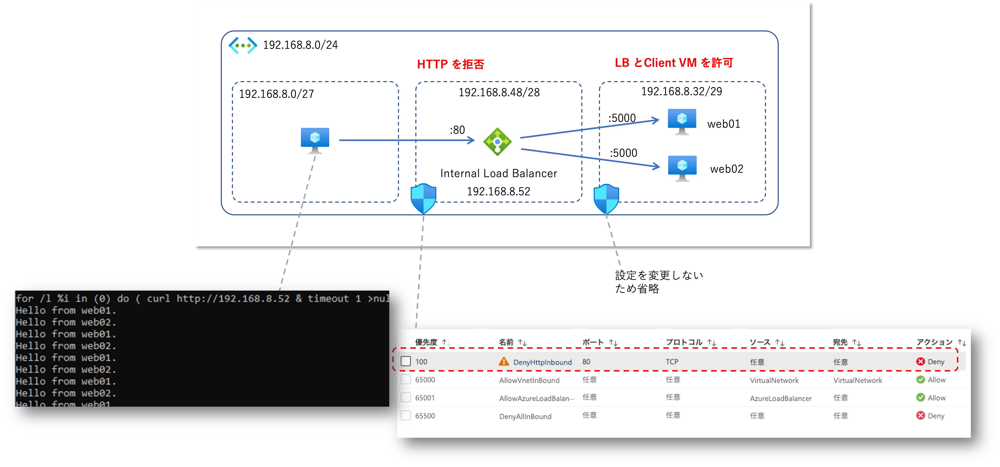

# はじめに

目新しい話では全くないのですが、直感的にわかりにくいなあと思っていた仕様について念の為検証してみました、という記事になります。

- 仮想ネットワークにサブネットを３つ作成
- 右のサブネットに Web サーバー用の仮想マシンを配置
- 中央のサブネットにロードバランサーを配置
- 左のサブネットにクライアント用の仮想マシンを配置

この構成の Web システムに対して「左のサブネットからしか接続を受け付けない」という接続元制限の要件があった場合、
中央のロードバランサーが設置されたサブネットに対して NSG : Network Security Group を設置したくなりませんか？

ところが [こちらのドキュメント](https://learn.microsoft.com/ja-jp/azure/virtual-network/network-security-groups-overview#azure-platform-considerations)
にあるとおり、右のサブネットにはロードバランサー（中央のサブネット）からではなく、クライアントの仮想マシン（左のサブネット）からパケットが飛んでくる、
つまりロードバランサーによって SNAT はされないということですね。

> 負荷分散プール内の仮想マシン:
> 適用されるソース ポートおよびアドレス範囲は、元のコンピューターからのもので、ロード バランサーではありません。 
> 宛先ポートとアドレス範囲は、ロード バランサーのものではなく、宛先コンピューターのものになります。

よって NSG による接続元制限に関しては以下のように設計する必要があります

- 右のサブネットに NSG を適用して、左のサブネットからの受信を許可しつつ、他からの接続を拒否する必要がある
- 右側サブネットの NSG で中央サブネットからの受信や、Load Balancer からの受信を許可しても意味がない
- 中央のサブネットに NSG を設置して、接続元の許可・拒否をしても効果ない

という内容を実際に試してみた、というお話です。
Azure IaaS に慣れ親しんでいる方であれば周知のことかもしれませんが、絵を描いてしまうと逆に分かりにくくなってしまうなあと思い、整理のために検証してみました。

# 実機検証

検証の準備として、以下の構成を実施しました。

- 右側の Web サーバー用の各仮想マシンには「自分のホスト名を返す」だけの Web アプリを設置し、Port 5000 で待機
- ２つの仮想マシンを Standard Load Balancer のバックエンドプールに追加し、Port 5000 への HTTP リクエストで正常性プローブを行う
- Standard Load Balancer のフロントエンド IP は中央のサブネットに配置
- フロントエンド IP アドレス の Port 80 のリクエストを、バックエンドプールの仮想マシンの Port 5000 に振り分ける負荷分散規則を作成

## 検証１ ： NSG　を設置しない

まずは負荷分散構成がちゃんと動いていることを確認するために NSG 無しで試します。
コレはまあ動作します。

Web サーバー側のログで接続元の Client IP アドレスを確認すると、以下の２つのクライアントからの HTTP Request が確認出来ます。

- 192.168.8.4  
    - これは左側のサブネットに配置したクライアント用の仮想マシンで、curl コマンドによる HTTP Request が記録されたものです。
- 168.63.129.16
    - こちらは Azure Load Balancer による正常性プローブですが、Load Balancer のフロントエンド IP が設置されたサブネットのアドレスではありません。
    - [プローブのソース IP アドレス](https://learn.microsoft.com/ja-jp/azure/load-balancer/load-balancer-custom-probe-overview#probe-source-ip-address)

## 検証2 ： 右のサブネットに NSG を設置し、Azure Load Balancer のみを許可する

今度は右のサブネットに NSG を設置し、Azure Load Balancer 以外からの通信を全て拒否してみます。
NSG は 優先度 65000 以降に既定のルールとして同じ VNET からの任意の通信を許可するルールが入っていますので、
それより優先度の高い 2048 で全ての通信を拒否し、優先度 1024 で Azure Load Balancer サービスタグだけを許可する構成とします。
これで Load Balancer からの通信は総て許可しているため、負荷分散できそうだと思いませんか？
（管理のため SSH の Port 22 も解放しています）

さて、フロントエンド IP が配置されている中央のサブネットには NSG による接続制御はかけていないのですが、クライアント側では curl が Load Balancer 192.168.8.52:80 に接続できずにエラーが発生していることがわかります。
また Web サーバーが配置されている右側のサブネットの NSG では Load Balancer からの任意の通信を許可しているのですが、こちらもログを確認すると 168.63.129.16 からの正常性プローブ以外の通信が確認出来ません。
まずここが直感的にわかりにくいポイントじゃないかと思います。

## 検証３ ： 右のサブネットの NSG でクライアント仮想マシンからの接続を許可する

それでは右のサブネットの NSG で「クライアント仮想マシンからの HTTP リクエストを許可」してみましょう。
ポイントは以下の２点です。

- ソース IP はクライアント VM の IP アドレス（192.168.8.4）
- 宛先は Web アプリが待機しているポート（5000）

右側の NSG でポートを解放すると、すでに正常性プローブが動作していたため Load Balancer による振り分けはすぐに成功し、正常に負荷分散し始めることがわかります。
ここまでの設定で一般的な要件は満たせていると思います。

## 検証４ ： 中央のサブネットの NSG で接続制限をかける

ところで中央の Load Balancer が配置されたサブネットに対して NSG による接続制限を掛けた場合はどうなるんでしょう？

コレもまた直感に反して通信が通ってしまうんですね。
NSG が仕事してないような気持ちで若干不安になってしまいます。

## Azure 仮想ネットワークの裏側

このあたりのカラクリは宇田先生の[サポート エンジニアが Azure Networking をじっくりたっぷり語りつくす会](https://www.slideshare.net/ShuheiUda/azure-networking-165852712)の資料が詳しいので、
こちらを読んでいただくとイメージが湧くかもしれません。
~~（詳しすぎて私には理解が追いつかない部分が多いのですが）~~

Azure Virtual Network には実体がなく、Azure 基盤の物理サーバー上で動作する VFP : Virtual Filtering Platform で仮想的に実現された SDN : Software Defined Network である、とのことです。
そして Azure Load Balancer や Network Security Group は VFP で実現された１機能に過ぎませんので、こちらも仮想アプライアンス製品のような「実体」があるわけではないということですね。

さて何を説明しているのか私にもよくわからないので、もう少しパケットの気持ちになって考えてみましょう。
上記資料の P19、20 にある図で考えるとわかりやすいと思います。
送信側では Load Balancer の設定が適用されたのち、カプセル化されて転送、受信側ではカプセル化解除ののち、Load Balancer の設定が適用され、NSG の設定が適用される流れになるわけです。

それでは前述の検証した構成に当てはめてみます。
（アンダーレイ側の処理の順番などの詳細までは正確ではないかもしれません）

- クライアントアプリ（Curl）は Load Balancer　のフロントエンド IP アドレス向けのリクエストを作成し、ゲスト OS のネットワーク機能を利用して送信される
- 宛先が Load Balancer のフロントエンド IP になっているため、負荷分散規則に基づいて送信先の Web サーバー仮想マシンが決定される
- パケットはクライアント側のホストでカプセル化される（この時ソースアドレスがクライアント仮想マシンのままで SNAT されない）
- Web サーバー仮想マシンのホストに転送されて、カプセル化が解除される
- Web サーバー仮想マシンに適用された NSG の受信規則が評価されパケットがフィルターされる
- 仮想マシン内の Web App に届けるためには、クライアント仮想マシンのアドレスから Web サーバー仮想マシンのポート 5000 宛てのパケットが許可されている必要がある
- HTTP リクエストヘッダーには Load Balancer のフロントエンド IP （ないしは FQDN）が記載されたまま、特に変更はされずに Web Appまで届く（L7 ロードバランサーではないため）

以上の挙動により、ロードバランサーのフロントエンド IP アドレスが設置されている中央サブネットの NSG がバイパスされているように見える、ということだと思います。

# まとめ

Azure Load Balancer や Network Security Group は仮想アプライアンスのような「実体」がなく、仮想ネットワーク内でパケットを転送する際のルールを定めただけのもの、と考えるとわかりやすいような気がします。
上記のような論理的な構成図を書くとシステム全体が俯瞰できて分かりやすいのですが、実際の挙動と直感がミスマッチを起こすという落とし穴があります。
私以外にも落とし穴にハマる方がいないことを祈りつつ、不幸にもハマってしまった方の参考になると良いなと思います。

## （補足）外部ロードバランサーの場合は NSG が必須

検証１で NSG 無しで動作確認を取っていますが、コレが動作するのは Public IP を持たない「内部ロードバランサー」を使用しているからです。
これが外部ロードバランサーの場合は NSG が必要になります。

- [Azure Load Balancer の概要](https://learn.microsoft.com/ja-jp/azure/load-balancer/load-balancer-overview#securebydefault)

> Standard Load Balancer と標準のパブリック IP アドレスは、ネットワーク セキュリティ グループによって開かれない限り、インバウンド接続に対して閉じられています。 
> NSG は、トラフィックを明示的に許可するために使用されます。 
> お使いの仮想マシン リソースのサブネットまたは NIC に NSG がない場合、トラフィックはこのリソースに到達することを許可されません。

- [Standard SKU の外部ロードバランサーで正常性プローブは成功するが、負荷分散ができない](https://jpaztech1.z11.web.core.windows.net/Azure%E3%83%AD%E3%83%BC%E3%83%89%E3%83%90%E3%83%A9%E3%83%B3%E3%82%B5%E3%83%BC%E5%88%A9%E7%94%A8%E6%99%82%E3%81%AE%E6%B3%A8%E6%84%8F%E7%82%B9.html#standardlb-nsg)

> Standard SKU の外部ロードバランサーでは NSG の受信規則によって、負荷分散用のポートを許可しない限り、トラフィックがホワイトリストとして登録されず負荷分散の通信が許可されません。

## 検証 1.5 : Azure Load Balancer　サービスタグを許可しなかった場合

検証１と２の狭間で右側のサブネットで Azure Load Balancer からの正常性プローブすら拒否していたタイミングがありました。
NSG の受信規則が複雑になってくるとこういうミスもやりがちではないでしょうか。
正常性プローブが通らなければバックエンドプールの仮想マシンはダウンしている状態と判断されますので、検証２で追加したように HTTP を解放していたとしても、負荷分散が行われません。
Load Balancer を経由せずに直接 Web サーバーへ Curl してみると動いているのですが、なぜ負荷分散が出来なくなったのかがわからず（設定ミスに気が付かず）時間を取られました。

プローブが HTTP であれば仮想マシン内に出力されているであろう 通常の Web サーバーのログ解析で確認できるのですが、プローブが HTTP ではなく TCP や UDP だと若干面倒な気がします。
ただ Azure プラットフォームがやってることなので、そちら側からも正常性プローブの成功・失敗が確認出来ます。
確認方法としては Azure Monitor メトリックになるのですが、下図のように「分析情報」をみると分かりやすいと思います。
ご参考まで。

