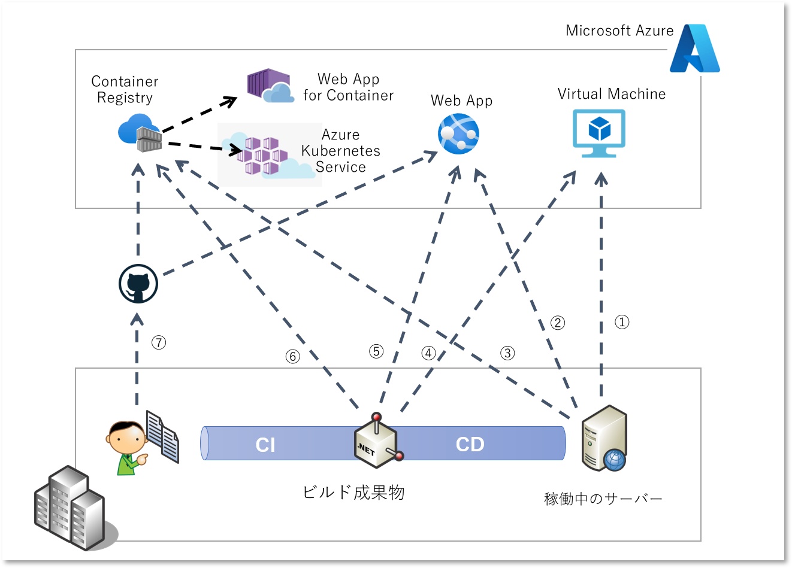
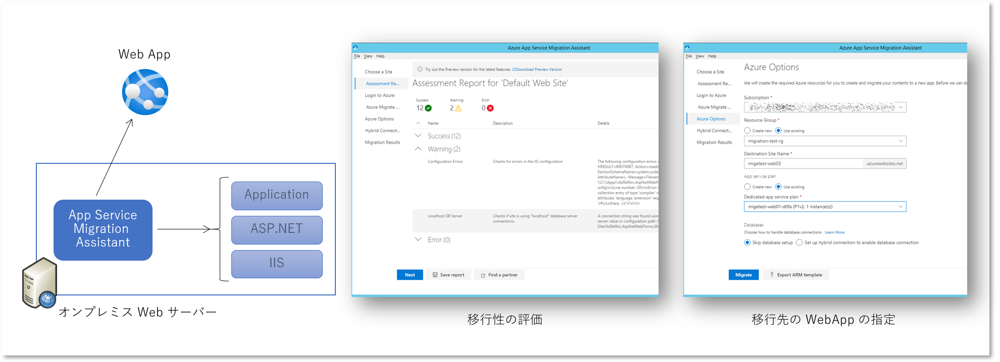

## はじめに

Microsoft Azure を扱うようになってそれなりの年月が経ち、非 Microsoft 系のテクノロジーにも多少は触れるようにはなってきましたが、それでもやはり最も多くの時間を過ごした .NET Framework や Windows には特別な思いがあります。
初代の .NET Framework 1.0 が 2002 年に登場し、そのアプリケーションが稼働する Windows Server も 2000, 2003, 2008 は既にサポート切れを迎え、2012 のサポートもこの記事を書いている 2 年後の 2023 年にはサポート切れを迎えます。
Windows Server 2012 上で動作する .NET アプリケーション、その多くは ASP.NET で作られた Web アプリケーションだと思いますが、次の稼働環境に移行していく必要があります。
新しいバージョンの Windows Server 2019 に移行してオンプレミス環境で保守を続ける、あるいは Azure など各種のクラウドサービスで動作する仮想マシンに移行して保守を続ける方もいるでしょう。
が、過去には .NET アプリの開発者としてお仕事をいただき、いま現在も Azure を扱う技術職としてはやはり Azure の PaaS サービスをお勧めしたいとバイアスばりばりの気持ちでいっぱいです。

じゃあどうやって PaaS に移行するのか？となると、実は答えは簡単ではありません。
何らかの移行を行うということは今後も保守を継続するビジネス上の理由があるということでしょうから、基本的には「移行先の PaaS に合わせた改修」をおすすめしています。
とはいえ、各種の設定やソフトウェアの導入が自由だった Windows Server に比べると、PaaS では様々な制約があるように感じられると思いますし、実際にできないことも多々ありますので改修は必須になります。
一方アプリケーションの作りによっては「無改修でもアッサリ動く」パターンも多いので、移行容易性を机上で判断するのは簡単ではありません。
対象アプリケーションのアーキテクチャに精通し、また移行先の PaaS にも精通した技術者が判定していく、というのが理想ではあるのですが、現実的にはそうもいかないですよね。

さてどうしましょう。

## 移行ツールを使ってみよう

１つおすすめできるアプローチは「あまり手間暇をかけずにサクッとテスト移行してみて動作確認する」です。
アプリの保守をされている技術者さんであれば、Azure には詳しくなくともとりあえず動作確認するだけであればそこまで難しくもありません。
移行してみるといろいろエラーも出るわけですが、それがどんなエラーなのか？その改修に手間やコストがかかりそうか？を判断するのは保守担当者ならではの知見でしょう。
逆にクラウド技術のような汎用的な知識は調査もしやすいですし、サポートに問い合わせてもよいわけです。

つまり既存のアプリ資源を用いて「移行作業を素早く簡単にできる」のがポイントで、そのための移行ツールというのが用意されています。
移行ツールを使って取り合えず Azure 上で動作させてみて、移行計画の立案のための下調べをする、ということになりますね。
この作業効率はアプリケーションの数が多くなればなるほど、Try & Error を繰り返すほどに重要になってくるでしょう。

前置きが長すぎますね。

## 移行パスを整理しよう

クラウドへのアプリケーション移行ツールは 3rd Party 製品も含め世の中には様々なものがあると思いますが、.NET Framework および Azure の提供元である Microsoft からもいくつか提供されています。
ではこれらの MS 謹製の移行ツールのご紹介、の前に、そもそも移行ツールにもいくつかのパターンがありますので、ちょっと整理しておきましょう。



1. 稼働中のサーバーから仮想マシンへ
    - PaaS への移行をお勧めする記事なのでこれは除外します。
    - いわゆる Lift & Shift ということになりますが、別にダメな選択肢というわけではありません。
1. 稼働中のサーバーから PaaS (Azure Web Apps) へ
    - この後で紹介する [Azure App Service Migration Assistant](https://azure.microsoft.com/ja-jp/services/app-service/migration-assistant/) がこのパターンに該当します。
    - これは実際に動作している環境に配置されている成果物とまったく同じものを使用するだけでなく、ツールが稼働環境の構成情報も参照できるため [Azure Web App](https://docs.microsoft.com/ja-jp/azure/app-service/overview) の構築もしてくれるというのがポイントです。
1. 稼働中のサーバーから資源をコンテナ化して CaaS へ
    - この後で紹介する [Azure Migrate: App Containerizatioin](https://docs.microsoft.com/ja-jp/azure/migrate/tutorial-app-containerization-aspnet-kubernetes) がこのパターンに該当します。
    - こちらも実稼働成果物を利用しつつ、動作環境の構成情報を基にして Dockerfile や Deployment.yaml までツールが用意してくれるというのがポイントです。
    - 移行先の [Azure Kubernetes Service](https://azure.microsoft.com/ja-jp/services/kubernetes-service/#overview) や [Web App for Container](https://docs.microsoft.com/ja-jp/azure/app-service/quickstart-custom-container?tabs=dotnet&pivots=container-windows) を作る手助けもしてくれます。
1. ビルド成果物をもとに仮想マシンを構築
    - PaaS への移行をお勧めする記事なのでこれも除外します。
    - 現行のパイプラインから出力される成果物を再利用しますが、、サーバーを構成する手間はかかりますので「サクッと」感は弱まります。
1. ビルド成果物を PaaS (Azure Web Apps) へ配置する
    - 対象が ASP.NET アプリケーションで、ある程度 Web App に習熟されている技術者であればこれも非常に簡単な選択肢です。
    - Web App さえ作成してしまえば IIS と ASP.NET がインストール済みの環境が出来上がるので、あとは DLL などのビルド成果物をコピーしてやればよいのです
    - が、移行ツールを使う前提が覆ってしまうのでこれも割愛します。
1. ビルド成果物をコンテナ化して CaaS へ配置する
    - これは Dockerfile などのコンテナ技術だけでなく、Deployment.yaml やストレージドライバーなどといったような各種の Kubernetes のスキルを要求されますので、それなりの技術力と手間を必要とします
    - こちらも「サクッと」感は弱まりますので本記事からは割愛します。
1. ソースコード管理と CI/CD パイプラインをクラウド移行
    - 保守の環境と方式そのものを書き換えることになるわけですから、「サクッと」感が完全に失われますので除外します。

上記はあくまでも移行容易性を評価することを目的として「あまり手間暇をかけずにサクッとテスト移行」することで動作確認作業を簡単にすることを主眼に置いて整理しています。
評価の結果として移行先が定まれば、最終的な移行方式としては⑦をお勧めすることが多いですし、技術的な難易度や予算とスケジュールの兼ね合いからやっぱり PaaS ではなく IaaS で、となるパターンも現実には多くあります。
また理由は後述しますが（Microsoft の偉い人には怒られそうなのですが）この後で紹介する移行ツールは「本格的な移行」には正直あまりおススメできません。


## Azure App Service Migration Assistant を使用した Web アプリの移行作業

このツールは [こちらからダウンロード](https://azure.microsoft.com/ja-jp/services/app-service/migration-assistant/) したものを動作環境にインストールして使用します。
本番環境にソフトウェアを追加インストールするのはあまり好ましくはないでしょうから、開発環境やテスト環境といったような比較的リスクの小さい環境にインストールするとよいでしょう。



ツールをインストールしたあとは比較的簡単で、基本的に画面の指示に従っていくことになります。

- Choose a Site
    - インストール先のマシンローカルで動作する IIS のサイトがリストアップされます
    - リモートマシンは対象にできませんので、各アプリが配置された Web サーバーにインストールして実行する必要があります
    - Web ファーム構成などが組まれている場合には全サーバーが同じ構成のはずなので、そのうち一台だけでよいでしょう
- Assesment Report for 'Web Site Name'
    - 移行を阻害することの多い [14 項目のチェックリスト](https://github.com/Azure/App-Service-Migration-Assistant/wiki/Readiness-Checks) を基に、構成情報などから移行性チェックと修正案が提示されます
    - レポートをローカルに保存しておくことも可能です
- Login to Azure
    - ここで Azure にログインしたアカウントを使用して、後述の Web App の構築やアプリの配置などの操作が行われます。
    - 十分な Azure へのアクセス権（RBAC）が割り当てられたアカウントを利用しましょう
- Azure Migrate Hub
    - アセスメント結果のデータは Azure Migrate サービスにアップロードしてクラウド側に保持させることも可能です（オプション）
    - 多数のアプリの評価、あるいはサーバー移行や DB 移行のアセスメントなどがある場合には一元管理しておくとよいでしょう
- Azure Options
    - この画面でアプリ資源を配置する Web App を構築することができます。
    - 機能的な移行容易性を評価するだけであれば大規模なスペックとサイトである必要はないと思うので、App Service Plan は１つ作ったら使いまわしでよいでしょう
    - Web App 自体は必ず新規に作ることになるので、先行して移行した Web App を潰してしまう心配はありません
- Hybrid Connection
    - 多くの ASP.NET Web アプリはバックエンドに SQL Server を使用しているでしょうから、Azure Web App に乗せ換えた途端に接続経路を失うことになり、まともに動作するわけがありません
    - 基本的には別途 SQL Database を構築することをお勧めします（具体的には後述）
    - ここでは[Hybrid Connection](https://docs.microsoft.com/ja-jp/azure/app-service/app-service-hybrid-connections)を構成してオンプレネットワーク内のデータベースに接続することも可能です（が、あまり使わないんじゃないかと思います）
- Migration Result
    - 移行が完了すると Web App にアプリケーションが配置されてアクセス可能になります
    
移行作業自体はこれで終わりですが、前述の通り別途データベースを移行しておく必要がありますし、web.config に記載された接続文字列の書き換えも必要になるでしょう。

### Web.config に記載された環境依存設定の書き換え

一般的な ASP.NET Web アプリケーションであれば構成ファイル (Web.config) には SQL Server への接続文字列などの、実行環境固有の設定値が記載されていることでしょう。
アプリケーションが Azure Web App で動くのであれば、これらの設定のいくつかは書き換えが必要なはずです。

```xml
<configuration>
  <appSettings>
    <add key="setting1" value="hogehogehoge"/>
  </appSettings>
  <connectionStrings>
    <add name="constr1" 
         connectionString="Data Source=onpremise-dbserver;Initial Catalog=pubs;Persist Security Info=True;User ID=sa;Password=password1!"
         providerName="System.Data.SqlClient" />
  </connectionStrings>
  <!-- 移行省略 -->
</configuration>
```

Web App 上に配置された Web.config ファイル自体を直接書き換えてもいいのですが、Azure Web App の設定値で[上書きしてやることも可能です](https://docs.microsoft.com/ja-jp/azure/app-service/configure-common)。
Azure Portal で `appSetting の key` や `connectionStrings の name` と一致する設定情報を指定してあげてください。

## Database Migration Assistant

T.B.D


## 補足

### App Service Migration Assistant を本格移行にはおススメしない理由

クラウド移行の後にアプリケーションの保守・運用が続くのであれば（続くからこそ移行するのだと思いますが）、いつかはどこかのタイミングでバグ修正や機能追加などが行われるでしょう。
しかし、その時まで「App Service Migration Assistant がインストールされたオンプレの Web サーバー」は保守・運用されているでしょうか？
アプリケーションのクラウドへの配置を App Service Migration Assistant に依存してしまうと、このサーバーが捨てられなくなってしまいます。
開発生産性の向上や保守・運用コストの削減などを目的として PaaS が採用されることが多いのですが、その保守・運用のためにオンプレの古いサーバーが必要というのはさすがにナンセンスでしょう。

以上の理由から App Service Migration Assistant の利用はアセスメントおよび移行性評価のツールとしてご利用いただき、「Web App に移行するぞ」となったらアプリケーションの改修と並行して、[アプリケーションのデプロイメント方式も Azure Web App に対応](https://docs.microsoft.com/ja-jp/azure/app-service/deploy-run-package)いただくことをおススメします。


### Azure Migrate との関係

T.B.D


