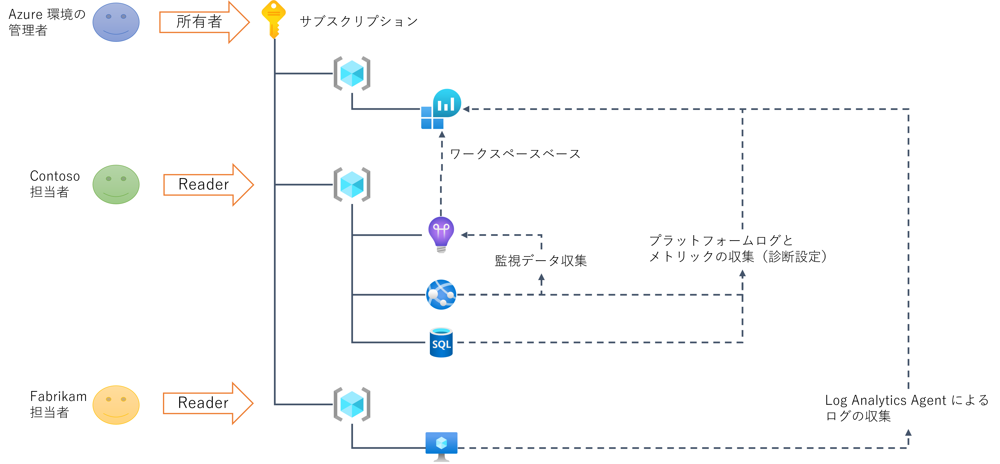
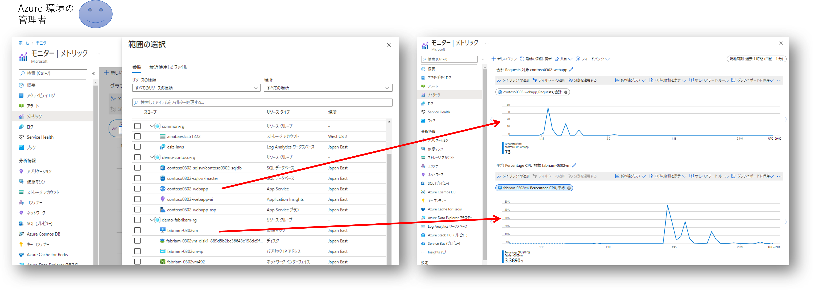
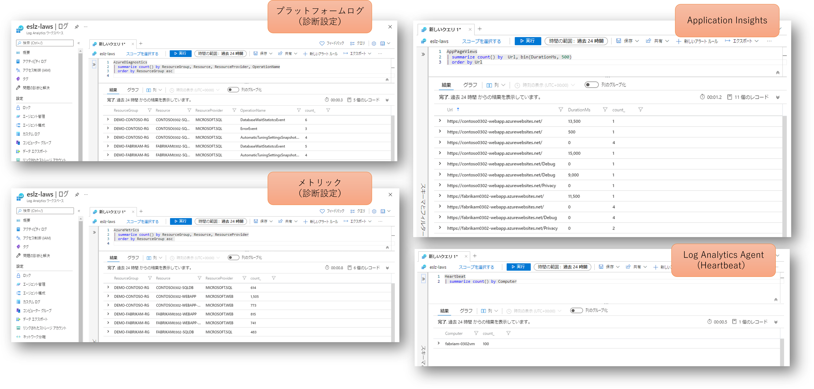
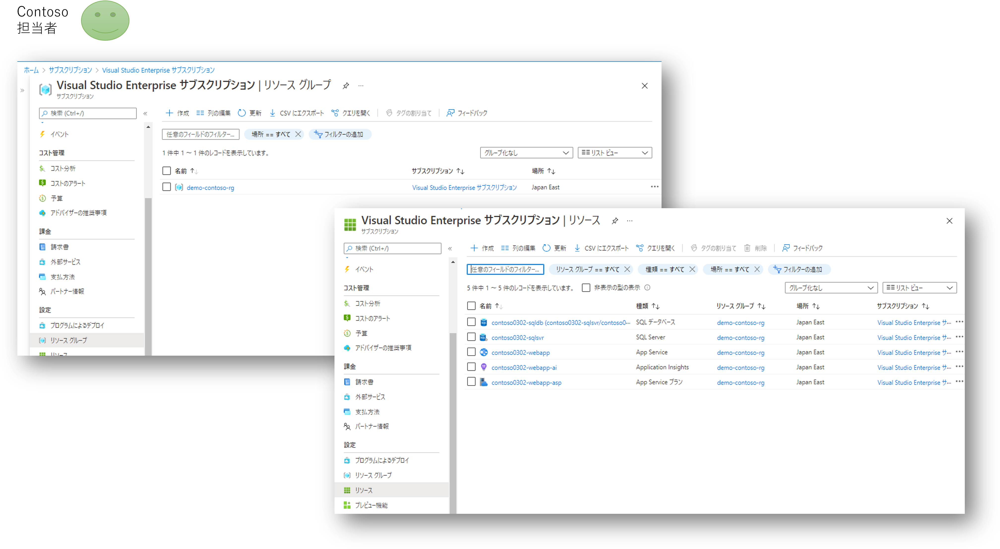
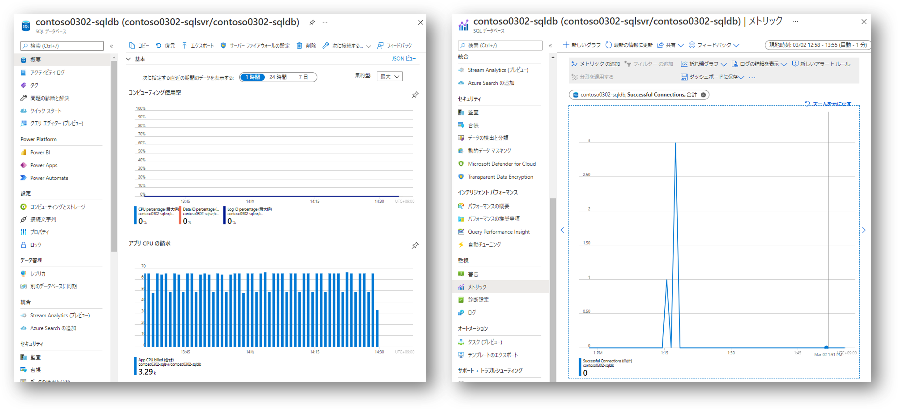
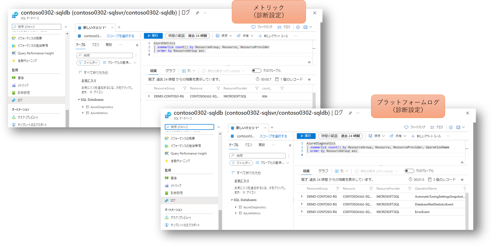
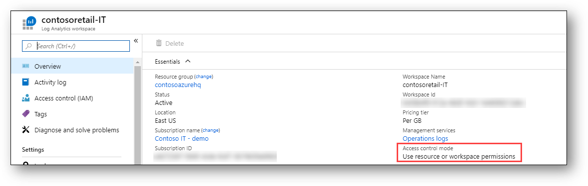

## はじめに

ある１つの組織内で Azure の活用が進んでいくと、多数のシステムが構築・運用されるようになり、各システムにおける多種多様な役割の担当者のアクセスの制御が重要になってきます。
アクセス制御の方針は様々考えられますが、割とよく見られるのが単一のサブスクリプション内部をリソースグループで分割し、各担当者のアクセス可能な範囲を絞り込むアプローチです。

各システムの担当者、特に運用に関わるユーザーは、当該システムに関わるリソースが参照できなければ話になりません。
このため一部のリソースグループに対して Azure RBAC の[閲覧者（reader）](https://docs.microsoft.com/ja-jp/azure/role-based-access-control/built-in-roles#reader)ロールを割り当てられることが多くなります。
下の図の緑や黄色のユーザーのようなイメージです。



さてこれらの各システムレベルのユーザーが運用担当者だとすると、各種ログや性能データも参照したいわけですが、
現状割り当てられてるロールの権限でどこまでできるのか？追加のロールを割り当ててもらう必要があるのか？あるいはサブスクリプション全体にアクセス権を持つ管理者にお伺いを立てなければいけないのでしょうか？

実際に運用レベルのことを考えるとカスタムロールを定義したり、ロールの割り当て粒度を工夫したり、といろいろ難しいことをやりたくなるのですが、まずはデフォルトの挙動を把握しておきたいなと思って検証してみた次第です。

構築する環境はいろいろバリエーションが考えられるのですが、ここではシステム固有のリソースのログやメトリックを１つの Log Analytics ワークスペースに集約する設計にしています。
これは Log Analytics ワークスペースを~~リソースグループ単位に分離してしまうと検証としては面白くもなんともない~~
集約しておくことで各種監査を可能にし、複数ワークスペースにデータが重複することによるコストの増大を避けるためです。

## まずは管理者視点で見てみる

いきなり本題に入る前に「なんでも見えて出来てしまう」管理者視点を確認してみましょう。
アクセス権を絞られたユーザーで試してしまうと、見えてるものが正しいのか、見えてないものがあるのか、設定が間違っているのかが全くわかりません。
まずは正解を確認しておきましょう。

### 全てのメトリックが見えるはず

管理者であればサブスクリプションに含まれるすべてのリソースに対して全ての操作が可能ですので、下記の様な結果になります。



当たり前といえば当たり前ですね。
しかし逆に言えばこの万能さが仇になり、各システムの担当者からは「僕の権限ではコレできないから、管理者の方でやってよ！」と言われてしまうわけです。

### 全てのログが見えるはず

共用の Log Analytics ワークスペースには Application Insights のデータや各リソースの診断設定によってエクスポートされたリソースログやメトリックが集約されています。
このため管理者この全ログデータに対してクエリが可能ということになります。




## 各システムの運用担当者は何が見える？

さて特定のリソースグループに対する閲覧者ロールのみを割り当てられたユーザーでサインインしなおして環境を確認してみましょう。
こちらも当たり前といえば当たり前ですが、他のリソースグループやリソースは参照すらできないわけです。




### 必要なメトリックはちゃんと見える

ではメトリックはどうでしょうか？
結論から行ってしまえば、見えている範囲のリソースのメトリックは確認可能です。
概要メニューで用意されているグラフも、メトリックエクスプローラーでピックアップして参照することも可能です。



そもそもこのシステムの運用担当者は当該リソースグループに対して閲覧者ロールを割り当てられています。
この閲覧者ロールというのは ```*/read``` という操作を許可されていますので、リソースグループに含まれる各リソースに対する読み取り権限だけではなく、メトリックの参照に必要な下記の操作も許可されていることになります。
つまりメトリックが見えるのは期待された挙動と言えます。

|Operation|Description|
|---|---|
|Microsoft.Insights/MetricDefinitions/Read|メトリック定義 (リソースの使用可能なメトリックの種類の一覧) を読み取ります。|
|Microsoft.Insights/Metrics/Read|リソースのメトリックを読み取ります。|

ちなみに Docs によれば監視 **のみ** を担当するユーザーであれば[監視閲覧者（Monitoring Reader）](https://docs.microsoft.com/ja-jp/azure/azure-monitor/roles-permissions-security)のロールを割り当てれば良いということになっています。
この[監視閲覧者のロール定義](https://docs.microsoft.com/ja-jp/azure/role-based-access-control/built-in-roles#monitoring-reader)によれば、Actions が以下のようになっていますので実質的には閲覧者ロールの上位権限と言えます。

|Actions|Description|
|---|---|
|*/read|機密データを除くあらゆる種類のリソースの読み取り|
|Microsoft.OperationalInsights/workspaces/search/action|検索クエリを実行します。|
|Microsoft.Support|サポート チケットの作成と更新|

### 実はログも見える

さて前述の設定では緑や黄色のユーザーはログの転送先である Log Analytics ワークスペースにはアクセス権を付与されていません。
当然リソース一覧にも出てこないわけですが、各リソースの画面にある「ログ」のメニューを使用してクエリを実行することが可能です。
下記は SQL Database のメニューから実行しているためスコープが SQL Database に絞られていますが、こちらを Web App に切り替えるか、あるいは Web App のメニュー経由で同様に「ログ」を開けばクエリをかけることが可能です。



さて、これはどういうことでしょう、見えちゃっていいんでしょうか？
より正確には Log Analytics のアクセス制御モードが「リソースまたはワークスペースのアクセス許可を使用する」ようになっていれば
上記の様な操作が可能です。
各リソースの「ログ」メニューからアクセスするのを「リソース コンテキスト モード」と呼ぶのですが、
この操作においては各ログに対する読み取り許可は、そのログを出力したリソースの読み取り権限を参照するようになります。
つまりリソースに対して閲覧権限を持っていれば、ログも見ることができる、ということになります。



なお最初に正解を確認した管理者は Log Analytics ワークスペースのメニューからアクセスしていますので、Log Analytics ワークスペースそのものに割り当てられた RBAC ロール（このケースでは所有者）を参照していることになります。

詳細は [Azure Monitor ログのデプロイの設計](https://docs.microsoft.com/ja-jp/azure/azure-monitor/logs/design-logs-deployment) をご参照ください。


## まとめ

アクセス制御の基本は「最小特権の原則」ですが、とにかくきつくすれば良いというものでもないと考えます。
きつくすればするほどセキュリティは高まるのかもしれませんが、運用容易性や保守性などがトレードオフになる傾向にあり、そのバランスが重要です。
そもそも「何を持って最小とするか？」は各システムとリソースの特性、組織のセキュリティポリシー、関係者の役割分担、外部パートナーとの契約、本番環境か開発環境か、など様々な要因によって決定されます。

さて、各システムの運用担当者にとって対象リソースの閲覧およびそのログやメトリックの閲覧は「必要十分」でしょうか？過不足があるでしょうか？
この答えは運用設計として見出す必要があり、１つの答えがあるものでもないと思います。
というわけで、まずは基本の挙動を把握して置くべきかなということでドキュメント化してみました。
皆様のご参考になれば幸いです。
