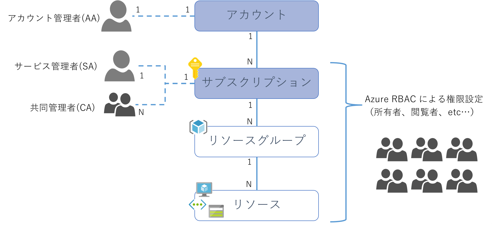
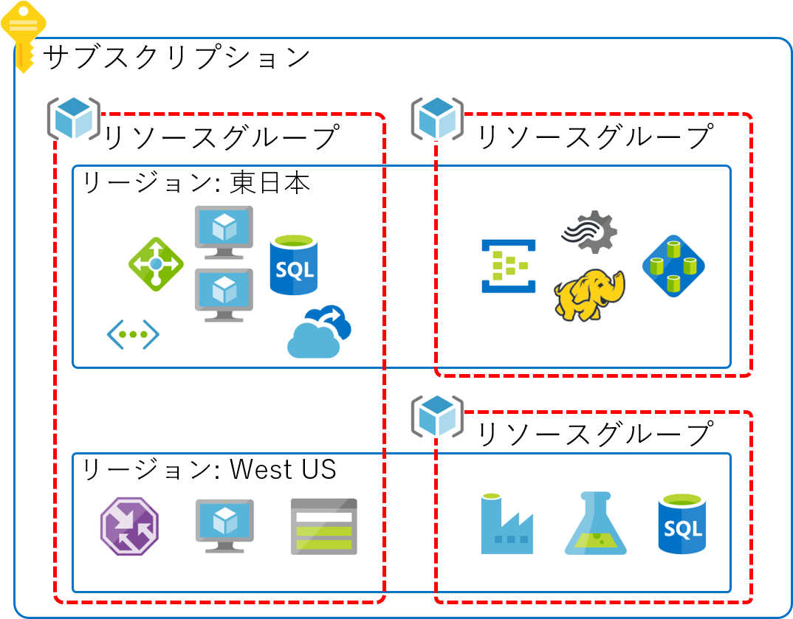
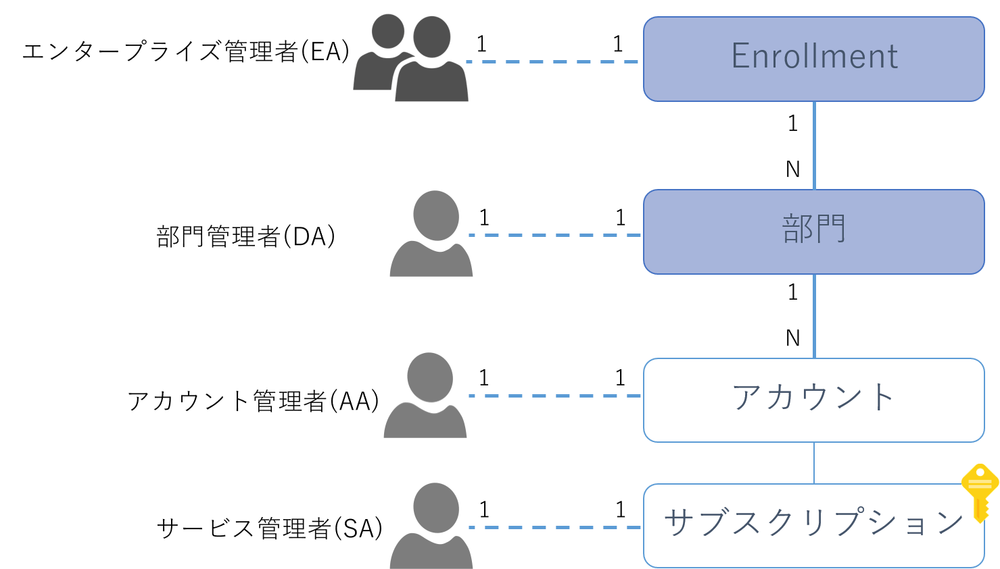
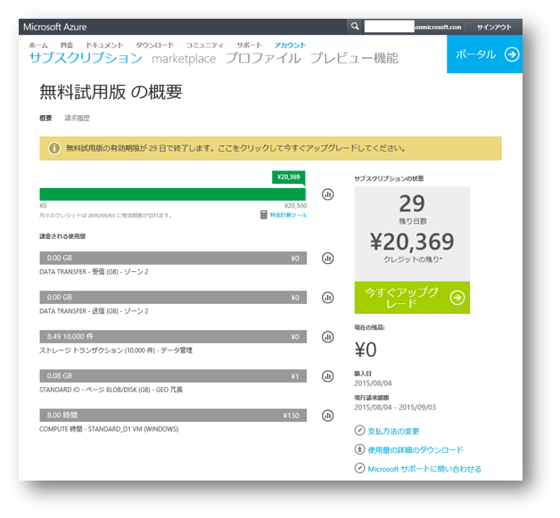
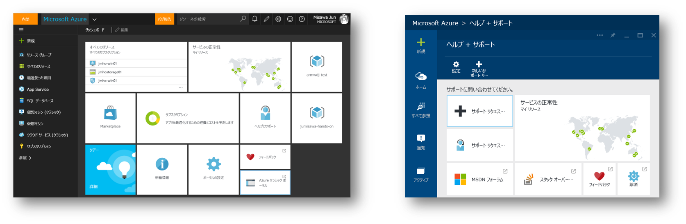
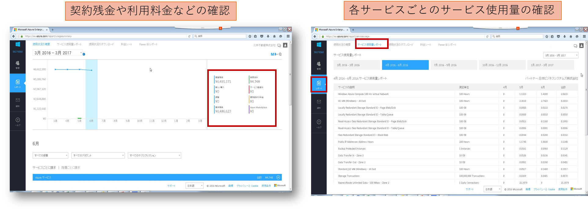
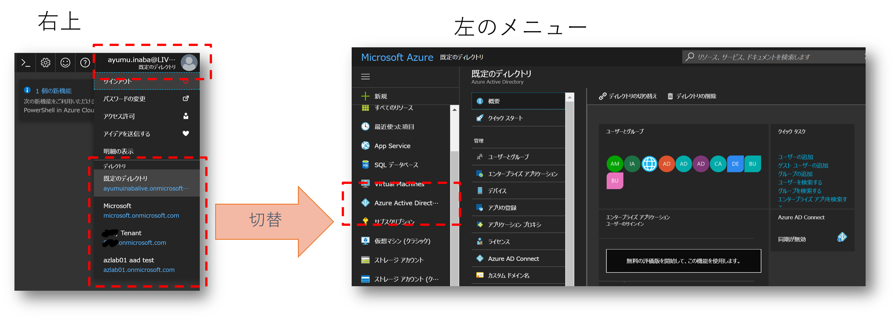
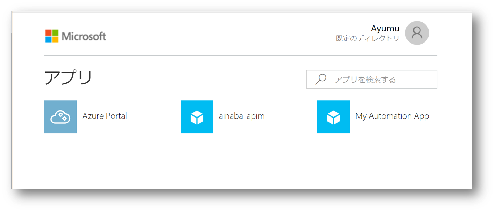

# Azure 関連ポータルまとめ

Azure にはポータルがいくつか用意されており、その用途を理解して使い分けていただく必要があります。
ただ適切に使い分けるためには Azure における管理概念の知識も必要になりますので、そちらも併せてご紹介したいと思います。

## Azure の管理概念

Azure には ASM（v1, クラシック) と ARM (v2) と呼ばれる 2 つの管理方式がありますが、現在主流となっている後者の ARM : Azure Resource Manager では以下のような管理単位が存在します。

Azure で提供される IaaS や PaaS は Web App、データベース、ストレージ、ネットワーク、仮想マシン、といったようなリソース（ないしはその複合体）として提供されます。
またこれらのリソースを束ねて管理するためのリソースグループという管理単位も存在します。

Azure のご利用を EA : Enterprise Agreement でご契約いただいた場合には、前述の「アカウント」より上位の管理単位が追加されます

## ポータルの種類と使い分け

以降では各管理単位の概要と、それらを管理するための利用するポータルについて紹介していきます。

### Azure サブスクリプションの管理

Azure を初めて利用する（サインアップ）したユーザーはアカウント管理者となり、
[アカウントポータル](https://account.azure.com/subscriptions)
にアクセスすることが可能になります。
このポータルでは （Azure を使用したシステムの構築や管理ではなく）新規サブスクリプションの作成や停止、名前の変更、利用状況の管理、支払い方法の変更、サブスクリプションの譲渡、サービス管理者や共同管理者の任命といった管理操作が可能です。
サービス管理者や共同管理者はアカウントポータルにはアクセスできません。あくまでもアカウント管理者専用のポータルになります。

### Azure リソースの管理

アカウント管理者から任命されたサービス管理者や共同管理者は 
[Azure ポータル](https://portal.azure.com)
にアクセスすることが出来るようになり、実際にリソースやリソースグループの管理操作を行います。

サブスクリプションに設定されたクォータの増加、利用可能リージョンの拡大、各種お問い合わせ、といった Azure サポートとの連絡もこのポータルから行うことが可能です。
また Microsoft からの通知、障害時のアラートの確認でもこのポータルを利用します。

### エンタープライズ加入契約の場合

加入契約の際に指定した管理ユーザーであるエンタープライズ管理者は 
[EA ポータル](https://ea.azure.com)
にアクセスして、同じくエンタープライズ管理者の追加、部門作成およびその管理者の指定、アカウント作成およびその管理者の指定などを行うことが出来ます。
ここで指定されたその他の各管理者も EA ポータルにアクセスできるようになり、エンタープライズ管理者の設定に応じて料金の確認等ができるようになります。

なおEA 契約の場合はアカウント管理者は自らサインアップするのではなく、上位の管理者から指定されることでアカウントポータルにアクセスできるようになります。
また料金の支払いや利用状況に関しては EA 契約全体で取りまとめることになり、アカウントポータルでは支払い方法の変更などはできなくなります。

### Azure Active Directory ユーザやアプリの管理

Azure AD 上でのユーザーやアプリの管理に対しても 
[Azure ポータル](https://portal.azure.com)
を使用します。
Azure ポータルにサインインすると画面右上にユーザーが ID とアイコンが表示されるのですが、そちらをクリックするとその ID が所属するディレクトリ、ないしはアクセス可能なディレクトリが表示されます。
ここでディレクトリを選択することで管理対象とする Azure AD を切り替えることができますので、左側のメニューから Azure Active Directory を選択するとユーザーやアプリの管理操作が可能です。

### アプリケーション利用者のためのポータル

Azure を管理するためのポータルとは若干異なりますが、Azure AD に登録されたユーザーは 
[MyApps ポータル](https://myapps.microsoft.com/)
にアクセスできるようになります。

ユーザー自身が利用可能なアプリにアクセスするためのメニューとして、あるいは当該アプリを始めて利用する際に同意したアクセス許可の確認と削除に利用することが可能です。
また自分のプロフィールの確認、所属するグループの管理、パスワードの変更なども行うことができます。

### クラシックポータル

2014 年に ARM が登場する以前は ASM : Azure Service Manager と呼ばれるデプロイメントモードが使われており、ポータルも（Azure ポータルではなく）
[クラシックポータル](https://manage.windowsazure.com)
が利用されていました。
ARM が登場して区別のために明示的に ASM やクラシックと呼ぶようになったわけで、当時からこの名前で呼ばれていたわけでは無いですが。
なお現在は ASM ではなく ARM の利用が推奨されており、本記事執筆時点でクラシックポータルは廃止されておりますのでご参考まで。

## まとめ

以上で紹介した５つのポータルをまとめると以下のようになります。

|ポータル     |   URL         | 主なユーザー      | 主な用途  |
|:---|:---|:---|:---
|EA ポータル        |https://ea.azure.com       |Enterprise 契約の管理、部門・組織レベルでの Azure 利用を管理する立場の方、アカウントオーナー   |部門やアカウントの作成、およびその管理者の任命、全体の利用状況の管理など
|アカウントポータル |https://account.azure.com/subscriptions  |アカウントオーナー（サブスクリプションの所有者）   |サブスクリプションの作成、停止、サービス管理者の任命、課金や支払い方法の管理など
|Azure ポータル     |https://potal.azure.com    |サービス管理者、共同管理者、RBAC によってアクセス権を与えられた開発者  |Azure で提供される IaaS/PaaS を利用するシステム・サービスの構築、監視、運用, Azure AD 上のユーザーやアプリの管理操作など
|MyApps ポータル    |https://myapps.microsoft.com   |Azure AD で認証を受ける全てのユーザー  |ユーザー自身のパスワード管理、利用可能なアプリケーションの管理
|クラシックポータル |https://manage.windowsazure.com    |サービス管理者、共同管理者     |（廃止）

## 参考情報

- [Azure Resource Manager とクラシック デプロイ: デプロイ モデルとリソースの状態について](https://docs.microsoft.com/ja-jp/azure/azure-resource-manager/resource-manager-deployment-model)
- [Azure サブスクリプションと Azure AD の管理者](https://blogs.technet.microsoft.com/jpazureid/2017/11/04/azure-subscription-azuread-admin/)

