## はじめに

Windows 系の技術者が Azure を自動操作をする際の第一の選択肢である
[Azure PowerShell](https://docs.microsoft.com/ja-jp/powershell/azure/overview)
ですが、悩みどころはその実行に使用する Identity です。
対話型の操作であれば `Connect-AzAccount` を使用して普段から使用しているユーザー ID で Azure Active Directory に
サインインすれば良いだけですが、自動実行となるとそうは行きません。
このためのユーザー ID に変わるものとして
[サービスプリンシパル](https://docs.microsoft.com/ja-jp/azure/active-directory/develop/howto-create-service-principal-portal)
を使用するのですが、現在はそのサービスプリンシパルの取得方法にいくつか種類があります。

## サービスプリンシパルを直接使用する方法

まずは従来からある、Azure Active Directory にアプリケーションを登録してサービスプリンシパルを利用する方法です。
この方法はユーザーと同じようにアプリケーションがそのIDとパスワード（あるいは証明書）を使用してサインインするため直感的にわかりやすく、
かつ、任意の場所で実行できるというのがメリットです。
その反面、パスワードや証明書の管理が面倒であり、そのためにコードが若干複雑になることがデメリットと言えるでしょうか。

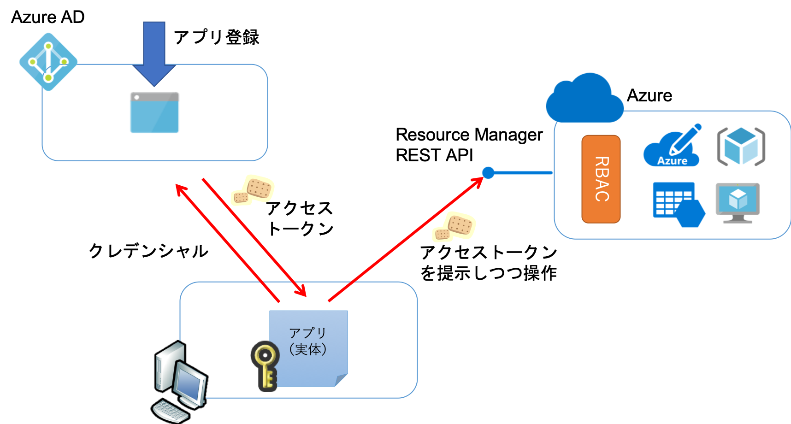

### アプリケーションを登録する

はじめに Azure Portal の Azure Active Directory の管理画面からアプリケーションを登録します。
アプリケーションの名前は何らかわかりやすいものをつけてください。
リダイレクトURLは特に使用しないので適当なものを入力しても問題ありません。

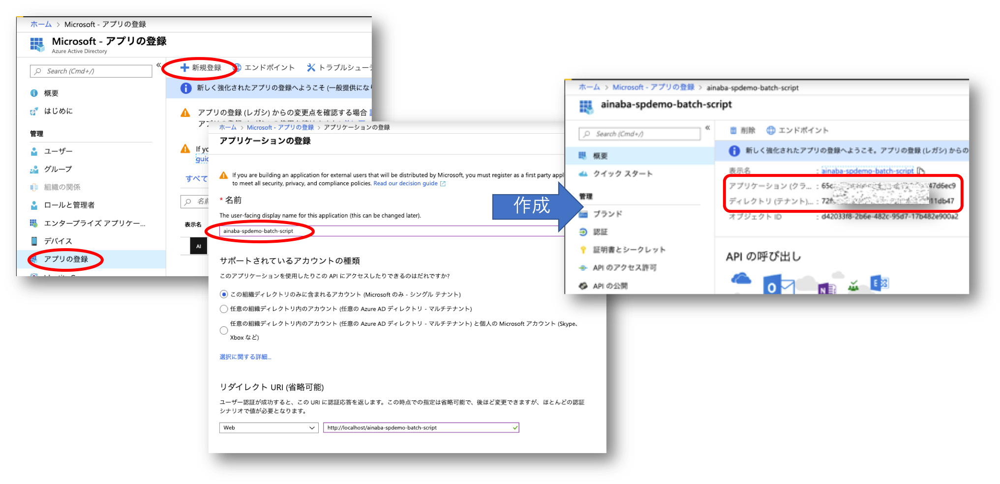

アプリケーションが登録されると概要画面からアプリケーションID（クライアントID）とディレクトリID（テナントID）が確認できますので、
これを控えておきます。

```powershell
PS> $clientid = "guid of client id"
PS> $tenantid = "guid of tenant id"
```

### シークレットを発行する

先ほど登録したアプリケーション自体が（ユーザーと同様に）Azure AD にサインインする際に使用する
（パスワードに相当する）クライアントシークレットを作成します。

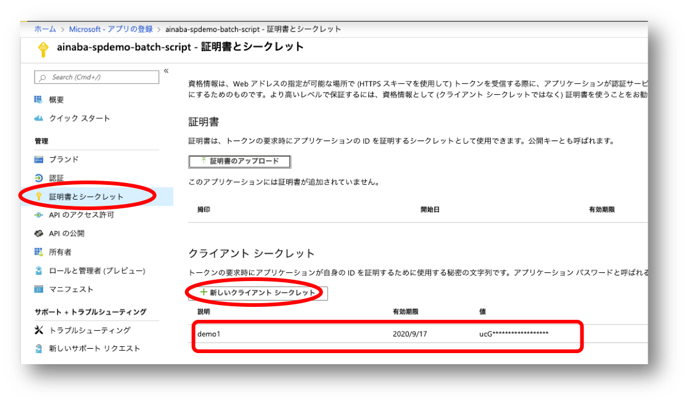

このシークレットは作成時にしか表示されない（＝あとで復元できない）ので必ず控えておきましょう。
もし紛失した場合は別のシークレットを作成してください。

```powershell
PS> $password = "secret string generated by portal"
```

### RBAC を使用してサービスプリンシパルに対して必要なリソースへのアクセス権限を与える

以上で必要な情報が集まりましたが、これだけでは Azure AD にサインインできるだけですので、
自動化したい内容に応じて必要最小限のスコープ（リソース、リソースグループ、サブスクリプション）に対して、
必要最小限の権限（ロール）を付与します。

下記はある仮想ネットワークに対して共同作成者ロールを割り当てている例です。
権限を割り当てられた対象がアプリとなっています。

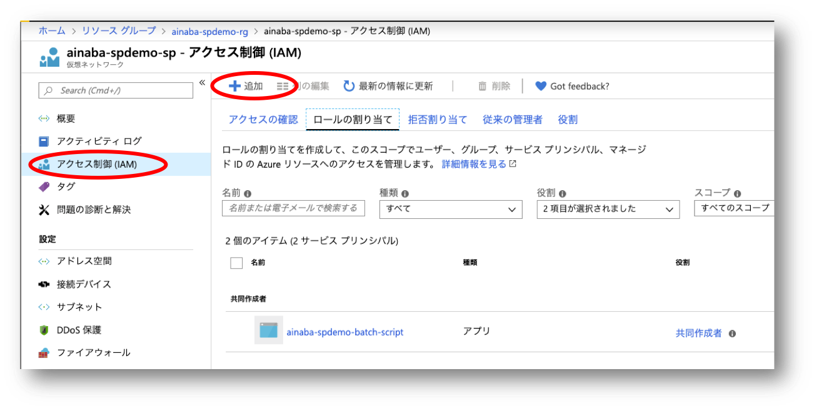

### Azure PowerShell を使用して接続する

以上で必要な事前準備が完了したので `Connect-AzAccount` を `-ServicePrincipal` オプションを使用して実行します。

```powershell
PS> ＃認証キャッシュのクリア
PS> Clear-AzContext -Force
PS>
PS> ＃認証情報の構築
PS> $securepassword = ConvertTo-SecureString $password -AsPlainText -Force
PS> $credential = New-Object System.Management.Automation.PSCredential($clientid, $securepassword)
PS>
PS> ＃Azure へ接続
PS> Connect-AzAccount -ServicePrincipal -Credential $pscred -Tenant $tenantid
PS>
PS> ＃自動化したい処理を実行
PS> Get-AzResource
PS>
PS> ＃実行結果として RBAC によって明示的にアクセス権を付与したリソース（この場合はVNET）だけが表示されるはず
```

### 留意事項

前述のコード例ではシークレットを変数としてスクリプトファイル（この場合は ps1 ）に直書きしてしまっていますが、
当然これは情報漏洩に繋がりやすく絶対にやってはいけない実装です。
まかり間違ってもこのままソースコード管理システムに登録したりしないようにしましょう。
スクリプトのパラメタ化する（ジョブスケジューラから渡す）、環境変数から読みだすようにする、などスクリプト外部に保存するのが定番ですが、
これが面倒かつリスキーな実装になりやすいので、
後述の [Azure AD Managed Identity](https://docs.microsoft.com/ja-jp/azure/active-directory/managed-identities-azure-resources/)  が提供されるようになりました。
オンプレミス環境やAzure外部でスクリプトを実行する場合にはサービスプリンシパルを使用せざるを得ないのですが、
Azure 環境で実行する場合には極力 Managed Identity の利用をお勧めします。

## システム割り当てマネージド ID

マネージド ID は大雑把に言えば「特定の Azure リソース内部からのみ取得できるサービスプリンシパル」です。
スクリプトが Azure 仮想マシンのようなマネージド ID が割り当てられた環境の内部で動作する時のみ、
サインインするための情報がその動作環境から取得できるようになる仕組みです。
前述のシークレットを環境変数から取得する方式に近いですが、その設定自体は Azure がやってくれるというのが大きな違いです。

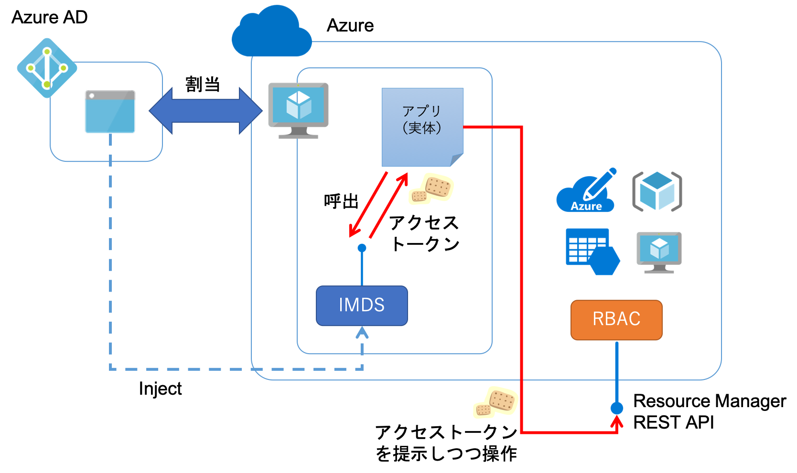


### 仮想マシンへの割り当て

まずスクリプトが動作する予定の仮想マシンに対して マネージド ID を割り当てます。
Azure ポータルで状態を `オン` に切り替えることで自動的に設定されます。

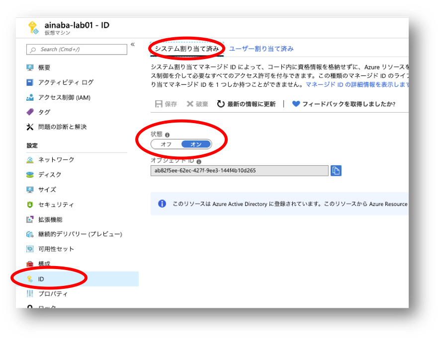

この状態になっている仮想マシン内部からのみ当該マネージドIDを取得することができます。

### RBAC を使用してサービスプリンシパルに対して必要なリソースへのアクセス権限を与える

サインインに必要な情報は実行時に取得できますので、あとは設定したマネージド ID に対して、
自動化したい内容に応じて必要最小限のスコープ（リソース、リソースグループ、サブスクリプション）に対して、
必要最小限の権限（ロール）を付与します。

下記はある仮想ネットワークに対して共同作成者ロールを割り当てている例です。
権限を割り当てられた対象が（アプリではなく）仮想マシンという種類のリソースになっています。
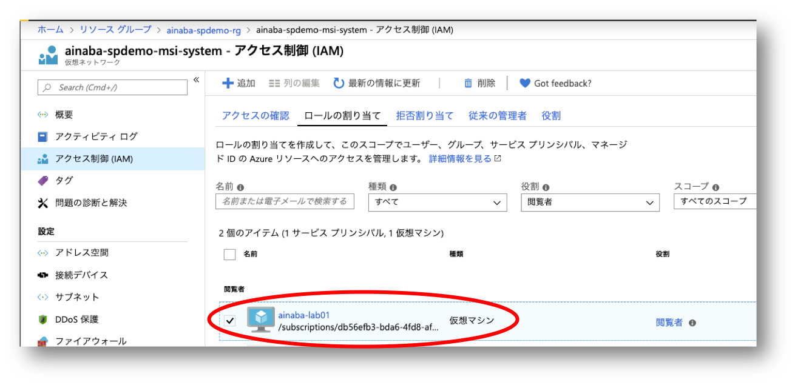


### Azure PowerShell を使用して接続する

以上で必要な事前準備が完了したので `Connect-AzAccount` を `-Identity` オプションを使用して実行します。
サービスプリンシパルで実装した場合に加えて極めてシンプルになっており、シークレットのような機微な情報をハンドルする必要もないことがわかります。

```powershell
PS> ＃認証キャッシュのクリア
PS> Clear-AzContext -Force
PS>
PS> ＃Azure へ接続
PS> Connect-AzAccount -Identity
PS>
PS> ＃自動化したい処理を実行
PS> Get-AzResource
PS>
PS> ＃実行結果として RBAC によって明示的にアクセス権を付与したリソース（この場合はVNET）だけが表示されるはず
```

## ユーザー割り当てマネージド ID

前述のシステム割り当てマネージド ID は特定のリソース内でしか利用できませんので、複数のリソースから単一の ID を使用することができません。
クラスタ環境から実行するケースを想定すると、実行環境となるリソースの数だけシステム割り当てマネージド ID と RBAC の設定を実施する必要があります。
ここで紹介するユーザー割り当てマネージド ID は、マネージド ID そのものを独立した Azure リソースとして作成し、利用したいリソースに対して割り当てることが可能になっています。
サービスプリンシパルのような汎用性と、システム割り当てマネージドIDの利便性を併せ持ったものと言えるでしょうか。

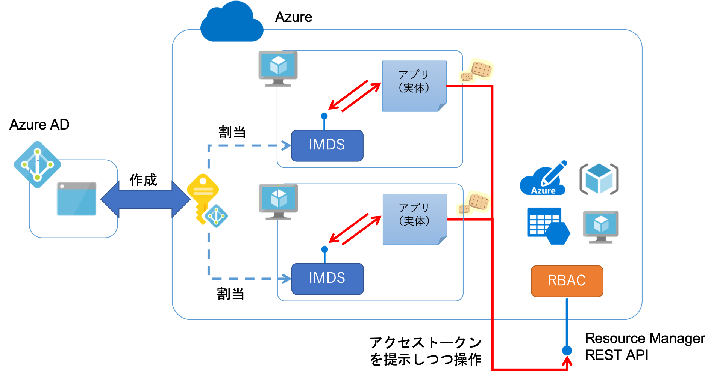


### ユーザー割り当てマネージド ID の作成

仮想マシン等のリソースと同様にマーケットプレイスから作成します。

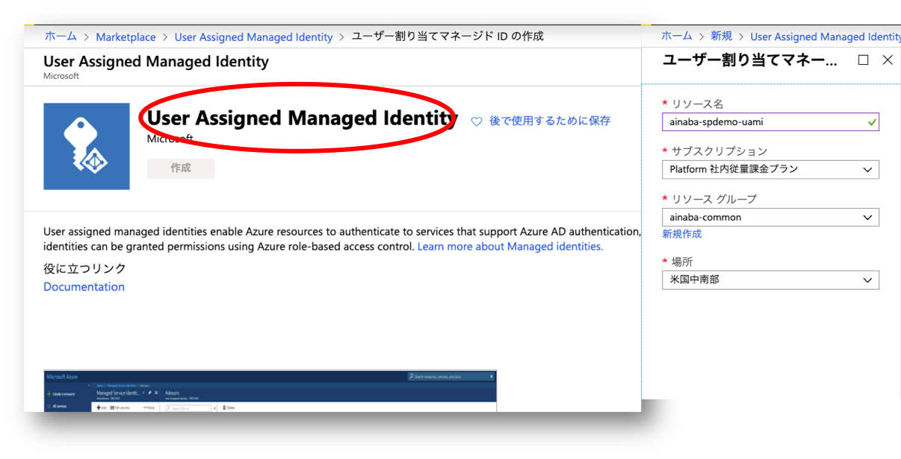

作成したマネージド ID は一般的なリソースと同様にリソースグループ内で管理されます。

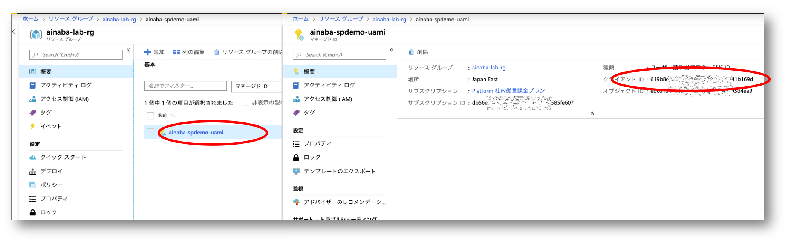

概要画面からクライアントIDが取得できるのでこちらを控えておきます。

```powershell
PS> $clientid = "guid of client id"
```

### 仮想マシンへの割り当て

次にスクリプトが動作する予定の仮想マシンの管理画面で、追加ボタンを押して先ほど作成したユーザー割り当てマネージド ID を割り当てます。
複数の仮想マシンで実行したい場合にはこの操作を繰り返します。

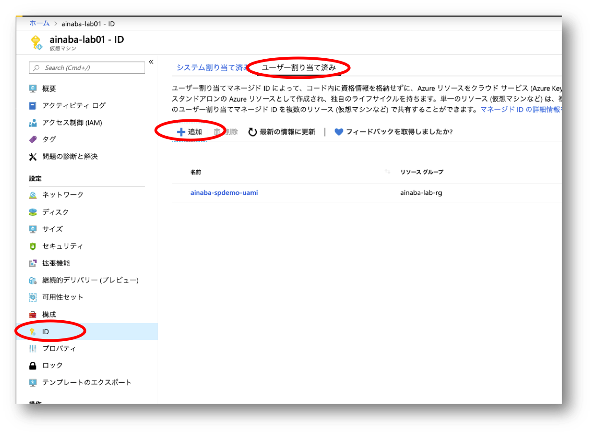

画面から推測できると思いますが、システム割り当ての場合と異なり、複数のマネージド ID を割り当てることが可能です。
このためリソース内部で使用するマネージドIDを明示的に指定する必要があるので、前述のクライアント ID が必要になるわけです。

### RBAC を使用してサービスプリンシパルに対して必要なリソースへのアクセス権限を与える

サインインに必要な情報は実行時に取得できますので、あとは設定したマネージド ID に対して、
自動化したい内容に応じて必要最小限のスコープ（リソース、リソースグループ、サブスクリプション）に対して、
必要最小限の権限（ロール）を付与します。

下記はある仮想ネットワークに対して共同作成者ロールを割り当てている例です。
サービスプリンシパルと権限を割り当てられた対象がアプリという種類のリソースになっています。
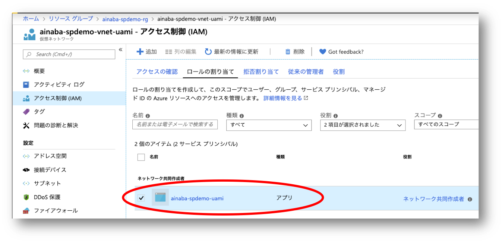


### Azure PowerShell を使用して接続する

以上で必要な事前準備が完了したので `Connect-AzAccount` を `-Identity` オプションと `-AccountId` オプションを使用して実行します。

```powershell
PS> ＃認証キャッシュのクリア
PS> Clear-AzContext -Force
PS>
PS> ＃Azure へ接続
PS> Connect-AzAccount -Identity -AccountId $clientid
PS>
PS> ＃自動化したい処理を実行
PS> Get-AzResource
PS>
PS> ＃実行結果として RBAC によって明示的にアクセス権を付与したリソース（この場合はVNET）だけが表示されるはず
```

## まとめ

Azure で実行するという条件さえ満たせれば、サービスプリンシパルよりもマネージド ID の方が楽ができると考えます。
とは言っても全く新しい仕組みではなく、Azure環境内でのみ利用できるちょっと特殊なサービスプリンシパルなので、
RBAC等の仕組みは全く一緒ですので安心してご利用いただければと思います。

|種類|実行環境|設定方法|取得方法|
|---|---|---|---|
|サービスプリンシパル|任意|アプリ登録| `Connect-AzAccount -ServicePrincipal` |
|システム割り当てマネージド ID|Azure リソース内|システム割り当て状態をオンにする| `Connect-AzAccount -Identity` |
|ユーザー割り当てマネージド ID|Azure リソース内|マーケットプレイスで作成してリソースに割り当て| `Connect-AzAccount -Identity -AccountId` |


## 補足

### 留意事項

前述のサンプルの事前準備の内容では各々１つの仮想ネットワークにしか RBAC 権限がないので省略しておりますが、
実業務の現場ではサービスプリンシパルが複数のサブスクリプションにアクセス権をもつ場合があります。
このため明示的にサブスクリプション ID を指定してスコープを絞り込んでおくことをお勧めします。

```powershell
PS> #Connect-AzAccount の後
PS> Set-AzContext -SubscriptionId $subscriptionid
PS> #自動化したい処理の実装前
```

### アクセストークンをそのまま利用するパターン

前述の PowerShell の例では `Connect-AzAccount` の `-Ientity` オプションを指定することで暗黙的にアクセストークンが取得・利用されていたが、
Azure 仮想マシン内部では実際には [Instance Metadata Serice（IMDS）](https://docs.microsoft.com/ja-jp/azure/virtual-machines/windows/instance-metadata-service)
を利用しています。

IMDS を利用してユーザー割当マネージド ID を取得・利用するコード例は以下のようになります。
システム割当マネージド ID を使用したい場合は URL に含まれる `client_id` クエリパラメータを除去して実行してください。

```powershell
PS> ＃認証キャッシュのクリア
PS> Clear-AzContext -Force
PS>
PS> ＃Azure Resource Manager を利用するためのアクセストークンを取得
PS> $resource = "https://management.azure.com"
PS> $api_version = "2018-02-01"
PS> $url = "http://169.254.169.254/metadata/identity/oauth2/token?api-version=${api_version}&client_id=${clientid}&resource=${resource}"
PS> $response = Invoke-WebRequest -UseBasicParsing -Method Get -Headers @{Metadata=$true} -Uri $url
PS> $token = $response.Content | ConvertFrom-Json
PS>
PS> ＃取得したアクセストークンを用いてAzure に接続
PS> Connect-AzAccount -AccessToken $token.access_token -AccountId $clientid
PS>
PS> ＃自動化したい処理を実行
PS> Get-AzResource
PS>
PS> ＃実行結果として RBAC によって明示的にアクセス権を付与したリソース（この場合はVNET）だけが表示されるはず
```

上記のコードを PowerShell から使用するケースはあまり無いように思いますが、
例えば Azure AD での認証に対応した REST API を直接実行したい場合などには、
取得したアクセストークンを Bearer トークンとして  HTTP Header に追加することで利用することができます。

### Azure Automation という選択肢

Azure PowerShell を実行したいというユースケースに限って言えば、マネージド ID ではなく 
[Azure Automation](https://docs.microsoft.com/ja-jp/azure/automation/) を使用することができます。
もともと Azure Automation は Automation 実行アカウントと呼ばれるサービスプリンシパルを管理する仕組みと、
それを利用するための実行環境が提供されています。
Runbook 内で PowerShell を実行する際に `Get-AutomationConnection` を呼び出すことで Azure への接続情報を取得することができます。
