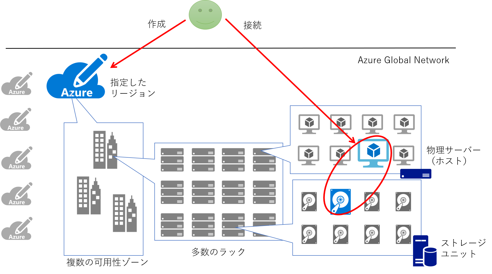
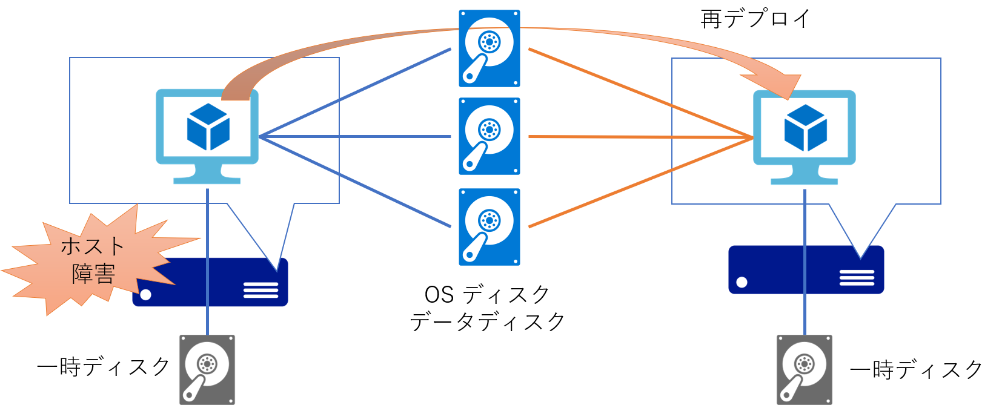
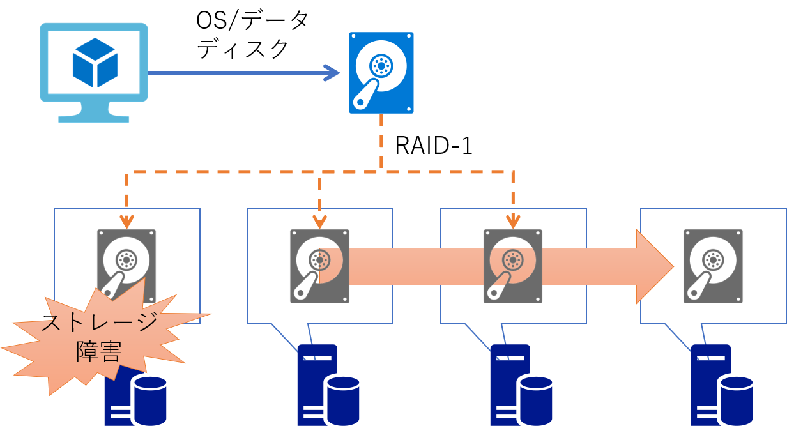
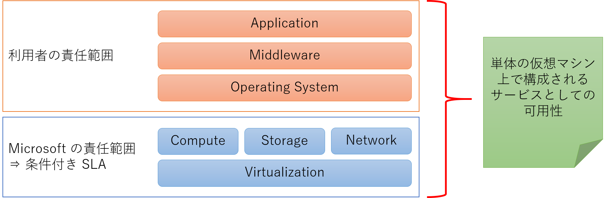

## はじめに

若干今更な感じもするタイトルではありますが、やはり Azure に初めて取り組む方にはわかりにくく、かつ重要視される部分でもありますので、改めてまとめてみたいと思います。「考え方」というタイトルの通り、本記事では技術的にはあまり深入りしないように、なるべく簡潔に記載していきたいと思います。さらに深く追求したい方向けは随所にリンクを貼っておきますので、そちらをご参照いただければと思います。

本記事は 2017 年に
[MSDN Blog](https://docs.microsoft.com/ja-jp/archive/blogs/ainaba-csa/availability-of-azure-virtual-machines)
で記載した内容の加筆修正版となります。
あれから３年がたち Azure でも可用性ゾーンが使えるようになり、計画メンテナンスに対するセルフサービス再デプロイができるようになったり、
シングル VM SLA の提供範囲が拡大したり、内部的にも可用性を向上するための様々な機能強化が行われてきました。

しかし様々な技術的な革新はあったとしても、システムの可用性をどう向上させていくか、という根本的な考え方として大きく変わるものはないと思います。
やはり現時点で基本は `単一障害を取り除き、冗長化させることで、システム総体としての可用性を向上させる` に尽きると考えます。

## 仮想マシン単体レベルでの可用性

まず初めに基礎として、1 台だけの仮想マシンで見た場合の可用性についてです。Azure 仮想マシンの可用性を考えるうえでは以下の 3 つの要素が重要です。
ちなみにこの３つは仮想マシンを利用する上での[課金要素](https://docs.microsoft.com/ja-jp/archive/blogs/dsazurejp/23)でもあります。

- Compute : CPU やメモリが利用できる
- Storage : ディスクの読み書きができる
- Network : 当該仮想マシンと通信することができる

Azure 仮想マシンは Windows Hyper-V をベースとした仮想化基盤上で動作します。
Azure ポータルや PowerShell / CLI 等を利用して仮想マシンを作成すると、指定した Azure リージョンのどこかの仮想化基盤上に Compute と Storage リソースが確保され、仮想マシンとしての動作を開始します。
この仮想マシンに対してネットワーク接続が可能であることによって、Azure の利用者は **仮想マシンというサービス** を利用することができるわけです。

この仮想化基盤とその上で動作する仮想マシンは Azure のオペレーションチームによって監視・運用されています。
例えばホストとなる物理サーバーに異常が検知された場合、その内容によっては再起動、あるいは他の健全な物理サーバーへの再デプロイが自動的に行われます。
この仕組みは Service Healing と呼ばれ、これは全ての Azure 仮想マシンにおいて標準の機能になります。

この際、仮想マシンとしては強制的に再起動が発生してしまいますので、利用者視点では一時的にサービスが中断されることになります。
つまり Service Healing によるモニタリング間隔＋仮想マシンの起動＋α 程度のダウンタイムが発生することになります。
ただし再起動先でも同一のOSディスクやデータディスクに接続されるため、そこに格納されたデータが失われることはありません。
またネットワーク的にも同条件で再構成されるため、一定時間後には接続可能になることで利用を再開することができます。

これは言い換えれば、Azure 仮想マシンは **“Active-Standby”** 構成になっているかのように扱えることを意味します。
また上の図では物理サーバーを2台しか記載していませんが、実際には Azure のデータセンターには仮想マシンをホストするための物理サーバーが多数配備されています。
つまり 1 台の仮想マシンを作成するだけで、大量の待機系（占有ではありません）が準備されていることを意味します。
仮想マシンの利用料金は下記で参照することができますが、この金額には待機系を準備するコストも含まれているとお考えください。

- [Windows Virtual Machines の料金](https://azure.microsoft.com/ja-jp/pricing/details/virtual-machines/windows/) 
- [Linux Virtual Machines の料金](https://azure.microsoft.com/ja-jp/pricing/details/virtual-machines/linux/)

なおディスクも内部的には多重化されており、仮想マシンからのすべての書き込みは３つの物理領域に書き込みが完了して初めて成功となります。
これによってストレージユニットが物理的に破損した場合にも残りの 2 つからデータが復旧することが可能です。
オンプレミス環境で言えば 3 多重の RAID-1 に相当する構成であり、これを Azure では LRS ( Locally Redundant Storage ）と呼びます。

現在の Azure で仮想マシンのディスクして利用されるのは主として
[マネージドディスク](https://docs.microsoft.com/ja-jp/azure/virtual-machines/windows/managed-disks-overview)
と呼ばれるものですが、こちらにはこの LRS と呼ばれる冗長化オプションしか提供されておらず、これ以上もこれ以下もありません。
つまりディスクだけでは地理的な冗長化を実現することができず、別のサービスなどと組み合わせて実現する必要があります。

ちなみにもう少し広く **ストレージ** ととらえると、より多くの
[冗長性オプション](https://docs.microsoft.com/ja-jp/azure/storage/common/storage-redundancy)
を活用することができます。
マネージドディスク登場前は仮想マシンのディスクは「ストレージアカウントに保存された VHD ファイル」でした。
これは現在では（マネージドディスクの対比として）アンマネージドディスクと呼ばれており利用することはできます。
ただしこれは可用性の観点からは非推奨となっています。
またストレージアカウントの冗長化オプションを使用することでディスクを GRS / ZRS として冗長化することはできるのですが、
こちらも非推奨となっています。
古くから Azure をご利用いただいている方ほどこの罠に陥りがちですのでご注意ください。

## Microsoft のお約束

このように Service Healing と LRS という仕組みによって、単体構成の仮想マシンであっても「それなりの」可用性が得られるようになっています。
ここまでが Microsoft が 「Azure 仮想マシンの可用性」として提供をお約束している範囲になります。
ここでいう「それなり」の意味は SLA : Service Level Aggreement を確認してみてください。

[仮想マシンの SLA](https://azure.microsoft.com/ja-jp/support/legal/sla/virtual-machines/v1_9/)

上記のリンク先は URL の末尾にあるとおり Version 1.9 のもので、本記事執筆時点での最新版である 2020 年 7 月 に更新されたものになります。
正確なところは必ずオリジナルの SLA を確認していただきたいのですが
おおざっぱには５つの条件が提示されていて、そのうち単体構成の仮想マシンの場合の SLA は3つです

- 仮想マシンに接続される **全ての** ディスクが Premium SSD あるいは Ultra ディスクの場合は、SLA 99.9 %
- 仮想マシンに接続されるディスクが Standard SSD Managed Disks ディスクの場合は、SLA 99.5 %
- 仮想マシンに接続されるディスクが Standard HDD Managed Disks ディスクの場合は、SLA 99.0 %

となっています。
ディスクの種類が混在した場合は SLA が一番低いディスクに合わせられることになります。

なお誤解されがちなのですが、この SLA で定義されている数値は **仮想マシンの実際の稼働率や実績値ではありません** 。
SLA で定められているのはあくまでも **閾値** であって、実際の稼働率がこれを下回った場合にサービスクレジットの提供を行うための基準を定めたものになります。
もちろんクラウドベンダーとしてはこれを上回るための様々努力をしつつサービスを提供しておりますが、
残念ながら一時的に局所的にはこの SLA に違反してしまうケースはあります。
その場合の対応内容がすべて事前に文書化されているものがこの Service Level Aggreement と言えます。

## Microsoft からのお願い

さてここまでは「仮想マシンサービス」の利用者に大して単体構成の仮想マシンがどこまでの可用性をお約束できるか、というお話でした。
ですが、仮想マシンの直接の利用者は、往々にして IT 関係者であり、実際のサービスを利用する「エンドユーザー」ではありません。
一般的には仮想マシンはあくまでもエンドユーザーに提供するサービスを構成するコンポーネントの１つでしかありませんよね。

つまり「サービスとしての可用性」を考えた場合には利用者側でも考慮が必要です。
端的に言えば「OS 以上のソフトウェアスタック」が全て正常に動作していることは利用者側で保証し、
エンドユーザーにサービスを提供する必要がある、ということになります。

このように利用者が構築するサービスは「Azure 仮想マシン」に対して直接的・間接的な依存性を持ちます。
つまり利用者は Azure 仮想マシンの特性を理解し、それを考慮してOperating System、Middleware、Application を構成する必要があるわけです。
すべての特性をここに列挙することは難しいのですが、代表的なものを以下にご紹介します。

### 意図しない再起動に備える

まず前述の通り、Azure 仮想マシンのホストで障害が発生する可能性はゼロではありません。
その場合 Azure データセンターの運用としてはホストの再起動や切り離しが行われる可能性があります。
そしてそれに伴う仮想マシンの強制的な再起動ないしは再デプロイが発生する可能性があります。
この運用は高度に自動化されているため、たとえデータセンターの運用チームであってもイレギュラーな対応はできません。
このためサービスとしての可用性を一定水準以上に維持するためには、仮想マシンが再起動後にアプリケーションが自動復旧して正常な運用状態に戻れるように設計・実装することを強くお勧めします。

再起動に強いシステムを構築することのメリットや考え方については下記が詳しいので是非是非ご一読ください。

[確実な再起動からはじめる クラウドネイティブオペレーション](https://www.slideshare.net/ToruMakabe/ss-74056379)

私も以前かかわったことのあるシステムで、クラウドではなかったのですが「OS起動後に手動でアプリケーションを起動しないとサービス開始できないシステム」というのがありました。
あれがもしクラウドの仮想マシン上にそのまま移行されて障害やメンテナンスで再起動が入ったすると、
仮に仮想マシンが SLA の範囲内で再起動したとしても、おそらくサービス再開は遅れるんだろうなあ・・・。

### 大事なデータは永続化する

各仮想マシンには OS やデータ用のディスクとは別に、ホストとなるサーバーのストレージ上に配置された一時ディスクが１つ接続されています。
つまり障害復旧のために仮想マシンが別のホストに再デプロイされてしまった場合には、ここに保存したデータは消えてしまうことになります。
例えばアプリケーションなどがこの「一時ディスクに保存したデータ」に依存する作りになっていると、再デプロイ後に正常に稼働を再開することができないため、きわめて障害に弱いサービスになってしまいます。
前述の通りストレージサービスに格納されるデータディスクは耐障害性が高いとともに永続性もありますので、重要なデータは必ずデータディスクに保存するようにしてください。

特に注意いただきたいのは既存のオンプレミス環境で動作していた Windows ベースのソフトウェアを Azure 仮想マシン上で動作させるケースです。
Azure Marketplace の Windows ベースの 仮想マシンイメージはこの一時ディスクを D ドライブとして接続します。
つまりソフトウェアが D ドライブへのファイル I/O に依存した作りになっていると、インストールすると動作はするが障害発生後に動かなくなる、という可能性が高くなります。
たまに「I/O 先のパスがハードコードされていて設定変更できないソフトウェア」というものも存在しますので、ご注意ください。

実際に Windows 仮想マシンの既定の D ドライブを

（ストレージではなく）仮想マシンの価格表に記載されている「ディスクサイズ」とはこの「揮発性のある一時ディスクのサイズ」を意味します。
この一時ディスクは I/O 性能が高く、 VM 料金に含まれる（＝追加コストが発生しない）ため、つい使いたくなりますが上記の特性を鑑みてご利用ください。

### 大事なデータはバックアップを取る

前述の通りディスクは内部的にはレプリカがとられていますが、これとは別にバックアップは取るようにしてください。
LRS はあくまでも物理障害に備えて Azure のインフラストラクチャとして耐障害性を持たせるためにレプリカが構成されるだけで、利用者が任意のタイミングで自由にアクセスできるレプリカではありません。
利用者のオペレーションミス等によってデータを誤って更新や削除（いわゆる論理破壊）をしてしまった場合、それは物理的には正常なとして更新や削除として 3 箇所に永続化されます。
このため「過去のレプリカからデータを復旧する」といったオペレーションは不可能ですので、サービスの品質や運用にかかわるような重要なデータは必ずバックアップを取るようにしてください。

Backup の手法としては代表的には以下のものが考えられます。

- Backup as a Service として [Azure Backup](https://docs.microsoft.com/ja-jp/azure/backup/backup-overview) を使用する
- DBMS などを使用しているならばそれに対応するバックアップソフトウェアを利用する（ソフトウェア的なバックアップ）
- 管理ディスクのスナップショットを定期的に取得して自力で管理する（ハードウェア的なバックアップ）

おそらくもっとも楽なのは Azure Backup ですが、バックアップの効率や整合性がとりやすいのはソフトウェアバックアップだと思います。

## 冗長化のススメ

単体レベルの可用性が「それなり」と記載しましたが、システムの要件によってはそれで十分である場合も、不十分である場合もあります。
仮想マシン単体だけで考えた場合には、可用性を向上させるアプローチとしては Premium / Ultra Disk で提供される 99.9% が上限です。
さらに高い可用性を追求する場合には、利用者自ら仮想マシンを冗長化して１つの「クラスタ」を構成する必要があります。

