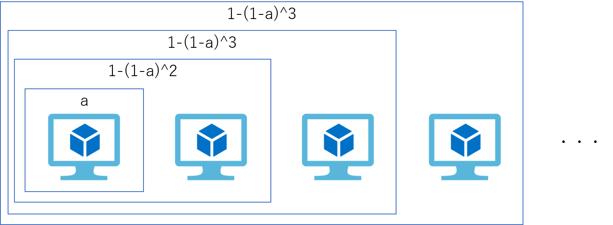
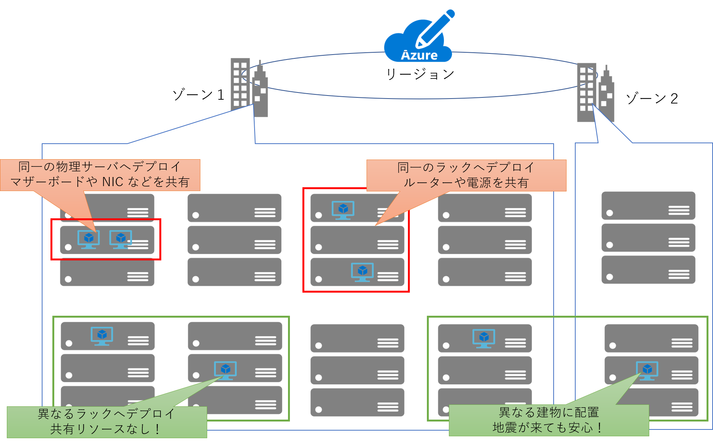
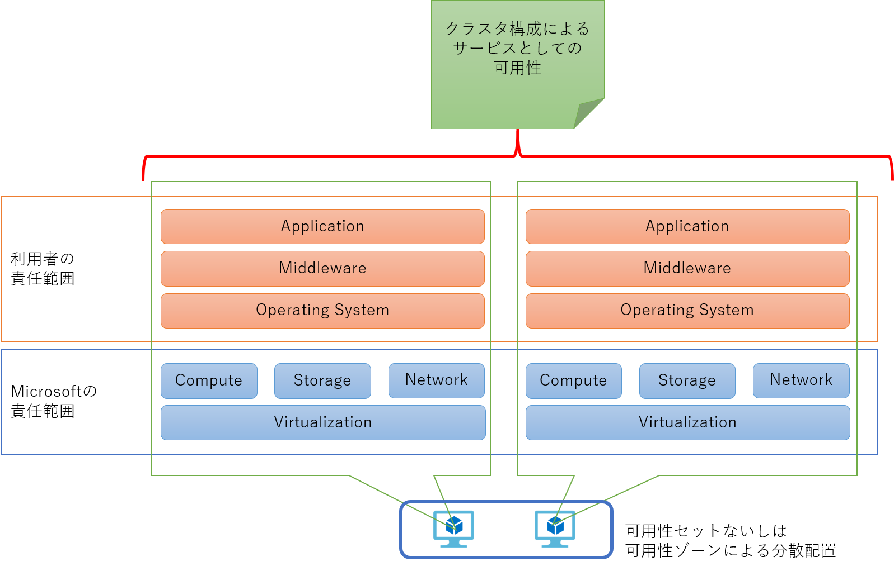
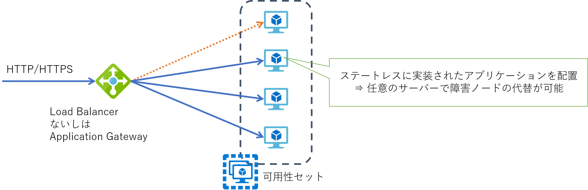
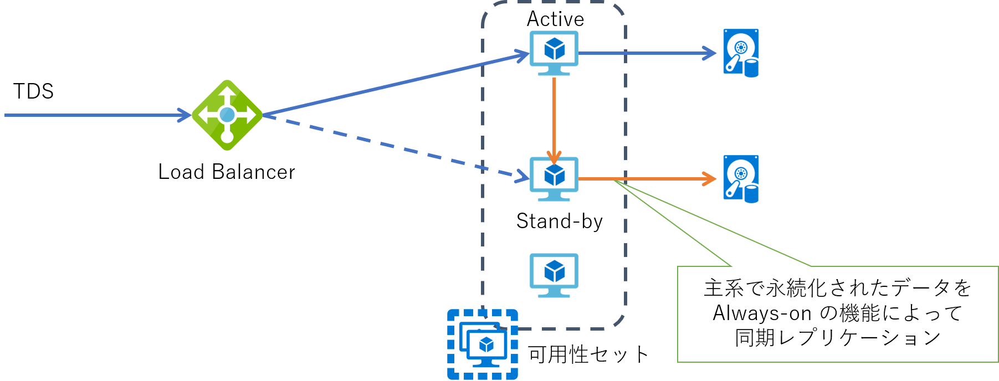

## はじめに

若干今更な感じもするタイトルではありますが、やはり Azure に初めて取り組む方にはわかりにくく、かつ重要視される部分でもありますので、改めてまとめてみたいと思います。「考え方」というタイトルの通り、本記事では技術的にはあまり深入りしないように、なるべく簡潔に記載していきたいと思います。さらに深く追求したい方向けは随所にリンクを貼っておきますので、そちらをご参照いただければと思います。

本記事は 2017 年に
[MSDN Blog](https://docs.microsoft.com/ja-jp/archive/blogs/ainaba-csa/availability-of-azure-virtual-machines)
で記載した内容の加筆修正版となります。
あれから３年がたち Azure でも可用性ゾーンが使えるようになり、計画メンテナンスに対するセルフサービス再デプロイができるようになったり、
シングル VM SLA の提供範囲が拡大したり、内部的にも可用性を向上するための様々な機能強化が行われてきました。

しかし様々な技術的な革新はあったとしても、システムの可用性をどう向上させていくか、という根本的な考え方として大きく変わるものはないと思います。
やはり現時点で基本は `単一障害を取り除き、冗長化させることで、システム総体としての可用性を向上させる` に尽きると考えます。

## 仮想マシン単体レベルでの可用性

まず初めに基礎として、1 台だけの仮想マシンで見た場合の可用性についてです。Azure 仮想マシンの可用性を考えるうえでは以下の 3 つの要素が重要です。
ちなみにこの３つは仮想マシンを利用する上での[課金要素](https://docs.microsoft.com/ja-jp/archive/blogs/dsazurejp/23)でもあります。

- Compute : CPU やメモリが利用できる
- Storage : ディスクの読み書きができる
- Network : 当該仮想マシンと通信することができる

Azure 仮想マシンは Windows Hyper-V をベースとした仮想化基盤上で動作します。
Azure ポータルや PowerShell / CLI 等を利用して仮想マシンを作成すると、指定した Azure リージョンのどこかの仮想化基盤上に Compute と Storage リソースが確保され、仮想マシンとしての動作を開始します。
この仮想マシンに対してネットワーク接続が可能であることによって、Azure の利用者は **仮想マシンというサービス** を利用することができるわけです。

この仮想化基盤とその上で動作する仮想マシンは Azure のオペレーションチームによって監視・運用されています。
例えばホストとなる物理サーバーに異常が検知された場合、その内容によっては再起動、あるいは他の健全な物理サーバーへの再デプロイが自動的に行われます。
この仕組みは Service Healing と呼ばれ、これは全ての Azure 仮想マシンにおいて標準の機能になります。

この際、仮想マシンとしては強制的に再起動が発生してしまいますので、利用者視点では一時的にサービスが中断されることになります。
つまり Service Healing によるモニタリング間隔＋仮想マシンの起動＋α 程度のダウンタイムが発生することになります。
ただし再起動先でも同一のOSディスクやデータディスクに接続されるため、そこに格納されたデータが失われることはありません。
またネットワーク的にも同条件で再構成されるため、一定時間後には接続可能になることで利用を再開することができます。

これは言い換えれば、Azure 仮想マシンは **“Active-Standby”** 構成になっているかのように扱えることを意味します。
また上の図では物理サーバーを2台しか記載していませんが、実際には Azure のデータセンターには仮想マシンをホストするための物理サーバーが多数配備されています。
つまり 1 台の仮想マシンを作成するだけで、大量の待機系（占有ではありません）が準備されていることを意味します。
仮想マシンの利用料金は下記で参照することができますが、この金額には待機系を準備するコストも含まれているとお考えください。

- [Windows Virtual Machines の料金](https://azure.microsoft.com/ja-jp/pricing/details/virtual-machines/windows/) 
- [Linux Virtual Machines の料金](https://azure.microsoft.com/ja-jp/pricing/details/virtual-machines/linux/)

なおディスクも内部的には多重化されており、仮想マシンからのすべての書き込みは３つの物理領域に書き込みが完了して初めて成功となります。
これによってストレージユニットが物理的に破損した場合にも残りの 2 つからデータが復旧することが可能です。
オンプレミス環境で言えば 3 多重の RAID-1 に相当する構成であり、これを Azure では LRS ( Locally Redundant Storage ）と呼びます。

現在の Azure で仮想マシンのディスクして利用されるのは主として
[マネージドディスク](https://docs.microsoft.com/ja-jp/azure/virtual-machines/windows/managed-disks-overview)
と呼ばれるものですが、こちらにはこの LRS と呼ばれる冗長化オプションしか提供されておらず、これ以上もこれ以下もありません。
つまりディスクだけでは地理的な冗長化を実現することができず、別のサービスなどと組み合わせて実現する必要があります。

ちなみにもう少し広く **ストレージ** ととらえると、より多くの
[冗長性オプション](https://docs.microsoft.com/ja-jp/azure/storage/common/storage-redundancy)
を活用することができます。
マネージドディスク登場前は仮想マシンのディスクは「ストレージアカウントに保存された VHD ファイル」でした。
これは現在では（マネージドディスクの対比として）アンマネージドディスクと呼ばれており利用することはできます。
ただしこれは可用性の観点からは非推奨となっています。
またストレージアカウントの冗長化オプションを使用することでディスクを GRS / ZRS として冗長化することはできるのですが、
こちらも非推奨となっています。
古くから Azure をご利用いただいている方ほどこの罠に陥りがちですのでご注意ください。

## Microsoft のお約束

このように Service Healing と LRS という仕組みによって、単体構成の仮想マシンであっても「それなりの」可用性が得られるようになっています。
ここまでが Microsoft が 「Azure 仮想マシンの可用性」として提供をお約束している範囲になります。
ここでいう「それなり」の意味は SLA : Service Level Aggreement を確認してみてください。

[仮想マシンの SLA](https://azure.microsoft.com/ja-jp/support/legal/sla/virtual-machines/v1_9/)

上記のリンク先は URL の末尾にあるとおり Version 1.9 のもので、本記事執筆時点での最新版である 2020 年 7 月 に更新されたものになります。
正確なところは必ずオリジナルの SLA を確認していただきたいのですが
おおざっぱには５つの条件が提示されていて、そのうち単体構成の仮想マシンの場合の SLA は3つです

- 仮想マシンに接続される **全ての** ディスクが Premium SSD あるいは Ultra ディスクの場合は、SLA 99.9 %
- 仮想マシンに接続されるディスクが Standard SSD Managed Disks ディスクの場合は、SLA 99.5 %
- 仮想マシンに接続されるディスクが Standard HDD Managed Disks ディスクの場合は、SLA 95.0 %

となっています。
ディスクの種類が混在した場合は SLA が一番低いディスクに合わせられることになります。

なお誤解されがちなのですが、この SLA で定義されている数値は **仮想マシンの実際の稼働率や実績値ではありません** 。
SLA で定められているのはあくまでも **閾値** であって、実際の稼働率がこれを下回った場合にサービスクレジットの提供を行うための基準を定めたものになります。
もちろんクラウドベンダーとしてはこれを上回るための様々努力をしつつサービスを提供しておりますが、
残念ながら一時的に局所的にはこの SLA に違反してしまうケースはあります。
その場合の対応内容がすべて事前に文書化されているものがこの Service Level Aggreement と言えます。

ちなみに単体レベルの可用性が「それなり」と記載しましたが、システムの要件によってはそれで十分である場合も、不十分である場合もあります。
いかがでしょう、足りてますか？

|SLA の基準値|SLA で許容される 1 か月あたりのダウンタイム（分）|
|---|---|
|95.0%|2160分 (1.5日)|
|99.5%|216分 (3.6時間)|
|99.9%|43.2分|

## Microsoft からのお願い

さてここまでは「仮想マシンサービス」の利用者に大して単体構成の仮想マシンがどこまでの可用性をお約束できるか、というお話でした。
ですが、仮想マシンの直接の利用者は、往々にして IT 関係者であり、実際のサービスを利用する「エンドユーザー」ではありません。
一般的には仮想マシンはあくまでもエンドユーザーに提供するサービスを構成するコンポーネントの１つでしかありませんよね。

つまり「サービスとしての可用性」を考えた場合には利用者側でも考慮が必要です。
端的に言えば「OS 以上のソフトウェアスタック」が全て正常に動作していることは利用者側で保証し、
エンドユーザーにサービスを提供する必要がある、ということになります。

このように利用者が構築するサービスは「Azure 仮想マシン」に対して直接的・間接的な依存性を持ちます。
つまり利用者は Azure 仮想マシンの特性を理解し、それを考慮してOperating System、Middleware、Application を構成する必要があるわけです。
すべての特性をここに列挙することは難しいのですが、代表的なものを以下にご紹介します。

### 意図しない再起動に備える

まず前述の通り、Azure 仮想マシンのホストで障害が発生する可能性はゼロではありません。
その場合 Azure データセンターの運用としてはホストの再起動や切り離しが行われる可能性があります。
そしてそれに伴う仮想マシンの強制的な再起動ないしは再デプロイが発生する可能性があります。
この運用は高度に自動化されているため、たとえデータセンターの運用チームであってもイレギュラーな対応はできません。
このためサービスとしての可用性を一定水準以上に維持するためには、仮想マシンが再起動後にアプリケーションが自動復旧して正常な運用状態に戻れるように設計・実装することを強くお勧めします。

再起動に強いシステムを構築することのメリットや考え方については下記が詳しいので是非是非ご一読ください。

[確実な再起動からはじめる クラウドネイティブオペレーション](https://www.slideshare.net/ToruMakabe/ss-74056379)

私も以前かかわったことのあるシステムで、クラウドではなかったのですが「OS起動後に手動でアプリケーションを起動しないとサービス開始できないシステム」というのがありました。
あれがもしクラウドの仮想マシン上にそのまま移行されて障害やメンテナンスで再起動が入ったすると、
仮に仮想マシンが SLA の範囲内で再起動したとしても、おそらくサービス再開は遅れるんだろうなあ・・・。

### 大事なデータは永続化する

各仮想マシンには OS やデータ用のディスクとは別に、ホストとなるサーバーのストレージ上に配置された一時ディスクが１つ接続されています。
つまり障害復旧のために仮想マシンが別のホストに再デプロイされてしまった場合には、ここに保存したデータは消えてしまうことになります。
例えばアプリケーションなどがこの「一時ディスクに保存したデータ」に依存する作りになっていると、再デプロイ後に正常に稼働を再開することができないため、きわめて障害に弱いサービスになってしまいます。
前述の通りストレージサービスに格納されるデータディスクは耐障害性が高いとともに永続性もありますので、重要なデータは必ずデータディスクに保存するようにしてください。

特に注意いただきたいのは既存のオンプレミス環境で動作していた Windows ベースのソフトウェアを Azure 仮想マシン上で動作させるケースです。
Azure Marketplace の Windows ベースの 仮想マシンイメージはこの一時ディスクを D ドライブとして接続します。
つまりソフトウェアが D ドライブへのファイル I/O に依存した作りになっていると、インストールすると動作はするが障害発生後に動かなくなる、という可能性が高くなります。
たまに「I/O 先のパスがハードコードされていて設定変更できないソフトウェア」というものも存在しますので、ご注意ください。

実際に Windows 仮想マシンの既定の D ドライブを

（ストレージではなく）仮想マシンの価格表に記載されている「ディスクサイズ」とはこの「揮発性のある一時ディスクのサイズ」を意味します。
この一時ディスクは I/O 性能が高く、 VM 料金に含まれる（＝追加コストが発生しない）ため、つい使いたくなりますが上記の特性を鑑みてご利用ください。

### 大事なデータはバックアップを取る

前述の通りディスクは内部的にはレプリカがとられていますが、これとは別にバックアップは取るようにしてください。
LRS はあくまでも物理障害に備えて Azure のインフラストラクチャとして耐障害性を持たせるためにレプリカが構成されるだけで、利用者が任意のタイミングで自由にアクセスできるレプリカではありません。
利用者のオペレーションミス等によってデータを誤って更新や削除（いわゆる論理破壊）をしてしまった場合、それは物理的には正常なとして更新や削除として 3 箇所に永続化されます。
このため「過去のレプリカからデータを復旧する」といったオペレーションは不可能ですので、サービスの品質や運用にかかわるような重要なデータは必ずバックアップを取るようにしてください。

Backup の手法としては代表的には以下のものが考えられます。

- Backup as a Service として [Azure Backup](https://docs.microsoft.com/ja-jp/azure/backup/backup-overview) を使用する
- DBMS などを使用しているならばそれに対応するバックアップソフトウェアを利用する（ソフトウェア的なバックアップ）
- 管理ディスクのスナップショットを定期的に取得して自力で管理する（ハードウェア的なバックアップ）

おそらくもっとも楽なのは Azure Backup ですが、バックアップの効率や整合性がとりやすいのはソフトウェアバックアップだと思います。

## 冗長化による高可用性クラスタのススメ

仮想マシン単体だけで考えた場合には、可用性を向上させるアプローチとしては Premium / Ultra Disk で提供される 99.9% が上限です。
さらに高い可用性を追求する場合には、利用者自ら仮想マシンを冗長化して「クラスタ」を構成する必要があります。

可用性が a である仮想マシンを N 台用意してクラスタを構成した場合の、クラスタ全体で見た可用性の計算式は 1 – ( 1-a )^N となります。
この計算式を基にいくつかのパターンで可用性を算出し、月間の想定ダウンタイム（分）で表したものが以下の表になります。
これは1日24時間の稼働、1か月を30日として計算しています。

| N | a=95.000% | a=99.000% | a=99.500% | a=99.900% |
|---|-----------|-----------|-----------|-----------|
| 1 | 2160.000  | 432.000   | 216.000   | 43.200    |
| 2 | 108.000   | 4.320     | 1.080     | 0.043     |
| 3 | 5.400     | 0.043     | 0.005     | 4.E-05    |
| 4 | 0.270     | 4.E-04    | 3.E-05    | 4.E-08    |

冗長化することによる可用性の向上効果が大きいことがわかります。

## 単一障害点の排除

シングルノード SLA に定義されている最大の可用性（a=99.9%）では月間の想定ダウンタイムは 43.2 分です。
最低のシングルノード SLA の可用性（a = 95%）では月間で 2160 分（=36時間=1.5日）程度の非常に大きなダウンタイムを想定する必要があります。
しかしこの仮想マシンでクラスタを構成した場合、2 ノードクラスタでは108分（＝1時間48分）、3ノードクラスタでは5.4分となり、Premium SSD を使用したシングルノード SLA を上回る可用性となります。
このようにノード数を増やす効果は極めて高く、高可用性が求められるサービスでは、仮想マシン単体で考えるのではなく、クラスタ化を考慮してください。

ただし、前述の計算式が成り立つのは、各仮想マシン単体の可用性が独立している場合ですので、以下の 2 つが成り立つ必要があります。

- 相互に依存性がない
- 単一障害点を持たない

例えばサーバーAとBの2台があったとして、A が正常に稼働していないと B が正常に稼働できない場合、B は A に依存します。
この場合の可用性の計算式は a^2 となり、 a < 1 ですから a^2 < a が成り立ち、2台並べることで可用性はむしろ劣化します。
Azure の仮想マシンを 2 つ作成した場合、それだけで依存性を持つことはありませんので、この観点での考慮は不要です。

ネットワークや電源といった障害点をサーバ A と B が共有している場合、これらで障害が発生した場合 A と B は同時にダウンします。
この場合の可用性は a となってしまいますので、可用性は全く向上していません。
Azure 上で単純に複数の仮想マシンを作成すると、適宜空いている物理サーバーを探してデプロイが行われます。
この時 Azure のインフラストラクチャはこれらの仮想マシンが「単一障害点を持つと問題があるか否か」を判断することができません。
もしかすると同じ物理サーバ上にデプロイされる可能性も考えられますので、そうならないように利用者側から明示的に指示してあげる必要があるわけです。

Azure インフラストラクチャに対して「これらの仮想サーバーは別々のラックにデプロイして、単一障害点を持たないようにしてね」と教えてあげるためのオプションを「可用性セット(Availability Sets)」と呼びます。
可用性セットを使用したシステムの構築は下記等をご参照ください。

- [Windows VM 用の サンプルの Azure インフラストラクチャによるチュートリアル](https://docs.microsoft.com/ja-jp/azure/virtual-machines/windows/infrastructure-example)
- [Linux VM 用の サンプルの Azure インフラストラクチャによるチュートリアル](https://docs.microsoft.com/ja-jp/azure/virtual-machines/linux/infrastructure-example)

また Azure インフラストラクチャに大して「これらの仮想サーバーは別々のデータセンターにデプロイして、単一障害点を持たないようにしてね」と教えてあげるためのオプションを「可用性ゾーン(Availability Zone)」と呼びます。
可用性ゾーンに関しては下記が詳しいのでご参照ください。

- [Azure のリージョンと Availability Zones](https://docs.microsoft.com/ja-jp/azure/availability-zones/az-overview)

可用性セットは Azure の全てのリージョンで必ず利用できますが、可用性ゾーンはサービス提供が一部のリージョンに限られます。
利用したいリージョンで可用性ゾーンを使用できない場合は、可用性セットを利用するか（この記事では紹介しませんが）ペアリージョンを利用したシステムを設計いただければと思います。

可用性セットや可用性ゾーンは単一障害点を回避してクラスタ全体の障害に備える、というだけではなく、通常運用におけるメンテナンスにおいても考慮されます。
頻度は低いですが一部のメンテナンスは仮想マシンの再起動を伴う場合があります。
クラスタを構成する複数の仮想マシンがメンテナンスによって同時に再起動が行われることが無いようにするためにも、可用性セットや可用性ゾーンが重要になってきます。
詳細は[Azure での仮想マシンのメンテナンス](https://docs.microsoft.com/ja-jp/azure/virtual-machines/maintenance-and-updates)をご参照ください。

なお同一の可用性セットに複数台の仮想マシンを構成した場合、あるいは複数の可用性ゾーンに複数の仮想マシンを配置した場合、それによって構成されるクラスタ全体に対しても SLA が適用されます。
この場合には仮想マシンに接続されているディスクは必ずしも Premium Storage である必要はありません。

### 可用性セットや可用性ゾーンでありがちな誤解

前述のとおり、可用性セットや可用性ゾーンは複数の仮想マシンが単一障害点を持たずに配置されるようにするためのオプションでしかありません。
言い方を変えれば、可用性セットあるいは可用性ゾーンという「特別な機能」によって仮想マシンの可用性が向上する、というものではありません。
どちらの場合も、仮想マシンが複数台構成で冗長化されることが大前提である（すなわち仮想マシンのコストが増加する）、という点にご注意ください。

## クラスタを意識したソフトウェア構成

ここまでが Microsoft が 「クラスタ構成における可用性」として提供している範囲になります。
しかしこれは、可用性セットや可用性ゾーンに複数の仮想マシンを含んでおけば、障害やメンテナンスにおいても最低 でも 1 台以上は利用可能であるように管理・運用される、というものになります。
クラスタレベルで「サービスとしての可用性」を考える場合にはこれだけでは十分ではなく、利用者側でもクラスタ化された仮想マシン上に配備されることを意識したソフトウェア構成を考慮する必要があります。

単一構成の時に加えて考慮しなければならないのは、各々の仮想マシン内で動作するソフトウェアが協調動作するための仕組みや設計が必要になる、という点です。
つまり利用するソフトウェアによって考慮しなければならないポイントは大きく異なってきます。
以下では代表的なパターンとして Web サーバー と DB サーバーの場合を考えます。

### Web サーバーの場合

仮想マシンが Web アプリケーションや Web API を処理する Web サーバーの場合には、その上で動作するアプリケーションを **ステートレス** に実装し、
全てのサーバーに同じものを配置し、どのサーバーがリクエストを受けても全く同じ処理をできるように構成するのが一般的です。
直接のリクエストは前段に配置した負荷分散装置で受け付け、処理を後段の Web サーバー群に振り分けます。
負荷分散装置は Web サーバー群の正常性監視も行うことで、異常を検知した場合には処理を振り分けないようにすることでクラスタから切り離します。

Azure では Layer 4 の負荷分散としては Load Balancer を、あるいは Layer 7 の負荷分散として Application Gateway を利用することが出来ます。
なお仮想マシンが可用性ゾーンで分散されている場合には Azure Load Balancer の Standard をご利用ください。
Basic ではゾーン分散に対応しておらず、Application Gateway も可用性ゾーンには対応していません。

- [Azure Load Balancer の概要](https://docs.microsoft.com/ja-jp/azure/load-balancer/load-balancer-overview) 
- [Application Gateway の概要](https://docs.microsoft.com/ja-jp/azure/application-gateway/overview)

### DB サーバーの場合

仮想マシンの役割が DB サーバーの場合には、多くの場合 DB ソフトウェアに対応したミドルウェアが必要となります。
例えば SQL Server で高可用性構成を構築する場合には、SQL Server Always On Availability Group を使用しますが、これは Windows Server の Failover Cluster 機能も併せて構成する必要があります。
これらにより複数の DB サーバー間でデータ同期を取りつつ、主系および待機系の管理を行います。
この場合も接続元となるクライアントからは前段に配置した Azure Load Balancer に対して接続し、その NAT 機能を利用してその時点での主系への透過的な接続を実現します。

### その他の仮想マシンクラスタ構成

Azure 仮想マシンによるクラスタを構築する場合には、前述のようなマニュアルにおる構成に以外にもいくつかの選択肢が存在します。
いずれの場合も利用者はその特性に合わせたアプリケーションを配置する必要があります。

- Azure VM ScaleSets 
- Azure Kubernetes Service
- Azure Service Fabric
- Azure Batch Service

### 面倒なら PaaS という選択肢

ここまで書いておいてなんですが、仮想マシンの２ノードクラスタでも上記のとおりかなり面倒です。
さらなる高可用性を追い求め始めるとキリがありません。
システムの高可用性設計というのは物理からアプリケーションまでフルスタックの技術知識を要求されるので、技術者としては腕の見せ所ともいえます。
楽しいですよね。
しかし一方で、ベストプラクティスが提供されているのだから先人の知恵を借りたほうが良い、という考え方も必要でしょう。
そういった様々な非機能要件的なベストプラクティスが実装済みの状態でサービス提供されているのが
[PaaS : Platform as a Service](https://docs.microsoft.com/ja-jp/archive/blogs/azure-sa-members/azure-paas-overview) 
です。
可用性以外も様々な非機能要件が組み込まれていますので、構築のコストやスピードという面では大きなメリットがあります。

ただもちろん IaaS に比べると制約も大きくなり、利用者に特有の要件が実装できないケースもあります。
単純に可用性の観点だけで選択することは難しいかもしれませんが、毛嫌いせずに是非一度検討いただくことをお勧めします。
可用性を自力で設計してテストして保守・運用し続けるだけの価値があるかはご一考ください。

最近は PaaS と IaaS を組み合わせて利用しやすくなってきましたので、どちらもうまく使い分けていただければと思います。

- 仮想ネットワークに PaaS を持ち込む（VNET Injection）
    - App Service Environment
    - SQL Database Managed Instance
    - etc...
- 仮想ネットワーク内に PaaS 専用の I/F を作る（Private Endpoint）
    - SQL Database/Data Warehouse
    - Storage Service
    - Azure Data Lake Storage Gen2
    - KeyVault
    - etc...
- 仮想ネットワークから PaaS への経路をコントロールする (Service Endpoint)
    - SQL Database/Data Warehouse
    - Storage Service
    - KeyVault
    - App Service
    - etc...
- ファイアウォールで接続先の IP/FQDN を制限する
    - Any Public IP based services

## まとめ

- Azure 仮想マシンは単体構成でも「それなり」の可用性は提供されています。
- それ以上の可用性が必要な場合には複数の仮想マシンを利用したクラスタを構成してください。
- いずれの場合にも仮想マシン上で動作するアプリケーション側での対応も重要になります。