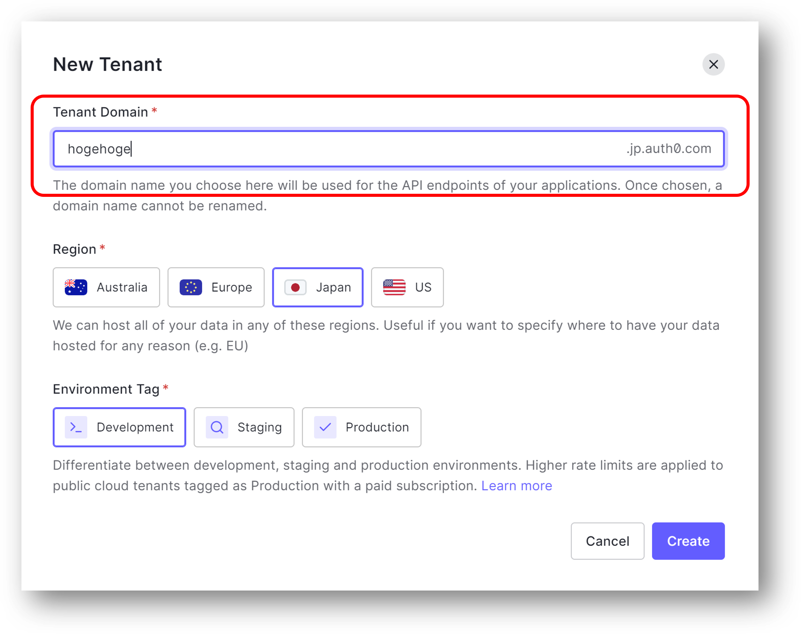
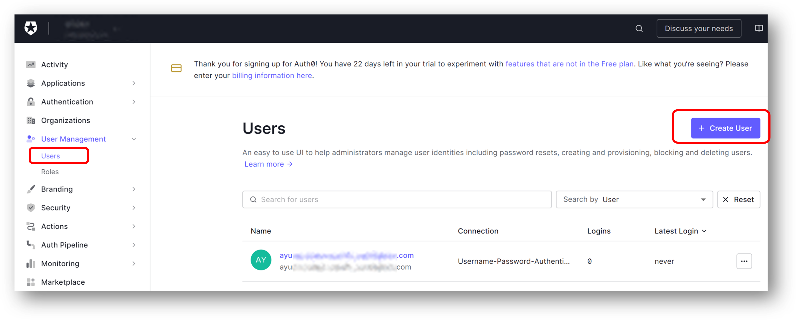
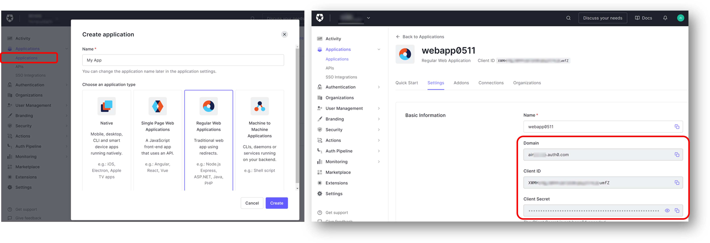
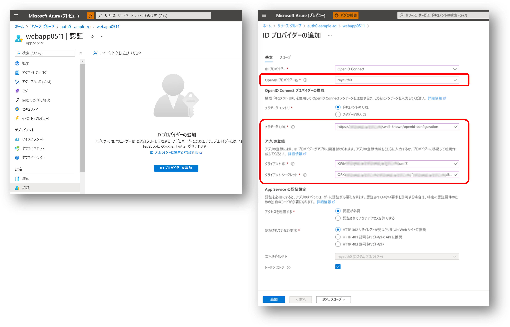
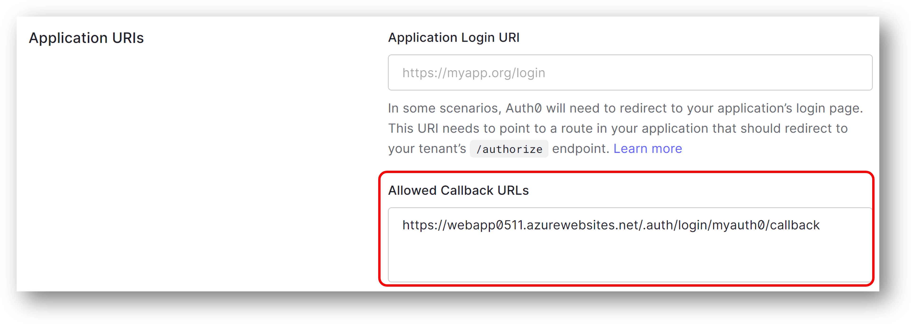
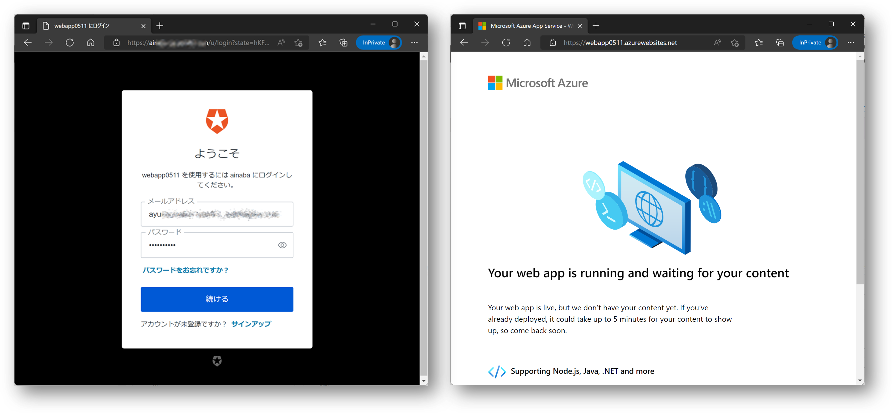
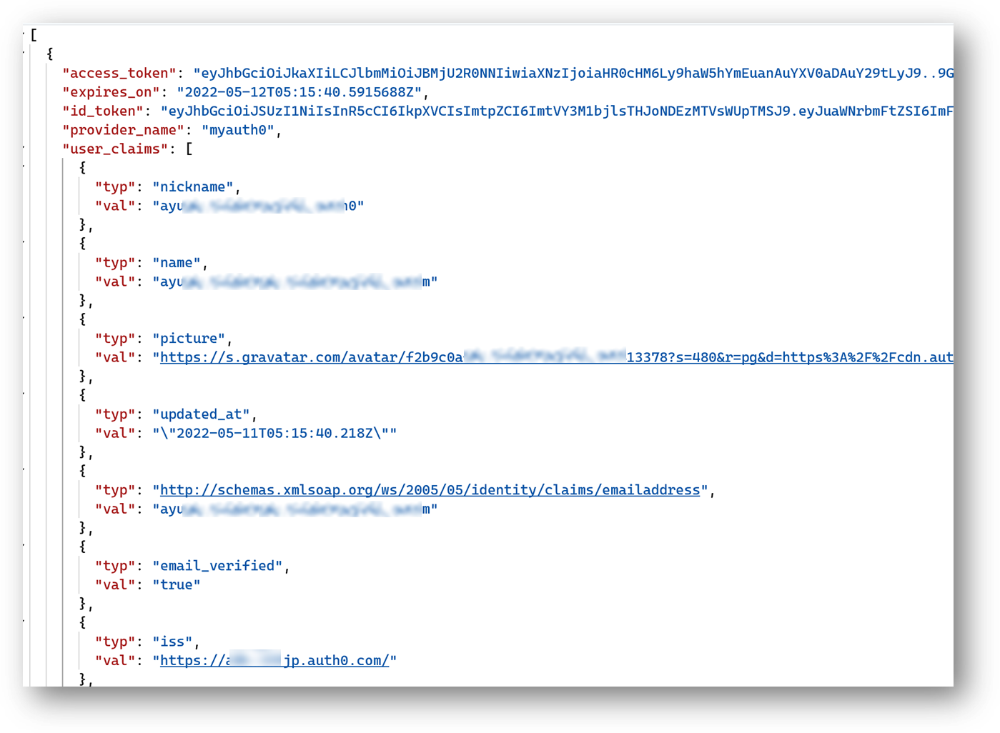

## はじめに

機会があって Auth0 のテナントを作成することになったので、Azure Web Apps にアクセスするユーザーを Auth0 で OpenID Connect 認証する設定を試してみました。
コード不要でぽちぽち設定すればよいので Easy Auth はホント便利です。
以下は参考情報。

- [Configure Applications with OIDC Discovery](https://auth0.com/docs/get-started/applications/configure-applications-with-oidc-discovery)
- [OpenID Connect プロバイダーを使用してログインするように App Service または Azure Functions アプリを構成する](https://docs.microsoft.com/ja-jp/azure/app-service/configure-authentication-provider-openid-connect)

## Auth0 側の準備

### テナントを作成する

まずは [https://auth0.com](https://auth0.com) にアクセスして無料トライアルを開始します。



### ユーザーを登録する

次に認証するユーザーを登録しておきます。パスワードは忘れずに。



### アプリを作成する

ユーザーを認証したい Web アプリを ```Regular Web Applications``` として作成します。
作成したアプリの設定画面を開いて下記を控えておきます。

- Domain
- Client ID
- Client Secret



先ほど控えた値だけだと Web Apps 側からは未認証のユーザーをどこに誘導すればいいのかわからないので、OpenID Connect discovery documents を確認しておきます。
試しに [https://{Domain}/.well-known/openid-configuration](https://{Domain}/.well-known/openid-configuration) にアクセスすると、下記の様なドキュメントが取得できるはずです。

```json
{
  "issuer": "https://{Domain}/",
  "authorization_endpoint": "https://{Domain}/authorize",
  "token_endpoint": "https://{Domain}/oauth/token",
  "device_authorization_endpoint": "https://{Domain}/oauth/device/code",
  "userinfo_endpoint": "https://{Domain}/userinfo",
  "mfa_challenge_endpoint": "https://{Domain}/mfa/challenge",
  "jwks_uri": "https://{Domain}/.well-known/jwks.json",
  "registration_endpoint": "https://{Domain}/oidc/register",
  "revocation_endpoint": "https://{Domain}/oauth/revoke",
  "scopes_supported": [
    "openid", "profile", "offline_access", "name", "given_name", "family_name", "nickname", "email", 
    "email_verified", "picture", "created_at", "identities", "phone",   "address"
  ],
  "response_types_supported": [
    "code", "token", "id_token", "code token", "code id_token", "token id_token", "code token id_token"
  ],
  "code_challenge_methods_supported": [
    "S256", "plain"
  ],
  "response_modes_supported": [
    "query", "fragment", "form_post"
  ],
  "subject_types_supported": [
    "public"
  ],
  "id_token_signing_alg_values_supported": [
    "HS256", "RS256"
  ],
  "token_endpoint_auth_methods_supported": [
    "client_secret_basic", "client_secret_post"
  ],
  "claims_supported": [
    "aud", "auth_time", "created_at", "email", "email_verified", "exp", "family_name", "given_name",
    "iat", "identities", "iss", "name", "nickname", "phone_number", "picture", "sub"  
  ],
  "request_uri_parameter_supported": false
}
```

ここで確認した値を Web Apps の認証設定に登録した後に戻ってきますので、この画面は開いておくと良いでしょう。

## Azure Web Apps 側の準備

### Azure Web Apps の作成

[クイックスタート](https://docs.microsoft.com/ja-jp/azure/app-service/quickstart-dotnetcore?tabs=net60&pivots=development-environment-vs)
などの手順に従って Web Apps を作成してください。
認証設定が試したいだけなのでアプリはデプロイしなくて大丈夫です。

出来上がったらブラウザで開いて匿名アクセスが可能なことを確認します。
作成したときに指定した名前に応じて [https://{webapp-name}.azurewebsites.net](https://{webapp-name}.azurewebsites.net) のような URL でホストされているはずです。

### 認証設定

Web Apps が出来上がったら認証の設定画面で ID プロバイダーを追加します。



ここではプロバイダー名を設定しつつ、先ほど Auth0 の画面で控えた値を入力します。
|Web Apps 側の設定項目|Auth0 で生成された値|
|---|---|
|メタデータ URL|https://{Domain}/.well-known/openid-configuration|
|クライアント ID|Client ID|
|クライアント シークレット|Client Secret|

この設定をしておくことで、未認証のリクエストが Web Apps に届くと Auth0 側にリダイレクトされるようになります。
また Auth0 で認証が成功した後に返ってくるための Callback の URL も
[https://{webapp-name}.azurewebsites.net/.auth/login/{provider-name}/callback](https://{webapp-name}.azurewebsites.net/.auth/login/{provider-name}/callback)
というフォーマットで設定されます。

### Auth0 側にコールバック URL を設定する

さて最後に Auth0 側で登録したアプリケーションの設定画面をスクロールしていくと ```Allowed Callback URLs``` という項目が見つかりますので、
先ほどの WebApp の Callback URL を設定します。



さらに下の方にずーっとスクロールしていくと ```Save Changes``` ボタンがあるので、そちらをクリックして設定を保存します。

## 動作確認

準備が完了したので動作確認をします。

- InPrivate ブラウズ等の認証情報がキャッシュされていないブラウザを起動する
- Web Apps の URL [https://{webapp-name}.azurewebsites.net](https://{webapp-name}.azurewebsites.net) を開く
- リダイレクトされて Auth0 の認証画面が表示される
- 登録しておいたユーザー名とパスワードでログインする
- Web Apps にデプロイしてあるアプリの画面が表示される



この状態で [https://{webapp-name}.azurewebsites.net/.auth/me](https://{webapp-name}.azurewebsites.net/.auth/me) にアクセスしてみると、
Auth0 で認証されたユーザー情報が Web Apps 側に伝達されていることがわかります。



## まとめ

実は初めて Auth0 触ってみたのですが、テナント作成から調査も含め２時間くらいで出来上がりました。
この記事を各作業の方がよっぽど時間がかかってますので、その程度には便利な世の中になったなと思います。
