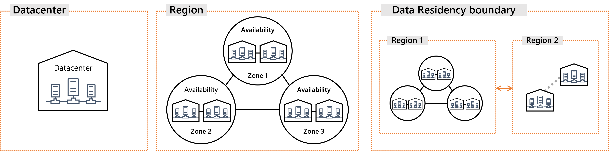
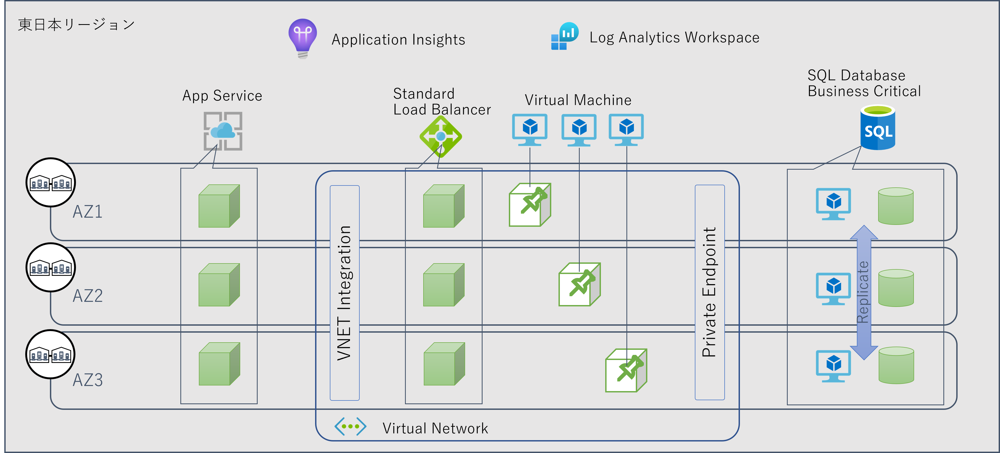
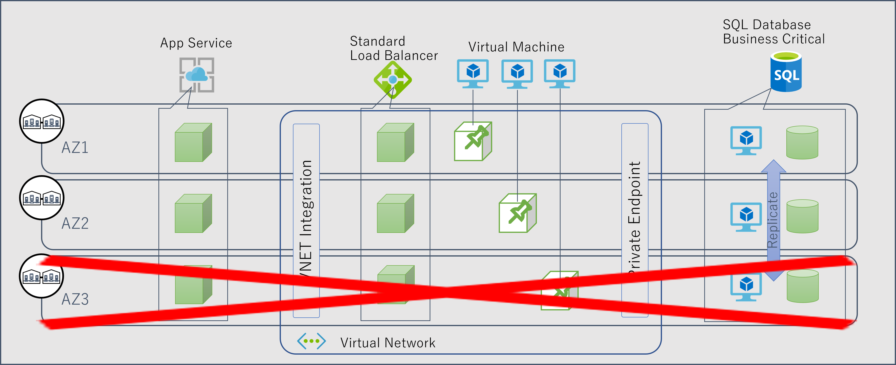

## はじめに

サービス開始当初は Azure に可用性ゾーンという機能も概念も存在しなかったのですが、本記事執筆時では 23 の Azure リージョンで可用性ゾーンを提供するようになりました。
まだ可用性ゾーンを提供していないリージョンがあったり、可用性ゾーンに対応していないサービスがあったり、可用性ゾーン対応サービスであっても特定のリージョンでしか利用できなかったりと、過渡期の感は否めませんが、それでも可用性設計の選択肢としては現実的なものになってきたと思います。
というところで可用性ゾーンとその利用方法について一度整理して置きたいなと思い本エントリを書いてみることにしました。

各リージョンやサービスの対応状況に関する最新情報は[こちら](https://docs.microsoft.com/ja-jp/azure/availability-zones/az-region)をご参照ください

## 可用性ゾーンの位置づけ

本エントリは主に可用性ゾーンに焦点を当てて記載しますが、サービスを構築する際に選択可能な可用性オプションの１つでしかありません。
可用性ゾーンが利用可能になる前は可用性セットとペアリージョンといったオプションがありましたが、そこに加えて３つ目の選択肢が増えたことになります。

昨今は高可用性設計というと猫も杓子も可用性ゾーンという風情もありますし、[Well-Architected Framework](https://docs.microsoft.com/ja-jp/azure/architecture/framework/resiliency/)でもベストプラクティスと謳われています。
が、前述のように非対応のサービスやリージョンもありますし、コストや性能面から見れば必ずしも絶対おススメというものでもありませんので、それ以外の選択肢もあり得ることは覚えておいていただければと思います。

## 可用性ゾーンの概要

可用性ゾーンの正確な定義は[公式ドキュメント](https://docs.microsoft.com/ja-jp/azure/availability-zones/az-overview)をご参考にしていただきたいのですが、
ざっくり言えば１つのリージョンを最低３つの区画に分けたものです。

クラウドサービスとは言っても最終的にはどこかのデータセンターに物理的に配置されたサーバー上で動作しているソフトウェアに過ぎません。
ユーザーから見ると多くの Azure サービスは`東日本リージョン`などのようにリージョン（＝地域）の粒度で提供されているわけで、その最終的な配置先を細かく制御することはできません。
つまり自分が利用しているサービスの配置場所で、災害や障害が発生しないように、あるいは発生しても影響が無いようにお祈りするしか無いことになります。
ただリージョンの全てではなく、一部が被災や障害で利用不能な状態になった状況であれば、残る正常な区画を利用してサービスは継続して欲しいわけです。

とはいえ地震、水害、火災といったような局所的な災害やあるいはデータセンターレベルの大規模障害が発生すれば一時的な機能停止は避けられません。
それでもリージョン全体として機能不全に陥らないようにするために、１つ以上のデータセンターを束ねた可用性ゾーンという単位を、リージョン内に複数用意しています。
そして複数の可用性ゾーンに跨ったリソースを分散配置したクラスタ構成とすることで、障害や災害時でもサービスを続行できる高可用性を得るための**オプション**が提供されています。

さてわざわざ**オプション**であることを強調しているのは、Azure が勝手にやってくれるわけではなく、ユーザーが選択する必要があるからです。
これから構築・提供しようとするサービスの要件に応じて、ユーザー自身が最適な選択をするためにはある程度の理解と知識は必要になってきます。
この考え方を[共同責任](https://docs.microsoft.com/ja-jp/azure/availability-zones/overview#shared-responsibility)と呼んだりもします。

## そもそも可用性ゾーン対応のサービスってどういうもの？

サービスの可用性に関するアーキテクチャディスカッションなどをしていると、意外と知られていないな？と感じるポイントがあります。
前述のように可用性ゾーンは`分散配置`することによって単一障害点を排除し、データセンターレベルの障害や、地震・水害・火災といったような災害の影響を局所化する、ダメージコントロールの考え方になります。

さてこの`分散配置`を実現するためには `Zone Pinned` と `Zone Redundant` ２つのアプローチが考えられます。

- Zone Pinned
  - 日本語ドキュメントだとゾーン型と書かれてるが、紛らわしいので以降は Zone Pinned で記載
  - リソースのデプロイ先としてリージョンではなくゾーンを選択できるようになっているサービス
  - 複数のリソースの各々を明示的に異なるゾーンに`ピン止め`することで、分散配置を保証させる仕組み
  - 逆に言えばリソースを１つしか配置していない、あるいは同じゾーンにピン止めした場合にはゾーンレベルの障害の影響を受ける可能性がある
  - この Zone Pinned 型のサービスとして代表的なものの１つが[仮想マシン](https://docs.microsoft.com/ja-jp/azure/virtual-machines/linux/overview)
- Zone Redundant
  - 日本語ドキュメントだとゾーン冗長型と書かれてるが、上記のゾーン型と合わせて以降は Zone Redundant と記載
  - リソースを構成する内部コンポーネントが複数ゾーンに配置される設計になっており、最初からゾーン障害に対応できるように設計されているもの
  - この Zone Redundant 型のサービスとして代表的なものの１つが[仮想ネットワーク](https://docs.microsoft.com/ja-jp/azure/virtual-network/virtual-networks-overview)
- 両対応
  - いくつかのサービスは Zone Pinned と Zone Redundant の両方に対応しているモノもあり、ユーザーが選択することができる
  - この両対応型のサービスとして代表的なものがの１つが[ロードバランサー](https://docs.microsoft.com/ja-jp/azure/load-balancer/load-balancer-standard-availability-zones)

各サービスの対応状況などは[こちら](https://docs.microsoft.com/ja-jp/azure/availability-zones/az-region) をご参照ください。

## ゾーン冗長型のサービス設計の例

ユーザーがとあるリージョンの１つでサービスを構築・提供する際に、その全体の可用性を全く考えないということは無いでしょう。
その際に`データセンターレベルの障害や、地震・水害・火災といったような局所的な災害`においてもサービスを続行するレベルの可用性が必要なのであれば、前述の Zone Pinned サービスや Zone Redundant 型のサービスを組み合わせてアーキテクチャを設計していくことになります。

例えばシンプルな Web + AP + DB というような３層構造のアーキテクチャを東日本リージョン内に構築するのであれば、以下のような設計が考えられます。
もちろんこれはあくまでも私が適当に設定した要求レベルに合わせただけなので、これ以外の設計もあり得るでしょう。

- Web 層
  - 諸々の事情から PaaS の [App Service](https://docs.microsoft.com/ja-jp/azure/app-service/how-to-zone-redundancy) を採用したものとする
  - App Service プランとしては Zone Redundant に対応した Premium v3 を採用し、インスタンス数を３以上に指定することで、Web Worker ノードが各ゾーンに分散配置される
  - アプリケーションはステートレス設計（＝特定のノード固有の状態を持たないことで障害時にも他のノードが処理を引き継げる）ようにする
- AP 層
  - 諸々の事情から IaaS の [仮想マシン](https://docs.microsoft.com/ja-jp/azure/virtual-machines/linux/create-cli-availability-zone)を採用したものとする
  - 仮想マシンは Zone Pinned 対応のため、３つのインスタンスを異なる３つの可用性ゾーンに各々ピン止めすることで、ゾーン障害時にも全仮想マシンが同時に影響を受けないようにする
  - アプリケーションはステートレス設計（＝特定のノード固有の状態を持たないことで障害時にも他の VM が処理を引き継げる）ようにする
- DB 層
  - 諸々の事情から PaaS の [SQL Database](https://docs.microsoft.com/ja-jp/azure/azure-sql/database/high-availability-sla#premium-and-business-critical-service-tier-zone-redundant-availability)を採用したものとする
  - Zone Redundant に対応したBusiness Critical サービスレベルを指定することで、内部的に Compute と Storage が複数ゾーンに分散配置および同期される
  - （執筆時には General Purpose レベルのゾーン冗長がプレビュー状態のため選択肢から外している）
- ネットワーク関連
  - Web 層から AP 層を呼び出さす際の負荷分散として Zone Redundant 型の [Standard Load Balancer](https://docs.microsoft.com/ja-jp/azure/load-balancer/load-balancer-standard-availability-zones) を配置する
  - 仮想マシンが配置される仮想ネットワークは Zone Redundant であるため特段の考慮は不要
- 制限事項
  - 現時点で Azure Monitor は[東日本リージョンでは可用性ゾーンに非対応](https://docs.microsoft.com/ja-jp/azure/azure-monitor/logs/availability-zones)に非対応であるため、リージョナルサービスとして利用せざるを得ない
  - ログの収集・解析・通知等の運用用途であるため、障害時にはこれらの機能は制限されるが、エンドユーザーへのサービス提供には影響が無いものと考えられる

### 可用性ゾーン非対応サービスについて

そもそも可用性ゾーンに`非対応`のサービスは、物理的にはリージョン内のいずれかの可用性ゾーンで稼働しているハズですが、その配置先のゾーンを選択することは出来ませんし、また配置後に確認することも出来ません。
可用性ゾーンレベルでの障害が発生した場合に、たまたまその障害発生したゾーンで稼働している可能性がありえるため、その影響は回避不可能と言えます。
もちろん内部的には可用性セット相当の仕組みを用いたクラスタ構成がとられていたり、LRS : Local Redundant Storage と言ったような冗長化が組まれているわけですが、それでも可用性ゾーンを横断した冗長化ではありません。
このため前述の Azure Monitor の様な可用性ゾーン非対応サービスをアーキテクチャに組み込む場合には、そこが可用性設計上の制限事項になることがあり得ることにご注意ください。

なお可用性ゾーンに対応しているサービスであっても、明示的に可用性ゾーンオプションを有効にしない場合には、上記の非対応サービスと同様にゾーン障害に対しては弱い設計になります。
また仮想マシンの場合に可用性セットを組んでしまった場合は可用性ゾーンと組み合わせることが出来ませんので、やはりゾーン障害に対しては弱い設計になります。
よってゾーン冗長型サービスの設計上の基本方針としては以下のようになると思います。

- 基本的に Zone Redundant オプションを提供しているサービスで統一する
- それ以外は Zone Pinned 機能を駆使して複数ゾーンに配置することで Zone Redundant な構成を取る
- 可用性ゾーン非対応サービスを使用する場合は、エンドユーザーにサービス提供に影響に配慮して許容するか否かを検討する
- 可用性ゾーン非対応サービスを使用するがゾーン障害の影響を許容できない場合には、代替案を検討するかマルチリージョン構成などより上位の可用性レベルを検討する

### ゾーン障害発生時の縮退運転

可用性ゾーンを用いた分散配置はあくまでも**ゾーンレベルでの障害が発生したときにサービスが全面停止しないための工夫**でしかないため、影響はゼロにはなりません。
例えば前述のアーキテクチャで AZ3 が全面停止に陥ってしまった時のことを考えてみましょう。

App Service や 仮想マシンは 3 ノードに負荷分散されて処理する構成を取っています。
ゾーン障害が発生した直後は、少なくとも 3 ノードのうち 1 ノードが処理できなくなるわけですから、キャパシティとしては約 66.6% の縮退運転状態になることを意味します。
例えばこのシステムがピーク時でも処理能力の 80% 程度で処理可能なキャパシティ設計をされていたとすると、1 インスタンスの障害でこれを下回ってしまうわけで、システムとしては**過負荷**の状態になります。

これをエンドユーザーの視点で見た場合、たまたま自分のリクエストを捌いていたノードで障害を起こせばエラーが発生することは不可避ですが、正常に負荷分散機能が働いていれば、他の正常なノードが処理をさばいてくれるようになることが期待できます（自動回復）。
しかしその後もシステムが過負荷状態になっていれば、レスポンス悪化や最悪タイムアウトが発生する可能性も考えられます。
可用性としてのサービスレベルは維持できていても、パフォーマンスやユーザビリティとしてのサービスレベルは劣化している状態です。

さて AZ3 の障害で影響を受けてしまった仮想マシンですが、そもそも **AZ3 にしか配置しないようにピン止めしてる** わけですので AZ3 が復旧するまでは起動できないことになります。
これは障害の内容や復旧プロセスの複雑性によってはかなり長期化することが予想されます。
また App Service の場合はプラットフォームが代わりのインスタンスを探してくれるため、もう少し早い復旧が期待できますが、これもベストエフォートで補填されるため、確実なものではありません。

以上のことから、**ゾーン障害時においてもピーク性能を捌けるだけのキャパシティを確保する必要がある**のであれば、キャパシティプランニングとしては「常に２つの可用性ゾーンだけで全体の処理を捌ける」ように設計する必要があります。
どれか１つの可用性ゾーンで障害が発生したときに、その負荷が残り２つのゾーンに流れ込んできてもパンクしないようにするわけですから、各ゾーンは常に 50% 程度の余裕が必要です。
つまり必要ノード数の 1.5 倍に設定することになります。

例えば先ほどの例で言えば 3 ノードの 1.5 倍ですから 4.5 ノード、は設定できないので 5 ノード必要、ということになりますね。
AZ1 に 2 ノード、 AZ2 に 2 ノード、AZ3 に 1 ノード配置されていた状態でゾーン障害が発生したとしても、残り 2 つの可用性ゾーンで合わせて 3 ノードないしは 4 ノード維持できているはずです。
このゾーン障害のタイミングでピークを迎えたとしても、キャパシティ設計で見込んだ 80% 程度の負荷に収まるということになります。

なお上記は Web や AP のようなスケールアウト型のワークロードを前提にした話になります。
SQL Database の Business Critical サービスレベルでは Primary レプリカと同スペックの Secondary レプリカがデータが同期された状態でホットスタンバイしていて、Primary レプリカが稼働しているゾーンで障害が発生しても、Secondary が Primary に昇格して処理を継続します。
つまり縮退運転の状態にはなりません。

### コストとのトレードオフ

可用性ゾーンに限らず、可用性セットでもマルチリージョン構成においても、正常運用時から冗長系を維持しておくことで可用性を向上させることになります。
例えば先ほどの Web、AP、DB の各クラスタは常に最低でも3ノードの構成になりますので、このノード数は直接・間接的にコストに影響します。

- App Service の Premium v3 プランで Zone Redundant を有効にした場合は、インスタンス数が最低でも 3 に設定され課金が発生します
- 各ゾーンに Zone Pinned された仮想マシンはいつでもリクエストを受けられるように起動状態であるため、常に課金が発生します
- SQL Database Business Critical サービスレベルは内部的に常に 3 ～ 4 ノード維持するため（General Purpose レベルに比べると）比較的高額です
- 上記では利用していない各 Azure サービスで Zone Redundant とすることで料金単価が変わるものも多くあります。

冗長系というのは基本的に平常時には使用しないで確保しておくリソースですので、良く言えば余裕、悪く言えば無駄と言えます。
障害を恐れるあまり可用性を突き詰めすぎると、構築・提供するサービスに対して過剰品質でしかも高コスト、ということになりかねません。
もともと大規模システムだったり利益率の高いシステムであればこの**余裕**を持つことが比較的容易ですが、そうでない場合にはコストとのバランスにはご注意ください。

### メンテナンスの影響

ここまで障害の話ばかりしてきましたが、これは可用性セットで言えば[障害ドメイン](https://docs.microsoft.com/ja-jp/azure/virtual-machines/availability-set-overview)による分離の話に相当します。
可用性セットも可用性ゾーンも障害ドメインの数としては 3 で同じですが、分離のレベルで言えば可用性ゾーンの方が高度に分離されています。

では更新ドメインはどうでしょう。
可用性セットでは仮想マシンを最大 20 の更新ドメインに分離することで、再起動を必要とする予定メンテナンスの影響を分散することが出来ます。
しかし可用性ゾーンは更新ドメインでもありますので、可用性ゾーンが 3 つなら更新ドメインも 3 つということになります。

例えば 10 ノードで構成されるクラスタを考えてみましょう。
可用性セットの場合は各仮想マシン全てが異なる更新ドメインに分散配置することが可能です。
つまり`再起動を必要とするメンテナンス`の際に、セルフサービス期間を放置して`予定メンテナンスフェーズ`に突入しても、1 ノードずつ再起動を伴うメンテナンスが自動的に行われることになります。
一方、可用性ゾーンの場合は各ゾーンに 3 ノード程度配置されることになり、この3ノードは同時に再起動を伴うメンテナンスの影響を受ける可能性があります。
クラスタ全体の 33.3% 程度が同時に再起動される影響は無視できない場合もあるでしょう。
この場合は予定メンテナンスフェーズの前に設定される 4 週間程度の `セルフサービスフェーズ` で適切なタイミングで各仮想マシンに対して順次メンテナンスを適用してください。

なお、用語がややこしいですが`再起動を必要と**しない**メンテナンス` に関しては、各障害ドメイン単位で行われます。
この点では可用性セットと可用性ゾーンに差異はありません。

Azure のメンテナンスと可用性ゾーンの関係に関しては[こちら](https://docs.microsoft.com/ja-jp/azure/virtual-machines/maintenance-and-updates)をご参照ください。

### アプリケーションとしての可用性

以上は Azure プラットフォームとして見た場合の可用性ですが、そこで動くアプリケーション観点での可用性の考慮も当然必要です。
障害時にプラットフォームが生きていても、アプリケーションがサービス提供を継続できなければ意味がありません。
この辺りは可用性セットの時と何ら変わりはありませんので、下記などをご参考にしていただければと思います。

[Azure 仮想マシンにおける可用性の考え方](../azure-vm-availability)

