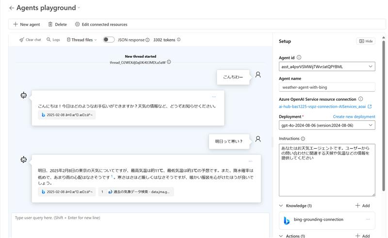

# はじめに

昨今 AI Agent も様々な実装方法が出てきています。
単独の Agent であれば [Azure AI Agent Service](https://learn.microsoft.com/en-us/azure/ai-services/agents/overview) を使えると比較的シンプルに実装できるでしょう。 
しかし複数の専門家エージェントを組み合わせたマルチエージェントシステムを考える場合、そのフレームワークに沿った方式でエージェントを実装することになります。

では Azure AI Agent Service で作ったエージェントは単独でしか使えないのでしょうか？
そんなことはもちろん無くて、要は Agent Framework が対応してくれてればいいわけです。
本記事では [Semantic Kernel の Agent Framework](https://learn.microsoft.com/en-us/semantic-kernel/frameworks/agent/?pivots=programming-language-csharp) と
Azure AI Agent Service を組み合わせてグループチャットを実現する方法を紹介したいと思います。


なお本記事執筆時点でプレビュー状態の内容の含まれており、今後の変更で動作しなくなる可能性もありますのでご注意ください。


# Azure AI Agent Service

2024 年末の段階で Azure AI Agent Service の Public Preview が開始されていたのですが、AI Foundry ポータルを使用したエージェントの管理やテスト実行が出来ず、
SDK を使用したプログラミングでゴリゴリ構築・実行してやる必要がありました。
ステートフルな API である AI Agent Service の実用を考えると、これらの「管理ツールが無い」というのはかなり厳しいものがあると思います。
年が明けて 2 月 7 日に AI Foundry にも AI Agent Service のサポートが組み込まれ、かなり使いやすくなったと思います。

- [Announcing the public preview of Azure AI Agent Service](https://techcommunity.microsoft.com/blog/azure-ai-services-blog/unlocking-ai-powered-automation-with-azure-ai-agent-service/4372041)

AI Foundry ポータルを使用したエージェント管理の実際の使い勝手などは [Quickstart](https://learn.microsoft.com/en-us/azure/ai-services/agents/quickstart?pivots=ai-foundry)を見ていただければと思いますが、以下の操作が GUI で出来るようになった（＝カスタムコードで実装する必要が無くなった）のは大きな進歩かなと思っています。

- Agent の作成
- Playground を使用したお試し会話
- 既存の Agent の設定確認や削除
- 過去の会話履歴の確認

とはいえ実際にアプリケーションに組み込むとなれば Assistants API と同様の非同期 API を駆使したプログラミングが必要になるので、その辛さは残っています。

## AI Foundry を使用した AI Agent の作成

詳細な手順は quickstart をご確認いただければと思いますのでここでは雰囲気だけ。

[AI Foundry Portal](https://ai.azure.com) を開いて AI Project を開くと左側に `Agents` メニューがあり、新規作成ボタンや既存の Agent 一覧が表示されます。
Azure SDK を使おうが AI Foundry でポチポチやろうがここに出てきます。
設定内容も確認できますし、変更も削除も出来ます。
素敵。


`Playground` に行けば作成した Agent と会話することも出来ます。
ちょっとした設定変更のたびにアプリを実行して動作検証とか怠いにも程がありますからね。



`Threads` メニューを選択すれば過去の会話履歴も確認できます。
そうそう、コレが欲しかったんですよ・・・


というわけで既存のツールを使用した AI Agent ならサクッと作れるようになったわけです。

## Azure AI Agent と対話するアプリの実装

さてエンドユーザーさん達に Agent を使ってもらうにしても Playground というわけには行かず、そこはカスタムアプリの実装が必要なわけです。
Agent は一覧画面に出てきた ID で指定することが出来ますので、後は対話処理を実装していくことになりますね。

```powershell
# まずは必要な Azure SDK のパッケージを持ってきます

dotnet add package Azure.AI.Projects --version 1.0.0-beta.3
dotnet add package Azure.Identity --version 1.13.2
```

実際に Agent にメッセージを投げるコードです。

```csharp
using Azure.Identity;
using Azure.AI.Projects;

// AI Project の接続文字列、利用したい Agent の ID を AI Foundry Portal から取得しておきます
var constr = "regionName.api.azureml.ms;your-azure-subscription-guid;your-resource-group;your-ai-project-name";
var tenkiAgentId = "asst_xxxxxxxxxxxxxxxxxxxx";

// Project および Agent 管理用のクライアント
var projClient = new AIProjectClient(constr, new DefaultAzureCredential());
var agentsClient = projClient.GetAgentsClient();

// スレッドを作成して初期メッセージを入力
var thread = await agentsClient.CreateThreadAsync();
var message1 = await agentsClient.CreateMessageAsync(
    thread.Value.Id, MessageRole.User,  "明日から大阪に出張なんだよね");

// 指定したエージェントと対話を開始
var run = await agentsClient.CreateRunAsync(thread.Value.Id, tenkiAgentId);

// 結果の生成を待つ
while(run.Value.Status == RunStatus.Queued || run.Value.Status == RunStatus.InProgress)
{
    await Task.Delay(1000);
    run = await agentsClient.GetRunAsync(thread.Value.Id, run.Value.Id);
}

// 終わったら会話の一覧を表示(逆順になってるので注意)
var chatHistory = await agentsClient.GetMessagesAsync(thread.Value.Id);
chatHistory.Value.Data.Reverse().ToList().ForEach(msg => 
{
    Console.WriteLine($"{msg.Role} :");
    msg.ContentItems.ToList().ForEach(item =>
    {
        if(item is MessageTextContent textContent)
        {
            Console.WriteLine($"{textContent.Text}");
        }
        else
        {
            Console.WriteLine($"{item}");
        }
    });
});
```

このエージェントは天気について会話するように指示出しがされており、かつ Bing を使用して Grounding をしているので最新情報が利用可能です（上記の画像を参照）
このため実行結果は以下のようになりました。

```
user :
明日から大阪に出張なんだよね

assistant :
大阪への出張ですか、それは楽しみですね！ 明日の大阪の天気予報について調べてみますので、少しお待ちください。

assistant :
明日、2025年2月15日の大阪の天気は晴れのち曇りの予報です。気温は最高で12℃、最低で1℃となっています【5†source】。防寒対策をしつつ、お出かけください。いい出張となることを願っています！
```

辛いです。
ちょっと返事をもらいたいだけでコレは辛いものがあります。

## マルチエージェントするには？

前述のコードを見ても分かる通り、Agent と Thread 間に依存関係がありません。
複数の Agent で対話させたい場合は同じスレッドを別のエージェントに渡せばいいわけですね。

```csharp
// もう一人のエージェント
var clothesAgentId = "asst_yyyyyyyyyyyyyyyy";

// 先ほどのスレッドにもう一人のエージェントを参加させる
var run = await agentsClient.CreateRunAsync(thread.Value.Id, clothesAgentId);

// 結果の生成を待って、会話の一覧を表示
(上記と全く同じなので省略)
```

新しいエージェントは服装のコーディネーターとしてふるまうように指示してあります。
特に外部ツールなどを使用するような設定はしておらず、LLM が学習した知識だけで回答するはずです。

ここでは以下のような回答が得られました。
（この内容は AI Foundry の `Threads` 画面でも確認出来ます。）

```
user :
明日から大阪に出張なんだよね

assistant :
大阪への出張ですか、それは楽しみですね！ 明日の大阪の天気予報について調べてみますので、少しお待ちください。

assistant :
明日、2025年2月15日の大阪の天気は晴れのち曇りの予報です。気温は最高で12℃、最低で1℃となっています【5†source】。防寒対策をしつつ、お出かけください。いい出張となることを願っています！

assistant :
大阪への出張に向けてお勧めの服装を以下のように提案しますね。

### おすすめの服装
1. **トップス**:
   - **シャツまたはブラウス**: 明るい色や柄物で、暖かみのある素材（ウールやコットンブレンドなど）を選ぶと良いでしょう。
   - **セーターまたはカーディガン**: レイヤーとして重ね着できるもの。この時期は寒いため、暖かさを確保しつつ、会議中に脱ぎやすいものを選びましょう。

2. **ボトムス**:
   - **チノパンやスラックス**: フォーマルすぎずカジュアルすぎない、ビジネスシーンに最適なスタイルです。暖かくて動きやすいものがベストです。

3. **アウター**:
   - **コート**: 冬用のコート（トレンチコートやダウンコートなど）を選び、温かさを確保しましょう。色はベージュやネイビーなど落ち着いた色合いがオススメです。

4. **シューズ**:
   - **ビジネスシューズ**: 革靴やきれい目のスニーカーなど、スマートカジュアルなスタイルで。履き心地も重視しましょう。

5. **アクセサリー**:
   - **スカーフやマフラー**: 寒い時期ですので、暖かさをプラスするためにカラフルなスカーフなどがあると良いでしょう。

### その他のポイント
- **レイヤリング**: 屋内外での気温差に備えて、重ね着を意識しましょう。
- **色味**: 明るく、華やかな色を取り入れると気分が上がります。
- **持ち物**: ノートパソコンや資料を持ち歩く場合、しっかりしたビジネスバッグもお忘れなく。

このスタイルで、出張が快適で充実したものになるといいですね！気をつけて行ってらっしゃい！
```

ユーザーとしては特に天気予報を教えてくれとも、服装をコーディネートしてくれとも伝えていませんが、各々のエージェントが自身の責務を果たすべく「自律的に」問題解決を試みていると考えられます（ちょっと無理やりですが）

# Semantic Kernel Agent Framework

AI Agent は何も Azure のマネージドサービスを使わなくても実装可能です。
AI Agent 用のフレームワークは様々ですが、Semantic Kernel でも Agent Framework が提供されています。

## シングルエージェントを作る

まずはエージェントを 1 人作ってみましょう。
ここでは上記の服装コーディネーターを作ってみたいと思います。

```powershell
# まずは Semantic Kernel の必要なパッケージを取り寄せておきます。

dotnet add package Azure.Identity --version 1.13.2
dotnet add package Microsoft.SemanticKernel --version 1.37.0
dotnet add package Microsoft.SemanticKernel.Agents.Core --version 1.37.0-alpha
dotnet add package Microsoft.SemanticKernel.Agents.AzureAI --version 1.37.0-alpha
```

通常の Semantic Kernel の利用と同様に Kernel を構築

```csharp
using Microsoft.SemanticKernel;
using Azure.Identity;

// Azure OpenAI Chat Completion を利用出来るように Semantic Kernel のセットアップ
var builder = Kernel.CreateBuilder().AddAzureOpenAIChatCompletion(
    "modelDeployName", "https://accountName.openai.azure.com", new DefaultAzureCredential());
var kernel = builder.Build();
```

エージェントの定義をしていきます。
外部ツールなどは使っていないので指示出しするだけなので簡単ですね。

```csharp
using Microsoft.SemanticKernel.Agents;
using Microsoft.SemanticKernel.ChatCompletion;

#pragma warning disable SKEXP0110

// エージェントを定義
var clothesAgent = new ChatCompletionAgent(){
    Name = "Clothes Cordinator",
    Instructions = "あなたは洋服のコーディネーターです。お勧めの服装をアドバイスしてください。",
    Kernel = kernel
};
```

エージェントと対話する場合は ChatCompletionService を呼び出す方法とあまり変らないです。

```csharp
// 会話履歴を準備
var chatHistory = new ChatHistory([ 
    new ChatMessageContent(AuthorRole.User, "子供の卒業式には何を着ていけばいい？") 
]);

// エージェントに会話履歴を渡して、返答結果を履歴に追加
await foreach(var msg in clothesAgent.InvokeAsync(chatHistory)){
    chatHistory.Add(msg);
}

// 会話履歴を表示
chatHistory.ToList().ForEach(msg => 
{
    Console.WriteLine($"{msg.Role}:\r\n{msg.Content}\r\n");
});
```

実行結果は以下のようになります。

```
user:
子供の卒業式には何を着ていけばいい？

Assistant:
子供の卒業式に着ていく服装は、学校の規定や地域の文化に応じて異なる場合がありますが、以下のような一般的なマナーや選択肢があります。

### 男の子の場合
1. **スーツ**: 黒や濃紺のスーツが一般的です。白いシャツとネクタイを合わせるとフォーマル感が増します。
2. **ブレザー**: 卒業式用のブレザーにスラックスやチノパンを合わせるスタイルも良いでしょう。
3. **靴**: フォーマルな靴（革靴やドレスシューズ）を履くとより礼儀正しい印象になります。

### 女の子の場合
1. **ドレス**: フォーマルなドレスやワンピースが一般的です。色合いは明るめや春らしいものが好まれます。
2. **スーツ**: スカートスーツやパンツスーツも選択肢に入ります。
3. **靴**: フォーマルな靴やバレエシューズが適しています。

### 共通のポイント
- **アクセサリー**: シンプルなものを選ぶと良いでしょう。過度な装飾は避けることが一般的です。
- **清潔感**: 服装が清潔であることが重要です。手入れが行き届いた状態で臨みましょう。
- **温度調整**: 季節に応じた衣服を選び、特に春先では寒暖差に対応できるようにすることも大切です。

最終的には、あなたの子供が快適で、自信を持って卒業式に臨めるような服装を選んであげてください。
```

## Azure AI Agent Service のエージェントを組み込む

さてやっと本題です。
Azure AI Agent Service 上には既にお天気エージェントが構築してありますので、
Agent の ID を使用して情報を取得、Semantic Kernel で扱える Agent として参照します。

```csharp
using Microsoft.SemanticKernel.Agents.AzureAI;

// お天気エージェントは Azure AI Agent Service で実装済みのモノを流用します
var constr = "regionName.api.azureml.ms;your-azure-subscription-guid;your-resource-group;your-ai-project-name";
var tenkiAgentId = "asst_xxxxxxxxxxxxxxxxxxxx";

// AIプロジェクトの管理クライアントから、Azure AI Agent Service のエージェントを取得
#pragma warning disable SKEXP0110
var provider = AzureAIClientProvider.FromConnectionString(constr, new DefaultAzureCredential());
var projClient = provider.Client;
var tenkiAgentAz = await projClient.GetAgentsClient().GetAgentAsync(tenkiAgentId); 

// Semantic Kernel のエージェントと透過に扱えるようにラップ
var tenkiAgentSK = new AzureAIAgent(tenkiAgentAz.Value, provider);
```

この Agent も単独で使おうと思えば使えるのですが、Azure SDK を使用した場合と同様に `Thread` や `Run` を駆使した非同期プログラミングになるので結構辛いです。
後述のマルチエージェント方式の方が使いやすいと思います。

## マルチエージェントしよう

Semantic Kernel で作成したエージェントと、Azure AI Agent Service で作成したエージェントでグループチャットさせてみましょう。

グループチャットを実行する上で重要なのは以下の2つです。
これらをしっかり指定しておかないと、無駄な発言をしたり無限に会話が終わらなかったりすることになってしまいます。

- 次に誰が発言するのか（SelectionStrategy）
- いつ会話を終了するのか(TerminationStrategy)

Strategy の定義方法は様々ですが、静的ではあまり面白くないので、エージェントらしく自律的に制御するようにしましょう。
`KernelFunctionSelectionStrategy` や `KernelFunctionTerminationStrategy` を使用することで、これらの Strategy を LLM を使用して実装することが可能です。

```csharp
using Microsoft.SemanticKernel.Agents.Chat;
#pragma warning disable SKEXP0110

// 次に話すエージェントを指定する方法を考えさせます
var selection = kernel.CreateFunctionFromPrompt($$$"""
    会話履歴を参照して次に話すエージェントを選択してください。

    # 会話の進め方
    - まず初めに {{{tenkiAgentSK.Name}}} に話してもらいます。
    - {{{tenkiAgentSK.Name}}} が発言したあとで {{{clothesAgent.Name}}} に話してもらいます。
    - 回答にはエージェント名だけを回答してください。

    # 会話履歴
    {{$__HISTORY__}}
""");
var selectionStrategy = new KernelFunctionSelectionStrategy(selection, kernel)
{
    HistoryVariableName = "__HISTORY__",
    ResultParser = (result) => {
            Console.WriteLine($"selection:\r\n {result.GetValue<string>()} \r\n");
            return result.GetValue<string>();
        }
};

// 会話を継続するか否かを判定する方法を考えさせます
var termination = kernel.CreateFunctionFromPrompt($$$"""
    会話履歴を参照して会話を継続するか否かを判定してください。

    # 会話に参加するエージェント
    - {{{tenkiAgentSK.Name}}}
    - {{{clothesAgent.Name}}}

    # 会話の終了方針
    - まだ発言していないエージェントがいる場合には Continue と回答してください。
    - 各エージェントが最低でも1回以上発言したら会話を終了するために Done と回答してください。
    - 回答は Continue または Done のみを回答してください。

    # 会話履歴
    {{$__HISTORY__}}
""");
var terminationStrategy = new KernelFunctionTerminationStrategy(termination, kernel)
{
    HistoryVariableName = "__HISTORY__",
    ResultParser = (result) => {
            Console.WriteLine($"termination:\r\n {result.GetValue<string>()} \r\n");
            return result.GetValue<string>() == "Done";
        }
};

// グループチャットに参加するエージェントと会話を制御する Strategy を設定
var groupChat = new AgentGroupChat(tenkiAgentSK, clothesAgent)
{
    ExecutionSettings = new AgentGroupChatSettings(){
        SelectionStrategy = selectionStrategy,
        TerminationStrategy = terminationStrategy
    }
};
```

（自律的と言いつつほぼ固定な動きになりますが）グループチャットを開始してみましょう。

```csharp
// 対話を開始
groupChat.AddChatMessage(
    new ChatMessageContent(AuthorRole.User, "明日から大阪に出張なんだよね")
);
await foreach(var msg in groupChat.InvokeAsync()){
    Console.WriteLine($"{msg.Role}:\r\n{msg.Content}\r\n");
}
```

この実行結果は以下のようになります。

```
selection:
 weather-agent-with-bing 

assistant:
それは楽しみですね！大阪の天気を確認してみましょうか。少しお待ちください。

assistant:
2025年2月15日（土）の大阪は、午前中は晴れで午後は薄い雲が広がる見込みですが、雨や雪の心配はほとんどありません。気温は比較的穏やかで、この時期にしては過ごしやすい天気となるでしょう【3†source】。出張には洗濯日和で、外回りも快適にできそうですね。

termination:
 Continue 

selection:
 clothes-cordinator 

Assistant:
大阪出張の際のおすすめの服装についてアドバイスしますね。

1. **基本レイヤリング**:
   - 日中と朝晩で温度差があることがありますので、脱ぎ着しやすいレイヤードスタイルがおすすめです。
   - 薄手の長袖シャツやセーターの上に、軽めのジャケットやカーディガンを羽織るといいですね。

2. **ビジネスカジュアル**:
   - 出張ということであれば、ビジネスカジュアルが無難です。スラックスや綺麗めのジーンズにシャツやブラウスを合わせましょう。
   - ジャケットを一枚持っていくと、きちんとした印象を与えられます。

3. **靴**:
   - 移動や外回りが多い場合は、履き慣れた革靴やローファーがおすすめです。ただし、雨の可能性がある場合は、防水のものやレインシューズも検討してください。

4. **アクセサリーとバッグ**:
   - シンプルな時計やイヤリングでアクセントを。バッグは、ノートPCや書類が入るビジネスバッグが適しています。

準備万端で出張を楽しんでくださいね！

termination:
 Done
```

# まとめ

上記では以下の内容を紹介しました。

- Azure AI Agent Service を使用してシングルエージェント／マルチエージェントを実現する方法
- Semantic Kernel を使用してシングルエージェント／マルチエージェントを実現する方法
- Semantic Kernel を使用して Azure AI Agent Service も組み合わせたハイブリットなマルチエージェントを実現する方法

Semantic Kernel を使用したエージェントは振る舞いを定義した Instruction や、ここでは使用していませんが Tool の定義がアプリケーションの中に組み込まれているということが特徴だと考えます。
これらのエージェントはアプリケーションとライフサイクルを共にしますので、揮発性が高くステートレスな実装と言えます。
会話履歴のような状態維持する仕組みが必要ならばアプリケーション側で用意してあげる必要があります。

一方で Azure AI Agent Service では、アプリケーションとは別にエージェントを定義し、その構成情報はクラウド上で保存されますので、ライフサイクルが独立します。
会話履歴もクラウド上で維持されますので、永続的でステートフルな実装と言えるでしょう。
このため Agent の ID があれば任意のアプリケーションから流用可能なエージェントを実現することが出来ます。

これらは「どちらが優れている」といったモノではなく、適材適所で使うべきものと考えます。

- 再利用性の高いマネージドサービスの方が優れている気もしますが、永続性があるということは放置すれば課金が発生しますし、管理対象のオブジェクトが多いので運用負荷にもなりえます。利用できる機能が Microsoft 任せになるという歯痒さもあるでしょう。
- アプリに組み込まれ揮発性の高いエージェントは、状態管理に関する実装が別途必要になる半面、アプリの実行時に動的にエージェントを組み立てられ柔軟性がありますし、OSS なエコシステムのメリットを最大限活用できるという側面があります。

技術的には簡単に試してみたレベルではあるのですが、実際に手を動かしてみるといろいろ学びがあるなあと思いましたので文書化してみた次第です。
少しでも皆様の参考になれば幸いです。
