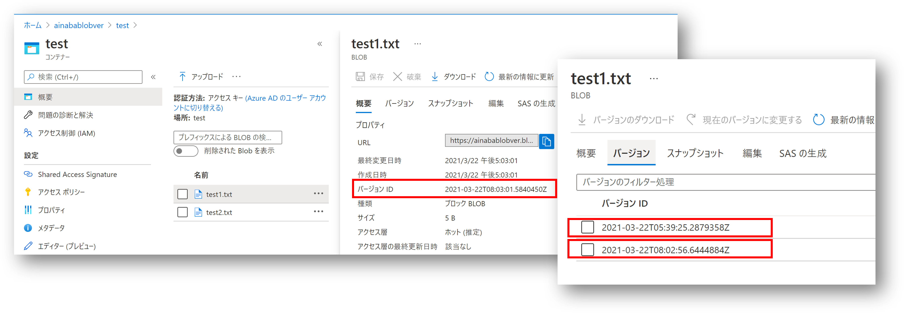

## はじめに

昨年夏ころに [Azure Blob のバージョン管理が一般提供](https://azure.microsoft.com/ja-jp/updates/azure-blob-versioning-is-now-general-available/) されたのですが、
改めてドキュメントを確認してみると、実際に管理する方法が C# しか掲載されていませんでした。
アプリケーション開発の中で各言語の SDK を使用するのであれば問題ないのですが、Azure CLI で過去バージョンの取得や削除といった管理操作が出来ないとツラいと思います。

- [BLOB のバージョン管理](https://docs.microsoft.com/ja-jp/azure/storage/blobs/versioning-overview)
- [BLOB のバージョン管理を有効にして管理する](https://docs.microsoft.com/ja-jp/azure/storage/blobs/versioning-enable?tabs=azure-cli)

この記事の執筆時点(2021/3/21)では Azure CLI の `az storage blob` コマンドでは
[バージョンを指定するオプションが提供されていません。](https://docs.microsoft.com/ja-jp/cli/azure/storage/blob)
どうしても Azure CLI でやるなら[プレビュー版の拡張機能を試用する](https://docs.microsoft.com/ja-jp/cli/azure/ext/storage-blob-preview/storage/blob)、
ということになってしまうわけですが、
今からでも正式に使いたいという需要もあるかなということで、方法を調べてみました。
まあ例によって [Azure Storage REST API](https://docs.microsoft.com/ja-jp/rest/api/storageservices/) を呼び出せばいいわけですね。

## 環境の準備

まずお試しする環境を用意しましょう。
ログインしてサブスクリプションを指定、リソースグループを作成、ストレージアカウントを作成、Blob のバージョニングを有効にして、コンテナを作成していきます。

```bash
SUBSCRIPTION=uid-of-your-azure-subscription
RG=resourceGroupName
STR=storageAccountName
REGION=yourlocation
CONTAINER=containerName

az login
az account set --subscription ${SUBSCRIPTION}
az group create --name ${RG} --location ${REGION}
az storage account create --name ${STR}  --resource-group ${RG} --sku Standard_LRS
az storage account blob-service-properties update  --resource-group ${RG}  --account-name ${STR}  --enable-versioning true
az storage container create  --account-name ${STR} --name ${CONTAINER}  --auth-mode login
```

上記で作成したコンテナに Blob を作成・更新していくと勝手にバージョンが付いていきます。
つまり作成・更新するだけならば *Storage Blob Data Cotributor* ロールで十分なのですが、 
過去のバージョンを削除する際には *Storage Blob Data Owner* ロールに含まれる権限が必要ですので、
そのロールを自分に割り当てます。
ここで若干時間がかかるケースがありますので、最後のコマンドで当該コンテナに割り当てられたロールの一覧を取得し、自分が *Storage Blob Data Owner* になるのを待ちましょう。

```bash
ME=$(az ad signed-in-user show --query objectId -o tsv)
SCOPE=/subscriptions/${SUBSCRIPTION}/resourceGroups/${RG}/providers/Microsoft.Storage/storageAccounts/${STR}/blobServices/default/containers/${CONTAINER}
az role assignment create --role "Storage Blob Data Owner"  --assignee-object-id ${ME} --scope ${SCOPE}
az role assignment list --scope ${SCOPE} -o table
```

環境の準備が整ったのでテストデータを作っていきます。
同名で中身の異なる Blob を 3 つほど作ります。
Blob のバージョン ID はタイムスタンプ形式なので、分かりやすいように間に `sleep` を入れて時間を離しています。

```bash
BLOB=test1.txt
echo "hoge" > ${BLOB}
az storage blob upload  --account-name ${STR}  --container-name ${CONTAINER} --name ${BLOB} --file ${BLOB} --auth-mode login
sleep 1
echo "fuga" > ${BLOB}
az storage blob upload  --account-name ${STR}  --container-name ${CONTAINER} --name ${BLOB} --file ${BLOB} --auth-mode login
sleep 1
echo "piyo" > ${BLOB}
az storage blob upload  --account-name ${STR}  --container-name ${CONTAINER} --name ${BLOB} --file ${BLOB} --auth-mode login
```

それでは出来上がったバージョンを確認していきます。
`List Blob` の際に Prefix として Blob 名を渡すことで余計なファイルが出てこないようにしています。
自動的に日付形式の VersionId が割り振られているのが分かります。

```bash
az storage blob list --account-name ${STR}  --container-name ${CONTAINER} --include v --auth-mode login --prefix ${BLOB} \
	--query '[].{name:name, lastModified:properties.lastModified, versionId:versionId}' -o table

Name       LastModified               VersionId
---------  -------------------------  ----------------------------
test1.txt  2021-03-22T08:02:54+00:00  2021-03-22T08:02:54.4949425Z
test1.txt  2021-03-22T08:02:56+00:00  2021-03-22T08:02:56.6444884Z
test1.txt  2021-03-22T08:03:01+00:00  2021-03-22T08:03:01.5840450Z
```

Azure Portal でも確認できます。
（上記のコマンド実行時に画面キャプチャを取り損ねたのでタイムスタンプがずれてますが）



これで準備が整ったので、以降では実際に特定バージョンの取得および削除を行う方法を紹介していきます。
以下の 3 パターンがありますので状況に応じて適宜使い分けてください。

- Azure CLI の `storage-blob-preview` Extension を使用する
- Azure CLI の `az rest` コマンドを使用する
- Azure CLI の `az account get-access-token` でアクセストークンを取得して `curl` で API を呼び出す

### Azure CLI の storage-blob-preview Extension を使用する

Azure CLI の `storage-blob-preview` Extension を使用する場合の[コマンドリファレンス](https://docs.microsoft.com/ja-jp/cli/azure/ext/storage-blob-preview/storage/blob)を参照します。
おそらくいずれは Extension なしで使えるようになるのだと思いますが、現時点では明示的に Extension をインストールする必要があります。

```bash
az extension add --name storage-blob-preview
```

リファレンスにもある通り、`az storage blob download` や `az storage blob delete` 等に `--version-id` というそのものズバリなオプションが追加されています。
これに先ほど取得した `VersionId` を指定すれば良いわけです。
手打ちやコピペでもいいですが、間違いのないように過去から2番目に古い（配列インデックスが 1）`VersionId` をスクリプトで取得してみます。

```bash
# バージョン未指定（最新版）の取得
az storage blob download --account-name ${STR} --container-name ${CONTAINER} --auth-mode login --name ${BLOB} --file output.txt  1> /dev/null
cat output.txt

piyo

# 特定バージョンの取得
INDEX=1
VERSION_ID=$(az storage blob list --account-name ${STR}  --container-name ${CONTAINER} --include v --auth-mode login --prefix ${BLOB} --query "[${INDEX}].{versionId:versionId}"  -o tsv)
az storage blob download --account-name ${STR} --container-name ${CONTAINER} --auth-mode login --name ${BLOB} --file output.txt --version-id  ${VERSION_ID}  1> /dev/null
cat output.txt

fuga

# 特定バージョンの削除
az storage blob delete --account-name ${STR} --container-name ${CONTAINER} --auth-mode login --name ${BLOB} --version-id  ${VERSION_ID}

# 削除されたことを確認(1行減るはず)
az storage blob list --account-name ${STR}  --container-name ${CONTAINER} --include v --auth-mode login --prefix ${BLOB} \
	--query '[].{name:name, lastModified:properties.lastModified, versionId:versionId}' -o table

Name       LastModified               VersionId
---------  -------------------------  ----------------------------
test1.txt  2021-03-22T08:02:54+00:00  2021-03-22T08:02:54.4949425Z
test1.txt  2021-03-22T08:03:01+00:00  2021-03-22T08:03:01.5840450Z
```

Preview 版の Extension がインストールされた状態だと `az storage blob` コマンドが軒並み警告を出してきて鬱陶しいので、不要なら Extension を削除しておきましょう。

```bash
az extension remove --name storage-blob-preview
```


### Azure CLI の az rest コマンドを使用する

上記の方法は Preview 版の機能を使用していますので、今後変更になる可能性があり、本番運用するスクリプトとするにはリスクがあります。
現時点で確実な実装は REST API を叩いてしまうことでしょう。
Azure の REST API は常に複数バージョンがホストされており、そのバージョンが破棄されるまでは後方互換が保たれます。
呼び出す際にも明示的にバージョンを指定する必要があるので、実装時点での最新版を使用しておけばスクリプトとしても当面は安定することが期待できます。
本記事執筆時点で Storage Service の REST API の最新は `2020-06-12` でしたが、
最新バージョンは [こちら](https://docs.microsoft.com/ja-jp/rest/api/storageservices/versioning-for-the-azure-storage-services) で確認してください。

さて Azure CLI を使用して Azure の REST API を呼び出すには [az rest](https://docs.microsoft.com/ja-jp/cli/azure/reference-index?view=azure-cli-latest#az_rest) という大変便利なコマンドが存在します。
この記事の最初に `az login` で作成した認証情報キャッシュを使用して REST API を呼び出すことができるわけです。
ただこのコマンドは既定で管理プレーンの API （`resourceid == https://management.core.windows.net/`）を呼び出すためのアクセストークンを使ってしまいますので、
Blob のデータプレーン API の Resource ID （`https://<account>.blob.core.windows.net`）を指定して、アクセストークンを切り替えてやる必要があります。
Storage Account の Azure AD 認証やリソース ID については[こちら](https://docs.microsoft.com/ja-jp/azure/storage/common/storage-auth-aad-app?tabs=dotnet)。

前置きが長くなりましたが実際のコマンドは以下のようになります。
`VersionId` はクエリパラメタで指定することになります。

```bash
# バージョン未指定（最新版）の取得
URL=$(az storage blob url --account-name ${STR}  --container-name ${CONTAINER} --name ${BLOB} --auth-mode login -o tsv)
HEADERS="x-ms-version=2020-06-12"
RESOURCE_ID=https://${STR}.blob.core.windows.net/
az rest --method get --url ${URL} --resource ${RESOURCE_ID} --headers ${HEADERS}

piyo

# 特定バージョンの取得
INDEX=1
VERSION_ID=$(az storage blob list --account-name ${STR}  --container-name ${CONTAINER} --include v --auth-mode login --prefix ${BLOB} --query "[${INDEX}].{versionId:versionId}"  -o tsv)
az rest --method get --url "${URL}?versionid=${VERSION_ID}" --resource ${RESOURCE_ID} --headers ${HEADERS}

fuga

# 特定バージョンの削除
az rest --method delete --url "${URL}?versionid=${VERSION_ID}" --resource ${RESOURCE_ID} --headers ${HEADERS}

# 削除されたことを確認(1行減るはず)
az storage blob list --account-name ${STR}  --container-name ${CONTAINER} --include v --auth-mode login --prefix ${BLOB} \
	--query '[].{name:name, lastModified:properties.lastModified, versionId:versionId}' -o table

Name       LastModified               VersionId
---------  -------------------------  ----------------------------
test1.txt  2021-03-22T08:02:54+00:00  2021-03-22T08:02:54.4949425Z
test1.txt  2021-03-22T08:03:01+00:00  2021-03-22T08:03:01.5840450Z
```


### Azure CLI の az account get-access-token でアクセストークンを取得して curl で API を呼び出す

こちらは少し古いやり方になりますが、 アクセストークン を別途取得できる際に、curl コマンドで実行したい場合もあるでしょう。
とりあえずここでは最初に `az account get-access-token` を使用して Blob アクセス用のアクセストークンを取得しますが、既に使いまわせるアクセストークンを持ってる場合は飛ばしてください。
取得したトークンの中身は [jwt.ms](https://jwt.ms) などを利用して確認してみると良いでしょう。

```bash
RESOURCE_ID=https://${STR}.blob.core.windows.net/
TOKEN=$(az account get-access-token --resource=${RESOURCE_ID} --query accessToken -o tsv)
```

それでは `curl` を使用して REST API を直接呼び出していきます。

```bash
# バージョン未指定（最新版）の取得
URL=$(az storage blob url --account-name ${STR}  --container-name ${CONTAINER} --name ${BLOB} --auth-mode login -o tsv)
API_VERSION_HEADER="x-ms-version: 2020-06-12"
AUTH_HEADER="Authorization: Bearer ${TOKEN}"
curl -X GET $URL -H "${AUTH_HEADER}"  -H "${API_VERSION_HEADER}" 

piyo

# 特定バージョンの取得
INDEX=1
VERSION_ID=$(az storage blob list --account-name ${STR}  --container-name ${CONTAINER} --include v --auth-mode login --prefix ${BLOB} --query "[${INDEX}].{versionId:versionId}"  -o tsv)
curl -X GET "${URL}?versionid=${VERSION_ID}" -H "${AUTH_HEADER}"  -H "${API_VERSION_HEADER}" 

fuga

# 特定バージョンの削除
curl -X DELETE "${URL}?versionid=${VERSION_ID}" -H "${AUTH_HEADER}"  -H "${API_VERSION_HEADER}" 

# 削除されたことを確認(1行減るはず)
az storage blob list --account-name ${STR}  --container-name ${CONTAINER} --include v --auth-mode login --prefix ${BLOB} \
	--query '[].{name:name, lastModified:properties.lastModified, versionId:versionId}' -o table

Name       LastModified               VersionId
---------  -------------------------  ----------------------------
test1.txt  2021-03-22T08:02:54+00:00  2021-03-22T08:02:54.4949425Z
test1.txt  2021-03-22T08:03:01+00:00  2021-03-22T08:03:01.5840450Z
```

## まとめ

なんだかいっつもアクセストークンの取得と REST API 呼び出しの記事ばかり書いている気がしますが、
そういえば Azure CLI は初めてでした。
早く `--version-id` が標準実装されるといいなあと思いつつ、こちらの方法もどこかでお役に立てば幸いです。