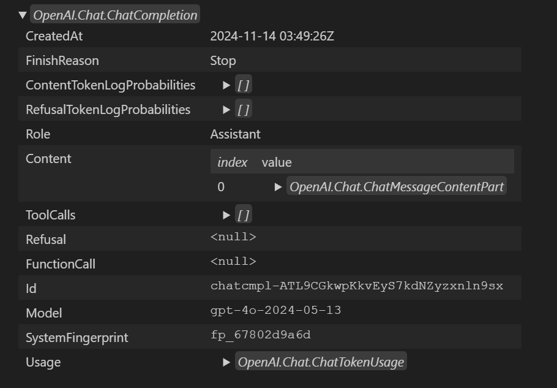

# はじめに

私は Azure OpenAI Service（AOAI） を利用するアプリを作るときは C# でコーディングするのですが、AOAI 用のライブラリっていくつか存在するんですよね。
書き分けてたら若干混乱してきたのでちょっと整理がてらブログにしてみました。
後日コピぺするためのメモとも言います。
まあ最近は GitHub Copilot さんが勝手に書いてくれるんですが、選択肢が複数あることは理解しておいた方がいいと思いますし、どれを選ぶかは人間の仕事だと思いますので。

# Azure OpenAI client library for .NET

まずは [Azure OpenAI Serivce のドキュメント](https://learn.microsoft.com/ja-jp/azure/ai-services/openai/) のリファレンスにも記載のある `Azure.AI.OpenAI` 名前空間のライブラリです。

## リンク集

コーディングに使用する参考情報としては以下のあたりでしょうか。

- [クラスライブラリのドキュメント](https://learn.microsoft.com/ja-jp/dotnet/api/azure.ai.openai?view=azure-dotnet-preview&preserve-view=true)
- [クラスライブラリのソースコード](https://github.com/Azure/azure-sdk-for-net/blob/main/sdk/openai/Azure.AI.OpenAI/README.md)
- [NuGet パッケージ](https://www.nuget.org/packages/Azure.AI.OpenAI)

## サンプルコード

実際に AOAI を呼び出すコードは以下のようになります。
なんのライブラリを使ってるか確認するために、わざと using せずに名前空間をべた書きしています。
バージョンは本記事執筆時点で新しいのを選んだだけなので他意はありません。

```csharp
#r "nuget: Azure.Identity, 1.13.1"
#r "nuget: Azure.AI.OpenAI, 2.1.0-beta.2"

string aoaiEndpoint = "https://aoaiAccountName.openai.azure.com";
string modelDeploy = "gpt-4o";

System.Uri endpoint = new (aoaiEndpoint);
Azure.Core.TokenCredential credential = new Azure.Identity.DefaultAzureCredential();

Azure.AI.OpenAI.AzureOpenAIClient aoaiClient = new (endpoint, credential);
OpenAI.Chat.ChatClient chatClient = aoaiClient.GetChatClient(modelDeploy);
System.ClientModel.ClientResult<OpenAI.Chat.ChatCompletion> res1 = await chatClient.CompleteChatAsync("こんにちわ");
OpenAI.Chat.ChatCompletion chatcompletion = res1.Value;

chatcompletion.Display();
```

1. NuGet を使用して `Azure.AI.OpenAI` パッケージを取り寄せます。
1. AOAI のエンドポイント URL とデプロイしたモデル（上記の場合は GPT-4o を使用）の名前です。実際には構成ファイルとかから取得することでしょう。
1. この URL は文字列としてそのまま使わずに `System.Uri` クラスのインスタンスを生成しています。これは基本ライブラリなので特に言及することはありません。
1. AOAI アクセス時の認証情報として `Azure.Identity.DefaultAzureCredential` を使用しています。機微情報のハードコードは避けるべきです。

ここまでは事前準備みたいなものですね。

1. そして [`AzureOpenAIClient` クラス](https://learn.microsoft.com/en-us/dotnet/api/azure.ai.openai.azureopenaiclient?view=azure-dotnet-preview) のインスタンスを生成しています。
    - 名前の通り nuget で取り寄せたパッケージに含まれている `Azure.AI.OpenAI.dll` に含まれるクラスですね。わかりやすい。
    - ただし、この既定クラスは `OpenAI.OpanAIClient` クラスで、`Azure.AI.OpenAI` パッケージが依存する [`OpenAI`](https://www.nuget.org/packages/OpenAI/) というパッケージに含まれています
    - これは [OpenAI .NET API library](https://github.com/openai/openai-dotnet/tree/OpenAI_2.0.0) という名前で開発されている、本家の OpenAI を呼び出すためのライブラリと言えるでしょう。
1. 次に ChatCompletion をしたいので `GetChatClient` するのですが、ここで取得できるのは `OpenAI.Chat.ChatClient` クラスのインスタンスです。
    - ここで返される Chat Completion 用のクライアントも `OpenAI` パッケージに含まれる `OpenAI.Chat.ChatClient` クラスになります。
1. 呼び出した結果として帰ってくるのは `System.ClientModel.ClientResult<T>` になります
    - これは `System.ClientModel` というパッケージに含まれており、さまざまなサービスを利用するクライアントライブラリを構築するための汎用ツールセットの１つです
    - `Azure.AI.OpenAI` は Azure サービスを利用する汎用的なクラスライブラリである `Azure.Core` に依存しており、それがこの `System.ClientModel` に依存するという推移的な依存関係になっています。
    - このあたりは AOAI に限らず Azure SDK for .NET を利用する上では良く出てくるクラス群になります。
1. 最後に結果として Value プロパティから `OpenAI.Chat.ChatCompletion` が取得できています。
    - これも本家用の OpenAI .NET API Library のクラスになります。

おおざっぱに言えば本家 OpenAI とのなるべくインタフェース的な意味での互換性を持たせつつ、内部実装としては Azure SDK for .NET を使っている、といったところでしょうか。
とはいえ様々なパッケージのインタフェースが思いっきり見えてしまっているので、AOAI を抽象化できてはいないといったところでしょうか。

## 実行結果

Polyglot Notebook の Display を使用して結果を表示すると以下のようになります。
AOAI らしさは全くなく、本家というか REST API のインタフェースを素直に実装したようなイメージでしょうか。




# Microsoft.Extensions.AI ライブラリ

次に先日発表された [Microsoft.Extensions.AI (MEAI)](https://devblogs.microsoft.com/dotnet/introducing-microsoft-extensions-ai-preview/) になります。
Microsoft.Extensions は Dependency Injection, Logging, Configuration といった処理を抽象化するためのライブラリですので、それが AI にも適用されたといったところでしょうか。

## リンク集

コーディングに使用する参考情報としては以下のあたりでしょうか。

- クラスライブラリのドキュメント
- [クラスライブラリのソースコード](https://github.com/dotnet/extensions)
- [NuGet パッケージ](https://www.nuget.org/packages/Microsoft.Extensions.AI)
- [サンプルコード](https://github.com/dotnet/ai-samples/tree/main/src/microsoft-extensions-ai)

## サンプルコード

それでは MEAI を使用して AOAI を呼び出すコードは以下のようになります。
なんのライブラリを使ってるか確認するために、わざと using せずに名前空間をべた書きしています。
ただ拡張メソッドを使うのでどうしても一部 using は必要。

```csharp
#r "nuget: Azure.Identity, 1.13.1"
#r "nuget: Azure.AI.OpenAI, 2.1.0-beta.2"
#r "nuget: Microsoft.Extensions.AI.OpenAI, 9.0.0-preview.9.24556.5"

using Microsoft.Extensions.AI;

System.Uri endpoint = new (aoaiEndpoint);
Azure.Core.TokenCredential credential = new Azure.Identity.DefaultAzureCredential();
Azure.AI.OpenAI.AzureOpenAIClient aoaiClient = new (endpoint, credential);

Microsoft.Extensions.AI.IChatClient chatClient = aoaiClient.AsChatClient(modelDeploy);
Microsoft.Extensions.AI.ChatCompletion chatCompletion = await chatClient.CompleteAsync("こんにちわ");
chatCompletion.GetType().Display();
chatCompletion.Display();
```

割とすっきりしましたね。

1. まず `Azure.AI.OpenAI` に加えて `Microsoft.Extensions.AI.OpenAI` パッケージを取り寄せています。
    - `Microsoft.Extensons.AI` 自体は汎用的なインタフェースなどを定めたフレームワーク的なもので、実装部分を含んでいません。
    - これを OpenAI 用に拡張するために `Microsoft.Extensions.AI.OpenAI` パッケージを使用します。
    - `Microsoft.Extensions.AI` パッケージはその依存関係として同時に取り寄せられています。
    - ただこの `Microsoft.Extensions.AI.OpenAI` は名前の通り本家 OpenAI 用なので、追加で AOAI 用のパッケージも必要になります
1. そして前述の例と同様に `Azure.AI.OpenAI.AzureOpenAIClient` を生成しています。
    - ここまでは MEAI とはあまり関係ないですね、というか、同じなんです。
    - 最初はライブラリを分けてる意味が分かりませんでした。
1. それから [`Microsoft.Extensions.AI.IChatClient`](https://github.com/dotnet/extensions/blob/main/src/Libraries/Microsoft.Extensions.AI.Abstractions/ChatCompletion/IChatClient.cs) を取得しています。ここからMEAI。
    - これは Chat Completion 用のクライアントなのですが、`Microsoft.Extensions.AI` 名前空間直下の汎用インタフェースであり、本家 OAI や AOAI にも依存していません。
    - そのインスタンスを取得するための `AsChatClient` 拡張メソッドは、[Microsoft.Extensions.AI.OpenAI.OpenAIClientExtensions](https://github.com/dotnet/extensions/blob/73962c60f1ba41c93a6ba7298a43de18f6f77676/src/Libraries/Microsoft.Extensions.AI.OpenAI/OpenAIClientExtensions.cs#L17) クラスで定義されています
    - `AzureOpenAIClient` クラスが `OpenAIClient` から派生しているので OAI でも AOAI でも同じ処理になるということですね
1. Chat Completion の結果も `Microsoft.Extensions.AI`名前空間は以下の `ChatCompletion` クラスになります
    - これも OAI や AOAI の色がありませんね

## 実行結果

Polyglot Notebook の Display を使用して結果を表示すると以下のようになります。
インタフェース的には抽象化されているのですが、`RawRepresentation` プロパティで `OpenAI.Chat.ChatCompletion` が取得できるようなので、インタフェースで抽象化しつつ、内部的には `OpenAI` や `Azure.AI.OpenAI` を使っているということでしょう。


## 考察

さて、なぜ MEAI なんて存在が必要になったのか、多分こういう設計思想と想定利用なんだろうなという個人的な考えを整理してみました。

### 拡張可能なフレームワークとエコシステム

`Microsoft.Extensions` の設計思想としては抽象化がキモだと思うので、`Microsoft.Extensions.AI.Abstractions` を見てみましょう。
パッケージやアセンブリ名としては [`Microsoft.Extensions.AI.Abstractions`](https://www.nuget.org/packages/Microsoft.Extensions.AI.Abstractions) なんですが、
格納されているクラスやインタフェースの名前空間は `Microsoft.Extensions.AI` になっているものばかりです。
`Microsoft.Extensions.AI` パッケージが依存しているパッケージでもあるので `Abstractions` も自動的に取り寄せられており、
でも名前空間は一緒なのでソースコードには表れてこないってわけですね。

これらに加えて `Microsoft.Extensions.AI.OpenAI` や `Microsoft.Extensions.AI.Ollama` といった拡張用のパッケージを独立して用意しておき、
これらを組み合わせることでアプリケーションからは AI モデルを利用できる、という仕組みになっています。
AOAI なら AOAI 用の、本家 OAI なら OAI 専用に用意されたライブラリではなく、汎用的で拡張可能になっているというのがポイントでしょうか。

### 責務を明確化するインタフェース

上記の例ではインタフェース名は [IChatClient](https://github.com/dotnet/extensions/blob/main/src/Libraries/Microsoft.Extensions.AI.Abstractions/ChatCompletion/IChatClient.cs) でしたが、
[IEmbeddingGenerator](https://github.com/dotnet/extensions/blob/main/src/Libraries/Microsoft.Extensions.AI.Abstractions/Embeddings/IEmbeddingGenerator.cs) なんてものも存在します。
OpenAI のようなサービスの粒度ではなく、利用したい機能でインタフェースが切られているわけです。
確かに AOAI は[推論系の API](https://learn.microsoft.com/en-us/azure/ai-services/openai/reference) として Chat Completions だけでなく Completions、Embeddings、Image generations、Transcriptions、などなど様々なタスクを処理することができます。
アプリを作るユーザー目線で言えば AOAI が使いたいわけではなく（~~中の人としては使ってほしいですが~~）、
そもそもどういった推論を使いたいかが重要です。
利用したい機能として統一されたインタフェースが切り出されているというのは、開発者にとっては大きなメリットではないでしょうか。

今後の期待としては Image Generation や TTS/STT のためのインタフェースが提供され、統一したプログラミングモデルで利用できるようになってほしいものです。

### AI モデルの透過性

前述のインタフェースで表現される `Chat` や `Embeddings` は何も OpenAI や ChatGPT でしか提供できない推論ではありません。
有名どころで言えば Ollama や Phi3 などがありますよね。
現状の MEAI は
これらの異なるモデルを統一したインタフェースで扱えるということは、アナウンス記事にもあったように開発時と本番運用ではモデルを変えたり、
運用中に新しいモデルに切り替えたりということが柔軟に出来るということです。

またこれらの AI モデルを提供するベンダー視点で言えば、同じインタフェースとして抽象化できるものであれば、
MEAI を拡張するパッケージを提供すればこのエコシステムに参入することが出来ることになります。
これは何も Microsoft の開発を待つことなく、`IChatCompletion` や `IEmbeddingGenerator` 実装を提供して NuGet に公開すればよいわけです。

### ホスティングサービスの透過性

同じモデルを使用するにしても GPT-4o なら Azure OpenAI と本家 OpenAI というホスティング上の選択肢があります。
これらを柔軟に切り替えたり同時に束ねて利用したい場合などもあるでしょうから、その意味でもインタフェースが一緒というのは大きいです。
`Azure.AI.OpenAI.AzureOpenAIClient` は `OpenAI.OpenAIClient` を継承し、リクエスト・レスポンスは同じクラスをそのまま利用することで実現していました。
が、このアプローチではサービスが増えれば増えるほど拡張性に限界が出てくると思われます。

Phi3 なら Azure AI Service としてクラウドでホストすることも出来れば、ローカルマシン上にダウンロードしたモデルを使用することも出来るわけです。
AI デプロイの組み合わせに幅が出てきますが、同時に様々な考慮事項が出てきます。

- AI モデルはクラウドに置くのかローカルに置くのか
- アプリはクラウドで動くのかローカルで動くのか
- データはクラウドに持ち出せるのかローカルに閉じるべきか
- AI モデルの動作環境に GPU/NPU はあるのか
- ネットワークレイテンシーに問題はないか

これらの問題を投下的に扱う上ではインタフェースだけでは足りてないですね。
インタフェースが統一されていたとしても、エンドポイント `System.Uri` や認証方式 `Azure.Core.TokenCredential` などどうしてもホスティングサービス依存の部分が出てきます。
前述のサンプルコードで言うと `Azure.AI.OpenAI.AzureOpenAIClient` を `new` するところが該当します。

サンプルコードではシンプルにするために直接インスタンス生成していますが、実際のプログラミングの現場では Dependency Injection を使うことになるでしょう。
つまりこのホスティングサービスごとの差分は DI コンテナを組み立てるスタートアップコードに集約することができます。
アプリケーションコードでは `IChatClient` を挿入してもらう実装と DI で生成することを意識すればよいでしょう。

### MEAI を使うアプリのイメージ

以上まとめると、MEAI を使うアプリのコードは以下のようになると思います。
ダミーコードなのでこのままでは動きませんが、イメージとして（MEAI を DI するお作法についてはまだ調査中・・・）

```csharp
// アプリからすれば AOAI か OAI かは関係ない、Phi3 か GPT4 かも関係ない、チャットが使えればよい
public class YourSpecialService(IChatClient chatClient)
{
    public async Task ExecuteAnyInference()
    {
        await chatClient.CompleteAsync("your prompt");
    }
}

// モデルやホスティングサービスは DI コンテナで吸収
var builder = Host.CreateApplicationBuilder();
builder.Services.AddTransient<IChatClient>( new AzureOpenAIClient().AsChatClient() );
                .AddTransient<YourSpecialService>();
builder.Build().Run();
```


# Semantic Kernel

さて Azure OpenAI を C# から呼び出すもう一つの選択肢、[Semantic Kernel](https://learn.microsoft.com/ja-jp/semantic-kernel/overview/) です。
前述の２つに比べるとオーケストレーションなども含むため責務のレイヤーが異なるわけですが、ここでは AOAI を呼び出すためだけのライブラリとして考えます。
なお今後は [Semantic Kernel でも MEAI を使うようになる](https://devblogs.microsoft.com/semantic-kernel/microsoft-extensions-ai-simplifying-ai-integration-for-net-partners/)
ようですので、上記の MEAI と同じような世界観になっていくでしょう。

## リンク集

コーディングに使用する参考情報としては以下のあたりでしょうか。

- [クラスライブラリのドキュメント](https://learn.microsoft.com/ja-jp/dotnet/api/microsoft.semantickernel?view=semantic-kernel-dotnet)
- [クラスライブラリのソースコード](https://github.com/microsoft/semantic-kernel)
- [NuGet パッケージ](https://www.nuget.org/packages/Microsoft.SemanticKernel)
- [サンプルコード](https://github.com/microsoft/semantic-kernel/tree/main/dotnet/samples)

## サンプルコード

実際に Semantic Kernel （SK）で ChatCompletion するサンプルコードは以下のようになります。

```csharp
#r "nuget: Azure.Identity, 1.13.1"
#r "nuget: Microsoft.SemanticKernel, 1.29.0"

using Microsoft.SemanticKernel;
using Microsoft.SemanticKernel.ChatCompletion;

System.Uri endpoint = new (aoaiEndpoint);
Azure.Core.TokenCredential credential = new Azure.Identity.DefaultAzureCredential();

Microsoft.SemanticKernel.IKernelBuilder builder = Microsoft.SemanticKernel.Kernel.CreateBuilder()
    .AddAzureOpenAIChatCompletion(modelDeploy, aoaiEndpoint, credential);

Microsoft.SemanticKernel.Kernel kernel = builder.Build();
Microsoft.SemanticKernel.ChatCompletion.IChatCompletionService chatClient = kernel.GetRequiredService<Microsoft.SemanticKernel.ChatCompletion.IChatCompletionService>();

Microsoft.SemanticKernel.ChatMessageContent chatCompletion = await chatClient.GetChatMessageContentAsync("こんにちわ");
chatCompletion.GetType().Display();
chatCompletion.Display();
```

1. まずは `Microsoft.SemanticKernel` パッケージだけを取り寄せればよい
    - SK はコネクタ（ `Microsoft.SemanticKernel.Connectors.Hogehoge` ）という形で拡張可能な仕組みなっているようです。
    - AOAI 依存部分も本来は `Microsoft.SemanticKernel.Connectors.AzureOpenAI` という別パッケージなのですが、本体の依存関係に入っているので推移的に取り寄せられている
    - `Microsoft.SemanticKernel.Connectors.AzureOpenAI` はさらに `Azure.AI.OpenAI` や `Microsoft.SemanticKernel.Connectors.OpenAI` に依存しており、内部的には上記と同じもの
    - このため一番シンプルな形にはなっている（ちょっと違和感）
1. SK 固有のインタフェースである `Microsoft.SemanticKernel.ChatCompletion.IChatCompletionService` DI コンテナから取得
    - Chat Completion の要求も応答も SK 名前空間配下に入っているため、インタフェースとして AOAI/OAI 依存部分が露出していない


## 実行結果

Polyglot Notebook の Display を使用して結果を表示すると以下のようになります。
応答のインタフェースは `Microsoft.SemanticKernel.ChatMessageContent` ですが、実体は `Microsoft.SemanticKernel.Connectors.OpenAI.OpenAIChatMessageContent` という OAI 固有の実装が返ってきています。
内部的に使っているオリジナルのデータも `OpenAI.Chat.ChatCompletion` なので前述の２つと一緒ですね。


## 考察

### インタフェースと透過性

MEAI と同じ AOAI を呼び出すライブラリというレイヤーで考えると、機能的なインターフェースは `IChatCompletionService` で統一されているようです。
拡張性の観点という意味では各コネクタでこのインタフェースの実装を提供しているはずなので、ここの品揃えが気になるところです。
クラスライブラリドキュメントで確認したところ、AOAI を含めて 8 つに対応しています。
MEAI に比べて歴史が長い（といってもまだ２年も経ってないのですが）だけあって、ここは流石といったところですね。


HuggingFace、Gemini、MistralAI といった有名どころや Onnx にも対応しているので Phi3 の Chat Completion も使えそうですね。
こういった多種多様なモデルやホスティングサービスは、スタートアップコードで `Microsoft.SemanticKernel.IKernelBuilder` に対して各パッケージで提供している拡張メソッド `AddHogeHogeChatCompletion()` を使用することで切り替えられるようです。
このため SK の場合も MEAI と同様に使いたい推論に特化したインタフェースだけ意識してアプリを実装することが出来そうです。

### その他の機能

SK の場合は Chat Completion 以外にも以下のサービスに対応しています。
まだまだ試験段階のものが多いですが。

- テキスト生成
- 埋め込み生成 (試験段階)
- テキストから画像への変換 (試験段階)
- 画像からテキストへの変換 (試験段階)
- テキストからオーディオへの変換 (試験段階)
- オーディオからテキストへの変換 (試験段階)

またプロンプトのテンプレートエンジンが使えたり Function Calling が使いやすいなどのメリットも嬉しいところです。


# まとめ

まとめといっても 3 種の SDK の簡単なサンプルコードを書き連ねただけなので感想レベルでしかないのですが。。。

OpenAI の ChatGPT がリリースされて以来、急速に各社様々な AI モデルをリリースして百花繚乱といった状況が続いている印象です。
その中で話題になるのはマルチモーダル、パフォーマンス、パラメータ数といった「スペック」を中心にした議論が多かったと思います。
もちろんそれはそれで大事なのですが、AI そのものの開発や研究まで全く分からない私は若干ついていけていなかったんですよね（これは僕個人の問題）

で、そういう難しいことが分からないので、結局それ使って何が出来るの？ってのを考えてしまうわけです。
こんなに多種多様な AI のモデルごとベンダーごとにプログラミングを切り替えて調査・検証なんてやってられっかって正直思ってました（やってる人ごめんなさい）
ただこうやってインタフェースとしての標準化や抽象化のレイヤが進むことで以下の効果が生まれると思ってますので、この流れは大歓迎しているところです

- 今後は「アプリ開発の選択肢に入れやすい AI」というのが多くなり、サンプルやリファレンスをを探して彷徨う必要が減る
- プログラミングの難易度が下がることで AI を組み込んだアプリ開発が加速、エンドユーザーに価値が届けやすくなる
- 各ベンダーやモデルは横並びで比較され切り替えが容易になるので、モデル開発の競争が激化し進化が加速する

## 余談 : ローカルモデルの利用

> 以下はざっと調べただけで検証はしていません

そういえば Phi-3 ファミリーのようなローカルで動く SLM を MEAI や SK から呼び出すとどうなるんでしょうか。
`Microsoft.Extensions.AI.IChatCompletion` や `Microsoft.SemanticKernel.ChatCompletion.IChatCompletionService` の実装がどうなっているかという話です。

### MEAI の場合

MEAI では [Microsoft.Extensions.AI.AzureAIInferenceChatClient](https://github.com/dotnet/extensions/blob/main/src/Libraries/Microsoft.Extensions.AI.AzureAIInference/AzureAIInferenceChatClient.cs) が該当すると思うのですが、
内部実装が [Azure.AI.Inference.ChatCompletionsClient](https://learn.microsoft.com/en-us/dotnet/api/azure.ai.inference.chatcompletionsclient?view=azure-dotnet-preview) を中心に組み立てられていました。
このコンストラクターを見ると `System.Uri` を引数に取るので、HTTP な Web API 呼び出しが前提になっています。

確かに [AI Toolkit for Visual Studio Code](https://learn.microsoft.com/ja-jp/windows/ai/toolkit/) などを使えば Phi3 を localhost でホストして Chat Completion API を提供することが可能です。
みんな大好き PowerShell で呼ぶとこんな感じです。

```powershell
$model = 'Phi-3.5-mini-cpu-int4-awq-block-128-acc-level-4-onnx'
$url = 'http://127.0.0.1:5272/v1/chat/completions'
$body = ConvertTo-Json @{ 
    messages = @( 
        @{ role='user'; content='Hello' } 
    );
    model = $model
}
$ret = Invoke-RestMethod -Uri $url -Method Post -Body $body -ContentType 'application/json'
$ret.choices[0].message
```

おそらく `Microsoft.Extensions.AI.AzureAIInference` パッケージを組み込んで、そのエンドポイントだけ localhost に向けるか、そのパスを調整してやれば良さそうです。

ただこのアプローチ、せっかくアプリと同じマシン上にモデルがあるにも関わらず、localhost とはいえアプリとモデルの間に HTTP やシリアライズのオーバーヘッドを支払うのは釈然としません。
そもそもプロセス分離することになりそうなので、その起動制御や生存監視とかも必要になっちゃいますし。
検証用途なら便利なんですけどね REST。

というわけで現状は IChatCompletion を自力実装して直接モデルを呼ぶコードを書くか、Microsoft オフィシャルのアップデートを待つしかないかなと思っていたら、既にしばやん先生がやられてました。すごい。

- [Microsoft.Extensions.AI 向けに ONNX Runtime Generative AI を使うクラスを書いてみた](https://blog.shibayan.jp/entry/20241015/1728983114)

### SK の場合

SK の場合は [Microsoft.SemanticKernel.Connectors.Onnx.OnnxRuntimeGenAIChatCompletionService](https://github.com/microsoft/semantic-kernel/blob/main/dotnet/src/Connectors/Connectors.Onnx/OnnxRuntimeGenAIChatCompletionService.cs) が該当しそうです。
内部実装的にも `Microsoft.ML.OnnxRuntimeGenAI` を使用していますので、これであれば Semantic Kernel を使用するアプリケーションが直接ローカルの Onnx モデルを読み込んで推論させることが出来そうです。
すばらしい。

内容的には `IChatCompletionService` インタフェースを、内部的に [Phi-3 のプロンプト テンプレート](https://github.com/microsoft/Phi-3CookBook/blob/main/md/02.QuickStart/Huggingface_QuickStart.md) と相互に変換する処理を実装して、
`Microsoft.ML.OnnxRuntimeGenAI` の Tokenizer や Generator を使って、ローカルに保存された Phi-3 モデルとやり取りする感じになっています。 