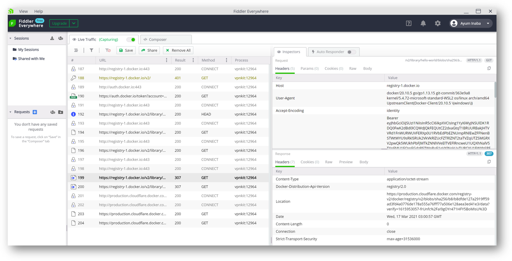

## はじめに

Azure Container Registry を使用する際のデータエンドポイント周りの通信ログを取りたかったので、
Fiddler を Proxy にしてやれば取れるだろと思ったら微妙に設定ではまったのでここに記録します。

## 前提条件

私が試して成功した環境は以下になります。つかってるツールや環境が異なると動かないかもしれないので。
この記事執筆時点（2021-03-17）での最新だと思います。

- Windows 10 Version 20H2, OS Build 19042.867
- Docker Desktop for Windows Version 2.2.2(61853) - WSL Integration enabled
- Fiddler Everywhere Version 1.5.1

## Fiddler のセットアップ

まずは Fiddler のインストールです。
[公式サイト](https://www.telerik.com/fiddler)
からインストーラをダウンロード、アカウントを作成、Fiddler を起動すると、
システムプロキシが以下のように設定されます。


Fiddler は `127.0.0.1:8866` で待ち受けるプロキシサーバーとして動作していることが分かります。
Docker Daemon が勝手にこれを使ってくれればいいんですが、そうは行かないので Docker Daemon の方に設定してやります。
またこの設定そのままにしておくとシステムプロキシを利用するアプリケーション、主に Web ブラウザの通信ログが全部とれて邪魔なので、
不要な方はここでオフにしておくことをお勧めします。

## Docker Daemon のセットアップ

タスクバーに入っているクジラ（Moby Dock っていう名前なんですね）のアイコンを右クリックして設定画面を開きます。


この図のように `127.0.0.1:8866` を設定してやるだけかと思いきや、実はそうは行かなくて Docker Daemon が Proxy に接続を拒否されてしまいます。

```powershell
PS > docker pull hello-world

Using default tag: latest
Error response from daemon: Get https://registry-1.docker.io/v2/: proxyconnect tcp: dial tcp 127.0.0.1:8866: connect: connection refused
```

うーん、困りました。
いろいろ調べた結果 `host.docker.internal` というコンテナからホストを解決するための DNS があるらしく、これを試したらうまく行きました。
ドキュメントの記述では　**コンテナからホストへの通信** て書いてあるけど、Docker Daemon もこれを使うってことなのかしら。
つまり以下のような設定になります。


この状況で先ほどと同じコマンドを実行すると無事に通信が通ります。

```powershell
PS > docker pull hello-world

Using default tag: latest
latest: Pulling from library/hello-world
b8dfde127a29: Pull complete
Digest: sha256:308866a43596e83578c7dfa15e27a73011bdd402185a84c5cd7f32a88b501a24
Status: Downloaded newer image for hello-world:latest
docker.io/library/hello-world:latest
```

Fiddler 側で取れたキャプチャがこちらになります。
いろいろと通信してるんですね（当たり前か）

