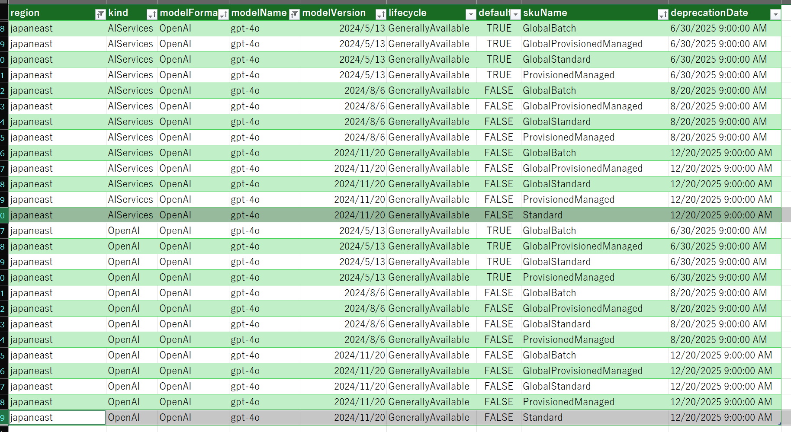
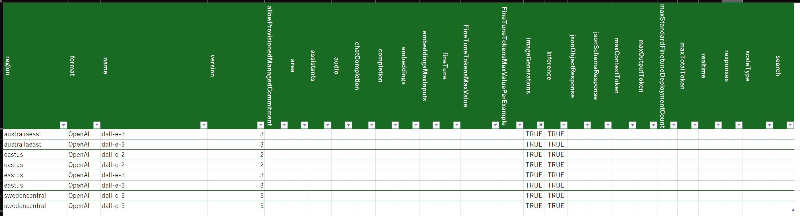
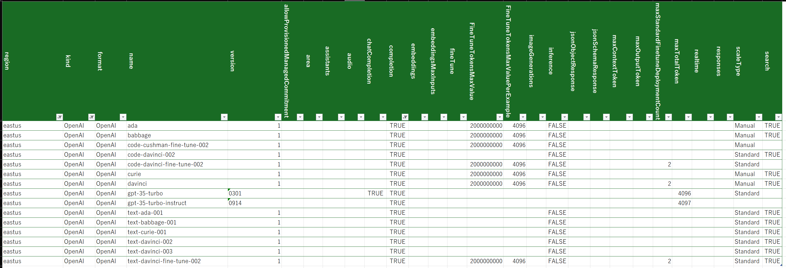

# はじめに

Azure で利用できる OpenAI のモデルについては [こちら](https://learn.microsoft.com/ja-jp/azure/ai-services/openai/concepts/models?tabs=global-standard%2Cstandard-chat-completions) のドキュメントに記載があるわけですが、
どの機能がどのモデルのどのバージョンに搭載されていてどのリージョンで使うことが出来るのかが極めて分かりにくいなと思っています。
日本語版は更新が遅いこともありますし、英語版でも最新状態が反映されていないタイミングもあったりしますし、そもそもドキュメントにミスがあるというケースもあり得ます。
困ったもんです。

まあこの辺りは自然言語で書かれるドキュメントの限界かなという面もありますので、だったら実際の Azure 環境から調査しちゃえばいいじゃんというのがこの記事の発端です。

# 本題

Azure サブスクリプションが利用できる方であれば [`az cognitiveservices model` コマンド](https://learn.microsoft.com/en-us/cli/azure/cognitiveservices/model?view=azure-cli-latest) を利用することで、指定したリージョンで利用可能なモデルの一覧が取得可能です。
以降ではこのコマンドで取得する情報を元にいろいろと分析してみるサンプルを紹介します。

## モデルの情報を取得する

まずはそもそもどんな情報が取れるのか確認してみましょう。

```powershell
az cognitiveservices model list -l japaneast 
```

実行すると各モデルの情報が json の配列形式で取得できます。
その中から例えば１つ抜粋したものが以下のようになります（長いので一部抜粋）

```json
{
    "kind": "OpenAI",
    "model": {
      "baseModel": null,
      "callRateLimit": null,
      "capabilities": {
        "FineTuneTokensMaxValue": "2000000000",
        "FineTuneTokensMaxValuePerExample": "131072",
        "allowProvisionedManagedCommitment": "true",
        "area": "US",
        "assistants": "true",
        "chatCompletion": "true",
        "jsonObjectResponse": "true",
        "maxContextToken": "128000",
        "maxOutputToken": "4096",
        "responses": "true"
      },
      "deprecation": {
        "fineTune": "2025-06-30T00:00:00Z",
        "inference": "2025-06-30T00:00:00Z"
      },
      "finetuneCapabilities": null,
      "format": "OpenAI",
      "isDefaultVersion": true,
      "lifecycleStatus": "GenerallyAvailable",
      "maxCapacity": 3,
      "name": "gpt-4o",
      "skus": [
        {
          "capacity": {
            "default": 10,
            "maximum": 1000000,
            "minimum": null,
            "step": null
          },
          "deprecationDate": "2025-06-30T09:00:00+09:00",
          "name": "Standard",
          "rateLimits": [
            {
              "count": 1.0,
              "key": "request",
              "renewalPeriod": 10.0,
              "rules": null
            },
            {
              "count": 1000.0,
              "key": "token",
              "renewalPeriod": 60.0,
              "rules": null
            }
          ],
          "usageName": "OpenAI.Standard.gpt-4o"
        },
        {
          "capacity": {
            "default": 10,
            "maximum": 1000000,
            "minimum": null,
            "step": null
          },
          "deprecationDate": "2025-06-30T09:00:00+09:00",
          "name": "GlobalStandard",
          "rateLimits": [
            {
              "count": 1.0,
              "key": "request",
              "renewalPeriod": 10.0,
              "rules": null
            },
            {
              "count": 1000.0,
              "key": "token",
              "renewalPeriod": 60.0,
              "rules": null
            }
          ],
          "usageName": "OpenAI.GlobalStandard.gpt-4o"
        }
      ],
      "source": null,
      "systemData": {
        "createdAt": "2024-05-13T09:00:00+09:00",
        "createdBy": "Microsoft",
        "createdByType": "Application",
        "lastModifiedAt": "2024-08-21T09:00:00+09:00",
        "lastModifiedBy": "Microsoft",
        "lastModifiedByType": "Application"
      },
      "version": "2024-05-13"
    },
    "skuName": "S0",
}
```

この json の構造から以下のようなことが分かります。

- モデルの基本的な情報は `model.format`, `model.name`, `model.version` あたりから取れそう
- 該当モデルで利用できる機能は `model.capabilities` から取れそう
    - 名前から推測するに Chat Completion、 JSON 出力、Assistant API あたりには対応していることが確認出来る
    - ただし利用できない機能はプロパティ自体が存在しない（上記の例だと `imageGeneration` が定義されていない）
- 対応するデプロイモデルに関する情報は `model.skus` あたりから確認できそう
- 上記は OpenAI だが、MaaS や AI Service の情報も取れている（`kind` プロパティ）

つまり各リージョンに対して情報を取得し、その json の中から必要な情報を抽出していけば調査が出来そうですね。

## 全リージョンのモデル情報を取得する

それではとりあえず Azure の全リージョンの情報を集めてきましょう。
データとしては膨大な量になりますし、Azure Resource Manager にあまり迷惑をかけても申し訳ないので、
各リージョン単位でファイル出力しておき、その後はファイルの情報を元に解析をしていくこととします。

なお json をひたすら処理することになるのでお好みのプログラミング言語を利用すれば良いわけですが、
私は PowerShell が好きなので、移行のサンプルは PowerShell から Azure CLI を叩いています。

```powershell
# Azure のリージョン一覧を取得
$regions = az account list-locations --query [].name -o tsv

# 特定チージョンを対象にしたい場合は名前の配列を用意
# $regions = @('japaneast', 'eastus', 'swedencentral')

# 各リージョンのモデル情報を取得して json ファイルに出力
$idx = 1
$regions | foreach {
    $json = $null
    write-host ("[{0:00}/{1:00}] Getting models for {2} " -f $idx++, $regions.Length, $_)
    try {
        $json = az cognitiveservices model list -l $_ 
    } catch {
        # 一部対応していないリージョンはエラーになるので処理をスキップ
        write-host ("Error getting models for {0}: {1}" -f $_, $_.Exception.Message)
    }

    if($json -ne $null) {
        $models = $json | ConvertFrom-Json
        if($models.length -gt 0) {
            $json | Out-File -FilePath "./models/$($_).json" -Encoding utf8 
        } else {
            # 空の配列が出る場合もあるのでファイル出力せずにスキップ
            Write-Host ("No models found for region: {0}" -f $_)
        }
    }
}
```

本記事執筆時（2025 年 4 月 10 日）に私の Azure サブスクリプションを使用して出力したファイルをいくつか以下においてあります。
- [japaneast](./models/japaneast.json)
- [swedencentral](./models/swedencentral.json)
- [westus2](./models/westus2.json)

なお、この情報は間違いなくすぐに古くなりますので参考程度にご利用いただき、実際には皆さん自身の環境で情報を取得してくださいね。

## 集計してみる

出力しておいた json ファイルを読み込んで、各リージョンのモデル数を数えてみましょう。

```powershell
# 全ファイルを読み込んでオブジェクトに変換、リージョン情報を付与して $model 配列に格納しておく
Get-ChildItem -Path "./models" -Filter "*.json" `
    | foreach {
        Get-Content -Path $_.FullName `
            | ConvertFrom-Json `
            | Add-Member -NotePropertyName 'region' -NotePropertyValue $_.Name.Split(".")[0] -PassThru } `
    | sv models

# リージョン名でグループ化して数を数える
$models | Group-Object -Property region | foreach {
    Write-Host ("{0} models in {1}" -f $_.Count, $_.Name)
}
```

出力結果は以下のようになりました（抜粋）

```powershell
228 models in australiaeast
222 models in brazilsouth
206 models in canadacentral
222 models in canadaeast
89 models in centralus
...
```

## どのリージョンにどのモデルが配置できるのか？

おそらくまず欲しいのは各リージョンで利用できるモデルとバージョンの一覧じゃないでしょうか。
以下のスクリプトでは `model` プロパティの配列を展開 `-ExpandProperty` して取得しています。
また合わせて `model.sku` プロパティも展開することでデプロイメントモデルも取得しています。

```powershell
# 後述の select -ExpandProperty を使用すると select 前のオブジェクトが変更されるため、毎回ファイルから読み込むようにすると良い
Get-ChildItem -Path "./models" -Filter "*.json" `
    | foreach {
        Get-Content -Path $_.FullName `
            | ConvertFrom-Json `
            | Add-Member -NotePropertyName 'region' -NotePropertyValue $_.Name.Split(".")[0] -PassThru 
} | sv models

# select -ExpandProperty を使用して model.skus まで展開して一覧を取得
$models
    | select region, kind -ExpandProperty model `
    | select region, kind, @{l='modelFormat';e={$_.format}}, @{l='modelName';e={$_.name}}, @{l='modelVersion'; e={$_.version}}, @{l='lifecycle';e={$_.lifecycleStatus}}, @{l='default';e={$_.isDefaultVersion}} -ExpandProperty skus `
    | select region, kind, modelFormat, modelName, modelVersion, lifecycle, default, @{l='skuName';e={$_.name}}, @{l='deprecationDate ';e={$_.deprecationDate }} `
    | sort-object region, kind, modelName, modelVersion `
    | sv output

# 画面に表示しても見にくいので csv 等に出力しておく
$output | Format-Table | Out-String -Width 4096
$output | Export-Csv -Path "modelList.csv" 
```

本記事執筆時点のデータ [modelList.csv](./modelList.csv) も配置しておきましたので参考までに。

データ量が多いので CSV ファイルを Excel 等で表示すると分析も容易でしょう。
~~モデルバージョンを勝手に日付に変更するとか余計なことをする件に関しては目をつむります。~~
以下は東日本の gpt-4o モデルでフィルターしたところですが、
最新版の `2024-11-20` バージョンで通常の Standard デプロイメント モデルに対応したことが分かりますね。



## 利用できる機能の一覧

さて各モデルが対応している機能は `model.capabilities` プロパティで確認できるのですが、その対応していない機能はプロパティ自体が無いので、そもそもどんなフィルターがかけられるのかが分かりにくいです。
なので、まずは全リージョン全モデルから `capabilities` をかき集めてみて辞書を作りたいと思います。

```powershell
# またファイルから読み込んで
Get-ChildItem -Path "./models" -Filter "*.json" `
    | foreach {
        Get-Content -Path $_.FullName `
            | ConvertFrom-Json `
            | Add-Member -NotePropertyName 'region' -NotePropertyValue $_.Name.Split(".")[0] -PassThru 
} | sv models

# capability の一覧から一意のモノだけを出力
$models `
    | select -ExpandProperty model `
    | select -ExpandProperty capabilities `
    | foreach { $_.psobject.properties.name} `
    | select -Unique `
    | sort-object `
    | sv capability_dictionary 
```

この結果は以下のようになります。

```csv
allowProvisionedManagedCommitment
area
assistants
audio
chatCompletion
completion
embeddings
embeddingsMaxInputs
fineTune
FineTuneTokensMaxValue
FineTuneTokensMaxValuePerExample
imageGenerations
inference
jsonObjectResponse
jsonSchemaResponse
maxContextToken
maxOutputToken
maxStandardFinetuneDeploymentCount
maxTotalToken
realtime
responses
scaleType
search
```

## 各モデルの機能対応表を作ってみる

さてこの一覧を使って各モデルがサポートする機能の対応表を作ってみましょう。

```powershell
# またファイルから読み込んで
Get-ChildItem -Path "./models" -Filter "*.json" `
    | foreach {
        Get-Content -Path $_.FullName `
            | ConvertFrom-Json `
            | Add-Member -NotePropertyName 'region' -NotePropertyValue $_.Name.Split(".")[0] -PassThru 
} | sv models

# 各モデルに対して機能辞書のプロパティを出力（無い場合は null になる）
$models `
    | select region, kind -ExpandProperty model `
    | select region, kind, format, name, version -ExpandProperty capabilities `
    | select (@('region', 'kind', 'format', 'name', 'version') + $capability_dictionary) `
    | sort region, kind, format, name, version `
    | sv model_capabilities 

# とりあえず CSV に
$model_capabilities | Export-Csv -Path "modelCapabilities.csv"
```

出力した CSV も参考までに [modelCapabilities.csv](./modelCapabilities.csv) においておきますので参考まで。


### 欲しい機能に対応したモデルを探す

この CSV をまたしても Excel で開いて画像生成 `imageGenerations` に対応したモデルと利用可能なリージョンを探してみると、非常に限定的なのが分かりますね。



最近あまり使わなくなった（Chatじゃない方の）Completion をサポートしているモデルを eastus リージョンで探してみると以下のようになります。
ada, babbage, curie, davinci などの懐かしい名前と共に、そういえば GPT 3.5 Turbo の頃は Chat Completion と Completion の両方に対応してたんだっけなあという気持ちになれます。




# まとめ

ドキュメントから読み取るのではなく実環境からデータを取ることで最新の情報を確実に確認することが出来ます。
この記事では一旦必要な情報をフラットに展開して CSV にして Excel で確認というアプローチを取りましたが、大元のデータ構造が分かってしまえば異なる確度での調査・分析が可能かと思います。
慣れてくれば公式ドキュメントで迷子になるより速いのではないでしょうか。
ただ Capability など、「何となく意味はわかるのですが、明確な定義の記載が見つけられていない」ものがありますので、詳細が気になる方は Azure サポートにお問い合わせいただくと良いのかなと思います。
