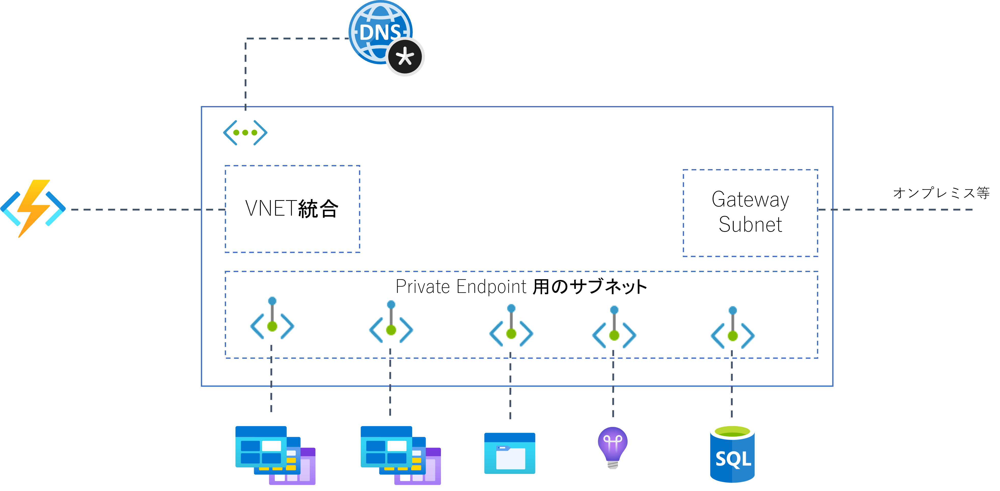
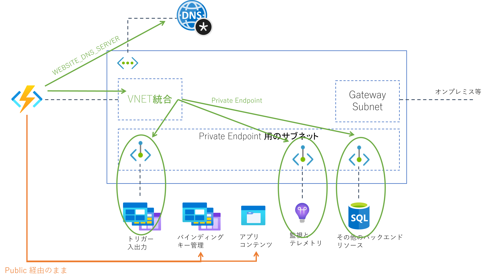
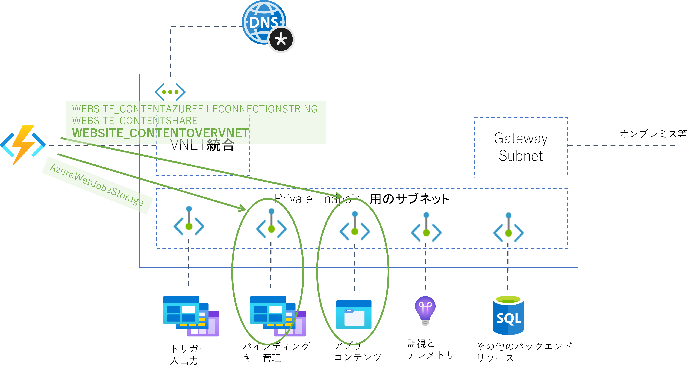

## はじめに

もうかなり前の話になりますが Azure WebApp がリージョン VNET 統合に対応し、リージョン内であれば VPN Gateway が不要になったため閉域構成はかなり楽になりました。
Azure Functions でも基盤は同じ App Service なのでまあ一緒だろうと思って高を括っていたのですが、実際に組んでみると地味にはまりました。。。
結論から言えば「どのような構成をすれば良いか？」の答えは大体以下に書いてありますので、本記事は解説編的な位置づけになります。
~~公式ドキュメント読んでも「なんでこんなことしているのか？」わからないんですもの・・・~~

- [しばやん雑記 - Azure Functions のストレージを VNET 経由に制限する機能が Preview になったので試した](https://blog.shibayan.jp/entry/20201101/1604214677)
- [Azure Functions のネットワーク オプション](https://docs.microsoft.com/ja-jp/azure/azure-functions/functions-networking-options)
- [Azure Functions のストレージに関する考慮事項](https://docs.microsoft.com/ja-jp/azure/azure-functions/storage-considerations)

## Azure Functions の依存関係を考える

Azure Functions をポータルからポチポチっと作成すると４つのリソース（Functions アプリ、App Service プラン、ストレージアカウント、Application Insights）が作られると思いますが、これらの役割を考えてみます。
図中でストレージアカウントを3つに分けて記載しているのは、既定で作成されるのは 1 つだけなのですが、設定内容と使われ方を解きほぐすと 3 つの役割に分けられ、分離することも可能だからです。

なお、以下ではホスティングプランは Elastic Premium プランを利用するものとして解説しています。
従量課金プランではそもそもVNET統合が設置できませんし、通常の占有型 App Service Plan であれば Elastic Premium プランよりも設定項目が少なくなります。


WebApp とは何が異なるのか、という意味では以下の 2 点、上の図で破線よりも下側の領域になります。

- Functions ランタイムの動作にストレージアカウント(Blob/Queue/Table)が必要になる
- 従量課金プランや Elastic Premium など占有のストレージがないプランではコンテンツを配置する Files が必要になる

逆に破線よりも上側、主にアプリケーションのレイヤで行われるリソースアクセスに関しては WebApp とあまり変わりがありません。


## 閉域化してみよう

さてストレージアカウントが Public IP アドレスを持ち、ネットワーク的にはインターネット経由でアクセス可能である、ということ（認証がかかっているとはいえ）許容できない方は一定数おられるように思います。
まあオンプレミス環境と接続された仮想ネットワークとそこに接続された各種リソースを活用することを考えれば、セキュリティポリシーの観点から閉域化する必要性もあるのでしょう。
せっかくストレージアカウントは Private Endpoint に対応しているんだから、仮想ネットワークに閉じ込めてしまえばいいじゃないか、というわけですね。



### ストレージアカウントのアップグレード

閉域化の前にストレージアカウントのバージョンを確認しましょう。
各種のストレージサービスに対して Private Endpoint を構成するには 汎用 V2 である必要があるのですが、
ポータルからポチポチと自動的に作られるストレージアカウントは現在のところ V1 のようです。
もし V1 のままであれば[こちらの手順](https://docs.microsoft.com/ja-jp/azure/storage/common/storage-account-upgrade?tabs=azure-portal) に従ってアップグレードしてください。
また Functions App が処理するデータを格納したストレージアカウントももしかしたら V1 になっているかもしれません。

### アプリ要件を満たす

まずは Functions App からの発信トラフィックを仮想ネットワークに引き込めるようにしましょう。
これはトリガーや入出力バインド（ないしはアプリ内のコード）から、ストレージアカウントなどのバックエンドリソースやオンプレミスリソースにアクセス可能にすることを意味します。

- Functions と仮想ネットワークを [Regional VNET 統合](https://docs.microsoft.com/ja-jp/azure/app-service/web-sites-integrate-with-vnet)で接続する
- ```functions.json``` 内で[トリガーや入出力バインド](https://docs.microsoft.com/ja-jp/azure/azure-functions/functions-triggers-bindings?tabs=csharp)で使用するリソースを特定する
- リソースにアクセスするための [Private Endpoint](https://docs.microsoft.com/ja-jp/azure/private-link/private-endpoint-overview) を設置する
- トリガーが BlobTrigger 等の「非 HTTP トリガー」である場合には[仮想ネットワークトリガー](https://docs.microsoft.com/ja-jp/azure/azure-functions/functions-networking-options#virtual-network-triggers-non-http)を有効化する
- アプリ構成で [WEBSITE_DNS_SERVER](https://docs.microsoft.com/ja-jp/azure/azure-functions/functions-app-settings#website_dns_server) を ```168.63.129.16``` に設定し、各バックエンドリソースの FQDN を仮想ネットワーク内の Private IP アドレスに解決する



```WEBSITE_DNS_SERVER``` 設定があることで FQDN は Private DNS Zone で Private IP アドレスに解決されるようになりますので、
VNET 統合を経由して仮想ネットワーク内にルーティングされます。
この Private IP アドレスは仮想ネットワーク内のアドレスレンジになってますので、Private Endpoint に到達できるわけですね。

さてこの状態でも Functions App は動作するのですが、バインド状態やアプリコンテンツを配置しているストレージへのアクセスは相変わらず Public IP アドレスを使用しています。
Azure バックボーンネットワーク内を経由しますので公衆インターネットを経由するわけではありませんし、
各種ストレージアカウントはアクセスキーなどがしっかり管理されていれば、不正なアクセスによるデータ漏洩のリスクは少ないでしょう。
しかしセキュリティポリシーが許さないというのであれば、これらも閉域化する必要があるのでしょう。

### Funcsions の動作要件を満たす

バインド状態やキー管理に使用されているのはやはり Blob ストレージですし、Durable Functions タスクハブ情報の管理に使用されるのは Queue や Table ストレージです。
これらのアクセスを仮想ネットワーク内に引き込みましょう。

- [AzureWebJobsStorage](https://docs.microsoft.com/ja-jp/azure/azure-functions/functions-app-settings#azurewebjobsstorage) に設定されているストレージアカウントを確認
- このストレージアカウント内にバインド状態/キー管理/タスクハブのための Blob/Queue/Table が格納されているので、閉域アクセスするための [Private Endpoint](https://docs.microsoft.com/ja-jp/azure/private-link/private-endpoint-overview) を設置

次にアプリコンテンツを格納する Files へのアクセスを仮想ネットワーク内に引き込みましょう。

- [WEBSITE_CONTENTOVERVNET](https://docs.microsoft.com/ja-jp/azure/azure-functions/functions-app-settings#website_contentovervnet) を ```1``` に設定して Files のマウントを仮想ネットワーク経由にする
- [WEBSITE_CONTENTAZUREFILECONNECTIONSTRING](https://docs.microsoft.com/ja-jp/azure/azure-functions/functions-app-settings#website_contentazurefileconnectionstring) の設定されているストレージアカウントを確認
- このストレージアカウントの Files サービスに対する [Private Endpoint](https://docs.microsoft.com/ja-jp/azure/private-link/private-endpoint-overview) を設置
- [WEBSITE_CONTENTSHARE](https://docs.microsoft.com/ja-jp/azure/azure-functions/functions-app-settings#website_contentshare) で指定された共有名にアプリコンテンツが設置される



### WEBSITE_VNET_ROUTE_ALL は？

Regional VNET 統合を使用して閉域化を目指す場合には多くの場合 [WEBSITE_VNET_ROUTE_ALL](https://docs.microsoft.com/ja-jp/azure/azure-functions/functions-app-settings#website_vnet_route_all) を設定するのですが、実はこの記事では設定していません。
ここまで紹介した内容でアクセスする対象リソースは Private Endpoint が使えるので、全て自動的に VNET 内にルーティングされるからです。
ただ「ストレージを閉域化したにも関わらずパブリック IP に好き勝手にアクセスしてよい」ということは多分無いと思いますので、
WEBSITE_VNET_ROUTE_ALL を設定して全てのトラフィックを仮想ネットワークにルーティングし、
そこからの Private Endpoint が設置できないサービスに対しては、サービスエンドポイントや Azure Firewall 等を使用した通信制御をご検討ください。
（本記事では割愛しています）