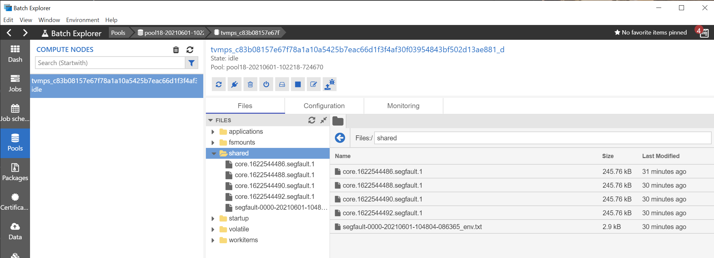

## はじめに

Docker コンテナ化されたアプリケーションとは言っても、名前空間を分離しただけの普通のプロセスらしいので、普通にこけるしコアダンプも吐きます。
ダンプが取れるならそれを取得してデバッグに役立てたいというのが人情でしょう。
整理してみると大した手順でも無いのですが、せっかく調べた内容をお蔵入りするのももったいないので供養のためにここに記します。

## まずはクラッシュするだけのアプリを作る

ダンプ採取する方法を調べるにしても、まずはクラッシュしてくれるアプリがないと話が始まりません。
というわけで Segmentation Fault を起こすアプリから作成します。

```cpp
#include <stdio.h>
int main()
{
   char *str;
 
   /* Stored in read only part of data segment */
   str = "GfG";    
 
   /* Problem:  trying to modify read only memory */
   *(str+1) = 'n';
   return 0;
}
```

このアプリをコンパイルして実行すると Segmentation Fault が発生することが分かります。

```bash
# コンパイル
$ gcc hoge.c -g -o ./segfault

# 実行
$ ./segfault
Segmentation fault
```

まずはこのままコンテナを使わずにホスト側でコアダンプを取得してみましょう。

```bash
# 出力先の指定
$ mkdir /tmp/dumps
$ sudo sysctl -w kernel.core_pattern="/tmp/dumps/core.%t.%e.%p"

# コアダンプファイルの出力サイズ
$ ulimit -c unlimited
```

この状態でアプリを実行すればダンプが出るはずです。

```bash
# 実行
$ ./segfault
Segmentation fault (core dumped)

# 出力先の確認
$ cat /proc/sys/kernel/core_pattern
/tmp/dumps/core.%t.%e.%p

# ファイルの確認
$  ls -la /tmp/dumps
total 344
drwxrwxr-x  2 ayumu ayumu   4096 Jun  4 07:47 .
drwxrwxrwt 12 root  root    4096 Jun  4 07:47 ..
-rw-------  1 ayumu ayumu 262144 Jun  4 07:29 core.1622791750.segfault.3175

# デバッグ
$ gdb ./segfault /tmp/dumps/core.1622791750.segfault.3175 
GNU gdb (Ubuntu 9.2-0ubuntu2) 9.2
Copyright (C) 2020 Free Software Foundation, Inc.
License GPLv3+: GNU GPL version 3 or later <http://gnu.org/licenses/gpl.html>
This is free software: you are free to change and redistribute it.
There is NO WARRANTY, to the extent permitted by law.
Type "show copying" and "show warranty" for details.
This GDB was configured as "x86_64-linux-gnu".
Type "show configuration" for configuration details.
For bug reporting instructions, please see:
<http://www.gnu.org/software/gdb/bugs/>.
Find the GDB manual and other documentation resources online at:
    <http://www.gnu.org/software/gdb/documentation/>.

For help, type "help".
Type "apropos word" to search for commands related to "word"...
Reading symbols from ./segfault...
[New LWP 3175]
Core was generated by `./segfault'.
Program terminated with signal SIGSEGV, Segmentation fault.
#0  main () at ./hoge.c:11
11         *(str+1) = 'n';
```

## コンテナ化と実行とデバッグ

先ほど作った C のアプリをコンテナ化するための Dockerfile は下記のようになります。

```Dockerfile
FROM ubuntu:focal as builder
WORKDIR /src
RUN apt-get update -y && apt-get install -y build-essential
COPY ./hoge.c .
RUN gcc hoge.c -g -o ./segfault

FROM centos:8
WORKDIR /app
COPY --from=builder /src/segfault .
```

これをビルドして実行してみましょう。

```bash
# コンテナをビルドしてシェルを実行
[host-machine]$ sudo docker build -t segfault-demo .
[host-machine]$ sudo docker run -it --rm segfault-demo /bin/bash

# アプリを実行（ダンプが出ていない）
[app-container]$ ./segfault
Segmentation fault

# 出力先等を確認
[app-container]$ cat /proc/sys/kernel/core_pattern 
/tmp/dumps/core.%t.%e.%p

[app-container]$ ls /tmp/dumps
ls: cannot access '/tmp/dumps': No such file or directory
```

ホスト側で ```/proc/sys/kernel/core_pattern``` に設定したコアダンプ出力先は、コンテナ内にも反映されてることが分かります。
これはホストとコンテナでカーネルを共有しているからですね。

しかしホスト側で作成した出力先ディレクトリはコンテナ側からは見えません。
これはホストとコンテナではファイルシステムが分かれているためなので、このまではコンテナ内からはコアダンプを書き込めないわけです。
逆に言えば、ホスト側と同じパスになるようにボリュームマウントしてコンテナを起動してやれば良いわけです。

```bash
# 同じパスになるようにボリュームをマウント
[host-machine]$ sudo docker run -it --rm -v /tmp/dumps:/tmp/dumps segfault-demo /bin/bash

# アプリを実行（コアダンプを吐いている）
[app-container]$ ./segfault
Segmentation fault (core dumped)

# 出力先等を確認
[app-container]$ cat /proc/sys/kernel/core_pattern 
/tmp/dumps/core.%t.%e.%p

[app-container]$ ls -la /tmp/dumps
total 344
drwxrwxr-x 2 1000 1000   4096 Jun  4 07:47 .
drwxrwxrwt 1 root root   4096 Jun  4 07:47 ..
-rw------- 1 1000 1000 262144 Jun  4 07:29 core.1622791750.segfault.3175
-rw------- 1 root root 253952 Jun  4 07:47 core.1622792878.segfault.15
```

ホストと同じディレクトリを同じパスでマウントしているため、先ほどホスト側で出力したコアダンプも見えています。
もちろんホスト側から見れば、コンテナ内で出力したコアダンプも見えるわけです。
コアダンプが取り出せましたので後は適宜デバッグしてあげればいいわけです。

なお上記ではホスト側で ulimit を設定していますが、docker run にも [--ulimit オプション](http://docs.docker.jp/engine/reference/commandline/run.html#ulimits-ulimit)が指定できます。
つまりコンテナ起動ごとに出力有無を切り替えることが可能なので、闇雲にコアダンプが出力してストレージを圧迫する事故は防げるのではないでしょうか。

```bash
[host-machine]$ sudo docker run --rm --ulimit core=-1 -v /tmp/dumps:/tmp/dumps segfault-demo /app/segfault
```

## 参考資料など

私自身は曲がりなりにも目的を果たせましたが、そもそもは様々な Blog の記載をつぎはぎしただけなので、インターネットとそこに知見を残してくれた先駆者には感謝しかありません。

- [Core Dump File inside Docker](https://le.qun.ch/en/blog/core-dump-file-in-docker/)
- [Core Dump (Segmentation fault) in C/C++](https://www.geeksforgeeks.org/core-dump-segmentation-fault-c-cpp/)


## Azure Batch のコンテナタスクのクラッシュダンプ

実は Azure Batch 環境で大量に並列稼働している計算ノードにてアプリがクラッシュが発生した際のダンプが取りたいってのが元々のお題でした。
やり方を調べてるうちにほぼキモになる部分は Azure Batch に関係なく、Linux や Docker の世界だったので上記のようにまとめてみました。
その方が汎用性もあるでしょうし。
とはいえ Azure Batch のコンテナタスクでもコアダンプを取る方法もここに記載しておきます。

### コアダンプの出力先設定

まずプール開始タスクでコアダンプの出力先を指定するとよいでしょう。

- [プール開始タスク](https://docs.microsoft.com/ja-jp/azure/batch/jobs-and-tasks#start-task) はホスト上で直接実行される（非コンテナ）タスクであり、かつ、プールにノードが追加されるときに必ず一度だけ実行されるため、仕掛けるタイミングとしてはここが最適
- 出力先の設定変更には特権が必要のため[プール開始タスクの実行ユーザーを Admin に昇格して実行する](https://docs.microsoft.com/ja-jp/azure/batch/batch-user-accounts#elevated-access-for-tasks)必要がある
- 出力先には[タスク間共有ディレクトリ $AZ_BATCH_NODE_SHARED_DIR](https://docs.microsoft.com/ja-jp/azure/batch/files-and-directories) など、ホスト側（プール開始タスク）と各コンテナ側（通常のタスク）から同じパスで参照できる場所を指定するとよい

以上により、プール開始タスクは以下のようなコマンドラインを持つことになります。

```bash
$ /bin/bash -c 'sudo sysctl -w kernel.core_pattern="$AZ_BATCH_NODE_SHARED_DIR/core.%t.%e.%p" '
```

### コアダンプサイズの指定

普段から ulimit フラグを unlimited にしておくとディレクトリを圧迫しかねないので、ダンプ採取が必要となったら設定を追加すると良いでしょう。コンテナタスク実行時には [docker create と同じオプション](https://docs.microsoft.com/ja-jp/azure/batch/batch-docker-container-workloads#container-task-command-line) を指定することができるので、```--ulimit core=-1``` を追加してあげてください。


### コアダンプファイルの回収

出力されたコアダンプは Azure Batch Explorer で採取するのが簡単だと思います。
プール画面からコアダンプを吐いたはずの計算ノードを探り当て、Files タブを開くと ```shared``` といおうディレクトリが参照できます。
ここはこのノード上で動作する全てのタスクから ```$AZ_BATCH_NODE_SHARED_DIR``` で参照できる位置になっています。



