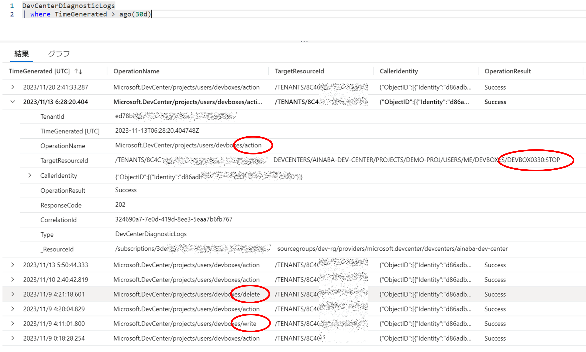
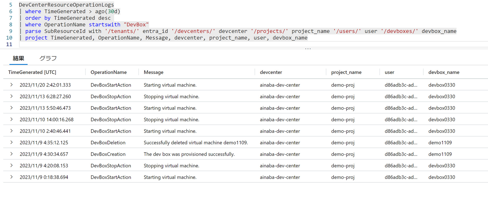
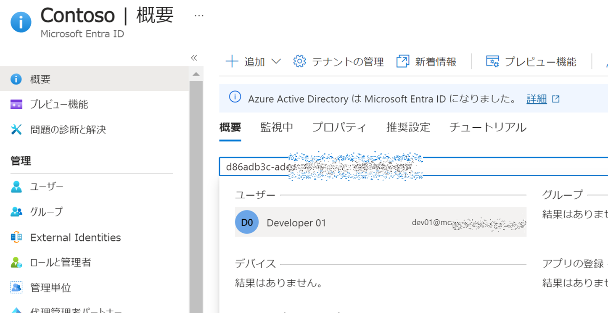
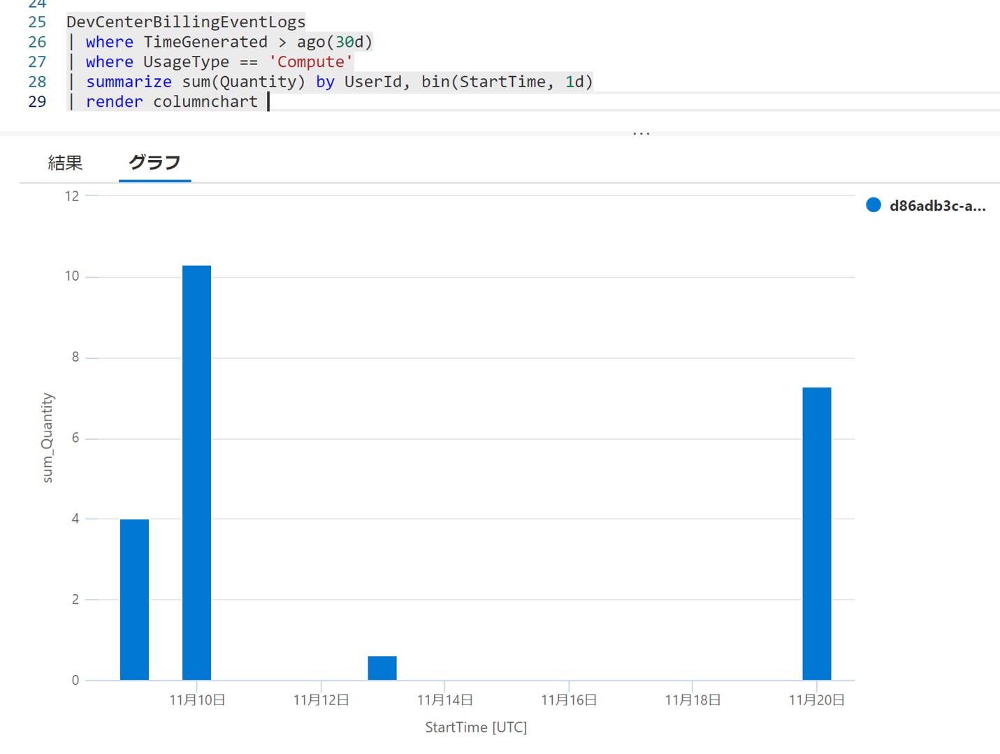
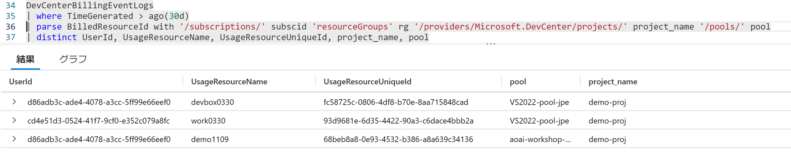
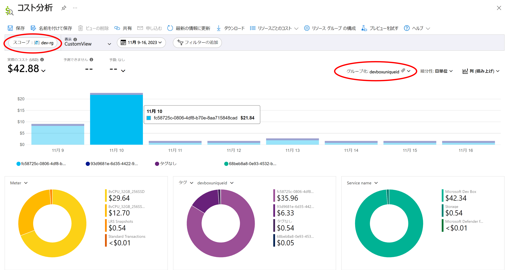
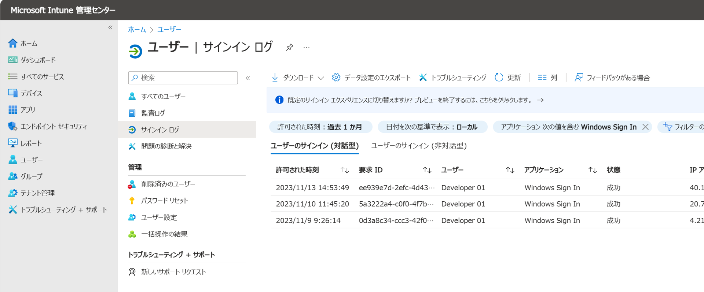

# はじめに

Microsoft Dev Box もその他の PaaS サービスと同様に [診断ログ](https://learn.microsoft.com/en-us/azure/dev-box/how-to-configure-dev-box-azure-diagnostic-logs) を構成することで、ユーザーによるデータプレーン操作のログが取得可能です。
データプレーンというとわかりにくいですが、要は Dev Box （仮想マシン）の作成・削除や起動・停止といったログです。
だれが、いつ、どんな操作を行ったかといった情報は、管理者としては把握しておきたいですよね。

ただ実際にこれ以外にも代表的な監査視点としては以下のようなものがあるのではないでしょうか。

- Dev Box ポータルへのサインインのログ
- Dev Box 仮想マシンへのサインインのログ
- Dev Box 仮想マシンの利用量や料金

これらの情報の取得方法が記載された公式ドキュメントが現状見当たらないのですが、いろいろ触っていたら分かってきたことがあるのでまとめておきます。
いずれこういった情報も出そろってくるのではないかと思いますが、取り急ぎ。

# まずは公式情報の内容を確認

上記の診断ログのドキュメントですと `DevCenterDiagnosticLogs` というテーブルに関して記述があり、そのスキーマの説明は下記に記載があります。

- [Microsoft DevCenter データの監視のリファレンス](https://learn.microsoft.com/ja-jp/azure/dev-box/monitor-reference)
- [DevCenterDiagnosticLogs テーブル](https://learn.microsoft.com/ja-jp/azure/azure-monitor/reference/tables/devcenterdiagnosticlogs)

これらを見ると上記の情報が割と取れるんじゃないかと期待が膨らみますが、実際にクエリをかけてみるとちょっと残念な気持ちです。

- OperationName が write は作成、delete は削除であろうことは分かるが、action は何してるか分からない
- TargetResourceId の最後のスラッシュ `/` 以降を見ると Dev Box の名前や操作内容が分かる（分かりにくい）



# 他にもテーブルがあるぞ？

リファレンスの他のページや Log Analytics Workspace をよく見ると、もう少し良さそうなテーブルがあることが分かります。

- [DevCenterBillingEventLogs テーブル](https://learn.microsoft.com/ja-jp/azure/azure-monitor/reference/tables/devcenterbillingeventlogs)
    - _DevCenter リソースに関連する課金イベント。 ログには、メーターごとに課金される数量と単位に関する情報が含まれています。_
- [DevCenterResourceOperationLogs テーブル](https://learn.microsoft.com/ja-jp/azure/azure-monitor/reference/tables/devcenterresourceoperationlogs)
    - _リソースの正常性状態の変更に関する情報など、DevCenter リソースに関連する操作ログ。_

ちょっとこちらも見てみましょう。


## まずは操作系のログが取りたい

改めて各 Dev Box 仮想マシン単位のライフサイクルを考えると、全体として`作成・削除`があり、その間に`起動・停止`が複数回繰り替えさえるのが一般的だと思います。
この辺りの情報取得は `DevCenterResourceOperationLogs` テーブルの方が使い勝手が良さそうでした。
ただ対象となる Dev Box VM の名前、Dev Center プロジェクトの名前、ユーザー情報は `SubResourceId` をパースしてやらないと分からなさそうです。

```kusto
DevCenterResourceOperationLogs
| where OperationName startswith "DevBox"
| parse SubResourceId with '/tenants/' entra_id '/devcenters/' devcenter '/projects/' project_name '/users/' user '/devboxes/' devbox_name
| project TimeGenerated, OperationName, Message, devcenter, project_name, user, devbox_name
| order by TimeGenerated desc 
```




ここで出ている user は Microsoft Entra ID で管理されたユーザーのオブジェクト ID です。
人間に易しい名前ではないのが残念ですが、下記のコマンドで確認できます。

```bash
az ad user show --id guid-of-user-objectid
```

```json      
{
  "@odata.context": "https://graph.microsoft.com/v1.0/$metadata#users/$entity",
  "businessPhones": [],
  "displayName": "Developer 01",
  "givenName": "01",
  "id": "xxxxxxxx-xxxx-xxxx-xxxx-xxxxxxxxxxxx",
  "jobTitle": null,
  "mail": "userName@mail.example.com",
  "mobilePhone": null,
  "officeLocation": null,
  "preferredLanguage": null,
  "surname": "Developer",
  "userPrincipalName": "userName@example.com"
}
```

あるいは Azure ポータルの Microsoft Entra ID 管理画面で、ユーザーのオブジェクト ID を検索しても確認できます。



## 利用時間が知りたい

上記のログから各種イベントは把握できるのですが、課金に直結する利用時間（起動～停止）に関しては工夫が必要になりますし、そもそも DevBox のサイズが分かりません（Dev Box 定義やプールの情報が分からないため）。
そうすると `DevCenterBillingEventLogs` テーブルの名前が魅力的ですので、こちらにもクエリをかけてみましょう。

ざっと見た感じだと以下の基準で集計できそうです。

- `UsageResourceName` が Dev Box の名前 になっている
- `UsageType` は `Compute` と `Storage` で分類できる
- `StartTime` から `EndTime` の 1 時間間隔でレコードが記録されている
- その間の利用量は `Quantity` で、単位は `UnitType` で分かる
- 直接的な金額は分からない(残念)

例えば各ユーザーの 1 日当たりの Dev Box 利用時間（インスタンスの区別はなし）は以下のように確認できます。
使いすぎには気を付けましょう。

```kusto
DevCenterBillingEventLogs
| where UsageType == 'Compute'
| summarize sum(Quantity) by UserId, bin(StartTime, 1d)
| render columnchart 
```



## 誰がどのマシンを管理しているか

この `DevCenterBillingEventLogs` テーブルから直接的な金額は分からないのですが、この後の Cost Management で確認する際には、このテーブルから得られる `UsageResourceUniqueId` が有用です。

```kusto
DevCenterBillingEventLogs
| parse BilledResourceId with '/subscriptions/' subscid 'resourceGroups' rg '/providers/Microsoft.DevCenter/projects/' project_name '/pools/' pool
| distinct UserId, UsageResourceName, UsageResourceUniqueId, project_name, pool
```



# 結局いくらかかっているのか？

監査や監視する上で大事なのはやはり課金額ですが、これは Azure Portal の Cost Management から確認できます。
各 Dev Box 仮想マシンから発生した課金額には `devboxuniqueid` というリソースタグが付与されているのですが、これは `DevCenterBillingEventLogs` テーブルの `UsageResourceUniqueId` と一致します。

よって、確認手順は以下のようになります。

- Azure Portal で Cost Management を開く（サブスクリプションのメニューから `コスト分析` を開く）
- スコープで Dev Box を管理している Azure Dev Center リソースを含むリソースグループを選択する
- グループ化の項目として タグ > devboxuniqueid を選択する




# サインイン ログ

ここまではあくまでも Azure リソースの観点から見たログですので、実際にユーザーがサインインしたかどうかまでは分かりません。
下記のいずれかを開き、`ユーザー` メニューから `サインイン ログ` を開くと、様々なアプリケーションへのサインイン履歴が確認できます。

- [Azure ポータル](https://portal.azure.com) の Microsoft Entra ID 管理画面
- [Microsoft Entra 管理センター](https://entra.microsoft.com/)
- [Intune 管理センター](https://intune.microsoft.com/)

Dev Box 関連でいうと下記の２つが代表的な確認ポイントになると思います。

- [Developer ポータル](https://devportal.microsoft.com/) へのサインインは `Microsoft Developer Portal` というアプリケーションでフィルターして確認できます
- Dev Box 仮想マシンを含む Windows デバイスへのサインインは `Windows Sign In` というアプリケーションでフィルターして確認できます

下記は Intune 管理センターの画面ですが、Azure ポータルや Entra 管理センターでもほぼ同様の手順になります。

