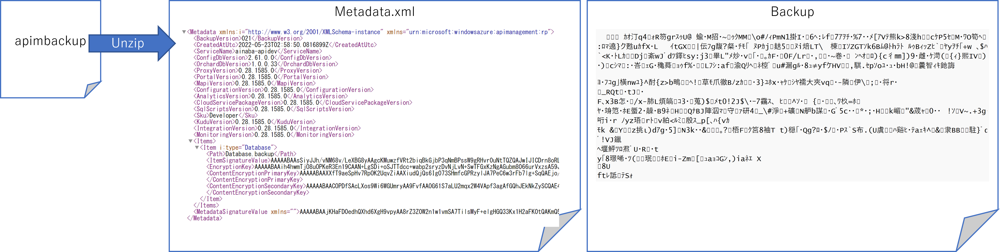
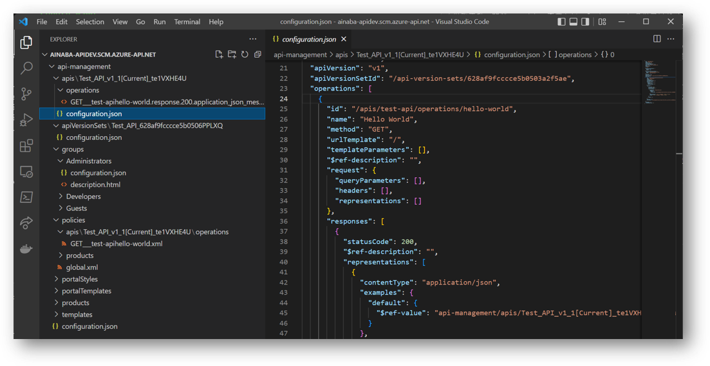
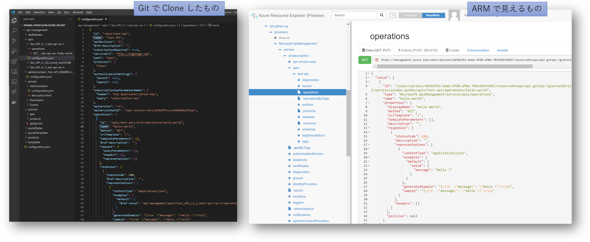

## はじめに

Azure API Management には
[バージョン](https://docs.microsoft.com/ja-jp/azure/api-management/api-management-versions)
と
[リビジョン](https://docs.microsoft.com/ja-jp/azure/api-management/api-management-revisions)
という変更を安全に適用するための機能が備わっています。
が、実際触ってみると分かると思うのですが、割とあっさり API が壊れます。
なぜかというと、新しいリビジョンを作成してから修正を加えるとか、新しいバージョンを作成してから変更するという作業をやり忘れるからです。

もちろんこれは私の不注意に起因する問題ではあるのですが、これが本番環境だったらと思うと割と夜も眠れません。
人間は間違う生き物なので、その注意深さに依存したプロセスには限界がありますから、もう少し安全な仕組みが必要ですよね。
というわけで DevOps です。
さてそのやり方は [Docs にも紹介されている](https://docs.microsoft.com/ja-jp/azure/api-management/devops-api-development-templates) のですが、
個人的には超絶分かりにくかったので、試して整理してみねば、というのが本記事の趣旨になります。

## 前提知識として

具体的に DevOps を試す前段階として、いくつか情報を整理しておきたいと思います。
要は以下の２つが両立できれば良いわけですから、何も DevOps に拘る必要はありません。

- 好き放題に壊しても構わない開発環境で生産性を高める
- 開発環境の成果を本番環境に対して安全に適用する


### 開発環境の Backup と本番環境への Resotre で出来ないか？

API Management には[バックアップとリストア](https://docs.microsoft.com/ja-jp/azure/api-management/api-management-howto-disaster-recovery-backup-restore) の機能もありますので、
開発環境で出来上がった設定内容をバックアップして、それを本番環境に適用してもよいわけです。
なぜかドキュメントでは OAuth 2.0 のアクセストークンをとって REST API をゴリゴリたたいていくアプローチですが、
ちゃんと以下の様なコマンドも用意されています。

- [Backup-AzApiManagement](https://docs.microsoft.com/en-us/powershell/module/az.apimanagement/backup-azapimanagement)
- [Restore-AzApiManagement](https://docs.microsoft.com/en-us/powershell/module/az.apimanagement/restore-azapimanagement)

開発環境の API Management で設定した情報をストレージアカウントにバックアップして、そこに保存されたファイルをテストや本番環境などにリストアすれば良いわけです。
実際に作ってみた [スクリプト](./ops-apim.ps1) も置いておきましたが、バックアップもリストアもせいぜい数行で済むレベルです。
が、これだといくつか難点があります。

まずは開発環境でのうっかりミスまで本番環境に反映されてしまうことでしょうか。
もちろん通常はテスト環境などにデプロイして「テストが通ったら本番環境に適用」というプロセスがあると思いますので、実害は無いのかもしれません。
とはいえ、人間が見ても差分がわかりにくいというのは問題でしょう。
実際にバックアップを取ってみたファイル（既定では apibackup という拡張子で実態は zip ファイル）を解凍してみると、２つのファイルが出てきます。
片方はメタデータの XML で、もう１つはバイナリファイルでした。
後者のフォーマットが分かればどうにかなるかもしれませんが、複雑な API 定義やポリシーをブラックボックス的に扱うのはやはり不安です。



また [バックアップとリストアのドキュメント](https://docs.microsoft.com/ja-jp/azure/api-management/api-management-howto-disaster-recovery-backup-restore)
にも記載があるのですが、開発・テスト・本番といったステージングのプロセスを進めるうえでは下記が致命的だと思います。
開発用に使っているサブスクリプションキーを使用して本番環境の API を呼び出せるとか大問題ですよね。

> また、バックアップおよび復元操作は、開発やステージングなど、運用環境間の API Management サービス構成のレプリケートで使用できます.
ユーザーやサブスクリプションなどのランタイム データも同様にコピーされ、望ましくない場合もあることに注意してください。

とはいえバックアップとリストアの機能は無駄ではありません。
上記のドキュメントにあるように災害対策の様な「独立したクローン」を複数持ちたい場合に使用するのはもちろん、
開発環境を壊したときに元に戻すとか、テスト環境で本番リリースがＮＧになった時に戻すといったような、各環境の保全の機能として利用してください。
（そもそもバックアップ・リストアってそのための機能ですし）

### Git Repository が使えるのでは？

API Management には [Git を使用した構成管理](https://docs.microsoft.com/ja-jp/azure/api-management/api-management-configuration-repository-git) の機能が提供されています。
Git なら差分も取れますし前述のバックアップ・リストアよりもホワイトボックスに扱えそうですよね。

が、こちらも実は問題がありまして、ローカルに git clone したディレクトリ構造を開いて見たのが下図になるのですが、良くわからない参照 ID のようなモノがそこら中にちりばめられています。
正直どこを修正すれば何ができるのか全く分からず、数分で心が折れました。
フォーマットが難解であっても Open API Specification のような一般的に普及しているものならともかく、こういった API Management 固有の文学を理解しつつ開発を進めるのは至難の業なんじゃないでしょうか。
少なくとも Azure Portal でポチポチやってきた人間には敷居が高すぎます。



開発作業自体は Azure Portal でやるとして、その変更履歴として Git を利用するという手も考えられます。
Azure Portal で API Management を開いてリポジトリメニューから「リポジトリに保存する」を押すたびにコミットが作られるようです。
まあこの時点で「保守のタスクとコミットが紐つかないのでは？」疑惑が拭えませんが、改めて内容を git pull してみると、
前回「リポジトリに保存する」を押した以降の差分が取れることが分かります。

```git
$ git pull

remote: Enumerating objects: 25, done.
remote: Counting objects: 100% (25/25), done.
remote: Compressing objects: 100% (14/14), done.
remote: Total 18 (delta 3), reused 1 (delta 0), pack-reused 0
Unpacking objects: 100% (18/18), 3.10 KiB | 23.00 KiB/s, done.
From https://ainaba-apidev.scm.azure-api.net
   ef3398b..ff136c3  master     -> origin/master
Updating ef3398b..ff136c3
Fast-forward
 .../configuration.json                             | 94 ++++++++++++++++++++++
 ...200.application_json_message-Hello.default.html |  3 +
 ...00.application_json_Status-Succeed.default.html |  3 +
 api-management/configuration.json                  |  2 +-
 .../operations/GET___test-api-rev-3hello-world.xml | 27 +++++++
 api-management/products/Starter/configuration.json |  3 +-
 6 files changed, 130 insertions(+), 2 deletions(-)
 create mode 100644 api-management/apis/Test_API_v1_3_test-api-rev-3/configuration.json
 create mode 100644 api-management/apis/Test_API_v1_3_test-api-rev-3/operations/GET___test-api-rev-3hello-world.response.200.application_json_message-Hello.default.html
 create mode 100644 api-management/apis/Test_API_v1_3_test-api-rev-3/operations/POST__new_test-api-rev-3n1VPFRKQ.response.200.application_json_Status-Succeed.default.html
 create mode 100644 api-management/policies/apis/Test_API_v1_3_test-api-rev-3/operations/GET___test-api-rev-3hello-world.xml
```

リビジョンを１つ追加してオペレーションも１つ追加しただけなんですけど、割と変更が発生してますね？
気を取り直してコミット履歴を確認してみましょう。

```bash
$ git log

commit ff136c3cd45c038cb21c3ffbf6672f3eac6906c1 (HEAD -> master, origin/master, origin/HEAD)
Author: xxxx@live.com <apimgmt-noreply@mail.windowsazure.com>
Date:   Mon May 23 08:01:36 2022 +0000

    User-initiated snapshot:ふが

commit ef3398bb380207bd179eab23e7be4fdbab25e708
Author: xxxx@live.com <apimgmt-noreply@mail.windowsazure.com>
Date:   Mon May 23 07:53:12 2022 +0000

    User-initiated snapshot:ほげ

commit 2bd7ca5e3ae9fa0a604d072751a4298a19380696
Author: xxxx@live.com <apimgmt-noreply@mail.windowsazure.com>
Date:   Mon May 23 07:34:56 2022 +0000

    User-initiated snapshot:enable repository feature

```

上記で ```User-initiated snapshot``` となっているところが、「リポジトリに保存する」を押したときに入力したコメントになってます。
Azure Portal で開発作業してたら絶対 Commit しない気しかしません。
さて diff をとってみましょう。

```git
$ git diff ef33 ff13

diff --git a/api-management/apis/Test_API_v1_3_test-api-rev-3/configuration.json b/api-management/apis/Test_API_v1_3_test-api-rev-3/configuration.json
new file mode 100644
index 0000000..bf5e20d
--- /dev/null
+++ b/api-management/apis/Test_API_v1_3_test-api-rev-3/configuration.json
@@ -0,0 +1,94 @@
+{
+  "id": "/apis/test-api",
+  "name": "Test API",
+  "apiRevision": "3",
+  "$ref-description": "",
+  "subscriptionRequired": true,
+  "serviceUrl": "http://hogehoge.com",
+  "path": "test",
+  "protocols": [
+    "https"
+  ],

（以降は割愛）
```

はい、やっぱ辛かったです。
そりゃあ、もともとの構造とドキュメントが理解できてないのですから、差分が出たところでわけがわかりませんよね。

さらに、もう１つの難点として API Management の Git Repository から出力した内容を、他の API Management にデプロイする方法がありません。
より厳密にはドキュメント上に記載がないので、そもそも出来るのかどうかすら分かりません。
ここは深堀するのを諦めました。

### そもそも ARM レベルの構成はどうする？

バックアップ・リストアの方法 Git Repository の方法でも同じなのですが。そもそも API Management が作られていることが前提です。
いうなれば Azure Resource Manager レベルで管理されている内容、例えばネットワーク構成とか ＳＫＵ とかは出力できていません。
まあそちらは ARM テンプレートで管理すれば良いという話ではあります。

じゃあ ARM 的にはどういう状態なんでしょうか。
[Azure Resource Explorer](https://resources.azure.com)
を使って内容を表示してみたものと、さきほど Git で Clone したものを比較してみたのが下の図です。
構造こそ異なりますが、API の定義とかも Azure Resource Manager で管理されていることがわかります。



API Management も他の Azure リソースと同様に ARM テンプレートを使用した IaC が出来るわけですから、 API 定義も一緒に管理してしまえば良いのでは？
となるわけです。
上記のように、この ARM テンプレートを使用した API の定義が分かりやすいとは口が裂けても言いませんが、
ARM で管理されているということは[ちゃんとリファレンスがあります](https://docs.microsoft.com/ja-jp/azure/templates/microsoft.apimanagement/service)。
分かりにくいですけれども、仕様としては公開されてますので、サポートも受けられるでしょう。

## Azure API Management DevOps

前置きが長くなってしまいましたが、この ARM テンプレートを使って API Management の DevOps を実現しようというのが本記事の趣旨になります。
さてじゃあ具体的にどうやるの？というところで、実は [Azure API Management Resource Kit](https://github.com/Azure/azure-api-management-devops-resource-kit) というものがオープンソースで開発されています。
API Management を管理するための ARM テンプレートを Git Repository で管理するために、標準機能では面倒な作業をやってくれるツール、みたいです。


ただ、このリポジトリ見てもいまいち作業手順が分かりにくいんで確認していきたいと思います。
私がやりたい要点を整理すると以下の様になります。

- API Management 上の開発作業（API 定義とか）は Azure Portal でポチポチやりたい
- 開発した成果物のデプロイはテストや本番環境は直接触らずに、CI/CD パイプラインで自動化したい

とすると、リソースキットを使うと以下のようになるんでしょうか（多分）

1. Publisher Repository を新規に作成する
1. Publisher Repository を fork して Developer Repository を作る
1. 開発作業用の API Management を作成、API 定義なども作る
1. Exractor で ARM を出力して開発作業用の Developer Repository に Push する
1. Developer Repository から Publisher Repository に Pull Request を作成する
1. Pull Request をレビューし、マージしたら CI/CD パイプラインで ARM テンプレートデプロイする

