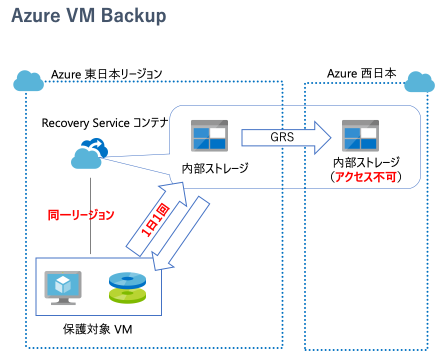
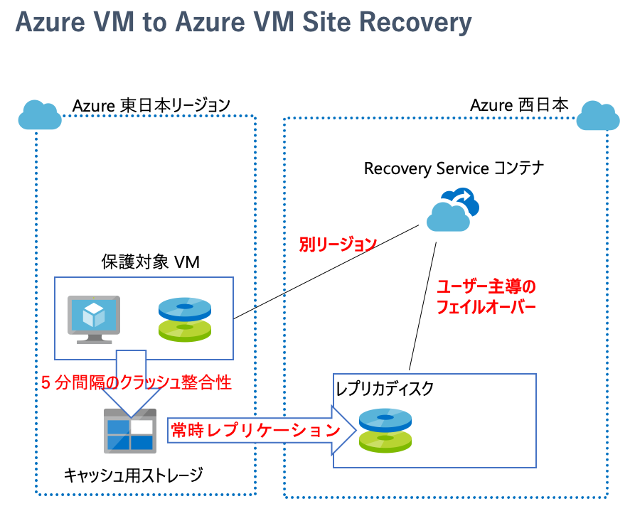

## はじめに

Azure を使用したシステムの設計をする際に、まず間違いなく「広域災害時の災害対策をどうやるのか・どこまでやるのか」が議論になります。
当然の事ながら、システムの特性に応じて必要な RTO/RPO は異なりますし、かけられるコストや手間にも差異がありますので、コレといった唯一絶対の正解はありません。
ただ正解はないとはいえ、クラウドに備わったサービスを利用する事で効率的に災害対策を実現する、というのもクラウドを利用するメリットの１つと言えるでしょう。
このため災害対策を構成する上で「Azure で提供されている選択肢として何があるのか」を把握しておくことが重要です。

本ブログでは「Azure 仮想マシンで構成されたシステムの災害対策」において考えられる方法論について整理していきたいと思います。
端的にいって [Azure Site Recovery](https://docs.microsoft.com/ja-jp/azure/site-recovery/) の話になるわけですが、
なんでもかんでも Site Recovery というのが必ずしも正解ではないと思いますので、その他の選択肢にも触れていきたいと思います。

## 前提知識

Azure は必ず東日本リージョンに対して西日本リージョン、北ヨーロッパ (アイルランド)リージョンに対して西ヨーロッパ (オランダ)リージョン、といったように
[必ずペアリージョンが存在](https://docs.microsoft.com/ja-jp/azure/best-practices-availability-paired-regions)します。
たまに勘違いされるケースがあるのですが、「大規模災害が発生して使用しているリージョンが使えなくなったら、**自動的にペアリージョンで復旧してくれる** んでしょ？！」と言われることがあります。
残念ながらそんな素敵なことはなくて、ペアリージョンはあくまでも選択肢として提供されているだけです。
[可用性セットや可用性ゾーン](https://docs.microsoft.com/ja-jp/azure/virtual-machines/windows/manage-availability)と同様に、
ペアリージョンも使う使わないはユーザーが判断し、意図的に構成する必要のあるオプションです。

## Azure Backup と Azure Site Recovery 

災害対策構成の議論において「Azure Backup と Site Recovery どっちを使えばいいの？」と良く聞かれる、というのがこの記事を書く動機の９割くらいを占めています。
超おおざっぱに言ってしまえば、Azure Backup はオペレーションミスやマルウェア等によるデータやシステムの **論理的な破損** に備えておくためのものであって、
広域災害によるリージョンの全面的な停止・喪失のような  **物理的な破損** に備えるならば Site Recovery を使用すべきです。

しかしなぜか「災害対策に Azure Backup を使用したい」お客様というのが一定数いらっしゃって、よくよく聞いてみると以下の理由によるようです。

- オンプレミスデータセンターでは「サーバーのバックアップを記録したテープメディアを遠隔地のデータセンターに保管する」という方法で災害対策を実施していた
- Azure Backup も [Geo 冗長ストレージ](https://docs.microsoft.com/ja-jp/azure/storage/common/storage-redundancy) を使用できるんだから遠隔地保管

そして私の個人的な観測範囲では、以下が混同されているケースが多く見受けられました。

- Azure Backup のサービス内容と、オンプレミスで利用していたバックアップソリューション
- Azure の Geo 冗長ストレージの特性と、オンプレミスで行われていた遠隔地へのメディア保管運用

また Backup も Site Recovery も `Recovery Service コンテナー` と呼ばれる Azure リソースを使用する、という事実が混乱に拍車をかけます。
~~個人的にはこのデザインがかなり問題なんじゃないかと思うのですが、~~ まずはこの誤解を解きましょう。

### 災害対策ソリューションとして Azure Backup を検討する際に気をつけておくべき事

まず、Azure Backup で保護できる仮想マシンは[同一リージョンのみ](https://docs.microsoft.com/ja-jp/azure/backup/backup-support-matrix-iaas) です。

- 保護対象の仮想マシンと同じリージョンに Recovery Service コンテナーを配置する必要があり、リージョン障害時には一緒に影響を受ける可能性が極めて高いのでアテにできない
- 別リージョンへのリストアはできない（ GRS によってペアリージョンにデータはコピーされているが、あくまでも喪失防止が目的であって、ユーザーが任意のタイミングで活用できるわけではない）
    - これは[Cross Region Resotre](https://docs.microsoft.com/ja-jp/azure/backup/backup-azure-arm-restore-vms#cross-region-restore) の GA と共に緩和される見込み

次に、大規模災害時にどの程度のタイムラインで Azure Backup がペアリージョンにフェイルオーバーして利用可能になるかがわかりません。

- そもそも [Azure Backup の SLA](https://azure.microsoft.com/ja-jp/support/legal/sla/backup/) として定義されていない
- システムの DR 要件に **RTO が定義されている** 場合には、Backup は災害対策ソリューションとしては成り立たない考えるべき
    - DR 要件として時間制約がなく「いつか復旧できれば良い（データが喪失さえなければ良い、タイミングは Microsoft 任せで良い）」というものであれば検討の余地がある

最後に、Azure Backup による仮想マシンバックアップの頻度は[最大でも 1 日 1 回](https://docs.microsoft.com/ja-jp/azure/backup/backup-support-matrix-iaas#backup-frequency-and-retention)です。

- 前述の Cross Region Restore を使用したとしても、災害発生のタイミングが最悪のケースでは、仮想マシンの状態が最大で 24 時間前まで戻ってしまう
- RPO の要求が 24 時間未満であるシステムでは要件が満たせない

### 災害対策ソリューションとして Azure Site Recovery を検討すべき理由

前述の Azure Backup における注意事項の逆パターンになるわけですが、Azure Site Recovery には以下のメリットがあります。

まず、Recovery Service コンテナの配置先、および仮想マシンのレプリケート先（ターゲット）は、保護対象と[別リージョン](https://docs.microsoft.com/ja-jp/azure/site-recovery/azure-to-azure-support-matrix)です。
- 保護対象の仮想マシンの配置リージョンが停止していても、Recovery Service コンテナは別リージョンにあるのでフェイルオーバーの指示出しが可能
- レプリケートされた仮想マシンのディスクは別リージョンで利用可能なので、これを元に仮想マシンが再構築できる

次に、フェイルオーバーのトリガーは **ユーザー手動** であるため、災害復旧に関して Microsoft の判断を待たずにフェイルオーバーする事が可能です。
- [Azure Site Recovery の SLA](https://azure.microsoft.com/ja-jp/support/legal/sla/site-recovery/)としても仮想マシン単位での目標復旧時間（2時間）が定義されている
- 大規模災害時の運用等も含め、システム全体がフェイルオーバーするための所要時間が計算できるため、目標 RTO が定義できる
- 必ずしも大規模災害時である必要もなく、テストフェイルオーバーによる避難訓練や、メンテナンスの回避などを目的としたフェイルオーバーをしても良い

最後に、保護対象の仮想マシンのディスク I/O に応じて連続的にレプリケーションが行われるため RPO が短く抑えられる。
- [クラッシュ整合性復旧ポイントが５分間隔](https://docs.microsoft.com/ja-jp/azure/site-recovery/azure-to-azure-architecture#snapshots-and-recovery-points)で作成される（理論上の最小 RPO は５分）
- 復旧ポイントは最大で 72 時間まで保持できるため、データの整合性や運用上の適切な状態で復旧することができる

## その他の選択肢

ここまでは Backup と Site Recovery を中心に紹介してきましたが、そもそも災害対策においてコレらのサービスが必須というわけではありません。
というより、そもそもリストアやフェイルオーバーといったような「滅多にやらないオペレーション」を被災時のような特殊な状況化で行うのは極力避けるべきです。

システムやサーバーの特性や要件に合わせて、より簡易な、あるいは低コストな、もしくは高度なソリューションも検討できますので、以降で簡単に紹介していきます。

### そもそもバックアップやレプリケーションって必要ですか

例えば Web サーバーやアプリケーションサーバー等はステートレスに作られているでしょうし、その構築に必要な資源は大まかに以下の４つです。

- 独自開発したアプリケーション（ソースコードリポジトリにオリジナルがあるはず）
- アプリが動作するためのミドルウェア（インストールメディアなりやパッケージ管理システムなりが提供されているはず）
- 仮想マシンのベースイメージ（かなりの種類が Azure マーケットプレイスに提供されています）
- Azure のインフラ構成（ARM テンプレートで記述しておけばソースコードと一緒に構成管理できる）

昨今は [Azure Pipeline](https://azure.microsoft.com/ja-jp/services/devops/pipelines/) や、
[GitHub Actions](https://github.co.jp/features/actions) などを利用して、
開発・テスト・本番環境へのデプロイが自動化されて日常的に行われていることも多いでしょうから、そもそも環境の再構築はそれほど難しくありません。
とすれば、これを災害時に利用しない手はありません。

### 仮想マシンのマスターイメージがあるのでは

ステートレスに作られているサーバーであれば、仮想マシンの台数を増減してパフォーマンスとコストを最適化するスケールアウト・スケールイン構成になっているのでは無いでしょうか。
この場合は運用中にオンデマンドに仮想マシンを作成する必要があるため、アプリケーションなどがセットアップ済みの
[仮想マシンのマスターイメージ](https://docs.microsoft.com/ja-jp/azure/virtual-machines/windows/capture-image-resource)
を作られていると思います。
[共有イメージギャラリー](https://docs.microsoft.com/ja-jp/azure/virtual-machines/windows/shared-image-galleries#make-your-images-highly-available)
を使用してマスターイメージを管理することで、複数リージョンにレプリケーションして利用することが可能です。

被災時にはこのマスターイメージを利用することで、通常運用時と全く同じ内容の仮想マシンを別のリージョンに再構築できるわけです。

### アプリケーションはコンテナ化してませんか

昨今のアプリケーションはコンテナ化されていることも多いのでは無いでしょうか。
例えば [Azure Container Registry](https://docs.microsoft.com/ja-jp/azure/container-registry/container-registry-intro)
は Geo レプリケーション機能を提供していますので、単一リージョンの障害にも強い構成が可能です。
これが利用可能であれば、Azure の別リージョンでも、オンプレミスのデータセンターでも、場合によっては他社のクラウドでも災害時の復旧が検討しやすいのでは無いでしょうか。

### 従来通りにソフトウェアレベルでのバックアップでもいい

仮想マシンを使っているということは、良くも悪くも「オンプレミスと同じ運用」ができるわけです。
特にデータベース製品であればバックアップ機能がない、あるいは対応したバックアップソリューションが無い、ということは滅多に無いでしょう。
Backup や Site Recovery は仮想マシンを丸ごと対象にしますのでオーバーヘッドも大きくなりがちですが、
ソフトウェアレベルでのバックアップであれば、そのデータが格納されたファイルサイズだけですみます。

バックアップファイルの保存先としてはペアリージョンに用意した
[Azure Blob](https://azure.microsoft.com/ja-jp/pricing/details/storage/blobs/)を指定しておくと良いのでは無いでしょうか。
SQL Server であれば[Backup コマンドに直接 Blob を指定](../sqlserver-backup-restore-azureblob)することができますし、
ソフトウェアが対応していなくてもバックアップジョブの最後で 
[AzCopy](https://docs.microsoft.com/ja-jp/azure/storage/common/storage-use-azcopy-v10) を使用するといった対応が可能です。

被災時には仮想マシンを再構築して、データベース製品をインストール、Blob に保存しておいたバックアップファイルからリストアすれば完了です。

### 高性能なソフトウェアレベルのレプリケーションを利用

Azure Site Recovery は「Disk I/O によって発生した増分をAzure ストレージのレベルでレプリケートする」という汎用的な仕組みである反面、
内部で動作するソフトウェアから見て最適なレプリケーションにはなりにくいというデメリットもありえます。
より短い RPO や RTO を追求するならば、やはりレプリケーション自体をソフトウェアで実施するべきです。

異なる Azure リージョンに配置された仮想ネットワークは
[グローバル仮想ネットワークピアリング](https://docs.microsoft.com/ja-jp/azure/virtual-network/virtual-network-peering-overview) を構成しておくと、
配置された仮想マシン間で TCP/UDP の任意のプロトコルを用いたプライベート通信をすることが可能です。
これを利用して異なるリージョンのサーバー間でソフトウェアレベルでのレプリケーションが可能です。
例えば
[SQL Server AlwaysOn Availability Group](https://docs.microsoft.com/ja-jp/azure/virtual-machines/windows/sql/virtual-machines-windows-portal-sql-availability-group-dr)
などが対応しています。

## まとめ

- 仮想マシンの広域災害対策は基本的に Azure Site Recovery
- Azure Backup を使用する場合は要件が満たせるか良く確認する
- 要件によっては他のソリューションも検討すべき

## 補足 ： PaaS を使ってみませんか

仮想マシン（IaaS）はその汎用性の高さから災害対策構成にも選択肢が多くなるわけですが、なんだかんだ言ってどれも面倒で手間がかかります。
そしてソリューション選定ではコストも重視されると思いますが、結局のところ一番高いのはこの記事を読んでいただいている皆様のような **人間の工数** です。
Azure の PaaS は災害対策まで内包しているサービスも多くありますので、できれば一度は検討していただくことをお勧めします。

