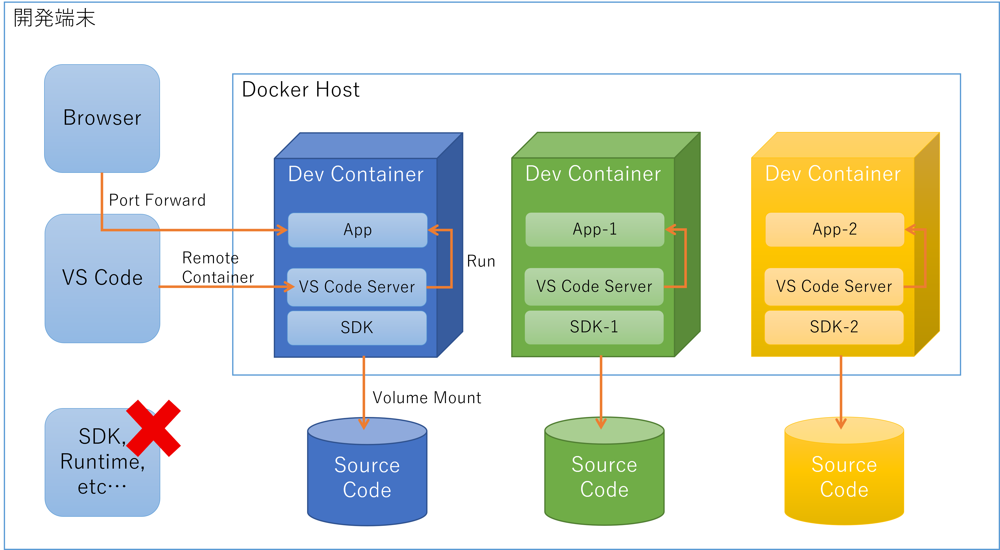

## はじめに

Visual Studio Code の [Dev Container](https://code.visualstudio.com/docs/remote/containers) を利用して開発環境を整えるようにすると、操作している端末の環境を汚さずに使えるので、大変便利ですよね。
並行して携わっているお仕事のランタイムバージョンが異なっているのを忘れて、うっかりインストールして開発環境がぶち壊しになるとかいう苦い歴史とはそろそろお別れしたいものです。

Dev Container はざっくり言うと **ソースコードが格納されたディレクトリを、開発に必要な SDK がインストールされたコンテナにマウントして、VS Code から接続した状態で開くことができる** というモノですね。
で、この Dev Container にインストールされた SDK で造られたアプリケーションの実行環境もコンテナである場合、この開発コンテナから直接 docker コマンドを実行したい、というのが人情です。
まあやり方などは上記のドキュメントにも書いてあるんですが、いちいち調べるのも面倒ですし、何度やっても覚えられないのでこれは備忘録です。

## 環境準備

私が試している環境は以下のようになります。

- Windows 10 Enterprise version 21H1 (osbuild 19043.985)
- Visual Studio Code version 1.56.2
    - (Extension) Remote - Containers
    - (Extension) Docker for Visual Studio Code
- Docker Desktop for Windows version 3.3.3 (64133)

## 環境の構成イメージ

まずは素直に Dev Container 内でアプリを直接動作させることを考えます。

- Dev Container Only
    - SDK がインストールされてれば Runtime もインストールされてるので、一番普通の開発スタイルに近いが、最終的にアプリが動作する環境とは一致しない
    - アプリ開発と並行して Dockerfile を書くことになるが、この環境では実行できないので、ホスト側でコンテナ化してテストすることになる
    - アプリ開発からコンテナでの動作確認までシームレスにやりたい、というのがこの記事の発端



さて Dev Container から docker を実行するにあたっては 2 つの方法が考えられます。

- DooD : Docker outside of Docker 
    - Docker from Docker って呼ぶ場合もあるみたい
    - 作業中の開発コンテナに Docker CLI だけをインストールし、Docekr Daemon はホスト側を使用する方式なので、開発コンテナとアプリコンテナは兄弟関係になる
    - Dev Container を起動せずにホスト側単独で App Container を利用できる（イメージの操作やコンテナの開始・停止など）
    - ボリュームマウントやポートマッピングの対象はホスト側のリソースになるので、ホストとコンテナでリソース管理の意識がばらつく


- DinD : Docker inside Docker
    - 作業中の開発コンテナに Docker に必要な環境を全部インストールして、Dev Container 内部で App Container を起動する方法
    - Dev Container を起動せずにホスト側単独で App Container を操作したい場合は、ホスト側で別途コンテナをビルドする必要がある
    - ボリュームマウントやポートマッピングの対象リソースはコンテナ内になるので、リソース管理に意識をあまり割かなくてよい
    - Web アプリなどにブラウザアクセスしたい場合は、VS Code のポートフォワード機能を利用する
    


目的としては開発・実行環境がソフトウェア的に分離できればいいので、個人的には Docker outside of Docker のパターンがいいかなと思っています。

## Dev Container からの Docker outside of Docker

まず Dev Container を用意するわけですが、これもいくつか方法が考えられますが、個人的には一番先頭の DooD セットアップ済みが安定するかなと思っています。

1. DooD が構成されたコンテナイメージをベースとして、SDK など必要ソフトウェアを追加インストールする
    - Dev Container として利用するための準備や、DooD をセットアップする手間がない
    - 開発に必要な SDK のバージョンやセットアップ手順はちゃんとわかりやすく管理出来たほうがいい
    - ベースイメージが Debian に固定されてしまうので、場合によっては足かせになるかもしれない
1. SDK などがインストール済みのコンテナイメージをベースとして、Docker CLI を追加インストールする
    - DooD を使いやすい状態までセットアップするのがツラいし、そのメンテは本題ではないので
    - そもそも用意された SDK のバージョンが使いたいバージョンと合わないケースが多そう
1. 既存の Dockerfile を元に Dev Container を組み立てる
    - 開発に必要な環境をベースレベルからコントロール出来る
    - Dev Container として利用するための準備や、DooD をセットアップする手間がとてもツラいし、そのメンテは本題ではないので

## まずは Dev Container 環境を用意する

前置きが長くなりましたがここからが実際の手順というか備忘録になります。

- ソースコードなどが配置される予定の特定のディレクトリを Visual Studio Code で開く
- **Ctrl + Shift + p** でコマンドパレットを開く
- ```Remote-Containers: Add Development Container Configuration Files``` を探して選択
- ~~魅力的な各種イメージを無視して~~ ベースイメージとして ```Docker from Docker``` を選ぶ

作業が終わると ```.devcontainer``` というディレクトリ配下に、 ```devcontainer.json``` と ```Dockerfile``` というファイルが生成されているはずです。
一度 Visual Studio Code を閉じて再度同じディレクトリを開くと、**Dev Container の設定がされてるけど コンテナ環境で開きなおすか？** というような感じの通知がでますので、そこで **Reopen** を選択すれば作業開始です。

ただこの通知、しばらくすると消えてしまって見逃しがちですので、コマンドパレット（Ctrl + Shift + P）から　```Remote-Containers: Rebuild and Reopen in Container``` を実行する方が確実です。またコンテナマウントした状態ではなく、ホストマシン上で普通に開きなおしたい場合はコマンドパレットから ```Remote-Containers: Reopen Folder Locally``` を実行すると戻ることができます。

## DooD が出来ることを確認する

まずは作成した環境で DooD が出来てることを確認しておきましょう。
下記のようにホスト側で使っていたコンテナイメージに加え、```vsc``` から始まるコンテナおよびイメージが確認できます。
これが Visual Stuido が Remote Container 機能で接続している Dev Conatainer とそのイメージにです。

```bash
$ docker images

REPOSITORY                                                                   TAG       IMAGE ID       CREATED             SIZE
vsc-docker-outside-of-vscode-devcontainer-6db317e7d257ca334df89b964a5b54b8   latest    65999a18db5e   About an hour ago   1.12GB
pystrsample                                                                  latest    ce350b283efa   45 hours ago        917MB
python                                                                       3.8       e7d3be492e61   8 days ago          883MB
ubuntu                                                                       latest    7e0aa2d69a15   5 weeks ago         72.7MB

$ docker ps -a

CONTAINER ID   IMAGE                                                                        COMMAND                  CREATED         STATUS         PORTS     NAMES
6793b3914ce7   vsc-docker-outside-of-vscode-devcontainer-6db317e7d257ca334df89b964a5b54b8   "/bin/sh -c 'echo Co…"   9 minutes ago   Up 9 minutes             brave_euler
```

docker コマンドをコンテナの中から実行しているのに、そのコンテナを外から見ている状態なのはなんだか不思議な気分です。

## 開発に必要な SDK 等を Dev Container にインストールする

さて、この時点ではベースイメージとして選択したコンテナイメージに含まれるツール群(git とか)しか使えません。
このためパッケージマネージャ等を使ってインストールしていくことになりますが、毎回 VS Code 開くたびに毎回そんなことはやってられません。
``.devcontainer/Dockerfile`` に SDK インストールを記載しておくことで、次回以降はビルド済みのイメージが使えるわけですね。
たとえば .NET 5 の SDK をインストールするなら下記のような内容を追記します。

```Dockerfile
# .NET Core 5.0 SDK をインストール
RUN wget https://packages.microsoft.com/config/ubuntu/20.10/packages-microsoft-prod.deb -O packages-microsoft-prod.deb && \
    dpkg -i packages-microsoft-prod.deb && \
    apt-get update && \
    apt-get install -y apt-transport-https && \
    apt-get update && \
    apt-get install -y dotnet-sdk-5.0
```

もちろん Dockerfile を書き換えただけでは反映されませんので、コマンドパレット（Ctrl + Shift + P）から ```Remote-Containers: Reopen Folder Locally``` を選んで一度コンテナから抜け、
再度コマンドパレットから ```Remote-Containers: Rebuild and Reopen in Container``` を実行して、イメージを最新化した上でコンテナに接続しなおします。

最初のうちはこの Dev Container を育てていくフェーズがなので、Rebuild と Reopen が頻繁にあって面倒ですが、いずれ頻度は下がっていくでしょう。
アプリケーションのソースコードと一緒に Dev Container の定義もソースコードリポジトリにまとめてコミットして管理することで、git pull するだけで全員が常に統一された環境で開発作業ができるわけですから、ここは頑張りどころですよね。


## 実際にアプリを開発してみる

さて実際にアプリを作ってみましょう。
前述の通り Dev Container では .NET SDK が使えるようになっていますので、例えば下記のようなコマンドでアプリの開発を始められるわけです。

```bash
$ mkdir src
$ dotnet new web -o src
$ dotnet new gitignore -o src
$ cd src

# いろいろコーディングする
```

この Dev Container はホストマシンのディレクトリをマウントしているわけですので、コンテナが終了してもソースコードがちゃんとホストマシンに残るわけですね。
まあもちろんソースコードリポジトリにちゃんと保存しておくべきでしょう。
この方法で作った Dev Container であれば git コマンドも使えますので、コンテナの中からでも外からでもバージョン管理は可能です

```bash

$ dotnet run

Building...
warn: Microsoft.AspNetCore.Server.Kestrel[0]
      Unable to bind to https://localhost:5001 on the IPv6 loopback interface: 'Cannot assign requested address'.
warn: Microsoft.AspNetCore.Server.Kestrel[0]
      Unable to bind to http://localhost:5000 on the IPv6 loopback interface: 'Cannot assign requested address'.
info: Microsoft.Hosting.Lifetime[0]
      Now listening on: https://localhost:5001
info: Microsoft.Hosting.Lifetime[0]
      Now listening on: http://localhost:5000
info: Microsoft.Hosting.Lifetime[0]
      Application started. Press Ctrl+C to shut down.
info: Microsoft.Hosting.Lifetime[0]
      Hosting environment: Development
info: Microsoft.Hosting.Lifetime[0]
      Content root path: /workspaces/ainaba-csa-blog/docker-outside-of-vscode-devcontainer/src
```

さて勢いあまって Dev Container 内でアプリを実行しましたが、ASP.NET Core の開発サーバーが Port 5000, 5001 を使用して待機しています。
Linux コンテナで実行しているので curl などでテストしてもいいのですが、Dev Container の場合はコンテナ内部でポートを使って待ち受けるプロセスが起動すると、自動的にポートフォワードが行われ、ホスト側から接続できるようになります。


なにこれ便利。

## 実行環境のコンテナを実行する

VS Code が Dev Container 内で起動したアプリプロセスに対して自動的にポートフォワードしてくれるというのは、開発中に Try & Error している時は大変便利です。
とはいえ、Dev Contaienr をそのまま実運用環境にデプロイすることはないでしょうから、実際には構成の異なる環境でのテストをしていることになります。
実運用環境にデプロイするためのコンテナ開発は別途必要になるわけですが、その作業もアプリ開発をしている Dev Container の中でまとめてやってしまいたいなと思います。

さてランタイムのみのイメージにアプリをデプロイして動作させたいわけですから、例えばこちらのような[別の Dockerfile](./src/Dockerfile) を用意することになります。
で、それをビルドして実行するわけですね。

```bash
$ cd src
$ docker build -t app-container .

## 省略 ##

$ docker images

REPOSITORY                                                                   TAG       IMAGE ID       CREATED          SIZE
app-container                                                                latest    e3574686992b   17 minutes ago   205MB
vsc-docker-outside-of-vscode-devcontainer-6db317e7d257ca334df89b964a5b54b8   latest    65999a18db5e   2 hours ago      1.12GB
pystrsample                                                                  latest    ce350b283efa   45 hours ago     917MB
python                                                                       3.8       e7d3be492e61   8 days ago       883MB
ubuntu                                                                       latest    7e0aa2d69a15   5 weeks ago      72.7MB

$ docker run -d --rm -p 8080:80 app-container 

038025e44bcab23074c3312ea8c60c8fae3c334d9d5aeb83282244405ae682e0
```

さて前述の通りこのアプリコンテナはホストの Docker Daemon から起動されてるので、Dev Container 内部でプロセスが起動したわけではありません。
つまり残念ながら VS Code がポートフォワードしてくれるわけではないので、ここでは ```-p``` オプションを付けてポートマッピングをしています。
これはホスト側の Port 8080 を app-container の Port 80 にマッピングしてるだけですので、Dev Container の中からはアクセスできません。残念。
VS Code が自動的にやってくれないのは残念ですが「ホスト側のブラウザ開いてテストする」っていう意味ではまあ同じかなと思いますです。
~~それに思い至るまで dev container の中から curl を打っては繋がらなくて泣きそうになってたのは秘密です~~


## 出来上がったディレクトリ構成

Visual Studio Code でディレクトリを開いたときに、そこに ```.devcontainer``` というディレクトリがあると、ここは直接じゃなくてコンテナから開いた方がいいんだな、ということに気が付いてくれるわけです。
つまり以下のようなディレクトリ構成を作ってソースコードリポジトリで管理しておけば、あとはクローンして Visual Stduio Code で開くだけで「開発メンバー全員が同じ環境で開発作業ができる」ことが保障できるわけですね。

- (VSCode で開くディレクトリ)
    - .git/
    - .vscode/
        - launch.json
        - tasks.json
    - .devcontainer/
        - devcontainer.json
        - Dockerfile        <-- 開発環境のコンテナイメージを生成
    - src/
        - アプリのソースコード類
        - Dockerfile        <-- 実行環境用のコンテナイメージ生成
    - .gitignore
    - README.md
