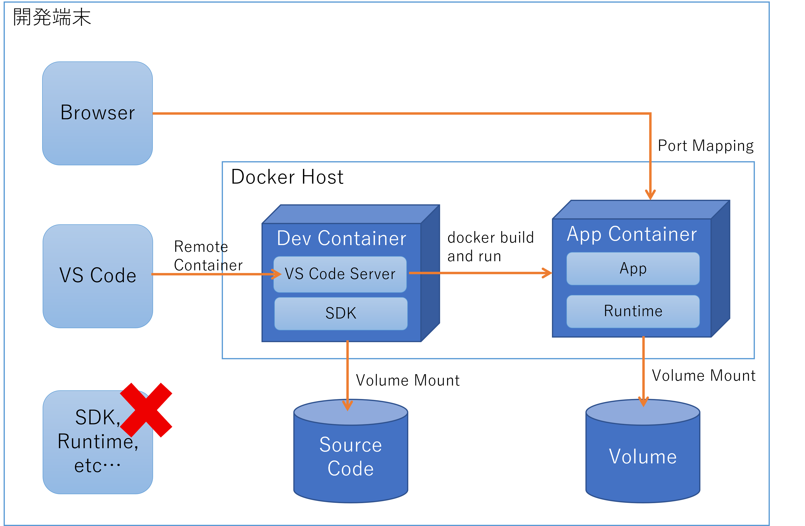

## はじめに

Visual Studio Code の [Dev Container](https://code.visualstudio.com/docs/remote/containers) を利用して開発環境を整えるようにすると、操作している端末の環境を汚さずに使えるので、大変便利ですよね。
並行して携わっているお仕事のランタイムバージョンが異なっているのを忘れて、うっかりインストールして開発環境がぶち壊しになるとかいう苦い歴史とはそろそろお別れしたいものです。

Dev Container はざっくり言うと **ソースコードが格納されたディレクトリを、開発に必要な SDK がインストールされたコンテナにマウントして、VS Code から接続した状態で開くことができる** というモノですね。
さて、この Dev Container にインストールされた SDK で造られたアプリケーションの実行環境もコンテナである場合、この開発コンテナから直接 docker コマンドを実行したい、というのが人情です。
Dev Container に docker をインストールしてしまう Docker in Docker でもいいのですが、出来上がったアプリコンテナのイメージはホスト側からも操作できた方が良いように思います。
つまり個人的には Docker outside of Docker がやりたいわけです。



まあやり方などは上記のドキュメントにも書いてあるんですが、いちいち調べるのも面倒ですし、何度やっても覚えられないのでこれは備忘録です。

## 環境準備

私が試している環境は以下のようになります。

- Windows 10 Enterprise version 21H1 (osbuild 19043.985)
- Visual Studio Code version 1.56.2
    - (Extension) Remote - Containers
    - (Extension) Docker for Visual Studio Code
- Docker Desktop for Windows version 3.3.3 (64133)

## まずは Dev Container を用意する

ではまず開発コンテナを用意しましょう。
このドキュメントが配置されているディレクトリ自体も、下記の手順でベースイメージとして Ubuntu を選択したものを、カスタマイズしているサンプルになっています。

- ソースコードなどが配置される予定の特定のディレクトリを Visual Studio Code で開きます
- **Ctrl + Shift + p** でコマンドパレットを開きます
- ```Remote-Containers: Add Development Container Configuration Files``` を探して選択します
- 開発環境として使用したベースイメージを選択します

作業が終わると ```.devcontainer``` というディレクトリ配下に、 ```devcontainer.json``` と ```Dockerfile``` というファイルが生成されているのが分かります。
一度 Visual Studio Code を閉じて再度同じディレクトリを開くと、**Dev Container の設定がされてるけど コンテナ環境で開きなおすか？** というような感じの通知がでますので、そこで **Reopen** を選択すれば作業開始です。
ただこの通知、しばらくすると消えてしまって見逃しがちですので、コマンドパレット（Ctrl + Shift + P）から　```Remote-Containers: Rebuild and Reopen in Container``` を実行する方が確実です。

ちなみにコンテナマウントした状態ではなく、ホストマシン上で普通に開きなおしたい場合はコマンドパレットから ```Remote-Containers: Reopen Folder Locally``` を実行すると戻ることができます。

## 開発に必要な SDK 等をインストールして開発作業を開始する

さて、この時点ではベースイメージとして選択したコンテナイメージに含まれるツール群しか使えません。
このためパッケージマネージャ等を使ってインストールしていくことになりますが、毎回そんなことはやってられませんので、``.devcontainer/Dockerfile`` に記載していきます。
そのままでは反映されませんので、コマンドパレット（Ctrl + Shift + P）から ```Remote-Containers: Reopen Folder Locally``` で一度コンテナから抜け、
```Remote-Containers: Rebuild and Reopen in Container``` を実行して、イメージを最新化した上でコンテナに接続しなおします。

なおこの記事のディレクトリにある[サンプル](./devcontainer/Dockerfile)では .NET SDK 5.0 をインストールしていますので、.NET SDK が使えるようになっています。
この状態で、例えば下記のようなコマンドでアプリの開発を始められるわけです。

```bash
dotnet new web -o src
dotnet new gitignore -o src
cd src
dotnet run
```

このコンテナはホストマシンのディレクトリをマウントしていますので、コンテナが終了してもソースコードがちゃんと残るわけですね。
なお上記のように Web アプリを開発している場合、この開発コンテナに対してポートフォワードしてやれば、ホスト側のブラウザから参照できるようになりますが、この記事では本題ではないので割愛します。

## 実行環境のコンテナイメージを定義する

さてアプリの開発が終わったら実行環境の準備ですね。
開発コンテナにインストールされているのは SDK ですので実行環境としては余分です。
ランタイムのみのイメージにアプリをデプロイして動作させたいわけですから、例えばこちらのような[別の Dockerfile](./src/Dockerfile) を用意することになります。

## Docker outside of Docker の準備

やっと前座が終わりました。
それでは ```docker build ```して、と行きたいところですが、この開発コンテナでは実行できません。
このため以下の手順が必要になります。

- [.devcaontainer/Dockerfile](.devcontainer/Dockerfile) で Docker CLI をインストールする 
- [.devcaontainer/devcontainer.json](.devcontainer/devcontainer.json) でホストマシンの ```/var/run/docker.sock``` をマウントしてやる

またしてもコマンドパレット（Ctrl + Shift + P）から ```Remote-Containers: Reopen Folder Locally``` で一度コンテナから抜け、
```Remote-Containers: Rebuild and Reopen in Container``` を実行して、イメージを最新化した上でコンテナに接続しなおします。
この状態であれば sudo 付きならば docker コマンドが利用できるようになっていると思います。

~~sudo なしで頑張る方法もありそうではあるのですが、かなりトリッキーになりそうなので一旦諦めました・・・。~~

## 開発コンテナの中からアプリコンテナを起動する

まず開発コンテナの中から確認できるコンテナやコンテナイメージを見てみましょう。
下記のようにホスト側で使っていたコンテナイメージに加え、```vsc``` から始まるコンテナおよびイメージが確認できます。
これが Visual Stuido が Remote Container 機能で接続している開発コンテナになります。

```bash
$ sudo docker images
REPOSITORY                                                                   TAG       IMAGE ID       CREATED             SIZE
vsc-docker-outside-of-vscode-devcontainer-6db317e7d257ca334df89b964a5b54b8   latest    65999a18db5e   About an hour ago   1.12GB
pystrsample                                                                  latest    ce350b283efa   45 hours ago        917MB
python                                                                       3.8       e7d3be492e61   8 days ago          883MB
ubuntu                                                                       latest    7e0aa2d69a15   5 weeks ago         72.7MB

$ sudo docker ps -a
CONTAINER ID   IMAGE                                                                        COMMAND                  CREATED         STATUS         PORTS     NAMES
6793b3914ce7   vsc-docker-outside-of-vscode-devcontainer-6db317e7d257ca334df89b964a5b54b8   "/bin/sh -c 'echo Co…"   9 minutes ago   Up 9 minutes             brave_euler
```

それでは先ほど用意しておいたアプリの Dockerfile をビルドして実行しましょう。

```bash
$ cd src
$ sudo docker build -t app-container .
$ sudo docker images

REPOSITORY                                                                   TAG       IMAGE ID       CREATED          SIZE
app-container                                                                latest    e3574686992b   17 minutes ago   205MB
vsc-docker-outside-of-vscode-devcontainer-6db317e7d257ca334df89b964a5b54b8   latest    65999a18db5e   2 hours ago      1.12GB
pystrsample                                                                  latest    ce350b283efa   45 hours ago     917MB
python                                                                       3.8       e7d3be492e61   8 days ago       883MB
ubuntu                                                                       latest    7e0aa2d69a15   5 weeks ago      72.7MB

$ sudo docker run -d --rm -p 8080:8000 app-container 
038025e44bcab23074c3312ea8c60c8fae3c334d9d5aeb83282244405ae682e0


```