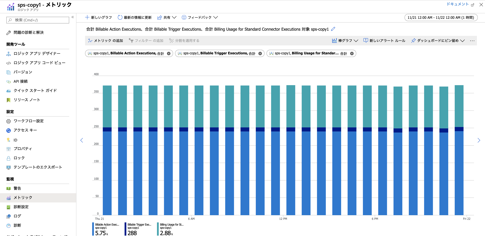
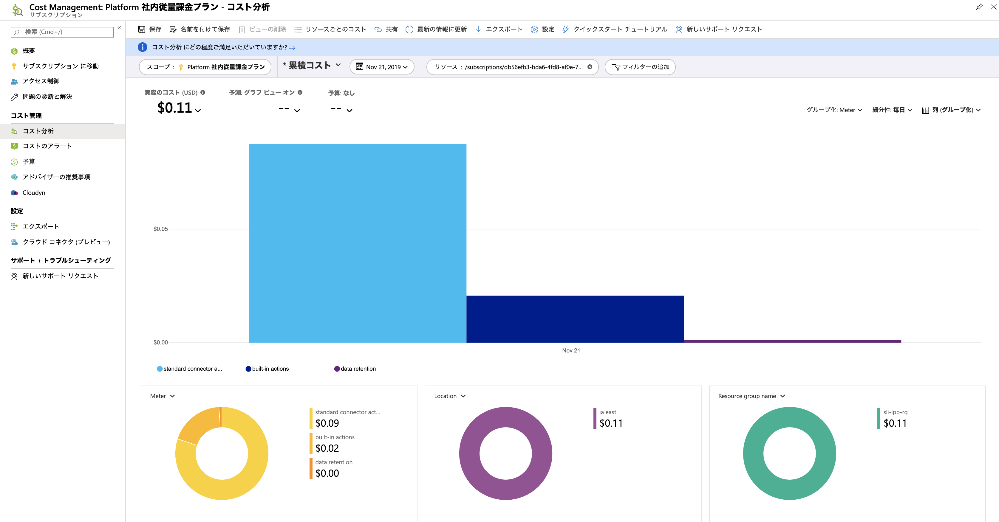

## はじめに

Azure のサーバーレスサービスの１つである
[Logic Apps](https://azure.microsoft.com/ja-jp/services/logic-apps/)
の
[料金表](https://azure.microsoft.com/ja-jp/pricing/details/logic-apps/)
を見ると１つ１つの課金単位が極めて細かく、また
[価格モデル](https://docs.microsoft.com/ja-jp/azure/logic-apps/logic-apps-pricing)
の説明を見ても、結局いくらかかるのかがいまいちわかりません。
実行頻度の低いワークフローであれば（他のサービス利用に比べて）誤差の範囲と考えてしまうというのも１つですが、
やはり初回の請求が来るまでドキドキしながら待つというのも精神衛生上あまりよろしくありません。
もちろん真面目にチクチク積み上げてもいいのですが、結果が１円程度未満とかに収まってしまったりすると、その見積もりの労力に対して激しい徒労感に襲われます。
個人的にはこの手のサーバーレス形のサービスはあまり真面目に見積もるよりも、むしろさっさと簡易的な実装してしまって実稼働データを元に料金予測を立てるべきだと思います。

というわけで本ドキュメントでは Logic Apps の料金見積もり手法についてご紹介したいと思います。

## 題材となるワークフロー

ここでは下記の様なワークフローを題材に見積もってみたいと思います。

- (Trigger) ５分に一回ワークフローをタイマー起動する
- (Action)Sharepoint Online のとあるフォルダに格納されているファイルの一覧を取得
- (Action)取得できたファイル数だけループを回す
    - (Action)取得できたファイル情報（JSON）を解析
    - (Action)上記の全ファイルを別の  Sharepoint サイトにコピーする

各トリガーやアクションの１つ１つの実行に対して料金がかかります。
ただしフォルダ内に配置されたファイル数に応じてループが回る数が実行時に決まりますので、当然その内部のアクションの実行回数もその時々によって変わることになります。
またファイルの一覧の取得及びサイト間のファイルコピーには 
[Sharepoint Online 用のコネクタ](https://docs.microsoft.com/ja-jp/connectors/sharepoint/)
を使用していますので、こちらも別料金です。

ワークフロー実装及び実行結果のイメージは下記の様になります。
この時はコピー元のフォルダにファイルが９つ含まれていたことがわかります。

## 机上で見積もってみる

ワークフロー１回分の実行回数を元に単価を積み上げてみると以下の様になります。
なお料金単価に関しては2019年11月時点の従量課金プランの料金表を元に計算しています。

|項目|Action の実行回数|Action の料金|Standard Connector の実行回数|Standard Connector の料金|
|---|---:|---:|---:|---:|
|タイマー起動|1|¥0.003136|0|¥0.0|
|ファイル一覧|1|¥0.003136|1|¥0.014560|
|ループ|1|¥0.003136|0|¥0.0|
|JSON解析|9|¥0.028224|0|¥0.0|
|ファイルコピー|9|¥0.028224|9|¥0.13104|
|小計||¥0.065856 ||¥0.145600|
|合計||||¥0.211456| 

これが５分間隔で起動することになりますので、全ての実行が正常に稼働したと考えると料金は以下の様になります。（端数は切り捨てています）

|期間|実行回数|料金|
|---|---:|---:|
|５分|1|¥0.21|
|１時間|12|¥1.27|
|１日|288|¥60.90|
|１ヶ月（30日）|8,640|¥1,826.98|
|１年（365日）|105,120|¥54,809.40|

月額1800円となると一番安い
[B1S の Windows 仮想マシン](https://azure.microsoft.com/ja-jp/pricing/details/virtual-machines/windows/)
に
[P10 の管理ディスク](https://azure.microsoft.com/ja-jp/pricing/details/managed-disks/)
をつけたくらいでしょうか。
意外に馬鹿にならない金額ではありますが、逆にいえば Logic Apps 以外で使用するサービスによっては誤差の範囲に収まってしまうと思います。
また、これくらいの金額を見積もるために要した **工数** を考えるとどうでしょうか。
Logic Apps を使用する動機は様々ですが、サーバーレスを使うことで向上したかったはずの **開発生産性** が無駄になってしまう気がしてなりません。

## 実行結果からアクション数などを読み取る

とはいえ馬鹿にできる金額でもないと思いますので、ある程度ざっくりでも事前に把握しておきたいところではあります。
より簡易かつ確実に見積るためには、実際にワークフローを作って実行してしまった方が効率的であると考えます。
そもそもアクションの回数なんてワークフローを実装してみないと決めきれないでしょうし、作りつつ動作確認もするでしょうから、その実績値を使った方が早いでしょう。

というわけで作成した Logic Apps を一日ほったらかして動作させた後に、Azure ポータルで Logic Apps のメトリックが確認すると下記の様なグラフを得ることができました。

ここで表示しているメトリックと１時間当たりの実行回数は以下の様になっていました。
なお各メトリックの意味や種類については
[こちら](https://docs.microsoft.com/ja-jp/azure/azure-monitor/platform/metrics-supported#microsoftlogicworkflows)
で確認できます。

|メトリック|合計値|机上見積もりとの付き合わせ|
|---|---:|---|
|Billable Trigger Executions|12|ワークフローは 5 分に 1 回実行されるので、期待通り 1 時間で 12 回実行されたことがわかります|
|Billable Action Executions|240|ワークフローの 1 実行当たりファイル一覧が 1 回、ループが 1 回、JSON解析が 9 回、ファイルコピーが 9 回、計 20 アクションなので、全部で 240 回になっています|
|Billing Usage for Standard Connector Executions|120|ワークフローの 1 実行当たりコネクタを呼び出すアクションはファイル一覧が 1 回とファイルコピーが 9 回の計 10 回なので、全部で 120 回となっています|

机上見積もりの回数と一致してますのであとは料金表の単価をかければ良いわけです。 60 円くらいなので見積もりの工数としては格安かと思います。

なお題材にしたワークフロー定義が極めてシンプルですので、机上評価と実績値を一致させるのはそれほど難しくはないのですが、
より複雑なワークフローを組んだり実行時に動的に決まる要素が多くなってくると厳しいので、この様に実績値から取ってしまった方が楽だと思います。

## 実際に発生するコストを見積もる

Logic Apps が含まれるリソースグループやサブスクリプションには**コスト分析**機能がついています。
細かい見積もりロジックはさておき、結局いくらかかるのかを知れれば良いのである、という場合はこちらの方がさらに楽ができます。

机上見積もりと値がずれているのは検証に使用した料金プランの問題だと思いますが、こちらは要確認ですね・・・。

