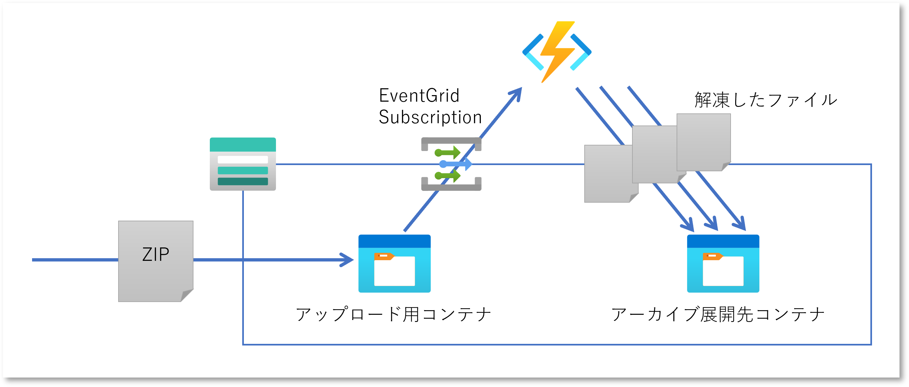

# はじめに

Blob にアップロードされてくる大量のファイルを Functions で処理する、というのは良く見かける処理方式だと思います。
ただアップロード元から見れば極力サイズと通信回数を抑えたいので、 ZIP 圧縮して 1 回の送信で済ませたいこともあるのではないでしょうか。
特に目新しい話ではないのですが、久しぶりにコードを書いてみたら昔といろいろ変わっていることがありましたので、ここに記します。




# Functions アプリの開発

まずは[クイックスタート](https://learn.microsoft.com/ja-jp/azure/azure-functions/create-first-function-cli-csharp?tabs=azure-cli%2Cin-process)を参考に Functions アプリを開発していきます。


## 必要なソフトウェアのバージョン確認

ここでは .NET 6.0 SDK を使用します。
複数の SDK が混在している環境ではうっかり最新版が動作してしまいがちなので global.json ファイルで固定しておきます。

```bash
$ dotnet --list-sdks

6.0.308 [C:\Program Files\dotnet\sdk]
6.0.405 [C:\Program Files\dotnet\sdk]
7.0.102 [C:\Program Files\dotnet\sdk]

$ dotnet new globaljson --sdk-version 6.0.405

$ cat global.json

{
  "sdk": {
    "version": "6.0.405"
  }
}
```

次に Azure Functions Core Tools バージョン 4.x がインストールされていることを確認します

```bash
$ func --version
4.0.4895
```

## Function アプリの開発

Blob がアップロードされた時に Function を実行するには [BlobTrigger](https://learn.microsoft.com/ja-jp/azure/azure-functions/functions-bindings-storage-blob-trigger?tabs=in-process%2Cextensionv5&pivots=programming-language-csharp)
を使用しますが、その方法はいくつか存在します。
ここでは比較的新しく、かつ実装がよういな EventGrid サブスクリプションを BlobTrigger で受信する方式を採用します。
今度はこちらの[チュートリアル](https://learn.microsoft.com/ja-jp/azure/azure-functions/functions-event-grid-blob-trigger?pivots=programming-language-csharp)を参考に実装してきます。

まずは Functions アプリを作成、[Azure Functions の Storage 拡張機能](https://www.nuget.org/packages/Microsoft.Azure.WebJobs.Extensions.Storage) v5 を追加、BlobTrigger の関数を作成します。

```bash
$ func init --worker-runtime dotnet 

$ dotnet add package Microsoft.Azure.WebJobs.Extensions.Storage --version 5.0.1

$ func new --language C# --template BlobTrigger --n ExtractArchive
```

生成されたスケルトンコードを以下のように書き換えていきます。

- BlobTrigger を Blob のポーリングではなく EventGrid によって起動する設定をする
- ZIP 書庫を処理するため [System.IO.Compression](https://learn.microsoft.com/ja-jp/dotnet/api/system.io.compression.ziparchive?view=net-6.0) のライブラリを参照する
- 多くの処理が Blob の入出力になるため [非同期処理](https://learn.microsoft.com/ja-jp/azure/azure-functions/performance-reliability#use-async-code-but-avoid-blocking-calls) を使用してスレッドのブロックを軽減
- ZIP に含まれるファイル名は実行時に判明するので、通常の Blob 出力バインドではなく [実行時バインド](https://learn.microsoft.com/ja-jp/azure/azure-functions/functions-dotnet-class-library?tabs=v2%2Ccmd#binding-at-runtime) を使用する


ここでは Zip ファイルがアップロードされるコンテナ名を `archive-upload`、解答結果を出力するコンテナを `archive-extracted` としています。

```csharp
using System.IO.Compression;
using System.Threading.Tasks;

[FunctionName("ExtractArchive")]
public async Task Run(
    [BlobTrigger("archive-upload/{name}", Source = BlobTriggerSource.EventGrid)] Stream myBlob, 
    string name, 
    Binder binder,
    ILogger log)
{
    // BlobTrigger で渡される ZIP 書庫を Stream で受け取る
    using(var zip = new ZipArchive(myBlob, ZipArchiveMode.Read))
    {
        foreach(var entry in zip.Entries)
        {
            // Blob は空のディレクトリが作れないため、ZIP 書庫内にファイルのないディレクトリがあればスキップする
            if(entry.FullName.EndsWith("/"))
            {
                continue;
            }

            // 出力先の Blob 名を決定する
            var outputbind = new Attribute[]{
                new BlobAttribute($"archive-extracted/{name}/{entry.FullName}", FileAccess.Write)
            };
            // 出力先 Stream にコピー
            using(var output = await binder.BindAsync<Stream>(outputbind))
            {
                await entry.Open().CopyToAsync(output);
            }
        }
    }
}
```

# Azure Functions を作成してデプロイ

## 必要なソフトウェアのバージョンを確認

環境作成のためのツールとサブスクリプションを用意します。

```bash
$ az --version

azure-cli                         2.44.1

$ az login --tenant your-azuread-tenant

$ az account set -s your-subscription-guid
```

## Azure Functions と Storage Account をデプロイ

次に[こちらのサンプル](https://learn.microsoft.com/ja-jp/azure/azure-functions/scripts/functions-cli-create-premium-plan) を参考に Azure Funcitons Premium を作成していきます。

```bash
region='japaneast'
rg='blog0130-rg'

storage='blog0130stracc'
uploadContainer='archive-upload'
extractContainer='archive-extracted'

funcplan='blog0130-func-plan'
funcapp='blog0130-func'
funcname='ExtractArchive'

# リソースグループの作成
az group create --name $rg --location $region

# Storage Account および Zip ファイルのアップロード用コンテナ、解凍結果の出力先コンテナーを作成
az storage account create --location $region --resource-group $rg --name $storage --sku 'Standard_LRS'
constr=`az storage account show-connection-string -g $rg -n $storage --query "connectionString" -o tsv`
az storage container create --connection-string $constr --name $uploadContainer
az storage container create --connection-string $constr --name $extractContainer

# Functions Premium を作成
az functionapp plan create --location $region --resource-group $rg --name $funcplan  --sku 'EP1'
az functionapp create --plan $funcplan --name $funcapp --storage-account $storage  --resource-group $rg --functions-version 4
```

## 開発した Functions アプリをデプロイ

作成しておいた Function アプリをデプロイし、EventGrid をサブスクライブするための Webhook URL を取得します。

```bash
func azure functionapp publish $funcapp

funckey=`az functionapp keys list -g $rg -n $funcapp --query "systemKeys.blobs_extension" -o tsv`
url="https://${funcapp}.azurewebsites.net/runtime/webhooks/blobs?functionName=${funcname}&code=${funckey}"
```

## Event Grid のサブスクライブ

[操作方法ガイド](https://learn.microsoft.com/ja-jp/azure/event-grid/create-view-manage-system-topics-cli)を参考に
作成しておいた Storage Account のシステムトピックを作成します。

```bash
strid=`az storage account show --resource-group $rg --name $storage --query 'id' --output tsv`
topic='strage-topic'

az eventgrid system-topic create --resource-group $rg --location $region --name $topic --topic-type 'Microsoft.Storage.StorageAccounts' --source $strid
```

全てのイベントを処理するわけには行かないので、アップロード用コンテナ内に拡張子 zip が作成された時のイベントのみをフィルターし、Functions で作成した関数（WebHook）に配信します。

```bash
eventsubsc='ZipUploaded'
az eventgrid system-topic event-subscription create \
    --resource-group $rg --system-topic-name $topic --name $eventsubsc \
    --included-event-types 'Microsoft.Storage.BlobCreated' \
    --subject-begins-with "/blobServices/default/containers/${uploadContainer}" --subject-ends-with '.zip' \
    --endpoint-type 'webhook' --event-delivery-schema 'eventgridschema' --endpoint $url
```

# 動作確認

先ほどのサンプルコードでは省略しましたが、ログ出力コードを書いておくと、ログストリームに接続して動作確認が可能です。

```bash
$ func azure functionapp logstream ainaba0130
```

別のシェルウィンドウから Zip ファイルをアップロードします。

```bash
$ az storage blob upload --connection-string $constr  --container $uploadContainer --file ./default.zip   
```

出力先のコンテナーを確認して、Zip 内のファイルが出力されていれば成功です。

```
$ az storage blob list --connection-string $constr --container-name $extractContainer -o table

Name                                                                                                     Blob Type    Blob Tier    Length    Content Type              Last Modified              Snapshot
-------------------------------------------------------------------------------------------------------  -----------  -----------  --------  ------------------------  -------------------------  ----------
20230130-163217323/default.zip/Azure.Core.dll                                                            BlockBlob    Hot          266152    application/octet-stream  2023-01-30T16:32:33+00:00
20230130-163217323/default.zip/Azure.Identity.dll                                                        BlockBlob    Hot          308128    application/octet-stream  2023-01-30T16:32:33+00:00
20230130-163217323/default.zip/FusionDev.Samples.TodoApi.deps.json                                       BlockBlob    Hot          188479    application/octet-stream  2023-01-30T16:32:33+00:00

（以下省略）
```

