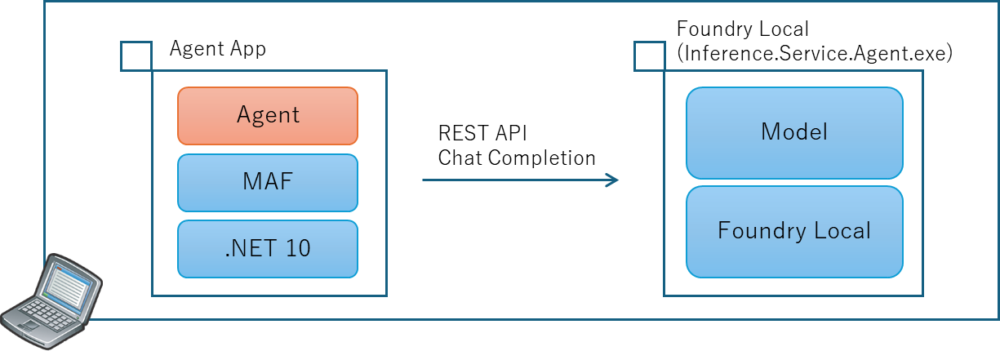
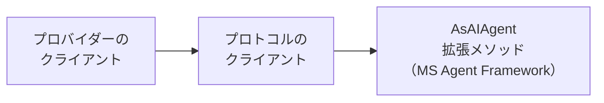
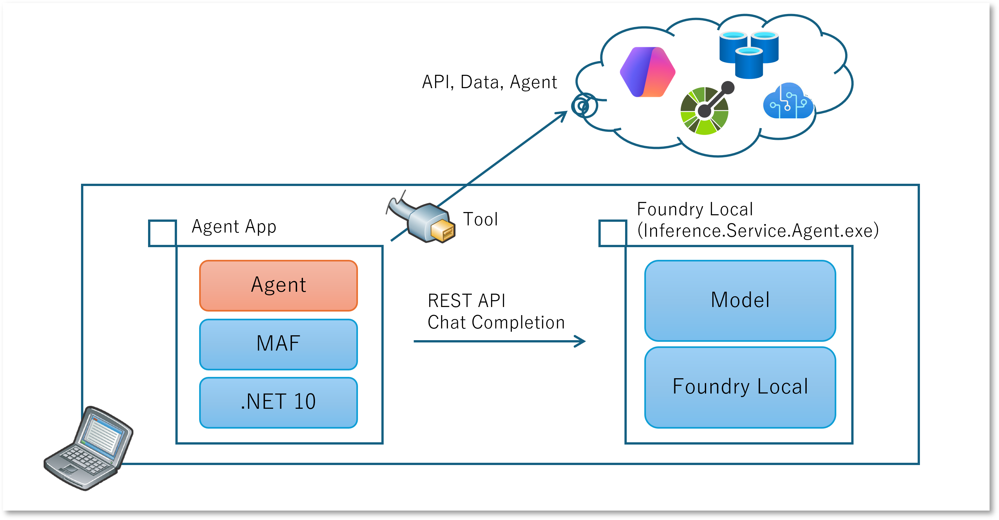
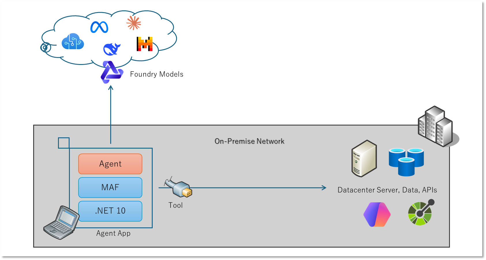
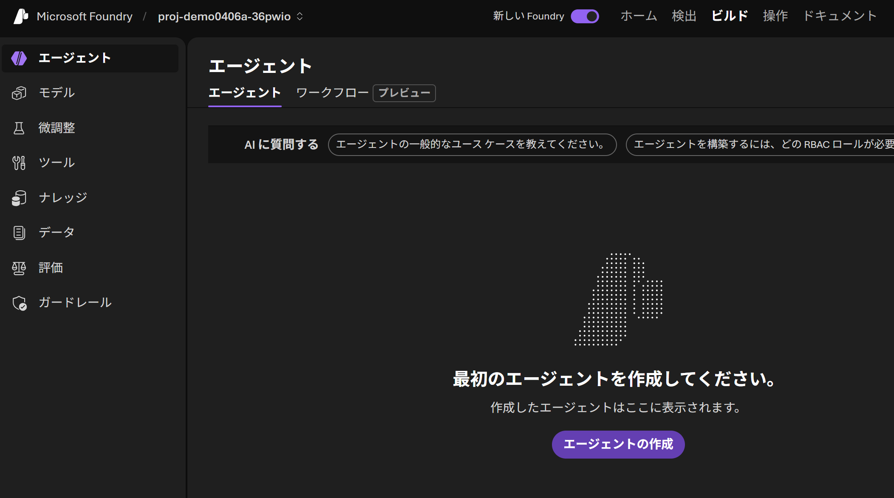
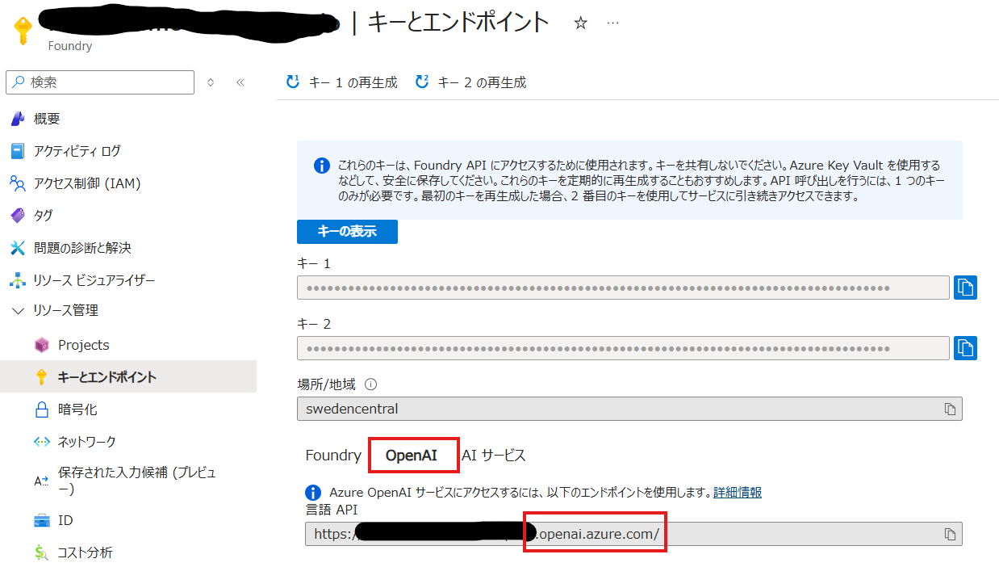
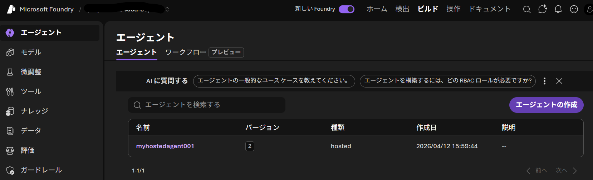
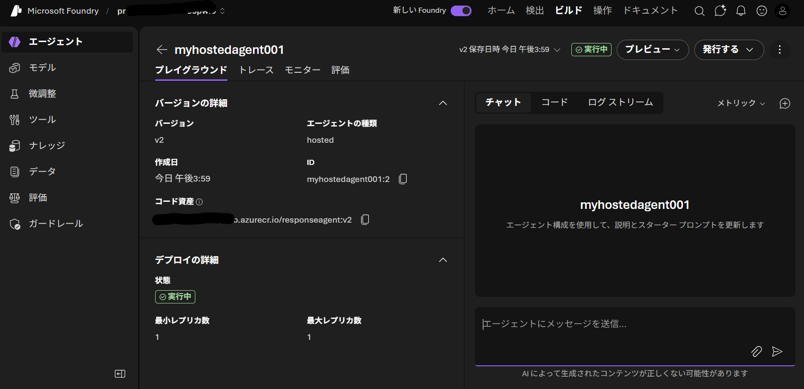

## はじめに

Microsoft Agent Framework が正式にリリースされ [Version 1.0 になりました](https://devblogs.microsoft.com/agent-framework/microsoft-agent-framework-version-1-0/)。
昨今は Agent を作るためのアレコレが非常に多いし、似たようなライブラリも多くて私自身かなり混乱しています。
というわけで、ちょっと知識の整理にために簡単なエージェントをいろいろ作ってみようと思った記録です。

Microsoft Agent Framework（長いので以降は MAF と書くことにします）は他のライブラリと似たような形式になっていて、
様々な[プロバイダー](https://learn.microsoft.com/ja-jp/agent-framework/agents/providers/?pivots=programming-language-csharp)に対応しています。
つまり Microsoft Azure や OpenAI を使わなくても（もちろん使っても）エージェントが作れる、という設計になってるようです。

全パターンを網羅するのは大変なので、以降では私が気になったところをピックアップして試してみようと思います。

### [参照] Microsoft Agent Framework

上記はリリースをアナウンスする記事ですが、公開されている情報は以下から得ることができます。

- [Project Website](https://learn.microsoft.com/ja-jp/agent-framework/)
- [Source Repository](https://github.com/microsoft/agent-framework)
- [Nuget Package](https://www.nuget.org/packages/Microsoft.Agents.AI)

## Step 1 : Foundry Local を使用してローカルで動作するエージェント

まずはクラウドのインフラに頼らず、手元の端末で動かすことのできるエージェントを作ってみたいと思います。

ここではローカルで言語モデルを動かしたいので [Foundry Local](https://learn.microsoft.com/ja-jp/azure/foundry-local/what-is-foundry-local) を使用しようと思います。
あと必要なのは .NET SDK と MAF のパッケージ [Microsoft.Agents.AI](https://www.nuget.org/packages/Microsoft.Agents.AI)になりますね。

なお MAF 自体はまだ [Foundry Local には対応してない](https://learn.microsoft.com/ja-jp/agent-framework/agents/providers/foundry-local?pivots=programming-language-csharp)ような記載になっていますが、
Foundry Local 自体は [REST API](https://learn.microsoft.com/ja-jp/azure/foundry-local/reference/reference-rest) も提供しており、Chat Completion で対話することができます。
つまり Agent を作ることができるはずです。



### Foundry Local 環境の準備とお試し

まずは Foundry Local を作業端末にインストールします。
Windows PC なら `winget install Microsoft.FoundryLocal` コマンドでインストールできますね。

インストールが終わったら動作確認してみましょう。
例えば `Phi-4-mini` であれば `foundry model run phi-4-mini` のようにモデル名を指定して実行できます。
初回はモデルのダウンロードが走るので時間がかかりますが、
ダウンロードが終われば以下のようにコンソールから対話することができます。

```powershell
Model Phi-4-mini-instruct-generic-cpu:5 was found in the local cache.

Interactive Chat. Enter /? or /help for help.
Press Ctrl+C to cancel generation. Type /exit to leave the chat.

Interactive mode, please enter your prompt

# 起動してプロンプトを入力することで対話が可能です。
> こんにちわ
🧠 Thinking...
🤖 "こんにちわ" (Konnichiwa) は、日本で一般的な挨拶で、"こんにちは" (Konnichiwa) として英語で知られる言葉です。これは昼間の挨拨で、友人や知人に会ったり、日常的なやり取りの中で使用される一般的な挨拶です。
>
```

### Foundry Local のモデルと Chat Completion API で対話する

さて Chat Completion REST API で呼び出してみましょう。
まずは以下のように `foundry service status` コマンドでポートを確認します。
ここではローカルホストのポート `50076` で待機してくれていることが分かります。

```
🟢 Model management service is running on http://127.0.0.1:50076/openai/status
```

> ちなみにこのポート番号、デフォルトではサービスや OS が再起動するために代わってしまって検証作業中は若干困ります。
> ポート番号は `foundry service set --port XXXX` コマンドで指定して安定させることができます。

Chat Completion API を呼び出すときにモデル名も必要になるのですが、これは `foundry cache list` コマンドで確認できます。
先ほど `foundry model run` で指定したモデル名 `phi-4-mini` は実はエイリアスで、モデルの実態はもう少し長い名前 `Phi-4-mini-instruct-generic-cpu:5` になっていることがわかります。
CPU 用のモデルをダウンロードして動いてたってことですね。

```
Models cached on device:
   Alias                                             Model ID
💾 phi-4-mini                                        Phi-4-mini-instruct-generic-cpu:5
```

これらをもとに HTTP Request を組み立ててあげます。
PowerShell や CURL とかで頑張ってもいいのですが、私は手っ取り早く [Visual Studio Code の REST Client Extension](https://marketplace.visualstudio.com/items?itemName=humao.rest-client) を使用しています。

```http
@port = 50076
POST http://localhost:{{port}}/v1/chat/completions
Content-Type: application/json

{
  "model": "Phi-4-mini-instruct-generic-cpu:5",
  "messages": [
    {
      "role": "system",
      "content": "関西弁でしゃべって"
    },
    {
      "role": "user",
      "content": "こんにちわ"
    }
  ]
}
```

結果は以下のような感じになります。
システム プロンプトで指定したように関西弁ではしゃべってくれてませんでしたが、これは Phi-4-mini の能力的な限界を超えている気がするので、ここは無視して先に進みましょう。

```http
HTTP/1.1 200 OK
Content-Length: 657
Connection: close
Content-Type: application/json
Date: Wed, 08 Apr 2026 05:57:12 GMT
Server: Kestrel

{
  "model": "Phi-4-mini-instruct-generic-cpu:5",
  "choices": [
    {
      "delta": {
        "role": "assistant",
        "content": "こんにちは！何かお手伝いできることはありますか？",
        "tool_calls": []
      },
      "message": {
        "role": "assistant",
        "content": "こんにちは！何かお手伝いできることはありますか？",
        "tool_calls": []
      },
      "index": 0,
      "finish_reason": "stop"
    }
  ],
  "created": 1775627832,
  "CreatedAt": "2026-04-08T05:57:12+00:00",
  "id": "chat.id.47",
  "IsDelta": false,
  "Successful": true,
  "HttpStatusCode": 0,
  "object": "chat.completion"
}
```

ちなみに使用できる REST API の仕様は
[ドキュメントに記載されています。](https://learn.microsoft.com/ja-jp/azure/foundry-local/reference/reference-rest)
Response API に対応していないのは今後に期待したいところですが、チャット以外にも音声の文字起こしや管理系の機能にも対応しているようです。
認証やアクセス制御の仕組みもないですし、もし Foundry Local を運用で使うならこういう SLM の機能提供としてではなく、同一端末で動作するクライアント アプリ向けに提供する、というのが現実的な気がします。

### [補足] REST API を使用したキャッシュ済みモデルの確認

ちなみにこのモデルのエイリアスや ID も REST API で確認できます。
```http
@port = 50076
GET http://localhost:{{port}}/openai/models
```
以下のような結果が得られます。

```http
HTTP/1.1 200 OK
Connection: close
Content-Type: application/json; charset=utf-8
Date: Wed, 08 Apr 2026 05:59:10 GMT
Server: Kestrel
Transfer-Encoding: chunked

[
  "Phi-4-mini-instruct-generic-cpu:5",
]
```

### Foundry Local と Chat Completion API で対話する

一応プログラムからも Chat Completion 出来ることを確認しておきます。
Chat Completion を呼び出すのは [OpenAI パッケージ](https://www.nuget.org/packages/OpenAI) を使用するのが手っ取り早いですし、
このライブラリが使用できる（＝互換性がある）なら、様々な知見やノウハウが活用できることが期待できます。

さて最終目的は MAF なんですが、その MAF が OpenAI ベースのエージェントを作成するには [Microsoft.Agents.AI.OpenAI パッケージ](https://www.nuget.org/packages/Microsoft.Agents.AI.OpenAI) が必要です。
そしてこのパッケージ自体が [OpenAI パッケージ](https://www.nuget.org/packages/OpenAI/) に依存しています。
つまり、[Microsoft.Agents.AI.OpenAI パッケージ](https://www.nuget.org/packages/Microsoft.Agents.AI.OpenAI) を参照しておけば一式そろいそうですね。

というわけで、以下のような [.NET 10 で導入された ファイルベースのアプリ](https://learn.microsoft.com/ja-jp/dotnet/core/sdk/file-based-apps) として作成してみました。
適当な `.cs` ファイルを用意してあげて、 `dotnet run filename.cs` コマンドで起動できます。

```csharp
#:package Microsoft.Agents.AI.OpenAI@1.0.0

using System.ClientModel;
using OpenAI;

var chatClient = GetChatClient();
var result = await chatClient.CompleteChatAsync("こんにちわ");

Console.WriteLine(result.GetRawResponse().Content.ToString());   

OpenAI.Chat.ChatClient GetChatClient()
{
    var credential = new ApiKeyCredential("dont-need-api-key");
    var option = new OpenAIClientOptions()
    {
        Endpoint = new Uri("http://localhost:50076/v1")
    };
    var openaiClient = new OpenAIClient(credential, option);
    var chatClient = openaiClient.GetChatClient("Phi-4-mini-instruct-generic-cpu:5");

    return chatClient;
}
```

SLM が何か返答を返してくれれば準備状況の確認は終わりです。

### Microsoft Agent Framework を使用して Foundry Local モデルを使用したエージェントを作成する

準備が長くなりましたが、ここまでくればエージェント作るのはもう一息です。
MAF には `AsAIAgent` という素敵なメソッドが用意されています。
ソースコード リポジトリ で[このメソッド名を検索](https://github.com/search?q=repo%3Amicrosoft%2Fagent-framework+path%3A%2F%5Edotnet%5C%2Fsrc%5C%2F%2F++asaiagent&type=code)
してみてほしいのですが、
様々なプロバイダー向けに拡張メソッドが用意されていることが分かります。

すでに取り寄せている `Microsoft.Agents.AI.OpenAI` パッケージに含まれる [OpenAIChatClientExtensions](https://github.com/microsoft/agent-framework/blob/main/dotnet/src/Microsoft.Agents.AI.OpenAI/Extensions/OpenAIChatClientExtensions.cs) クラスに
`OpenAI.Chat.ChatClient` の拡張メソッド [`AsAIAgent`](https://github.com/microsoft/agent-framework/blob/3e864cdb4c6031cf93096fa6af4d927b31126d8a/dotnet/src/Microsoft.Agents.AI.OpenAI/Extensions/OpenAIChatClientExtensions.cs#L35)
が含まれていますので、これを使うのが手っ取り早いでしょう。


```csharp
// AsAIAgent() のシグネチャ（他にもオーバーロードあり）
public static ChatClientAgent AsAIAgent(
        this OpenAI.Chat.ChatClient client,
        string? instructions = null, string? name = null, string? description = null, ...
```

ではエージェントを作成して呼び出すアプリを作ってみます。

```csharp
#:package Microsoft.Agents.AI.OpenAI@1.0.0


using System.ClientModel;
using OpenAI;
using OpenAI.Chat;

var chatClient = GetOpenAIChatClient();
var agent = CreateAgent(chatClient);
Console.WriteLine(await agent.RunAsync("今何時？"));

// OpenAI Chat Completion のクライアントからエージェントを作成する
Microsoft.Agents.AI.AIAgent CreateAgent(ChatClient chatClient)
{
    var agentName = "agent-with-foundry-local-model";
    var instructions = "関西弁でしゃべって";
    return chatClient.AsAIAgent(name: agentName, instructions: instructions);
}

// Fouondry Local を使用して PC 内でホストされている REST API を呼び出すためのクライアント（ChatClient）を作成する
OpenAI.Chat.ChatClient GetOpenAIChatClient()
{
    var credential = new ApiKeyCredential("dont-need-api-key");
    var option = new OpenAIClientOptions()
    {
        Endpoint = new Uri("http://localhost:50076/v1")
    };
    var openaiClient = new OpenAIClient(credential, option);
    var chatClient = openaiClient.GetChatClient("qwen2.5-7b-instruct-generic-cpu:4");

    return chatClient;
}
```

結果は以下のようになりました。

```
もちろん、関西の時間は現在の時刻に依存します。時刻を知りたい場合は、アラームを鳴らしてください！[時刻を確認するために][時刻の情報を取得するためのリンクをクリックしてください]。今、何をお手伝いしましょうか？
```
私は関西にいませんし、Webページでもないのでリンクもありません。
めっちゃハルシネーションを起こしてますね。
ちなみに何度も実行してみると、適当な時間を答えてみたり、分からないと答えたりもします。
とりあえず「エージェントは作れた」ということで・・・

### ツール呼び出しを組み込む

`foundry model list` コマンドで `phi-4-mini` が対応している機能を確認してみると、ツールの呼び出しには対応できていそうです。

```
Alias              Device     Task           File Size    License      Model ID
--------------------------------------------------------------------------------------------------------------------       
phi-4-mini         GPU        chat, tools    3.72 GB      MIT          Phi-4-mini-instruct-generic-gpu:5
                   CPU        chat, tools    4.80 GB      MIT          Phi-4-mini-instruct-generic-cpu:5
--------------------------------------------------------------------------------------------------------------------
```

それでは現在時刻を取得するツールを作成して組み込んでみましょう。
ソースコードは以下のようになります。

```csharp
var chatClient = GetOpenAIChatClient();
var agent = CreateAgent(chatClient);
Console.WriteLine(await agent.RunAsync("今何時？"));

// AsAIAgent に渡すパラメタを細かく指定できるオーバーロードを使用しています。
Microsoft.Agents.AI.AIAgent CreateAgent(OpenAI.Chat.ChatClient chatClient)
{
    var agentOptions = new ChatClientAgentOptions
    {
        Name = "agent-with-foundry-local-model",
        ChatOptions = new ChatOptions
        {
            Instructions = "関西弁でしゃべって",
            Tools = [AIFunctionFactory.Create(MyTools.GetCurrentDateTime)],
            ToolMode = ChatToolMode.Auto,
            Temperature = 0
        }
    };
    var agent = chatClient.AsAIAgent(agentOptions);
    return agent;
}

// 違うモデルを使用しています（理由は後述）
OpenAI.Chat.ChatClient GetOpenAIChatClient()
{
    var credential = new ApiKeyCredential("dont-need-api-key");
    var option = new OpenAIClientOptions()
    {
        Endpoint = new Uri("http://localhost:50076/v1")
    };
    var openaiClient = new OpenAIClient(credential, option);
    var chatClient = openaiClient.GetChatClient("qwen2.5-7b-instruct-generic-cpu:4");
    return chatClient;
}

// エージェントが使うツールを定義しています
internal static class MyTools
{
    [Description("Get the current date and time in a specific format.")]
    internal static string GetCurrentDateTime()
    {
        Console.WriteLine($"=== calling tool {nameof(GetCurrentDateTime)} ===");
        return DateTime.Now.ToString("yyyy-MM-dd HH:mm:ss.fff");
    }
}
```

実行した結果はこちら。

```
<tool_call>[{"name": "GetCurrentDateTime", "parameters": {}}]</tool_call>
現在の時間は10時39分11秒です。
```
関西弁では喋ってくれてないのと、ツールコール呼び出しっぽいものまで含まれています。
関西弁じゃないのはモデル機能としての限界だと思いますが、ツールコール呼び出しが含まれてしまっているのは `agent.RunAsync` の戻り値を雑に出力してるからですね。
戻り値のデータ型は文字列ではなく `AgentResponse` オブジェクトなので、途中のツール呼び出しの履歴まで含まれています。
これを `ToString()` するときに一緒に出てしまっているので、最終メッセージのコンテンツだけ表示するようにすればよいです。

>`Phi-4-mini` でも「現在時刻を呼び出すツール」を呼び出すこと自体は可能です。
>しかし phi-4-mini の特性なのか、どうしてもツールの実行結果を応答に組み込むタイミングで「ツールを呼び出してない」感じの応答にしてしまうようなので、ここでは `qwen2.5-7b` を使用することにしています。

### ここまでのまとめ

上記で分かるように「Chat Completion が喋れる API」があればエージェントは作れるということです。
サンプルコードではエンドポイントの URL が `localhost` になっていますが、向き先が Chat Completion 互換な Web API であれば同様に動作する可能性が高いですね。

また上記では Foundry Local にあわせる形で Chat Completion API を使用していましたが、OpenAI 互換な API という意味であれば Response API や Assitants API でも可能です。いずれの場合においても以下のような流れになるようです。



たとえば OpenAI に限らず様々なプロバイダーを抽象化して扱うことのできる `Microsoft.Extensions.AI.IChatClient` を引数に取る `AsAIAgent` オーバーロードも存在します。
（というか MAF 自体がこの MEAI に依存して作られています）
この MEAI の各種プロバイダー `Microsoft.Extensions.AI.Hogehoge` を使用して抽象化インタフェースである `IChatClient` を取得できてしまえば、後の実装は一緒ということになります。


またツール呼び出しが使えることも確認できました。
上記の例ではエージェント ローカルのツールを呼び出していますが、アレがリモートの WebAPI であっても呼び出せるはずです。
例えばデータの所在地や扱いの問題から「AI アプリを外部に出せない」ような制約があるとしましょう。
官公庁や医療系の案件だと多いのではないでしょうか。
とはいえ **エージェントが必要な機能のすべてがローカルにある必要はない** はずです。
というか全てをオンプレミスに閉じ込めるというのも現実的ではないでしょう。
クラウドサービスで提供されている一部機能は便利に使いつつ、機微情報の扱いはローカル端末に閉じる、いわゆる**ハイブリッド アーキテクチャ**も可能であると考えます。




## Step 2 : クラウド上の Foundry Models を使用してローカルで動作するエージェントを作成する

前述のようにローカルで動作する SLM では限界があるようであれば、クラウドで動作する LLM を使いたくなることもあるでしょう。
ここでは Azure サービスの 1 つであるMicrosoft Foundry の Models サービスでホストされている LLM を使用する方法を試してみます。

Chat Completion に対応しているものであれば前述の例のソースコードをそのままエンドポイントの向き先を変えてあげるだけでもいいのですが、ここでは MAF の Microsoft Foundry 用プロバイダーを使ってみます。




### Microsoft Foundry Model を使用したエージェントの基本的な作り方

まずは Azure で Foundry リソースとプロジェクトを用意し、モデルをデプロイしておきます。

そしてプログラミングを行うのですが、「最終的に AsAIAgent を使用する」という点は一緒です。
Micorosoft Foundry プロジェクトで作成しているなら 
[AIProjectClientに対する拡張メソッド](https://github.com/microsoft/agent-framework/blob/main/dotnet/src/Microsoft.Agents.AI.Foundry/AzureAIProjectChatClientExtensions.cs) 
を使用するのが手っ取り早いです。
つまり MAF の Foundry プロバイダーを実装している [Microsoft.Agents.AI.Foundry パッケージ](https://www.nuget.org/packages/Microsoft.Agents.AI.Foundry) を追加します。

ソースコードは以下のようになります。
Foundry リソースとの接続には Entra ID 認証を使用して RBAC アクセス制御も有効なので
[Azure.Identity パッケージ](https://www.nuget.org/packages/Azure.Identity)
も追加しておきます。
コード自体は前述のものとあまり変わりませんが、Chat Completion API や Response API のような **特定のプロトコル用のクライアント**を作らずに一気にエージェントまで作れてしまいます。

```csharp
#:package Microsoft.Agents.AI.Foundry@1.0.0
#:package Azure.Identity@1.20.0

using Azure.Identity;
using Azure.AI.Projects;

var projClient = GetFoundryProjectClient();
var agent = CreateAgent(projClient);
Console.WriteLine(await agent.RunAsync("今何時？"));

// クラウド上の Foundry Models サービスでホストされているモデルをベースにエージェントを作成する
Microsoft.Agents.AI.AIAgent CreateAgent(Azure.AI.Projects.AIProjectClient projClient)
{
    var agentName = "agent-with-msfoundry-model";
    var modelDeploymentName = "model-router";
    var instructions = "関西弁でしゃべって";
    var agent = projClient.AsAIAgent(
      name: agentName, 
      model: modelDeploymentName, 
      instructions: instructions,
      tools: [ AIFunctionFactory.Create(MyTools.GetCurrentDateTime) ]);
}

// クラウド上の Microsoft Foundry プロジェクトのエンドポイントに接続するクライアントを作成する
Azure.AI.Projects.AIProjectClient GetFoundryProjectClient()
{
    var endpoint = $"https://{foundry}.services.ai.azure.com/api/projects/{project}";
    var credential = new AzureCliCredential();
    var projClient = new AIProjectClient(new Uri(endpoint), credential);

    return projClient;
}
```

実行すると以下のようになります。
流石に LLM だと関西弁では喋ってくれますし、もちろんツールも呼び出してくれていますね。

```
今は11時25分やで！なんか予定あるん？
```

### ここまでのまとめ

このケースで考えられるのは、オンプレミス環境に存在する機微なデータや、それを扱う API を使用したい、とはいえモデルは（ローカルで動くような SLM ではなく）クラウドで動作する高機能な LLM を使用したい、ということもあるでしょう。

通信経路的には機微なデータが企業の環境から外部には出てしまいます。
データの扱いとして TLS と Entra ID 認証だけではセキュリティ要件を満たせない、という場合には Express Route や VPN 等を使用して閉域化することは可能です。

またデータが一時的にとはいえ外部にでるということは、保存されたり、流出したり、学習等に活用されたりという懸念もあるでしょう。
そのようなケースでは Microsoft Foundry の Direct モデルをご利用いただくことをお勧めします。
詳細は以下をご参照ください。

- [Microsoft Foundry の Azure Direct モデルのデータ、プライバシー、セキュリティ](https://learn.microsoft.com/ja-jp/azure/foundry/responsible-ai/openai/data-privacy)

ただ一部の機能を使用するとクラウド上に「保存」自体はされてしまうことになりますのでご注意を。

### [補足] Microsoft Foundry に登録されていない野良エージェント

先ほど作ったエージェントなのですが、Foundry Portal (https://ai.azure.com) を参照するとエージェントとしては管理されていないことがわかります。
クラウド上の Microsoft Foundry を使用していますが、あくまでもそこでホストされているモデルを使用しているだけの「野良エージェント」という位置づけになります。



### [補足] AI Foundry SDK を使用しないパターン

先ほどは Azure AI Foundry SDK の一部である [Azure.AI.Projects パッケージ](https://www.nuget.org/packages/Azure.AI.Projects/) に含まれる
`AIProjectClient` クラスを使用していました。
これはアプリケーションが Microsoft Foundry 用の MAF 拡張である 
[Microsoft.Agents.AI.Foundry パッケージ](https://www.nuget.org/packages/Microsoft.Agents.AI.Foundry) を使用していたため、
その依存関係として使えるようになっていたものです。

とはいえ、Foundry に強く依存したくない（別のサービスと切り替えたい）というケースもあるでしょう。
その場合は以下の2方針が考えられます。

- OpenAI ライブラリを使用して互換サービスを利用する
  - 先ほど Foundry Local の例で見た通り、Chat Completion のような OpenAI プロトコルであれば OpenAI のライブラリが利用できます。
  - 先ほどの例であれば接続先の URL や認証情報を書き換えてあげればよいでしょう。
  - Microsoft Foundry モデルも OpenAI 用のエンドポイント https://{foundry}.openai.azure.com を利用可能です。
- [Microsoft.Extensions.AI](https://www.nuget.org/packages/Microsoft.Extensions.AI) を使用してサービスを抽象化する
  - MAF は内部的にこの `Microsoft.Extensions.AI` パッケージを使用しており、抽象インタフェースとして [IChatClient](https://github.com/dotnet/extensions/blob/main/src/Libraries/Microsoft.Extensions.AI.Abstractions/ChatCompletion/IChatClient.cs) が定義されています。
  - MAF ではその `IChatClient` の拡張メソッド [AsAiAgent](https://github.com/microsoft/agent-framework/blob/main/dotnet/src/Microsoft.Agents.AI/ChatClient/ChatClientExtensions.cs) が提供されていますので、こちらを使用してエージェントを作成します。

## Step 3 : ASP.NET でエージェント機能を Web サービスとして提供する

ここまでは Console アプリケーションとしてエージェントを作ってきましたが、折角なので作成したエージェントを広く使ってもらいたくもなるでしょう。
このような状況では Web アプリケーションで UI を提供するか、API を提供して他のサービスやツールに組み込んでもらうことになります。

### ASP.NET Core WebAPI にエージェントを組み込む

先ほど作成した Microsoft Foundry モデルを使用したエージェントを ASP.NET Core WebAPI に組み込んでみましょう。
上記では `AIProjectClient` や `AIAgent` を毎回生成していたのですが、ここでは Dependency Injection を使用してインスタンスを登録しています。

```csharp
#:sdk Microsoft.NET.Sdk.Web
#:property PublishAot=false
#:package Azure.Identity@1.20.0
#:package Microsoft.Agents.AI.Foundry@1.0.0

using System.ComponentModel;
using Azure.AI.Projects;
using Azure.Identity;
using Microsoft.Agents.AI;
using Microsoft.Extensions.AI;

var builder = WebApplication.CreateBuilder(args);

// DI に AIProjectClient を登録
builder.Services.AddSingleton<AIProjectClient>(sp => {
    var endpoint = $"https://{foundry}.services.ai.azure.com/api/projects/{project}";
    var credential = new AzureCliCredential();
    var projClient = new AIProjectClient(new Uri(endpoint), credential);
    return projClient;  
});

// DI に AIAgent を登録
builder.Services.AddSingleton<AIAgent>(sp => {
    var projClient = sp.GetRequiredService<AIProjectClient>();
    var agent = projClient.AsAIAgent(
        name: "agent-run-on-local-aspnet",
        model: "model-router",
        instructions: "関西弁でしゃべって",
        tools: [
            AIFunctionFactory.Create(GetCurrentTime),
        ]);
    return agent;
});

var app = builder.Build();

// Web API が呼び出されたらエージェントで処理して返す
app.MapGet("/", async (AIAgent agent) => {
    var ret = await agent.RunAsync("今何時？");
    Console.WriteLine($"{ret.GetType().ToString()} : {ret}");
    return ret;
});

await app.RunAsync();

// ツールの定義
[Description("Get the current time in a specific format.")]
static string GetCurrentTime()
{
    return DateTime.Now.ToString("yyyy-MM-dd HH:mm:ss.fff");
}
```

雑な作りではありますが、これを実行してホストされた http://localhost:5000 をブラウザ等で開く（HTTP GET）するとと以下のような回答が返ってきます。
機能的にはほとんど変えていないので、関西弁で現在時刻を教えてくれています。
~~「おおきに」って言えば関西弁っていうわけでもないと思いますが~~

```json
{
  "messages": [
    {
      "authorName": "agent-run-on-local-aspnet",
      "createdAt": "2026-04-12T03:00:21+00:00",
      "role": "assistant",
      "contents": [
        {
          "$type": "functionCall",
          "name": "_Main_g_GetCurrentTime_0_3",
          "arguments": {},
          "informationalOnly": true,
          "callId": "call_pVZKq6BJpOEnonP1uUeQ5naY",
          "annotations": null,
          "additionalProperties": null
        }
      ],
      "messageId": null,
      "additionalProperties": null
    },
    {
      "authorName": "agent-run-on-local-aspnet",
      "createdAt": null,
      "role": "tool",
      "contents": [
        {
          "$type": "functionResult",
          "result": "2026-04-12 12:00:29.346",
          "callId": "call_pVZKq6BJpOEnonP1uUeQ5naY",
          "annotations": null,
          "additionalProperties": null
        }
      ],
      "messageId": null,
      "additionalProperties": null
    },
    {
      "authorName": "agent-run-on-local-aspnet",
      "createdAt": "2026-04-12T03:00:27+00:00",
      "role": "assistant",
      "contents": [
        {
          "$type": "text",
          "text": "おおきに！今は2026年4月12日 12時00分29秒やで。",
          "annotations": null,
          "additionalProperties": null
        }
      ],
      "messageId": "msg_06aa0f258cf90f890069db0acd3acc8196b9d8b1a974cb5dd6",
      "additionalProperties": null
    }
  ],
  "agentId": "b620fec17f734b9b9b59afd1aa416ef8",
  "responseId": "resp_06aa0f258cf90f890069db0acbf9848196a27e4b49f50f3b51",
  "continuationToken": null,
  "createdAt": "2026-04-12T03:00:27+00:00",
  "finishReason": null,
  "usage": {
    "inputTokenCount": 192,
    "outputTokenCount": 702,
    "totalTokenCount": 894,
    "cachedInputTokenCount": 0,
    "reasoningTokenCount": 320,
    "additionalCounts": null
  },
  "additionalProperties": null
}
```

先ほどまでの例では標準出力に AIAgent の `RunAsync` の戻り値を `ToString` した結果を文字列として表示していましたが、
今回のコードでは ASP.NET Core Web API でオブジェクトを返しているので JSON にシリアライズされて、エージェントの応答全てが確認できている、ということになります。

### ここまでのまとめ

雑な作りではありますが、MAF を使用して AIAgent オブジェクトを作成してあげれば、AIAgent なアプリを実装するのはそれほど難しくないと思います。
あとはエージェントに求められる「要件」に合わせて Web API なりブラウザで表示する UI を実装してあげれば良いかと思います。
オンプレのサーバーで動かしてもいいですし、Azure App Sercice や Azure Container Apps 上にホストして運用負荷を軽減するのもよいでしょう。
.NET の Dependency Injection の仕組みを使っているので Azure Functions に組み込んであげるという方法も考えられます。

とはいえ、そうやって独自に作った Web API なエージェントは、API 仕様としては独自設計なので他のサービスとの相互運用性が弱くなります。

## Step 4 : Hosting Adapter と Microsoft Foundry Hosted Agent

相互運用性を考えた場合には対話のプロトコルが標準化されていることが重要です。
Microsoft Foundry の Agent Service で作成した「プロンプト ベース エージェント」は、
発行によって [Response API で対話できる](https://learn.microsoft.com/ja-jp/azure/foundry/agents/how-to/publish-agent) ようになります。
これによって Response API 対応の任意のクライアントから接続できますし、例えば Copilot や Teams を使って対話できるようになるわけです。

先ほどまでは ASP.NET Core を使用して独自仕様のエージェントとして開発しましたが、この Response API 対応を考えていきたいと思います。
とはいえ、さすがに [Responses API](https://developers.openai.com/api/reference/responses/overview) を自力実装するのは大変です。
どうしましょう。

### Hostig Adapter を使用してエージェントを Response API でホストする

この MAF で作成したエージェントは [ホスティング アダプター](https://learn.microsoft.com/en-us/dotnet/api/overview/azure/ai.agentserver.agentframework-readme?view=azure-dotnet-preview)
を使用してホストしてあげることで Response API に対応できます。

- [Azure AI Agent Server client library for .NET (Azure SDK for .NET)](https://learn.microsoft.com/en-us/dotnet/api/overview/azure/ai.agentserver.agentframework-readme?view=azure-dotnet-preview)
- [Azure.AI.AgentServer.AgentFramework パッケージ (nuget)](https://www.nuget.org/packages/Azure.AI.AgentServer.AgentFramework/1.0.0-beta.11#versions-body-tab)
- [Microsoft Foundry Hosted Agents (sample code)](https://github.com/Azure-Samples/foundry-hosted-agents-dotnet-demo?tab=readme-ov-file)

サンプルコードを見ると長々と書いてあるのですが、実は Hosting Adapter の適用自体は簡単で、
ホスティング アダプターで提供されている AIAgent の拡張メソッド [`RunAIAgentAsync`](https://learn.microsoft.com/en-us/dotnet/api/azure.ai.agentserver.agentframework.extensions.aiagentextensions?view=azure-dotnet-preview) 
を呼び出してあげるだけです。

だけなんですが、どうも本記事執筆時点のホスティングアダプター Version `1.0.0-beta.11` と、
最近リリースされた MAF の正式版 Version `1.0.0` だと内部的なライブラリが不整合を起こしているのか、うまく動きません。
Agent 呼び出すとランタイムエラーになっちゃう。
というわけでちょっと古いバージョンの Hosting Adapter Version `1.0.0-beta.9` および  MAF の Version `1.0.0-rc3` を使用しています。
後でちょっと補足します。

```csharp
#:property PublishAot=false
#:package Azure.Identity@1.20.0
#:package Azure.AI.AgentServer.AgentFramework@1.0.0-beta.9
#:package Microsoft.Agents.AI.OpenAI@1.0.0-rc3

using System.ComponentModel;
using Azure.AI.AgentServer.AgentFramework.Extensions;
using Azure.Identity;
using Microsoft.Extensions.AI;
using OpenAI.Chat;

var chatClient = GetOpenAIChatClient();
var agent = CreateAgent(chatClient);

// 作成したエージェントをホスティング アダプターを使用してホスト
await agent.RunAIAgentAsync();

// Step 1 と同様に OpenAI の ChatClient を生成していますが、Foundry 相手なら Entra ID 認証したいので AzureOpenAIClient 経由で生成
OpenAI.Chat.ChatClient GetOpenAIChatClient()
{
    var endpoint = $"https://{foundry}.openai.azure.com";
    var credential = new AzureCliCredential();
    var aoaiClient = new Azure.AI.OpenAI.AzureOpenAIClient(new Uri(endpoint), credential);
    return aoaiClient.GetChatClient("gpt-4.1");
}

// Agent 作るところは一緒ですが、LLM だと ToolMode や Temperature を指定しなくてもツール呼んでくれるので、ここでは簡易なオーバーロードを使用
Microsoft.Agents.AI.AIAgent CreateAgent(OpenAI.Chat.ChatClient chatClient)
{
    var agentName = "agent-with-hosted-on-adaputer";
    var inst = "関西弁でしゃべって";

    return chatClient.AsAIAgent(
        name:agentName,
        instructions: inst,
        tools: [ AIFunctionFactory.Create(MyTools.GetCurrentDateTime) ]
    );
}

internal static class MyTools
{
    [Description("Get the current date and time in a specific format.")]
    internal static string GetCurrentDateTime()
    {
        Console.WriteLine($"=== calling tool {nameof(GetCurrentDateTime)} ===");
        return DateTime.Now.ToString("yyyy-MM-dd HH:mm:ss.fff");
    }
}
```

起動するとデフォルトでは ポート 8088 でホストしてる旨が標準出力に表示されますので、そこを REST Client 等から Responses API として呼び出してあげます。

```http
@port = 8088
###
POST http://localhost:{{port}}/responses
Content-Type: application/json

{
    "input": "今何時？"
}
```

成功すると以下のような結果が返ってきます。

```json
{
  "metadata": null,
  "temperature": null,
  "top_p": null,
  "user": null,
  "id": "resp_r0ICuptyITl4Tm0aMr8wxnuEqE1EmyjQvCIsl032wg9tsBs2Hw",
  "object": "response",
  "status": "completed",
  "created_at": 1775971627,
  "error": null,
  "incomplete_details": null,
  "output": [
    {
      "type": "function_call",
      "id": "func_r0ICuptyITl4Tm0aMrLmmwPxHY31Do4hkbPeGzCN0KmMuu4tfC",
      "created_by": {
        "agent": {
          "type": "agent_id",
          "name": "agent-with-hosted-on-adaputer",
          "version": ""
        },
        "response_id": "resp_r0ICuptyITl4Tm0aMr8wxnuEqE1EmyjQvCIsl032wg9tsBs2Hw"
      },
      "status": "completed",
      "call_id": "call_vL1GLX50buS3fphpnBYxj107",
      "name": "GetCurrentDateTime",
      "arguments": "{}"
    },
    {
      "type": "function_call_output",
      "id": "funcout_r0ICuptyITl4Tm0aMrJ3VEKsyXxddpEZRdba7HB8cCQFYi2eDw",
      "created_by": {
        "agent": {
          "type": "agent_id",
          "name": "agent-with-hosted-on-adaputer",
          "version": ""
        },
        "response_id": "resp_r0ICuptyITl4Tm0aMr8wxnuEqE1EmyjQvCIsl032wg9tsBs2Hw"
      },
      "status": "completed",
      "call_id": "call_vL1GLX50buS3fphpnBYxj107",
      "output": "2026-04-12 14:27:10.236"
    },
    {
      "type": "message",
      "id": "msg_r0ICuptyITl4Tm0aMrjUFueCVFLJxdiSk5q8MTUt2NXaWNhhLD",
      "created_by": {
        "agent": {
          "type": "agent_id",
          "name": "agent-with-hosted-on-adaputer",
          "version": ""
        },
        "response_id": "resp_r0ICuptyITl4Tm0aMr8wxnuEqE1EmyjQvCIsl032wg9tsBs2Hw"
      },
      "status": "completed",
      "role": "assistant",
      "content": [
        {
          "type": "output_text",
          "text": "今は2026年4月12日、14時27分やで！",
          "annotations": []
        }
      ]
    }
  ],
  "instructions": null,
  "usage": {
    "input_tokens": 152,
    "input_tokens_details": null,
    "output_tokens": 32,
    "output_tokens_details": null,
    "total_tokens": 184
  },
  "parallel_tool_calls": false,
  "conversation": null
}
```

#### [補足] ライブラリのバージョンや非互換について

ホスティング アダプター [Azure.AI.AgentServer.AgentFramework](https://www.nuget.org/packages/Azure.AI.AgentServer.AgentFramework) 
は本記事執筆時点ではベータ段階で、最新のバージョンは `1.0.0-beta.11` となっており正式版がリリースされておりません。
またこのバージョンは後述の Microsoft Foundry 上で動作させようとするとうまく動かず、サンプルコードにあった `1.0.0-beta.9` まで戻して使用しています。

またこれらベータ段階のホスティングアダプターに対応する Microsoft Agent Framework も `1.0.0-rc3` となっており、正式版では組み合わせて動作しません。
しかも Microsoft Foundry 用のプロバイダー [Microsoft.Agents.AI.Foundry](https://www.nuget.org/packages/Microsoft.Agents.AI.Foundry) はこの `1.0.0-rc3` が公開されていないのです。
OpenAI 用のプロバイダー [Microsoft.Agents.AI.OpenAI](https://www.nuget.org/packages/Microsoft.Agents.AI.OpenAI) の `1.0.0-rc3` は公開されていたのでそちらを使っています。
このため Foundry のプロジェクトエンドポイントから **ではなく**、 Foundry の OpenAI エンドポイント経由での呼び出しにしています。



ホスティング アダプターの正式版がリリースされたらこの辺も美しくなることを期待しつつ、先に進みます。

### Microsoft Foundry に Hosted Agent としてデプロイする

さて作ったエージェント アプリを早速 Microsoft Foundry にデプロイしたいところですが、いくつか手順があるのでかいつまんで紹介していきます。
詳細はMicrosoft Foundry の [Hosted Agent](https://learn.microsoft.com/ja-jp/azure/foundry/agents/how-to/deploy-hosted-agent?tabs=bash) あたりをご参照ください。

#### エージェントアプリのコンテナ化

まずはホスティング アダプターを使用してエージェントをホストするアプリをコンテナでくるんであげる必要があります。
ビルドコンテナで `publish` しておいて実行可能ファイルを runtime コンテナに持ち込むのが正しいんでしょうが、ここは簡易的に以下の Dockerfile として実装します。
（下記の `runagent_on_hostingadapter.cs` ファイルが前述のサンプルコードになります）

```dockerfile
FROM mcr.microsoft.com/dotnet/sdk:10.0-alpine AS final
WORKDIR /app

COPY ./runagent_on_hostingadapter.cs .
RUN dotnet restore ./runagent_on_hostingadapter.cs
RUN dotnet build ./runagent_on_hostingadapter.cs

EXPOSE 8088
ENTRYPOINT ["dotnet", "run", "./runagent_on_hostingadapter.cs"]
```

これまでは開発環境で動作させていたので、Foundry Models へのアクセスには `AzureCliCredential` を使用していました。
が、これは Azure CLI を使用して `az login` した際の認証情報キャッシュを使っているので、Foundry 等のクラウド PaaS 上では動作しません。
そちらでは Managed Identity を使用することになるため、以下のようにコードを書き換えて開発環境とクラウド環境の両対応を目指します。

```csharp
var credential = new ChainedTokenCredential(
    new ManagedIdentityCredential(new ManagedIdentityCredentialOptions()),
    new AzureCliCredential()
);
```

このあと Docker を使用してコンテナイメージをビルドして動作確認したいのですが、ここでも Credential 問題が付きまといます。
もう面倒なのでテストせずにコンテナをぶち込んでいきます。
ビルドも Azure Container Registry にやらせてしまいましょう。

```powershell
az acr login -n ${yourRegistryName}
az acr build -r ${yourRegistryName} -t myhostingagent:v1
```

#### コンテナイメージからホステッドエージェントを作成する

コンテナイメージが出来上がったら、Microsoft Foundry プロジェクトが上記の ACR からコンテナイメージを Pull 出来る必要があります。
つまりプロジェクトレベルの システム 割り当て マネージド ID に、前述の レジストリに対する ACRPull を割り当てる必要があるわけですね。

ポータルからちくちくやってもいいですし、コマンドラインでやるなら以下のようになります。

```powershell
az role assignment create 
        --assignee ${マネージ ID のオブジェクト ID (GUID)} `
        --role AcrPull 
        --scope /subscriptions/${サブスクリプションID}/resourceGroups/${リソースグループ名}/providers/Microsoft.ContainerRegistry/registries/${レジストリ名}
```

アクセス権の設定ができたらコンテナイメージからエージェントを作成します。
これも Azure Developer CLI を使ったりプログラムコードで実装したりといろいろやり方はあるみたいなのですが、
Azure CLI が分かりやすくていいんじゃないかなと思います（個人的な趣味とも言う）。
この辺のコマンドラインについては[ドキュメントを参照](https://learn.microsoft.com/en-us/cli/azure/cognitiveservices/agent?view=azure-cli-latest)
していただくとよろしいかと思います。

```powershell
az cognitiveservices agent create `
    --account-name ${Foundryの名前}$ `
    --project-name ${Foundryプロジェクトの名前} `
    --name ${作成するエージェントの名前} `
    --image ${使用するコンテナイメージ acrName.azurecr.io/containerImage:tagName}
```

#### エージェントの認証情報の設定

さて動作させる前にもう一つ、コンテナとして送り込んだエージェントに対して、LLM へのアクセス権が必要になります。
前述の例のようにエージェントは頭脳として Foundry Model を使用していますので、当然そこにアクセス可能である必要があります。
というわけで、「プロジェクト レベルのマネージド ID に対して、Foundry の Azure AI User ロールを割り当てておきましょう。

### ホステッドエージェントの動作確認

やっと出来たホステッドエージェント、折角なので動かしてみたいですよね。

#### Foundry ポータルの Playground を使用して試してみる

Foundry Potal でエージェント画面を開いてみると、ついに先ほど `az cognitiveservices agent create` したエージェントが現れます。



これを選択すると Playground を使って話しかけられるのですが、なぜか応答が返ってきません。
ログストリームとか見てもエラーとか出てないんですが、ライブラリもベータ版ですし、サービス自体もまだプレビュー段階なので、
これは現段階では仕方ないのかなあというところです。



#### クライアント アプリから試してみる

Playground でコード画面を開くと、SDK を使用したクライアントアプリのサンプルコードが表示されます。
これも私が表示した時点ではちょっと古く、そのままではコンパイルエラーになるのですが、ちょっとした手直しで動かしました。
Playground で作成したプロンプト ベース エージェントのクライアントアプリとほぼ一緒ですね。

```csharp
#:package Azure.AI.Projects@2.0.0

using Azure.AI.Projects;
using Azure.AI.Projects.Agents;
using Azure.AI.Extensions.OpenAI;
using Azure.Identity;
using OpenAI.Responses;

#pragma warning disable OPENAI001

// Foundry プロジェクトのクライアントを作り
const string projectEndpoint = $"https://{foundry}.services.ai.azure.com/api/projects/{project}";
AIProjectClient projectClient = new(endpoint: new Uri(projectEndpoint), tokenProvider: new AzureCliCredential());

// エージェント名とバージョンを指定してエージェントの参照情報を作り
const string agentName = $"{agentName}";
const string agentVersion = "2";
AgentReference agentReference = new(name: agentName, version: agentVersion);

// エージェントと Response API で会話するためのクライアントを作り
ProjectResponsesClient responseClient = projectClient.GetProjectOpenAIClient().GetProjectResponsesClientForAgent(agentReference);

// 話しかけます
ResponseResult response = responseClient.CreateResponse(
    "今何時？"
);

Console.WriteLine(response.GetOutputText());
```

結果は以下のようになりました。
動作環境が日本国内の PC じゃないので、タイムゾーンがグリニッジ標準時に変わってしまっていますが、ちゃんと動作している模様です。

```
今は2026年4月12日、朝の7時23分やで！
```

## おわりに

ここまで読んでいただいた方、長々とありがとうございました。（本当に長かった）

2026 年 4 月 2 日に Microsoft Agent Framework が正式リリースされたので、
その記念と勉強もかねていろいろ試してみたかっただけなのですが、いろいろと試行錯誤が必要でした。
私の技術力の問題といえばそれまでなのですが、時差の関係でエイプリルフールなんじゃないかと思ったともいいます。
正式リリースされたとはいえ一部機能はまだプレビューや試験段階な機能もあるみたいですし、
関連するホスティング アダプターもまだプレビューだし、
この記事を執筆している 4 月 12 日に Version 1.1.0 がリリースされていたりします。
正直なところを言えば、必要な情報が出そろって、各種のノウハウが蓄積され、安定して開発・運用に使えるようにはしばらく時間がかかりそうだなあという印象です。

とはいえ、エージェント開発としては割とシンプルな形に落ち着くようになるんじゃないかなとも思っています。
様々なプロバイダーに対応するために、ライブラリとしては少しわかりにくくなっている面もあるのですが、このあたりも情報がそろってしまえば使いやすくなるのかなと。

Microsoft さんとしては全てのエージェント関連リソースを Azure で統一したいという野望はもちろんあるんでしょうが、
上記の通り技術的には エージェントの開発環境も実行環境も、そこで使用する SDK にも Microsoft な縛りがありません。
（OpenAI 発とは言え）Chat Completions や Responses API もプロトコルとしては標準的といってもいいでしょうし、
上記では触れることすらできなかった MCP や A2A といったプロトコルにも対応していくようです。

一方で好き勝手にエージェントを作られて野良エージェントが大量発生してしまえば、企業としてはそれはそれで困ってしまうわけですよね。
作りとしてはオープンな標準（お作法？）に則りつつ、管理性は犠牲にしないで開発生産性を最大化できるといいなあと思っています。

個人的にはまだまだ調査・確認したいことは山ほどあるのですが、まずは僕と同じ初心者向けのドキュメントとしてお役に立てれば幸いです。
