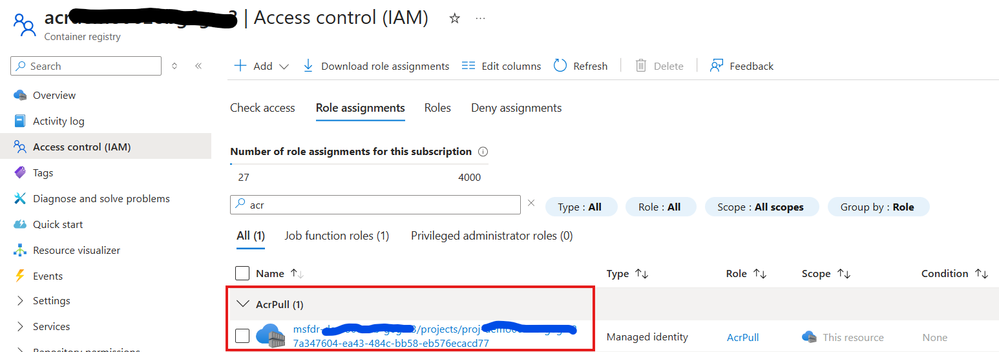
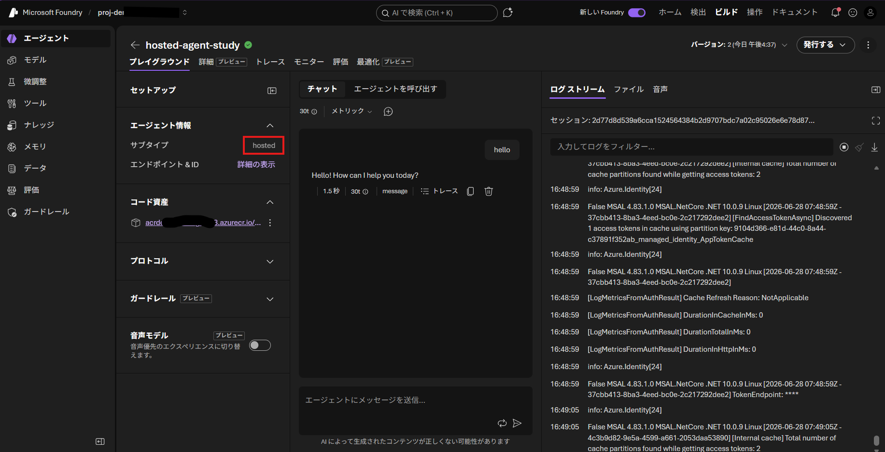

## はじめに

Microsoft Build 2026 前後で Microsoft Foundry の [Hosted Agent](https://learn.microsoft.com/ja-jp/azure/foundry/agents/concepts/hosted-agents) が新しくなりましたね。
実際にこれを利用する方法としては [クイックスタート](https://learn.microsoft.com/ja-jp/azure/foundry/agents/quickstarts/quickstart-hosted-agent?pivots=azd) を辿っていけばいいのですが、
試していていくつか違和感というかやりにくさを感じました。
端的に言えば `Azure Developer CLI` や `Visual Studio Code Foundry Toolkit Extension` がかなりスキャフォールドしてくれたり自動化してくれたりするので、「楽ではあるけど何やってるか良くわからないし、実際の開発に組み込むときに工夫がいるのでは？」と感じました。

というわけで、自分なりに [Microsoft Agent Framework](https://learn.microsoft.com/ja-jp/agent-framework/overview/?pivots=programming-language-csharp) を使用して C# でエージェントを開発し、
Microsoft Foundry にコンテナとしてデプロイする一連の流れを整理してみようと思ったといいます。
リリースされたとはいえ Preview なものも多々含まれるので、まだまだ変わりそうだなあとも思うのですが・・・

## エージェント開発からデプロイまでの一連の流れ

### 前提条件

まず、作業開始の前に以下を前提条件として考えています。
実プロジェクトではインフラ側とアプリ側は割と役割が分離していることが多く、`azd up` で一発デプロイとか無いんじゃないかなと思うんですよね。

- Microsoft Foundry や Project はすでに作成されている
- Azure Container Registry はすでに作成されている
- この環境に Hosted Agent をデプロイしたい
- エージェント開発には .NET 10 と Microsoft Agent Framework を使用する

### まずはエージェントを作ろう

早速エージェントを開発していくのですが、エージェントの中身は本題ではないので、ここでは簡単に作っていきます。

```pwsh
# 開発のルートを作って移動（ GitHub 等でソース管理するワークスペースのルート）
mkdir hosted-agent-sample && cd hosted-agent-sample

# ソースコードを配置するディレクトリを作って移動
mkdir src && cd src

# Console プロジェクトを作成して
dotnet new console -o agent001 && cd agent001

# 必要なパッケージを追加
dotnet add package Azure.AI.Projects --prerelease
dotnet add package Microsoft.Agents.AI.Foundry.Hosting --prerelease
```

C# のプロジェクトができるので、エージェントのコードを作成していきます。
基本的には通常のエージェント開発ではあるのですが、後々に Hosted Agent にデプロイすることを考慮したコードにしておきます。

- Foundry プロジェクトのエンドポイントやモデルデプロイ名は `Microsoft.Extensions.Configuration` を使用して取得する
    - 開発時には `appsettings.json`、`appsettings.Development.json`、`secrets.json` 等の **構成ファイル** から取得する
    - テストや本番展開では Hosted Agent の **環境変数** から取得して構成ファイルの値を上書きする

- Hosted Agent の環境では既定で挿入される環境変数に名前をそろえる
    - ここでは プロジェクト エンドポイント `FOUNDRY_PROJECT_ENDPOINT` や Application Insights の接続文字列 `APPLICATIONINSIGHTS_CONNECTION_STRING` が該当する
    - モデルデプロイ名は `AZURE_AI_MODEL_DEPLOYMENT_NAME` から取得するようにしておくとよい（必須ではないが後で手間が省けるため）
    - それ以外の [プラットフォームによって挿入される環境変数](https://learn.microsoft.com/ja-jp/azure/foundry/agents/how-to/deploy-hosted-agent#platform-injected-environment-variables) は公式ドキュメントを参照

- Foundry Models サービスと通信する際のクレデンシャルを設定しておく
    - 開発環境では Azure CLI を使用して `az login` した際のクレデンシャル（＝自分のユーザー ID） を使用する
    - テストや本番環境では Managed ID を使用する（＝ Foundry プロジェクトに割り当てられる Managed ID）
    - どちらのクレデンシャルにも [`Foundry User` RBAC ロールが割り当てられている](https://learn.microsoft.com/ja-jp/azure/foundry/concepts/rbac-foundry?tabs=owner) ものとする

```csharp
using Microsoft.Extensions.Configuration;
using Azure.Identity;
using Azure.AI.Projects;
using Microsoft.Agents.AI;
using Microsoft.Agents.AI.Foundry.Hosting;

// 構成を取得する
var config = new ConfigurationBuilder()
    .SetBasePath(AppDomain.CurrentDomain.BaseDirectory)
    .AddJsonFile("appsettings.json", optional: false)               // 設定値を構成ファイルから取得
    .AddEnvironmentVariables()                                      // テストや本番環境では環境変数で上書き
    .Build();

// Foundry Hosted Agent 環境でプラットフォームから挿入される環境変数と名前を合わせておく
var projectEndpoint = new Uri(config["FOUNDRY_PROJECT_ENDPOINT"]!);
var appInsightConstr = config["APPLICATIONINSIGHTS_CONNECTION_STRING"]!;

// その他の設定値も構成から取得（テストや本番環境では明示的に設定する必要がある）
var agentModelName = config["AZURE_AI_MODEL_DEPLOYMENT_NAME"]!;

// モデルと通信するためのクレデンシャル
var credential = new ChainedTokenCredential(
    new AzureCliCredential(),                                           // 開発環境では自分のユーザーアカウント
    new ManagedIdentityCredential(ManagedIdentityId.SystemAssigned));   // テストや本番環境ではプロジェクトの Managed ID

var projClient = new AIProjectClient(projectEndpoint, credential);
var agent = projClient.AsAIAgent(
    model: agentModelName, instructions: "You are a helpful assistant.");

// エージェントが正しく動くか動作確認しておく
var response = await agent.RunAsync("Hello");
Console.WriteLine(response.Text);
```

開発環境での動作に必要なパラメタを構成ファイルに切り出しておきます。
これらの値はテスト環境や本番環境では **環境変数** の値で設定されますので、あくまでもローカル開発で使用できる値を使用します。
```json
// ローカル開発用の設定値を appsettings.json ファイルに書く
{
    "FOUNDRY_PROJECT_ENDPOINT": "https://foundryName.services.ai.azure.com/api/projects/projectName",
    "APPLICATIONINSIGHTS_CONNECTION_STRING": "InstrumentationKey=xxxx;IngestionEndpoint=https://yyyy.in.applicationinsights.azure.com/;LiveEndpoint=https://zzzz.livediagnostics.monitor.azure.com/;ApplicationId=wwww",
    "MY_MODEL_DEPLOYMENT_NAME": "gpt-4.1-mini"
}
```

構成ファイルをアプリケーションのビルドと同時に実行ディレクトリにコピーしてあげます。

```xml
<!-- xxxx.csproj ファイルで構成ファイルを実行ディレクトリにコピーする設定を行う-->
<Project>
  <ItemGroup>
      <None Update="appsettings.json">
          <CopyToOutputDirectory>Always</CopyToOutputDirectory>
      </None>
  </ItemGroup>
</Project>
```

この状態で `dotnet run` してエージェントが動くことを確認しておきましょう。

### Hosted Agent 環境にデプロイするための準備

Microsoft Agent Framework で作成したエージェントを、Foundry の Hosted Agent としてデプロイするためのホストを作成していきます。
最初の準備段階で [`Microsoft.Agents.AI.Foundry.Hosting` パッケージ](https://www.nuget.org/packages/Microsoft.Agents.AI.Foundry.Hosting/1.10.0-preview.260610.1) を参照していますので、ここはサクッと終わります。

```csharp
// 動作確認用のコードを削除して
// var response = await agent.RunAsync("Hello");
// Console.WriteLine(response.Text);

// エージェントをホストして実行
var builder = AgentHost.CreateBuilder(args);
builder.Services.AddFoundryResponses(agent);
builder.RegisterProtocol("responses", endpoints => endpoints.MapFoundryResponses());

var agentHost = builder.Build();
await agentHost.RunAsync();
```

このコードを `dotnet run` で実行すると、開発したエージェントと `Responses API` で対話することが可能ですので、動作確認しておきましょう。

```http
POST http://localhost:8088/responses
Content-Type: application/json
x-agent-user-isolation-key: local-dev-user
x-agent-chat-isolation-key: local-dev-chat

{
    "input" : "hello"
}
```

通常の Responses API だと必須ではなさそうなのですが、今回使用したバージョンのライブラリ `Microsoft.Agents.AI.Foundry.Hosting, 1.10.0-preview.260610.1` では `x-agent-user-isolation-key` や `x-agent-chat-isolation-key` ヘッダーをつけてやらないとエラーになります。


### コンテナ化する準備

Hosted Agent にはコンテナとしてデプロイするので、以下のような Dockerfile を作成しておきます。

```Dockerfile
FROM mcr.microsoft.com/dotnet/sdk:10.0-alpine AS build
WORKDIR /src
COPY . .
RUN dotnet restore
RUN dotnet build -c Release --no-restore
RUN dotnet publish -c Release --no-build -o /app

FROM mcr.microsoft.com/dotnet/aspnet:10.0-alpine AS final
WORKDIR /app
COPY --from=build /app .
EXPOSE 8088
ENTRYPOINT ["dotnet", "agent001.dll"]
```

ちなみに Dockerfile の作成を飛ばして、[ソースやアプリを zip で固めてデプロイする](https://learn.microsoft.com/ja-jp/azure/foundry/agents/how-to/deploy-hosted-agent-code?tabs=csharp) ことも出来ます。


### 既存環境を指定するための Bicep 準備

あとでかく
azd provision まで

### Azure Developer CLI でデプロイする準備

さて準備が整ったので、ここでは `azd` を使用してエージェントを Foundry にデプロイしていきましょう。

まず azd 環境を作成します。

```pwsh
# ワークスペースのルートに移動して
cd ../..
# AZD の環境を準備（既存リソースと合わせるためにパラメタを明示）
azd init --environment environmentName `
    --location azure-location `
    --subscription your-subscription-guid `
    --minimal
```
ここで作成される azure.yaml はほぼ空の状態です。
既定ではワークスペースルートの名前がプロジェクト名として付与されます。

```yaml
name: hosted-agent-study
```

次に エージェント用の構成ファイルを作成します。
ここで既存の Foundry Project に対して Hosted Agent を作成したいので、対象を指し示す値を取得しておきます。
- Azure Subscription (`azd init` で指定したものと同じ)
- Foundry の名前
- Project の名前
- 上記が含まれる ResourceGroup の名前

```pwsh
azd ai agent init --agent-name hosted-agent-study `
    --deploy-mode container `
    --project-id "/subscriptions/${subscriptionGuid}/resourceGroups/${resourceGroupName}/providers/Microsoft.CognitiveServices/accounts/${foundryName}/projects/${projectName}" `
    --protocol responses `
    --src ./src/agent001 
```

このコマンド実行時にいくつか入力を求められるので、すでにデプロイ済みの構成を使用するように設定する。

|聞かれること|設定値|補足|
|---|---|---|
|How do you want to initialize your agent?|Use the code in the current directory|エージェントはすでに開発済みのため|
|Enter your ACR login server (e.g., myregistry.azurecr.io), or leave blank to create a new one| _yourRegistryName.azurecr.io_ |デプロイ済みの Azure Container Registory を使用するため|
|How would you like to configure model(s) for your agent?|Use an existing model deployment|デプロイ済みのモデルを使用するため|
|Select a model deployment| _yourModelDeployment_ | デプロイ済みのモデルを指定 |

これによって `azure.yaml` にエージェントのデプロイが追記される。
なおコンテナ化の際には Azure Container Registry を使用したリモートビルドが行われる設定になっているため、開発環境に Docker のインストールが不要。

```yaml
# azure.yaml
name: hosted-agent-study
services:
    hosted-agent-study:
        project: ./src/agent001
        host: azure.ai.agent
        language: docker
        docker:
            remoteBuild: true
        config:
            container:
                resources:
                    cpu: "0.5"
                    memory: 1Gi
            deployments:
                - model:
                    format: OpenAI
                    name: gpt-5.4-mini
                    version: "2026-03-17"
                  name: gpt-5.4-mini
                  sku:
                    capacity: 500
                    name: GlobalStandard
            startupCommand: dotnet run
```

またエージェントのソースコードフォルダに `agent.yaml` が追加され必要なスペックが追記される。
この時 `AZURE_AI_MODEL_DEPLOYMENT_NAME` という環境変数名でモデルデプロイ名が指定されるため、
Hosted Agent としてデプロイすることが分かっている場合には最初からこの変数値をとるように指定しておくと楽になる。
もちろん必須ではないので、プログラムが参照している構成の名前が異なる場合はここで書き換えてもよい。

```yaml
# src/agentName/agent.yaml
kind: hosted
name: hosted-agent-study
protocols:
    - protocol: responses
      version: 1.0.0
environment_variables:
    - name: AZURE_AI_MODEL_DEPLOYMENT_NAME
      value: ${AZURE_AI_MODEL_DEPLOYMENT_NAME}
```

### アクセス権の付与

作成したエージェントはコンテナイメージを Azure Container Registry に登録し、
Foundry Project がそこからイメージを Pull して動作する。
つまり Project の Managed ID に対して `AcrPull` のロール割り当てが必要になる。



Foundry Account の Managed ID と Foundry Project の Managed ID は別物のため、
後者にアサインするように間違えないこと。

### Azure Developer CLI でデプロイする

準備が整ったら `azd up` ないしは `azd deploy` コマンドでデプロイする。
デプロイが成功するとコマンドから確認できるので試してみるとよい。

```powershell
# エージェント情報の確認
> azd ai agent show yourAgentName

FIELD                            VALUE
-----                            -----
ID                               your-agent-name:2
Name                             your-agent-name
Version                          2
Status                           active
Description                      
Created At                       2026-06-28T07:37:09Z
Agent GUID                       7ab6832a-4f2e-42a4-97d7-eb39530a108f
Instance Identity Principal ID   9104d366-e81d-44c0-8a44-c37891f352ab
Instance Identity Client ID      9104d366-e81d-44c0-8a44-c37891f352ab
Blueprint Principal ID           052251a9-2625-4d71-b649-a292f51b83e4
Blueprint Client ID              41a1d91c-a5cc-4d47-a0e1-4c2737e070eb
Blueprint Reference Type         ManagedAgentIdentityBlueprint
Blueprint Reference ID           hosted-agent-study-7ab68
Metadata[enableVnextExperience]  true
Playground URL                   https://ai.azure.com/nextgen/r/....
Endpoint (responses)             https://foundryName.services.ai.azure.com/api/projects/projectName/agents/your-agent-name/endpoint/protocols/openai/responses?api-version=v1
```

実際にエージェントと対話してみましょう。
モデルしか構成してないのでまともな回答が返ってこないのは想定通りです。

```powershell
# エージェント動作確認
> azd ai agent invoke yourAgentName '明日の東京の天気を教えて'

Agent:        yourAgentName (remote)
Message:      "明日の東京の天気を教えて"
Session:      c51413a1743084d32a739434d391909ccaf78802a3c184529e81f7f57a979d3
Conversation: conv_94907a68cb21a9c6006nanUWem1WlZMBvoECdVvnFLC95BF7PC

Trace ID:     b5bfb5642cb93ce4671ecaf6cfe48b9c

[your-agent-name] 東京の**明日の天気予報を今この場で直接取得することはできません**。  
ただ、**東京23区のどのあたりか**（例: 新宿、渋谷、池袋、東京駅周辺など）が分かれば、天気の見方や注意点は案内できます。

もしすぐ知りたいなら、以下で確認できます。

- **気象庁の天気予報**
- **Yahoo!天気**
- **ウェザーニュース**

必要なら、**東京の明日の服装の目安**や**雨対策**も一緒にお伝えします。

Next:  azd ai agent show hosted-agent-study  -- confirm the deployed agent is healthy
       azd ai agent monitor --follow         -- stream live logs from the agent
```

### Foundry Portal で動作確認

 Foundry Portal にも表示され、Playground で試すことも可能です。
 実行時のログやトレース、会話履歴なども参照できるので便利ですね。



### REST API で動作確認

エージェントがデプロイされると専用のエンドポイントも作成されます。
具体的な URL は `azd ai agent show` コマンドや Foundry Portal で確認可能で、以下のような形式になっています。

- https://${foundry}.services.ai.azure.com/api/projects/${project}/agents/${agentName}/endpoint/protocols/openai/responses?api-version=v1

これを直接 REST API で呼び出すためには Foundry User ロールにアサインされたユーザーのアクセストークンが必要です。

```pwsh
az account get-access-token --scope https://ai.azure.com/.default --query 'accessToken' -o tsv
```

この値を使用して REST クライアントで呼び出すには以下のようになります。

```http
@projectEndpoint = https://{{$dotenv foundry}}.services.ai.azure.com/api/projects/{{$dotenv project}}
@agentEndpoint = {{projectEndpoint}}/agents/{{$dotenv agentName}}/endpoint/protocols/openai/responses?api-version=v1

POST {{agentEndpoint}}
Content-Type: application/json
Authorization: Bearer {{$dotenv accessToken}}

{
    "input" : "What time is it now?"
}
```
