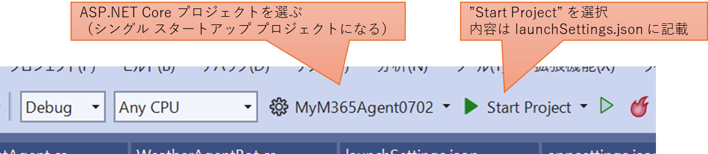

## はじめに

[前回の記事](../mcs2mcp-basic/) では、 Azure 上に構築した MCP サーバーを、 Microsoft Copilot Studio を使用して作成した宣言型エージェントから利用する方法を紹介しました。
エージェントが特定の役割を持つのではなく、ツールを与えることで様々な振る舞いをする、という目的は果たすことができたのですが、
個人的にはいまいち不完全燃焼な部分がありました。

- エージェントの動作確認が Copilot Studio の Web UI からしか出来ないので若干面倒
- オーケストレーターとして使用する LLM が選択できない（GPT-4o）
- 直接 LLM に対してプロンプトを与えた場合と挙動が異なる

だったらエージェントも独自開発しちゃえばいいじゃん、でもフロントエンドに M365 Copilot は使いたいなあ、という悩みがありました。
で、調べていたところ、Microsoft 365 Copilot SDK を使用すると独自作成したエージェントを持ち込むことが出来るようです。

つまりこういうことがしたい。


これまで苦労して開発してきた AI アプリやエージェント、なるべくそのまま Copilot のエージェント ストアに出すことができれば皆に使ってもらいやすくなるのでは。


### 参考情報

本記事を書くにあたって参考にした資料群は以下になります。

- [Bring your agents into Microsoft 365 Copilot](https://learn.microsoft.com/en-us/microsoft-365-copilot/extensibility/bring-agents-to-copilot)
- [Adding a Custom Engine Agent to Microsoft 365 Copilot Chat](https://learn.microsoft.com/en-us/microsoft-365-copilot/extensibility/m365-agents-sdk)

## カスタム エージェント作成して Copilot に公開するまで

基本的には上記の参考情報をなぞっていく形になりますが、大まかな流れとしては以下のようになります。

1. 開発環境を準備する
1. プロジェクト テンプレートをカスタマイズ
1. エージェントのローカルでデバッグ
1. Azure Bot Service を作成して連携する
1. M365 Copilot のエージェントストアに公開する

Copilot のエージェント ストアに公開したいわけですが、作るものが Teams アプリなんですねえ・・・

### 開発環境を準備する

[M365 Copilot SDK](https://learn.microsoft.com/en-us/microsoft-365-copilot/extensibility/m365-agents-sdk) 
のドキュメントを見ると、C#、JavaScript、Python に対応しているようです。
ここは私の愛する C# で行きたいと思います。

開発には Agent Toolkit がオススメされていたので素直にそちらをインストールします。
どこかからダウンロードしてくるわけではなく、Visual Studio Installer の中でコンポーネントを追加してやります。


### プロジェクト テンプレート

プロジェクトの新規作成から `agent` などで検索すると、下図のように Teams アプリが見つかるので、これを使用します。


テンプレートがいくつか選択できますが、`Custom Engine Agent` タグが付いているモノ、ここでは `Weather Agent` を選択します。
このテンプレートは途中で Azure OpenAI のエンドポイントを入力する箇所が出てきますので、新規作成するなり既存のものを流用するなりしてください。
とりあえずは挙動確認がしたいので、無難に GPT-4o あたりがいいでしょうか。


作成すると以下のような２プロジェクト構成のソリューションが出来上がります。

- **M365Agent プロジェクト** : Teams アプリとしてデプロイするためのメタデータや、ローカル デバッグ時のエミュレータのための設定などが入ってます
- **作成時した プロジェクト** : こちらは普通の ASP.NET Core Web API ですが、Azure Bot Service と接続するための構成が出来上がっています


ここで簡単にプロジェクト テンプレートで作成されたコードを確認しておきましょう。

#### 利用している nuget パッケージ

まずは参照しているパッケージを確認すると、M365 Agent SDK っぽい名前 `Microsoft.Agents.*` と Semantic Kernal のパッケージ`Microsoft.SemanticKernel` が含まれていることが分かりますね。

- Azure.Identity
- AdaptiveCards
- Microsoft.SemanticKernel.Agents.AzureAI
- Microsoft.SemanticKernel.Agents.Core
- Microsoft.SemanticKernel.Connectors.AzureOpenAI
- Microsoft.SemanticKernel.Connectors.OpenAI
- Microsoft.Agents.Authentication.Msal
- Microsoft.Agents.Hosting.AspNetCore

ドキュメントには以下のようにありました。
つまり、会話は LLM に委ねられていて、その制御には Semantic Kernel が利用されている、ということでしょうか。

> Microsoft 365 Agents SDK は、Azure Bot Framework SDK の進化形です。Azure Bot Framework は、以前は、開発者がトピック、ダイアログ、メッセージに関する会話型 AI に重点を置いたボットを構築する方法でした。現在、業界の標準は、企業全体にある知識に基づいたジェネレーティブAI機能を使用することです。企業は、会話型エクスペリエンス内からアクションを調整し、質問に答えることができる必要があります。Microsoft 365 Agents SDK は、会話型エージェントの作成と会話管理およびオーケストレーションをまとめた、最新のエージェント開発のための機能を提供します。SDK を使用して構築されたエージェントは、Microsoft 以外のソフトウェアまたはテクノロジで作成されたエージェントを含む、多数の AI サービスやクライアントに接続できます。

#### スタートアップ コード

次にスタートアップコード `Program.cs` を見ていきましょう。
かなり長いので、重要そうなところだけ抜き出すと以下のような感じでしょうか。

```csharp
// 通常の ASP.NET Core アプリと同じ
var builder = WebApplication.CreateBuilder(args);

// Semantic Kernel の登録
builder.Services.AddKernel();

// プロジェクト作成時に入力した Azure OpenAI のパラメータを構成ファイル(apsettings.xxxx.json)から読み込んで登録
builder.Services.AddAzureOpenAIChatCompletion(
    deploymentName: config.Azure.OpenAIDeploymentName,
    endpoint: config.Azure.OpenAIEndpoint,
    apiKey: config.Azure.OpenAIApiKey
);

// これが AI Agent の実態になる部分を登録
builder.Services.AddTransient<WeatherForecastAgent>();

// Azure Bot Service からインバウンド通信が入る時の認可処理を登録
builder.Services.AddBotAspNetAuthentication(builder.Configuration);

// Azure Bot Service と通信するシーケンスを司る部分を登録
builder.AddAgentApplicationOptions();
builder.Services.AddTransient<AgentApplicationOptions>();
builder.AddAgent<MyM365Agent0702.Bot.WeatherAgentBot>();

var app = builder.Build();

// Azure Bot Service からインバウンド通信が入る時ルート /api/messages を登録
// IAgentHttpAdapter を使用して IAgent に中継する
app.MapPost("/api/messages", async (HttpRequest request, HttpResponse response, IAgentHttpAdapter adapter, IAgent agent, CancellationToken cancellationToken) =>
{
    await adapter.ProcessAsync(request, response, agent, cancellationToken);
});

app.Run();
```

API としてのルートは１つしか構成されておらず、それは全て `IAgent` に中継されています。 
ここでは `AddAgent` されている `WeatherAgentBot` がその実装になるわけです。 
あとは各種設定ファイルを書き換えてやれば良さそうですね。

#### IAgent インタフェースの実装

では `WeatherAgentBot` クラスを見てみましょう。
ここも全体像が分かるようにかなり抜粋していますので、詳細は実際に生成されるコードを参照してください。

```csharp
// IAgent インタフェースを実装した AgentApplication クラスを継承している
public class WeatherAgentBot : AgentApplication
{
    public WeatherAgentBot(AgentApplicationOptions options) : base(options)
    {
        // イベントを処理するデリゲートを登録しているところ
        OnConversationUpdate(ConversationUpdateEvents.MembersAdded, WelcomeMessageAsync);
        OnActivity(ActivityTypes.Message, MessageActivityAsync, rank: RouteRank.Last);
    }

    // 会話に人が参加されたときの処理
    protected async Task WelcomeMessageAsync(ITurnContext turnContext, ITurnState turnState, CancellationToken cancellationToken)
    {
        // 最初の挨拶を送信する処理
        await turnContext.SendActivityAsync(
            MessageFactory.Text("Hello and Welcome! I'm here to help with all your weather forecast needs!"), cancellationToken);
    }

    // メッセージの着信、つまりユーザーの発話に対する処理を行う
    protected async Task MessageActivityAsync(ITurnContext turnContext, ITurnState turnState, CancellationToken cancellationToken)
    {
        // Azure Bot Service に入力中であることを送信
        await turnContext.StreamingResponse.QueueInformativeUpdateAsync("Working on a response for you");

        // AI エージェントの実態になる WeatherForecastAgent に処理を転送
        _weatherAgent = new WeatherForecastAgent(_kernel, serviceCollection.BuildServiceProvider());
        WeatherForecastAgentResponse forecastResponse = await _weatherAgent.InvokeAgentAsync(turnContext.Activity.Text, chatHistory);

        // Azure Bot Service に Text ないしは Adaptive Card を送信
        switch (forecastResponse.ContentType)
        {
            case WeatherForecastAgentResponseContentType.Text:
                turnContext.StreamingResponse.QueueTextChunk(forecastResponse.Content);
                break;
            case WeatherForecastAgentResponseContentType.AdaptiveCard:
                turnContext.StreamingResponse.FinalMessage = MessageFactory.Attachment(new Attachment()
                {
                    ContentType = "application/vnd.microsoft.card.adaptive",
                    Content = forecastResponse.Content,
                });
                break;
            default:
                break;
        }

        // Streaming の終了を送信
        await turnContext.StreamingResponse.EndStreamAsync(cancellationToken); // End the streaming response
    }
}
```

大まかに言えば以下のようになるのではないでしょうか。

- 初期化時に OnXXXX メソッドを使用してこのエージェントが対応するイベントのハンドラを登録
- `turnContext` に対して処理を行うことで、エージェントの返信を行うことが出来そう
- `StreamingRepons` に対して `Queue` を入れることで非同期的に返信（同期処理でブロックしない）

#### Agent の実態

では Agent 本体になる部分です。

```csharp
// ごく普通のクラス
public class WeatherForecastAgent
{
    // Semantic Kernel の ChatCompletionAgent
    private readonly ChatCompletionAgent _agent;

    // Agent の名前とプロンプト
    private const string AgentName = "WeatherForecastAgent";
    private const string AgentInstructions = """
        You are a friendly assistant that helps people find a weather forecast for a given time and place.
        ...
        """;

    // 前述の WeatherAgentBot から初期化に使用しているコンストラクタ
    public WeatherForecastAgent(Kernel kernel, IServiceProvider service)
    {
        _kernel = kernel;

        // Semantic Kernel の ChatCompletionAgent を作成
        _agent = new() {...}
    }

    // 前述の WeatherAgentBot から呼び出されている部分
    public async Task<WeatherForecastAgentResponse> InvokeAgentAsync(string input, ChatHistory chatHistory)
    {
        // 会話履歴を復元して Semantic Kernel の ChatCompletionAgent を呼び出し
        await foreach (ChatMessageContent response in this._agent.InvokeAsync(chatHistory, thread: thread))
        { 
            ...        
        }
        // 結果を返す
        return result;
    }
}
```

見てみると基本的には [Semantic Kernal ChatCompletionAgent](https://learn.microsoft.com/ja-jp/semantic-kernel/frameworks/agent/agent-types/chat-completion-agent?pivots=programming-language-csharp) に中継しているだけですね。
なので、Bot としてはここは本質ではなく、自由に使って良いところでしょう。
`WeatherAgentBot` に直接実装しても良さそうですが、このように実装を分離しておく方が何かと都合が良いでしょう。
もし既存の AI エージェントのコードがあるなら、`IAgent` の実装で再利用する形になるんだと思います。

### エージェントのローカル デバッグ

さて、そろそろ動かしてみたいところですね。
Visual Studio なので F5 でデバッグ実行するだけなのですが、一応構成を確認しておきましょう。


このソリューションはマルチ スタートアップ プロジェクトになっていて、先ほどソースコードを解説していた ASP.NET Core 部分をデバッグ実行しつつ、
もう１つのプロジェクトの方で Agent Playground を起動してくれるようです。
選択している構成を確認しつつ デバッグ開始です。


Playground の起動を確認して話しかけると、デバッグ実行されている方の ASP.NET Core プロジェクトの標準出力にログが確認できます。
このログもかなり抜粋していますが、Semantic Kernel に追加したプラグインを使用して現在日付を取得したり、天気予報を取得したり、その結果を LLM でまとめたりしている雰囲気が分かります。


### Azure Bot Service とエージェントを連携する

作成したエージェント（プロジェクト テンプレートのままですが）をエージェント ストアに出品するために、まずは Azure Bot Service を作成してローカルで動くエージェントと接続していきます。
つまり以下のような構成を作っていきます。


#### Azure Bot Service の作成

Azure Bot Service 自体の作成にはそれほどオプションはないですが、ここでは以下のオプションを選択するようにしてください。
ここで設定する Entra ID 登録アプリが、Bot Service であり、作成した .NET アプリであり、後で Teams に登録するアプリを表すことになります。
三位一体といったところでしょうか。

|オプション|設定内容|備考|
|---|---|---|
|アプリの種類|シングルテナント| Entra ID アプリの認証範囲|
|作成の種類|新しい Microsoft アプリ ID の作成| Entra ID にアプリを新規登録する|

#### Service Principal の情報取得して構成ファイルに転記

Azure Bot Service が出来上がると同時に Entra ID にアプリケーションが登録されます。
これは各サービス間が通信する時の認証情報になるのでしっかりと控えておきつつ漏洩には気を付けましょう。

- Azure Bot Service の `構成` メニューを開くと Microsoft App ID とテナント ID が表示されますので、この値を控えておきます
- `パスワードの管理` というリンクがあるので、そちらをクリックするとクライアント シークレットを作成できますので、`新しいクライアント シークレット`を作成して値を控えておきましょう。
- `メッセージング エンドポイント` の値はこのあと作成するトンネルの URL になるので、ここではそのままで良いです。


控えた値を `appsettings.Development.json` に転記していきます。

```json
{
	"TokenValidation": {
        // Guid 値は Entra に登録されたアプリ ID
		"Audiences": [
			"your-guid-of-application-id" 
		]
	},
	"Connections": {
		"BotServiceConnection": {
			"Settings": {
                // 認証をクライアントシークレットで行う
				"AuthType": "ClientSecret", 
                // Guid 値は Entra のテナント ID
				"AuthorityEndpoint": "https://login.microsoftonline.com/your-guid-of-tennant-id",
                // Guid 値は Entra に登録されたアプリ ID
				"ClientId": "your-guid-of-application-id",
                // 作成されたクライアントシークレットの値
				"ClientSecret": "your-client-secret-of-application",
				"Scopes": [
					"https://api.botframework.com/.default"
				]
			}
		}
	},
    // プロジェクト作成時に設定した Azure OpenAI サービスの接続情報
	"Azure": {
		"OpenAIApiKey": "your-api-key",
		"OpenAIEndpoint": "https://resourceName.openai.azure.com",
		"OpenAIDeploymentName": "gpt-4o"
	}
}
```

セキュリティの観点からは本来はユーザーシークレットに保存すべきなのですが、ここでは手を抜いています。
このままソースコード レポジトリに Push してしまわないようにしましょう。

#### エージェントをデバッグ実行して Dev Tunnel をつなぐ

Azure Bot Service はエージェントである ASP.NET Core アプリにメッセージを送信する必要があるのですが、開発端末内のエンドポイントには到達できません。
エンドポイントを公開できるサービス(App Service 等)にホストすると動作確認やデバッグがやりにくいので、開発用トンネルを作成してしまいましょう。

まずはツールバーでデバッグ対象を切り替えます。
`Start Project` というプロファイル情報は、プロジェクトの `Properties/launchSettings.json` ファイルに記載されています。
このなかで環境変数 `ASPNETCORE_ENVIRONMENT` が `Development` に設定されているため、このプロファイルで起動することで、先ほどの `appsettings.Development.json` の設定が使われるわけです。
ここを間違えて `Playground` の設定を使ってしまうと、異なる設定情報で動作することになるので、うまく動きません。
~~しばらくハマりました~~



次に、デバッグ実行するプロジェクトに外部から接続するための、開発トンネルを作成しておきます。
- 名前は適当につけてください。
- トンネルの種類を`永続的`にすると URL が固定されるので、この後の作業はやりやすくなります。
- また、アクセスを`公開用`にすると Dev Tunnel のアクセスには認証を要求されなくなるので、この後の作業がやりやすくなります。


さて長々と設定してきましたが、いよいよデバッグ実行です。
コンソールが起動して ASP.NET Core の Web サーバーが `localhost:5130` で起動して、`Hosting environment` が `Development` に設定されていることが確認できるでしょう。

Visual Studio の `開発トンネル ウィンドウ` を開き、出力ログを表示（ノート見たいなアイコン）すると、開発トンネルが待ち受けている URL が表示されます。
以下のような URL フォーマットになっているはずです。

- https://unique-id.asse.devtunnels.ms

この URL にアクセスしてみると `Weather Bot` と表示されます。
`Program.cs` で `Development` の場合に有効なルートとして登録されていたやつですね。


#### Azure Bot Service からエージェントをテストする

さて先ほど取得した Dev Tunnel の URL のパスに `/api/message` を付与して、Azure Bot Service のメッセージング エンドポイントとして構成しておきます。
`Web チャットでテスト` メニューから動作確認をすることができます。
チャット開始からローカルで動作する ASP.NET Core アプリが呼び出されるのですが、言葉では説明しがたいので動画で。

<video src="./images/bot-service-webchat-demo.mp4" controls="true"></video>

ちょっと気温が凄いことになってますが、と、とりあえず動いたということでご容赦ください。
エージェントの質の向上は本題ではないので・・・

### Copilot のエージェントストアに公開

さて、いよいよ本題です。
といっても Teams アプリとして公開するだけなので、それほど難しくはありません。

#### Azure Bot Service の Teams チャネル構成

まず Bot Service を Teams につなぎます。

1. `チャンネル` メニューを開き、`使用可能なチャネル` から `Microsoft Teams` を選択します
1. サービス条件に同意して、特にオプションの変更せずに `適用` します
1. 接続されているチャネルとして `Microsoft Teams` が表示されます


#### Teams アプリのマニフェストを作成してアップロード

次に Teams アプリを登録するのですが、先に登録情報（マニフェスト）を作成する必要があります。
Visual Studio の `M365Agent` プロジェクト内の `appPackage` ディレクトリに、`manifest.json` と画像ファイルが格納されていると思います。
この `manifest.json` にはいくつか ID 値が記載されていますが、それらを全て前述の Entra ID アプリケーションのクライアント ID 値に書き換えます。
それ以外の表示名、説明、バージョンなども書き換えておくと親切だと思います。

- `id`
- `copilotAgents.customEngineAgents.id`
- `bots.botId`

編集が終わったらこの `appPackage` ディレクトリ内の 3 つのファイルを 1 つの Zip ファイルに固めておいてください。

[Teams の管理センター](https://admin.teams.microsoft.com/) を開き、先ほどの Zip で固めたアプリ マニフェストをアップロードします。
少し時間がかかりますが、以下のように詳細情報が確認できるようになります。


#### Temas や Copilot から試す

反映に少し時間がかかりますが、最初の図のようにエージェントストアに表示されれば成功です。


Teams や Copilot でエージェントと会話してみた結果がこちら。

<video src="./images/cea-via-teams-and-copilot.mp4" controls="true"></video>

### 仕上げ

ここまでくれば、あとはエージェントを開発しつつ、Copilot や Teams からテストしつつ、その挙動を端末上でデバッグしつつ、という一般的な作業になります。
出来上がったエージェントは普通の ASP.NET Core アプリなので、サポートされているホスティング環境にデプロイしてやればよいですね。
ただし Azure Bot Service からメッセージング エンドポイントを叩ける必要があるので、パブリックエンドポイントを持つようにしてあげてください。
Azure App Service や Container Apps なりの PaaS サービスなどがよろしいかなと思います。
デプロイしたら URL の切り替えを忘れずに。

## まとめ

本記事ではプロジェクトテンプレートそのままですが、独自開発したエージェントを Microsoft 365 Copilot と同じようにエージェントとしてユーザーに提供できることを確認できました。
キモになるのは Azure Bot Service で中継してやるところでしょうか。

上記の手順で見た通り、エージェントの実体は、Temas や Copilto 環境にあるのではではなく、Azure Bot Service で指定したメッセージング エンドポイントの先にあります。
つまりエージェントの刷新があったとしても、このエンドポイントの先だけ繋ぎ変えてあげればいいわけですね。
エージェントは運用の中でテレメトリ等を取りつつ LLM、Instruction、Knowledge、Tool などを継続的にチューニング、開発していく DevOps サイクルで育てていくことが重要です。
最近は AgengOps とか言うんでしょうか。
ただし Teams 側は特に何も変える必要がないので、ユーザー影響なくシームレスに切り替えることが出来るわけです。

今回紹介したカスタム エンジン エージェントは、前回の記事で紹介したような Copilot Studio で作る宣言型エージェントに比べてかなり手間がかかるのは事実です。
これはローコードや市民開発とはかけ離れたプロ開発者向けの領域です。
一方で、上記のような AgentOps を継続的に回していくというのは、システムの保守・運用を主業務としてプロ開発者でもない限り現実的でもないと考えます。
そうすると開発自由度が高く、従来からある IT プラクティスが活用できるプロコード開発も良い選択肢になるのではないでしょうか。

そうやって作られたエージェントを、（独自のアプリではなく）ユーザーが日ごろから慣れ親しんでいる（？）M365 Copilot や Teams に組み込んで提供できるアーキテクチャというのはメリットが大きいんじゃないかなと思っています。

