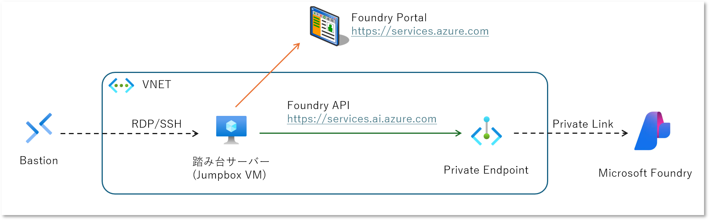
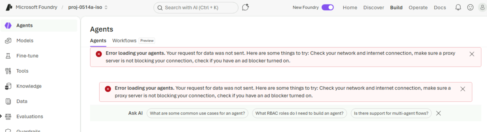
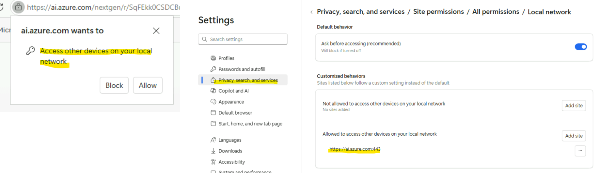
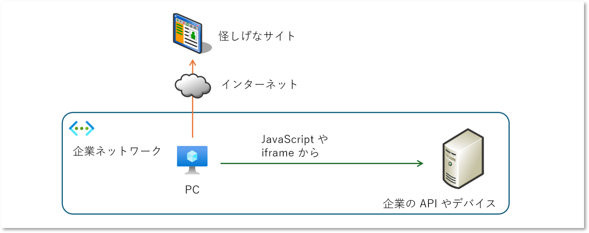
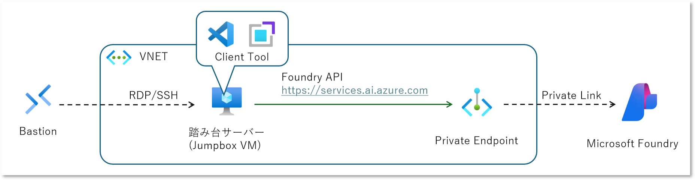
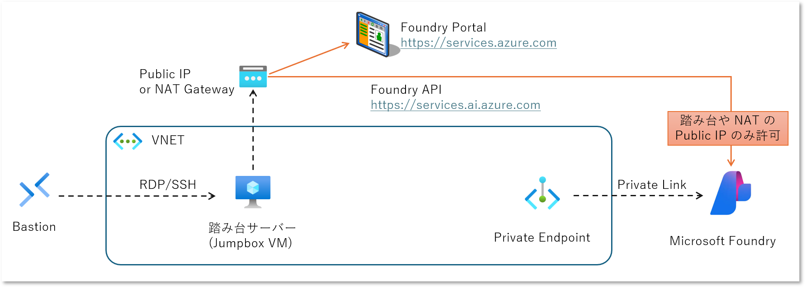

## はじめに

Microsoft Foundry を使用して AI エージェントを作るというのも相応に普及してきたかなという印象ですが、
そうなってくると本番環境の構築という話になってくるわけです。
特に企業さんだと Azure VNET を使用した閉域ネットワーク環境をどう作るか、ということになりがちです。
もちろん Microsoft Foundry も 
[Private Endpoint に対応しています](https://learn.microsoft.com/ja-jp/azure/foundry/agents/how-to/virtual-networks?tabs=portal)ので、
これを使用することでインターネットにアタックサーフェスをさらしたくないということになると思います。
当然パブリック側のエンドポイントは閉じたいでしょうから、そうなってくると 
[Foundry Portal](https://ai.azure.com) の利用が課題になりがちです。

そもそも Azure の PaaS サービスは基本的に API として機能を提供していますが、それを簡易的にお試しできる Web UI もセットで提供されていることがほとんどです。
Foundry なら Foundry Portal がありますし、Cosmos DB や Storage Account のように Azure Portal の中に組み込まれて提供されていることもありますね。
本記事で話題にしたい Foundry Portal は URL のドメインが `ai.azure.com` ですが、Foundry が各種機能を提供する API のドメインは異なります。
つまり Foundry Portal 等からこれらの API を叩くということは、
[CORS : Cross Origin Resource Sharing](https://developer.mozilla.org/ja/docs/Web/HTTP/Guides/CORS) の
問題が発生するわけです。

- _{foundryName}_.services.ai.azure.com
- _{foundryName}_.openai.azure.com
- _{foundryName}_.cognitiveservices.azure.com
- _{regionname}_.stt.speech.microsoft.com
- _{regionname}_.tts.speech.microsoft.com
- api.cognitive.microsofttranslator.com

しかもこれらの、特に最初の３つのドメインを使用する API は Private Endpoint 経由でアクセスすることが強制されているわけですから、
アクセス経路の問題があるわけです。
従来は VNET と VPN や ExpressRoute で閉域接続できるネットワーク環境上のオンプレ端末や、
Azure 仮想マシンおよび Azure Bastion を利用していわゆる「踏み台サーバー」上の Web ブラウザでポータルを開くことで対応してきた方が多いんじゃないでしょうか。



つまりこれは新しい話でもなんでもないんですが久しぶりにハマってしまったというのと、以前とは挙動が変わっていたので従来のような解決策が使えなくなっているということが分かったので、改めて整理しておこうと思います。
~~まあハマってしまったのは僕の不注意と技術力不測の問題ですが~~

## 発生する事象と回避策

さて前述のようなアーキテクチャを組んだうえで、踏み台サーバーから Foundry Portal を開くことが遭遇する事象を確認してみます。

### そもそもインターネットアクセスできない

Foundry Portal のドメインは `ai.azure.com` であり、これは Private Endpoint 構成できません。
つまり仮想マシンからインターネット アクセスというか Public Network 空間での通信になります。
[以前は既定でインターネットアクセスをするための SNAT がありましたが](https://learn.microsoft.com/ja-jp/azure/virtual-network/ip-services/default-outbound-access?tabs=portal)、
現在はこの設定が変わっています。
以前作った環境であれば接続可能な可能性もありますが、これは現在は非推奨であり会社のルールによっては明示的な割り当てが必要ということもあるでしょう。
というわけで、以下のように何らかの対応が必要になってきます。

- 明示的に Public IP アドレスを割り当てる
- ロードバランサーにアウトバウンド規則を割り当てる
- VM が接続するサブネットに NAT Gateway を構成する
- インターネットアクセスが可能な Azure Firewall や仮想アプライアンスにルーティングする

### Local Network Access の制限と緩和

Public Network 経由でのアクセスが可能な状況なら、Foundry Portal を開いて Entra ID 認証を通すことができると思いますが、以下のようなエラーが表示される可能性があります。



これは開発ツール等で通信ログを見るとわかるのですが、CORS と見せかけて LNA : Local Netwoark Access の制限として Google Chrome は 142 、Microsoft Edge は 143 のリリースから仕様となった模様です。
お恥ずかしながら私も詳しくは知らなかったのですが、要は「どこかのページからダウンロードした JavaScript や iframe からプライベート ネットワークやループバック アドレスに通信するのは危ないじゃん？」ということのようです。
リリース時期は 2025 年 10 月下旬らしいので、本記事執筆時点 2026 年 5 月の半年前くらいなので比較的新しいトピックだった模様です。

- [ローカル ネットワークへのアクセスに関する新しい権限プロンプト](https://developer.chrome.com/blog/local-network-access?hl=ja)
- [Microsoft Edge での新しいローカル ネットワーク アクセス制限に Web サイトを適応させる](https://learn.microsoft.com/ja-jp/deployedge/ms-edge-local-network-access)

ちなみに初回アクセスの時は下図左のようなポップアップが出るようです。
Foundry Portal は前述の記事で紹介されていたアクセス許可プロンプトに対応しているってことなんでしょうね。
ここでうっかり Block してしまったりすると 2 度とプロンプトが出てこず、 Foundry Portal で上記のようなエラーが出続けることになります。

その場合は設定画面で Local Network とか検索してみると下図右のように許可／拒否の構成が確認できます。
こちらで Foundry Portal のドメインがどちらに追加されているかを確認してみると良いでしょう。



### [補足] CORS とはちょっと違う

ちなみに昔からある CORS : Cross Origin Resource Sharing の事象に似てはいるのですが、そもそもドメインが違う以前に Private Network へのアクセスなので、CORS の制限よりも優先的に効くようです。
つまり CORS と同様に API 側で Preflight に対応しても効果がありません。
まあそもそも Foundry 側にそんな設定がなさそうですし、
そもそもブラウザレベルで制限されてるわけですから CORS のようにサーバーサイドでの対応は効果がないと考えられます。

## そもそも LNA の緩和は現実的なのか

上記の通り回避策はありますのでそれで終わりでも良いのかもしれませんが、そもそも上記の「許可する」という回避が現実的に正しいのか？という疑問というか懸念があります。

そもそもこの LNA に制限がかかるという仕組み自体は Chrome や Edge でセキュリティ機能の強化として導入されたものです。
Web サイトからダウンロードしたコンテンツが Private Network （今回は Azure の VNET ですが社内ネットワークといえる）内のリソースにアクセスするというのは、本質的にリスクの高い行為と考えます。
それをユーザーが「明示的に許可」することで回避できてしまうわけで、セキュリティがユーザーのリテラシーに依存しているということになります。



今回のケースは Foundry Portal と Foundry API の組み合わせですので ~~Microsoft を信用していれば~~ 信頼性の高い組み合わせですので特に問題がありません。
しかし、これが **悪意のあるサイト** と自社のデバイスや API だった場合は問題ですよね。
リテラシーが高かったとしても Web サイトのコンテンツのソースコードをレビューして、悪意やバグの有無を判断してから利用するということはそうそうないでしょう。
リテラシーが低かった場合には何も考えずに許可してしまうんじゃないでしょうか。
下手すると「こういうダイアログが出たら許可すれば使えるよ」なんていうバッド ノウハウが普及する可能性もあります。

セキュリティ意識の高い企業ならブラウザのバージョンは比較的新しいので LNA 制限はかかるでしょうし、上記のようなユーザー リテラシー依存なリスクを重くみる可能性は十分に考えられるでしょう。
まあ何を言いたいかというと、安全側に倒す方針なら **そもそも上記の設定変更自体が禁止されている** 可能性があるわけです。

というわけで別の回避策も考えておきたいですね。

### そもそも問題なのか？

回避策の前に、そもそもコレ**問題とすべきなんでしょうか？**
Microsoft Foundry の利用開始は Foundry Portal が入口にはなりますが、本格的に LLM や Agent を使いたいなら API として利用しますよね。
上記の通り Foundry Portal が Web アプリだからブラウザの制限に引っかかるんであって、後述のようにアプリから API を直接的に呼び出すなら問題ないのです。

今回のような閉域化構成まで取るようなケースではテスト環境や本番環境の可能性が高いです。
そんな環境で開発者向けの Foundry Portal 、しかも Playground ってどれくらい重要なんでしょうか。
本番環境で動作させるエージェントなのに **Playground で プロンプトや構成を手入力しますか？**
本番環境で利用する LLM なのに **Playground でチャットします？**
使えたら便利かもしれないですけど、使えなくても致命的な問題にはなりにくいと思うんですよね。

つまり問題になるのは **試行錯誤や評価が必要な開発や PoC 環境であっても閉域ネットワーク構成が必要なのに LNA 設定による許可ができない** というセキュリティ制約がキツいケースだと考えます。
この辺は会社のセキュリティポリシーによりますね・・・

### ユーザーコードから Foundry API を直接叩いてしまえ

Foundry の API とは異なる Origin のコンテンツを Web ブラウザで動かしているから問題なので、
裏を返せば自分たちで作ったユーザー コードから叩く分には制限には引っかからないわけです。

例えば以下は C# のサンプルコードです。
このコードが Private Endpoint が設置されたネットワークの VM 上で動くなら、Foundry の API も Private IP アドレスに解決されるだけです。
その他の言語で記述しても、なんなら cURL 等で直接 HTTPS を使用した呼び出しをしても同じです。
Foundry Portal とは全く関係ないですね。

開発や PoC の時にコードで書くのも若干面倒ではありますが、Foundry Portal でやることを API 直接でも実施可能です。
このパターンは本番環境やテスト環境向けに CI/CD パイプラインでエージェントを構築したいケースも考えられます。

```csharp
#:package Azure.AI.Projects@2.0.1
#:package Azure.Identity@1.21.0

using Azure.Identity;
using Azure.AI.Projects;
using Azure.AI.Projects.Agents;

// Foundry Project に接続
var endpoint = new Uri($"https://{foundryName}.services.ai.azure.com/api/projects/{projectName}");
var projClient = new AIProjectClient(endpoint, new DefaultAzureCredential());

// Prompt Agent の定義
var createAgentOption = new ProjectsAgentVersionCreationOptions(
    new DeclarativeAgentDefinition("gpt-4.1"){
        Instructions = "you are helpful agent. please speak in Japanese Roma-ji"
    }
);
// Prompt Agent の作成
var agentAdminm = projClient.AgentAdministrationClient;
var agentVersion = await agentAdminm.CreateAgentVersionAsync(
    $"{agentName}", createAgentOption
);
```

毎回コードで会話するのも面倒ではありますが、まあ本番向けには結局は開発環境でコード書くわけですしね。
試行錯誤したい PoC だとかなり煩わしいですが・・・

```csharp
// Prompt Agent を Responses API で呼び出し
var responseClient = projClient.ProjectOpenAIClient.GetProjectResponsesClientForAgent(agentName);
var response = await responseClient.CreateResponseAsync("Konnichiha");
```

### クライアントツールから叩いてしまえ

ユーザーコードが面倒なら仮想マシン上で動くクライアントから API アクセスしてあげれば良いわけです。
例えば公式ドキュメントで紹介されている Visual Studio Code の [Microsoft Foundry 拡張機能](https://marketplace.visualstudio.com/items?itemName=TeamsDevApp.vscode-ai-foundry)
を使用するという方法が考えられます。
Foundry Portal とは機能差があるでしょうけど、これならコードを書くまでもなく試行錯誤ができそうです。



踏み台サーバーにこういったツールの持ち込みやインストールすること自体が禁止されていたらどうしようもないのですが、開発環境や PoC ならそこまで制限も厳しくないでしょう。

### Foundry 側で特定の Public IP に接続許可してしまえ

おそらくこのパターンが一番現実的なんじゃないかなと思いますが、その管理・運用操作をする端末の IP アドレスだけを許可してしまうという方法です。
そもそも Private Endpoint 自体を構成する必要がなくなってしまうわけですが。



許可する対象は企業環境で使用されているインターネットエッジの IP アドレスでもいいですが、
それだと利用可能な人が多すぎるというなら、前述の踏み台サーバーに割り当てた Public IP アドレスないしは NAT Gateway の Public IP アドレスを許可してしまえばいいわけです。
厳密な意味で閉域ネットワークではない（RFC 1918 で定義されたアドレス空間内ではない）のですが、実質的には閉域として扱っても良いと思います。

## まとめ

ごちゃごちゃと書いてしまいましたが「Private Endpoint を構成した PaaS に対してブラウザベースのポータルを使いたい」という Foundry に限らない、かつ、昔からよくある話でした。
ブラウザのセキュリティ強化によって事象が若干変わりましたが、上記の通り回避策はあります。
ただ以前と若干事情が変わっているということと、セキュリティを落とす方向の回避策はなるべくなら避けたいなと思っています。
