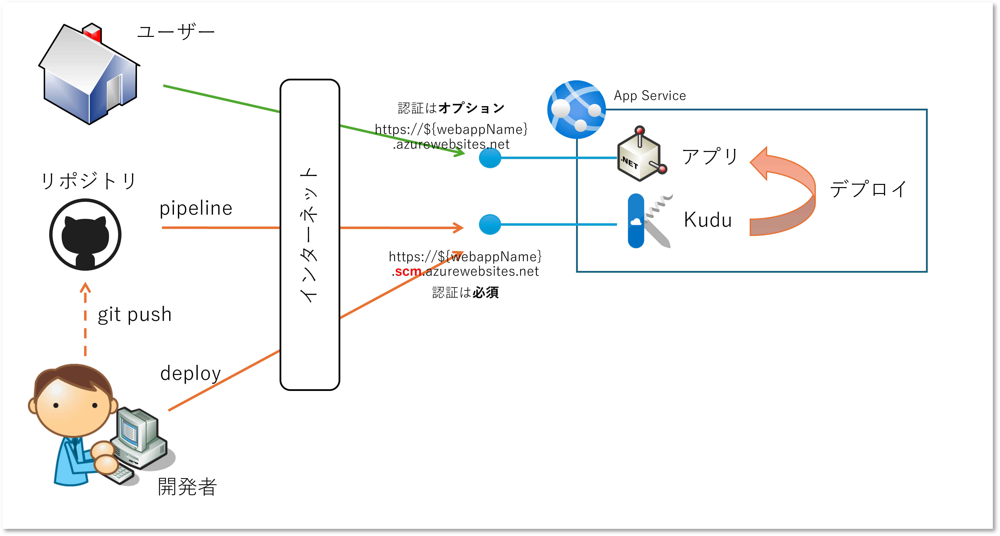
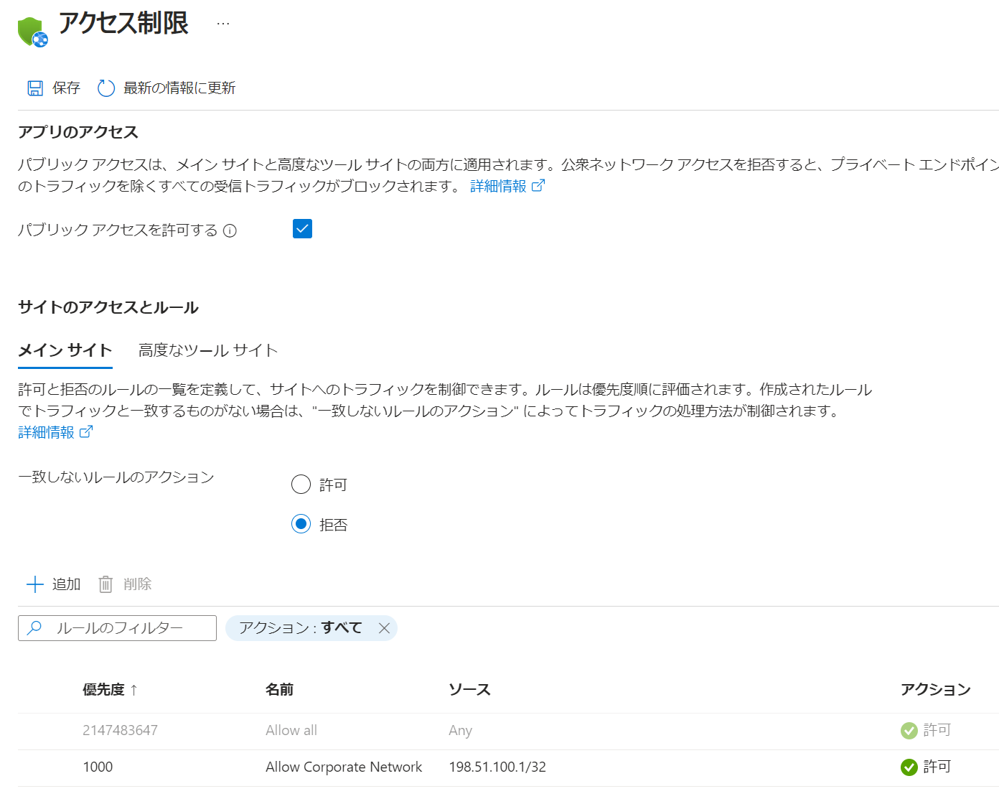
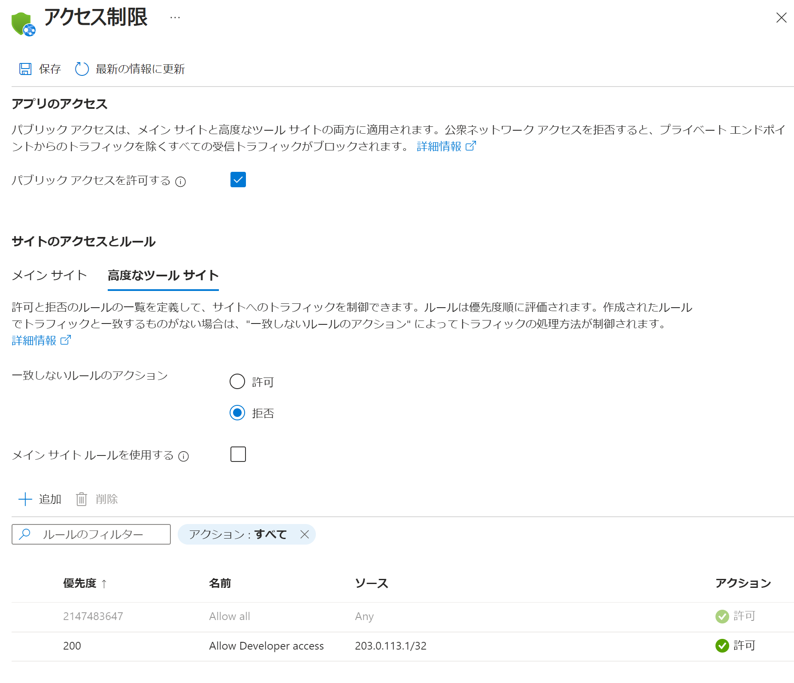
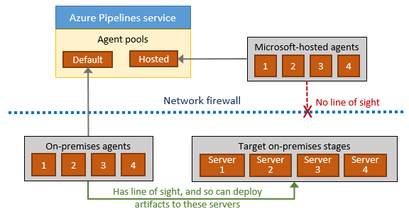
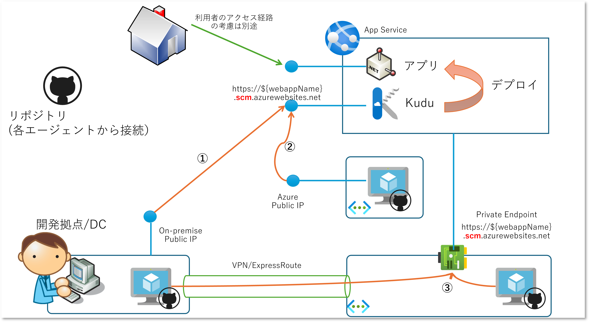

# はじめに

Azure App Service にアプリをデプロイする方法は多種多様にありますが、本格的な利用が進んでいくと 
GitHub Actions や Azure Pipeline などの CI/CD ツールを使ってデプロイすることが多くなると思います。
もちろんそれ以外にも選択肢はたくさんありますが。

一方、特にアプリを社内利用に限定したいようなケースだと、接続元の IP アドレス制限をかけたいという要望が出てくることが非常に多いです。
これは各社でインターネットを利用する際のセキュリティ ルール等で決められており、所属する社員であれば従わなければいけないわけですし、開発者はそのルールに則った設計・実装が責務となります。
このルールを満たすために App Service にネットワークアクセス制御をかけることになるのですが、これはアプリのデプロイにも影響がある可能性があります。

というような相談を割と頻繁に受けますので、あらためて整理しておこうと思った次第です。

# 前提知識

まず Azure App Service をデプロイすると、ユーザー用とアプリデプロイ用の 2 つのエンドポイントが作成されのですが、それぞれ用途が異なります。

- ユーザー用
    - https://{_webAppName_}.azurewebsites.net
    - App Service にデプロイしたアプリや API を利用するためにブラウザやクライアントアプリがアクセスするエンドポイント
    - 既定では認証もかかっておらず、任意のユーザーが匿名でアクセス可能
- デプロイ用
    - https://{_webAppName_}.**scm**.azurewebsites.net
    - 開発者や CI/CD パイプラインが App Service にアプリをデプロイするためのエンドポイント
    - 高度なサイト、Kudu、SCM などと呼ばれる
    - 既定で認証が有効になっており、一定のアクセス権をもつユーザーやアプリのみが利用可能

2 つのエンドポイントに対して３つのアクセス元があり、それぞれについて認証やネットワークアクセス制御を考えていくことになります。
本記事の主題はこのデプロイの方になります。

# ネットワークアクセス制限について

ExpressRoute や VPN 等を使わずにインターネット経由でアクセスする場合には、アクセス元の Public IP アドレスで制限をかけることが一般的かと思います。
開発拠点、CICDパイプライン、ユーザーのアクセス元はそれぞれ異なるネットワークにあるケースが多いのですが、[Azure App Service のアクセス制限を設定する](https://learn.microsoft.com/ja-jp/azure/app-service/app-service-ip-restrictions?tabs=azurecli) というドキュメントに詳細がありますが、ユーザー用とデプロイ用のエンドポイントに対して、それぞれ個別に制限をかけることができます。

## 利用者側（メインサイト）

こっちは本題ではないのですが、まずは分かりやすい方から。
多くの場合は「会社のオフィスなどの特定の IP アドレスからのアクセスのみ許可したい」というホワイトリスト形式で制限をかけたいでしょうから、以下の設定をすることになるかと思います。

|項目|値|備考|
|:--|:--|---|
|パブリックアクセスを許可する|有効|あくまでもインターネットからなのでパブリックアクセスが必要|
|一致しないルールのアクション|拒否|基本はアクセス不可|
|許可ルール|IP アドレスレンジ|想定する利用者の拠点等の IP アドレス（複数指定可能）|

## 開発者側（高度なツールサイト）

こちらもメインサイト側と基本同じなのですが、開発・保守を行う会社や拠点が別だったりすれば許可すべき IP アドレスが異なることも多く、その場合メインサイトと完全に同じ設定にはなりません。
よって以下のような設定になるのではないでしょうか。

|項目|値|備考|
|:--|:--|---|
|パブリックアクセスを許可する|有効|あくまでもインターネットからなのでパブリックアクセスが必要|
|一致しないルールのアクション|拒否|基本はアクセス不可|
|メインサイトルールを使用する|無効|利用者側と完全一致しない想定ならチェックは外す|
|許可ルール|IP アドレスレンジ|想定する利用者の拠点等の IP アドレス（複数指定可能）|

## CI/CD パイプラインはどうする？

さてここからが本題の CI/CD パイプラインです。
これはアプリをデプロイするのが主眼ですので、開発者側と同様に「高度なツールサイト」側で許可してあげないとデプロイが出来ません。

GitHub Actions や Azure Pipeline を一般的な利用手順に沿って利用を始めた場合、その CI/CD の処理は
[GitHub-hosted runner](https://docs.github.com/ja/actions/using-github-hosted-runners/about-github-hosted-runners/about-github-hosted-runners) や
[Microsoft-hosted agent](https://learn.microsoft.com/ja-jp/azure/devops/pipelines/agents/hosted?view=azure-devops&tabs=yaml) 
と呼ばれる、各プロバイダーが管理する実行環境で行われます。
これらは非常に便利なのですが、App Service にデプロイする時に送信元となる **パブリック IP アドレスが特定できません**。

つまり、明示的に許可ルールを追加することができず、「一致しないルールのアクション：拒否」に引っかかりデプロイが出来ないことになります。
さてどうしましょう？

### 認証がかかるからいいじゃないか！

まず先ほどにも書いたように高度なサイト（Kudu）側はネットワーク的には任意のクライアントからアクセス可能ですが、そもそも認証が必須です。
つまり任意のユーザーやアプリが勝手にデプロイしたり、実行環境のファイルやデータを引っこ抜いたり、実行中のアプリや API を破壊することはそう簡単には出来ません。

[デプロイに使用する認証方式](https://learn.microsoft.com/ja-jp/azure/app-service/deploy-authentication-types)は様々ですが、GitHub Actions の場合は以下の３つになります。
より具体的な方法は [GitHub Actions を使用した App Service へのデプロイ](https://learn.microsoft.com/ja-jp/azure/app-service/deploy-github-actions?tabs=applevel) をご確認ください。

- 発行プロファイル
- サービスプリンシパル
- OpenID Connect

ちなみにお勧めは 3 つめの OpenID Connect 方式です。
これは[ワークロード ID フェデレーション](https://learn.microsoft.com/ja-jp/azure/active-directory/workload-identities/workload-identity-federation) を使用するのですが、
Microsoft Entra ID が GitHub の認証を信用する形になるため、開発者が証明書やパスワードといったクレデンシャルを管理しなくて良いので大変便利かつセキュアです。

このアプローチであれば高度なサイト側はネットワーク アクセス制限なしの設定、すなわち「一致しないルールのアクション：許可」ということになります。

以上、と言いたいところですが、、、

### それでもインターネットはヤバいでしょ

前述の発行プロファイルはともかくサービスプリンシパルや OpenID Connect 方式の場合は、Microsoft Entra ID をベースにした認証ですから、インターネット経由で利用する Microsoft 365 相当の認証方式なのですが、
それでも接続元のネットワークが制限できないのは NG というルールの場合もあるでしょう。

その場合は CI/CD パイプラインの実行環境をどうにかして、アクセス元の IP アドレスを特定してやる必要があります。
前述のマネージド環境は使えませんので、GitHub の場合は [Self-hosted runner](https://docs.github.com/ja/actions/hosting-your-own-runners/managing-self-hosted-runners/about-self-hosted-runners)を、
Azure Pipeline の場合は [Self-hosted agent](https://learn.microsoft.com/ja-jp/azure/devops/pipelines/agents/linux-agent?view=azure-devops) を利用することになります。
この Self-Hosted runner/agent は任意の環境にインストールして実行できるアプリですので、正確には利用するというより **IP アドレスが固定できる場所に自前の runner や agent 環境を構築** することになります。

各環境の構築・保守・運用のコストが別途かかることになりますが、仕方ないですね。ルールですから。

上記は [Azure Pipeline の Agent における通信](https://learn.microsoft.com/ja-jp/azure/devops/pipelines/agents/agents?view=azure-devops&tabs=yaml%2Cbrowser) を表していますが、GitHub Actions でも基本的に同様です。
図中の Target on-premises を App Service の高度なサイトとして読み替えてください。
ネットワーク制御が可能な場所に On-premises agents（= Microsoft-hosted agents や GitHub-hosted runner）を自前で構築することで、
App Service の高度なサイトへのアクセス経路を確保し、Network firewall で許可することが可能です。

なお Self-hosted agent や runner は Azure Pipeline や GitHub Actions に対する送信接続（HTTPS）が必要です。
図中では上向きの矢印が該当します。
Pipeline や Actions にはジョブを管理するためのキューがあるため、それをオンプレミス側からチェックして動作するかを判断するためです。
また CD（デプロイ）だけでなく CI（ビルドやコードチェック）なども行う場合には、最新のソースコードをチェックアウトするために、ソースコードリポジトリへのアクセス経路も必要になります。

つまり Self-hosted agent や runner に対して受信接続経路を用意する必要はありません。

### どこでセルフホストする？

さて Self-hosted runner/agent をどこで実行するかですが、以下の３パターンが多いように思います。

#### ① 開発拠点内にあるサーバー

これはインターネット エッジを開発者と共有することになるので、特に追加のルールを管理する必要が無く簡単です。
ただし、そもそもクラウドで開発しているのにオンプレにサーバーを立てるのか？という疑問は拭えません。

この方式の亜種として、調査や検証のために開発端末で動くプロセスやコンテナとして実行するという方法も考えられますね。

#### ② Public IP アドレスを利用する Azure 仮想マシン

Azure (じゃなくてもいいのですが) クラウド上の仮想マシンを runner や agent に仕立てる方法もあります。
デプロイのためだけに Public IP アドレスを自前で用意するのもアレですから、クラウドで調達してしまうのが良いのではないでしょうか。

Azure 仮想マシンであれば以下の方式で Public IP を固定出来ますので、それを許可ルールに追加すればよいでしょう。
Azure 仮想マシンの送信 IP アドレスは若干癖がありますので、詳しくはこちらの[Azure 仮想ネットワークの既定の送信アクセス](https://learn.microsoft.com/ja-jp/azure/virtual-network/ip-services/default-outbound-access)をご参照ください。

- インスタンス レベル Public IP アドレス
- Load Balancer の Public IP アドレス
- NAT Gateway の Public IP アドレス
- Azure Firewall の Public IP アドレス

また仮想マシンが設置されたサブネットにアクセスを制限する、サービスエンドポイント方式も考えられます。
この場合はアクセスする Public IP を固定できず不定にはなりますが、特定のサブネット内からの送信であることは保証されます。

#### ③ 閉域化ネットワーク内の仮想マシン

いやいや Public IP アドレスからのアクセスはそもそもまかりならんぞ！ という場合もあるでしょう。
App Service は [Private Endpoint](https://learn.microsoft.com/ja-jp/azure/app-service/networking/private-endpoint)を構成することで、仮想ネットワーク内に Private IP アドレスによるエンドポイントを設置することが可能です。
ユーザーが利用するアプリケーションがそもそも閉域ネットワークでの利用しか許可されていない、すなわち既に閉域ネットワークが構成されているか構成される予定があるならば、この方式が良いでしょう。
Self-hosted runner や agent は以下の場所で実行することになり、Public IP アドレスの割り当ては不要です。

- 同じ（ないしはピアリングされた）仮想ネットワーク内の仮想マシン
- 仮想ネットワークと VPN や ExpressRoute で接続された社内ネットワーク内のサーバー

### 補足

ネットワークアクセス制限をかけたとしても、デプロイ時の認証が不要になるわけではありませんのでご注意ください。

# まとめ

- App Service にはユーザー用とデプロイ用の 2 つのエンドポイントがあるが、通常はセキュリティ要件が異なため、認証方式やアクセス制御方式は個別に検討することになる
- デプロイ用のエンドポイントはユーザー用とは異なり、パブリック ネットワーク アクセスを許可した状態でも認証によって保護されている
- 認証強度やセキュリティポリシーの観点から必要な場合には、デプロイ用のエンドポイントのネットワーク アクセス制御を検討する
- Azure Pipeline や GitHub Actions を使用したいがネットワーク アクセス制御も必要な場合には、Self-hosted agent / runner を自前で構築・保守・運用する

